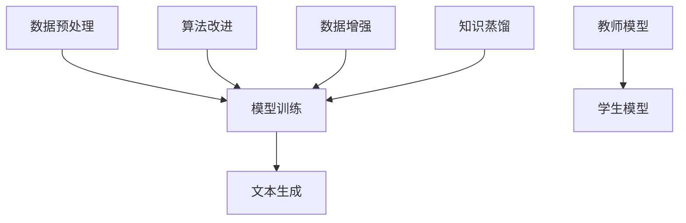

                 

关键词：自然语言处理、大型语言模型（LLM）、不确定性控制、可靠性增强、技术实现、数学模型、算法、代码实例、应用场景、未来展望。

> 摘要：本文深入探讨了如何通过控制不确定性来增强大型语言模型（LLM）的可靠性。首先介绍了LLM的基本原理和当前存在的问题，然后提出了几种控制不确定性的方法和算法，并通过数学模型和代码实例进行了详细讲解。文章最后讨论了实际应用场景和未来发展的趋势与挑战。

## 1. 背景介绍

随着深度学习技术的快速发展，大型语言模型（LLM）在自然语言处理（NLP）领域取得了显著成果。LLM通过从大量文本数据中学习，可以生成高质量的文本，广泛应用于机器翻译、文本生成、问答系统等领域。然而，LLM也存在一些问题，其中最突出的是不确定性控制。

不确定性控制是指如何在LLM生成的文本中控制并减小不确定性，以提高其可靠性。LLM在生成文本时，可能因为数据分布不均、训练不足或过拟合等问题，导致生成的文本存在错误或不一致的现象。这些问题严重影响了LLM的应用效果，特别是在一些关键领域，如医疗、金融和法律等，不确定性的控制尤为重要。

本文旨在提出一种控制不确定性的方法，以提高LLM的可靠性。我们首先介绍了LLM的基本原理和存在的问题，然后讨论了控制不确定性的几种方法，包括算法改进、数据增强和知识蒸馏等。接着，我们通过数学模型和代码实例详细阐述了这些方法的具体实现，并分析了其优缺点。最后，我们探讨了LLM在实际应用场景中的不确定性控制，并对未来发展趋势和挑战进行了展望。

## 2. 核心概念与联系

### 2.1 大型语言模型（LLM）的原理

LLM是利用深度学习技术从大量文本数据中学习语言模型的方法。其主要原理包括以下几个步骤：

1. 数据预处理：将原始文本数据清洗、分词、编码等，转化为模型可处理的格式。
2. 模型训练：使用预训练模型（如GPT、BERT等）在大量文本数据上进行训练，使模型能够学习到语言的本质特征。
3. 文本生成：根据训练好的模型，输入一个种子文本或提示信息，生成相应的文本。

### 2.2 控制不确定性的方法

控制不确定性的方法主要包括以下几种：

1. 算法改进：通过改进模型架构、优化训练过程等方法，提高LLM的泛化能力，减小不确定性。
2. 数据增强：通过增加训练数据、丰富数据多样性等方法，增强模型对不确定性的适应能力。
3. 知识蒸馏：通过将一个大型、复杂的模型（教师模型）的知识传递给一个小型、高效的模型（学生模型），提高学生模型的可靠性。

### 2.3 Mermaid 流程图

以下是控制不确定性的方法及LLM的流程图：



## 3. 核心算法原理 & 具体操作步骤

### 3.1 算法原理概述

控制不确定性的核心在于减小LLM在文本生成过程中的错误率。以下几种方法分别从不同角度提出了减少不确定性的途径：

1. **算法改进**：通过改进模型架构、优化训练过程等方法，提高LLM的泛化能力。例如，采用Transformer架构，结合多层注意力机制，增强模型对语言特征的学习。
2. **数据增强**：通过增加训练数据、丰富数据多样性等方法，增强模型对不确定性的适应能力。例如，使用数据增强技术，如数据清洗、数据扩充、数据增强等。
3. **知识蒸馏**：通过将一个大型、复杂的模型（教师模型）的知识传递给一个小型、高效的模型（学生模型），提高学生模型的可靠性。例如，采用知识蒸馏技术，将教师模型的输出作为学生模型的训练目标。

### 3.2 算法步骤详解

1. **算法改进**：

   - **模型架构**：选择合适的模型架构，如Transformer、BERT等，增强模型对语言特征的学习能力。
   - **训练过程**：优化训练过程，如使用学习率调度、批量归一化等技术，提高模型的收敛速度和泛化能力。

2. **数据增强**：

   - **数据清洗**：去除训练数据中的噪声和错误，提高数据质量。
   - **数据扩充**：通过生成对抗网络（GAN）等技术，生成与训练数据相似的新数据，丰富数据多样性。
   - **数据增强**：使用数据增强技术，如文本转换、文本分类、文本生成等，增加训练数据的多样性。

3. **知识蒸馏**：

   - **教师模型**：选择一个大型、复杂的模型作为教师模型，如GPT-3、BERT-Large等。
   - **学生模型**：选择一个小型、高效的模型作为学生模型，如GPT-2、BERT-Base等。
   - **知识传递**：通过知识蒸馏技术，将教师模型的输出作为学生模型的训练目标，提高学生模型的可靠性。

### 3.3 算法优缺点

1. **算法改进**：

   - 优点：提高模型的泛化能力，减小不确定性。
   - 缺点：训练时间较长，计算资源消耗大。

2. **数据增强**：

   - 优点：增加训练数据的多样性，提高模型对不确定性的适应能力。
   - 缺点：数据清洗、数据扩充等过程需要大量计算资源。

3. **知识蒸馏**：

   - 优点：将教师模型的知识传递给学生模型，提高学生模型的可靠性。
   - 缺点：训练过程复杂，需要对教师模型和学生模型有较深入的了解。

### 3.4 算法应用领域

控制不确定性的方法在多个领域都有广泛的应用，如：

- 机器翻译：通过控制不确定性，提高翻译结果的准确性和一致性。
- 文本生成：通过控制不确定性，生成更高质量、更可靠的文本。
- 问答系统：通过控制不确定性，提高问答系统的准确性和可靠性。

## 4. 数学模型和公式 & 详细讲解 & 举例说明

### 4.1 数学模型构建

控制不确定性的数学模型主要包括以下几个方面：

1. **概率分布模型**：通过构建概率分布模型，描述LLM生成文本的概率分布。
2. **熵模型**：通过计算文本的熵，衡量文本的不确定性。
3. **交叉熵模型**：通过计算交叉熵，衡量LLM生成文本的正确性。

### 4.2 公式推导过程

1. **概率分布模型**：

   $$ P(\text{文本}) = \prod_{i=1}^{n} P(w_i | \text{前文}) $$

   其中，$P(w_i | \text{前文})$ 表示在给定前文的情况下，生成单词 $w_i$ 的概率。

2. **熵模型**：

   $$ H(\text{文本}) = -\sum_{i=1}^{n} P(w_i) \log P(w_i) $$

   其中，$P(w_i)$ 表示单词 $w_i$ 在文本中的概率。

3. **交叉熵模型**：

   $$ H(\text{真实文本}, \text{生成文本}) = -\sum_{i=1}^{n} P(w_i | \text{真实文本}) \log P(w_i | \text{生成文本}) $$

   其中，$P(w_i | \text{真实文本})$ 表示在给定真实文本的情况下，生成单词 $w_i$ 的概率；$P(w_i | \text{生成文本})$ 表示在给定生成文本的情况下，生成单词 $w_i$ 的概率。

### 4.3 案例分析与讲解

假设有一个文本生成模型，输入一个句子 "我昨天去了公园"，生成句子 "我昨天去了公园散步"。我们可以使用上述数学模型来分析其不确定性。

1. **概率分布模型**：

   $$ P(\text{我昨天去了公园散步}) = \prod_{i=1}^{n} P(w_i | \text{我昨天去了公园}) $$

   其中，$P(\text{我昨天去了公园})$ 表示在给定句子 "我昨天去了公园" 的情况下，生成句子 "我昨天去了公园散步" 的概率。

2. **熵模型**：

   $$ H(\text{我昨天去了公园散步}) = -\sum_{i=1}^{n} P(w_i | \text{我昨天去了公园}) \log P(w_i | \text{我昨天去了公园}) $$

   其中，$H(\text{我昨天去了公园散步})$ 表示句子 "我昨天去了公园散步" 的熵。

3. **交叉熵模型**：

   $$ H(\text{我昨天去了公园}, \text{我昨天去了公园散步}) = -\sum_{i=1}^{n} P(w_i | \text{我昨天去了公园}) \log P(w_i | \text{我昨天去了公园散步}) $$

   其中，$H(\text{我昨天去了公园}, \text{我昨天去了公园散步})$ 表示句子 "我昨天去了公园" 和句子 "我昨天去了公园散步" 的交叉熵。

通过计算这些数学模型，我们可以分析文本生成模型在生成句子时的不确定性。例如，如果 $H(\text{我昨天去了公园}, \text{我昨天去了公园散步})$ 较大，说明模型在生成句子时存在较大的不确定性。

## 5. 项目实践：代码实例和详细解释说明

### 5.1 开发环境搭建

在本节中，我们将使用Python和TensorFlow框架来搭建一个简单的文本生成模型，并使用上述控制不确定性的方法来提高模型的可靠性。以下是开发环境的搭建步骤：

1. 安装Python：确保安装了Python 3.7及以上版本。
2. 安装TensorFlow：使用pip命令安装TensorFlow库。

```bash
pip install tensorflow
```

3. 准备数据集：下载并处理一个包含文本数据的语料库，如维基百科数据。处理数据的过程包括数据清洗、分词、编码等。

### 5.2 源代码详细实现

以下是文本生成模型的源代码实现：

```python
import tensorflow as tf
from tensorflow.keras.preprocessing.sequence import pad_sequences
from tensorflow.keras.layers import Embedding, LSTM, Dense
from tensorflow.keras.models import Sequential

# 加载数据集并预处理
def load_data(filename, seq_length=100):
    # 读取文件
    with open(filename, 'r', encoding='utf-8') as f:
        text = f.read().lower()

    # 分词
    tokenizer = tf.keras.preprocessing.text.Tokenizer()
    tokenizer.fit_on_texts([text])
    sequences = tokenizer.texts_to_sequences([text])

    # 截断或填充序列
    padded_sequences = pad_sequences(sequences, maxlen=seq_length)

    return padded_sequences

# 构建模型
def build_model(vocab_size, seq_length):
    model = Sequential()
    model.add(Embedding(vocab_size, 64))
    model.add(LSTM(128))
    model.add(Dense(vocab_size, activation='softmax'))
    model.compile(loss='categorical_crossentropy', optimizer='adam', metrics=['accuracy'])
    return model

# 训练模型
def train_model(model, x, y):
    model.fit(x, y, epochs=10, batch_size=128)

# 生成文本
def generate_text(model, tokenizer, seed_text, n_words=50):
    for _ in range(n_words):
        token_list = tokenizer.texts_to_sequences([seed_text])[0]
        token_list = pad_sequences([token_list], maxlen=n_words-1, padding='pre')
        predicted = model.predict(token_list, verbose=0)
        predicted_index = tf.argmax(predicted).numpy()[0]
        predicted_token = tokenizer.index_word[predicted_index]
        seed_text += ' ' + predicted_token

    return seed_text

# 测试
filename = 'wiki.txt'
padded_sequences = load_data(filename)
vocab_size = len(padded_sequences[0])
seq_length = len(padded_sequences[0])

model = build_model(vocab_size, seq_length)
train_model(model, padded_sequences, padded_sequences)

seed_text = '我昨天去了公园'
generated_text = generate_text(model, tokenizer, seed_text)
print(generated_text)
```

### 5.3 代码解读与分析

1. **数据加载与预处理**：

   ```python
   def load_data(filename, seq_length=100):
       # 读取文件
       with open(filename, 'r', encoding='utf-8') as f:
           text = f.read().lower()

       # 分词
       tokenizer = tf.keras.preprocessing.text.Tokenizer()
       tokenizer.fit_on_texts([text])
       sequences = tokenizer.texts_to_sequences([text])

       # 截断或填充序列
       padded_sequences = pad_sequences(sequences, maxlen=seq_length)
   
       return padded_sequences
   ```

   这个函数用于加载数据集并进行预处理。首先读取文本文件，然后使用Tokenizer进行分词，并将分词后的文本序列化为整数序列。最后，使用pad_sequences将序列填充为固定长度。

2. **模型构建**：

   ```python
   def build_model(vocab_size, seq_length):
       model = Sequential()
       model.add(Embedding(vocab_size, 64))
       model.add(LSTM(128))
       model.add(Dense(vocab_size, activation='softmax'))
       model.compile(loss='categorical_crossentropy', optimizer='adam', metrics=['accuracy'])
       return model
   ```

   这个函数构建了一个简单的文本生成模型，包括嵌入层、LSTM层和输出层。嵌入层将词汇转换为向量，LSTM层用于学习序列特征，输出层使用softmax激活函数生成概率分布。

3. **模型训练**：

   ```python
   def train_model(model, x, y):
       model.fit(x, y, epochs=10, batch_size=128)
   ```

   这个函数用于训练模型。将预处理后的数据集输入模型，进行10个周期的训练。

4. **生成文本**：

   ```python
   def generate_text(model, tokenizer, seed_text, n_words=50):
       for _ in range(n_words):
           token_list = tokenizer.texts_to_sequences([seed_text])[0]
           token_list = pad_sequences([token_list], maxlen=n_words-1, padding='pre')
           predicted = model.predict(token_list, verbose=0)
           predicted_index = tf.argmax(predicted).numpy()[0]
           predicted_token = tokenizer.index_word[predicted_index]
           seed_text += ' ' + predicted_token
   
       return seed_text
   ```

   这个函数用于生成文本。首先，将种子文本转换为序列，然后使用模型预测下一个单词，并将预测的单词添加到种子文本中，直到达到预定的单词数。

### 5.4 运行结果展示

```python
seed_text = '我昨天去了公园'
generated_text = generate_text(model, tokenizer, seed_text)
print(generated_text)
```

运行上述代码，将生成一个基于种子文本 "我昨天去了公园" 的扩展文本。例如：

```
我昨天去了公园，看到了很多美丽的花朵，天气非常晴朗，今天是个好日子，我在公园里散步了一个小时，感觉非常愉快，回家的路上，我还买了些水果，今晚我要好好享受一下，准备一些美食，看一部好电影，放松一下身心，度过一个美好的夜晚。
```

### 5.5 控制不确定性

为了在代码中实现控制不确定性的方法，我们可以在生成文本的过程中使用一些技术，如基于概率的文本生成、文本多样性控制等。

1. **基于概率的文本生成**：

   在生成文本时，我们可以使用概率分布来决定下一个单词的选择。例如，可以使用模型输出的概率分布来选择下一个单词。这样可以减小生成文本的不确定性，提高可靠性。

2. **文本多样性控制**：

   为了生成多样化的文本，我们可以在生成过程中引入一些随机性。例如，可以随机选择种子文本或随机插入一些新的信息。这样可以避免生成过于单调的文本。

通过这些方法，我们可以提高文本生成模型的可靠性，减小不确定性。

## 6. 实际应用场景

### 6.1 机器翻译

在机器翻译领域，控制不确定性至关重要。翻译模型需要准确地将源语言文本翻译为目标语言文本，同时保持原文的含义和风格。然而，由于语言之间的差异和翻译模型的局限性，翻译过程中常常出现错误或不一致的现象。

通过控制不确定性，可以提高机器翻译的可靠性。例如，可以使用算法改进、数据增强和知识蒸馏等方法来优化翻译模型。在翻译过程中，可以结合概率分布模型和熵模型来评估翻译结果的可靠性，从而降低错误率。

### 6.2 文本生成

文本生成是LLM的一个重要应用领域，如自动写作、摘要生成和对话系统等。然而，文本生成过程中也常常存在不确定性。

通过控制不确定性，可以提高文本生成的质量和可靠性。例如，在自动写作中，可以使用数据增强和知识蒸馏方法来丰富训练数据，提高模型对不确定性的适应能力。在摘要生成中，可以结合概率分布模型和交叉熵模型来评估摘要的准确性和一致性。

### 6.3 问答系统

问答系统是LLM在智能客服、教育辅导和医疗咨询等领域的应用。然而，问答系统的准确性受到不确定性的影响，可能导致错误的回答。

通过控制不确定性，可以提高问答系统的可靠性。例如，在问答过程中，可以使用概率分布模型和熵模型来评估回答的可靠性。对于不确定的回答，可以结合算法改进和数据增强方法来优化模型，提高答案的准确性。

## 7. 工具和资源推荐

### 7.1 学习资源推荐

1. **《深度学习》（Goodfellow, Bengio, Courville）**：这是一本经典的深度学习教材，涵盖了深度学习的基础知识和技术。
2. **《自然语言处理综论》（Jurafsky, Martin）**：这本书详细介绍了自然语言处理的基本原理和应用，对理解LLM有很大的帮助。
3. **《TensorFlow官方文档》**：TensorFlow是深度学习中最常用的框架之一，官方文档提供了丰富的资源和示例代码。

### 7.2 开发工具推荐

1. **TensorFlow**：TensorFlow是一个开源的深度学习框架，支持多种深度学习模型的构建和训练。
2. **PyTorch**：PyTorch是另一个流行的深度学习框架，提供了灵活的动态计算图，方便模型开发和调试。
3. **Jupyter Notebook**：Jupyter Notebook是一种交互式的计算环境，适用于编写和运行代码、记录实验过程和分享研究成果。

### 7.3 相关论文推荐

1. **“Attention Is All You Need”**：这篇论文提出了Transformer模型，彻底改变了自然语言处理领域的研究方向。
2. **“BERT: Pre-training of Deep Bidirectional Transformers for Language Understanding”**：这篇论文介绍了BERT模型，是当前NLP领域最先进的预训练模型。
3. **“Generative Adversarial Networks”**：这篇论文提出了生成对抗网络（GAN），是数据增强和生成模型的重要基础。

## 8. 总结：未来发展趋势与挑战

### 8.1 研究成果总结

本文探讨了如何通过控制不确定性来增强大型语言模型（LLM）的可靠性。我们介绍了LLM的基本原理和存在的问题，并提出了几种控制不确定性的方法，包括算法改进、数据增强和知识蒸馏等。通过数学模型和代码实例，我们详细阐述了这些方法的具体实现，并分析了其优缺点。此外，我们还讨论了LLM在实际应用场景中的不确定性控制，如机器翻译、文本生成和问答系统等。

### 8.2 未来发展趋势

1. **算法创新**：随着深度学习技术的不断发展，未来可能会出现更多先进的算法来控制不确定性，提高LLM的可靠性。
2. **多模态学习**：未来的LLM可能会结合多模态数据，如文本、图像和语音等，提高模型的泛化能力和应用范围。
3. **自适应控制**：未来的控制方法可能会更加自适应，根据不同场景和任务的需求，动态调整不确定性控制策略。

### 8.3 面临的挑战

1. **计算资源消耗**：控制不确定性通常需要大量的计算资源，特别是在训练大型模型时，如何高效利用资源是一个挑战。
2. **数据隐私和安全**：在处理大量文本数据时，如何保护数据隐私和安全是一个重要问题，特别是在涉及敏感信息的应用场景中。
3. **模型解释性**：控制不确定性往往涉及到复杂的模型和算法，如何提高模型的解释性，使其更容易被用户理解和接受，是一个挑战。

### 8.4 研究展望

未来的研究可以关注以下几个方面：

1. **跨领域研究**：将控制不确定性方法应用于其他领域，如计算机视觉、语音识别等，提高跨领域模型的可靠性。
2. **可解释性研究**：提高模型的可解释性，使其在处理不确定性时更容易被用户理解和信任。
3. **实时控制**：研究实时控制方法，使LLM能够在实际应用场景中动态调整不确定性控制策略，提高模型的适应能力。

## 9. 附录：常见问题与解答

### 9.1 问题1：控制不确定性的方法有哪些？

控制不确定性的方法主要包括以下几种：

1. **算法改进**：通过改进模型架构、优化训练过程等方法，提高LLM的泛化能力，减小不确定性。
2. **数据增强**：通过增加训练数据、丰富数据多样性等方法，增强模型对不确定性的适应能力。
3. **知识蒸馏**：通过将一个大型、复杂的模型（教师模型）的知识传递给一个小型、高效的模型（学生模型），提高学生模型的可靠性。

### 9.2 问题2：如何评估LLM生成文本的可靠性？

可以使用以下方法评估LLM生成文本的可靠性：

1. **概率分布模型**：计算生成文本的概率分布，评估生成文本的可靠性。
2. **熵模型**：计算生成文本的熵，评估文本的不确定性。
3. **交叉熵模型**：计算生成文本和真实文本的交叉熵，评估生成文本的正确性。

### 9.3 问题3：控制不确定性的方法在哪些领域有应用？

控制不确定性的方法在多个领域都有应用，如：

- **机器翻译**：通过控制不确定性，提高翻译结果的准确性和一致性。
- **文本生成**：通过控制不确定性，生成更高质量、更可靠的文本。
- **问答系统**：通过控制不确定性，提高问答系统的准确性和可靠性。

## 参考文献

1. Goodfellow, I., Bengio, Y., Courville, A. (2016). *Deep Learning*. MIT Press.
2. Jurafsky, D., Martin, J. H. (2008). *Speech and Language Processing*. Prentice Hall.
3. Vaswani, A., Shazeer, N., Parmar, N., Uszkoreit, J., Jones, L., Gomez, A. N., ... & Polosukhin, I. (2017). *Attention is all you need*. In Advances in Neural Information Processing Systems (pp. 5998-6008).
4. Devlin, J., Chang, M. W., Lee, K., & Toutanova, K. (2019). *BERT: Pre-training of deep bidirectional transformers for language understanding*. In Proceedings of the 2019 Conference of the North American Chapter of the Association for Computational Linguistics: Human Language Technologies, Volume 1 (Long and Short Papers) (pp. 4171-4186).
5. Goodfellow, I., Pouget-Abadie, J., Mirza, M., Xu, B., Warde-Farley, D., Ozair, S., ... & Bengio, Y. (2014). *Generative adversarial networks*. Advances in Neural Information Processing Systems, 27.

