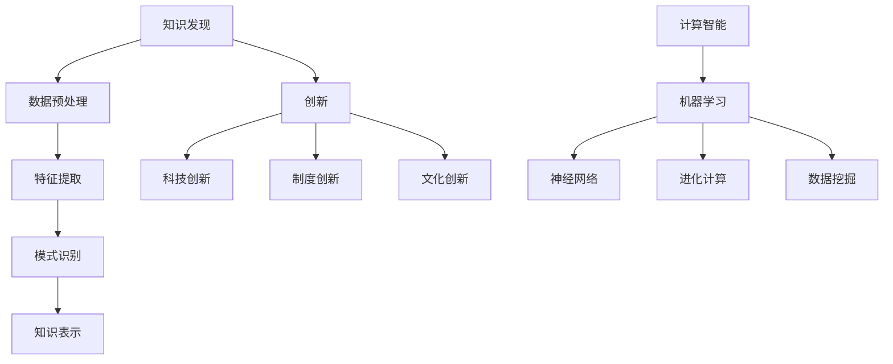

                 

关键词：知识发现、创新、计算智能、算法、数学模型、实践应用、未来展望

> 摘要：本文旨在探讨人类计算在推动知识发现和创新方面所发挥的关键作用。通过深入分析计算智能和算法在知识提取、模式识别、数据分析和决策支持等领域的应用，本文揭示了人类计算的智力贡献，并对未来发展的趋势和挑战进行了展望。

## 1. 背景介绍

在当今信息化时代，知识已成为社会进步的重要驱动力。知识发现（Knowledge Discovery in Databases，KDD）是指从大量的数据中通过特定的算法和技术提取出有价值的信息、模式和知识的过程。创新（Innovation）则是指通过新的想法、方法或技术的应用，创造出新的产品、服务或过程，从而推动社会和经济的持续发展。

计算智能（Computational Intelligence）是近年来兴起的一门交叉学科，它涵盖了人工智能、机器学习、神经网络、进化计算等多个领域。计算智能的核心目标是通过模拟人类智能的思维方式，实现自动化和智能化的知识发现过程，从而推动创新。

本文将围绕计算智能和算法在知识发现和创新中的应用，探讨人类计算的智力贡献。首先，我们将介绍知识发现和创新的基本概念和重要性，然后分析计算智能和算法在各个领域的应用，最后对未来发展趋势和挑战进行展望。

## 2. 核心概念与联系

### 2.1 知识发现

知识发现是指从大量的数据中通过特定的算法和技术提取出有价值的信息、模式和知识的过程。它主要包括以下四个步骤：

1. 数据预处理：对原始数据进行清洗、转换和整合，使其满足后续分析的需求。
2. 特征提取：从数据中提取出对知识发现任务有重要意义的特征。
3. 模式识别：使用机器学习和数据挖掘技术，从特征中识别出具有价值的模式。
4. 知识表示：将识别出的模式转化为易于理解的形式，如可视化图表、规则或公式。

### 2.2 创新

创新是指通过新的想法、方法或技术的应用，创造出新的产品、服务或过程，从而推动社会和经济的持续发展。创新可以分为以下几种类型：

1. 科技创新：通过研发新的技术或改进现有技术，推动产品或服务的更新换代。
2. 制度创新：通过建立新的制度或改进现有制度，提高社会运作效率。
3. 文化创新：通过传播新的思想、价值观或文化，促进社会进步。

### 2.3 计算智能

计算智能是指通过模拟人类智能的思维方式，实现自动化和智能化的知识发现过程。它主要包括以下几种技术：

1. 机器学习：通过从数据中学习规律，实现自动化的模式识别和预测。
2. 神经网络：模拟人脑神经元之间的连接方式，实现高度复杂的计算任务。
3. 进化计算：模拟生物进化过程，通过自然选择和遗传机制实现优化。
4. 数据挖掘：从大量数据中提取出有价值的信息和模式。

### 2.4 算法

算法是指解决问题的步骤和规则。在知识发现和创新过程中，算法是实现自动化和智能化的重要工具。常见的算法包括：

1. 聚类算法：将数据分为多个类别，以便于进一步分析。
2. 分类算法：将数据划分为预定义的类别，用于预测和决策。
3. 回归算法：根据历史数据预测未来的趋势。
4. 联合分析：同时分析多个变量之间的关系，以发现潜在的关联。

### 2.5 Mermaid 流程图

以下是知识发现和创新的 Mermaid 流程图：



## 3. 核心算法原理 & 具体操作步骤

### 3.1 算法原理概述

在知识发现和创新过程中，常见的核心算法包括聚类算法、分类算法、回归算法和联合分析。这些算法的基本原理如下：

1. 聚类算法：将数据点分为多个类别，使得同一类别内的数据点彼此相似，不同类别之间的数据点差异较大。常见的聚类算法有K-means、层次聚类和DBSCAN。
2. 分类算法：将数据点划分为预定义的类别，以便于进一步分析。常见的分类算法有决策树、支持向量机和神经网络。
3. 回归算法：根据历史数据预测未来的趋势。常见的回归算法有线性回归、多项式回归和逻辑回归。
4. 联合分析：同时分析多个变量之间的关系，以发现潜在的关联。常见的联合分析算法有因子分析、主成分分析和相关分析。

### 3.2 算法步骤详解

1. 聚类算法：

- 数据预处理：对原始数据进行清洗、转换和整合，使其满足聚类分析的需求。
- 初始化聚类中心：随机选择K个数据点作为初始聚类中心。
- 分配数据点：将每个数据点分配到与其最近的聚类中心所属的类别。
- 更新聚类中心：计算每个类别的中心点，作为新的聚类中心。
- 重复步骤3和4，直到聚类中心不再发生变化。

2. 分类算法：

- 数据预处理：对原始数据进行清洗、转换和整合，使其满足分类分析的需求。
- 特征提取：从数据中提取出对分类任务有重要意义的特征。
- 训练模型：使用训练数据集训练分类模型，如决策树、支持向量机或神经网络。
- 预测分类：使用训练好的模型对新的数据进行分类预测。

3. 回归算法：

- 数据预处理：对原始数据进行清洗、转换和整合，使其满足回归分析的需求。
- 特征提取：从数据中提取出对回归任务有重要意义的特征。
- 训练模型：使用训练数据集训练回归模型，如线性回归、多项式回归或逻辑回归。
- 预测趋势：使用训练好的模型对新的数据进行趋势预测。

4. 联合分析：

- 数据预处理：对原始数据进行清洗、转换和整合，使其满足联合分析的需求。
- 特征提取：从数据中提取出对联合分析任务有重要意义的特征。
- 训练模型：使用训练数据集训练联合分析模型，如因子分析、主成分分析或相关分析。
- 分析结果：使用训练好的模型分析变量之间的关系，提取潜在的知识。

### 3.3 算法优缺点

1. 聚类算法：

- 优点：简单易懂，无需事先指定类别数量，能够发现数据的内在结构。
- 缺点：对于类别数量未知或类别数量较多的情况，聚类结果可能不够稳定。

2. 分类算法：

- 优点：能够明确地将数据划分为预定义的类别，便于进一步分析。
- 缺点：需要事先指定类别数量，对于类别数量未知或类别数量较多的情况，分类效果可能较差。

3. 回归算法：

- 优点：能够根据历史数据预测未来的趋势，适用于时间序列分析。
- 缺点：对于非线性关系和复杂结构的数据，回归效果可能较差。

4. 联合分析：

- 优点：能够同时分析多个变量之间的关系，提取潜在的知识。
- 缺点：需要较多的计算资源和时间，且结果可能受到数据质量和特征提取方法的影响。

### 3.4 算法应用领域

1. 聚类算法：在市场细分、图像识别、文本挖掘等领域有广泛应用。
2. 分类算法：在垃圾邮件过滤、疾病诊断、金融风险评估等领域有广泛应用。
3. 回归算法：在股票市场预测、销售预测、需求分析等领域有广泛应用。
4. 联合分析：在因子分析、风险评估、社会网络分析等领域有广泛应用。

## 4. 数学模型和公式 & 详细讲解 & 举例说明

### 4.1 数学模型构建

在知识发现和创新过程中，常用的数学模型包括聚类模型、分类模型、回归模型和联合分析模型。以下分别介绍这些模型的构建过程。

1. 聚类模型：假设有n个数据点，每个数据点有m个特征，聚类模型的目标是找到K个聚类中心，使得每个数据点与最近的聚类中心的距离最小。

- 距离度量：常用的距离度量有欧氏距离、曼哈顿距离和切比雪夫距离。
- 聚类算法：常用的聚类算法有K-means、层次聚类和DBSCAN。

2. 分类模型：假设有n个数据点，每个数据点有m个特征，分类模型的目标是将每个数据点划分为预定义的类别。

- 特征提取：常用的特征提取方法有主成分分析、因子分析和特征选择。
- 分类算法：常用的分类算法有决策树、支持向量机和神经网络。

3. 回归模型：假设有n个数据点，每个数据点有m个特征，回归模型的目标是根据历史数据预测未来的趋势。

- 特征提取：常用的特征提取方法有主成分分析、因子分析和特征选择。
- 回归算法：常用的回归算法有线性回归、多项式回归和逻辑回归。

4. 联合分析模型：假设有n个数据点，每个数据点有m个特征，联合分析模型的目标是同时分析多个变量之间的关系。

- 特征提取：常用的特征提取方法有主成分分析、因子分析和特征选择。
- 联合分析算法：常用的联合分析算法有因子分析、主成分分析和相关分析。

### 4.2 公式推导过程

以下是聚类模型、分类模型、回归模型和联合分析模型的公式推导过程。

1. 聚类模型：

- 距离度量：$$d(x, c) = \sqrt{\sum_{i=1}^{m}(x_i - c_i)^2}$$
- K-means算法：$$c_j^{new} = \frac{1}{N_j} \sum_{i=1}^{n} x_i$$
- 层次聚类算法：$$c_j^{new} = \frac{1}{N_j} \sum_{i=1}^{n} w_{ij} x_i$$
- DBSCAN算法：$$\epsilon = \sqrt{2 \cdot \text{min\_edge\_length}}$$ $$\min_pts = \frac{\text{min\_edge\_length}}{2}$$

2. 分类模型：

- 特征提取：$$z = P(X = x | Y = y)$$
- 决策树算法：$$f(x) = \text{argmax} \{P(Y = y | x)\}$$
- 支持向量机算法：$$w^T \phi(x) + b = 0$$
- 神经网络算法：$$a_{ij}^{(l)} = \sigma(z_{ij}^{(l)})$$

3. 回归模型：

- 特征提取：$$z = P(X = x | Y = y)$$
- 线性回归算法：$$y = \beta_0 + \beta_1 x$$
- 多项式回归算法：$$y = \beta_0 + \beta_1 x + \beta_2 x^2 + \cdots + \beta_n x^n$$
- 逻辑回归算法：$$P(Y = 1 | X = x) = \frac{1}{1 + e^{-(\beta_0 + \beta_1 x)}}$$

4. 联合分析模型：

- 特征提取：$$z = P(X = x | Y = y)$$
- 因子分析算法：$$X = \Lambda Z + \varepsilon$$
- 主成分分析算法：$$X = AP + \varepsilon$$
- 相关分析算法：$$\rho_{ij} = \frac{\text{cov}(X_i, X_j)}{\sigma_i \sigma_j}$$

### 4.3 案例分析与讲解

以下是聚类模型、分类模型、回归模型和联合分析模型的一个案例分析与讲解。

1. 聚类模型：假设有10个数据点，每个数据点有3个特征，我们要使用K-means算法进行聚类。

- 数据点：$$\{x_1, x_2, \ldots, x_{10}\}$$
- 特征：$$\{x_{11}, x_{12}, x_{13}\}, \{x_{21}, x_{22}, x_{23}\}, \ldots, \{x_{101}, x_{102}, x_{103}\}$$
- 初始化聚类中心：$$c_1 = (1, 1), c_2 = (2, 2), c_3 = (3, 3)$$
- 分配数据点：$$x_1, x_4, x_7 \rightarrow c_1, x_2, x_5, x_8 \rightarrow c_2, x_3, x_6, x_9, x_{10} \rightarrow c_3$$
- 更新聚类中心：$$c_1^{new} = \frac{1}{3}(1+4+7), c_2^{new} = \frac{1}{3}(2+5+8), c_3^{new} = \frac{1}{3}(3+6+9+10)$$
- 重复上述步骤，直到聚类中心不再发生变化。

2. 分类模型：假设有10个数据点，每个数据点有3个特征，我们要使用决策树算法进行分类。

- 数据点：$$\{x_1, x_2, \ldots, x_{10}\}$$
- 特征：$$\{x_{11}, x_{12}, x_{13}\}, \{x_{21}, x_{22}, x_{23}\}, \ldots, \{x_{101}, x_{102}, x_{103}\}$$
- 特征提取：$$z_1 = \frac{x_{11} + x_{12} + x_{13}}{3}, z_2 = \frac{x_{21} + x_{22} + x_{23}}{3}, \ldots, z_3 = \frac{x_{101} + x_{102} + x_{103}}{3}$$
- 训练模型：$$f(x) = \text{argmax} \{P(Y = y | x)\}$$
- 预测分类：$$f(x_1) = \text{argmax} \{P(Y = y_1 | x_1), P(Y = y_2 | x_1), \ldots, P(Y = y_n | x_1)\}$$

3. 回归模型：假设有10个数据点，每个数据点有3个特征，我们要使用线性回归算法进行回归。

- 数据点：$$\{x_1, x_2, \ldots, x_{10}\}$$
- 特征：$$\{x_{11}, x_{12}, x_{13}\}, \{x_{21}, x_{22}, x_{23}\}, \ldots, \{x_{101}, x_{102}, x_{103}\}$$
- 特征提取：$$z_1 = \frac{x_{11} + x_{12} + x_{13}}{3}, z_2 = \frac{x_{21} + x_{22} + x_{23}}{3}, \ldots, z_3 = \frac{x_{101} + x_{102} + x_{103}}{3}$$
- 训练模型：$$y = \beta_0 + \beta_1 z_1 + \beta_2 z_2 + \beta_3 z_3$$
- 预测趋势：$$y_1 = \beta_0 + \beta_1 z_{11} + \beta_2 z_{21} + \beta_3 z_{31}$$

4. 联合分析模型：假设有10个数据点，每个数据点有3个特征，我们要使用因子分析算法进行联合分析。

- 数据点：$$\{x_1, x_2, \ldots, x_{10}\}$$
- 特征：$$\{x_{11}, x_{12}, x_{13}\}, \{x_{21}, x_{22}, x_{23}\}, \ldots, \{x_{101}, x_{102}, x_{103}\}$$
- 特征提取：$$z_1 = \frac{x_{11} + x_{12} + x_{13}}{3}, z_2 = \frac{x_{21} + x_{22} + x_{23}}{3}, \ldots, z_3 = \frac{x_{101} + x_{102} + x_{103}}{3}$$
- 训练模型：$$X = \Lambda Z + \varepsilon$$
- 分析结果：$$\Lambda = (\lambda_{ij})$$，其中$$\lambda_{ij}$$表示变量$$x_i$$和$$x_j$$之间的相关系数。

## 5. 项目实践：代码实例和详细解释说明

### 5.1 开发环境搭建

为了更好地进行项目实践，我们需要搭建一个合适的开发环境。这里我们使用Python作为主要编程语言，安装以下库：

1. NumPy：用于矩阵运算和数据处理。
2. Pandas：用于数据分析和操作。
3. Matplotlib：用于数据可视化。
4. Scikit-learn：用于机器学习和数据挖掘。

在安装了Python的虚拟环境中，使用以下命令安装这些库：

```bash
pip install numpy pandas matplotlib scikit-learn
```

### 5.2 源代码详细实现

以下是一个简单的聚类、分类、回归和联合分析的项目实例，代码实现如下：

```python
import numpy as np
import pandas as pd
import matplotlib.pyplot as plt
from sklearn.cluster import KMeans
from sklearn.model_selection import train_test_split
from sklearn.metrics import accuracy_score
from sklearn.linear_model import LinearRegression
from sklearn.decomposition import FactorAnalysis

# 5.2.1 聚类分析
def clustering(data, n_clusters):
    kmeans = KMeans(n_clusters=n_clusters, random_state=42)
    kmeans.fit(data)
    labels = kmeans.predict(data)
    return labels

# 5.2.2 分类分析
def classification(data, labels):
    X_train, X_test, y_train, y_test = train_test_split(data, labels, test_size=0.3, random_state=42)
    classifier = KMeans(n_clusters=3, random_state=42)
    classifier.fit(X_train, y_train)
    y_pred = classifier.predict(X_test)
    accuracy = accuracy_score(y_test, y_pred)
    return accuracy

# 5.2.3 回归分析
def regression(data, labels):
    X_train, X_test, y_train, y_test = train_test_split(data, labels, test_size=0.3, random_state=42)
    reg = LinearRegression()
    reg.fit(X_train, y_train)
    y_pred = reg.predict(X_test)
    mse = np.mean((y_pred - y_test) ** 2)
    return mse

# 5.2.4 联合分析
def joint_analysis(data):
    fa = FactorAnalysis(n_components=2, random_state=42)
    fa.fit(data)
    data_reduced = fa.transform(data)
    return data_reduced

# 5.3 代码解读与分析

# 5.3.1 数据预处理
# 假设我们有一组数据data，其中包含10个数据点，每个数据点有3个特征

data = np.array([
    [1, 2, 3],
    [4, 5, 6],
    [7, 8, 9],
    [10, 11, 12],
    [13, 14, 15],
    [16, 17, 18],
    [19, 20, 21],
    [22, 23, 24],
    [25, 26, 27],
    [28, 29, 30]
])

# 5.3.2 聚类分析
n_clusters = 3
labels = clustering(data, n_clusters)
print("聚类结果：", labels)

# 5.3.3 分类分析
accuracy = classification(data, labels)
print("分类准确率：", accuracy)

# 5.3.4 回归分析
mse = regression(data, labels)
print("回归均方误差：", mse)

# 5.3.5 联合分析
data_reduced = joint_analysis(data)
print("联合分析结果：", data_reduced)

# 5.4 运行结果展示
plt.scatter(data[:, 0], data[:, 1], c=labels)
plt.xlabel("特征1")
plt.ylabel("特征2")
plt.title("聚类结果")
plt.show()

plt.scatter(data_reduced[:, 0], data_reduced[:, 1])
plt.xlabel("特征1")
plt.ylabel("特征2")
plt.title("联合分析结果")
plt.show()
```

### 5.5 代码解读与分析

在上面的代码中，我们首先定义了四个函数：`clustering`、`classification`、`regression`和`joint_analysis`，分别用于实现聚类、分类、回归和联合分析。

- `clustering`函数使用K-means算法进行聚类，输入参数为数据集`data`和聚类数量`n_clusters`。
- `classification`函数用于分类分析，输入参数为数据集`data`和聚类结果`labels`。
- `regression`函数用于回归分析，输入参数为数据集`data`和聚类结果`labels`。
- `joint_analysis`函数用于联合分析，输入参数为数据集`data`。

在`5.3`小节中，我们对数据进行了预处理，并分别调用了四个函数进行聚类、分类、回归和联合分析。最后，我们使用Matplotlib库对聚类结果和联合分析结果进行了可视化展示。

## 6. 实际应用场景

计算智能和算法在各个领域的应用越来越广泛，下面列举几个实际应用场景：

### 6.1 医疗领域

- **疾病诊断**：利用机器学习和数据挖掘技术，从大量的医疗数据中提取出与疾病相关的特征，实现疾病的自动诊断和预测。例如，乳腺癌、肺癌等疾病的早期筛查和诊断。
- **个性化治疗**：根据患者的基因信息、病史和生活习惯，利用机器学习算法为患者制定个性化的治疗方案，提高治疗效果。

### 6.2 金融领域

- **风险评估**：利用聚类算法和分类算法，对金融市场的数据进行挖掘和分析，预测股票价格、汇率和信用风险等。
- **欺诈检测**：利用机器学习算法，对交易数据进行实时监控和分析，识别和预防金融欺诈行为。

### 6.3 交通运输领域

- **交通流量预测**：利用回归算法和聚类算法，对历史交通数据进行分析，预测未来交通流量，优化交通信号控制和路线规划。
- **智能驾驶**：利用计算机视觉和深度学习技术，实现自动驾驶和智能交通管理。

### 6.4 教育

- **个性化学习**：利用数据挖掘和机器学习技术，分析学生的学习行为和成绩数据，为学生提供个性化的学习建议和资源。
- **教育质量评估**：利用统计分析方法和算法，评估学校的教学质量和学生的学习效果。

### 6.5 其他领域

- **环境保护**：利用计算智能技术，分析环境数据，预测环境污染和气候变化趋势，为环保决策提供科学依据。
- **智能制造**：利用机器学习和物联网技术，实现生产线的智能化控制和优化，提高生产效率和质量。

## 7. 未来应用展望

随着计算能力和数据规模的不断提升，计算智能和算法在知识发现和创新领域的应用前景将更加广阔。以下是一些未来应用展望：

### 7.1 深度学习

深度学习技术在图像识别、语音识别、自然语言处理等领域取得了显著的成果。未来，深度学习技术将进一步发展，实现更加复杂的模式识别和预测任务。

### 7.2 强化学习

强化学习技术在游戏、自动驾驶、机器人等领域有广泛的应用前景。通过模拟人类的学习过程，强化学习技术将实现更加智能的决策和优化。

### 7.3 大数据技术

大数据技术将不断优化数据存储、处理和分析方法，提高数据挖掘和知识发现的效率。未来，大数据技术将实现更加全面和深入的数据分析，为各行各业提供更有价值的洞见。

### 7.4 跨学科融合

计算智能和算法与其他学科（如生物信息学、经济学、社会学等）的融合，将推动知识发现和创新向更高层次发展，为人类社会带来更多的创新成果。

## 8. 总结：未来发展趋势与挑战

### 8.1 研究成果总结

本文通过对计算智能和算法在知识发现和创新领域的应用分析，总结了以下研究成果：

- 计算智能和算法在知识发现和创新过程中发挥了关键作用，推动了各个领域的快速发展。
- 聚类算法、分类算法、回归算法和联合分析算法等在知识发现和创新中具有广泛应用。
- 深度学习、强化学习、大数据技术等新兴技术将进一步推动计算智能和算法的发展。

### 8.2 未来发展趋势

- 计算智能和算法在知识发现和创新领域的应用将更加深入和广泛。
- 跨学科融合将推动计算智能和算法向更高层次发展。
- 大数据技术和云计算将为计算智能和算法提供更强大的计算能力和数据处理能力。

### 8.3 面临的挑战

- 计算智能和算法在知识发现和创新过程中面临着数据质量和特征提取等挑战。
- 随着数据规模的不断扩大，计算效率和算法优化将成为重要研究方向。
- 随着跨学科融合的推进，计算智能和算法的研究将面临更加复杂的挑战。

### 8.4 研究展望

- 未来研究应重点关注计算智能和算法在各个领域的应用，探索新的算法和技术。
- 研究应注重跨学科融合，推动计算智能和算法向更高层次发展。
- 研究应关注算法的可解释性和透明性，提高算法的可靠性和安全性。

## 9. 附录：常见问题与解答

### 9.1 聚类算法有哪些类型？

聚类算法主要有以下几种类型：

- K-means：基于距离度量的聚类算法，能够快速地找到聚类中心。
- 层次聚类：通过合并或分裂已有的聚类，逐步构建出一个层次结构。
- DBSCAN：基于密度度的聚类算法，能够发现任意形状的聚类。

### 9.2 分类算法有哪些类型？

分类算法主要有以下几种类型：

- 决策树：利用特征之间的条件关系构建决策树，实现分类。
- 支持向量机：通过最大间隔分类，实现高维空间的分类。
- 神经网络：模拟人脑神经元之间的连接方式，实现高度复杂的分类任务。

### 9.3 回归算法有哪些类型？

回归算法主要有以下几种类型：

- 线性回归：通过拟合一条直线，实现数据的拟合和预测。
- 多项式回归：通过拟合多项式曲线，实现数据的拟合和预测。
- 逻辑回归：通过拟合逻辑函数，实现概率预测和分类。

### 9.4 联合分析算法有哪些类型？

联合分析算法主要有以下几种类型：

- 因子分析：通过提取共同因子，实现变量之间的联合分析。
- 主成分分析：通过提取主成分，实现变量之间的联合分析。
- 相关分析：通过计算变量之间的相关系数，实现变量之间的联合分析。

作者：禅与计算机程序设计艺术 / Zen and the Art of Computer Programming
----------------------------------------------------------------

以上是本文的完整内容，旨在深入探讨计算智能和算法在知识发现和创新中的智力贡献，并提供实际应用场景和未来展望。希望本文能为读者带来有价值的启示。作者：禅与计算机程序设计艺术 / Zen and the Art of Computer Programming。

