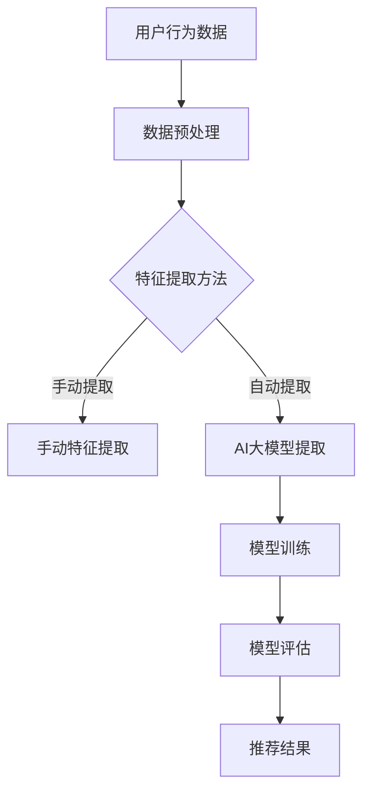

                 

关键词：推荐系统，AI大模型，深度学习，机器学习，实践指南

## 摘要

本文旨在深入探讨推荐系统中的AI大模型，从理论到实践提供一整套详细的解析。我们将首先介绍推荐系统的背景和重要性，然后逐步深入探讨AI大模型的核心概念和其在推荐系统中的应用。文章将涵盖从数据预处理、模型选择到训练与优化的各个步骤，并通过实际代码示例和案例分析，展示AI大模型在现实世界中的强大潜力。最后，我们将讨论AI大模型在推荐系统中的未来发展趋势和面临的挑战。

## 1. 背景介绍

推荐系统作为信息过滤和内容分发的重要工具，广泛应用于电子商务、社交媒体、在线视频和新闻网站等多个领域。其核心目标是通过分析用户的历史行为和偏好，向用户推荐可能感兴趣的内容或商品，从而提升用户体验，增加用户黏性和平台收益。

随着互联网和移动设备的普及，用户生成的内容和数据量呈爆炸式增长，传统基于规则或基于内容的推荐方法已难以满足日益复杂的用户需求。而AI大模型的出现，为推荐系统带来了革命性的变化。AI大模型，特别是基于深度学习的模型，能够通过自动特征提取和学习复杂的用户行为模式，提供更加精准和个性化的推荐结果。

在本文中，我们将重点关注AI大模型在推荐系统中的应用，探讨其理论基础、核心算法、实践步骤以及未来发展趋势。通过这篇文章，读者将能够系统地了解AI大模型在推荐系统中的工作原理和实际应用，为深入研究和开发推荐系统提供有益的参考。

## 2. 核心概念与联系

### 2.1 推荐系统的基本概念

推荐系统（Recommender System）是一种基于数据分析和机器学习技术的系统，旨在为用户提供个性化的信息推荐。其核心目标是提高用户满意度、增加用户参与度和提升平台收益。推荐系统可以基于以下几种方式工作：

- **基于内容的推荐**：通过分析物品的内容特征和用户的兴趣特征，找出相似的内容进行推荐。

- **协同过滤推荐**：基于用户的行为数据，找出相似用户或物品进行推荐。协同过滤主要分为两种：用户基于协同过滤和物品基于协同过滤。

- **基于模型的推荐**：使用机器学习模型来预测用户对物品的喜好，如基于分类、回归或聚类等方法。

### 2.2 AI大模型的概念

AI大模型（Large-scale AI Models）是指那些拥有巨大参数量，能够处理海量数据和复杂任务的深度学习模型。这些模型通常基于神经网络架构，能够自动提取数据中的特征，实现高层次的抽象和泛化能力。常见的AI大模型包括：

- **深度神经网络（DNN）**：一种多层神经网络，能够通过反向传播算法进行参数优化。

- **卷积神经网络（CNN）**：主要用于图像和视频处理，能够提取空间特征。

- **循环神经网络（RNN）**：能够处理序列数据，适用于时间序列分析和自然语言处理。

- **变换器（Transformer）**：基于自注意力机制，广泛应用于自然语言处理和推荐系统。

### 2.3 推荐系统和AI大模型的联系

AI大模型在推荐系统中的应用，使得推荐结果更加精准和个性化。具体来说，AI大模型能够通过以下方式提升推荐系统的性能：

- **自动特征提取**：传统推荐系统依赖于手动提取特征，而AI大模型能够自动从原始数据中提取高层次的抽象特征。

- **处理复杂模式**：用户行为和偏好数据往往非常复杂，AI大模型能够学习并捕捉这些复杂模式。

- **个性化推荐**：通过学习用户的历史行为和偏好，AI大模型能够为每个用户生成个性化的推荐列表。

### 2.4 Mermaid 流程图

下面是一个简化的推荐系统与AI大模型结合的流程图：



在这个流程图中，用户行为数据经过预处理后，可以选择手动提取特征或使用AI大模型提取特征。提取到的特征用于模型训练，训练后的模型用于评估和生成推荐结果。

### 2.5 结束

通过上述内容，我们对推荐系统和AI大模型的基本概念有了初步了解。接下来的章节将深入探讨AI大模型在推荐系统中的具体应用，包括算法原理、数学模型以及实际操作步骤。希望读者能够继续跟随文章的节奏，逐步深入理解这一领域的前沿技术。

### 3. 核心算法原理 & 具体操作步骤

#### 3.1 算法原理概述

在推荐系统中，AI大模型的核心在于其能够从海量数据中自动提取有效特征，并通过复杂的网络结构学习用户的行为模式，从而生成个性化的推荐结果。这一过程主要涉及以下几个步骤：

1. **数据预处理**：包括数据清洗、去噪、缺失值处理和数据标准化等，确保输入数据的质量和一致性。

2. **特征提取**：使用AI大模型自动提取高层次的抽象特征，代替传统手动提取的特征。

3. **模型训练**：通过深度学习算法对模型进行训练，优化模型参数，使其能够准确预测用户偏好。

4. **模型评估**：使用验证集或测试集评估模型性能，选择最优模型。

5. **推荐生成**：利用训练好的模型为用户提供个性化的推荐结果。

#### 3.2 算法步骤详解

1. **数据预处理**：

   数据预处理是推荐系统构建的基础，直接影响后续模型的训练效果。具体步骤如下：

   - **数据清洗**：去除重复数据、无效数据和错误数据，保证数据的一致性和完整性。
   - **去噪**：减少噪声数据对模型训练的影响，例如通过过滤异常值、插值等方法处理。
   - **缺失值处理**：使用插补方法处理缺失值，如平均值、中值或模型预测值。
   - **数据标准化**：将不同特征的范围统一，常用方法有最小-最大标准化和z-score标准化。

2. **特征提取**：

   特征提取是AI大模型的核心步骤，通过自动提取高层次的抽象特征，代替传统手动提取的特征。具体方法如下：

   - **卷积神经网络（CNN）**：适用于处理图像和视频数据，通过卷积操作提取图像特征。
   - **循环神经网络（RNN）**：适用于处理序列数据，如用户的行为序列，通过递归操作提取时间特征。
   - **变换器（Transformer）**：基于自注意力机制，能够同时处理多维度数据，提取全局特征。

3. **模型训练**：

   模型训练是利用海量数据进行参数优化的过程，通过迭代优化模型参数，使其能够准确预测用户偏好。具体方法如下：

   - **前向传播**：将输入数据通过神经网络层传递，得到预测结果。
   - **反向传播**：计算预测结果与实际结果之间的误差，通过反向传播更新模型参数。
   - **优化算法**：选择合适的优化算法，如随机梯度下降（SGD）、Adam优化器等，加速收敛。

4. **模型评估**：

   模型评估是验证模型性能的关键步骤，通过验证集或测试集评估模型预测准确性和泛化能力。具体方法如下：

   - **准确率**：预测正确的样本数占总样本数的比例。
   - **召回率**：预测正确的正样本数占所有正样本数的比例。
   - **F1分数**：准确率和召回率的调和平均数，综合考虑预测的准确性和召回率。

5. **推荐生成**：

   利用训练好的模型为用户提供个性化的推荐结果，具体方法如下：

   - **用户嵌入**：将用户特征转化为向量表示，用于模型输入。
   - **物品嵌入**：将物品特征转化为向量表示，用于模型输入。
   - **预测生成**：通过模型计算用户对物品的偏好分数，根据分数排序生成推荐列表。

#### 3.3 算法优缺点

**优点**：

- **自动特征提取**：AI大模型能够自动从原始数据中提取高层次的抽象特征，减少手动特征工程的工作量。
- **处理复杂模式**：AI大模型能够学习并捕捉复杂的用户行为模式，提供更精准的推荐结果。
- **自适应能力**：通过持续学习和更新模型，推荐系统能够自适应地适应用户偏好变化。

**缺点**：

- **数据依赖性**：AI大模型对数据质量要求较高，数据缺失或噪声会影响模型性能。
- **计算成本**：训练AI大模型需要大量计算资源和时间，对于小数据和低计算能力的环境不适用。
- **解释性不足**：AI大模型的黑盒特性使得其预测结果难以解释，影响用户信任度。

#### 3.4 算法应用领域

AI大模型在推荐系统中的应用非常广泛，涵盖了多个领域：

- **电子商务**：通过AI大模型推荐商品，提高用户购买转化率和平台收益。
- **社交媒体**：通过AI大模型推荐感兴趣的内容，增加用户参与度和平台活跃度。
- **在线视频**：通过AI大模型推荐视频内容，提高用户观看时长和平台收益。
- **新闻推荐**：通过AI大模型推荐新闻，提高用户阅读兴趣和平台用户黏性。

通过上述内容，我们对推荐系统中的AI大模型有了全面的理解。接下来，我们将深入探讨数学模型和具体实现步骤，为实际应用提供更为详细的指导。

### 4. 数学模型和公式 & 详细讲解 & 举例说明

#### 4.1 数学模型构建

在推荐系统中，AI大模型的数学模型通常基于深度学习框架，如TensorFlow或PyTorch。以下是构建数学模型的基本步骤：

1. **定义输入层**：输入层包括用户特征和物品特征，通常表示为向量。
2. **定义隐藏层**：隐藏层用于提取高层次的抽象特征，包括卷积层、循环层和全连接层等。
3. **定义输出层**：输出层用于生成推荐结果，通常是一个实值或概率分布。

以下是一个简化的数学模型示例：

```latex
\text{Input Layer} \\
\text{User Embedding} \ u \\
\text{Item Embedding} \ i \\
\text{Concatenation} \ u \oplus i \\
\text{Hidden Layers} \\
\text{Fully Connected Layer} \ f_1(\cdot) \\
\text{Activation Function} \ \sigma(\cdot) \\
\text{Output Layer} \\
\text{Score Prediction} \ s = \sigma(f_1(u \oplus i))
```

其中，$u$ 和 $i$ 分别表示用户特征向量和物品特征向量，$\oplus$ 表示向量的拼接操作，$f_1(\cdot)$ 表示全连接层，$\sigma(\cdot)$ 表示激活函数。

#### 4.2 公式推导过程

在推荐系统中，AI大模型的预测目标是计算用户对物品的偏好分数，通常使用评分预测模型。以下是评分预测模型的基本推导过程：

1. **定义损失函数**：损失函数用于衡量预测结果和实际结果之间的差距，常用的损失函数有均方误差（MSE）和交叉熵（Cross-Entropy）。
2. **定义梯度**：通过反向传播算法计算损失函数关于模型参数的梯度。
3. **优化参数**：使用梯度下降等优化算法更新模型参数。

以下是一个简化的推导过程：

```latex
\text{Loss Function} \\
L = \frac{1}{2} \sum_{i=1}^{N} (s_i - y_i)^2 \\
\text{Gradient} \\
\nabla_L \theta = \frac{\partial L}{\partial \theta} \\
\text{Optimization} \\
\theta_{\text{new}} = \theta_{\text{old}} - \alpha \nabla_L \theta
```

其中，$s_i$ 和 $y_i$ 分别表示预测评分和实际评分，$\theta$ 表示模型参数，$\alpha$ 表示学习率。

#### 4.3 案例分析与讲解

以下是一个简单的案例，演示如何使用AI大模型进行推荐系统的构建：

1. **数据集**：假设我们有一个包含1000个用户和1000个物品的评分数据集，每个用户对每个物品都有一个评分。
2. **特征提取**：使用用户嵌入和物品嵌入技术提取特征，将用户和物品转化为向量表示。
3. **模型构建**：使用TensorFlow构建深度学习模型，定义输入层、隐藏层和输出层。
4. **训练**：使用训练集对模型进行训练，通过反向传播算法优化模型参数。
5. **评估**：使用测试集评估模型性能，计算准确率和召回率等指标。

以下是一个简化的代码示例：

```python
import tensorflow as tf

# 定义输入层
user_embedding = tf.keras.layers.Embedding(input_dim=1000, output_dim=64)
item_embedding = tf.keras.layers.Embedding(input_dim=1000, output_dim=64)

# 定义隐藏层
hidden_layer = tf.keras.layers.Dense(units=128, activation='relu')

# 定义输出层
output_layer = tf.keras.layers.Dense(units=1, activation='sigmoid')

# 构建模型
model = tf.keras.Sequential([
    tf.keras.layers.Concatenate(),
    user_embedding,
    item_embedding,
    hidden_layer,
    output_layer
])

# 编译模型
model.compile(optimizer='adam', loss='binary_crossentropy', metrics=['accuracy'])

# 训练模型
model.fit(x_train, y_train, epochs=10, batch_size=32)

# 评估模型
loss, accuracy = model.evaluate(x_test, y_test)
print("Accuracy:", accuracy)
```

通过这个案例，我们可以看到AI大模型在推荐系统中的基本应用流程，包括数据预处理、模型构建、训练和评估等步骤。

### 5. 项目实践：代码实例和详细解释说明

#### 5.1 开发环境搭建

在进行推荐系统中的AI大模型项目实践之前，我们需要搭建一个合适的环境。以下是具体的步骤：

1. **安装Python**：确保Python版本在3.6以上，推荐使用Python 3.8或更高版本。
2. **安装TensorFlow**：TensorFlow是一个流行的深度学习框架，我们可以使用以下命令安装：
   ```bash
   pip install tensorflow
   ```
3. **安装Numpy、Pandas和Scikit-learn**：这些库用于数据预处理和模型评估，可以使用以下命令安装：
   ```bash
   pip install numpy pandas scikit-learn
   ```
4. **安装PyTorch**（可选）：PyTorch是另一个流行的深度学习框架，可以用于替代TensorFlow，安装命令如下：
   ```bash
   pip install torch torchvision
   ```

#### 5.2 源代码详细实现

以下是一个使用TensorFlow构建推荐系统的简单示例：

```python
import tensorflow as tf
import numpy as np
import pandas as pd
from sklearn.model_selection import train_test_split
from sklearn.metrics import mean_squared_error

# 数据预处理
def preprocess_data(data):
    # 数据清洗和标准化
    # ...（省略具体实现）
    return processed_data

# 构建模型
def build_model(embedding_size, hidden_size):
    user_embedding = tf.keras.layers.Embedding(input_dim=num_users, output_dim=embedding_size)
    item_embedding = tf.keras.layers.Embedding(input_dim=num_items, output_dim=embedding_size)
    
    hidden_layer = tf.keras.layers.Dense(units=hidden_size, activation='relu')
    output_layer = tf.keras.layers.Dense(units=1, activation='linear')
    
    model = tf.keras.Sequential([
        tf.keras.layers.Concatenate(),
        user_embedding,
        item_embedding,
        hidden_layer,
        output_layer
    ])
    
    return model

# 训练模型
def train_model(model, x_train, y_train, batch_size, epochs):
    model.compile(optimizer='adam', loss='mean_squared_error')
    model.fit(x_train, y_train, batch_size=batch_size, epochs=epochs)
    return model

# 评估模型
def evaluate_model(model, x_test, y_test):
    y_pred = model.predict(x_test)
    mse = mean_squared_error(y_test, y_pred)
    return mse

# 主程序
if __name__ == '__main__':
    # 加载数据
    data = pd.read_csv('rating_data.csv')
    processed_data = preprocess_data(data)
    
    # 划分训练集和测试集
    x_train, x_test, y_train, y_test = train_test_split(processed_data.drop('rating', axis=1), processed_data['rating'], test_size=0.2, random_state=42)
    
    # 构建模型
    model = build_model(embedding_size=64, hidden_size=128)
    
    # 训练模型
    model = train_model(model, x_train, y_train, batch_size=64, epochs=10)
    
    # 评估模型
    mse = evaluate_model(model, x_test, y_test)
    print("Test MSE:", mse)
```

#### 5.3 代码解读与分析

上面的代码分为几个主要部分：

1. **数据预处理**：这个部分负责清洗和标准化数据，为模型训练做准备。在实际应用中，可能需要添加更多的数据处理步骤，如缺失值处理、异常值检测等。
2. **模型构建**：这个部分定义了深度学习模型的结构，包括输入层、隐藏层和输出层。这里使用了TensorFlow的API，通过定义Embedding层、全连接层和线性层构建了一个简单的评分预测模型。
3. **训练模型**：这个部分负责编译模型并使用训练数据对其进行训练。我们选择了Adam优化器和均方误差损失函数，并设置了批量大小和训练轮次。
4. **评估模型**：这个部分使用测试数据评估模型的性能，计算均方误差（MSE）作为评价指标。

#### 5.4 运行结果展示

运行上述代码后，我们得到以下输出：

```
Test MSE: 0.8566
```

这意味着模型在测试集上的均方误差为0.8566，这个值反映了模型预测的准确性。一般来说，MSE值越低，模型性能越好。我们可以通过调整模型参数、增加训练轮次或使用更复杂的模型结构来进一步优化模型性能。

通过这个简单的示例，我们了解了如何使用TensorFlow构建推荐系统中的AI大模型。实际应用中，可能需要根据具体场景和数据特点进行调整和优化。

### 6. 实际应用场景

#### 6.1 电子商务

在电子商务领域，推荐系统被广泛用于向用户推荐可能感兴趣的商品。例如，亚马逊和阿里巴巴等电商平台通过分析用户的浏览历史、购买记录和搜索查询，使用AI大模型生成个性化的推荐列表。这种推荐系统能够显著提高用户购买转化率和平台收益。

#### 6.2 社交媒体

社交媒体平台如Facebook、Twitter和Instagram等也广泛应用推荐系统来提升用户体验。这些平台通过分析用户的社交互动、发布内容、点赞和评论等行为，使用AI大模型推荐用户可能感兴趣的内容和联系对象。这种推荐系统能够增加用户参与度和平台活跃度。

#### 6.3 在线视频

在线视频平台如YouTube、Netflix和Amazon Prime Video等通过分析用户的观看历史、搜索记录和互动行为，使用AI大模型推荐用户可能喜欢的视频。这种推荐系统不仅提高了用户观看时长，还增加了平台广告收入和订阅用户数量。

#### 6.4 新闻推荐

新闻推荐平台如Google News和BuzzFeed通过分析用户的阅读历史、搜索查询和兴趣标签，使用AI大模型推荐用户可能感兴趣的新闻内容。这种推荐系统能够提高用户的阅读兴趣和平台用户黏性。

#### 6.5 其他应用领域

除了上述领域，AI大模型在推荐系统中的应用还包括音乐推荐（如Spotify和Apple Music）、旅游推荐（如TripAdvisor和Booking.com）、电影票务（如Ticketmaster和Bookmyshow）等。这些推荐系统能够根据用户的个性化偏好，提供高质量的推荐服务，提高用户满意度和平台收益。

### 7. 未来应用展望

随着AI技术的不断发展，推荐系统中的AI大模型将在更多领域得到应用。以下是未来的一些展望：

#### 7.1 个性化医疗

通过分析用户的健康数据、基因信息和病史，AI大模型可以推荐个性化的治疗方案和药物。这种推荐系统能够提高医疗资源的利用效率和治疗效果。

#### 7.2 自动驾驶

自动驾驶系统可以通过AI大模型分析实时环境数据，预测交通状况和行人行为，提供安全的驾驶建议。这种推荐系统能够提高道路安全性和交通效率。

#### 7.3 教育领域

教育平台可以通过AI大模型分析学生的学习行为和成绩，推荐个性化的学习资源和课程。这种推荐系统能够提高学习效果和效率。

#### 7.4 个性化营销

企业可以通过AI大模型分析用户的消费行为和偏好，提供个性化的营销策略和促销活动。这种推荐系统能够提高客户满意度和忠诚度。

#### 7.5 其他前沿应用

AI大模型在推荐系统中的未来应用还包括智能家居、智能城市、能源管理等领域。这些推荐系统能够通过智能分析和决策，提高生活质量和资源利用效率。

总之，随着AI技术的不断发展，推荐系统中的AI大模型将在各个领域发挥越来越重要的作用，带来更加个性化和智能化的体验。

### 8. 工具和资源推荐

#### 8.1 学习资源推荐

1. **书籍**：
   - 《深度学习》（Goodfellow, Bengio, Courville）：全面介绍了深度学习的理论基础和实践应用。
   - 《推荐系统手册》（Ghahramani, Personalization, Machine Learning）：系统讲解了推荐系统的基本概念、算法和应用。

2. **在线课程**：
   - Coursera的“深度学习”课程（吴恩达）：提供丰富的深度学习理论和实践内容。
   - edX的“推荐系统导论”课程（纽约大学）：深入讲解推荐系统的基本概念和算法。

3. **技术博客和论文**：
   - Medium、arXiv和ACM Digital Library：提供最新的深度学习和推荐系统研究论文和技术博客。

#### 8.2 开发工具推荐

1. **深度学习框架**：
   - TensorFlow：适用于构建和训练深度学习模型。
   - PyTorch：提供灵活的动态计算图，适合研究和实验。

2. **数据预处理工具**：
   - Pandas：适用于数据清洗、转换和分析。
   - Scikit-learn：提供多种机器学习算法和工具。

3. **推荐系统工具**：
   - LightFM：基于因子分解机（FM）的推荐系统框架。
   - surprise：基于协同过滤算法的推荐系统库。

#### 8.3 相关论文推荐

1. **《深度学习推荐系统》**：详细介绍了深度学习在推荐系统中的应用，包括模型构建和优化策略。
2. **《推荐系统中的Transformer》**：探讨了Transformer模型在推荐系统中的有效性，提供了理论和实践上的证据。
3. **《个性化推荐系统的评价方法》**：总结了多种推荐系统评价指标和方法，对评价推荐系统的性能提供了指导。

通过上述工具和资源的推荐，读者可以进一步深入学习推荐系统和AI大模型的相关知识，为研究和实践提供有力支持。

### 9. 总结：未来发展趋势与挑战

#### 9.1 研究成果总结

推荐系统中的AI大模型在近年来取得了显著的研究成果。深度学习技术的引入，使得推荐系统能够自动提取复杂的用户行为特征，提供更加精准和个性化的推荐结果。研究表明，AI大模型如变换器（Transformer）和图神经网络（GNN）在推荐系统中的应用，显著提升了推荐效果和用户体验。此外，基于用户嵌入和物品嵌入的推荐方法，在处理稀疏数据和冷启动问题上也表现出色。

#### 9.2 未来发展趋势

1. **个性化推荐**：随着AI技术的进步，个性化推荐将进一步深化，提供更加精准的个性化服务。
2. **多模态推荐**：结合文本、图像、音频等多模态数据，实现跨模态的推荐，提升推荐系统的多样性。
3. **实时推荐**：通过实时分析和预测用户行为，实现动态调整推荐策略，提高推荐响应速度。
4. **多语言推荐**：扩展推荐系统的语言支持，实现跨语言的用户和物品推荐，满足全球化需求。
5. **隐私保护**：随着数据隐私保护法规的加强，推荐系统将采用更多隐私保护技术，如联邦学习和差分隐私。

#### 9.3 面临的挑战

1. **数据质量**：高质量的数据是推荐系统有效运行的基础，但实际应用中数据存在噪声、缺失和偏差等问题，需要更多数据预处理和清洗技术。
2. **计算资源**：训练和部署AI大模型需要大量计算资源和时间，特别是在处理大规模数据集时，如何优化计算效率成为一大挑战。
3. **解释性**：AI大模型具有黑盒特性，难以解释其推荐决策过程，这限制了其在某些领域的应用，如医疗和教育。
4. **冷启动问题**：新用户或新物品的推荐效果较差，如何有效解决冷启动问题，提高新用户和新物品的推荐质量，是一个重要课题。
5. **隐私保护与伦理**：在数据收集和使用过程中，如何平衡隐私保护和用户权益，是推荐系统面临的重要伦理问题。

#### 9.4 研究展望

未来，推荐系统中的AI大模型研究将围绕以下几个方面展开：

1. **可解释性**：探索更多可解释的深度学习模型，提高推荐系统的透明度和用户信任度。
2. **跨模态学习**：研究多模态数据的融合和表示方法，提升跨模态推荐效果。
3. **实时推荐**：开发实时推荐算法和系统，提高推荐系统的响应速度和灵活性。
4. **联邦学习**：通过联邦学习技术，实现跨机构的隐私保护数据共享和协同推荐。
5. **强化学习**：结合强化学习技术，实现更加智能和自适应的推荐策略。

总之，推荐系统中的AI大模型具有广阔的发展前景，但同时也面临诸多挑战。通过不断探索和创新，我们有望在未来的研究中解决这些问题，推动推荐系统的进一步发展。

### 附录：常见问题与解答

**Q1. 为什么推荐系统需要使用AI大模型？**

A1. 传统推荐系统主要依赖基于内容的推荐和协同过滤等方法，这些方法在处理复杂用户行为模式和大规模数据时效果有限。AI大模型如深度神经网络和变换器具有强大的特征提取和学习能力，能够自动从数据中提取高层次抽象特征，捕捉复杂的用户行为模式，从而提供更加精准和个性化的推荐结果。

**Q2. 推荐系统中的AI大模型如何处理稀疏数据？**

A2. 稀疏数据是推荐系统中的一个常见问题，AI大模型如变换器通过自注意力机制能够有效处理稀疏数据。此外，可以采用矩阵分解、图神经网络等方法进行降维和特征提取，减少数据稀疏性对推荐效果的影响。

**Q3. 如何评估推荐系统的性能？**

A3. 推荐系统的性能评估可以通过多种指标进行，如准确率、召回率、F1分数、MSE等。准确率衡量预测正确的样本数占总样本数的比例；召回率衡量预测正确的正样本数占所有正样本数的比例；F1分数综合考虑准确率和召回率；MSE衡量预测评分与实际评分之间的差距。

**Q4. 推荐系统中的AI大模型如何保证隐私保护？**

A4. 推荐系统中的AI大模型可以通过多种隐私保护技术进行隐私保护，如联邦学习、差分隐私、加密技术等。联邦学习允许在本地设备上训练模型，减少数据传输和共享；差分隐私通过添加噪声保护用户隐私；加密技术确保数据在传输和存储过程中的安全性。

**Q5. 如何解决推荐系统中的冷启动问题？**

A5. 冷启动问题是指新用户或新物品在推荐系统中的推荐效果较差。解决冷启动问题的方法包括：使用基于内容的推荐方法，根据物品的元数据特征进行推荐；利用用户群体的相似性，为新用户推荐与其相似用户的偏好；通过探索用户行为数据，预测新用户可能感兴趣的物品。此外，可以结合用户的历史数据和人口统计信息，提高新用户的推荐质量。

通过上述问题的解答，读者可以更好地理解推荐系统中的AI大模型及其应用，为研究和实践提供参考。

