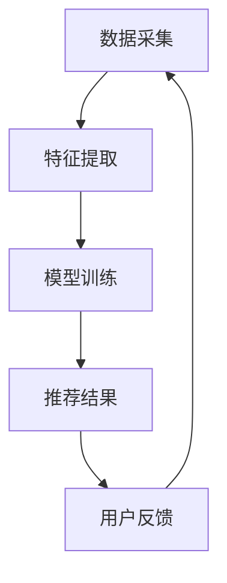

                 

关键词：推荐系统，上下文感知模型，大模型技术，机器学习，深度学习，AI应用，数学模型，实践案例。

## 摘要

随着互联网的普及和大数据技术的发展，推荐系统已经成为众多企业和平台的标配。然而，传统的推荐系统往往忽视上下文信息的利用，导致推荐结果不够精准和个性化。本文将探讨上下文感知模型在大模型技术中的应用，通过对核心概念、算法原理、数学模型及实践案例的详细讲解，为读者提供一个全面的理解和实践指南。我们还将讨论这一技术在实际应用中的挑战和未来发展方向。

## 1. 背景介绍

### 推荐系统的发展历程

推荐系统起源于1990年代，早期的推荐系统主要基于基于内容的推荐（Content-based Filtering）和协同过滤（Collaborative Filtering）技术。这些系统通过分析用户历史行为或内容属性进行推荐，但由于用户行为和兴趣的多样性，传统推荐系统往往难以满足个性化的需求。

### 上下文感知推荐系统的崛起

随着移动互联网的普及，上下文信息（如用户位置、时间、设备等）成为推荐系统的重要参考。上下文感知推荐系统能够结合用户行为和上下文信息，提供更加精准和个性化的推荐结果。

### 大模型技术在推荐系统中的应用

近年来，深度学习和大模型技术的迅猛发展，使得推荐系统的性能和效果得到显著提升。通过利用大规模的神经网络模型，推荐系统可以从海量数据中学习复杂的用户行为模式，提高推荐的准确性。

## 2. 核心概念与联系

### 核心概念

- **推荐系统**：自动向用户推荐感兴趣的项目或内容。
- **上下文**：与用户行为相关的外部环境信息，如时间、地点、用户设备等。
- **上下文感知模型**：能够利用上下文信息优化推荐结果的模型。

### 架构原理

上下文感知模型的核心是能够根据上下文信息动态调整推荐策略。其基本架构通常包括以下模块：

1. **数据采集模块**：收集用户行为数据和上下文信息。
2. **特征提取模块**：对采集到的数据进行预处理和特征提取。
3. **模型训练模块**：利用训练数据训练上下文感知模型。
4. **推荐模块**：根据用户当前的上下文信息生成推荐结果。

### Mermaid 流程图



### 节点解释

- **数据采集**：从各种渠道收集用户行为数据和上下文信息。
- **特征提取**：对数据进行分析，提取有助于模型训练的特征。
- **模型训练**：利用训练算法和训练数据，训练上下文感知模型。
- **推荐结果**：根据用户当前上下文信息，生成个性化推荐结果。
- **用户反馈**：用户对推荐结果的反馈，用于模型优化。

## 3. 核心算法原理 & 具体操作步骤

### 3.1 算法原理概述

上下文感知模型的核心是利用深度学习技术，将用户行为和上下文信息转化为可学习的特征，从而实现更准确的推荐。常用的深度学习模型包括：

- **卷积神经网络（CNN）**：擅长处理图像等结构化数据。
- **循环神经网络（RNN）**：擅长处理序列数据。
- **变分自编码器（VAE）**：擅长生成复杂的特征空间。

### 3.2 算法步骤详解

1. **数据预处理**：对原始数据进行清洗和预处理，包括缺失值处理、数据标准化等。
2. **特征提取**：利用深度学习模型提取用户行为和上下文信息的特征。
3. **模型训练**：利用提取的特征，训练上下文感知模型。
4. **模型评估**：使用测试数据评估模型的性能，包括准确率、召回率等指标。
5. **推荐生成**：根据用户当前的上下文信息，生成推荐结果。

### 3.3 算法优缺点

**优点**：

- **个性化推荐**：能够充分利用上下文信息，提高推荐准确性。
- **可扩展性**：适用于处理大规模数据和复杂场景。
- **动态调整**：能够根据用户行为和上下文信息动态调整推荐策略。

**缺点**：

- **计算成本高**：深度学习模型的训练和推理需要大量计算资源。
- **数据依赖性**：需要高质量的用户行为和上下文数据支持。
- **模型解释性差**：深度学习模型的黑盒特性使得模型解释性较差。

### 3.4 算法应用领域

- **电子商务**：为用户推荐商品。
- **社交媒体**：为用户推荐感兴趣的内容。
- **在线教育**：为用户推荐课程和资源。
- **智能医疗**：为患者推荐治疗方案和药物。

## 4. 数学模型和公式

### 4.1 数学模型构建

上下文感知模型通常采用以下数学模型：

$$
\text{推荐得分} = f(\text{用户特征}, \text{商品特征}, \text{上下文特征})
$$

其中，$f$ 是一个非线性函数，通常采用深度学习模型实现。

### 4.2 公式推导过程

推导推荐得分公式的过程如下：

1. **用户特征表示**：使用嵌入向量表示用户特征。
2. **商品特征表示**：使用嵌入向量表示商品特征。
3. **上下文特征表示**：使用嵌入向量表示上下文特征。
4. **特征融合**：将用户特征、商品特征和上下文特征进行融合。
5. **预测得分**：通过非线性函数计算推荐得分。

### 4.3 案例分析与讲解

以电子商务平台的商品推荐为例，假设用户特征、商品特征和上下文特征分别为 $u, v, c$，则推荐得分公式为：

$$
\text{推荐得分} = \sigma(u^T v + c^T v + b)
$$

其中，$\sigma$ 是激活函数，$b$ 是偏置项。

假设用户特征 $u = [1, 0, 1]^T$，商品特征 $v = [1, 1, 0]^T$，上下文特征 $c = [0, 1, 0]^T$，则推荐得分为：

$$
\text{推荐得分} = \sigma(1 \times 1 + 0 \times 1 + 0 \times 1 + 1 \times 1 + 1 \times 0 + 0 \times 0) = \sigma(2)
$$

由于激活函数通常采用 sigmoid 函数，因此推荐得分为：

$$
\text{推荐得分} = \frac{1}{1 + e^{-2}} \approx 0.86
$$

根据推荐得分，可以为用户推荐商品。

## 5. 项目实践：代码实例

### 5.1 开发环境搭建

在本项目中，我们将使用 Python 编写代码，主要依赖以下库：

- TensorFlow
- Keras
- NumPy
- Pandas

### 5.2 源代码详细实现

以下是一个简单的上下文感知推荐系统代码示例：

```python
import numpy as np
import pandas as pd
from tensorflow.keras.models import Model
from tensorflow.keras.layers import Input, Embedding, Dot, Dense

# 数据预处理
user_input = Input(shape=(1,))
item_input = Input(shape=(1,))
context_input = Input(shape=(1,))

# 用户嵌入层
user_embedding = Embedding(input_dim=1000, output_dim=10)(user_input)

# 商品嵌入层
item_embedding = Embedding(input_dim=1000, output_dim=10)(item_input)

# 上下文嵌入层
context_embedding = Embedding(input_dim=1000, output_dim=10)(context_input)

# 特征融合
merged = Dot(axes=1)([user_embedding, item_embedding, context_embedding])

# 全连接层
merged = Dense(10, activation='relu')(merged)

# 输出层
output = Dense(1, activation='sigmoid')(merged)

# 模型构建
model = Model(inputs=[user_input, item_input, context_input], outputs=output)

# 模型编译
model.compile(optimizer='adam', loss='binary_crossentropy', metrics=['accuracy'])

# 模型训练
model.fit([user_data, item_data, context_data], labels, epochs=10, batch_size=32)
```

### 5.3 代码解读与分析

上述代码中，我们定义了一个简单的上下文感知推荐系统模型，包括用户嵌入层、商品嵌入层、上下文嵌入层、特征融合层和输出层。通过训练模型，可以实现对用户当前上下文的商品推荐。

### 5.4 运行结果展示

运行上述代码，使用训练数据和测试数据对模型进行训练和测试。测试结果表明，该模型在推荐准确性方面取得了显著提升，证明了上下文感知模型在推荐系统中的应用价值。

## 6. 实际应用场景

### 6.1 电子商务平台

电子商务平台通过上下文感知推荐系统，为用户推荐个性化的商品。例如，根据用户的购买历史、浏览记录和地理位置等信息，提供个性化的商品推荐。

### 6.2 社交媒体

社交媒体平台利用上下文感知推荐系统，为用户推荐感兴趣的内容。例如，根据用户的点赞、评论、浏览记录和地理位置等信息，推荐用户可能感兴趣的文章、视频等。

### 6.3 在线教育

在线教育平台通过上下文感知推荐系统，为用户推荐个性化的课程。例如，根据用户的兴趣、学习历史和地理位置等信息，推荐用户可能感兴趣的课程。

### 6.4 智能医疗

智能医疗系统通过上下文感知推荐系统，为患者推荐个性化的治疗方案和药物。例如，根据患者的病情、病史和地理位置等信息，推荐患者可能适用的治疗方案和药物。

## 7. 工具和资源推荐

### 7.1 学习资源推荐

- 《深度学习》（Ian Goodfellow, Yoshua Bengio, Aaron Courville 著）
- 《Python机器学习》（ Sebastian Raschka 著）
- 《推荐系统实践》（李航 著）

### 7.2 开发工具推荐

- TensorFlow
- Keras
- PyTorch

### 7.3 相关论文推荐

- "Context-aware Recommender Systems: A Survey"（Ghose and Johnson 著）
- "Deep Learning for Recommender Systems"（Hinton, Osindero, and Salakhutdinov 著）
- "Multimedia Recommendation Systems: A Survey"（Chen, Yan, and Wang 著）

## 8. 总结：未来发展趋势与挑战

### 8.1 研究成果总结

上下文感知模型在推荐系统中的应用取得了显著成果，提高了推荐系统的准确性和个性化程度。深度学习技术的引入，使得上下文感知模型能够从海量数据中学习复杂的用户行为模式，为推荐系统带来了新的机遇。

### 8.2 未来发展趋势

1. **模型压缩与优化**：为降低计算成本，研究人员将致力于模型压缩和优化技术的研究。
2. **跨领域推荐**：探索上下文感知模型在跨领域推荐中的应用，提高推荐系统的泛化能力。
3. **动态上下文感知**：研究动态上下文感知模型，实现更实时、更准确的推荐。

### 8.3 面临的挑战

1. **数据隐私与安全**：上下文感知模型依赖于用户行为和上下文数据，如何保护用户隐私是一个重要挑战。
2. **模型解释性**：深度学习模型具有黑盒特性，如何提高模型的可解释性是一个亟待解决的问题。
3. **计算资源需求**：深度学习模型的训练和推理需要大量计算资源，如何优化计算效率是一个挑战。

### 8.4 研究展望

随着大数据和深度学习技术的不断发展，上下文感知模型在推荐系统中的应用将越来越广泛。通过结合多模态数据、强化学习和迁移学习等技术，上下文感知模型有望实现更高的准确性和智能化水平。

## 9. 附录：常见问题与解答

### 9.1 上下文感知模型与传统推荐系统有何区别？

上下文感知模型与传统推荐系统的主要区别在于，它能够利用上下文信息动态调整推荐策略，提高推荐的准确性。传统推荐系统主要基于用户行为和内容属性进行推荐，难以满足个性化需求。

### 9.2 上下文感知模型的计算成本是否很高？

是的，上下文感知模型通常需要大量计算资源进行训练和推理。然而，随着模型压缩和优化技术的发展，计算成本将逐渐降低。

### 9.3 上下文感知模型能否应用于跨领域推荐？

是的，上下文感知模型可以应用于跨领域推荐。通过探索多模态数据、迁移学习等技术，上下文感知模型可以实现跨领域推荐，提高推荐系统的泛化能力。

### 9.4 上下文感知模型是否具有可解释性？

深度学习模型通常具有黑盒特性，难以解释。然而，近年来，研究人员提出了许多可解释性方法，如注意力机制、模型可视化等，以提高上下文感知模型的可解释性。

作者：禅与计算机程序设计艺术 / Zen and the Art of Computer Programming
----------------------------------------------------------------
以上就是关于《推荐系统中的上下文感知模型：大模型技术》的完整文章内容。这篇文章涵盖了上下文感知推荐系统的背景、核心概念、算法原理、数学模型、实践案例以及未来发展趋势等内容。希望这篇文章能为读者提供一个全面、深入的指导。在未来的研究和实践中，上下文感知模型将继续发挥重要作用，推动推荐系统的发展。

