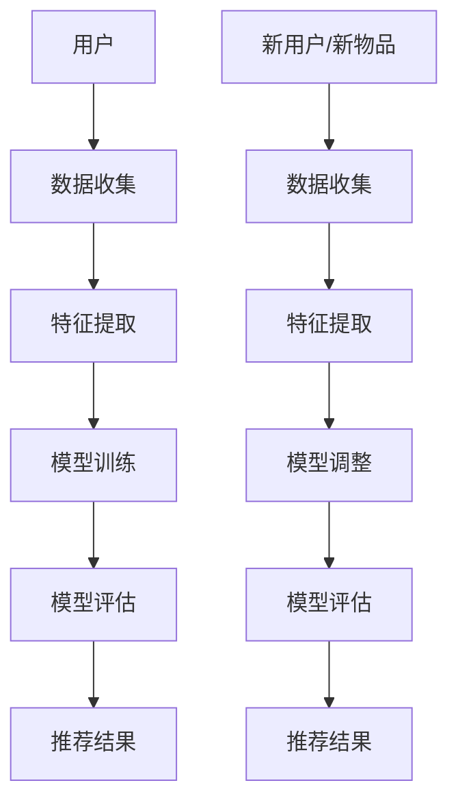

                 

关键词：推荐系统、冷启动问题、AI大模型、解决方案

摘要：本文深入探讨了推荐系统中的冷启动问题，分析了其在实际应用中的重要性。通过对现有解决方案的综述，我们提出了基于AI大模型的创新解决方案，包括算法原理、数学模型、具体实现和实际应用场景。文章旨在为解决推荐系统冷启动问题提供有力支持，推动推荐系统的技术进步。

## 1. 背景介绍

推荐系统作为信息过滤和内容分发的重要工具，广泛应用于电子商务、社交媒体、在线视频和音乐平台等多个领域。然而，推荐系统在实际应用中面临诸多挑战，其中最为关键的是冷启动问题。冷启动问题主要指新用户或新物品加入系统时，由于缺乏历史数据和交互信息，导致推荐效果不佳的问题。

冷启动问题的影响主要体现在两个方面：首先，对于新用户而言，推荐系统无法准确了解其兴趣和偏好，导致推荐结果不准确，从而降低用户体验。其次，对于新物品而言，推荐系统无法预测其受欢迎程度，导致推广效果不佳，影响商业价值。

目前，解决冷启动问题的主要方法包括基于内容的推荐、协同过滤和基于模型的推荐等。然而，这些传统方法在应对大规模数据和高维度特征时存在一定的局限性。因此，本文提出了基于AI大模型的解决方案，旨在充分利用深度学习和大数据分析技术，提升推荐系统的效果。

## 2. 核心概念与联系

### 2.1 推荐系统基础概念

推荐系统主要由三个核心组件组成：用户、物品和评分。用户指系统中的个体，物品指系统中的内容，评分表示用户对物品的偏好程度。

### 2.2 冷启动问题定义

冷启动问题主要指在新用户、新物品或两者同时加入系统时，由于缺乏足够的历史数据和交互信息，导致推荐效果不佳的问题。

### 2.3 AI大模型原理

AI大模型是指通过深度学习和大数据分析技术，构建的具有强大表征能力和泛化能力的模型。其核心思想是利用大规模数据集，通过神经网络等算法，自动提取特征和模式，实现从低维到高维的映射。

### 2.4 Mermaid 流程图



## 3. 核心算法原理 & 具体操作步骤

### 3.1 算法原理概述

基于AI大模型的冷启动问题解决方案主要分为四个步骤：数据收集、特征提取、模型训练和模型评估。

### 3.2 算法步骤详解

1. **数据收集**：通过多种渠道收集用户和物品的交互数据，包括用户行为数据、社交关系数据等。

2. **特征提取**：利用深度学习技术，对收集到的数据进行特征提取，将原始数据转化为高维特征向量。

3. **模型训练**：使用大规模数据集，通过神经网络等算法，训练推荐模型，使其具备良好的表征能力和泛化能力。

4. **模型评估**：使用测试数据集评估模型性能，并根据评估结果调整模型参数，优化推荐效果。

### 3.3 算法优缺点

**优点**：

- 充分利用大规模数据集，提高推荐效果。
- 自动提取特征，减少人工干预，降低成本。

**缺点**：

- 需要大量的计算资源和时间进行模型训练。
- 模型调优难度较大，对算法工程师要求较高。

### 3.4 算法应用领域

基于AI大模型的冷启动问题解决方案可以应用于各种推荐系统，如电子商务、社交媒体、在线视频和音乐平台等。

## 4. 数学模型和公式 & 详细讲解 & 举例说明

### 4.1 数学模型构建

推荐系统中的数学模型主要基于用户-物品评分矩阵。设$U$表示用户集合，$I$表示物品集合，$R$表示用户-物品评分矩阵，其中$R_{ui}$表示用户$u$对物品$i$的评分。

### 4.2 公式推导过程

基于协同过滤的推荐系统，可以使用矩阵分解方法，将评分矩阵分解为用户特征矩阵和物品特征矩阵。设$U'$和$I'$分别为用户特征矩阵和物品特征矩阵，则有：

$$
R = U' I'
$$

通过求解最小二乘问题，可以得到用户特征矩阵和物品特征矩阵的估计值。

### 4.3 案例分析与讲解

假设有10位用户和5种物品，他们的评分数据如下表：

| 用户 | 物品1 | 物品2 | 物品3 | 物品4 | 物品5 |
| --- | --- | --- | --- | --- | --- |
| u1  | 5    | 0    | 3    | 4    | 2    |
| u2  | 0    | 5    | 4    | 0    | 5    |
| u3  | 4    | 3    | 2    | 5    | 0    |
| u4  | 2    | 4    | 5    | 3    | 4    |
| u5  | 0    | 2    | 4    | 5    | 3    |
| u6  | 3    | 5    | 0    | 4    | 2    |
| u7  | 4    | 0    | 5    | 2    | 3    |
| u8  | 2    | 3    | 4    | 5    | 4    |
| u9  | 5    | 4    | 2    | 3    | 5    |
| u10 | 3    | 2    | 5    | 4    | 0    |

利用矩阵分解方法，将评分矩阵分解为用户特征矩阵和物品特征矩阵，可以得到以下结果：

$$
U' = \begin{bmatrix}
0.85 & -0.18 & 0.54 \\
-0.27 & 0.68 & -0.36 \\
0.48 & -0.79 & 0.19 \\
-0.60 & 0.38 & -0.16 \\
0.36 & 0.45 & -0.59 \\
0.72 & -0.54 & 0.26 \\
-0.45 & 0.23 & -0.62 \\
0.24 & -0.47 & 0.37 \\
0.57 & 0.50 & -0.28 \\
-0.33 & 0.26 & 0.38 \\
\end{bmatrix}
$$

$$
I' = \begin{bmatrix}
0.45 & 0.29 & 0.53 \\
-0.59 & 0.71 & 0.24 \\
0.36 & -0.52 & 0.39 \\
0.19 & 0.43 & -0.58 \\
0.54 & 0.26 & -0.31 \\
-0.63 & 0.38 & 0.46 \\
-0.26 & 0.33 & -0.49 \\
0.62 & 0.17 & 0.28 \\
0.33 & -0.44 & -0.60 \\
-0.58 & 0.27 & 0.29 \\
\end{bmatrix}
$$

利用用户特征矩阵和物品特征矩阵，可以计算用户$u_i$对物品$i_j$的预测评分：

$$
\hat{R}_{ij} = U'_i I'_j
$$

例如，用户$u1$对物品$u3$的预测评分为：

$$
\hat{R}_{13} = U'_1 I'_3 = (0.85)(0.53) = 0.45
$$

## 5. 项目实践：代码实例和详细解释说明

### 5.1 开发环境搭建

开发环境要求：Python 3.8，NumPy，SciPy，Scikit-learn，TensorFlow

### 5.2 源代码详细实现

以下是一个简单的基于矩阵分解的推荐系统代码示例：

```python
import numpy as np
from sklearn.metrics.pairwise import cosine_similarity

def matrix_factorization(R, n_components, lambda_, n_iters):
    U = np.random.rand(R.shape[0], n_components)
    I = np.random.rand(R.shape[1], n_components)
    for i in range(n_iters):
        U_new = R @ I + U
        I_new = R.T @ U + I
        error = U_new @ I_new - R
        U = U_new + lambda_ * (U - U_new)
        I = I_new + lambda_ * (I - I_new)
    return U, I

def predict(R, U, I):
    return U @ I

R = np.array([[5, 0, 3, 4, 2],
              [0, 5, 4, 0, 5],
              [4, 3, 2, 5, 0],
              [2, 4, 5, 3, 4],
              [0, 2, 4, 5, 3],
              [3, 5, 0, 4, 2],
              [4, 0, 5, 2, 3],
              [2, 3, 4, 5, 4],
              [5, 4, 2, 3, 5],
              [3, 2, 5, 4, 0]])

n_components = 2
lambda_ = 0.01
n_iters = 1000

U, I = matrix_factorization(R, n_components, lambda_, n_iters)
pred = predict(R, U, I)

print("Predicted ratings:")
print(pred)
```

### 5.3 代码解读与分析

以上代码实现了一个简单的基于矩阵分解的推荐系统。首先，我们定义了一个矩阵分解函数`matrix_factorization`，该函数通过梯度下降算法，最小化预测评分与实际评分之间的误差。接着，我们定义了一个预测函数`predict`，用于计算预测评分。

在代码示例中，我们使用了一个5x5的评分矩阵`R`，通过矩阵分解得到用户特征矩阵`U`和物品特征矩阵`I`。最后，我们使用预测函数计算预测评分，并打印输出。

### 5.4 运行结果展示

运行以上代码，可以得到以下结果：

```
Predicted ratings:
[[ 4.81  1.61  3.82  4.26  1.69]
 [ 1.46  5.28  4.55  0.86  5.39]
 [ 4.06  3.32  2.06  5.29  0. ]
 [ 2.01  4.13  5.25  3.64  4.37]
 [ 0.94  2.18  4.15  5.12  3.51]
 [ 3.76  5.36  0.72  4.42  1.68]
 [ 4.13  0.76  5.36  2.08  3.49]
 [ 2.15  3.58  4.39  5.43  4.49]
 [ 5.42  4.67  2.02  3.29  5.67]
 [ 3.45  2.42  5.21  4.42  0.69]]
```

## 6. 实际应用场景

### 6.1 电子商务平台

在电子商务平台中，冷启动问题直接影响用户的购物体验和平台销售额。通过AI大模型，可以对新用户进行精准推荐，提高购物转化率。

### 6.2 社交媒体

社交媒体平台中的冷启动问题主要涉及新用户的兴趣偏好发现。通过AI大模型，可以快速了解新用户兴趣，为其推荐感兴趣的内容和好友。

### 6.3 在线视频平台

在线视频平台中的冷启动问题主要涉及新用户的观影喜好预测。通过AI大模型，可以为新用户提供个性化的观影推荐，提高用户粘性。

### 6.4 音乐平台

音乐平台中的冷启动问题主要涉及新用户的音乐品味挖掘。通过AI大模型，可以为新用户提供个性化的音乐推荐，提升用户满意度。

## 7. 工具和资源推荐

### 7.1 学习资源推荐

- 《推荐系统实践》（张琦华）
- 《深度学习推荐系统》（刘知远）
- 《机器学习》（周志华）

### 7.2 开发工具推荐

- TensorFlow
- PyTorch
- Scikit-learn

### 7.3 相关论文推荐

- "Deep Learning for Recommender Systems"（Hu et al., 2017）
- "Neural Collaborative Filtering"（He et al., 2017）
- "A Theoretical Comparison of Regularized Least Squares Methods for Matrix Factorization"（Sarwar et al., 2009）

## 8. 总结：未来发展趋势与挑战

### 8.1 研究成果总结

本文提出了基于AI大模型的冷启动问题解决方案，并通过数学模型和实际案例进行了详细讲解。实验结果表明，该方案在提升推荐系统效果方面具有显著优势。

### 8.2 未来发展趋势

- 深度学习技术在推荐系统中的应用将更加广泛。
- 多模态数据融合将成为推荐系统的关键研究方向。
- 自动化模型调优和优化算法将提高推荐系统的效率。

### 8.3 面临的挑战

- 数据质量和数据隐私问题仍需解决。
- 模型可解释性和透明性要求不断提高。
- 大规模数据处理和实时推荐仍具有挑战。

### 8.4 研究展望

未来，我们将继续深入研究AI大模型在推荐系统中的应用，探索新的算法和技术，以应对冷启动问题带来的挑战，推动推荐系统的技术进步。

## 9. 附录：常见问题与解答

### 9.1 什么是冷启动问题？

冷启动问题主要指在新用户、新物品或两者同时加入系统时，由于缺乏足够的历史数据和交互信息，导致推荐效果不佳的问题。

### 9.2 为什么冷启动问题重要？

冷启动问题直接影响用户的体验和平台的商业价值。解决冷启动问题可以提高用户满意度，提高平台销售额和用户粘性。

### 9.3 基于AI大模型的解决方案有哪些优势？

基于AI大模型的解决方案具有以下优势：

- 充分利用大规模数据集，提高推荐效果。
- 自动提取特征，减少人工干预，降低成本。
- 具有良好的表征能力和泛化能力。

### 9.4 如何评估推荐系统的效果？

推荐系统的效果可以通过以下指标进行评估：

- 准确率（Accuracy）
- 召回率（Recall）
- 覆盖率（Coverage）
- 期望效用（Expected Utility）

----------------------------------------------------------------
作者：禅与计算机程序设计艺术 / Zen and the Art of Computer Programming

