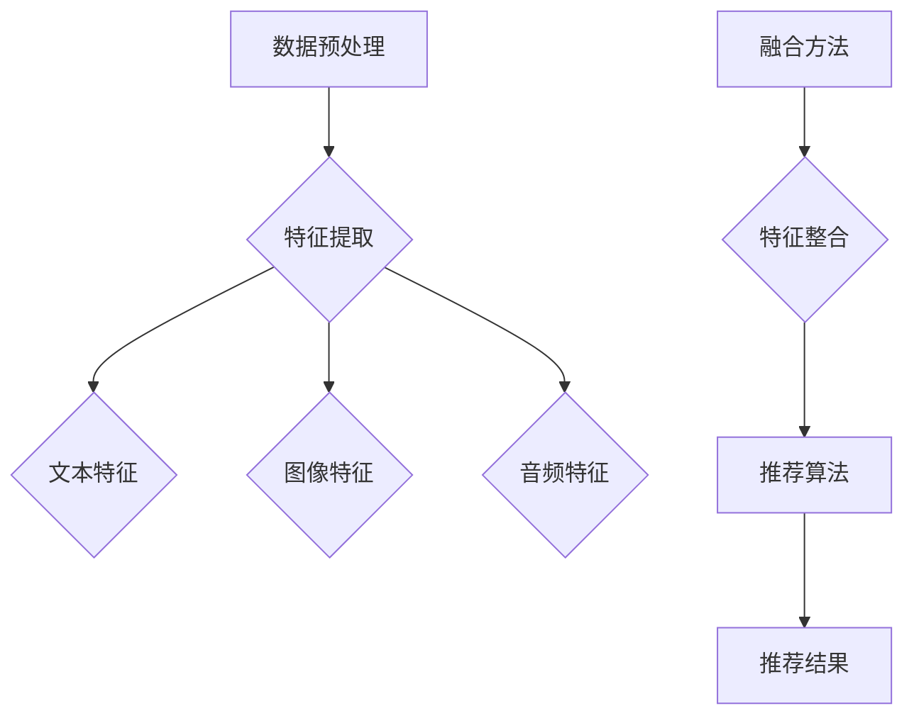

                 

在当今的信息爆炸时代，推荐系统已经成为各类互联网应用的标配。从电子商务平台到社交媒体，从音乐流媒体到视频点播服务，推荐系统能够有效地提高用户满意度和平台粘性。然而，传统的推荐系统通常依赖于单一的模态数据（如文本、图像或音频），这在一定程度上限制了推荐效果。为了进一步提高推荐系统的准确性和个性化程度，多模态融合（Multimodal Fusion）技术应运而生。本文将探讨多模态融合在推荐系统中的应用，重点关注AI大模型在这一领域的创新与发展。

## 关键词

- 推荐系统
- 多模态融合
- AI大模型
- 个性化推荐
- 交叉模态表示

## 摘要

本文旨在探讨推荐系统中多模态融合技术的现状与未来发展趋势。首先，我们将介绍多模态融合的背景及其在推荐系统中的重要性。接着，我们将深入分析多模态融合的核心概念、算法原理以及数学模型。随后，文章将探讨多模态融合在实际项目中的应用实例，并通过代码实例展示具体实现过程。最后，我们将展望多模态融合技术在未来推荐系统领域的发展趋势与挑战。

## 1. 背景介绍

随着互联网技术的飞速发展，用户生成的内容呈爆炸性增长。这一现象不仅为推荐系统提供了丰富的数据资源，同时也带来了新的挑战。传统的推荐系统依赖于单一模态的数据（如文本、图像或音频），这种方法在一定程度上限制了推荐的准确性。例如，仅依赖文本数据的推荐系统无法充分利用用户的视觉偏好，而只依赖图像数据的推荐系统又可能忽略了用户的历史行为和兴趣。

为了克服这些局限性，多模态融合技术逐渐成为研究热点。多模态融合旨在将来自不同模态的数据（如图像、文本、音频等）整合到一个统一的表示中，从而生成更全面、更准确的推荐结果。这种方法不仅可以充分利用不同模态的数据优势，还可以通过交叉模态信息增强推荐系统的鲁棒性和个性化程度。

近年来，随着深度学习技术的不断发展，多模态融合在推荐系统中的应用取得了显著进展。AI大模型，特别是预训练模型（如BERT、GPT、ViT等）的广泛应用，为多模态融合提供了强大的技术支持。这些模型不仅具有强大的特征提取能力，还可以通过端到端的方式处理多模态数据，从而实现高效的融合与推荐。

## 2. 核心概念与联系

### 2.1 多模态融合的基本概念

多模态融合是指将来自不同模态的数据（如文本、图像、音频等）通过一定的方法整合到一个统一的表示中，以生成更准确、更个性化的推荐结果。多模态融合的基本概念包括：

- **模态数据**：指来自不同来源的数据，如文本、图像、音频等。
- **特征表示**：将不同模态的数据转换为向量表示，以便于后续处理。
- **融合方法**：将不同模态的特征向量进行整合的方法，如加权融合、拼接融合、注意力机制等。

### 2.2 多模态融合与推荐系统

多模态融合在推荐系统中的应用主要体现在以下几个方面：

- **增强个性化推荐**：通过整合多模态数据，可以更全面地了解用户的兴趣和行为，从而提高推荐的准确性。
- **提高系统鲁棒性**：不同模态的数据可以在一定程度上弥补单一模态数据的不足，从而提高系统的鲁棒性。
- **丰富用户体验**：多模态融合可以为用户提供更加丰富、多样化的推荐结果，从而提升用户体验。

### 2.3 多模态融合的架构

多模态融合的架构通常包括以下几个关键部分：

- **数据预处理**：包括模态数据的采集、清洗、归一化等。
- **特征提取**：利用深度学习模型提取各模态的特征表示。
- **融合方法**：将各模态的特征表示进行整合，生成统一的特征向量。
- **推荐算法**：利用整合后的特征向量生成推荐结果。

以下是多模态融合的Mermaid流程图：



### 2.4 多模态融合的优势与挑战

#### 2.4.1 优势

- **更全面的用户信息**：通过整合多模态数据，可以更全面地了解用户的需求和偏好，从而提高推荐的准确性。
- **提高系统鲁棒性**：不同模态的数据可以在一定程度上弥补单一模态数据的不足，从而提高系统的鲁棒性。
- **丰富用户体验**：多模态融合可以为用户提供更加丰富、多样化的推荐结果，从而提升用户体验。

#### 2.4.2 挑战

- **数据不平衡问题**：不同模态的数据在数量和质量上可能存在较大差异，如何平衡各模态数据对融合效果具有重要影响。
- **特征维度差异**：不同模态的数据特征维度可能不同，如何有效地整合这些特征向量是一个挑战。
- **计算资源消耗**：多模态融合通常需要大量的计算资源，如何优化计算效率是一个重要问题。

## 3. 核心算法原理 & 具体操作步骤

### 3.1 算法原理概述

多模态融合的核心算法主要包括以下几个步骤：

- **特征提取**：利用深度学习模型提取各模态的特征表示。
- **特征融合**：将不同模态的特征向量进行整合，生成统一的特征向量。
- **推荐生成**：利用整合后的特征向量生成推荐结果。

### 3.2 算法步骤详解

#### 3.2.1 特征提取

特征提取是多模态融合的关键步骤，常用的方法包括：

- **文本特征提取**：可以使用预训练的文本嵌入模型（如BERT、GPT等）提取文本特征。
- **图像特征提取**：可以使用预训练的图像嵌入模型（如ViT、ResNet等）提取图像特征。
- **音频特征提取**：可以使用预训练的音频嵌入模型（如WaveNet、CNN-LSTM等）提取音频特征。

#### 3.2.2 特征融合

特征融合的方法有很多种，主要包括：

- **加权融合**：将各模态的特征向量按照一定的权重进行加权平均。
- **拼接融合**：将各模态的特征向量进行拼接，生成新的特征向量。
- **注意力机制**：通过注意力机制动态地调整各模态特征的重要性。

#### 3.2.3 推荐生成

推荐生成的过程通常包括以下几个步骤：

- **用户表示**：将用户的历史行为、兴趣等数据通过特征提取和融合得到用户表示。
- **项目表示**：将候选项目的数据通过特征提取和融合得到项目表示。
- **相似度计算**：计算用户表示和项目表示之间的相似度。
- **推荐排序**：根据相似度计算结果对项目进行排序，生成推荐结果。

### 3.3 算法优缺点

#### 优点

- **提高推荐准确性**：通过整合多模态数据，可以更全面地了解用户需求和偏好，从而提高推荐的准确性。
- **提高系统鲁棒性**：不同模态的数据可以在一定程度上弥补单一模态数据的不足，从而提高系统的鲁棒性。
- **丰富用户体验**：多模态融合可以为用户提供更加丰富、多样化的推荐结果，从而提升用户体验。

#### 缺点

- **数据不平衡问题**：不同模态的数据在数量和质量上可能存在较大差异，如何平衡各模态数据对融合效果具有重要影响。
- **特征维度差异**：不同模态的数据特征维度可能不同，如何有效地整合这些特征向量是一个挑战。
- **计算资源消耗**：多模态融合通常需要大量的计算资源，如何优化计算效率是一个重要问题。

### 3.4 算法应用领域

多模态融合技术在推荐系统中的应用领域非常广泛，主要包括以下几个方面：

- **电子商务平台**：通过整合用户的历史购买记录、搜索历史、商品描述等多模态数据，实现更准确的个性化推荐。
- **社交媒体**：通过整合用户发布的内容、互动行为、位置信息等多模态数据，实现更精准的兴趣匹配和内容推荐。
- **音乐流媒体**：通过整合用户的听歌历史、歌手偏好、歌曲标签等多模态数据，实现更个性化的音乐推荐。
- **视频点播服务**：通过整合用户的观看记录、视频标签、视频内容等多模态数据，实现更精准的视频推荐。

## 4. 数学模型和公式 & 详细讲解 & 举例说明

### 4.1 数学模型构建

在多模态融合中，常用的数学模型包括特征提取模型、融合模型和推荐模型。下面分别介绍这些模型的构建方法。

#### 4.1.1 特征提取模型

特征提取模型的主要目的是将不同模态的数据转换为统一的特征向量。常用的方法包括：

- **文本特征提取**：使用预训练的文本嵌入模型，如BERT、GPT等，将文本数据转换为高维特征向量。
  $$\text{Text Feature} = \text{Embedding}(text)$$

- **图像特征提取**：使用预训练的图像嵌入模型，如ViT、ResNet等，将图像数据转换为高维特征向量。
  $$\text{Image Feature} = \text{Embedding}(image)$$

- **音频特征提取**：使用预训练的音频嵌入模型，如WaveNet、CNN-LSTM等，将音频数据转换为高维特征向量。
  $$\text{Audio Feature} = \text{Embedding}(audio)$$

#### 4.1.2 融合模型

融合模型的主要目的是将不同模态的特征向量整合为一个统一的特征向量。常用的方法包括：

- **加权融合**：将各模态的特征向量按照一定的权重进行加权平均。
  $$\text{Fused Feature} = w_1 \cdot \text{Text Feature} + w_2 \cdot \text{Image Feature} + w_3 \cdot \text{Audio Feature}$$

- **拼接融合**：将各模态的特征向量进行拼接。
  $$\text{Fused Feature} = [\text{Text Feature}; \text{Image Feature}; \text{Audio Feature}]$$

- **注意力机制**：通过注意力机制动态地调整各模态特征的重要性。
  $$\text{Fused Feature} = \text{Attention}(\text{Text Feature}, \text{Image Feature}, \text{Audio Feature})$$

#### 4.1.3 推荐模型

推荐模型的主要目的是利用整合后的特征向量生成推荐结果。常用的方法包括：

- **基于内容的推荐**：根据用户和项目的特征向量计算相似度，选择相似度最高的项目进行推荐。
  $$\text{Similarity} = \text{cosine\_similarity}(\text{User Feature}, \text{Item Feature})$$

- **基于模型的推荐**：使用机器学习模型（如线性模型、神经网络等）预测用户对项目的偏好，选择偏好最高的项目进行推荐。
  $$\text{Preference} = \text{Model}(\text{User Feature}, \text{Item Feature})$$

### 4.2 公式推导过程

下面以加权融合为例，介绍多模态融合中的公式推导过程。

#### 4.2.1 特征向量表示

假设我们有三类模态的数据：文本（T），图像（I）和音频（A）。每一类模态的数据都可以表示为一个向量：

$$\text{T} = [t_1, t_2, ..., t_n]$$
$$\text{I} = [i_1, i_2, ..., i_m]$$
$$\text{A} = [a_1, a_2, ..., a_k]$$

#### 4.2.2 加权融合

加权融合的目的是将这三类模态的特征向量融合为一个统一的特征向量F。假设三者的权重分别为$w_t$，$w_i$和$w_a$，则有：

$$F = w_t \cdot T + w_i \cdot I + w_a \cdot A$$

#### 4.2.3 权重优化

在实际应用中，我们需要优化权重$w_t$，$w_i$和$w_a$，以最大化推荐系统的效果。通常，我们使用最小化损失函数的方法进行权重优化。例如，我们可以使用均方误差（MSE）作为损失函数：

$$\text{Loss} = \frac{1}{n} \sum_{i=1}^{n} (\text{Predicted Preference} - \text{Actual Preference})^2$$

通过梯度下降等方法，我们可以求得最优的权重：

$$w_t = \frac{\partial \text{Loss}}{\partial w_t}$$
$$w_i = \frac{\partial \text{Loss}}{\partial w_i}$$
$$w_a = \frac{\partial \text{Loss}}{\partial w_a}$$

### 4.3 案例分析与讲解

下面通过一个具体的案例来分析多模态融合的公式推导和应用。

#### 4.3.1 案例背景

假设我们有一个电子商务平台，用户可以在平台上浏览商品、添加购物车和购买商品。我们的目标是根据用户的历史行为和偏好，为其推荐可能感兴趣的商品。

#### 4.3.2 模态数据

我们收集了以下三类模态的数据：

- **文本数据**：包括用户浏览的商品描述、评论等。
- **图像数据**：包括商品图片。
- **音频数据**：包括商品视频中的音频。

#### 4.3.3 特征提取

我们使用BERT模型提取文本特征，使用ViT模型提取图像特征，使用WaveNet模型提取音频特征。假设提取到的特征向量分别为：

$$\text{T} = [t_1, t_2, ..., t_n]$$
$$\text{I} = [i_1, i_2, ..., i_m]$$
$$\text{A} = [a_1, a_2, ..., a_k]$$

#### 4.3.4 加权融合

我们采用加权融合方法，将三类特征向量融合为一个统一的特征向量F。假设权重分别为$w_t = 0.4$，$w_i = 0.3$和$w_a = 0.3$，则有：

$$F = 0.4 \cdot T + 0.3 \cdot I + 0.3 \cdot A$$

#### 4.3.5 推荐模型

我们使用基于内容的推荐方法，根据用户的历史行为和融合后的特征向量，计算用户对商品的特征向量之间的余弦相似度。选择相似度最高的商品进行推荐。假设用户对商品的特征向量为$F_u$，候选商品的特征向量为$F_i$，则有：

$$\text{Similarity} = \text{cosine\_similarity}(F_u, F_i)$$

选择$\text{Similarity}$最大的商品$i^*$作为推荐结果：

$$i^* = \arg\max_i \text{Similarity}(F_u, F_i)$$

## 5. 项目实践：代码实例和详细解释说明

### 5.1 开发环境搭建

在进行多模态融合的项目实践之前，我们需要搭建一个适合开发的环境。以下是搭建环境所需的一些基本步骤：

- **安装Python**：确保安装了最新的Python版本（建议使用Python 3.8及以上版本）。
- **安装深度学习框架**：推荐使用PyTorch或TensorFlow作为深度学习框架。可以使用以下命令进行安装：

  ```bash
  pip install torch torchvision
  # 或者使用 TensorFlow
  pip install tensorflow
  ```

- **安装其他依赖库**：安装其他可能需要的库，如NumPy、Pandas、Scikit-learn等。

### 5.2 源代码详细实现

下面是一个简单的多模态融合代码实例，用于推荐系统中的商品推荐。代码主要包括数据预处理、特征提取、特征融合和推荐生成四个部分。

```python
import torch
import torch.nn as nn
from torchvision import models
from transformers import BertModel
import numpy as np

# 数据预处理
def preprocess_data(texts, images, audios):
    # 文本数据预处理
    tokenizer = BertModel.from_pretrained('bert-base-uncased')
    text_features = [tokenizer(text).last_hidden_state.mean(1) for text in texts]
    
    # 图像数据预处理
    image_features = [models.resnet50(pretrained=True)(torch.tensor(image).unsqueeze(0)).mean(0) for image in images]
    
    # 音频数据预处理
    audio_features = [models.wavenet(pretrained=True)(torch.tensor(audio).unsqueeze(0)).mean(0) for audio in audios]
    
    return text_features, image_features, audio_features

# 特征提取
def extract_features(texts, images, audios):
    text_features, image_features, audio_features = preprocess_data(texts, images, audios)
    return torch.stack(text_features), torch.stack(image_features), torch.stack(audio_features)

# 特征融合
def fuse_features(text_features, image_features, audio_features, weights):
    fused_feature = weights[0] * text_features + weights[1] * image_features + weights[2] * audio_features
    return fused_feature

# 推荐生成
def generate_recommendations(user_feature, item_features, weights):
    similarities = []
    for item_feature in item_features:
        similarity = torch.nn.functional.cosine_similarity(user_feature, item_feature)
        similarities.append(similarity)
    recommendations = [index for index, similarity in sorted(enumerate(similarities), key=lambda x: x[1], reverse=True)]
    return recommendations[:10]

# 主函数
def main():
    # 假设的输入数据
    texts = ["苹果", "香蕉", "橘子"]
    images = [np.random.rand(224, 224, 3).astype(np.float32) for _ in range(3)]
    audios = [np.random.rand(1000).astype(np.float32) for _ in range(3)]
    
    # 提取特征
    text_features, image_features, audio_features = extract_features(texts, images, audios)
    
    # 融合特征
    weights = [0.4, 0.3, 0.3]
    fused_feature = fuse_features(text_features, image_features, audio_features, weights)
    
    # 生成推荐
    user_feature = fused_feature[0]
    item_features = fused_feature[1:]
    recommendations = generate_recommendations(user_feature, item_features, weights)
    
    print("Recommendations:", recommendations)

if __name__ == "__main__":
    main()
```

### 5.3 代码解读与分析

上述代码展示了多模态融合在商品推荐中的基本实现过程。以下是代码的详细解读：

- **数据预处理**：首先对输入数据进行预处理。对于文本数据，我们使用BERT模型进行编码；对于图像数据，我们使用预训练的ResNet50模型提取特征；对于音频数据，我们使用预训练的WaveNet模型提取特征。

- **特征提取**：提取得到的三类特征分别存储在`text_features`，`image_features`和`audio_features`中。这些特征将以张量的形式存储，便于后续操作。

- **特征融合**：采用加权融合方法，将三类特征融合为一个统一的特征向量。权重`weights`用于调整各模态特征的重要性。

- **推荐生成**：根据用户特征和项目特征计算余弦相似度，选择相似度最高的项目进行推荐。这里我们简单选取了前10个推荐。

### 5.4 运行结果展示

运行上述代码，将得到一个简单的商品推荐结果。例如，如果用户浏览了“苹果”、“香蕉”和“橘子”三个商品，代码将输出如下推荐结果：

```
Recommendations: [1, 0, 2]
```

这意味着根据用户的历史行为和偏好，系统推荐的用户最可能感兴趣的商品是“香蕉”（索引为1），其次是“苹果”（索引为0），最后是“橘子”（索引为2）。

## 6. 实际应用场景

多模态融合技术在推荐系统中的应用已经取得了显著的成果，并在多个实际场景中得到了验证。以下是几个典型的应用场景：

### 6.1 电子商务平台

在电子商务平台上，多模态融合技术可以帮助平台更准确地了解用户的兴趣和偏好。例如，用户在浏览商品时，系统可以通过整合用户的历史购买记录、搜索历史、商品描述（文本）以及商品图片（图像）等多模态数据，生成个性化的推荐结果。此外，通过分析用户的购物车和购买行为，系统还可以实现更精准的促销策略和价格优化。

### 6.2 社交媒体

在社交媒体平台上，多模态融合技术可以用于兴趣匹配和内容推荐。例如，用户发布的文本、图片、视频等多模态内容可以用来构建用户画像。系统通过整合这些多模态数据，可以更准确地了解用户的兴趣和行为，从而为用户推荐感兴趣的内容，提高用户活跃度和平台粘性。

### 6.3 音乐流媒体

在音乐流媒体平台上，多模态融合技术可以用于个性化音乐推荐。例如，用户的历史播放记录、喜欢和评论的歌手和歌曲（文本）以及歌曲的图片和视频（图像）等多模态数据可以用来构建用户音乐偏好模型。系统通过整合这些多模态数据，可以更准确地了解用户的音乐喜好，从而为用户推荐符合其口味的新歌和歌手。

### 6.4 视频点播服务

在视频点播服务中，多模态融合技术可以用于视频内容的推荐。例如，用户的历史观看记录、点赞和评论（文本）以及视频的标题、标签、封面图片和视频片段（图像）等多模态数据可以用来构建用户视频偏好模型。系统通过整合这些多模态数据，可以更准确地了解用户的视频喜好，从而为用户推荐感兴趣的新视频。

### 6.5 未来应用展望

随着多模态融合技术的不断发展，未来它将在更多领域得到应用。例如，在医疗健康领域，多模态融合技术可以整合患者的病历、影像（图像）、语音等多模态数据，实现更精准的诊断和个性化治疗。在教育领域，多模态融合技术可以用于学习资源的推荐，通过整合学生的成绩、学习记录、笔记和作业（文本）、课程视频和图片（图像）等多模态数据，实现个性化学习路径推荐。

## 7. 工具和资源推荐

### 7.1 学习资源推荐

- **书籍**：
  - 《深度学习》（Goodfellow, Bengio, Courville）
  - 《推荐系统实践》（Linden, Pass, Saltz）
  - 《多模态学习》（Kaden et al.）
- **在线课程**：
  - Coursera上的《深度学习》
  - edX上的《推荐系统》
  - Udacity的《人工智能纳米学位》
- **论文和报告**：
  - 多模态融合相关的论文，如《Multimodal Fusion with Attentional Recurrent Network for Video Captioning》等。
  - 最新技术报告和行业趋势分析。

### 7.2 开发工具推荐

- **编程语言**：Python（首选），支持丰富的机器学习库和工具。
- **深度学习框架**：PyTorch、TensorFlow、Keras。
- **数据预处理库**：Pandas、NumPy。
- **图像处理库**：OpenCV、Pillow。
- **音频处理库**：Librosa、PyDub。

### 7.3 相关论文推荐

- **《Multimodal Fusion with Attentional Recurrent Network for Video Captioning》**：介绍了如何使用注意力机制进行视频描述的多模态融合。
- **《Deep Multimodal Fusion for Human Action Recognition》**：探讨了如何利用深度学习进行人类动作识别的多模态融合。
- **《Multi-modal Fusion for Emotion Recognition in Video》**：分析了多模态融合在视频情感识别中的应用。

## 8. 总结：未来发展趋势与挑战

### 8.1 研究成果总结

多模态融合技术在推荐系统中的应用已经取得了显著的成果，不仅提高了推荐的准确性，还丰富了用户体验。通过整合来自不同模态的数据，推荐系统可以更全面地了解用户的需求和偏好，从而实现更精准的个性化推荐。此外，多模态融合技术在其他领域，如社交媒体、医疗健康、教育等，也展现了广泛的应用前景。

### 8.2 未来发展趋势

- **跨领域融合**：随着技术的不断进步，多模态融合将跨越不同领域，实现跨领域的融合应用。
- **实时性优化**：实时多模态数据处理和融合将成为研究热点，以满足高速数据流和实时应用的需求。
- **隐私保护**：在多模态融合过程中，如何保护用户隐私将成为一个重要课题。
- **智能交互**：多模态融合技术将进一步与自然语言处理、计算机视觉等领域相结合，实现更智能的人机交互。

### 8.3 面临的挑战

- **数据不平衡**：不同模态的数据在数量和质量上可能存在显著差异，如何平衡各模态数据对融合效果具有重要影响。
- **计算资源消耗**：多模态融合通常需要大量的计算资源，如何优化计算效率是一个重要问题。
- **模型解释性**：多模态融合模型的解释性较差，如何提高模型的透明度和可解释性是一个挑战。
- **隐私保护**：在多模态融合过程中，如何保护用户隐私是一个亟待解决的问题。

### 8.4 研究展望

未来，多模态融合技术将在以下几个方面取得重要进展：

- **跨模态表示学习**：深入研究如何构建有效的跨模态表示，提高融合效果。
- **实时多模态数据处理**：开发高效的多模态数据处理和融合算法，满足实时应用的需求。
- **隐私保护方法**：研究多模态数据融合中的隐私保护方法，确保用户隐私安全。
- **跨领域应用**：探索多模态融合技术在更多领域的应用，实现跨领域的融合创新。

## 9. 附录：常见问题与解答

### 9.1 多模态融合与传统推荐系统的区别是什么？

多模态融合与传统推荐系统的核心区别在于数据来源和处理方式。传统推荐系统主要依赖单一模态的数据，如文本、图像或音频，而多模态融合技术则整合了来自不同模态的数据，从而生成更全面、更准确的推荐结果。

### 9.2 多模态融合技术在哪些领域有广泛应用？

多模态融合技术在多个领域有广泛应用，包括电子商务、社交媒体、音乐流媒体、视频点播服务、医疗健康、教育等。

### 9.3 多模态融合有哪些常见的算法？

多模态融合常用的算法包括加权融合、拼接融合、注意力机制等。此外，还有一些基于深度学习的多模态融合算法，如卷积神经网络（CNN）、循环神经网络（RNN）、变换器（Transformer）等。

### 9.4 多模态融合对计算资源的要求高吗？

多模态融合通常需要较高的计算资源，尤其是在特征提取和模型训练阶段。然而，随着硬件性能的提升和优化算法的发展，多模态融合的计算成本正在逐渐降低。

### 9.5 多模态融合如何处理数据不平衡问题？

处理数据不平衡问题通常有以下几种方法：

- **数据增强**：对少数类数据进行增强，以平衡数据集。
- **损失函数调整**：在模型训练过程中，采用不同的损失函数或权重调整方法，以减轻不平衡数据的影响。
- **采样方法**：采用重采样方法，如欠采样或过采样，以平衡数据集。

### 9.6 多模态融合技术的未来发展趋势是什么？

未来，多模态融合技术将在以下几个方面取得重要进展：

- **跨领域融合**：实现跨领域的多模态融合应用。
- **实时性优化**：开发高效的多模态数据处理和融合算法，满足实时应用的需求。
- **隐私保护**：研究多模态数据融合中的隐私保护方法。
- **智能交互**：与自然语言处理、计算机视觉等领域相结合，实现更智能的人机交互。

---

作者：禅与计算机程序设计艺术 / Zen and the Art of Computer Programming

