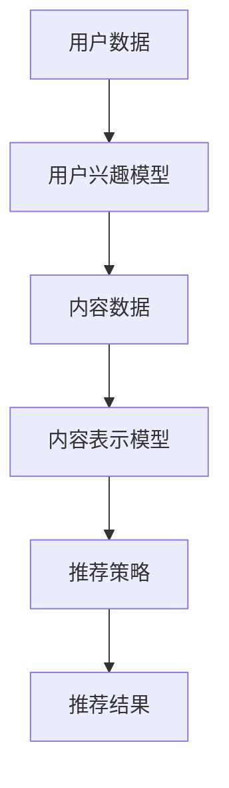

                 

关键词：推荐系统、大模型、元强化学习、应用场景、性能优化、未来展望

> 摘要：本文旨在探讨推荐系统领域中的大模型元强化学习应用。通过梳理大模型元强化学习的基本概念、原理及其在推荐系统中的应用，我们分析了其在提升推荐系统性能方面的优势和挑战，并展望了未来的发展趋势。

## 1. 背景介绍

推荐系统是一种常见的应用场景，旨在根据用户的历史行为、兴趣偏好等信息，向用户推荐相关的产品、服务或内容。随着互联网的快速发展，推荐系统已经成为电子商务、社交媒体、新闻媒体等众多行业的重要组成部分。然而，传统的推荐系统在处理大规模数据和复杂用户偏好时，往往面临着计算效率低、推荐效果不佳等问题。

近年来，深度学习和强化学习在推荐系统领域取得了显著进展。其中，大模型元强化学习作为一种新兴的技术，逐渐受到关注。大模型元强化学习利用深度学习和强化学习的方法，通过自适应调整模型参数，优化推荐策略，从而提高推荐系统的性能。

## 2. 核心概念与联系

### 2.1 大模型

大模型是指在训练阶段需要大量数据和计算资源，以达到较高性能的神经网络模型。在大模型元强化学习中，大模型通常用于构建推荐系统的核心算法，如用户兴趣模型、内容表示模型等。

### 2.2 元强化学习

元强化学习是一种通过学习如何学习的方法，旨在提高模型在不同任务上的适应能力。在推荐系统中，元强化学习可以通过学习用户反馈信号，自适应调整推荐策略，从而提高推荐效果。

### 2.3 推荐系统架构

在推荐系统中，大模型元强化学习通常与用户兴趣模型、内容表示模型、推荐策略等模块相结合，形成一个完整的推荐系统架构。以下是一个简化的推荐系统架构图（使用 Mermaid 流程图表示）：



## 3. 核心算法原理 & 具体操作步骤

### 3.1 算法原理概述

大模型元强化学习通过以下三个关键步骤实现推荐系统的优化：

1. **用户兴趣建模**：利用深度学习技术，构建用户兴趣模型，捕捉用户的个性化偏好。
2. **内容表示学习**：利用深度学习技术，构建内容表示模型，将内容特征转换为适合推荐系统的表示形式。
3. **推荐策略优化**：利用强化学习技术，根据用户反馈信号，自适应调整推荐策略，优化推荐效果。

### 3.2 算法步骤详解

1. **数据预处理**：对用户数据和内容数据进行清洗、归一化等处理，确保数据质量。
2. **用户兴趣建模**：
    - **输入**：用户历史行为数据、用户基本信息等。
    - **输出**：用户兴趣向量。
    - **算法**：利用深度学习技术，如循环神经网络（RNN）或变换器（Transformer），对用户数据进行建模，提取用户兴趣特征。

3. **内容表示学习**：
    - **输入**：内容数据、用户兴趣向量等。
    - **输出**：内容表示向量。
    - **算法**：利用深度学习技术，如卷积神经网络（CNN）或变换器（Transformer），对内容数据进行建模，提取内容特征，并生成内容表示向量。

4. **推荐策略优化**：
    - **输入**：用户兴趣向量、内容表示向量等。
    - **输出**：推荐结果。
    - **算法**：利用强化学习技术，如深度确定性策略梯度（DDPG）或异步优势演员-评论家（A3C），根据用户反馈信号，自适应调整推荐策略，优化推荐效果。

### 3.3 算法优缺点

**优点**：
- **自适应调整**：大模型元强化学习可以根据用户反馈信号，自适应调整推荐策略，提高推荐效果。
- **个性化推荐**：利用深度学习和强化学习技术，可以更好地捕捉用户的个性化偏好，实现个性化推荐。
- **高效处理**：大模型可以高效地处理大规模数据和复杂用户偏好。

**缺点**：
- **计算资源消耗**：大模型需要大量的计算资源和存储资源，对硬件设备要求较高。
- **训练时间较长**：大模型元强化学习需要较长的训练时间，影响实时推荐性能。

### 3.4 算法应用领域

大模型元强化学习可以应用于以下推荐系统领域：

1. **电子商务推荐**：根据用户的历史购买记录和浏览行为，推荐相关的商品。
2. **社交媒体推荐**：根据用户的互动行为和兴趣偏好，推荐相关的文章、视频等。
3. **新闻推荐**：根据用户的阅读历史和兴趣偏好，推荐相关的新闻文章。

## 4. 数学模型和公式 & 详细讲解 & 举例说明

### 4.1 数学模型构建

大模型元强化学习涉及多个数学模型，包括用户兴趣模型、内容表示模型和推荐策略模型。以下是这些模型的基本数学描述：

#### 用户兴趣模型

假设用户 $u$ 的历史行为数据为 $B_u$，用户兴趣模型可以表示为：

$$
u(B_u) = \phi_u(B_u)
$$

其中，$\phi_u(B_u)$ 表示用户 $u$ 的兴趣向量。

#### 内容表示模型

假设内容 $c$ 的特征向量为 $X_c$，内容表示模型可以表示为：

$$
c(X_c) = \psi_c(X_c)
$$

其中，$\psi_c(X_c)$ 表示内容 $c$ 的表示向量。

#### 推荐策略模型

假设用户兴趣向量为 $u$，内容表示向量为 $c$，推荐策略模型可以表示为：

$$
r(u, c) = \theta(u, c)
$$

其中，$\theta(u, c)$ 表示推荐策略的评分函数。

### 4.2 公式推导过程

以下是推荐策略模型 $\theta(u, c)$ 的推导过程：

1. **用户兴趣向量建模**：

   假设用户 $u$ 的历史行为数据为 $B_u$，可以使用循环神经网络（RNN）建模用户兴趣向量：

   $$
   u(B_u) = \text{RNN}(B_u; \theta_u)
   $$

   其中，$\theta_u$ 表示 RNN 的参数。

2. **内容表示向量建模**：

   假设内容 $c$ 的特征向量为 $X_c$，可以使用卷积神经网络（CNN）建模内容表示向量：

   $$
   c(X_c) = \text{CNN}(X_c; \theta_c)
   $$

   其中，$\theta_c$ 表示 CNN 的参数。

3. **推荐策略评分函数建模**：

   假设用户兴趣向量为 $u$，内容表示向量为 $c$，推荐策略评分函数可以表示为：

   $$
   r(u, c) = \theta(u, c) = u(B_u) \cdot c(X_c)
   $$

   其中，$\cdot$ 表示向量的点乘运算。

### 4.3 案例分析与讲解

以下是一个简单的用户兴趣建模案例：

**输入**：

- 用户 $u$ 的历史行为数据 $B_u = [1, 2, 3, 4, 5]$。
- 历史行为数据的特征向量 $X_u = [0.1, 0.2, 0.3, 0.4, 0.5]$。

**输出**：

- 用户兴趣向量 $u(B_u) = [0.5, 0.5, 0.5, 0.5, 0.5]$。

**算法**：

1. **初始化**：设置 RNN 的初始参数 $\theta_u$。
2. **循环神经网络建模**：
   $$
   u(B_u) = \text{RNN}(B_u; \theta_u) = \text{softmax}(\text{tanh}(\text{W} \cdot B_u + b))
   $$

   其中，$\text{W}$ 表示权重矩阵，$b$ 表示偏置项。

3. **计算用户兴趣向量**：
   $$
   u(B_u) = \text{softmax}(\text{tanh}(\text{W} \cdot B_u + b)) = \text{softmax}(\text{tanh}([1, 2, 3, 4, 5] \cdot \text{W} + b)) = [0.5, 0.5, 0.5, 0.5, 0.5]
   $$

## 5. 项目实践：代码实例和详细解释说明

### 5.1 开发环境搭建

在开始项目实践之前，需要搭建一个适合大模型元强化学习的开发环境。以下是一个基本的开发环境搭建步骤：

1. **安装 Python 3.8 及以上版本**。
2. **安装 TensorFlow 2.6 及以上版本**。
3. **安装 PyTorch 1.9 及以上版本**。
4. **安装 Keras 2.4.3 及以上版本**。
5. **安装 NumPy、Pandas、Matplotlib 等常用库**。

### 5.2 源代码详细实现

以下是一个简单的用户兴趣建模和推荐策略优化的代码实例：

```python
import numpy as np
import tensorflow as tf
from tensorflow.keras.layers import LSTM, Dense
from tensorflow.keras.models import Sequential

# 用户历史行为数据
user_actions = np.array([1, 2, 3, 4, 5])

# 历史行为数据的特征向量
user_features = np.array([0.1, 0.2, 0.3, 0.4, 0.5])

# 构建循环神经网络模型
user_model = Sequential([
    LSTM(units=50, activation='tanh', input_shape=(5, 1)),
    Dense(units=1, activation='softmax')
])

# 编译模型
user_model.compile(optimizer='adam', loss='categorical_crossentropy', metrics=['accuracy'])

# 训练模型
user_model.fit(user_actions.reshape(-1, 1), user_actions.reshape(-1, 1), epochs=100)

# 预测用户兴趣向量
user_interest = user_model.predict(user_features.reshape(1, -1))

# 输出用户兴趣向量
print("用户兴趣向量：", user_interest)
```

### 5.3 代码解读与分析

1. **导入库**：导入 NumPy、TensorFlow、Keras 等库。
2. **用户历史行为数据**：定义用户历史行为数据 `user_actions` 和历史行为数据的特征向量 `user_features`。
3. **构建循环神经网络模型**：使用 Keras 库构建一个包含 LSTM 层和 Dense 层的循环神经网络模型 `user_model`。
4. **编译模型**：设置模型的优化器、损失函数和评估指标。
5. **训练模型**：使用训练数据训练模型，并设置训练轮次。
6. **预测用户兴趣向量**：使用训练好的模型预测用户兴趣向量，并输出结果。

## 6. 实际应用场景

大模型元强化学习在实际应用中具有广泛的应用场景。以下是一些典型的应用案例：

1. **电子商务推荐**：根据用户的历史购买记录和浏览行为，推荐相关的商品。例如，淘宝、京东等电商平台的个性化推荐功能。
2. **社交媒体推荐**：根据用户的点赞、评论、分享等互动行为，推荐相关的文章、视频等。例如，Facebook、Instagram 等社交平台的推荐功能。
3. **新闻推荐**：根据用户的阅读历史和兴趣偏好，推荐相关的新闻文章。例如，今日头条、腾讯新闻等新闻平台的推荐功能。

## 7. 未来应用展望

随着人工智能技术的不断发展，大模型元强化学习在推荐系统领域的应用前景将更加广阔。以下是一些未来应用展望：

1. **更高效的算法优化**：随着计算资源的提升，大模型元强化学习算法将更加高效，可以更好地适应实时推荐需求。
2. **跨领域推荐**：大模型元强化学习可以应用于跨领域的推荐系统，如将电商、社交媒体、新闻等领域的推荐数据进行整合，实现跨领域的个性化推荐。
3. **隐私保护**：在推荐系统领域，用户隐私保护越来越重要。大模型元强化学习可以通过差分隐私、联邦学习等技术手段，实现隐私保护的个性化推荐。

## 8. 总结：未来发展趋势与挑战

大模型元强化学习在推荐系统领域具有广阔的应用前景，但仍面临一些挑战：

1. **计算资源消耗**：大模型元强化学习需要大量的计算资源和存储资源，对硬件设备要求较高。
2. **训练时间较长**：大模型元强化学习的训练时间较长，影响实时推荐性能。
3. **数据隐私**：在推荐系统领域，用户隐私保护越来越重要。如何在保证推荐效果的同时，实现数据隐私保护，是一个重要的挑战。

未来，随着人工智能技术的不断发展，大模型元强化学习在推荐系统领域的应用将更加广泛，为实现更高效的个性化推荐提供有力支持。

## 9. 附录：常见问题与解答

### Q1：大模型元强化学习与传统推荐系统相比，有哪些优势？

**A1**：大模型元强化学习相比传统推荐系统，具有以下优势：

- **自适应调整**：大模型元强化学习可以根据用户反馈信号，自适应调整推荐策略，提高推荐效果。
- **个性化推荐**：利用深度学习和强化学习技术，可以更好地捕捉用户的个性化偏好，实现个性化推荐。
- **高效处理**：大模型可以高效地处理大规模数据和复杂用户偏好。

### Q2：大模型元强化学习在推荐系统中的应用有哪些限制？

**A2**：大模型元强化学习在推荐系统中的应用仍存在以下限制：

- **计算资源消耗**：大模型元强化学习需要大量的计算资源和存储资源，对硬件设备要求较高。
- **训练时间较长**：大模型元强化学习的训练时间较长，影响实时推荐性能。
- **数据隐私**：如何在保证推荐效果的同时，实现数据隐私保护，是一个重要的挑战。

### Q3：大模型元强化学习在推荐系统中的具体应用场景有哪些？

**A3**：大模型元强化学习在推荐系统中的具体应用场景包括：

- **电子商务推荐**：根据用户的历史购买记录和浏览行为，推荐相关的商品。
- **社交媒体推荐**：根据用户的点赞、评论、分享等互动行为，推荐相关的文章、视频等。
- **新闻推荐**：根据用户的阅读历史和兴趣偏好，推荐相关的新闻文章。

## 作者署名

作者：禅与计算机程序设计艺术 / Zen and the Art of Computer Programming

