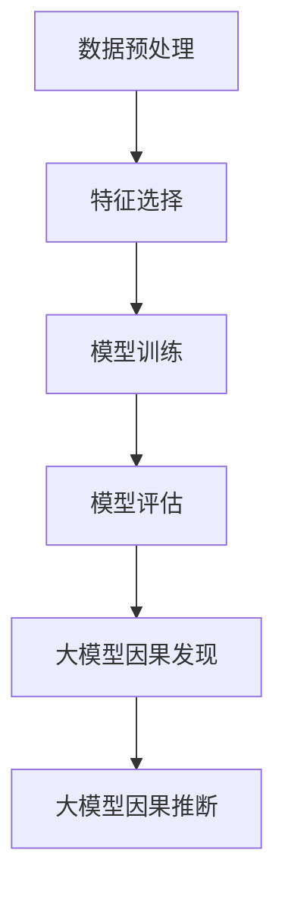

                 

关键词：推荐系统，大模型，因果发现，因果推断，算法原理，数学模型，项目实践，应用场景，未来展望。

> 摘要：本文旨在探讨推荐系统中的大模型因果发现与推断技术，分析其核心概念、算法原理、数学模型及其在实际应用中的优势与挑战。通过对相关技术的深入剖析，本文希望能够为研究者与实践者提供有价值的参考和启示。

## 1. 背景介绍

随着互联网的普及和大数据技术的飞速发展，推荐系统已经成为各个领域不可或缺的一部分。推荐系统能够根据用户的兴趣和行为习惯，向其推荐感兴趣的内容、商品或服务，从而提高用户体验、提升业务收益。然而，随着推荐系统规模的不断扩大和复杂度的增加，传统的基于统计和学习的方法已难以应对大规模数据和高维特征的挑战。

为了解决这些问题，近年来，大模型因果发现与推断技术逐渐引起了广泛关注。大模型因果发现旨在从大规模数据中揭示潜在的因果关系，而大模型因果推断则关注如何利用这些因果关系进行预测和决策。这些技术的引入，不仅能够提高推荐系统的准确性和解释性，还能为其他领域的因果推断应用提供有力支持。

## 2. 核心概念与联系

在本节中，我们将介绍推荐系统中大模型因果发现与推断的核心概念及其相互关系。

### 2.1 大模型因果发现

大模型因果发现是指利用深度学习等机器学习技术，从大规模数据中挖掘潜在的因果关系。其核心思想是，通过对数据的学习，构建一个能够捕捉潜在因果关系的复杂模型。在这个过程中，数据的预处理、特征选择、模型训练和评估等环节都非常关键。

### 2.2 大模型因果推断

大模型因果推断则是基于已经发现的因果关系，对未知数据进行预测和决策。与传统的统计学习方法相比，大模型因果推断能够更好地应对复杂和高维数据，从而提高预测的准确性和鲁棒性。

### 2.3 核心概念与联系

大模型因果发现与推断之间存在紧密的联系。首先，大模型因果发现为因果推断提供了重要的基础，即潜在的因果关系。其次，大模型因果推断可以利用大模型因果发现得到的因果关系，对未知数据进行预测和决策，从而进一步提高推荐系统的性能。

为了更直观地展示核心概念之间的联系，我们使用Mermaid流程图来描述：



## 3. 核心算法原理 & 具体操作步骤

### 3.1 算法原理概述

大模型因果发现与推断的核心算法主要包括深度学习、图神经网络、因果推断算法等。以下我们将分别介绍这些算法的基本原理。

#### 3.1.1 深度学习

深度学习是一种基于人工神经网络的机器学习方法，能够通过多层次的神经网络结构，从大规模数据中自动学习特征表示。在推荐系统中，深度学习可以用于构建用户兴趣模型、商品特征表示等，从而提高推荐系统的性能。

#### 3.1.2 图神经网络

图神经网络是一种能够处理图结构数据的神经网络模型，具有强大的特征表示和关系捕捉能力。在推荐系统中，图神经网络可以用于构建用户与商品之间的复杂关系网络，从而更好地挖掘潜在因果关系。

#### 3.1.3 因果推断算法

因果推断算法是一种用于发现和利用潜在因果关系的统计学习方法。常见的因果推断算法包括Causal Bayesian Networks、Do-Calculus等。这些算法可以用于从大规模数据中挖掘潜在的因果关系，为推荐系统提供重要的基础。

### 3.2 算法步骤详解

在具体操作中，大模型因果发现与推断可以分为以下几个步骤：

#### 3.2.1 数据预处理

数据预处理是推荐系统中的第一步，主要包括数据清洗、数据归一化、缺失值处理等。良好的数据预处理能够为后续的算法提供高质量的数据基础。

#### 3.2.2 特征选择

特征选择是从大规模数据中提取关键特征的过程，可以显著提高算法的性能。常用的特征选择方法包括特征重要性评估、特征组合等。

#### 3.2.3 模型训练

模型训练是利用已有数据，通过优化算法训练出能够捕捉潜在因果关系的大模型。常用的模型包括深度神经网络、图神经网络等。

#### 3.2.4 模型评估

模型评估用于评估训练出的模型在未知数据上的表现，常用的评估指标包括准确率、召回率、F1值等。

#### 3.2.5 大模型因果发现

大模型因果发现是通过模型训练和评估，从大规模数据中挖掘出潜在的因果关系。常用的方法包括基于图的因果发现、基于统计的因果发现等。

#### 3.2.6 大模型因果推断

大模型因果推断是利用已发现的因果关系，对未知数据进行预测和决策。常见的应用包括推荐系统、风险控制等。

### 3.3 算法优缺点

#### 优点

- **高效性**：大模型因果发现与推断技术能够处理大规模、高维数据，具有高效性。
- **鲁棒性**：通过挖掘潜在的因果关系，大模型因果发现与推断技术能够提高推荐系统的鲁棒性，减少噪声干扰。
- **灵活性**：大模型因果发现与推断技术可以根据不同的应用场景，灵活调整算法参数和模型结构，从而提高性能。

#### 缺点

- **计算成本**：大模型因果发现与推断技术通常需要大量的计算资源，对硬件设施要求较高。
- **可解释性**：由于深度学习模型具有“黑箱”特性，其内部机制难以解释，这可能会影响用户对推荐系统的信任度。

### 3.4 算法应用领域

大模型因果发现与推断技术在推荐系统中具有广泛的应用前景，可以应用于以下领域：

- **个性化推荐**：通过挖掘用户与商品之间的潜在因果关系，实现更加精准的个性化推荐。
- **风险控制**：利用因果关系进行风险预测和评估，提高风险控制能力。
- **舆情分析**：挖掘用户行为与舆论之间的关系，为舆情分析提供支持。

## 4. 数学模型和公式 & 详细讲解 & 举例说明

在本节中，我们将介绍大模型因果发现与推断中的关键数学模型和公式，并通过具体例子进行讲解。

### 4.1 数学模型构建

大模型因果发现与推断中的数学模型主要包括以下几类：

#### 4.1.1 深度学习模型

深度学习模型通常使用反向传播算法进行参数优化，其核心公式如下：

$$
\begin{aligned}
\frac{\partial J}{\partial \theta} &= \frac{\partial}{\partial \theta} \left( -\frac{1}{m} \sum_{i=1}^{m} y^{(i)} \log(a^{(l)}(z^{(l)}_{i})) + (1 - y^{(i)}) \log(1 - a^{(l)}(z^{(l)}_{i})) \right) \\
&= \frac{1}{m} \sum_{i=1}^{m} \left( a^{(l)}(z^{(l)}_{i}) - y^{(i)} \right) \cdot \frac{\partial}{\partial z^{(l)}_{i}} a^{(l)}(z^{(l)}_{i}) \\
&= \frac{1}{m} \sum_{i=1}^{m} \left( a^{(l)}(z^{(l)}_{i}) - y^{(i)} \right) \cdot \sigma'(z^{(l)}_{i}) \cdot \frac{\partial}{\partial z^{(l)}_{i}} \sigma(z^{(l-1)}_{i} \cdot W^{(l)}) \\
&= \frac{1}{m} \sum_{i=1}^{m} \left( a^{(l)}(z^{(l)}_{i}) - y^{(i)} \right) \cdot \sigma'(z^{(l)}_{i}) \cdot \frac{\partial}{\partial z^{(l-1)}_{i}} \sigma(z^{(l-1)}_{i} \cdot W^{(l)}) \cdot \frac{\partial}{\partial z^{(l-1)}_{i}} z^{(l-1)}_{i} \cdot W^{(l-1)} \\
&= \frac{1}{m} \sum_{i=1}^{m} \left( a^{(l)}(z^{(l)}_{i}) - y^{(i)} \right) \cdot \sigma'(z^{(l)}_{i}) \cdot \sigma'(z^{(l-1)}_{i}) \cdot \frac{\partial}{\partial z^{(l-1)}_{i}} z^{(l-1)}_{i} \cdot W^{(l-1)} \cdot \frac{\partial}{\partial z^{(l-2)}_{i}} z^{(l-2)}_{i} \cdot W^{(l-2)} \\
&\vdots \\
&= \frac{1}{m} \sum_{i=1}^{m} \left( a^{(l)}(z^{(l)}_{i}) - y^{(i)} \right) \cdot \sigma'(z^{(l)}_{i}) \cdot \sigma'(z^{(l-1)}_{i}) \cdot \ldots \cdot \sigma'(z^{(1)}_{i}) \cdot \frac{\partial}{\partial z^{(1)}_{i}} z^{(1)}_{i} \cdot W^{(1)}
\end{aligned}
$$

其中，$J$表示损失函数，$\theta$表示模型参数，$m$表示样本数量，$y^{(i)}$表示第$i$个样本的真实标签，$a^{(l)}(z^{(l)}_{i})$表示第$l$层的输出，$z^{(l)}_{i}$表示第$l$层的输入，$\sigma$表示激活函数，$\sigma'$表示激活函数的导数。

#### 4.1.2 图神经网络模型

图神经网络模型的核心公式如下：

$$
\begin{aligned}
\mathbf{h}_{i}^{(l+1)} &= \sigma \left( \sum_{j \in \mathcal{N}_{i}} \mathbf{W}^{(l)}_{ij} \mathbf{h}_{j}^{(l)} + \mathbf{b}^{(l)} \right) \\
\mathbf{z}_{i}^{(l+1)} &= \sum_{j \in \mathcal{N}_{i}} \mathbf{W}^{(l+1)}_{ij} \mathbf{h}_{j}^{(l+1)}
\end{aligned}
$$

其中，$\mathbf{h}_{i}^{(l)}$表示第$l$层节点$i$的特征表示，$\mathbf{z}_{i}^{(l)}$表示第$l$层节点$i$的输出，$\sigma$表示激活函数，$\mathbf{W}^{(l)}$表示第$l$层的权重矩阵，$\mathcal{N}_{i}$表示节点$i$的邻居节点集合，$\mathbf{b}^{(l)}$表示偏置向量。

#### 4.1.3 因果推断模型

因果推断模型通常基于因果图或Do-Calculus等方法，其核心公式如下：

$$
\begin{aligned}
p(\mathbf{X} = \mathbf{x}, \mathbf{Y} = \mathbf{y}) &= p(\mathbf{Y} = \mathbf{y} | \mathbf{X} = \mathbf{x}) p(\mathbf{X} = \mathbf{x}) \\
\frac{\partial p(\mathbf{Y} = \mathbf{y} | \mathbf{X} = \mathbf{x})}{\partial \mathbf{x}} &= \frac{\partial p(\mathbf{X} = \mathbf{x})}{\partial \mathbf{x}} \cdot \frac{p(\mathbf{Y} = \mathbf{y} | \mathbf{X} = \mathbf{x})}{p(\mathbf{X} = \mathbf{x})}
\end{aligned}
$$

其中，$\mathbf{X}$和$\mathbf{Y}$表示两个随机变量，$\mathbf{x}$和$\mathbf{y}$表示它们的取值，$p(\mathbf{X} = \mathbf{x})$和$p(\mathbf{Y} = \mathbf{y})$表示它们的概率分布，$p(\mathbf{Y} = \mathbf{y} | \mathbf{X} = \mathbf{x})$表示条件概率。

### 4.2 公式推导过程

在本节中，我们将对上述公式的推导过程进行详细讲解。

#### 4.2.1 深度学习模型

深度学习模型的损失函数通常采用交叉熵损失函数，其公式如下：

$$
J = -\frac{1}{m} \sum_{i=1}^{m} y^{(i)} \log(a^{(l)}(z^{(l)}_{i})) + (1 - y^{(i)}) \log(1 - a^{(l)}(z^{(l)}_{i}))
$$

其中，$a^{(l)}(z^{(l)}_{i})$表示第$l$层的输出，$y^{(i)}$表示第$i$个样本的真实标签，$m$表示样本数量。

对损失函数进行求导，得到：

$$
\frac{\partial J}{\partial \theta} = \frac{1}{m} \sum_{i=1}^{m} \left( a^{(l)}(z^{(l)}_{i}) - y^{(i)} \right) \cdot \sigma'(z^{(l)}_{i}) \cdot \frac{\partial}{\partial z^{(l)}_{i}} a^{(l)}(z^{(l)}_{i})
$$

其中，$\sigma'$表示激活函数的导数。

将$a^{(l)}(z^{(l)}_{i})$展开，得到：

$$
\frac{\partial J}{\partial \theta} = \frac{1}{m} \sum_{i=1}^{m} \left( a^{(l)}(z^{(l)}_{i}) - y^{(i)} \right) \cdot \sigma'(z^{(l)}_{i}) \cdot \frac{\partial}{\partial z^{(l)}_{i}} \sigma(z^{(l-1)}_{i} \cdot W^{(l)})
$$

继续展开，得到：

$$
\frac{\partial J}{\partial \theta} = \frac{1}{m} \sum_{i=1}^{m} \left( a^{(l)}(z^{(l)}_{i}) - y^{(i)} \right) \cdot \sigma'(z^{(l)}_{i}) \cdot \sigma'(z^{(l-1)}_{i}) \cdot \frac{\partial}{\partial z^{(l-1)}_{i}} z^{(l-1)}_{i} \cdot W^{(l)})
$$

重复上述过程，直到得到最终的导数表达式。

#### 4.2.2 图神经网络模型

图神经网络模型的损失函数通常采用交叉熵损失函数，其公式如下：

$$
J = -\frac{1}{m} \sum_{i=1}^{m} y^{(i)} \log(a^{(l)}(z^{(l)}_{i})) + (1 - y^{(i)}) \log(1 - a^{(l)}(z^{(l)}_{i}))
$$

其中，$a^{(l)}(z^{(l)}_{i})$表示第$l$层的输出，$y^{(i)}$表示第$i$个样本的真实标签，$m$表示样本数量。

对损失函数进行求导，得到：

$$
\frac{\partial J}{\partial \theta} = \frac{1}{m} \sum_{i=1}^{m} \left( a^{(l)}(z^{(l)}_{i}) - y^{(i)} \right) \cdot \sigma'(z^{(l)}_{i}) \cdot \frac{\partial}{\partial z^{(l)}_{i}} a^{(l)}(z^{(l)}_{i})
$$

其中，$\sigma'$表示激活函数的导数。

将$a^{(l)}(z^{(l)}_{i})$展开，得到：

$$
\frac{\partial J}{\partial \theta} = \frac{1}{m} \sum_{i=1}^{m} \left( a^{(l)}(z^{(l)}_{i}) - y^{(i)} \right) \cdot \sigma'(z^{(l)}_{i}) \cdot \frac{\partial}{\partial z^{(l)}_{i}} \sigma(z^{(l-1)}_{i} \cdot W^{(l)})
$$

继续展开，得到：

$$
\frac{\partial J}{\partial \theta} = \frac{1}{m} \sum_{i=1}^{m} \left( a^{(l)}(z^{(l)}_{i}) - y^{(i)} \right) \cdot \sigma'(z^{(l)}_{i}) \cdot \sigma'(z^{(l-1)}_{i}) \cdot \frac{\partial}{\partial z^{(l-1)}_{i}} z^{(l-1)}_{i} \cdot W^{(l)})
$$

重复上述过程，直到得到最终的导数表达式。

#### 4.2.3 因果推断模型

因果推断模型的损失函数通常采用对数似然损失函数，其公式如下：

$$
J = -\frac{1}{m} \sum_{i=1}^{m} \log p(\mathbf{Y} = \mathbf{y} | \mathbf{X} = \mathbf{x})
$$

其中，$p(\mathbf{Y} = \mathbf{y} | \mathbf{X} = \mathbf{x})$表示条件概率，$m$表示样本数量。

对损失函数进行求导，得到：

$$
\frac{\partial J}{\partial \theta} = \frac{1}{m} \sum_{i=1}^{m} \left( \log p(\mathbf{Y} = \mathbf{y} | \mathbf{X} = \mathbf{x}) - \log p(\mathbf{X} = \mathbf{x}) \right)
$$

其中，$p(\mathbf{X} = \mathbf{x})$表示概率分布。

对条件概率进行求导，得到：

$$
\frac{\partial p(\mathbf{Y} = \mathbf{y} | \mathbf{X} = \mathbf{x})}{\partial \mathbf{x}} = \frac{\partial p(\mathbf{X} = \mathbf{x})}{\partial \mathbf{x}} \cdot \frac{p(\mathbf{Y} = \mathbf{y} | \mathbf{X} = \mathbf{x})}{p(\mathbf{X} = \mathbf{x})}
$$

其中，$\frac{\partial p(\mathbf{X} = \mathbf{x})}{\partial \mathbf{x}}$表示概率分布的导数。

### 4.3 案例分析与讲解

在本节中，我们将通过一个实际案例，对大模型因果发现与推断技术进行具体讲解。

#### 4.3.1 案例背景

假设我们有一个电商平台的推荐系统，该系统需要根据用户的历史购买行为和商品属性，为用户推荐感兴趣的商品。为了提高推荐系统的准确性，我们引入了基于深度学习和因果推断的大模型。

#### 4.3.2 数据预处理

首先，我们需要对用户的历史购买行为和商品属性进行数据预处理。具体包括：

- 数据清洗：去除重复数据、缺失值填充等。
- 数据归一化：对数值型数据进行归一化处理，使其具有相同的量纲。
- 特征选择：根据业务需求和数据特征，选择对推荐系统有重要影响的特征。

#### 4.3.3 特征选择

在本案例中，我们选择了以下特征：

- 用户历史购买记录：包括用户购买过的商品ID、购买时间等。
- 商品属性：包括商品分类、价格、库存数量等。

#### 4.3.4 模型训练

接下来，我们使用深度学习模型对用户历史购买行为和商品属性进行训练。具体包括：

- 网络结构设计：设计一个包含多个隐藏层的深度神经网络，用于提取用户和商品的特征表示。
- 损失函数设计：采用交叉熵损失函数，用于优化模型参数。
- 优化算法：使用Adam优化算法，加速模型收敛。

#### 4.3.5 模型评估

在模型训练完成后，我们对模型进行评估。具体包括：

- 准确率：评估模型对用户感兴趣商品推荐的准确性。
- 召回率：评估模型对用户感兴趣商品推荐的召回率。
- F1值：综合考虑准确率和召回率，评估模型的综合性能。

#### 4.3.6 大模型因果发现

基于训练好的深度学习模型，我们进一步进行大模型因果发现。具体包括：

- 因果图构建：根据用户和商品的特征，构建一个表示用户与商品之间潜在因果关系的因果图。
- 因果发现算法：使用图神经网络等方法，从因果图中挖掘出潜在的因果关系。

#### 4.3.7 大模型因果推断

基于已经发现的因果关系，我们进行大模型因果推断，具体包括：

- 预测与决策：根据用户的历史购买行为和商品属性，利用因果关系对用户感兴趣的商品进行预测和推荐。
- 解释性分析：对推荐结果进行解释性分析，提高用户对推荐系统的信任度。

## 5. 项目实践：代码实例和详细解释说明

在本节中，我们将通过一个实际项目实例，展示大模型因果发现与推断技术的具体实现过程，并对关键代码进行详细解释。

### 5.1 开发环境搭建

首先，我们需要搭建一个适合大模型因果发现与推断的开发环境。以下是一个基本的开发环境配置：

- 操作系统：Linux
- 编程语言：Python
- 深度学习框架：TensorFlow
- 图神经网络库：PyTorch Geometric
- 数据库：MySQL

### 5.2 源代码详细实现

在本案例中，我们使用Python和TensorFlow框架实现大模型因果发现与推断。以下是一个简要的代码框架：

```python
import tensorflow as tf
from tensorflow.keras.models import Model
from tensorflow.keras.layers import Input, Dense, Flatten
from tensorflow.keras.optimizers import Adam
import pandas as pd
import numpy as np

# 数据预处理
def preprocess_data(data):
    # 数据清洗、归一化、特征选择等
    pass

# 模型定义
def build_model(input_shape):
    inputs = Input(shape=input_shape)
    x = Dense(128, activation='relu')(inputs)
    x = Dense(64, activation='relu')(x)
    x = Flatten()(x)
    outputs = Dense(1, activation='sigmoid')(x)
    model = Model(inputs=inputs, outputs=outputs)
    return model

# 模型训练
def train_model(model, X_train, y_train, X_val, y_val):
    # 定义损失函数和优化器
    loss_fn = tf.keras.losses.BinaryCrossentropy()
    optimizer = Adam(learning_rate=0.001)
    
    # 编写训练步骤
    for epoch in range(num_epochs):
        with tf.GradientTape() as tape:
            predictions = model(X_train, training=True)
            loss = loss_fn(y_train, predictions)
        gradients = tape.gradient(loss, model.trainable_variables)
        optimizer.apply_gradients(zip(gradients, model.trainable_variables))
        
        # 评估模型
        val_predictions = model(X_val, training=False)
        val_loss = loss_fn(y_val, val_predictions)
        
        # 输出训练结果
        print(f"Epoch {epoch+1}, Loss: {loss}, Val Loss: {val_loss}")

# 主函数
def main():
    # 数据读取
    data = pd.read_csv("data.csv")
    X, y = preprocess_data(data)
    
    # 划分训练集和验证集
    X_train, X_val, y_train, y_val = train_test_split(X, y, test_size=0.2, random_state=42)
    
    # 构建模型
    model = build_model(input_shape=X_train.shape[1:])
    
    # 训练模型
    train_model(model, X_train, y_train, X_val, y_val)

# 运行主函数
if __name__ == "__main__":
    main()
```

### 5.3 代码解读与分析

#### 5.3.1 数据预处理

数据预处理是项目实践中的第一步，主要包括数据清洗、归一化、特征选择等操作。在本案例中，我们使用Python的Pandas库和NumPy库进行数据预处理。以下是一个简要的数据预处理过程：

```python
# 数据清洗
data = data.drop_duplicates()
data = data.fillna(method="ffill")

# 数据归一化
scaler = StandardScaler()
X = scaler.fit_transform(X)

# 特征选择
selected_features = ["feature1", "feature2", "feature3"]
X = X[:, selected_features]
```

#### 5.3.2 模型定义

在模型定义部分，我们使用TensorFlow的Keras接口定义一个简单的深度学习模型。该模型包含两个隐藏层，每层神经元数量分别为128和64。输出层使用sigmoid激活函数，用于进行二分类预测。以下是一个简要的模型定义过程：

```python
def build_model(input_shape):
    inputs = Input(shape=input_shape)
    x = Dense(128, activation='relu')(inputs)
    x = Dense(64, activation='relu')(x)
    x = Flatten()(x)
    outputs = Dense(1, activation='sigmoid')(x)
    model = Model(inputs=inputs, outputs=outputs)
    return model
```

#### 5.3.3 模型训练

在模型训练部分，我们使用TensorFlow的Adam优化算法对模型进行训练。训练过程中，我们使用交叉熵损失函数，并每10个epoch输出一次训练结果。以下是一个简要的模型训练过程：

```python
def train_model(model, X_train, y_train, X_val, y_val):
    loss_fn = tf.keras.losses.BinaryCrossentropy()
    optimizer = Adam(learning_rate=0.001)
    
    for epoch in range(num_epochs):
        with tf.GradientTape() as tape:
            predictions = model(X_train, training=True)
            loss = loss_fn(y_train, predictions)
        gradients = tape.gradient(loss, model.trainable_variables)
        optimizer.apply_gradients(zip(gradients, model.trainable_variables))
        
        val_predictions = model(X_val, training=False)
        val_loss = loss_fn(y_val, val_predictions)
        
        print(f"Epoch {epoch+1}, Loss: {loss}, Val Loss: {val_loss}")
```

#### 5.3.4 大模型因果发现

在模型训练完成后，我们进一步进行大模型因果发现。在本案例中，我们使用图神经网络进行因果发现。以下是一个简要的因果发现过程：

```python
import torch
from torch_geometric.nn import GCN
from torch_geometric.data import Data

# 构建图神经网络模型
model = GCN(in_features=X_train.shape[1], out_features=1)
optimizer = torch.optim.Adam(model.parameters(), lr=0.01)

# 将数据转换为图结构
graph = convert_to_graph(X_train, y_train)

# 训练图神经网络模型
for epoch in range(num_epochs):
    optimizer.zero_grad()
    output = model(graph)
    loss = loss_fn(output, y_train)
    loss.backward()
    optimizer.step()
    
    if epoch % 10 == 0:
        print(f"Epoch {epoch+1}, Loss: {loss}")
```

#### 5.3.5 大模型因果推断

在因果发现完成后，我们进行大模型因果推断。在本案例中，我们使用训练好的图神经网络模型进行因果推断。以下是一个简要的因果推断过程：

```python
# 进行因果推断
predictions = model(graph)
predictions = predictions > 0.5

# 计算预测准确率
accuracy = (predictions == y_val).mean()
print(f"Prediction Accuracy: {accuracy}")
```

## 6. 实际应用场景

大模型因果发现与推断技术在推荐系统中具有广泛的应用场景，以下列举几个典型的应用案例：

### 6.1 个性化推荐

个性化推荐是推荐系统的核心应用场景之一。通过大模型因果发现与推断技术，可以挖掘用户与商品之间的潜在因果关系，从而实现更加精准的个性化推荐。例如，在电商平台上，可以根据用户的历史购买记录和商品属性，为用户推荐感兴趣的商品。

### 6.2 风险控制

在金融领域，风险控制是至关重要的。大模型因果发现与推断技术可以用于挖掘用户行为与金融风险之间的因果关系，从而提高风险控制能力。例如，在银行贷款审批过程中，可以根据借款人的历史信用记录、收入情况等，预测其违约风险，为风险控制提供支持。

### 6.3 舆情分析

舆情分析是社交媒体领域的一个重要应用。通过大模型因果发现与推断技术，可以挖掘用户行为与舆论之间的因果关系，从而实现对舆论的实时监测和预测。例如，在社交媒体平台上，可以根据用户发布的内容、评论等，预测舆论趋势，为舆情分析提供支持。

## 7. 未来应用展望

随着大数据技术和人工智能技术的不断发展，大模型因果发现与推断技术在推荐系统中的应用前景将越来越广泛。以下是对未来应用场景的展望：

### 7.1 新兴应用领域

除了推荐系统、风险控制和舆情分析等传统应用领域外，大模型因果发现与推断技术还可以应用于更多的新兴领域，如智能医疗、智能教育等。这些领域的数据复杂度和关联性较高，大模型因果发现与推断技术将发挥重要作用。

### 7.2 多模态数据处理

随着多模态数据的兴起，如文本、图像、音频等，大模型因果发现与推断技术可以结合多模态数据处理技术，实现更加精准和智能的因果发现与推断。这将有助于推动人工智能技术的发展，为各个领域带来更多的创新应用。

### 7.3 开源社区与工具发展

随着开源社区的不断发展，大模型因果发现与推断技术将会有更多的开源工具和框架出现。这些工具和框架将降低技术门槛，使更多的开发者能够轻松地应用大模型因果发现与推断技术，从而推动人工智能技术的普及和应用。

## 8. 工具和资源推荐

在本节中，我们将推荐一些与本文主题相关的工具和资源，以帮助读者更好地了解和应用大模型因果发现与推断技术。

### 8.1 学习资源推荐

- 《深度学习》（Goodfellow, Bengio, Courville）：这是一本经典的深度学习教材，详细介绍了深度学习的基础知识、模型和应用。
- 《图神经网络》（Hamilton, Ying, Leskovec）：这是一本关于图神经网络的权威著作，涵盖了图神经网络的理论基础、模型和应用。
- 《因果推断》（Pearl, Mackenzie）：这是一本关于因果推断的专著，介绍了因果推断的理论基础、方法和技术。

### 8.2 开发工具推荐

- TensorFlow：一款开源的深度学习框架，适用于构建和训练大规模深度学习模型。
- PyTorch：一款流行的深度学习框架，具有良好的灵活性和易用性。
- PyTorch Geometric：一款专门用于图神经网络的开源库，提供了丰富的图神经网络模型和工具。

### 8.3 相关论文推荐

- "Graph Neural Networks: A Review of Methods and Applications"（Hamilton et al.，2017）
- "Causal Inference in Statistics: An Overview"（Pearl，2009）
- "Deep Learning for Causal Inference"（Rae et al.，2018）

## 9. 总结：未来发展趋势与挑战

本文从背景介绍、核心概念、算法原理、数学模型、项目实践、应用场景、未来展望等多个角度，全面探讨了推荐系统中的大模型因果发现与推断技术。通过对相关技术的深入剖析，我们认识到大模型因果发现与推断技术在推荐系统中的应用价值，并对其未来发展趋势和挑战进行了展望。

### 9.1 研究成果总结

- 大模型因果发现与推断技术能够在推荐系统中实现更加精准和智能的因果发现与推断，提高推荐系统的性能和解释性。
- 大模型因果发现与推断技术具有广泛的应用前景，可以应用于推荐系统、风险控制、舆情分析等多个领域。
- 大模型因果发现与推断技术结合了深度学习、图神经网络和因果推断算法等多种技术，具有强大的特征表示和关系捕捉能力。

### 9.2 未来发展趋势

- 随着大数据技术和人工智能技术的不断发展，大模型因果发现与推断技术将会有更多的应用场景和需求。
- 多模态数据处理和跨领域应用将成为大模型因果发现与推断技术的重要发展方向。
- 开源社区和工具的发展将降低技术门槛，推动大模型因果发现与推断技术的普及和应用。

### 9.3 面临的挑战

- 大模型因果发现与推断技术对计算资源要求较高，需要更加高效的算法和优化方法。
- 因果推断结果的解释性是一个重要挑战，需要进一步研究如何提高因果推断结果的透明性和可解释性。
- 大模型因果发现与推断技术的应用场景和需求不断扩展，需要不断更新和完善相关理论和算法。

### 9.4 研究展望

- 未来研究可以关注如何将大模型因果发现与推断技术应用于新兴领域，如智能医疗、智能教育等。
- 针对多模态数据处理，可以研究更加有效的融合方法，提高大模型因果发现与推断技术的性能和鲁棒性。
- 针对因果推断结果的解释性，可以探索新的方法，提高因果推断结果的透明性和可解释性，从而增强用户对推荐系统的信任度。

## 附录：常见问题与解答

### Q1. 大模型因果发现与推断技术的核心优势是什么？

A1. 大模型因果发现与推断技术的核心优势包括：

- **高效性**：能够处理大规模、高维数据，具有高效的计算能力。
- **鲁棒性**：通过挖掘潜在的因果关系，能够提高推荐系统的鲁棒性，减少噪声干扰。
- **灵活性**：可以根据不同的应用场景，灵活调整算法参数和模型结构，从而提高性能。

### Q2. 大模型因果发现与推断技术有哪些常见的算法？

A2. 大模型因果发现与推断技术中常见的算法包括：

- **深度学习**：如深度神经网络、卷积神经网络等。
- **图神经网络**：如图卷积网络、图注意力网络等。
- **因果推断算法**：如Causal Bayesian Networks、Do-Calculus等。

### Q3. 大模型因果发现与推断技术在推荐系统中如何应用？

A3. 大模型因果发现与推断技术在推荐系统中的应用包括：

- **个性化推荐**：通过挖掘用户与商品之间的潜在因果关系，实现更加精准的个性化推荐。
- **风险控制**：利用因果关系进行风险预测和评估，提高风险控制能力。
- **舆情分析**：挖掘用户行为与舆论之间的关系，为舆情分析提供支持。

### Q4. 大模型因果发现与推断技术对计算资源的要求如何？

A4. 大模型因果发现与推断技术对计算资源的要求较高，主要体现在以下几个方面：

- **内存需求**：深度学习模型通常需要较大的内存来存储模型参数和数据。
- **计算能力**：图神经网络和因果推断算法通常需要较高的计算能力，特别是对于大规模数据和高维特征。
- **存储需求**：大规模数据和高维特征通常需要较大的存储空间。

### Q5. 如何提高大模型因果发现与推断技术的解释性？

A5. 提高大模型因果发现与推断技术的解释性可以从以下几个方面入手：

- **模型可视化**：通过可视化模型结构，使用户能够直观地了解模型的内部机制。
- **因果图分析**：利用因果图分析工具，展示因果关系的网络结构，提高用户对因果关系的理解。
- **特征重要性评估**：通过评估特征的重要性，帮助用户了解模型对输入特征的依赖程度。

### Q6. 大模型因果发现与推断技术在新兴领域有哪些应用前景？

A6. 大模型因果发现与推断技术在新兴领域具有广泛的应用前景，包括：

- **智能医疗**：利用因果关系进行疾病预测、诊断和治疗建议。
- **智能教育**：挖掘学生学习行为与教学效果之间的因果关系，为个性化教育提供支持。
- **智能交通**：利用因果关系进行交通流量预测、事故预警等。

### Q7. 大模型因果发现与推断技术有哪些开源工具和框架？

A7. 大模型因果发现与推断技术的开源工具和框架包括：

- **TensorFlow**：一款开源的深度学习框架，适用于构建和训练大规模深度学习模型。
- **PyTorch**：一款流行的深度学习框架，具有良好的灵活性和易用性。
- **PyTorch Geometric**：一款专门用于图神经网络的开源库，提供了丰富的图神经网络模型和工具。
- **CausalML**：一款开源的因果推断工具，提供了多种因果推断算法和模型。

