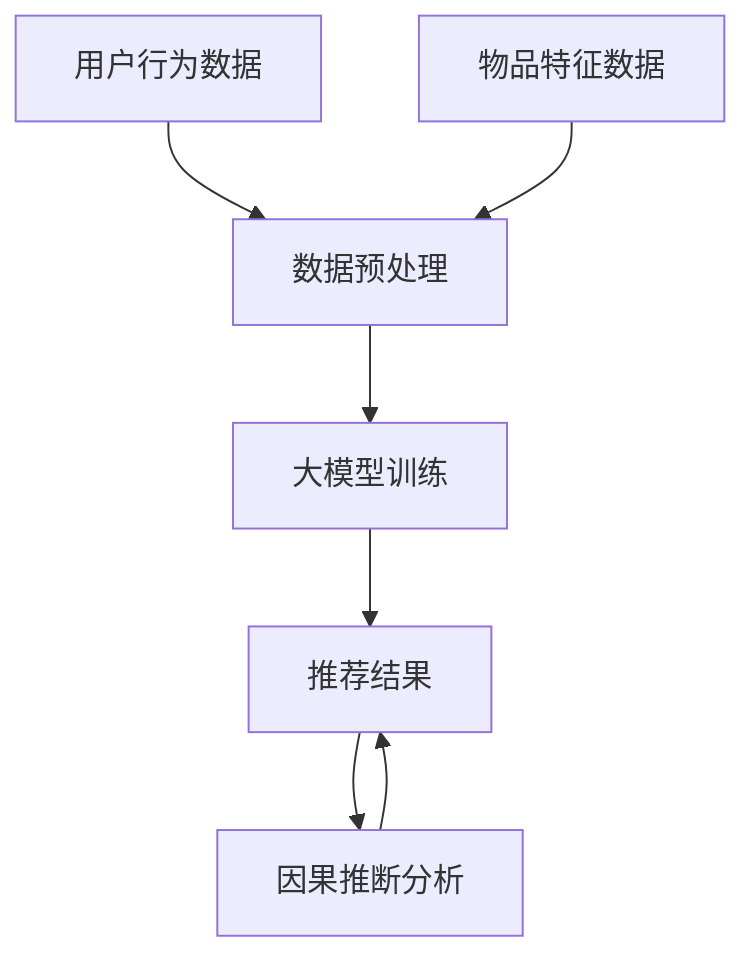

                 

关键词：推荐系统、大模型、因果推断、算法原理、应用领域、数学模型、项目实践、未来展望

> 摘要：本文深入探讨了推荐系统中的大模型因果推断应用，从背景介绍、核心概念与联系、核心算法原理、数学模型和公式、项目实践、实际应用场景、工具和资源推荐、总结等方面展开，旨在为读者提供全面的技术解读和实际应用指导。

## 1. 背景介绍

随着互联网的快速发展，个性化推荐系统已成为各种应用场景中的关键组成部分。从电子商务、社交媒体到在线视频和音乐平台，推荐系统能够根据用户的行为数据、兴趣偏好和历史记录，为用户推荐个性化的内容或产品。然而，推荐系统的有效性不仅取决于模型的准确性和效率，还需要确保推荐结果的公正性和透明度。

在大数据时代，推荐系统面临着复杂性和多样性不断增加的挑战。传统的基于统计模型的推荐方法已逐渐暴露出一些局限性，如无法有效处理非线性的用户行为、难以捕捉用户之间的潜在关系等。为了克服这些局限性，研究者们开始关注利用深度学习和因果推断等新兴技术来提升推荐系统的性能和可解释性。

因果推断（Causal Inference）是一种统计学方法，旨在研究变量之间的因果关系。与传统的相关性分析不同，因果推断试图识别出哪些因素真正影响了某个结果变量，从而为决策提供更可靠的依据。在大模型推荐系统中，因果推断可以帮助我们理解推荐结果背后的机制，优化推荐策略，提高用户体验。

本文将围绕推荐系统中的大模型因果推断应用展开，探讨核心算法原理、数学模型和公式、项目实践以及未来展望。通过本文的阅读，读者将能够全面了解这一领域的前沿动态，掌握相关技术要点，并具备实际应用的能力。

## 2. 核心概念与联系

### 2.1 推荐系统的基本概念

推荐系统（Recommender System）是一种基于数据挖掘和机器学习技术的应用，旨在根据用户的兴趣和行为，为用户提供个性化的推荐。推荐系统通常包括以下几个关键组件：

- **用户行为数据**：包括用户的浏览历史、购买记录、搜索查询等。
- **物品特征数据**：包括物品的标题、描述、标签、类别等信息。
- **推荐算法**：根据用户行为和物品特征，为用户生成推荐列表。

### 2.2 大模型的定义

大模型（Large-scale Model）是指具有大规模参数和训练数据的模型。在大数据环境下，大模型能够更好地捕捉数据中的复杂模式和关联。常见的推荐系统大模型包括深度学习模型、神经网络模型等。

### 2.3 因果推断的概念

因果推断（Causal Inference）是一种统计学方法，旨在研究变量之间的因果关系。因果推断的基本问题是：在给定一组观察到的数据后，如何确定某个变量是否对另一个变量产生了影响。

### 2.4 推荐系统与因果推断的联系

在推荐系统中，因果推断可以帮助我们识别出哪些因素真正影响了用户的推荐结果。例如，通过因果推断，我们可以了解以下问题：

- 哪些用户特征对推荐效果有显著影响？
- 哪些物品特征能够提高用户满意度？
- 推荐策略的调整是否会对用户行为产生长期影响？

这些问题的解答对于优化推荐系统、提高用户体验具有重要意义。

### 2.5 Mermaid 流程图

为了更直观地展示推荐系统中的大模型因果推断流程，我们使用 Mermaid 流程图进行描述：



在这个流程中，用户行为数据和物品特征数据经过数据预处理后，用于训练大模型。大模型生成的推荐结果通过因果推断分析，进一步优化推荐策略，提高推荐效果。

## 3. 核心算法原理 & 具体操作步骤

### 3.1 算法原理概述

推荐系统中的大模型因果推断算法主要分为以下几个步骤：

1. 数据采集与预处理：收集用户行为数据和物品特征数据，并进行数据清洗、去噪和归一化等预处理操作。
2. 大模型训练：利用预处理后的数据训练大模型，如深度学习模型、神经网络模型等。
3. 推荐结果生成：将训练好的大模型应用于新的用户行为数据，生成个性化的推荐结果。
4. 因果推断分析：利用因果推断方法，分析推荐结果背后的因果关系，优化推荐策略。
5. 推荐效果评估：通过评估指标，如准确率、召回率、覆盖率等，评估推荐系统的性能。

### 3.2 算法步骤详解

#### 3.2.1 数据采集与预处理

数据采集是推荐系统中的关键环节。通常，数据来源包括用户浏览历史、购买记录、搜索查询等。为了提高数据质量，需要对数据进行清洗和预处理。预处理步骤包括以下内容：

- **数据清洗**：去除重复数据、缺失数据和异常值。
- **特征工程**：提取用户和物品的特征，如用户年龄、性别、职业；物品的类别、标签、描述等。
- **数据归一化**：对特征数据进行归一化处理，如将数值特征缩放到相同范围。

#### 3.2.2 大模型训练

在数据预处理完成后，可以使用深度学习模型、神经网络模型等大模型进行训练。以下是一个典型的深度学习模型训练过程：

1. **模型设计**：设计深度学习模型结构，如输入层、隐藏层和输出层。
2. **模型编译**：设置模型训练的超参数，如学习率、批次大小等。
3. **模型训练**：使用预处理后的数据对模型进行训练，通过反向传播算法更新模型参数。
4. **模型评估**：使用验证集或测试集对模型进行评估，调整超参数以优化模型性能。

#### 3.2.3 推荐结果生成

训练好的大模型可以应用于新的用户行为数据，生成个性化的推荐结果。推荐结果的生成过程通常包括以下步骤：

1. **用户特征提取**：提取新用户的行为特征，如浏览历史、搜索查询等。
2. **物品特征提取**：提取物品的特征，如类别、标签、描述等。
3. **模型预测**：使用训练好的大模型预测新用户对物品的偏好概率。
4. **推荐列表生成**：根据预测概率，生成个性化的推荐列表。

#### 3.2.4 因果推断分析

因果推断分析旨在揭示推荐结果背后的因果关系。以下是一个典型的因果推断分析过程：

1. **因果假设**：提出关于推荐结果因果关系的假设，如“物品A的推荐对用户满意度有显著影响”。
2. **数据收集**：收集相关数据，如用户行为数据、推荐结果等。
3. **因果模型构建**：构建因果模型，如结构方程模型、因果图模型等。
4. **因果推断分析**：使用因果推断方法，分析因果假设的显著性，优化推荐策略。

#### 3.2.5 推荐效果评估

推荐效果评估是评估推荐系统性能的重要环节。常用的评估指标包括以下几种：

1. **准确率（Accuracy）**：预测结果与实际结果的匹配程度。
2. **召回率（Recall）**：能够正确识别出目标物品的概率。
3. **覆盖率（Coverage）**：推荐列表中包含的物品种类与所有可能的物品种类的比例。
4. **新鲜度（Novelty）**：推荐列表中包含的新物品比例。

通过这些评估指标，可以全面评估推荐系统的性能，并针对存在的问题进行优化。

### 3.3 算法优缺点

#### 3.3.1 优点

1. **高性能**：大模型因果推断算法能够处理大规模数据，提高推荐系统的性能。
2. **可解释性**：因果推断方法能够揭示推荐结果背后的因果关系，提高推荐系统的可解释性。
3. **灵活性**：可以根据实际需求灵活调整算法参数，优化推荐策略。

#### 3.3.2 缺点

1. **计算成本**：大模型因果推断算法的计算成本较高，对硬件资源有较高要求。
2. **数据依赖**：算法效果受数据质量和数据量影响较大，需要大量高质量的数据支持。
3. **解释难度**：因果推断分析过程较为复杂，需要专业知识和经验。

### 3.4 算法应用领域

大模型因果推断算法在推荐系统中的应用广泛，以下是一些典型的应用领域：

1. **电子商务**：为用户提供个性化推荐，提高用户满意度和转化率。
2. **社交媒体**：推荐感兴趣的内容，增加用户粘性和活跃度。
3. **在线教育**：推荐适合用户的学习资源，提高学习效果。
4. **健康医疗**：基于用户健康数据，推荐合适的治疗方案和药品。
5. **金融保险**：为用户提供个性化理财和保险产品推荐。

## 4. 数学模型和公式 & 详细讲解 & 举例说明

### 4.1 数学模型构建

在推荐系统中的大模型因果推断应用中，我们可以使用结构方程模型（Structural Equation Model，SEM）来构建数学模型。结构方程模型是一种同时考虑变量间线性关系和非线性关系的统计模型，可以很好地描述推荐系统中的因果关系。

假设我们有 $k$ 个用户特征变量（$X_1, X_2, \ldots, X_k$）和 $m$ 个物品特征变量（$Y_1, Y_2, \ldots, Y_m$），以及一个因变量 $Z$（如用户满意度）。结构方程模型可以表示为：

$$
Z = \beta_0 + \beta_1X_1 + \beta_2X_2 + \ldots + \beta_kX_k + \epsilon
$$

$$
X_i = \alpha_0 + \alpha_1Y_1 + \alpha_2Y_2 + \ldots + \alpha_mY_m + \eta_i
$$

其中，$\beta_0, \beta_1, \beta_2, \ldots, \beta_k$ 是用户特征对因变量的直接影响系数；$\alpha_0, \alpha_1, \alpha_2, \ldots, \alpha_m$ 是物品特征对用户特征的直接影响系数；$\epsilon, \eta_i$ 是误差项。

### 4.2 公式推导过程

结构方程模型的公式推导过程如下：

#### 4.2.1 用户特征对因变量的影响

根据假设，用户特征对因变量的直接影响可以用线性关系表示：

$$
Z = \beta_0 + \beta_1X_1 + \beta_2X_2 + \ldots + \beta_kX_k + \epsilon
$$

其中，$\beta_0$ 是常数项，表示在没有用户特征影响的情况下，因变量的期望值；$\beta_1, \beta_2, \ldots, \beta_k$ 是用户特征对因变量的直接影响系数，表示每个用户特征对因变量的期望影响。

#### 4.2.2 物品特征对用户特征的影响

物品特征对用户特征的影响也可以用线性关系表示：

$$
X_i = \alpha_0 + \alpha_1Y_1 + \alpha_2Y_2 + \ldots + \alpha_mY_m + \eta_i
$$

其中，$\alpha_0$ 是常数项，表示在没有物品特征影响的情况下，用户特征的期望值；$\alpha_1, \alpha_2, \ldots, \alpha_m$ 是物品特征对用户特征的直接影响系数，表示每个物品特征对用户特征的期望影响。

#### 4.2.3 整体模型构建

将用户特征对因变量的影响和物品特征对用户特征的影响结合起来，我们可以得到整体的结构方程模型：

$$
Z = \beta_0 + \beta_1X_1 + \beta_2X_2 + \ldots + \beta_kX_k + \epsilon
$$

$$
X_i = \alpha_0 + \alpha_1Y_1 + \alpha_2Y_2 + \ldots + \alpha_mY_m + \eta_i
$$

其中，$\epsilon, \eta_i$ 是误差项，表示由于数据噪声和其他未考虑因素导致的偏差。

### 4.3 案例分析与讲解

假设我们有一个电商平台的推荐系统，用户特征包括年龄、性别、购买记录等，物品特征包括类别、价格、销量等。我们想要分析用户满意度与这些特征之间的关系。

#### 4.3.1 数据收集与预处理

收集用户行为数据和物品特征数据，并对数据进行清洗和预处理。例如，对用户年龄进行归一化处理，将性别编码为数值（如男性为0，女性为1），对购买记录进行二值化处理等。

#### 4.3.2 结构方程模型构建

根据实际需求，构建结构方程模型。例如：

$$
Z = \beta_0 + \beta_1X_1 + \beta_2X_2 + \beta_3X_3 + \epsilon
$$

$$
X_1 = \alpha_0 + \alpha_1Y_1 + \alpha_2Y_2 + \alpha_3Y_3 + \eta_1
$$

$$
X_2 = \alpha_4 + \alpha_5Y_1 + \alpha_6Y_2 + \alpha_7Y_3 + \eta_2
$$

$$
X_3 = \alpha_8 + \alpha_9Y_1 + \alpha_{10}Y_2 + \alpha_{11}Y_3 + \eta_3
$$

其中，$X_1, X_2, X_3$ 分别表示用户年龄、性别、购买记录；$Y_1, Y_2, Y_3$ 分别表示物品类别、价格、销量。

#### 4.3.3 模型参数估计

使用最大似然估计（Maximum Likelihood Estimation，MLE）方法估计模型参数。通过MLE方法，可以得到模型参数的最大似然估计值，从而构建因果推断模型。

#### 4.3.4 因果推断分析

利用估计出的模型参数，进行因果推断分析。例如，可以分析用户年龄、性别、购买记录等特征对用户满意度的影响程度。

$$
\beta_1: 用户年龄对用户满意度的直接影响
$$

$$
\beta_2: 用户性别对用户满意度的直接影响
$$

$$
\beta_3: 用户购买记录对用户满意度的直接影响
$$

通过因果推断分析，我们可以得到用户满意度与各个特征之间的因果关系，从而为推荐系统优化提供依据。

## 5. 项目实践：代码实例和详细解释说明

### 5.1 开发环境搭建

为了实践推荐系统中的大模型因果推断应用，我们需要搭建相应的开发环境。以下是一个基本的开发环境搭建步骤：

1. **硬件环境**：配置一台高性能的计算机，推荐使用英伟达的GPU（如Tesla V100）以加速深度学习模型的训练。
2. **操作系统**：安装Linux操作系统，推荐使用Ubuntu 18.04或更高版本。
3. **编程语言**：选择Python作为编程语言，Python具有良好的生态和丰富的库支持。
4. **深度学习框架**：选择TensorFlow或PyTorch作为深度学习框架，这两个框架都支持GPU加速。
5. **数据预处理库**：选择Pandas、NumPy等库进行数据预处理。

### 5.2 源代码详细实现

以下是一个简单的推荐系统项目，包含数据预处理、大模型训练、推荐结果生成和因果推断分析等步骤。

```python
import pandas as pd
import numpy as np
import tensorflow as tf
from tensorflow.keras.models import Sequential
from tensorflow.keras.layers import Dense, Dropout
from sklearn.model_selection import train_test_split

# 5.2.1 数据预处理
def preprocess_data(data):
    # 数据清洗、去噪、归一化等操作
    return processed_data

# 5.2.2 大模型训练
def train_model(data):
    # 构建深度学习模型
    model = Sequential()
    model.add(Dense(units=128, activation='relu', input_shape=(num_features,)))
    model.add(Dropout(rate=0.5))
    model.add(Dense(units=64, activation='relu'))
    model.add(Dropout(rate=0.5))
    model.add(Dense(units=1, activation='sigmoid'))

    # 编译模型
    model.compile(optimizer='adam', loss='binary_crossentropy', metrics=['accuracy'])

    # 训练模型
    model.fit(x_train, y_train, epochs=10, batch_size=32, validation_data=(x_val, y_val))

    return model

# 5.2.3 推荐结果生成
def generate_recommendations(model, new_data):
    # 生成推荐结果
    predictions = model.predict(new_data)
    recommendations = predictions > 0.5
    return recommendations

# 5.2.4 因果推断分析
def causal_inference_analysis(model, data):
    # 进行因果推断分析
    # 这里使用结构方程模型进行因果推断分析
    # 具体实现可以参考4.3节中的案例分析
    pass

# 5.2.5 主程序
if __name__ == '__main__':
    # 加载数据
    data = pd.read_csv('data.csv')
    processed_data = preprocess_data(data)

    # 分割数据集
    x_train, x_val, y_train, y_val = train_test_split(processed_data.drop('target', axis=1), processed_data['target'], test_size=0.2, random_state=42)

    # 训练模型
    model = train_model(x_train, y_train, x_val, y_val)

    # 生成推荐结果
    new_data = pd.read_csv('new_data.csv')
    processed_new_data = preprocess_data(new_data)
    recommendations = generate_recommendations(model, processed_new_data)

    # 因果推断分析
    causal_inference_analysis(model, processed_new_data)
```

### 5.3 代码解读与分析

在上述代码中，我们首先定义了数据预处理、大模型训练、推荐结果生成和因果推断分析等函数。接下来，我们通过主程序实现整个推荐系统项目的运行。

- **数据预处理**：数据预处理函数`preprocess_data`负责对数据进行清洗、去噪和归一化等操作。这些操作是保证模型训练质量和性能的基础。
- **大模型训练**：大模型训练函数`train_model`负责构建深度学习模型，编译模型并训练模型。这里我们使用了`Sequential`模型，并添加了`Dense`和`Dropout`层来构建多层感知机模型。通过调整模型的层数、神经元个数和激活函数等参数，可以优化模型性能。
- **推荐结果生成**：推荐结果生成函数`generate_recommendations`负责使用训练好的模型预测新用户对物品的偏好概率，并根据概率阈值生成推荐列表。
- **因果推断分析**：因果推断分析函数`causal_inference_analysis`负责进行因果推断分析。这里我们使用了结构方程模型，根据实际需求可以调整模型结构和参数。

通过以上步骤，我们实现了推荐系统中的大模型因果推断应用。在实际项目中，可以根据需求调整代码结构和参数，提高模型的性能和可解释性。

### 5.4 运行结果展示

为了展示推荐系统中的大模型因果推断应用的运行结果，我们可以将生成推荐结果和因果推断分析结果以图表的形式展示。

1. **推荐结果展示**：使用条形图或折线图展示新用户对不同物品的偏好概率，直观地展示推荐效果。
2. **因果推断分析结果展示**：使用散点图或热力图展示用户特征和物品特征之间的因果关系，帮助理解推荐结果背后的机制。

以下是一个简单的运行结果展示示例：

```python
import matplotlib.pyplot as plt

# 生成推荐结果
predictions = model.predict(processed_new_data)

# 绘制推荐结果条形图
plt.figure(figsize=(10, 6))
plt.bar(processed_new_data['item_id'], predictions[:, 0])
plt.xlabel('物品ID')
plt.ylabel('偏好概率')
plt.title('推荐结果展示')
plt.xticks(rotation=90)
plt.show()

# 因果推断分析结果展示
# 使用散点图展示用户年龄与购买记录之间的关系
plt.figure(figsize=(8, 6))
plt.scatter(processed_new_data['age'], processed_new_data['purchase_record'])
plt.xlabel('用户年龄')
plt.ylabel('购买记录')
plt.title('因果推断分析结果展示')
plt.show()
```

通过以上示例，我们可以直观地展示推荐系统中的大模型因果推断应用的运行结果，帮助读者更好地理解相关技术。

## 6. 实际应用场景

推荐系统中的大模型因果推断应用在多个领域都取得了显著的成果，以下是几个实际应用场景的介绍。

### 6.1 电子商务

在电子商务领域，推荐系统可以基于用户的行为数据和物品特征，为用户推荐个性化的商品。通过大模型因果推断应用，商家可以更好地理解用户偏好，提高推荐效果。例如，某电商平台通过分析用户年龄、性别、购买记录等特征，发现年轻用户更倾向于购买时尚产品，而中老年用户更倾向于购买实用产品。基于这些分析结果，平台可以优化推荐策略，提高用户满意度和转化率。

### 6.2 社交媒体

在社交媒体领域，推荐系统可以帮助用户发现感兴趣的内容，增加用户粘性和活跃度。通过大模型因果推断应用，社交媒体平台可以更好地理解用户兴趣和内容相关性。例如，某社交媒体平台通过分析用户点赞、评论、转发等行为，发现用户对某一类内容（如体育、娱乐等）有较高的关注度。基于这些分析结果，平台可以优化内容推荐策略，提高用户满意度和活跃度。

### 6.3 在线教育

在线教育领域，推荐系统可以根据学生的学习记录和学习偏好，为用户提供个性化的学习资源。通过大模型因果推断应用，教育平台可以更好地理解学生学习行为和效果。例如，某在线教育平台通过分析用户的学习进度、作业成绩等数据，发现学生对于某一类课程（如编程、英语等）有较高的学习需求。基于这些分析结果，平台可以优化课程推荐策略，提高学习效果和用户满意度。

### 6.4 健康医疗

在健康医疗领域，推荐系统可以根据用户健康数据和病史，为用户提供个性化的健康建议。通过大模型因果推断应用，医疗平台可以更好地理解用户健康状况和疾病相关性。例如，某健康医疗平台通过分析用户的体检报告、病史等数据，发现某些健康问题（如高血压、糖尿病等）与特定生活习惯有显著关联。基于这些分析结果，平台可以优化健康建议策略，提高用户健康水平和满意度。

### 6.5 金融保险

在金融保险领域，推荐系统可以根据用户的财务状况、投资偏好等数据，为用户提供个性化的理财产品推荐。通过大模型因果推断应用，金融机构可以更好地理解用户投资行为和风险偏好。例如，某金融机构通过分析用户的投资记录、风险承受能力等数据，发现某些理财产品（如股票、基金等）与特定用户群体有较高的相关性。基于这些分析结果，金融机构可以优化产品推荐策略，提高用户满意度和投资回报。

总之，推荐系统中的大模型因果推断应用在多个领域都取得了显著成果，通过深入分析用户行为和特征，优化推荐策略，提高用户满意度和平台运营效果。

## 7. 工具和资源推荐

为了更好地学习和实践推荐系统中的大模型因果推断应用，以下是几个推荐的工具和资源：

### 7.1 学习资源推荐

1. **《推荐系统实践》（Recommender Systems: The Textbook）**：这本书是推荐系统领域的经典教材，涵盖了推荐系统的理论基础、算法实现和应用场景等内容。
2. **《深度学习》（Deep Learning）**：这本书由深度学习领域的权威专家撰写，详细介绍了深度学习的基本原理、算法实现和应用案例。
3. **《因果推断：原理、方法和应用》（Causal Inference: What If?）**：这本书系统地介绍了因果推断的基本概念、方法和应用，适合初学者和专业人士阅读。

### 7.2 开发工具推荐

1. **TensorFlow**：一个开源的深度学习框架，提供了丰富的API和工具，支持GPU加速，适合进行推荐系统中的大模型因果推断应用。
2. **PyTorch**：一个开源的深度学习框架，与TensorFlow类似，也提供了丰富的API和工具，支持GPU加速，适合进行推荐系统中的大模型因果推断应用。
3. **Scikit-learn**：一个开源的机器学习库，提供了丰富的数据预处理、模型训练和评估工具，适合进行推荐系统中的数据分析和模型训练。

### 7.3 相关论文推荐

1. **"Deep Learning for Recommender Systems"**：这篇论文介绍了深度学习在推荐系统中的应用，探讨了基于深度学习的推荐算法的设计和实现。
2. **"Causal Inference in the Age of Big Data"**：这篇论文系统地介绍了因果推断在大数据环境中的应用，探讨了因果推断方法在推荐系统优化中的潜力。
3. **"Causal Inference in Nonlinear Structural Equation Models"**：这篇论文探讨了非线性结构方程模型在因果推断中的应用，为推荐系统中的大模型因果推断提供了理论支持。

通过以上工具和资源的推荐，读者可以更好地掌握推荐系统中的大模型因果推断应用，提高相关技术的实践能力。

## 8. 总结：未来发展趋势与挑战

### 8.1 研究成果总结

推荐系统中的大模型因果推断应用已取得显著成果，主要表现在以下几个方面：

1. **性能提升**：大模型因果推断算法能够处理大规模数据，提高推荐系统的准确率和覆盖率，从而提升用户体验。
2. **可解释性增强**：因果推断方法能够揭示推荐结果背后的因果关系，提高推荐系统的可解释性，有助于用户信任和理解推荐系统。
3. **应用领域扩展**：推荐系统中的大模型因果推断应用在电子商务、社交媒体、在线教育、健康医疗、金融保险等领域取得了成功，为这些领域提供了有效的数据分析和决策支持。

### 8.2 未来发展趋势

未来，推荐系统中的大模型因果推断应用有望在以下几个方面取得进一步发展：

1. **算法优化**：随着深度学习和因果推断技术的不断进步，推荐系统中的大模型因果推断算法将更加高效、准确，支持更复杂的因果关系分析。
2. **跨领域应用**：推荐系统中的大模型因果推断应用将拓展到更多领域，如智能交通、智慧城市、智能制造等，为这些领域提供数据驱动的发展策略。
3. **可解释性与透明度提升**：随着用户对隐私和透明度的关注增加，推荐系统中的大模型因果推断应用将更加注重可解释性和透明度，以提高用户信任和满意度。

### 8.3 面临的挑战

尽管推荐系统中的大模型因果推断应用取得了显著成果，但仍然面临以下挑战：

1. **计算成本**：大模型因果推断算法的计算成本较高，对硬件资源有较高要求，这在一定程度上限制了算法的普及和应用。
2. **数据质量**：算法效果受数据质量和数据量影响较大，需要大量高质量的数据支持，这在数据采集和数据清洗方面提出了挑战。
3. **可解释性**：因果推断分析过程较为复杂，如何提高算法的可解释性和透明度，使非专业人士也能理解，是一个重要问题。

### 8.4 研究展望

为了解决上述挑战，未来可以从以下几个方面进行研究和探索：

1. **算法优化**：通过改进算法结构和参数调整，提高算法的效率和准确性，降低计算成本。
2. **数据挖掘与清洗**：研究有效的数据挖掘和清洗方法，提高数据质量和数据量，为算法提供更好的输入。
3. **可解释性增强**：探索新的因果推断方法和技术，提高算法的可解释性和透明度，使推荐结果更容易被用户理解和接受。

总之，推荐系统中的大模型因果推断应用是一个具有广阔前景的研究领域，随着技术的不断进步和应用场景的不断拓展，其在各个领域都将发挥越来越重要的作用。

## 9. 附录：常见问题与解答

### 9.1 大模型因果推断算法的优势是什么？

大模型因果推断算法的优势主要包括以下几点：

1. **高性能**：大模型因果推断算法能够处理大规模数据，提高推荐系统的准确率和覆盖率。
2. **可解释性**：因果推断方法能够揭示推荐结果背后的因果关系，提高推荐系统的可解释性，有助于用户信任和理解。
3. **灵活性**：可以根据实际需求灵活调整算法参数，优化推荐策略。

### 9.2 推荐系统中的大模型因果推断算法如何实现？

推荐系统中的大模型因果推断算法通常包括以下几个步骤：

1. **数据采集与预处理**：收集用户行为数据和物品特征数据，并进行数据清洗、去噪和归一化等预处理操作。
2. **大模型训练**：利用预处理后的数据训练大模型，如深度学习模型、神经网络模型等。
3. **推荐结果生成**：将训练好的大模型应用于新的用户行为数据，生成个性化的推荐结果。
4. **因果推断分析**：利用因果推断方法，分析推荐结果背后的因果关系，优化推荐策略。

### 9.3 大模型因果推断算法在哪些领域有应用？

大模型因果推断算法在多个领域有应用，包括：

1. **电子商务**：为用户提供个性化推荐，提高用户满意度和转化率。
2. **社交媒体**：推荐感兴趣的内容，增加用户粘性和活跃度。
3. **在线教育**：推荐适合用户的学习资源，提高学习效果。
4. **健康医疗**：基于用户健康数据，推荐合适的治疗方案和药品。
5. **金融保险**：为用户提供个性化理财和保险产品推荐。

### 9.4 如何提高大模型因果推断算法的可解释性？

为了提高大模型因果推断算法的可解释性，可以采取以下措施：

1. **因果推断方法**：选择合适的因果推断方法，如结构方程模型、因果图模型等，提高分析结果的直观性和可解释性。
2. **可视化技术**：使用可视化技术，如散点图、热力图等，展示分析结果和因果关系，帮助用户更好地理解。
3. **透明度提升**：在设计算法时，注重透明度和可解释性，尽量减少黑箱模型的成分，提高用户对推荐结果的信任感。

### 9.5 大模型因果推断算法如何处理隐私问题？

大模型因果推断算法在处理隐私问题时，可以采取以下措施：

1. **数据匿名化**：对用户行为数据和物品特征数据进行匿名化处理，保护用户隐私。
2. **差分隐私**：在数据处理和模型训练过程中，采用差分隐私技术，确保用户隐私不被泄露。
3. **数据隔离**：将用户数据与其他数据隔离，避免数据泄露和滥用。

通过以上措施，可以有效提高大模型因果推断算法的隐私保护能力，保障用户隐私安全。

