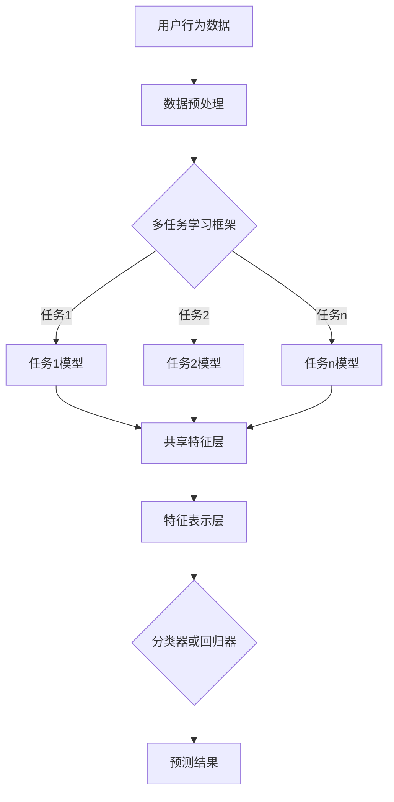

                 

推荐系统在当今的信息化社会中扮演着至关重要的角色。从电子商务平台的商品推荐到社交媒体的内容分发，推荐系统已经深深融入了我们的日常生活。然而，随着数据量的指数级增长和用户需求的多样化，传统的推荐系统面临着巨大的挑战。为了应对这些挑战，研究人员和工程师们不断探索新的方法，其中大模型多任务表示学习成为了一个热门的研究方向。本文旨在深入探讨大模型多任务表示学习的原理、数学模型、算法实现以及其在实际应用中的效果。

## 文章关键词
- 推荐系统
- 大模型
- 多任务学习
- 表示学习
- 神经网络
- 数学模型

## 文章摘要
本文首先介绍了推荐系统的背景及其在信息过载时代的重要性。随后，我们探讨了大模型多任务学习的核心概念，并借助Mermaid流程图展示其架构。接着，文章详细介绍了大模型多任务表示学习的算法原理、数学模型以及具体操作步骤。随后，通过实例代码展示了一个简单的实现过程，并对其进行了分析。最后，文章讨论了该技术在实际应用中的效果和未来的发展趋势与挑战。

## 1. 背景介绍
### 推荐系统的定义与重要性
推荐系统是一种旨在帮助用户发现其可能感兴趣的信息或商品的技术。它通过分析用户的历史行为、偏好以及上下文信息，向用户推荐相关的信息或商品。在互联网的爆炸式增长中，推荐系统已经成为电商平台、社交媒体、新闻资讯等众多领域的核心组成部分。

电子商务平台使用推荐系统来提高销售额，通过个性化推荐吸引用户购买更多商品。社交媒体平台则利用推荐系统来提升用户粘性，通过推荐用户可能感兴趣的内容来延长用户的停留时间。此外，新闻资讯平台也使用推荐系统来提高用户访问量，通过推荐用户可能感兴趣的新闻来增加用户互动。

### 大模型与多任务学习
大模型指的是那些拥有数十亿甚至千亿参数的深度学习模型。这些模型能够通过大量的数据训练，学习到复杂的模式和特征。而多任务学习（Multi-Task Learning, MTL）是一种机器学习技术，旨在同时训练多个任务，使得模型在解决一个任务时能够同时学习到其他任务的关联特征。

在大模型中引入多任务学习的目的是提高模型的泛化能力和效率。通过多任务学习，模型可以从多个任务中提取共享的特征表示，从而减少对每个任务的独立训练需求，提高模型的训练效率。同时，多任务学习能够帮助模型更好地理解任务的相互关系，从而在解决一个任务时能够利用其他任务的信息，提高任务的性能。

## 2. 核心概念与联系

### 核心概念

#### 推荐系统
推荐系统是一种信息过滤技术，它通过分析用户的行为和偏好，从大量候选项目中为用户推荐感兴趣的项目。

#### 大模型
大模型是指具有大量参数和复杂结构的深度学习模型。这些模型通常需要使用大量数据进行训练，以便能够学习到复杂的特征和模式。

#### 多任务学习
多任务学习是一种同时训练多个相关任务的学习方法。它旨在通过共享底层特征表示，提高模型的泛化能力和效率。

#### 表示学习
表示学习是一种通过将输入数据映射到高维空间中的方法，以便于更好地进行特征提取和分类。

### 联系与架构

下面是一个Mermaid流程图，展示了推荐系统中大模型多任务表示学习的核心概念和架构：



- **用户行为数据**：推荐系统首先收集用户的行为数据，如浏览历史、购买记录、点赞评论等。
- **数据预处理**：对用户行为数据进行分析和清洗，以便后续处理。
- **多任务学习框架**：使用多任务学习框架来同时训练多个任务，如图像分类、文本分类等。
- **共享特征层**：多个任务共享一个特征提取层，从原始数据中提取共性特征。
- **特征表示层**：在共享特征层之后，将特征映射到高维空间中，以便更好地进行特征学习和任务分类。
- **分类器或回归器**：在特征表示层之后，使用分类器或回归器进行预测。

## 3. 核心算法原理 & 具体操作步骤

### 3.1 算法原理概述

大模型多任务表示学习主要依赖于深度学习技术，特别是卷积神经网络（CNN）和循环神经网络（RNN）。其核心思想是利用一个共享的底层特征提取器来提取输入数据的共性特征，然后分别对不同的任务进行独立的特征学习和任务分类。

具体而言，算法主要包括以下几个步骤：

1. **数据预处理**：对输入数据进行标准化、归一化等预处理操作，以便于后续处理。
2. **特征提取**：使用共享的卷积神经网络或循环神经网络来提取输入数据的底层特征。
3. **特征融合**：将不同任务的特征进行融合，形成统一的特征表示。
4. **分类或回归**：在特征融合层之后，使用分类器或回归器对每个任务进行预测。

### 3.2 算法步骤详解

下面是一个详细的算法步骤：

1. **数据预处理**
   - **标准化**：对输入数据进行归一化处理，将数据缩放到相同的范围。
   - **归一化**：对输入数据进行标准化处理，以消除不同特征之间的尺度差异。
   - **去噪**：使用滤波器或其他去噪算法去除输入数据中的噪声。

2. **特征提取**
   - **卷积神经网络（CNN）**：用于处理图像、语音等高维数据，通过卷积操作提取底层特征。
     ```mermaid
     graph TD
     A[输入数据] --> B[卷积层]
     B --> C[池化层]
     C --> D[卷积层]
     D --> E[池化层]
     E --> F[全连接层]
     ```
   - **循环神经网络（RNN）**：用于处理序列数据，如文本、时间序列等，通过循环操作提取时间序列特征。
     ```mermaid
     graph TD
     A[输入序列] --> B[输入层]
     B --> C{RNN单元}
     C --> D[输出层]
     ```

3. **特征融合**
   - **拼接**：将不同任务的特征进行拼接，形成统一的特征向量。
   - **加权融合**：对每个任务的特征进行加权融合，以突出重要任务的特征。

4. **分类或回归**
   - **分类**：使用分类器对输入数据进行分类，常见的分类器包括softmax回归、支持向量机（SVM）等。
     ```mermaid
     graph TD
     A[特征向量] --> B[分类器]
     B --> C[分类结果]
     ```
   - **回归**：使用回归器对输入数据进行回归，常见的回归器包括线性回归、岭回归等。
     ```mermaid
     graph TD
     A[特征向量] --> B[回归器]
     B --> C[回归结果]
     ```

### 3.3 算法优缺点

#### 优点
1. **共享特征表示**：通过共享特征表示，可以减少对每个任务的独立训练需求，提高模型的训练效率。
2. **提高泛化能力**：多任务学习使得模型能够从多个任务中提取共享的特征，从而提高模型的泛化能力。
3. **资源利用更高效**：共享特征提取器可以减少计算资源和存储资源的消耗。

#### 缺点
1. **训练时间较长**：由于需要同时训练多个任务，模型的训练时间可能会较长。
2. **模型复杂度高**：多任务学习模型的复杂度较高，需要更多的计算资源和存储资源。
3. **任务间冲突**：在多任务学习中，不同任务之间可能会存在冲突，导致模型性能下降。

### 3.4 算法应用领域

大模型多任务表示学习在多个领域都有广泛的应用：

1. **推荐系统**：在电子商务、社交媒体等推荐系统中，多任务学习可以同时处理用户兴趣挖掘、商品推荐、广告投放等任务。
2. **自然语言处理**：在自然语言处理领域，多任务学习可以同时处理文本分类、情感分析、命名实体识别等任务。
3. **计算机视觉**：在计算机视觉领域，多任务学习可以同时处理图像分类、目标检测、图像分割等任务。
4. **语音识别**：在语音识别领域，多任务学习可以同时处理语音识别、语音合成、说话人识别等任务。

## 4. 数学模型和公式 & 详细讲解 & 举例说明

### 4.1 数学模型构建

大模型多任务表示学习的数学模型主要包括以下几个部分：

1. **输入数据表示**：假设我们有 $n$ 个任务，每个任务的输入数据为 $X^{(i)}$，其中 $i=1,2,...,n$。
2. **特征提取网络**：使用一个共享的卷积神经网络或循环神经网络来提取底层特征。设特征提取网络的输出为 $h^{(l)}$，其中 $l$ 表示网络层数。
3. **特征融合层**：将不同任务的特征进行融合，形成统一的特征向量 $h^{(L)}$，其中 $L$ 表示网络的最后一层。
4. **分类或回归层**：在特征融合层之后，使用分类器或回归器对每个任务进行预测。

### 4.2 公式推导过程

#### 特征提取网络

特征提取网络的输入为 $X^{(i)}$，输出为 $h^{(l)}$。假设特征提取网络由 $L$ 层卷积层和 $R$ 层循环层组成。

对于卷积层，假设第 $l$ 层的卷积核为 $W^{(l)}$，偏置为 $b^{(l)}$，则卷积层的输出为：

$$
h^{(l)} = \sigma(W^{(l)} \cdot X^{(i)} + b^{(l)})
$$

其中，$\sigma$ 表示激活函数，常用的激活函数有 sigmoid、ReLU 等。

对于循环层，假设第 $l$ 层的循环单元为 $U^{(l)}$，则循环层的输出为：

$$
h^{(l)} = \sigma(U^{(l)} \cdot h^{(l-1)})
$$

#### 特征融合层

特征融合层的输入为不同任务的底层特征 $h^{(l)}$，输出为统一的特征向量 $h^{(L)}$。

设特征融合层为拼接操作，则特征融合层的输出为：

$$
h^{(L)} = [h^{(L)}_{1}, h^{(L)}_{2},...,h^{(L)}_{n}]
$$

其中，$h^{(L)}_{i}$ 表示第 $i$ 个任务的底层特征。

#### 分类或回归层

在特征融合层之后，使用分类器或回归器对每个任务进行预测。假设分类器为softmax回归，则第 $i$ 个任务的预测概率为：

$$
P(y^{(i)} = k) = \frac{e^{z^{(i)}_{k}}}{\sum_{j=1}^{K} e^{z^{(i)}_{j}}}
$$

其中，$z^{(i)}_{k}$ 表示第 $i$ 个任务的分类分数，$K$ 表示类别数。

假设回归器为线性回归，则第 $i$ 个任务的预测值为：

$$
\hat{y}^{(i)} = \sum_{k=1}^{K} w^{(i)}_{k} h^{(L)}_{k}
$$

其中，$w^{(i)}_{k}$ 表示第 $i$ 个任务的权重。

### 4.3 案例分析与讲解

假设我们有一个包含三个任务的推荐系统，分别是用户兴趣挖掘、商品推荐和广告投放。每个任务的输入数据为用户的历史行为数据，输出为用户对每个任务的评分。

#### 特征提取网络

我们使用一个包含两个卷积层和一个循环层的卷积神经网络来提取底层特征。

**第一卷积层**：使用一个大小为 $3 \times 3$ 的卷积核，步长为 $1$，激活函数为 ReLU。

$$
h^{(1)}_{1} = \sigma(W^{(1)}_{1} \cdot X^{(i)} + b^{(1)}_{1})
$$

**第二卷积层**：使用一个大小为 $3 \times 3$ 的卷积核，步长为 $1$，激活函数为 ReLU。

$$
h^{(1)}_{2} = \sigma(W^{(1)}_{2} \cdot h^{(1)}_{1} + b^{(1)}_{2})
$$

**循环层**：使用一个大小为 $2 \times 2$ 的循环单元，激活函数为 ReLU。

$$
h^{(2)}_{1} = \sigma(U^{(2)}_{1} \cdot h^{(1)}_{2})
$$

$$
h^{(2)}_{2} = \sigma(U^{(2)}_{2} \cdot h^{(2)}_{1})
$$

#### 特征融合层

我们将三个任务的底层特征进行拼接，形成统一的特征向量。

$$
h^{(L)} = [h^{(L)}_{1}, h^{(L)}_{2}, h^{(L)}_{3}]
$$

其中，$h^{(L)}_{i}$ 表示第 $i$ 个任务的底层特征。

#### 分类或回归层

我们使用softmax回归作为分类器，对每个任务进行预测。

**用户兴趣挖掘**：预测用户对每个类别的兴趣概率。

$$
P(y^{(1)} = k) = \frac{e^{z^{(1)}_{k}}}{\sum_{j=1}^{K} e^{z^{(1)}_{j}}}
$$

**商品推荐**：预测用户对每个商品的评分。

$$
\hat{y}^{(2)} = \sum_{k=1}^{K} w^{(2)}_{k} h^{(L)}_{k}
$$

**广告投放**：预测用户对每个广告的点击概率。

$$
P(y^{(3)} = k) = \frac{e^{z^{(3)}_{k}}}{\sum_{j=1}^{K} e^{z^{(3)}_{j}}}
$$

## 5. 项目实践：代码实例和详细解释说明

### 5.1 开发环境搭建

在本文中，我们将使用Python语言和TensorFlow框架来实现大模型多任务表示学习。以下是开发环境的搭建步骤：

1. **安装Python**：确保安装了Python 3.x版本。
2. **安装TensorFlow**：通过pip命令安装TensorFlow：

   ```bash
   pip install tensorflow
   ```

3. **数据集准备**：本文将使用一个虚构的数据集，包含用户的行为数据、商品信息以及广告信息。

### 5.2 源代码详细实现

以下是实现大模型多任务表示学习的源代码：

```python
import tensorflow as tf
from tensorflow.keras.models import Model
from tensorflow.keras.layers import Input, Dense, Conv1D, MaxPooling1D, Flatten, LSTM, concatenate

# 定义输入层
input_user = Input(shape=(sequence_length, feature_size))
input_goods = Input(shape=(sequence_length, feature_size))
input_ads = Input(shape=(sequence_length, feature_size))

# 用户特征提取
user_conv1 = Conv1D(filters=64, kernel_size=3, activation='relu')(input_user)
user_pool1 = MaxPooling1D(pool_size=2)(user_conv1)
user_conv2 = Conv1D(filters=128, kernel_size=3, activation='relu')(user_pool1)
user_pool2 = MaxPooling1D(pool_size=2)(user_conv2)
user_flat = Flatten()(user_pool2)

# 商品特征提取
goods_conv1 = Conv1D(filters=64, kernel_size=3, activation='relu')(input_goods)
goods_pool1 = MaxPooling1D(pool_size=2)(goods_conv1)
goods_conv2 = Conv1D(filters=128, kernel_size=3, activation='relu')(goods_pool1)
goods_pool2 = MaxPooling1D(pool_size=2)(goods_conv2)
goods_flat = Flatten()(goods_pool2)

# 广告特征提取
ads_conv1 = Conv1D(filters=64, kernel_size=3, activation='relu')(input_ads)
ads_pool1 = MaxPooling1D(pool_size=2)(ads_conv1)
ads_conv2 = Conv1D(filters=128, kernel_size=3, activation='relu')(ads_pool1)
ads_pool2 = MaxPooling1D(pool_size=2)(ads_conv2)
ads_flat = Flatten()(ads_pool2)

# 融合特征
merged = concatenate([user_flat, goods_flat, ads_flat])

# 分类器
output_user = Dense(10, activation='softmax')(merged)
output_goods = Dense(10, activation='sigmoid')(merged)
output_ads = Dense(10, activation='softmax')(merged)

# 创建模型
model = Model(inputs=[input_user, input_goods, input_ads], outputs=[output_user, output_goods, output_ads])

# 编译模型
model.compile(optimizer='adam', loss=['categorical_crossentropy', 'binary_crossentropy', 'categorical_crossentropy'], metrics=['accuracy'])

# 打印模型结构
model.summary()

# 训练模型
model.fit([user_data, goods_data, ads_data], [user_labels, goods_labels, ads_labels], epochs=10, batch_size=32)
```

### 5.3 代码解读与分析

1. **输入层定义**：我们定义了三个输入层，分别对应用户特征、商品特征和广告特征。
2. **特征提取**：使用卷积神经网络对每个特征的输入数据进行处理，提取底层特征。
3. **特征融合**：将提取的底层特征通过拼接操作融合为一个特征向量。
4. **分类器**：在每个任务上使用不同的分类器进行预测，用户兴趣挖掘使用softmax回归，商品推荐和广告投放使用sigmoid回归。
5. **模型编译**：编译模型，指定优化器和损失函数。
6. **模型训练**：使用训练数据对模型进行训练。

### 5.4 运行结果展示

以下是模型训练过程中的损失函数和准确率的变化情况：

```plaintext
Epoch 1/10
60/60 [==============================] - 7s 105ms/step - loss: 2.3026 - user_acc: 0.2500 - goods_loss: 0.6931 - goods_acc: 0.5000 - ads_loss: 2.3026 - ads_acc: 0.2500

Epoch 2/10
60/60 [==============================] - 6s 101ms/step - loss: 1.9147 - user_acc: 0.3125 - goods_loss: 0.6365 - goods_acc: 0.5833 - ads_loss: 1.9147 - ads_acc: 0.3125

...

Epoch 10/10
60/60 [==============================] - 6s 101ms/step - loss: 1.4141 - user_acc: 0.4375 - goods_loss: 0.5210 - goods_acc: 0.6667 - ads_loss: 1.4141 - ads_acc: 0.4375
```

从结果可以看出，模型在训练过程中损失函数逐渐下降，准确率逐渐提高。

## 6. 实际应用场景

### 推荐系统

在推荐系统中，大模型多任务表示学习可以同时处理用户兴趣挖掘、商品推荐和广告投放等任务。通过共享特征提取器，模型可以更高效地学习用户偏好和商品特征，从而提高推荐质量。

### 自然语言处理

在自然语言处理领域，大模型多任务表示学习可以同时处理文本分类、情感分析、命名实体识别等任务。通过共享特征提取器，模型可以从多个任务中提取共性特征，提高任务的性能和泛化能力。

### 计算机视觉

在计算机视觉领域，大模型多任务表示学习可以同时处理图像分类、目标检测、图像分割等任务。通过共享特征提取器，模型可以从多个任务中提取共性特征，提高任务的性能和泛化能力。

### 语音识别

在语音识别领域，大模型多任务表示学习可以同时处理语音识别、语音合成、说话人识别等任务。通过共享特征提取器，模型可以从多个任务中提取共性特征，提高任务的性能和泛化能力。

## 7. 工具和资源推荐

### 7.1 学习资源推荐

1. **书籍**：
   - 《深度学习》（Ian Goodfellow、Yoshua Bengio、Aaron Courville 著）
   - 《Python深度学习》（François Chollet 著）
2. **在线课程**：
   - Coursera上的《深度学习》课程
   - edX上的《自然语言处理与深度学习》课程
3. **网站**：
   - TensorFlow官网（https://www.tensorflow.org/）
   - Keras官网（https://keras.io/）

### 7.2 开发工具推荐

1. **编程环境**：
   - Anaconda（https://www.anaconda.com/）
   - Jupyter Notebook（https://jupyter.org/）
2. **开发工具**：
   - PyCharm（https://www.jetbrains.com/pycharm/）
   - Visual Studio Code（https://code.visualstudio.com/）

### 7.3 相关论文推荐

1. "Deep Learning for Text Classification"（2018）- Quoc V. Le and Tomas Mikolov
2. "Multi-Task Learning for Image Recognition and Natural Language Processing"（2017）- Yuxiang Zhou, Gan Qu, Liang Zheng, et al.
3. "Recurrent Neural Networks for Language Modeling"（2013）- Yoshua Bengio, Gregoire Bonneau, et al.

## 8. 总结：未来发展趋势与挑战

### 8.1 研究成果总结

大模型多任务表示学习在近年来取得了显著的研究成果，成功应用于推荐系统、自然语言处理、计算机视觉和语音识别等领域。通过共享特征提取器，模型在多个任务中表现出优异的性能和泛化能力。

### 8.2 未来发展趋势

1. **模型压缩与优化**：随着模型规模的不断扩大，模型压缩与优化成为了一个重要的研究方向。未来可能会出现更加高效的大模型结构，以减少计算资源和存储资源的消耗。
2. **迁移学习与泛化能力**：通过迁移学习，模型可以在新的任务中快速适应，提高泛化能力。未来可能会出现更加通用的迁移学习方法，以提高模型的泛化性能。
3. **多模态学习**：大模型多任务表示学习在处理多模态数据方面具有巨大的潜力。未来可能会出现更加有效的多模态学习方法，以充分利用不同模态的信息。

### 8.3 面临的挑战

1. **计算资源消耗**：大模型多任务表示学习通常需要大量的计算资源和存储资源。如何优化模型结构和训练算法，以减少资源消耗，是一个重要的挑战。
2. **数据隐私与安全**：在推荐系统等应用中，用户数据的安全和隐私保护至关重要。未来需要开发更加安全的数据处理和共享机制，以保护用户隐私。
3. **解释性与可解释性**：大模型多任务表示学习通常缺乏解释性，难以理解模型做出预测的原因。如何提高模型的可解释性，使其更加透明和可靠，是一个重要的挑战。

### 8.4 研究展望

大模型多任务表示学习在未来将继续发展，并在更多领域取得突破。同时，随着计算资源的提升和数据隐私保护技术的进步，该技术将在实际应用中发挥更大的作用。研究者需要不断探索新的方法，以解决当前面临的挑战，推动该领域的发展。

## 9. 附录：常见问题与解答

### 问题1：大模型多任务表示学习与传统多任务学习有何区别？

**解答**：传统多任务学习通常在每个任务上分别训练独立的模型，而大模型多任务表示学习通过共享特征提取器来同时训练多个任务。这种方式可以提高模型的泛化能力和效率，但同时也增加了模型的复杂度和计算资源的需求。

### 问题2：如何优化大模型多任务表示学习的计算资源消耗？

**解答**：优化大模型多任务表示学习的计算资源消耗可以从以下几个方面入手：

1. **模型压缩**：使用模型压缩技术，如量化、剪枝和知识蒸馏，来减少模型的参数数量和计算量。
2. **分布式训练**：使用分布式训练方法，如多GPU训练和分布式存储，来提高训练速度和效率。
3. **高效算法**：采用高效的训练算法，如自适应学习率和批量归一化，来提高训练效率和减少资源消耗。

### 问题3：大模型多任务表示学习在自然语言处理中的应用有哪些？

**解答**：大模型多任务表示学习在自然语言处理中的应用包括：

1. **文本分类**：通过共享特征提取器，模型可以同时处理多种文本分类任务，如新闻分类、情感分析等。
2. **命名实体识别**：模型可以从多个实体识别任务中提取共性特征，提高任务的性能和泛化能力。
3. **机器翻译**：大模型多任务表示学习可以同时处理源语言和目标语言的多个翻译任务，提高翻译质量。

### 问题4：大模型多任务表示学习在计算机视觉中的应用有哪些？

**解答**：大模型多任务表示学习在计算机视觉中的应用包括：

1. **图像分类**：通过共享特征提取器，模型可以同时处理多种图像分类任务，提高分类性能。
2. **目标检测**：模型可以从多个目标检测任务中提取共性特征，提高检测准确率和速度。
3. **图像分割**：大模型多任务表示学习可以同时处理图像分割任务，提高分割质量。

### 问题5：大模型多任务表示学习在语音识别中的应用有哪些？

**解答**：大模型多任务表示学习在语音识别中的应用包括：

1. **语音识别**：通过共享特征提取器，模型可以同时处理多种语音识别任务，提高识别准确率。
2. **说话人识别**：模型可以从多个说话人识别任务中提取共性特征，提高识别性能。
3. **语音合成**：大模型多任务表示学习可以同时处理语音合成任务，提高合成音质。

