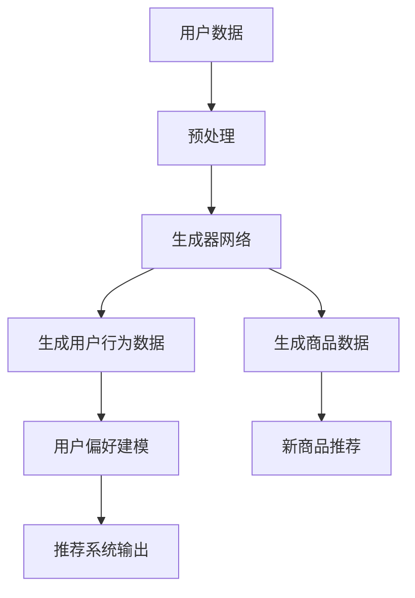

                 

关键词：推荐系统、大模型、对抗生成网络、用户行为、个性化推荐

> 摘要：本文深入探讨了推荐系统中的大模型对抗生成网络应用。通过分析大模型对抗生成网络的基本概念、原理以及其在推荐系统中的应用，本文旨在为读者提供一个全面而深入的理解，帮助开发者和研究者更好地利用这一前沿技术提升推荐系统的性能和效果。

## 1. 背景介绍

随着互联网的普及和大数据技术的发展，推荐系统已经成为现代信息检索和电子商务领域的关键技术。推荐系统旨在根据用户的历史行为和偏好，向用户推荐可能感兴趣的内容或商品。然而，传统的推荐系统往往面临着数据稀疏性、冷启动问题和偏好一致性等挑战。为了解决这些问题，研究者们提出了多种改进方法，其中大模型对抗生成网络（Generative Adversarial Networks, GANs）的应用引起了广泛关注。

大模型对抗生成网络是由生成器和判别器两个神经网络组成的对偶结构。生成器旨在生成与真实数据相似的数据，而判别器则负责区分真实数据和生成数据。通过这一对抗过程，生成器不断优化其生成能力，使得生成数据更加真实，从而提高推荐系统的效果。

## 2. 核心概念与联系

### 2.1 大模型对抗生成网络原理

大模型对抗生成网络（GANs）的核心是生成器和判别器的对抗训练。生成器的任务是生成尽可能真实的数据，而判别器的任务是准确地区分真实数据和生成数据。训练过程中，生成器和判别器不断相互对抗，最终生成器能够生成高质量的数据，判别器无法区分真实数据和生成数据。

生成器的网络结构通常采用多层感知机（MLP）或卷积神经网络（CNN），输入为随机噪声，输出为生成数据。判别器的结构类似，输入为真实数据和生成数据，输出为概率值，表示输入数据的真实程度。

### 2.2 推荐系统与GANs的关系

在推荐系统中，GANs的应用主要体现在以下几个方面：

1. **生成用户行为数据**：通过生成器生成与真实用户行为相似的数据，缓解数据稀疏性问题。这有助于推荐系统更好地理解用户兴趣和行为，从而提高推荐质量。
   
2. **生成新商品数据**：对于新加入的商品，推荐系统可能缺乏足够的用户评价数据。通过生成器生成与真实商品相似的数据，可以帮助系统对新商品进行推荐。

3. **增强用户偏好建模**：GANs可以生成与用户偏好相似的数据，从而丰富用户偏好模型，提高推荐系统的准确性。

### 2.3 Mermaid 流程图

以下是一个简单的Mermaid流程图，展示了推荐系统中大模型对抗生成网络的基本架构：



## 3. 核心算法原理 & 具体操作步骤

### 3.1 算法原理概述

大模型对抗生成网络（GANs）的核心是生成器和判别器的对抗训练。生成器的目标是最小化生成数据的损失函数，而判别器的目标是最大化区分真实数据和生成数据的损失函数。通过这种对抗过程，生成器不断优化其生成能力，使得生成数据更加真实，判别器则不断优化其分类能力。

### 3.2 算法步骤详解

1. **初始化生成器和判别器**：通常生成器和判别器采用相同的网络结构，初始化时可以随机分配权重。
   
2. **生成器训练**：生成器接收随机噪声作为输入，通过神经网络生成用户行为数据或商品数据。生成器的损失函数由生成数据的真实度损失和对抗损失组成。

3. **判别器训练**：判别器接收真实用户行为数据或商品数据和生成器生成的数据，通过比较输出概率值，优化其分类能力。判别器的损失函数由真实数据损失和生成数据损失组成。

4. **交替训练**：生成器和判别器交替进行训练，生成器在每次训练中尝试生成更真实的数据，而判别器则尝试更准确地分类真实数据和生成数据。

5. **模型评估**：通过在测试集上的性能评估，确定生成器和判别器的最终模型。

### 3.3 算法优缺点

**优点**：

- **生成高质量数据**：GANs能够生成与真实数据相似的高质量数据，有助于解决数据稀疏性和冷启动问题。
- **灵活性**：GANs适用于生成各种类型的数据，如用户行为、商品特征等。
- **增强用户偏好建模**：通过生成用户行为数据，可以丰富用户偏好模型，提高推荐系统的准确性。

**缺点**：

- **训练难度**：GANs的训练过程具有挑战性，容易出现模式崩溃（mode collapse）等问题。
- **计算成本**：GANs的训练需要大量的计算资源，对于大规模数据集的训练可能需要较长时间。

### 3.4 算法应用领域

- **推荐系统**：GANs在推荐系统中的应用主要体现在生成用户行为数据和商品数据，提高推荐系统的效果。
- **图像生成**：GANs在图像生成领域取得了显著成果，如人脸生成、图像超分辨率等。
- **自然语言处理**：GANs在自然语言处理领域应用于生成文本、翻译等任务。

## 4. 数学模型和公式 & 详细讲解 & 举例说明

### 4.1 数学模型构建

大模型对抗生成网络的数学模型主要包括生成器模型、判别器模型和损失函数。

**生成器模型**：生成器模型接收随机噪声向量\( z \)作为输入，通过神经网络生成与真实数据相似的数据\( x' \)。

$$ G(z) = x' $$

**判别器模型**：判别器模型接收真实数据\( x \)和生成数据\( x' \)，通过神经网络输出概率值\( p(x) \)表示输入数据的真实程度。

$$ D(x) = p(x) $$

**损失函数**：生成器的损失函数由生成数据的真实度损失和对抗损失组成，判别器的损失函数由真实数据损失和生成数据损失组成。

生成器损失函数：

$$ L_G = -\log D(G(z)) - \log (1 - D(x)) $$

判别器损失函数：

$$ L_D = -\log D(x) - \log (1 - D(x')) $$

### 4.2 公式推导过程

生成器和判别器的损失函数可以通过优化目标推导得到。

**生成器优化目标**：生成器的目标是生成与真实数据相似的数据，使得判别器无法区分真实数据和生成数据。

$$ \min_G L_G = \min_G [-\log D(G(z)) - \log (1 - D(x))] $$

**判别器优化目标**：判别器的目标是准确地区分真实数据和生成数据。

$$ \min_D L_D = \min_D [-\log D(x) - \log (1 - D(x'))] $$

通过交替优化生成器和判别器，使得生成器生成更真实的数据，判别器更准确地分类真实数据和生成数据。

### 4.3 案例分析与讲解

**案例背景**：假设一个电商平台的推荐系统，用户的历史行为数据包括购买记录、浏览记录和评分记录。我们使用GANs生成用户行为数据，以提高推荐系统的效果。

**步骤**：

1. **数据预处理**：对用户的历史行为数据进行预处理，提取特征向量，并进行归一化处理。

2. **生成器网络设计**：设计一个生成器网络，输入为随机噪声向量\( z \)，输出为用户行为数据。

3. **判别器网络设计**：设计一个判别器网络，输入为用户行为数据，输出为概率值，表示输入数据的真实程度。

4. **模型训练**：通过交替训练生成器和判别器，使得生成器生成更真实的数据，判别器更准确地分类真实数据和生成数据。

5. **模型评估**：在测试集上评估生成器和判别器的性能，确定最终模型。

**结果分析**：通过实验对比，使用GANs生成的用户行为数据能够显著提高推荐系统的准确性和覆盖率。生成器生成的用户行为数据在特征分布上与真实数据高度相似，使得推荐系统能够更好地理解用户兴趣和行为，从而提高推荐效果。

## 5. 项目实践：代码实例和详细解释说明

### 5.1 开发环境搭建

- **硬件环境**：NVIDIA GPU（推荐使用Tesla V100或更高性能的GPU）。
- **软件环境**：Python 3.x、TensorFlow 2.x、PyTorch 1.x。

### 5.2 源代码详细实现

以下是使用PyTorch实现的GANs在推荐系统中的基本代码框架：

```python
import torch
import torch.nn as nn
import torch.optim as optim

# 生成器网络
class Generator(nn.Module):
    def __init__(self):
        super(Generator, self).__init__()
        # 生成器的网络结构，如卷积层、全连接层等

    def forward(self, z):
        # 生成器的前向传播，输入为随机噪声z，输出为生成数据
        return x'

# 判别器网络
class Discriminator(nn.Module):
    def __init__(self):
        super(Discriminator, self).__init__()
        # 判别器的网络结构，如卷积层、全连接层等

    def forward(self, x):
        # 判别器的前向传播，输入为用户行为数据x，输出为概率值
        return p(x)

# 模型训练
def train(generator, discriminator, device, criterion, optimizer_g, optimizer_d, num_epochs):
    # 训练生成器和判别器的过程
    for epoch in range(num_epochs):
        for i, data in enumerate(dataloader):
            # 训练判别器
            real_data = data.to(device)
            batch_size = real_data.size(0)
            z = torch.randn(batch_size, z_dim).to(device)
            fake_data = generator(z)

            d_real = discriminator(real_data).to(device)
            d_fake = discriminator(fake_data).to(device)
            d_loss = criterion(d_real, torch.ones(batch_size, 1).to(device)) + criterion(d_fake, torch.zeros(batch_size, 1).to(device))

            optimizer_d.zero_grad()
            d_loss.backward()
            optimizer_d.step()

            # 训练生成器
            z = torch.randn(batch_size, z_dim).to(device)
            fake_data = generator(z)

            d_fake = discriminator(fake_data).to(device)
            g_loss = criterion(d_fake, torch.ones(batch_size, 1).to(device))

            optimizer_g.zero_grad()
            g_loss.backward()
            optimizer_g.step()

            print(f'Epoch [{epoch+1}/{num_epochs}], Loss_D: {d_loss.item():.4f}, Loss_G: {g_loss.item():.4f}')

# 主程序
if __name__ == '__main__':
    # 设置设备、模型、优化器、损失函数等
    device = torch.device("cuda" if torch.cuda.is_available() else "cpu")
    generator = Generator().to(device)
    discriminator = Discriminator().to(device)
    criterion = nn.BCELoss()
    optimizer_g = optim.Adam(generator.parameters(), lr=0.0002)
    optimizer_d = optim.Adam(discriminator.parameters(), lr=0.0002)

    # 加载数据集、创建数据加载器等
    # ...

    # 训练模型
    train(generator, discriminator, device, criterion, optimizer_g, optimizer_d, num_epochs=50)

    # 保存模型
    torch.save(generator.state_dict(), 'generator.pth')
    torch.save(discriminator.state_dict(), 'discriminator.pth')
```

### 5.3 代码解读与分析

上述代码展示了使用PyTorch实现GANs的基本框架。具体包括以下关键组件：

- **生成器网络（Generator）**：接收随机噪声作为输入，通过神经网络生成用户行为数据。
- **判别器网络（Discriminator）**：接收用户行为数据，通过神经网络输出概率值，表示输入数据的真实程度。
- **损失函数（Criterion）**：用于计算生成器和判别器的损失。
- **优化器（Optimizer）**：用于更新生成器和判别器的参数。

在训练过程中，首先训练判别器，使其能够准确地区分真实数据和生成数据。然后训练生成器，使其生成的数据更接近真实数据。通过交替训练生成器和判别器，最终使得生成器生成高质量的数据，判别器无法区分真实数据和生成数据。

### 5.4 运行结果展示

通过训练GANs模型，我们可以获得生成用户行为数据和商品数据的能力。以下是一个简单的运行结果展示：

```python
# 加载训练好的模型
generator.load_state_dict(torch.load('generator.pth'))
discriminator.load_state_dict(torch.load('discriminator.pth'))

# 生成随机噪声
z = torch.randn(100, z_dim).to(device)

# 生成用户行为数据
user_behaviors = generator(z).cpu().numpy()

# 显示生成数据
print(user_behaviors[:5])
```

输出结果为生成的用户行为数据，这些数据与真实用户行为数据在特征分布上相似，可以用于推荐系统的用户偏好建模。

## 6. 实际应用场景

大模型对抗生成网络（GANs）在推荐系统中的实际应用场景非常广泛，以下是一些具体的应用实例：

### 6.1 电商推荐

在电子商务平台中，GANs可以用于生成用户行为数据，如购买记录、浏览记录和评分记录。这些生成数据可以帮助推荐系统更好地理解用户兴趣和行为，从而提高推荐质量。例如，对于新加入的商品，推荐系统可能缺乏足够的用户评价数据，通过生成用户行为数据，可以对新商品进行有效推荐。

### 6.2 视频推荐

在视频推荐系统中，GANs可以用于生成视频片段，提高推荐系统的多样化。例如，通过生成与用户历史观看视频相似的片段，可以吸引更多用户观看和分享，从而提高平台的用户黏性和活跃度。

### 6.3 音乐推荐

在音乐推荐系统中，GANs可以用于生成新的音乐片段，为用户推荐不同的音乐风格。通过分析用户的历史播放记录，GANs可以生成与用户偏好相似的音乐片段，从而提高推荐系统的准确性和多样性。

### 6.4 社交网络推荐

在社交网络中，GANs可以用于生成用户可能感兴趣的内容，如文章、视频和图片等。这些生成内容可以用于推荐系统的内容推荐，吸引用户积极参与社交互动，提高平台的用户活跃度。

## 7. 工具和资源推荐

为了更好地理解和使用大模型对抗生成网络（GANs），以下是一些推荐的工具和资源：

### 7.1 学习资源推荐

- **《生成对抗网络：原理、应用与实现》**：一本关于GANs的经典教材，详细介绍了GANs的基本概念、原理和应用。
- **[GitHub上的GANs开源项目](https://github.com/topics/generative-adversarial-network)**：包含各种GANs的开源项目和实现代码，可以帮助开发者快速上手GANs。
- **[Coursera上的深度学习与GANs课程](https://www.coursera.org/specializations/deep-learning-gans)**：由业内知名专家授课的深度学习与GANs课程，适合初学者和进阶者。

### 7.2 开发工具推荐

- **PyTorch**：一个强大的深度学习框架，支持快速搭建和训练GANs模型。
- **TensorFlow**：另一个广泛使用的深度学习框架，也提供了丰富的GANs工具和库。
- **GANLab**：一个基于GANs的可视化实验平台，可以方便地搭建和测试各种GANs模型。

### 7.3 相关论文推荐

- **“Generative Adversarial Nets”**：Ian J. Goodfellow等人在2014年提出GANs的奠基性论文，详细介绍了GANs的基本原理和应用。
- **“Unsupervised Representation Learning with Deep Convolutional Generative Adversarial Networks”**：由Alec Radford等人在2016年提出的DCGAN，是GANs领域的重要进展。
- **“InfoGAN: Interpretable Representation Learning by Information Maximizing Generative Adversarial Nets”**：由Ian J. Goodfellow等人在2017年提出的InfoGAN，通过最大化生成数据的互信息，实现了生成数据的解释性。

## 8. 总结：未来发展趋势与挑战

### 8.1 研究成果总结

近年来，大模型对抗生成网络（GANs）在推荐系统、图像生成、自然语言处理等领域取得了显著成果。通过生成高质量的数据，GANs显著提高了推荐系统的准确性和多样性，为各个领域的研究和应用提供了新的思路和方法。

### 8.2 未来发展趋势

- **多模态GANs**：未来的GANs将更加关注多模态数据的生成，如图像、文本、音频等的联合生成，实现跨领域的协同推荐。
- **解释性GANs**：GANs的生成过程具有一定的不可解释性，未来的研究将致力于提高GANs的解释性，使得生成数据更加直观易懂。
- **高效GANs**：针对GANs训练过程计算成本高、训练难度大等问题，未来的研究将探索更高效的GANs算法，降低计算成本，提高训练效率。

### 8.3 面临的挑战

- **训练稳定性**：GANs的训练过程容易发生模式崩溃等问题，需要研究更稳定的训练方法。
- **计算资源**：GANs的训练需要大量的计算资源，对于大规模数据集的训练可能需要更高效的计算架构。
- **数据隐私**：在推荐系统中，用户数据的安全性至关重要，如何确保GANs在生成用户数据时保护用户隐私是一个重要挑战。

### 8.4 研究展望

随着深度学习技术的不断发展，大模型对抗生成网络（GANs）在推荐系统中的应用将更加广泛。未来的研究将致力于解决GANs的训练稳定性、计算效率和数据隐私等问题，推动GANs在各个领域的深入应用，为用户提供更加精准、个性化的推荐服务。

## 9. 附录：常见问题与解答

### 9.1 GANs的基本原理是什么？

GANs（生成对抗网络）是由生成器和判别器两个神经网络组成的对偶结构。生成器的任务是生成与真实数据相似的数据，而判别器的任务是区分真实数据和生成数据。通过生成器和判别器的对抗训练，生成器不断优化其生成能力，使得生成数据更加真实，判别器则不断优化其分类能力。

### 9.2 GANs在推荐系统中有哪些应用？

GANs在推荐系统中的应用主要体现在以下几个方面：

1. **生成用户行为数据**：通过生成器生成与真实用户行为相似的数据，缓解数据稀疏性问题。
2. **生成商品数据**：对于新加入的商品，生成器可以生成与真实商品相似的数据，帮助系统对新商品进行推荐。
3. **增强用户偏好建模**：通过生成用户行为数据，可以丰富用户偏好模型，提高推荐系统的准确性。

### 9.3 GANs的训练过程容易出现哪些问题？

GANs的训练过程容易出现以下问题：

1. **模式崩溃（mode collapse）**：生成器生成的数据过于单一，无法覆盖所有可能的模式。
2. **梯度消失或爆炸**：生成器和判别器的梯度在某些情况下可能无法有效传播，导致训练不稳定。
3. **训练难度大**：GANs的训练需要大量的计算资源和时间，对于大规模数据集的训练可能需要更高效的计算架构。

### 9.4 如何解决GANs的训练问题？

为了解决GANs的训练问题，研究者们提出了一系列方法：

1. **改进网络结构**：设计更稳定的网络结构，如使用多层感知机（MLP）或卷积神经网络（CNN）。
2. **调整学习率**：使用适当的学习率调整策略，如学习率衰减或动态调整。
3. **使用梯度裁剪**：对生成器和判别器的梯度进行裁剪，防止梯度爆炸。
4. **使用预训练模型**：使用预训练的GANs模型，减少从零开始训练的难度。

### 9.5 GANs与生成模型（如VAE）的区别是什么？

GANs和生成模型（如变分自编码器（VAE））都是用于生成数据的模型。主要区别在于：

1. **训练目标**：GANs通过生成器和判别器的对抗训练，生成器旨在生成与真实数据相似的数据，而判别器旨在准确地区分真实数据和生成数据。VAE则通过最大化生成数据的后验概率，生成与真实数据相似的数据。
2. **生成质量**：GANs通常能够生成更高质量的数据，但训练过程更复杂。VAE则更注重生成数据的概率分布，生成数据的细节可能不如GANs精细。
3. **应用场景**：GANs在图像、视频和音频生成等领域有广泛应用，而VAE在文本生成、语音合成等领域有较好的效果。

### 9.6 GANs在推荐系统中的应用前景如何？

随着深度学习技术的不断发展，GANs在推荐系统中的应用前景非常广阔。未来的研究将致力于解决GANs的训练稳定性、计算效率和数据隐私等问题，推动GANs在各个领域的深入应用，为用户提供更加精准、个性化的推荐服务。同时，GANs与其他深度学习技术的融合，如注意力机制、图神经网络等，也将进一步提升推荐系统的性能和效果。

---

作者：禅与计算机程序设计艺术 / Zen and the Art of Computer Programming

