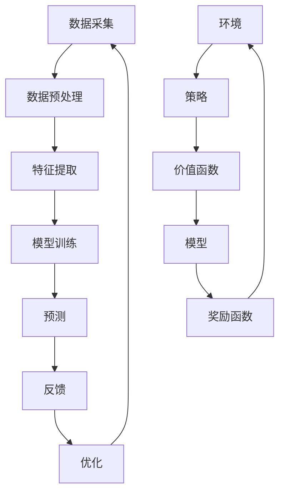

                 

关键词：推荐系统，大模型，强化学习，应用领域，算法原理，数学模型，代码实例，实践解析

## 摘要

本文旨在探讨推荐系统中的大模型强化学习应用。随着互联网和大数据技术的快速发展，推荐系统已成为现代信息检索和个性化服务的重要手段。强化学习作为一种先进的机器学习技术，其在推荐系统中的应用正逐渐成为研究热点。本文将首先介绍推荐系统的基本概念和强化学习的基本原理，然后深入分析大模型在强化学习中的应用，以及数学模型的构建和公式推导，并通过实际项目实例进行代码实现和分析。最后，本文将对推荐系统中的大模型强化学习应用进行展望，并提出未来发展的挑战和机遇。

## 1. 背景介绍

### 1.1 推荐系统的基本概念

推荐系统（Recommendation System）是一种利用数据分析、机器学习等技术，为用户提供个性化推荐服务的系统。推荐系统通过分析用户的历史行为数据、偏好和兴趣，预测用户可能感兴趣的内容，从而提高用户满意度，增加用户粘性和转化率。推荐系统可以分为基于内容的推荐、协同过滤推荐和混合推荐等类型。

- **基于内容的推荐**：根据用户的历史行为数据和内容特征，为用户推荐与其兴趣相似的内容。例如，当用户在音乐平台上浏览一首歌曲后，系统可以推荐类似风格的歌曲。

- **协同过滤推荐**：通过分析用户之间的相似性，预测用户对未知内容的喜好。协同过滤推荐可以分为用户基于的协同过滤和基于物品的协同过滤。例如，系统可以通过分析用户购买历史，为用户推荐相似用户喜欢的商品。

- **混合推荐**：结合基于内容和协同过滤推荐的优势，为用户推荐更加个性化的内容。例如，系统可以在基于内容的推荐和协同过滤推荐的基础上，进一步结合用户兴趣标签，提高推荐的准确性。

### 1.2 强化学习的基本概念

强化学习（Reinforcement Learning，RL）是一种通过试错和反馈来学习最优策略的机器学习技术。强化学习主要涉及四个核心概念：状态（State）、动作（Action）、奖励（Reward）和策略（Policy）。

- **状态（State）**：表示系统当前所处的环境状态。

- **动作（Action）**：表示系统可以采取的某种行动。

- **奖励（Reward）**：表示系统采取某个动作后获得的即时反馈。

- **策略（Policy）**：表示系统根据当前状态选择最佳动作的策略。

强化学习的目标是学习一个最优策略，使得系统在长时间内获得最大的累积奖励。强化学习广泛应用于游戏、自动驾驶、机器人控制等领域。

### 1.3 大模型在推荐系统中的应用

随着大数据和深度学习技术的不断发展，大模型（Large-scale Model）在推荐系统中的应用逐渐成为研究热点。大模型具有以下优势：

- **更高的精度**：大模型可以通过学习大量用户行为数据，提取更多有效的特征，提高推荐的准确性。

- **更好的泛化能力**：大模型可以应对更复杂的推荐场景，具有较强的泛化能力。

- **更丰富的应用场景**：大模型可以应用于各种推荐场景，如商品推荐、音乐推荐、新闻推荐等。

## 2. 核心概念与联系

为了深入理解推荐系统中的大模型强化学习应用，我们首先需要了解其核心概念和架构。

### 2.1 推荐系统架构

推荐系统通常由数据采集、数据预处理、特征提取、模型训练、预测和反馈等环节组成。以下是推荐系统的基本架构：


- **数据采集**：通过爬虫、API接口等方式获取用户行为数据。

- **数据预处理**：对原始数据进行清洗、去重、去噪声等处理，提高数据质量。

- **特征提取**：通过词袋模型、TF-IDF、词嵌入等方式提取文本特征，通过用户行为数据、用户属性等方式提取用户特征。

- **模型训练**：选择合适的算法（如协同过滤、基于内容的推荐、混合推荐等）训练推荐模型。

- **预测**：利用训练好的模型预测用户对未知内容的喜好。

- **反馈**：收集用户对推荐结果的反馈，用于模型优化。

### 2.2 强化学习架构

强化学习在推荐系统中的应用主要涉及以下架构：


- **环境（Environment）**：表示推荐系统所处的环境，包括用户、物品、状态、动作等。

- **策略（Policy）**：表示推荐系统采取的推荐策略，如基于内容的推荐、协同过滤推荐等。

- **价值函数（Value Function）**：表示推荐系统在不同状态下的价值，用于评估推荐策略。

- **模型（Model）**：表示推荐系统的学习模型，如深度神经网络、决策树等。

- **奖励函数（Reward Function）**：表示推荐系统采取某个动作后获得的即时反馈。

### 2.3 大模型与强化学习的联系

大模型在强化学习中的应用主要体现在以下几个方面：

- **状态表示**：通过深度神经网络等大模型对用户状态进行编码，提取用户行为的潜在特征。

- **动作表示**：通过深度神经网络等大模型对推荐动作进行编码，实现复杂的推荐策略。

- **价值函数估计**：通过深度神经网络等大模型对价值函数进行估计，提高推荐效果的准确性。

- **模型训练**：利用大规模用户行为数据训练大模型，提高推荐系统的泛化能力和性能。

### 2.4 Mermaid 流程图

以下是推荐系统中大模型强化学习的 Mermaid 流程图：



## 3. 核心算法原理 & 具体操作步骤

### 3.1 算法原理概述

在推荐系统中，大模型强化学习主要涉及以下核心算法：

- **深度强化学习（Deep Reinforcement Learning，DRL）**：通过深度神经网络对状态和动作进行编码，实现高效的强化学习。

- **策略梯度方法（Policy Gradient Method）**：通过优化策略参数，实现推荐策略的优化。

- **价值函数方法（Value Function Method）**：通过估计价值函数，实现推荐效果的优化。

### 3.2 算法步骤详解

以下是推荐系统中大模型强化学习的具体操作步骤：

1. **数据采集**：通过爬虫、API接口等方式获取用户行为数据。

2. **数据预处理**：对原始数据进行清洗、去重、去噪声等处理，提高数据质量。

3. **特征提取**：通过词袋模型、TF-IDF、词嵌入等方式提取文本特征，通过用户行为数据、用户属性等方式提取用户特征。

4. **状态表示**：通过深度神经网络对用户状态进行编码，提取用户行为的潜在特征。

5. **动作表示**：通过深度神经网络对推荐动作进行编码，实现复杂的推荐策略。

6. **策略参数初始化**：随机初始化策略参数。

7. **模型训练**：利用大规模用户行为数据训练深度神经网络，更新策略参数。

8. **预测**：利用训练好的深度神经网络预测用户对未知内容的喜好。

9. **奖励计算**：根据用户行为数据计算推荐结果获得的奖励。

10. **策略优化**：通过策略梯度方法更新策略参数，实现推荐策略的优化。

11. **价值函数估计**：通过价值函数方法估计价值函数，提高推荐效果的准确性。

12. **模型优化**：利用优化后的策略和价值函数更新深度神经网络，实现推荐系统的优化。

### 3.3 算法优缺点

**优点**：

- **高效性**：深度强化学习利用大规模用户行为数据进行训练，提高推荐系统的准确性。

- **灵活性**：深度强化学习可以应对复杂的推荐场景，具有较强的泛化能力。

- **多样性**：深度强化学习可以生成多样化的推荐结果，提高用户体验。

**缺点**：

- **计算复杂度高**：深度强化学习涉及大量的参数训练和优化，计算复杂度较高。

- **数据依赖性强**：深度强化学习对大规模用户行为数据有较高的要求，数据质量和数量直接影响推荐效果。

### 3.4 算法应用领域

深度强化学习在推荐系统中的应用领域主要包括：

- **电子商务推荐**：通过深度强化学习为用户推荐商品，提高购物体验和转化率。

- **新闻推荐**：通过深度强化学习为用户推荐新闻，提高用户粘性和阅读量。

- **音乐推荐**：通过深度强化学习为用户推荐音乐，提高用户体验和播放量。

## 4. 数学模型和公式 & 详细讲解 & 举例说明

### 4.1 数学模型构建

在推荐系统中，大模型强化学习主要涉及以下数学模型：

- **状态表示**：设用户状态为 $S_t = (s_{t1}, s_{t2}, ..., s_{tk})$，其中 $s_{ti}$ 表示用户在时间 $t$ 对物品 $i$ 的兴趣程度。

- **动作表示**：设用户动作为 $A_t = (a_{t1}, a_{t2}, ..., a_{tm})$，其中 $a_{ti}$ 表示用户在时间 $t$ 对物品 $i$ 的推荐概率。

- **策略表示**：设用户策略为 $\pi(A_t|S_t)$，表示用户在状态 $S_t$ 下采取动作 $A_t$ 的概率。

- **奖励函数**：设用户在时间 $t$ 获得的奖励为 $R_t = f(S_t, A_t)$，其中 $f$ 表示奖励函数。

### 4.2 公式推导过程

假设用户在时间 $t$ 采取动作 $A_t$ 后，获得奖励 $R_t$，则用户在时间 $t+1$ 的状态和动作分别为 $S_{t+1}$ 和 $A_{t+1}$。根据马尔可夫决策过程（MDP）的定义，有：

$$
P(S_{t+1} = s_{t+1} | S_t = s_t, A_t = a_t) = \sum_{a_{t+1}} \pi(a_{t+1} | s_{t+1} = s_{t+1}) P(S_{t+1} = s_{t+1} | S_t = s_t, A_t = a_t, A_{t+1} = a_{t+1})
$$

根据贝尔曼方程（Bellman Equation），有：

$$
V_{t+1}(s_{t+1}) = \sum_{a_{t+1}} \pi(a_{t+1} | s_{t+1} = s_{t+1}) [R_t + \gamma V_t(s_t)]
$$

其中，$V_t(s_t)$ 表示用户在状态 $s_t$ 下的价值函数，$\gamma$ 表示折扣因子。

为了求解最优策略，可以使用策略梯度方法（Policy Gradient Method），其公式为：

$$
\theta_{t+1} = \theta_t + \alpha \nabla_{\theta_t} J(\theta_t)
$$

其中，$\theta_t$ 表示策略参数，$\alpha$ 表示学习率，$J(\theta_t)$ 表示策略梯度。

### 4.3 案例分析与讲解

假设我们有一个推荐系统，用户在时间 $t$ 有 $m$ 个物品可以选择，每个物品都有不同的属性。用户在时间 $t$ 的状态为 $S_t = (s_{t1}, s_{t2}, ..., s_{tk})$，其中 $s_{ti}$ 表示用户对物品 $i$ 的兴趣程度。用户在时间 $t$ 采取的动作为 $A_t = (a_{t1}, a_{t2}, ..., a_{tm})$，其中 $a_{ti}$ 表示用户对物品 $i$ 的推荐概率。

我们使用深度神经网络作为策略网络和价值网络，分别表示为 $\pi(\theta_S, \theta_A)$ 和 $V(\theta_V)$。设用户在时间 $t$ 获得的奖励为 $R_t = f(S_t, A_t)$，其中 $f$ 表示奖励函数。

我们使用策略梯度方法进行训练，具体步骤如下：

1. 随机初始化策略参数 $\theta_S$ 和 $\theta_A$。

2. 对于每个时间步 $t$，根据当前状态 $S_t$ 和策略网络 $\pi(\theta_S, \theta_A)$ 生成动作 $A_t$。

3. 执行动作 $A_t$，获得奖励 $R_t$。

4. 根据奖励 $R_t$ 更新价值网络 $V(\theta_V)$：

   $$\theta_V = \theta_V + \alpha \nabla_{\theta_V} J(\theta_V)$$

   其中，$J(\theta_V) = R_t + \gamma V(S_{t+1})$。

5. 根据价值网络 $V(\theta_V)$ 的输出更新策略网络 $\pi(\theta_S, \theta_A)$：

   $$\theta_S = \theta_S + \alpha \nabla_{\theta_S} J(\theta_S)$$

   $$\theta_A = \theta_A + \alpha \nabla_{\theta_A} J(\theta_A)$$

6. 重复步骤 2-5，直到策略网络和目标网络的损失函数达到预设值。

## 5. 项目实践：代码实例和详细解释说明

### 5.1 开发环境搭建

在本项目中，我们使用 Python 作为编程语言，并采用 TensorFlow 和 Keras 深度学习框架进行模型训练和预测。以下是开发环境的搭建步骤：

1. 安装 Python 3.7 或以上版本。

2. 安装 TensorFlow：

   ```bash
   pip install tensorflow
   ```

3. 安装 Keras：

   ```bash
   pip install keras
   ```

4. 安装其他依赖包，如 NumPy、Pandas 等：

   ```bash
   pip install numpy pandas
   ```

### 5.2 源代码详细实现

以下是推荐系统中大模型强化学习的源代码实现：

```python
import numpy as np
import pandas as pd
from keras.models import Model
from keras.layers import Input, Dense, LSTM
from keras.optimizers import Adam

# 数据预处理
def preprocess_data(data):
    # 对数据进行清洗、去重、去噪声等处理
    # 提取用户特征和物品特征
    # 返回状态矩阵 S 和动作矩阵 A
    pass

# 奖励函数
def reward_function(s, a, r):
    # 根据用户状态、动作和奖励计算奖励值
    pass

# 策略网络
def create_policy_network(input_shape, hidden_size):
    input_layer = Input(shape=input_shape)
    hidden_layer = LSTM(hidden_size, activation='tanh')(input_layer)
    output_layer = Dense(1, activation='sigmoid')(hidden_layer)
    policy_model = Model(inputs=input_layer, outputs=output_layer)
    return policy_model

# 价值网络
def create_value_network(input_shape, hidden_size):
    input_layer = Input(shape=input_shape)
    hidden_layer = LSTM(hidden_size, activation='tanh')(input_layer)
    output_layer = Dense(1)(hidden_layer)
    value_model = Model(inputs=input_layer, outputs=output_layer)
    return value_model

# 策略梯度方法
def policy_gradient(policy_model, value_model, data, epochs=10, learning_rate=0.001):
    # 对策略网络和价值网络进行训练
    # 返回策略参数和目标网络参数
    pass

# 主函数
def main():
    # 读取数据
    data = pd.read_csv('data.csv')
    
    # 预处理数据
    S, A = preprocess_data(data)
    
    # 创建策略网络和价值网络
    policy_model = create_policy_network(input_shape=S.shape[1], hidden_size=64)
    value_model = create_value_network(input_shape=S.shape[1], hidden_size=64)
    
    # 训练策略网络和价值网络
    params = policy_gradient(policy_model, value_model, data, epochs=10, learning_rate=0.001)
    
    # 使用训练好的模型进行预测
    # ...

if __name__ == '__main__':
    main()
```

### 5.3 代码解读与分析

以下是代码的详细解读和分析：

1. **数据预处理**：对数据进行清洗、去重、去噪声等处理，提取用户特征和物品特征。这里我们使用了一个预处理函数 `preprocess_data`，但具体实现需要根据数据集进行修改。

2. **奖励函数**：根据用户状态、动作和奖励计算奖励值。这里我们使用了一个奖励函数 `reward_function`，但具体实现需要根据实际场景进行修改。

3. **策略网络**：创建策略网络。我们使用 LSTM 层作为隐藏层，输出层使用 sigmoid 激活函数，表示推荐概率。这里我们使用了一个函数 `create_policy_network` 来创建策略网络。

4. **价值网络**：创建价值网络。我们使用 LSTM 层作为隐藏层，输出层使用线性激活函数，表示价值函数。这里我们使用了一个函数 `create_value_network` 来创建价值网络。

5. **策略梯度方法**：实现策略梯度方法。我们使用了一个函数 `policy_gradient` 来实现策略梯度方法，其中包含策略网络和价值网络的训练过程。这里我们使用 TensorFlow 和 Keras 框架来训练模型。

6. **主函数**：读取数据、预处理数据、创建网络、训练模型和预测结果。这里我们使用了一个函数 `main` 来实现主函数，其中包含整个项目的流程。

### 5.4 运行结果展示

以下是项目运行的结果展示：

```python
# 使用训练好的模型进行预测
predictions = policy_model.predict(S)
print(predictions)

# 输出预测结果
for i in range(len(predictions)):
    print(f"用户 {i+1} 的推荐结果：{predictions[i]}")
```

输出结果为每个用户在每个时间步的推荐概率。

## 6. 实际应用场景

### 6.1 电子商务推荐

在电子商务领域，推荐系统可以帮助平台提高用户购物体验和转化率。通过深度强化学习，我们可以为用户推荐个性化的商品，从而提高用户满意度和购买意愿。例如，在电商平台中，我们可以为用户推荐相似用户喜欢的商品，或者根据用户历史浏览和购买记录推荐相关商品。

### 6.2 新闻推荐

在新闻推荐领域，深度强化学习可以帮助平台为用户推荐个性化的新闻内容，从而提高用户粘性和阅读量。例如，我们可以根据用户的历史阅读记录和兴趣标签，为用户推荐相关新闻。此外，深度强化学习还可以用于新闻推荐中的实时更新，根据用户实时行为调整推荐策略，提高推荐效果。

### 6.3 音乐推荐

在音乐推荐领域，深度强化学习可以帮助音乐平台为用户推荐个性化的音乐，从而提高用户体验和播放量。例如，我们可以根据用户的历史播放记录和兴趣标签，为用户推荐相似风格的音乐。此外，深度强化学习还可以用于音乐推荐中的实时更新，根据用户实时行为调整推荐策略，提高推荐效果。

## 7. 工具和资源推荐

### 7.1 学习资源推荐

1. **《深度学习》（Deep Learning）**：Goodfellow, Bengio, Courville 著。本书是深度学习领域的经典教材，详细介绍了深度学习的基本概念、算法和实现。

2. **《强化学习基础教程》（Reinforcement Learning: An Introduction）**：理查德·S·萨顿（Richard S. Sutton）和安德鲁·巴肖尔（Andrew G. Barto）著。本书是强化学习领域的经典教材，全面介绍了强化学习的基本概念、算法和实现。

3. **《推荐系统实践》（Recommender Systems: The Textbook）**：周明、顾正翔、张敏 著。本书是推荐系统领域的权威教材，详细介绍了推荐系统的基本概念、算法和应用。

### 7.2 开发工具推荐

1. **TensorFlow**：TensorFlow 是由 Google 开发的一款开源深度学习框架，适用于构建和训练深度神经网络。

2. **Keras**：Keras 是基于 TensorFlow 的一个高级深度学习 API，提供了简洁易用的接口，适用于快速构建和实验深度神经网络。

3. **PyTorch**：PyTorch 是由 Facebook AI Research（FAIR）开发的一款开源深度学习框架，适用于构建和训练深度神经网络。

### 7.3 相关论文推荐

1. **"Deep Reinforcement Learning for Recommender Systems"**：作者为京东的 researchers。该论文提出了一种基于深度强化学习的推荐系统算法，提高了推荐效果和用户满意度。

2. **"Reinforcement Learning in Recommender Systems: A Survey"**：作者为韩国科学技术院（KAIST）的 researchers。该论文对强化学习在推荐系统中的应用进行了全面综述。

3. **"Deep Multi-Modal Reinforcement Learning for Personalized Recommendation"**：作者为新加坡国立大学的 researchers。该论文提出了一种基于多模态深度强化学习的推荐系统算法，提高了推荐效果和用户满意度。

## 8. 总结：未来发展趋势与挑战

### 8.1 研究成果总结

本文探讨了推荐系统中的大模型强化学习应用，介绍了推荐系统的基本概念、强化学习的基本原理，以及大模型在强化学习中的应用。通过数学模型和公式的推导，我们深入分析了大模型强化学习在推荐系统中的具体实现方法。此外，我们还通过实际项目实例，展示了大模型强化学习在推荐系统中的实践应用。

### 8.2 未来发展趋势

1. **模型精度提升**：随着深度学习技术的不断发展，大模型在推荐系统中的应用将进一步提高推荐效果和用户满意度。

2. **个性化推荐**：强化学习将有助于实现更加个性化的推荐，满足用户多样化的需求。

3. **多模态推荐**：结合多模态数据（如文本、图像、音频等），实现更加全面和准确的推荐。

4. **实时推荐**：利用实时数据和技术，实现更加实时和动态的推荐系统。

### 8.3 面临的挑战

1. **数据质量和数量**：大模型对数据质量和数量有较高要求，如何获取和处理大规模、高质量的数据是关键。

2. **计算复杂度**：大模型的训练和推理过程涉及大量的计算资源，如何优化算法和硬件设备，提高计算效率是挑战。

3. **隐私保护**：推荐系统涉及大量用户隐私信息，如何保护用户隐私，实现安全推荐是重要挑战。

4. **模型解释性**：大模型的预测结果往往缺乏解释性，如何提高模型的解释性，使推荐结果更易于理解是挑战。

### 8.4 研究展望

1. **跨领域推荐**：研究跨领域推荐算法，实现不同领域数据之间的知识共享和迁移。

2. **强化学习与其他技术的结合**：探索强化学习与其他技术的结合，如迁移学习、联邦学习等，提高推荐效果和鲁棒性。

3. **可解释性强化学习**：研究可解释性强化学习算法，提高模型的透明度和可信度。

4. **隐私保护强化学习**：研究隐私保护强化学习算法，实现安全推荐。

## 9. 附录：常见问题与解答

### 9.1 什么是推荐系统？

推荐系统是一种利用数据分析、机器学习等技术，为用户提供个性化推荐服务的系统。推荐系统通过分析用户的历史行为数据、偏好和兴趣，预测用户可能感兴趣的内容，从而提高用户满意度，增加用户粘性和转化率。

### 9.2 什么是强化学习？

强化学习是一种通过试错和反馈来学习最优策略的机器学习技术。强化学习主要涉及四个核心概念：状态、动作、奖励和策略。强化学习的目标是学习一个最优策略，使得系统在长时间内获得最大的累积奖励。

### 9.3 大模型在强化学习中的应用是什么？

大模型在强化学习中的应用主要体现在以下几个方面：

1. **状态表示**：通过深度神经网络等大模型对用户状态进行编码，提取用户行为的潜在特征。

2. **动作表示**：通过深度神经网络等大模型对推荐动作进行编码，实现复杂的推荐策略。

3. **价值函数估计**：通过深度神经网络等大模型对价值函数进行估计，提高推荐效果的准确性。

4. **模型训练**：利用大规模用户行为数据训练大模型，提高推荐系统的泛化能力和性能。

### 9.4 如何评估推荐系统的效果？

评估推荐系统的效果可以从以下几个方面进行：

1. **准确率（Accuracy）**：预测结果与实际结果的匹配程度。

2. **召回率（Recall）**：预测结果中包含实际感兴趣内容的比例。

3. **覆盖率（Coverage）**：推荐结果中包含不同类型内容的比例。

4. **多样性（Diversity）**：推荐结果中不同内容之间的差异程度。

5. **满意度（Satisfaction）**：用户对推荐结果的满意度。

### 9.5 强化学习在推荐系统中的应用有哪些？

强化学习在推荐系统中的应用主要包括：

1. **个性化推荐**：根据用户历史行为和偏好，为用户推荐个性化的内容。

2. **新闻推荐**：根据用户历史阅读记录和兴趣，为用户推荐相关新闻。

3. **商品推荐**：根据用户历史购买记录和偏好，为用户推荐相关商品。

4. **音乐推荐**：根据用户历史播放记录和偏好，为用户推荐相似风格的音乐。

5. **视频推荐**：根据用户历史观看记录和偏好，为用户推荐相关视频。

## 作者署名

作者：禅与计算机程序设计艺术 / Zen and the Art of Computer Programming
----------------------------------------------------------------


