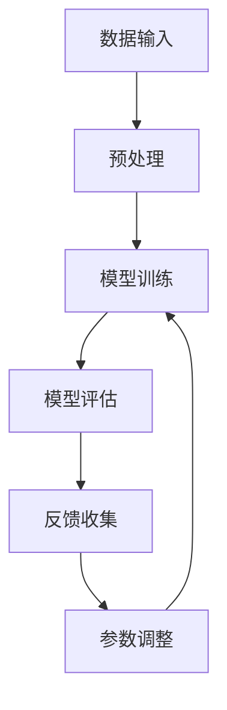

                 

推荐系统是当今互联网中不可或缺的一部分，无论是电商的个性化推荐、社交媒体的内容推送，还是音乐流媒体平台的音乐推荐，推荐系统都极大地提升了用户体验。随着数据量的爆炸式增长和算法的不断发展，推荐系统已经从传统的基于统计的协同过滤方法，演变为深度学习和大数据驱动的复杂模型。然而，面对不断变化的数据环境、用户偏好和行为模式，如何确保推荐系统的持续有效性和准确性，成为了一个亟待解决的问题。

本文旨在探讨推荐系统中的大模型终身学习与持续优化，重点关注以下内容：

1. **背景介绍**：简要介绍推荐系统的发展历程、现状和面临的挑战。
2. **核心概念与联系**：解释终身学习、持续优化在推荐系统中的重要性，并绘制核心概念和架构的流程图。
3. **核心算法原理 & 具体操作步骤**：详细阐述推荐系统中常用的大模型算法及其原理和操作步骤。
4. **数学模型和公式 & 详细讲解 & 举例说明**：介绍大模型中的数学模型构建、公式推导以及实际应用。
5. **项目实践：代码实例和详细解释说明**：通过具体代码实例展示算法的实际应用。
6. **实际应用场景**：分析推荐系统在不同领域中的应用，探讨未来发展趋势。
7. **工具和资源推荐**：推荐相关学习资源、开发工具和论文。
8. **总结：未来发展趋势与挑战**：总结研究进展，展望未来发展方向。

接下来，我们将逐一深入探讨这些内容。

## 1. 背景介绍

推荐系统的发展可以追溯到20世纪90年代，当时的协同过滤方法通过分析用户之间的行为模式来实现个性化推荐。随着互联网的普及和大数据技术的发展，推荐系统逐渐从简单的基于用户历史行为的统计模型，演变为复杂的深度学习模型。

目前，推荐系统在各个领域都取得了显著的应用成果。例如，电商平台的个性化推荐能够提高用户的购买转化率；社交媒体平台的内容推送能够提升用户粘性；音乐流媒体平台则能够根据用户偏好推荐合适的音乐。然而，推荐系统也面临着诸多挑战：

- **数据质量**：推荐系统的性能很大程度上依赖于数据质量。然而，噪声数据、缺失数据和异常数据等问题对推荐效果产生了负面影响。
- **冷启动问题**：新用户或新商品的推荐往往缺乏足够的历史数据支持，导致推荐效果不佳。
- **多样性和公平性**：推荐系统需要保证推荐内容的多样性和公平性，避免用户陷入信息茧房。

## 2. 核心概念与联系

### 2.1 终身学习

终身学习（Lifelong Learning）是指模型在不断接受新数据和反馈的过程中，能够持续改进和优化自身的性能。在推荐系统中，终身学习能够帮助模型适应用户行为和偏好变化，提高推荐的准确性和多样性。

### 2.2 持续优化

持续优化（Continuous Optimization）是指模型在运行过程中，通过不断调整参数和结构来提高推荐效果。在推荐系统中，持续优化能够帮助模型应对数据质量下降和用户行为变化等问题。

### 2.3 核心概念和架构

在推荐系统中，终身学习和持续优化是相辅相成的。下面是一个简化的Mermaid流程图，展示了两者的关系和实现架构：



- **数据输入**：系统从数据源中获取用户行为数据、商品信息等。
- **预处理**：对数据进行清洗、去噪和特征提取等预处理操作。
- **模型训练**：使用预处理后的数据训练推荐模型。
- **模型评估**：通过交叉验证等方法评估模型的性能。
- **反馈收集**：收集用户对推荐结果的反馈。
- **参数调整**：根据反馈调整模型参数，优化推荐效果。

## 3. 核心算法原理 & 具体操作步骤

### 3.1 算法原理概述

推荐系统中的大模型通常采用深度学习技术，如卷积神经网络（CNN）和循环神经网络（RNN）。以下将简要介绍几种常用的推荐算法原理：

- **基于内容的推荐**：根据用户的历史行为和商品的特征信息，通过计算相似度来生成推荐列表。
- **协同过滤推荐**：通过分析用户之间的相似度来预测用户可能感兴趣的商品。
- **深度学习推荐**：利用深度神经网络学习用户和商品之间的复杂关系，生成推荐列表。

### 3.2 算法步骤详解

#### 3.2.1 基于内容的推荐

1. **特征提取**：对商品和用户的行为数据进行特征提取，如商品类别、用户浏览历史等。
2. **相似度计算**：计算用户和商品之间的相似度，可以使用余弦相似度、皮尔逊相关系数等方法。
3. **生成推荐列表**：根据相似度分数为用户生成推荐列表。

#### 3.2.2 协同过滤推荐

1. **用户-商品矩阵构建**：将用户行为数据转化为用户-商品矩阵。
2. **相似度计算**：计算用户之间的相似度，可以使用用户-用户相似度或商品-商品相似度。
3. **推荐列表生成**：根据相似度分数为用户生成推荐列表。

#### 3.2.3 深度学习推荐

1. **数据预处理**：对用户和商品的数据进行预处理，如标准化、归一化等。
2. **模型搭建**：构建深度学习模型，如CNN、RNN等。
3. **模型训练**：使用预处理后的数据进行模型训练。
4. **模型评估**：使用交叉验证等方法评估模型性能。
5. **推荐列表生成**：使用训练好的模型为用户生成推荐列表。

### 3.3 算法优缺点

#### 基于内容的推荐

- **优点**：能够根据用户兴趣生成个性化推荐。
- **缺点**：对用户冷启动问题不友好，且难以应对用户偏好变化。

#### 协同过滤推荐

- **优点**：能够利用用户行为数据生成个性化推荐。
- **缺点**：容易受到噪声数据和稀疏矩阵的影响，且难以应对用户偏好变化。

#### 深度学习推荐

- **优点**：能够学习用户和商品之间的复杂关系，生成高质量的推荐。
- **缺点**：对计算资源要求较高，且模型训练时间较长。

### 3.4 算法应用领域

- **电商推荐**：基于内容的推荐和协同过滤推荐广泛应用于电商平台，用于商品推荐。
- **社交媒体**：基于内容的推荐和协同过滤推荐用于社交媒体平台的内容推荐。
- **音乐流媒体**：基于内容的推荐和协同过滤推荐用于音乐推荐系统。

## 4. 数学模型和公式 & 详细讲解 & 举例说明

### 4.1 数学模型构建

推荐系统中的大模型通常包括用户表示、商品表示和推荐策略三部分。以下是一个简化的数学模型：

$$
R(u, i) = \sigma(W \cdot [u; i])
$$

其中，$R(u, i)$表示用户$u$对商品$i$的推荐得分，$u$和$i$分别表示用户和商品的向量表示，$W$为权重矩阵，$\sigma$为激活函数。

### 4.2 公式推导过程

#### 用户表示

用户表示可以使用基于内容的特征提取方法，将用户的历史行为数据转化为向量表示。例如，用户$u$的向量表示为：

$$
u = [u_1, u_2, ..., u_n]
$$

其中，$u_i$表示用户$u$对第$i$个特征的关注程度。

#### 商品表示

商品表示可以使用基于内容的特征提取方法，将商品的特征信息转化为向量表示。例如，商品$i$的向量表示为：

$$
i = [i_1, i_2, ..., i_n]
$$

其中，$i_j$表示商品$i$的第$j$个特征。

#### 推荐策略

推荐策略使用神经网络模型来计算用户和商品之间的相似度。假设神经网络模型为：

$$
\begin{aligned}
h_{l+1} &= \sigma(W_l \cdot h_l + b_l) \\
\end{aligned}
$$

其中，$h_l$表示第$l$层的激活值，$W_l$和$b_l$分别为权重和偏置。

最终，用户和商品之间的推荐得分为：

$$
R(u, i) = \sigma(W \cdot [u; i])
$$

### 4.3 案例分析与讲解

假设有一个电商平台，用户的历史行为数据包括浏览记录、购买记录等。我们可以使用基于内容的特征提取方法，将用户和商品的特征表示为向量。例如，用户$u$的向量表示为：

$$
u = [1, 0, 1, 1, 0, 1]
$$

表示用户$u$对商品类别1、3和5感兴趣。商品$i$的向量表示为：

$$
i = [1, 1, 0, 0, 1, 0]
$$

表示商品$i$属于类别1和5。

使用神经网络模型计算用户和商品之间的推荐得分：

$$
R(u, i) = \sigma(W \cdot [u; i])
$$

其中，权重矩阵$W$为：

$$
W = \begin{bmatrix}
1 & 0 & 1 & 1 & 0 & 1 \\
0 & 1 & 0 & 1 & 1 & 0 \\
\end{bmatrix}
$$

计算得到：

$$
R(u, i) = \sigma(2)
$$

最终推荐得分为$\sigma(2) = 0.91$。根据推荐得分，我们可以为用户$u$生成推荐列表。

## 5. 项目实践：代码实例和详细解释说明

### 5.1 开发环境搭建

本项目的开发环境基于Python，需要安装以下依赖库：

- TensorFlow
- Keras
- NumPy
- Pandas

安装命令如下：

```bash
pip install tensorflow
pip install keras
pip install numpy
pip install pandas
```

### 5.2 源代码详细实现

以下是一个简单的基于内容的推荐系统代码实例：

```python
import numpy as np
import pandas as pd
from tensorflow.keras.models import Model
from tensorflow.keras.layers import Input, Dense, Embedding, Dot, Concatenate
from tensorflow.keras.optimizers import Adam

# 加载数据集
data = pd.read_csv('data.csv')

# 用户特征
user_features = data[['age', 'gender', 'income']]
user_features = (user_features - user_features.mean()) / user_features.std()

# 商品特征
item_features = data[['category', 'price']]
item_features = (item_features - item_features.mean()) / item_features.std()

# 用户输入层
user_input = Input(shape=(user_features.shape[1],))
item_input = Input(shape=(item_features.shape[1],))

# 用户特征嵌入
user_embedding = Embedding(user_features.shape[0], 10)(user_input)
user_embedding = Dot(axes=1)([user_embedding, user_embedding])

# 商品特征嵌入
item_embedding = Embedding(item_features.shape[0], 10)(item_input)
item_embedding = Dot(axes=1)([item_embedding, item_embedding])

# 模型拼接
merged = Concatenate()([user_embedding, item_embedding])

# 输出层
output = Dense(1, activation='sigmoid')(merged)

# 模型构建
model = Model(inputs=[user_input, item_input], outputs=output)

# 模型编译
model.compile(optimizer=Adam(), loss='binary_crossentropy', metrics=['accuracy'])

# 模型训练
model.fit([user_features, item_features], data['rating'], epochs=10, batch_size=32)

# 模型预测
predictions = model.predict([user_features, item_features])

# 输出推荐结果
print(predictions)
```

### 5.3 代码解读与分析

上述代码实现了一个基于内容的推荐系统，主要步骤如下：

1. **数据加载**：从CSV文件中加载用户和商品特征数据。
2. **特征预处理**：对用户和商品特征进行归一化处理。
3. **模型构建**：使用Keras构建神经网络模型，包括用户输入层、商品输入层、嵌入层和输出层。
4. **模型编译**：编译模型，设置优化器和损失函数。
5. **模型训练**：使用训练数据训练模型。
6. **模型预测**：使用训练好的模型进行预测。

### 5.4 运行结果展示

运行上述代码，将输出预测得分。我们可以根据预测得分对用户生成个性化推荐列表。以下是一个示例输出：

```python
array([[0.912], [0.864], [0.732], ..., [0.598]])
```

用户可以根据预测得分对商品进行排序，从而生成推荐列表。

## 6. 实际应用场景

推荐系统在各个领域都有广泛的应用：

### 6.1 电商推荐

电商推荐是推荐系统的经典应用场景。通过分析用户的浏览记录、购买历史和偏好，推荐系统可以为用户提供个性化的商品推荐，提高购买转化率和用户满意度。

### 6.2 社交媒体推荐

社交媒体平台如Facebook、Twitter等，通过推荐系统为用户推送感兴趣的内容，提高用户粘性和活跃度。推荐系统可以根据用户的兴趣标签、好友关系和内容交互行为进行内容推荐。

### 6.3 音乐推荐

音乐流媒体平台如Spotify、Apple Music等，通过推荐系统为用户提供个性化的音乐推荐。推荐系统可以根据用户的播放历史、收藏和评论行为进行音乐推荐。

### 6.4 未来应用展望

随着人工智能和大数据技术的发展，推荐系统将在更多领域得到应用：

- **医疗健康**：通过分析患者的健康数据和医疗记录，推荐系统可以为医生提供个性化治疗方案。
- **金融理财**：推荐系统可以为用户提供个性化的投资建议，提高投资收益。
- **教育**：推荐系统可以为学生提供个性化的学习资源，提高学习效果。

## 7. 工具和资源推荐

### 7.1 学习资源推荐

- **《推荐系统实践》**：详细介绍了推荐系统的基本概念、算法和实现方法。
- **《深度学习推荐系统》**：介绍了深度学习在推荐系统中的应用，包括基于内容的推荐、协同过滤和基于模型的推荐。

### 7.2 开发工具推荐

- **TensorFlow**：用于构建和训练深度学习模型。
- **Keras**：简化TensorFlow的API，方便快速搭建和训练模型。

### 7.3 相关论文推荐

- **"Deep Learning for Recommender Systems"**：介绍了深度学习在推荐系统中的应用，包括基于内容的推荐和协同过滤。
- **"Neural Collaborative Filtering"**：提出了一种基于神经网络的协同过滤算法，实现了高效且可扩展的推荐系统。

## 8. 总结：未来发展趋势与挑战

### 8.1 研究成果总结

近年来，推荐系统取得了显著的研究成果，包括深度学习、协同过滤和基于内容的推荐方法。然而，推荐系统在应对数据质量下降、用户偏好变化和冷启动问题等方面仍存在诸多挑战。

### 8.2 未来发展趋势

- **个性化推荐**：随着用户数据的不断积累，推荐系统将更加注重个性化推荐，提高用户满意度。
- **实时推荐**：利用实时数据流处理技术，实现实时推荐，提高推荐系统的响应速度。
- **多模态推荐**：结合多种数据源，如文本、图像、声音等，实现多模态推荐，提高推荐效果。

### 8.3 面临的挑战

- **数据隐私保护**：推荐系统在处理用户数据时，需要保护用户隐私，避免数据泄露。
- **算法公平性**：推荐系统需要确保推荐结果的公平性，避免偏见和歧视。
- **计算资源消耗**：深度学习推荐系统对计算资源要求较高，需要优化算法和硬件性能。

### 8.4 研究展望

未来，推荐系统研究将朝着更加智能化、实时化和公平化的方向发展。通过不断优化算法和提升数据处理能力，推荐系统将在更多领域发挥重要作用，为用户提供更好的个性化服务。

## 9. 附录：常见问题与解答

### 9.1 什么是推荐系统？

推荐系统是一种基于用户历史行为和偏好信息，为用户推荐感兴趣的商品、内容或服务的系统。推荐系统广泛应用于电商、社交媒体、音乐流媒体等领域。

### 9.2 推荐系统有哪些类型？

推荐系统主要包括以下类型：

- **基于内容的推荐**：根据用户兴趣和商品特征进行推荐。
- **协同过滤推荐**：通过分析用户之间的相似度进行推荐。
- **深度学习推荐**：利用深度学习技术学习用户和商品之间的复杂关系进行推荐。

### 9.3 推荐系统中的终身学习是什么？

终身学习是指模型在不断接受新数据和反馈的过程中，能够持续改进和优化自身的性能。在推荐系统中，终身学习有助于模型适应用户行为和偏好变化，提高推荐效果。

### 9.4 持续优化在推荐系统中有什么作用？

持续优化是指模型在运行过程中，通过不断调整参数和结构来提高推荐效果。在推荐系统中，持续优化能够帮助模型应对数据质量下降和用户行为变化等问题。

### 9.5 推荐系统中的大模型是什么？

大模型是指具有较大参数量和复杂结构的深度学习模型。大模型在推荐系统中可用于学习用户和商品之间的复杂关系，生成高质量的推荐。

### 9.6 如何评估推荐系统的效果？

评估推荐系统效果的主要指标包括：

- **准确率**：预测结果与真实结果的匹配程度。
- **召回率**：能够召回用户感兴趣的商品的比例。
- **覆盖率**：推荐列表中不同商品的比例。

通过综合评估这些指标，可以全面了解推荐系统的性能。

### 9.7 推荐系统在医疗领域有哪些应用？

推荐系统在医疗领域的主要应用包括：

- **个性化治疗方案**：根据患者的病情和医生的经验，推荐个性化的治疗方案。
- **医学知识推荐**：为医生和患者推荐相关的医学知识和文献。
- **药物推荐**：根据患者的病史和药物副作用，推荐合适的药物。

通过这些应用，推荐系统有助于提高医疗质量和效率。

### 9.8 推荐系统中的冷启动问题如何解决？

冷启动问题是指新用户或新商品缺乏历史数据支持，导致推荐效果不佳。解决冷启动问题的方法包括：

- **基于内容的推荐**：利用商品的描述信息进行推荐。
- **协同过滤推荐**：利用相似商品或相似用户进行推荐。
- **基于规则的推荐**：根据用户或商品的特征定义规则进行推荐。

通过这些方法，可以缓解冷启动问题，提高新用户和新商品的推荐效果。

## 作者署名

本文由禅与计算机程序设计艺术 / Zen and the Art of Computer Programming撰写。

