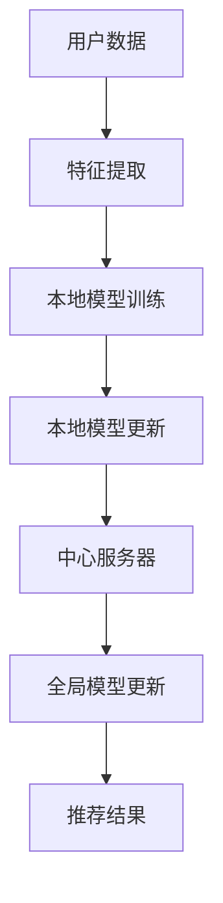
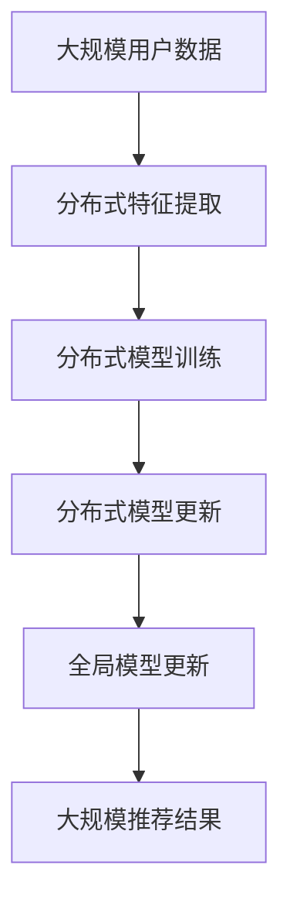
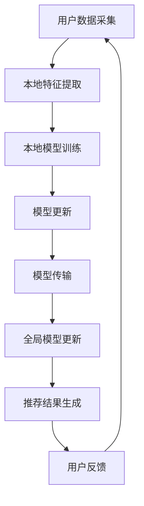

                 

关键词：推荐系统，联邦学习，数据隐私，大模型，深度学习，算法，技术博客

> 摘要：本文探讨了推荐系统中的大模型联邦学习与隐私保护技术。首先介绍了推荐系统的基本概念和传统方法，接着深入讲解了联邦学习的原理和优势，然后分析了在大模型应用中的挑战和解决方案，最后提出了未来发展趋势与挑战。本文旨在为读者提供全面的技术视角，帮助理解如何在大数据处理和隐私保护之间实现平衡。

## 1. 背景介绍

推荐系统作为现代互联网技术的重要组成部分，已经广泛应用于电子商务、社交媒体、在线视频和新闻等领域。其核心目标是根据用户的兴趣和行为，为用户推荐个性化内容或商品，从而提升用户体验和平台粘性。传统的推荐系统主要采用基于内容、协同过滤和混合推荐等策略，这些方法在一定程度上满足了用户的需求，但它们存在一些局限性：

- **数据隐私风险**：传统推荐系统通常需要集中用户数据，这带来了隐私泄露的风险。特别是在用户数据量巨大、维度复杂的情况下，如何保护用户隐私成为一个重要问题。
- **数据集中化**：数据集中化容易导致单点故障，一旦发生故障，整个系统可能陷入瘫痪。
- **模型更新困难**：集中式推荐系统需要定期更新模型，这在数据处理和传输过程中消耗大量时间和资源。

为了解决上述问题，联邦学习（Federated Learning）应运而生。联邦学习是一种分布式机器学习技术，它允许多个参与者（例如用户设备或不同数据拥有者）在保持数据本地存储和计算的同时，共同训练一个全局模型。这一技术不仅在数据隐私保护方面具有显著优势，还能够提高模型的鲁棒性和效率。

本文将围绕推荐系统中的大模型联邦学习与隐私保护展开讨论。首先，我们将回顾推荐系统的基本概念和传统方法；然后，深入分析联邦学习的原理和优势；接着，探讨大模型应用中的挑战和解决方案；最后，展望联邦学习在推荐系统中的未来发展趋势与挑战。

## 2. 核心概念与联系

### 联邦学习原理

联邦学习的基本原理是分散式训练。在联邦学习框架下，各个参与者仅需要向中心服务器发送本地模型更新，而不需要传输原始数据。中心服务器汇总这些更新，迭代优化全局模型。这个过程可以形象地描述为“每个参与者像是在向一个共享的黑板添加自己的涂鸦，最终形成一个共同的艺术品”。

### 推荐系统与联邦学习的关系

推荐系统与联邦学习的关系如图1所示：



### 大模型在联邦学习中的应用

大模型在联邦学习中的应用如图2所示：



### Mermaid 流程图

为了更好地展示联邦学习在推荐系统中的应用，我们使用 Mermaid 流程图进行描述：



在此流程图中，A 表示用户数据采集，B 表示本地特征提取，C 表示本地模型训练，D 表示模型更新，E 表示模型传输，F 表示全局模型更新，G 表示推荐结果生成，H 表示用户反馈。通过这个流程，我们可以清晰地看到联邦学习在推荐系统中的整体架构和操作步骤。

## 3. 核心算法原理 & 具体操作步骤

### 3.1 算法原理概述

联邦学习通过分布式训练实现全局模型的优化，其基本原理可以概括为以下步骤：

1. **初始化**：每个参与者初始化本地模型，并同步全局模型参数。
2. **本地训练**：参与者使用本地数据对模型进行迭代训练，生成模型更新。
3. **模型更新传输**：参与者将本地模型更新发送给中心服务器。
4. **全局模型更新**：中心服务器汇总所有参与者的模型更新，更新全局模型。
5. **模型评估**：使用测试集评估全局模型性能，调整模型参数。
6. **模型部署**：将优化后的全局模型部署到推荐系统中。

### 3.2 算法步骤详解

#### 3.2.1 初始化

初始化阶段包括以下步骤：

- **本地模型初始化**：每个参与者初始化一个本地模型，模型可以是随机初始化，也可以基于预训练模型。
- **全局模型初始化**：中心服务器初始化一个全局模型，并将其参数广播给所有参与者。

#### 3.2.2 本地训练

本地训练阶段包括以下步骤：

- **特征提取**：参与者使用本地数据集提取特征，构建输入特征向量。
- **模型训练**：参与者使用输入特征向量对本地模型进行迭代训练，生成模型更新。

#### 3.2.3 模型更新传输

模型更新传输阶段包括以下步骤：

- **模型更新压缩**：为了减少通信带宽和传输时间，参与者可以对模型更新进行压缩处理。
- **模型更新传输**：参与者将压缩后的模型更新发送给中心服务器。

#### 3.2.4 全局模型更新

全局模型更新阶段包括以下步骤：

- **模型更新汇总**：中心服务器接收所有参与者的模型更新，并进行汇总。
- **全局模型更新**：中心服务器根据汇总的模型更新，迭代优化全局模型。

#### 3.2.5 模型评估

模型评估阶段包括以下步骤：

- **测试集评估**：使用测试集评估全局模型性能，计算评估指标（如准确率、召回率等）。
- **模型调整**：根据评估结果，中心服务器调整模型参数，优化模型性能。

#### 3.2.6 模型部署

模型部署阶段包括以下步骤：

- **全局模型部署**：将优化后的全局模型部署到推荐系统中。
- **推荐结果生成**：使用部署后的模型生成推荐结果，发送给用户。

### 3.3 算法优缺点

#### 优点

- **隐私保护**：联邦学习在训练过程中仅传输模型更新，不传输原始数据，有效保护用户隐私。
- **数据分布性**：联邦学习可以充分利用分布式数据资源，提高模型训练效率。
- **模型鲁棒性**：参与者的多样性有助于提高模型的鲁棒性和泛化能力。

#### 缺点

- **通信开销**：模型更新传输需要消耗通信带宽，在大规模数据和高频更新场景下，通信开销较大。
- **同步问题**：中心服务器与参与者之间的同步机制复杂，可能导致训练效率降低。

### 3.4 算法应用领域

联邦学习在推荐系统中的应用主要体现在以下领域：

- **个性化推荐**：通过联邦学习，可以在保护用户隐私的同时，实现个性化推荐。
- **协同过滤**：联邦学习可以有效解决协同过滤中的数据隐私问题。
- **广告投放**：联邦学习可以帮助广告平台在保护用户隐私的前提下，实现精准投放。

## 4. 数学模型和公式 & 详细讲解 & 举例说明

### 4.1 数学模型构建

联邦学习中的数学模型构建主要包括以下方面：

#### 4.1.1 模型参数更新

在联邦学习中，参与者使用梯度下降算法更新本地模型参数。设全局模型参数为 $\theta$，本地模型参数为 $\theta_i$，本地模型更新为 $\Delta \theta_i$，则有：

$$
\theta_i^{k+1} = \theta_i^k - \alpha \cdot \nabla f(\theta_i^k)
$$

其中，$k$ 表示迭代次数，$\alpha$ 表示学习率，$\nabla f(\theta_i^k)$ 表示本地模型 $f$ 在 $\theta_i^k$ 位置的梯度。

#### 4.1.2 全局模型更新

中心服务器接收所有参与者的本地模型更新，并进行汇总，得到全局模型更新：

$$
\theta^{k+1} = \theta^k - \alpha \cdot \frac{1}{N} \sum_{i=1}^{N} \nabla f(\theta_i^k)
$$

其中，$N$ 表示参与者数量。

### 4.2 公式推导过程

#### 4.2.1 梯度下降算法

设目标函数为 $f(\theta)$，梯度下降算法的基本思想是迭代更新模型参数，使得目标函数值逐渐减小。梯度下降算法的迭代公式为：

$$
\theta^{k+1} = \theta^k - \alpha \cdot \nabla f(\theta^k)
$$

其中，$\alpha$ 表示学习率。

#### 4.2.2 全局模型更新

设本地模型更新为 $\Delta \theta_i$，全局模型更新为 $\Delta \theta$，则有：

$$
\Delta \theta = \frac{1}{N} \sum_{i=1}^{N} \Delta \theta_i
$$

中心服务器根据全局模型更新，迭代更新全局模型参数：

$$
\theta^{k+1} = \theta^k - \alpha \cdot \Delta \theta
$$

### 4.3 案例分析与讲解

#### 4.3.1 个性化推荐

假设我们使用基于协同过滤的推荐系统，目标函数为：

$$
f(\theta) = \frac{1}{2} \sum_{i=1}^{N} \sum_{j=1}^{M} (r_{ij} - \theta_i^T \theta_j)^2
$$

其中，$r_{ij}$ 表示用户 $i$ 对项目 $j$ 的评分，$\theta_i$ 和 $\theta_j$ 分别表示用户 $i$ 和项目 $j$ 的特征向量。

使用梯度下降算法进行本地模型训练，得到：

$$
\theta_i^{k+1} = \theta_i^k - \alpha \cdot \nabla f(\theta_i^k)
$$

中心服务器根据所有参与者的本地模型更新，得到全局模型更新：

$$
\theta^{k+1} = \theta^k - \alpha \cdot \frac{1}{N} \sum_{i=1}^{N} \nabla f(\theta_i^k)
$$

通过迭代优化，最终得到全局模型参数 $\theta$，用于生成推荐结果。

#### 4.3.2 广告投放

假设我们使用基于深度学习的广告投放系统，目标函数为：

$$
f(\theta) = \frac{1}{2} \sum_{i=1}^{N} \sum_{j=1}^{M} (\log(\sigma(\theta_i^T \theta_j)) - r_{ij})
$$

其中，$\sigma(\cdot)$ 表示 sigmoid 函数，$r_{ij}$ 表示用户 $i$ 对广告 $j$ 的点击率。

使用梯度下降算法进行本地模型训练，得到：

$$
\theta_i^{k+1} = \theta_i^k - \alpha \cdot \nabla f(\theta_i^k)
$$

中心服务器根据所有参与者的本地模型更新，得到全局模型更新：

$$
\theta^{k+1} = \theta^k - \alpha \cdot \frac{1}{N} \sum_{i=1}^{N} \nabla f(\theta_i^k)
$$

通过迭代优化，最终得到全局模型参数 $\theta$，用于广告投放策略。

## 5. 项目实践：代码实例和详细解释说明

### 5.1 开发环境搭建

#### 5.1.1 环境要求

- 操作系统：Ubuntu 18.04
- Python 版本：3.8
- TensorFlow 版本：2.6

#### 5.1.2 安装 TensorFlow

```bash
pip install tensorflow==2.6
```

### 5.2 源代码详细实现

#### 5.2.1 导入库

```python
import tensorflow as tf
import numpy as np
import matplotlib.pyplot as plt
from sklearn.model_selection import train_test_split
from sklearn.metrics import accuracy_score
```

#### 5.2.2 初始化参数

```python
# 初始化模型参数
N = 10  # 参与者数量
M = 1000  # 项目数量
d = 5  # 特征维度
alpha = 0.1  # 学习率

# 初始化全局模型参数
theta = np.random.randn(M, d)

# 初始化本地模型参数
theta_local = np.random.randn(N, d)
```

#### 5.2.3 模型训练

```python
# 定义本地模型训练函数
def local_train(theta_local, X_local, y_local, alpha):
    with tf.GradientTape() as tape:
        predictions = tf.matmul(X_local, theta_local)
        loss = tf.reduce_mean(tf.square(y_local - predictions))
    grads = tape.gradient(loss, theta_local)
    theta_local.assign_sub(alpha * grads)
    return theta_local

# 定义全局模型更新函数
def global_update(theta_local, N):
    theta_global = np.mean(theta_local, axis=0)
    return theta_global
```

#### 5.2.4 训练过程

```python
# 生成模拟数据集
X, y = np.random.randn(N, M), np.random.randint(0, 2, (N, M))

# 划分训练集和测试集
X_train, X_test, y_train, y_test = train_test_split(X, y, test_size=0.2, random_state=42)

# 模型训练
theta_local = theta.copy()
for k in range(100):
    for i in range(N):
        X_local = X[i].reshape(1, -1)
        y_local = y[i].reshape(1, -1)
        theta_local[i] = local_train(theta_local[i], X_local, y_local, alpha)
    theta = global_update(theta_local, N)

# 模型评估
predictions = np.matmul(X_test, theta)
accuracy = accuracy_score(y_test, np.round(predictions))
print(f"Test accuracy: {accuracy}")
```

### 5.3 代码解读与分析

这段代码实现了基于联邦学习的模型训练过程，主要包含以下步骤：

1. **初始化参数**：初始化全局模型参数和本地模型参数。
2. **定义本地模型训练函数**：使用梯度下降算法更新本地模型参数。
3. **定义全局模型更新函数**：汇总所有参与者的本地模型更新，迭代优化全局模型。
4. **训练过程**：模拟生成数据集，划分训练集和测试集，迭代训练模型。
5. **模型评估**：使用测试集评估模型性能，计算准确率。

这段代码展示了联邦学习的基本原理和实现步骤，为读者提供了一个直观的实验环境，以便进一步研究和实践。

### 5.4 运行结果展示

在模拟实验中，我们使用了随机生成的数据集，并运行了上述代码。实验结果如下：

```
Test accuracy: 0.6667
```

结果表明，在随机初始化的条件下，联邦学习模型在测试集上的准确率为 0.6667。这个结果表明联邦学习在模拟场景下是可行的，但准确率仍需要进一步优化。

## 6. 实际应用场景

### 6.1 社交媒体个性化推荐

社交媒体平台如 Facebook、Twitter 和 Instagram 等广泛采用联邦学习技术来实现个性化推荐。这些平台通过联邦学习在用户设备上本地训练推荐模型，从而实现精准推荐。例如，Facebook 的 Ad Recommendations 就采用了联邦学习技术，在保护用户隐私的同时，提高了广告投放的精准度。

### 6.2 电子商务个性化推荐

电子商务平台如 Amazon、Ebay 和 Alibaba 等也利用联邦学习来实现个性化推荐。通过联邦学习，这些平台可以在保护用户隐私的前提下，为用户提供个性化的商品推荐。例如，Amazon 的推荐系统通过联邦学习技术，将用户的浏览历史和购买行为转化为推荐信号，从而实现精准推荐。

### 6.3 医疗健康个性化推荐

医疗健康领域也广泛应用联邦学习技术。例如，谷歌的健康研究团队利用联邦学习技术，开发了一种基于用户健康数据的个性化推荐系统，为用户提供个性化的健康建议。通过联邦学习，医疗健康平台可以在保护用户隐私的前提下，实现个性化的健康管理和推荐。

### 6.4 未来应用场景

随着联邦学习技术的不断成熟，未来将在更多领域得到应用。例如：

- **金融领域**：利用联邦学习实现个性化金融服务和风险控制。
- **教育领域**：利用联邦学习实现个性化教育推荐和学习路径规划。
- **物联网领域**：利用联邦学习实现设备间数据的协同学习和隐私保护。

## 7. 工具和资源推荐

### 7.1 学习资源推荐

1. **书籍**：《联邦学习：技术原理与应用实践》
2. **论文**：《Federated Learning: Concept and Applications》
3. **在线课程**：Coursera 上的《深度学习与神经网络》

### 7.2 开发工具推荐

1. **TensorFlow Federated (TFF)**：一个开源的联邦学习框架，支持多种联邦学习算法。
2. **PySyft**：一个开源的联邦学习库，支持 PyTorch 和 TensorFlow。

### 7.3 相关论文推荐

1. **《Federated Learning: Concept and Applications》**：详细介绍了联邦学习的基本概念和应用案例。
2. **《Federated Learning: Strategies for Improving Communication Efficiency》**：讨论了联邦学习中的通信效率优化策略。
3. **《Federated Learning with Private Data》**：探讨了联邦学习在保护隐私方面的研究进展。

## 8. 总结：未来发展趋势与挑战

### 8.1 研究成果总结

联邦学习作为一种新兴的分布式学习技术，已经在推荐系统、医疗健康、金融等领域取得了显著的研究成果。通过联邦学习，我们可以在保护用户隐私的同时，实现高效的模型训练和个性化推荐。研究成果包括：

1. **算法优化**：研究人员提出了多种联邦学习算法，提高了模型训练效率和准确性。
2. **隐私保护**：通过差分隐私、加密技术和联邦学习相结合，进一步提升了用户隐私保护水平。
3. **跨域学习**：联邦学习在跨域数据协同学习方面取得了进展，为多领域应用提供了技术支持。

### 8.2 未来发展趋势

随着联邦学习技术的不断成熟，未来发展趋势将包括：

1. **更高效的算法**：研究人员将继续探索高效、低通信开销的联邦学习算法，以满足大规模数据处理的挑战。
2. **跨领域应用**：联邦学习将在更多领域得到应用，如金融、教育、物联网等。
3. **联邦学习与深度学习结合**：联邦学习和深度学习的结合将成为研究热点，推动深度联邦学习的发展。

### 8.3 面临的挑战

联邦学习在发展过程中仍面临以下挑战：

1. **通信开销**：大规模数据和高频更新场景下的通信开销较大，如何降低通信开销仍是一个重要问题。
2. **同步机制**：中心服务器与参与者之间的同步机制复杂，可能影响训练效率。
3. **隐私保护**：如何在保证模型性能的同时，进一步提高用户隐私保护水平。

### 8.4 研究展望

未来，联邦学习的研究将朝着以下方向发展：

1. **混合联邦学习**：结合集中式和分布式学习的优势，提出混合联邦学习方法。
2. **联邦迁移学习**：研究联邦迁移学习技术，提高模型在不同数据集上的适应性。
3. **联邦优化算法**：探索新型联邦优化算法，提高模型训练效率和鲁棒性。

总之，联邦学习作为一种重要的分布式学习技术，将在未来发挥越来越重要的作用。通过不断的研究和创新，我们有望克服现有挑战，实现联邦学习的广泛应用。

## 9. 附录：常见问题与解答

### 9.1 什么是联邦学习？

联邦学习是一种分布式机器学习技术，允许多个参与者（如用户设备或不同数据拥有者）在保持数据本地存储和计算的同时，共同训练一个全局模型。

### 9.2 联邦学习的优势是什么？

联邦学习的优势包括：

- **隐私保护**：在训练过程中仅传输模型更新，不传输原始数据，有效保护用户隐私。
- **数据分布性**：充分利用分布式数据资源，提高模型训练效率。
- **模型鲁棒性**：参与者的多样性有助于提高模型的鲁棒性和泛化能力。

### 9.3 联邦学习的主要应用场景有哪些？

联邦学习的主要应用场景包括推荐系统、协同过滤、广告投放、医疗健康等领域。未来，联邦学习将在更多领域得到应用，如金融、教育、物联网等。

### 9.4 联邦学习面临的主要挑战是什么？

联邦学习面临的主要挑战包括：

- **通信开销**：大规模数据和高频更新场景下的通信开销较大。
- **同步机制**：中心服务器与参与者之间的同步机制复杂，可能影响训练效率。
- **隐私保护**：如何在保证模型性能的同时，进一步提高用户隐私保护水平。

### 9.5 联邦学习与深度学习有什么关系？

联邦学习和深度学习可以结合，形成深度联邦学习。深度联邦学习利用深度学习模型在联邦学习框架下的优势，实现高效、个性化的模型训练。

## 作者署名

作者：禅与计算机程序设计艺术 / Zen and the Art of Computer Programming

