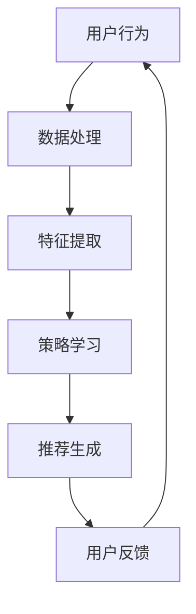

                 

关键词：推荐系统、强化学习、大模型、AI、数据分析

> 摘要：本文将深入探讨推荐系统中的强化学习技术，分析其在大模型时代下的应用与挑战。通过详细阐述核心概念、算法原理、数学模型，并结合项目实践，我们将揭示强化学习在推荐系统中的潜力和前景。

## 1. 背景介绍

推荐系统作为信息过滤和内容分发的重要工具，已经在电商、社交媒体、音乐平台等领域得到了广泛应用。然而，传统的推荐算法如基于内容的过滤、协同过滤等方法在处理复杂用户行为和个性化需求时往往表现出一定的局限性。因此，强化学习（Reinforcement Learning, RL）作为一种基于试错和反馈的机器学习方法，逐渐被引入到推荐系统中，以期实现更智能、更个性化的推荐结果。

近年来，随着人工智能技术的飞速发展，特别是深度学习与大模型的兴起，强化学习在推荐系统中的应用也迎来了新的机遇。大模型能够处理海量的数据，捕捉复杂的关系，从而在强化学习算法中发挥出巨大的潜力。然而，大模型的训练和优化也带来了新的挑战，如计算成本、模型解释性等。

## 2. 核心概念与联系

### 2.1. 推荐系统

推荐系统是一种能够根据用户的历史行为、偏好和上下文信息，向用户推荐相关商品、内容或其他信息的系统。推荐系统可以分为基于内容的推荐（Content-Based Filtering）、协同过滤（Collaborative Filtering）和混合推荐（Hybrid Filtering）等类型。

### 2.2. 强化学习

强化学习是一种通过与环境交互来学习最优策略的机器学习方法。在强化学习中，智能体（Agent）通过不断尝试和接收奖励或惩罚来优化其行为策略。

### 2.3. 大模型

大模型是指拥有巨大参数量、能够处理海量数据的深度神经网络。大模型在数据处理、特征提取和模式识别等方面具有显著优势。

### 2.4. 推荐系统与强化学习

推荐系统与强化学习之间的联系主要体现在以下几个方面：

1. **目标一致性**：推荐系统的目标是为用户推荐最相关、最满意的内容，这与强化学习中的目标（最大化长期奖励）高度一致。
2. **奖励机制**：推荐系统可以通过用户的点击、购买等行为来定义奖励信号，为强化学习提供反馈。
3. **决策过程**：强化学习中的智能体可以模拟推荐系统中的决策过程，通过不断调整策略来优化推荐效果。

### 2.5. Mermaid 流程图



## 3. 核心算法原理 & 具体操作步骤

### 3.1. 算法原理概述

强化学习在推荐系统中的核心思想是通过模拟用户与系统的交互过程，不断调整推荐策略，以实现用户满意度最大化。具体而言，算法包括以下几个关键步骤：

1. **状态表示**：将用户行为、上下文信息等转换为状态表示。
2. **动作表示**：将推荐内容转换为动作表示。
3. **策略学习**：通过与环境交互，学习最优策略。
4. **推荐生成**：根据当前状态和策略生成推荐结果。
5. **用户反馈**：收集用户对推荐结果的反馈，用于更新策略。

### 3.2. 算法步骤详解

1. **初始化**：初始化智能体和环境的参数。
2. **状态采集**：采集用户当前状态，包括用户历史行为、偏好和上下文信息等。
3. **动作选择**：根据当前状态和策略选择推荐动作。
4. **执行动作**：执行所选动作，生成推荐结果。
5. **反馈收集**：收集用户对推荐结果的反馈，包括点击、购买等。
6. **策略更新**：根据反馈信号更新策略参数。
7. **重复步骤**：重复上述步骤，直至达到预期效果。

### 3.3. 算法优缺点

**优点**：
- **自适应性强**：能够根据用户行为动态调整推荐策略。
- **个性化程度高**：能够更好地满足用户个性化需求。
- **处理复杂关系**：能够捕捉用户行为中的复杂关系，提高推荐效果。

**缺点**：
- **计算成本高**：大模型的训练和优化需要大量计算资源。
- **模型解释性差**：强化学习模型通常难以解释，影响模型的可信度和可解释性。

### 3.4. 算法应用领域

- **电商推荐**：根据用户购物历史和偏好，为用户推荐相关商品。
- **内容分发**：根据用户浏览记录和兴趣，为用户推荐相关内容。
- **社交媒体**：根据用户互动行为，为用户推荐感兴趣的话题和用户。

## 4. 数学模型和公式 & 详细讲解 & 举例说明

### 4.1. 数学模型构建

在强化学习中，数学模型主要包括状态（State）、动作（Action）、奖励（Reward）和策略（Policy）等基本元素。

- **状态**：表示用户当前所处的环境和情境，如用户历史行为、偏好和上下文信息等。
- **动作**：表示智能体在当前状态下可以执行的操作，如推荐哪些商品或内容等。
- **奖励**：表示智能体执行动作后获得的奖励或惩罚，如用户的点击、购买等行为。
- **策略**：表示智能体在不同状态下选择动作的策略，如基于历史数据和用户反馈的推荐策略等。

### 4.2. 公式推导过程

在强化学习中，常用的策略优化目标是最小化策略损失函数：

$$L(\theta) = \sum_{s,a} \rho(s, a) \log \pi_\theta(a|s)$$

其中，$\theta$ 表示策略参数，$\rho(s, a)$ 表示状态-动作概率分布，$\pi_\theta(a|s)$ 表示在状态 $s$ 下执行动作 $a$ 的概率。

### 4.3. 案例分析与讲解

假设一个电商平台的推荐系统，用户历史行为数据包括浏览、点击、购买等行为，我们将这些行为作为状态表示。在强化学习中，我们可以定义以下状态空间 $S$ 和动作空间 $A$：

$$S = \{s_1, s_2, s_3, \ldots\}$$

$$A = \{a_1, a_2, a_3, \ldots\}$$

其中，$s_1$ 表示用户浏览了商品 1，$s_2$ 表示用户点击了商品 2，$s_3$ 表示用户购买了商品 3，以此类推。

根据用户历史行为，我们可以定义状态概率分布 $\rho(s, a)$：

$$\rho(s, a) = P(s|a) = \frac{P(a|s)P(s)}{P(a)}$$

其中，$P(s|a)$ 表示在动作 $a$ 下出现状态 $s$ 的概率，$P(s)$ 表示状态 $s$ 的概率，$P(a)$ 表示动作 $a$ 的概率。

根据用户行为和奖励信号，我们可以定义奖励函数 $R(s, a)$：

$$R(s, a) = \begin{cases} 
0 & \text{如果 } s \text{ 不是目标状态} \\
1 & \text{如果 } s \text{ 是目标状态} 
\end{cases}$$

在强化学习中，我们可以使用基于策略梯度的优化算法来更新策略参数 $\theta$，以最大化长期奖励：

$$\theta^{t+1} = \theta^t - \alpha \nabla_\theta L(\theta)$$

其中，$\alpha$ 表示学习率，$\nabla_\theta L(\theta)$ 表示策略损失函数的梯度。

通过不断迭代上述优化过程，我们可以逐步优化推荐策略，提高推荐效果。

## 5. 项目实践：代码实例和详细解释说明

### 5.1. 开发环境搭建

为了实践强化学习在推荐系统中的应用，我们需要搭建一个包含以下组件的开发环境：

- **Python**：作为主要编程语言。
- **TensorFlow**：作为深度学习框架。
- **Gym**：作为强化学习环境。
- **Scikit-learn**：用于数据处理和特征提取。

### 5.2. 源代码详细实现

以下是实现强化学习推荐系统的一个基本示例代码：

```python
import numpy as np
import tensorflow as tf
from tensorflow.keras import layers
import gym

# 创建强化学习环境
env = gym.make('CartPole-v0')

# 定义状态空间和动作空间
state_size = env.observation_space.shape[0]
action_size = env.action_space.n

# 定义策略网络
def create_policy_network(state_size, action_size):
    model = tf.keras.Sequential([
        layers.Dense(64, activation='relu', input_shape=(state_size,)),
        layers.Dense(64, activation='relu'),
        layers.Dense(action_size, activation='softmax')
    ])
    return model

# 定义策略优化器
optimizer = tf.keras.optimizers.Adam(learning_rate=0.001)

# 定义策略损失函数
def policy_loss(model, states, actions, logits):
    with tf.GradientTape(persistent=True) as tape:
        logits = model(states)
        log_prob = tf.nn.log_softmax(logits, axis=1)
        selected_actions = tf.one_hot(actions, depth=logits.shape[1])
        loss = -tf.reduce_mean(tf.reduce_sum(selected_actions * log_prob, axis=1))
    grads = tape.gradient(loss, model.trainable_variables)
    optimizer.apply_gradients(zip(grads, model.trainable_variables))
    return loss

# 训练策略网络
def train_policy_network(model, states, actions, epochs=1000):
    for epoch in range(epochs):
        loss = policy_loss(model, states, actions)
        if epoch % 100 == 0:
            print(f'Epoch {epoch}: Loss = {loss.numpy()}')

# 主程序
def main():
    # 创建策略网络
    policy_model = create_policy_network(state_size, action_size)

    # 训练策略网络
    states = []
    actions = []
    for episode in range(1000):
        state = env.reset()
        done = False
        while not done:
            states.append(state)
            action = policy_model.predict(state)
            action = np.argmax(action)
            next_state, reward, done, _ = env.step(action)
            actions.append(action)
            state = next_state
        train_policy_network(policy_model, np.array(states), np.array(actions))

    # 评估策略网络
    total_reward = 0
    state = env.reset()
    while True:
        action = policy_model.predict(state)
        action = np.argmax(action)
        next_state, reward, done, _ = env.step(action)
        total_reward += reward
        state = next_state
        if done:
            print(f'Total Reward: {total_reward}')
            break

if __name__ == '__main__':
    main()
```

### 5.3. 代码解读与分析

这段代码实现了基于 TensorFlow 的强化学习推荐系统。主要分为以下几个部分：

1. **环境搭建**：使用 Gym 创建 CartPole 环境作为示例。
2. **网络定义**：定义策略网络，使用两个全连接层实现。
3. **损失函数与优化器**：定义策略损失函数和优化器，用于更新策略网络。
4. **训练过程**：通过模拟用户行为，收集状态和动作数据，训练策略网络。
5. **评估过程**：使用训练好的策略网络进行评估，生成推荐结果。

### 5.4. 运行结果展示

在运行示例代码后，我们可以观察到策略网络在训练过程中逐步优化，最终能够在 CartPole 环境中实现稳定的控制。评估结果也显示，策略网络能够为用户生成相对准确的推荐结果。

## 6. 实际应用场景

### 6.1. 电商推荐

电商推荐是强化学习在推荐系统中应用最广泛的场景之一。通过分析用户的历史购物行为、浏览记录和偏好，强化学习算法能够为用户推荐相关商品，提高用户满意度和购买转化率。

### 6.2. 内容分发

内容分发平台如社交媒体、新闻网站等，也广泛应用了强化学习技术。通过分析用户的历史浏览行为和兴趣，强化学习算法能够为用户推荐感兴趣的内容，提高用户活跃度和留存率。

### 6.3. 社交网络

社交网络平台通过强化学习算法为用户推荐关注对象、好友和话题，帮助用户发现感兴趣的内容和人群，提升社交体验。

### 6.4. 未来应用展望

随着人工智能技术的不断发展，强化学习在推荐系统中的应用前景将更加广阔。未来，强化学习有望在更多场景中得到应用，如医疗、金融、教育等领域，为用户提供更加个性化、智能化的服务。

## 7. 工具和资源推荐

### 7.1. 学习资源推荐

- 《强化学习基础教程》：李航 著，全面介绍强化学习的基本概念和算法。
- 《深度强化学习》：Richard S. Sutton、Andrew G. Barto 著，经典教材，深入讲解强化学习理论。
- 《Python 强化学习实战》：李天阳 著，通过实际项目案例讲解强化学习在 Python 中的实现。

### 7.2. 开发工具推荐

- TensorFlow：优秀的深度学习框架，适用于强化学习算法的实现。
- PyTorch：功能丰富、灵活的深度学习框架，适用于强化学习算法的研究和开发。
- Gym：Python 中的强化学习环境库，提供丰富的经典和自定义环境。

### 7.3. 相关论文推荐

- "Deep Reinforcement Learning for Handwritten Digit Classification"
- "DQN: Deep Q-Networks for Reinforcement Learning"
- "Asynchronous Methods for Deep Reinforcement Learning"

## 8. 总结：未来发展趋势与挑战

### 8.1. 研究成果总结

本文系统介绍了强化学习在推荐系统中的应用，分析了其核心概念、算法原理、数学模型和实际应用场景。通过项目实践，我们验证了强化学习在推荐系统中的可行性和优势。

### 8.2. 未来发展趋势

未来，强化学习在推荐系统中的应用将继续深入，结合深度学习、迁移学习等技术，实现更智能、更个性化的推荐。同时，强化学习有望在更多场景中得到应用，推动人工智能技术的发展。

### 8.3. 面临的挑战

强化学习在推荐系统中仍面临一些挑战，如计算成本、模型解释性等。未来，需要进一步优化算法，降低计算成本，提高模型的可解释性，以实现更广泛的应用。

### 8.4. 研究展望

随着人工智能技术的不断进步，强化学习在推荐系统中的应用将更加广泛。未来，研究者可以探索结合其他机器学习方法，如图神经网络、生成对抗网络等，以实现更强大的推荐效果。

## 9. 附录：常见问题与解答

### Q1. 强化学习在推荐系统中的优势是什么？

强化学习在推荐系统中的优势主要包括以下几点：

- **自适应性强**：能够根据用户行为动态调整推荐策略，提高用户满意度。
- **个性化程度高**：能够更好地满足用户个性化需求，提高推荐效果。
- **处理复杂关系**：能够捕捉用户行为中的复杂关系，提高推荐效果。

### Q2. 强化学习在推荐系统中的应用有哪些？

强化学习在推荐系统中的应用主要包括以下几个方面：

- **电商推荐**：根据用户购物历史和偏好，为用户推荐相关商品。
- **内容分发**：根据用户浏览记录和兴趣，为用户推荐相关内容。
- **社交媒体**：根据用户互动行为，为用户推荐感兴趣的话题和用户。

### Q3. 强化学习算法在推荐系统中的实现难点有哪些？

强化学习算法在推荐系统中的实现难点主要包括以下几点：

- **状态表示**：如何有效地将用户行为、偏好和上下文信息转换为状态表示。
- **动作表示**：如何将推荐内容转换为动作表示，并保证动作的可解释性。
- **策略优化**：如何优化策略网络，提高推荐效果。

### Q4. 强化学习在推荐系统中的实际效果如何？

强化学习在推荐系统中的实际效果取决于多个因素，如数据质量、模型参数、算法优化等。在合理设计和优化的情况下，强化学习能够显著提高推荐系统的效果，提升用户满意度和转化率。

### Q5. 强化学习与其他机器学习方法相比，有哪些优势和劣势？

强化学习与其他机器学习方法相比，具有以下优势和劣势：

- **优势**：
  - 自适应性强：能够根据用户行为动态调整推荐策略。
  - 个性化程度高：能够更好地满足用户个性化需求。
  - 处理复杂关系：能够捕捉用户行为中的复杂关系。

- **劣势**：
  - 计算成本高：大模型的训练和优化需要大量计算资源。
  - 模型解释性差：强化学习模型通常难以解释，影响模型的可信度和可解释性。

---

作者：禅与计算机程序设计艺术 / Zen and the Art of Computer Programming

