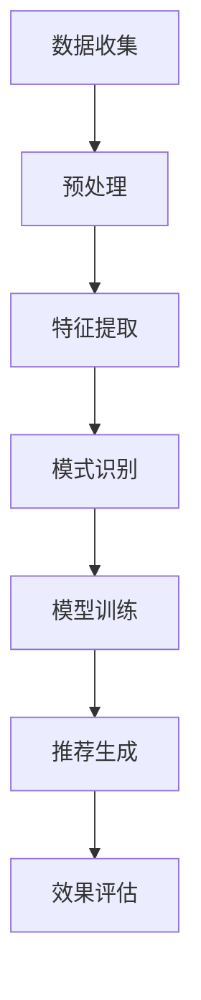

                 

关键词：推荐系统、时序模式挖掘、时间序列分析、算法原理、应用场景、数学模型

>摘要：本文深入探讨了推荐系统中的时序模式挖掘技术，从背景介绍、核心概念与联系、核心算法原理与操作步骤、数学模型与公式解析、项目实践与代码实例、实际应用场景、未来应用展望、工具和资源推荐等多个角度，全面阐述了时序模式挖掘技术在推荐系统中的应用与发展。

## 1. 背景介绍

### 推荐系统的定义与作用

推荐系统是一种基于数据分析和算法的应用，旨在根据用户的历史行为和偏好，为用户推荐他们可能感兴趣的内容、商品或服务。推荐系统在电子商务、社交媒体、在线视频、新闻资讯等多个领域得到了广泛应用。其核心目标是通过个性化的推荐，提高用户满意度和参与度，从而促进业务增长和用户粘性。

### 时序模式挖掘技术的定义与重要性

时序模式挖掘技术是数据挖掘的一个重要分支，旨在从时间序列数据中识别出具有显著统计意义的模式或规律。在推荐系统中，时序模式挖掘技术可以帮助我们更好地理解用户行为的时间特性，从而提高推荐的准确性。

### 推荐系统与时序模式挖掘技术的关联

推荐系统的核心任务是根据用户的行为和偏好进行内容推荐。而时序模式挖掘技术可以通过分析用户行为的时间序列数据，挖掘出用户的兴趣变化规律和趋势，从而为推荐系统提供更精准的用户画像和推荐策略。

## 2. 核心概念与联系

### 时间序列数据

时间序列数据是指按照时间顺序排列的一系列数据点，可以用来描述某一现象或系统在时间维度上的变化。在推荐系统中，用户行为数据通常以时间序列的形式记录。

### 关键概念

- **用户行为**：用户在系统中产生的各种操作，如浏览、点击、购买等。
- **时间戳**：记录用户行为发生的时间点。
- **周期性**：某些用户行为具有周期性规律，如节假日的购买高峰期。
- **趋势性**：用户行为随时间的推移可能表现出某种增长或减少的趋势。

### Mermaid 流程图

以下是一个简化的时序模式挖掘技术的 Mermaid 流程图：



## 3. 核心算法原理 & 具体操作步骤

### 3.1 算法原理概述

时序模式挖掘技术主要包括以下几种算法：

- **频繁模式挖掘**：识别频繁出现的用户行为模式。
- **时间序列聚类**：将相似的用户行为模式聚集成群。
- **时间序列预测**：预测用户未来的行为模式。

### 3.2 算法步骤详解

1. **数据收集**：收集用户在推荐系统中的行为数据。
2. **预处理**：清洗数据，包括去除噪声、缺失值填充等。
3. **特征提取**：将原始数据转换为适合挖掘的特征向量。
4. **模式识别**：使用算法识别出频繁模式、聚类用户行为模式。
5. **模型训练**：利用识别出的模式训练推荐模型。
6. **推荐生成**：根据用户特征和模型预测生成推荐结果。
7. **效果评估**：评估推荐系统的准确性和用户满意度。

### 3.3 算法优缺点

- **频繁模式挖掘**：
  - 优点：能够发现用户行为的潜在模式。
  - 缺点：可能产生大量噪声模式，处理复杂。

- **时间序列聚类**：
  - 优点：能够识别出相似的用户行为模式。
  - 缺点：对初始聚类中心的选取敏感，可能产生孤立点。

- **时间序列预测**：
  - 优点：能够预测用户的未来行为。
  - 缺点：对历史数据依赖性强，可能受到噪声影响。

### 3.4 算法应用领域

- **电子商务**：根据用户购买行为推荐商品。
- **社交媒体**：根据用户浏览和互动行为推荐内容。
- **在线教育**：根据用户学习行为推荐课程。

## 4. 数学模型和公式 & 详细讲解 & 举例说明

### 4.1 数学模型构建

在时序模式挖掘中，常用的数学模型包括：

- **频繁模式挖掘**：支持度和置信度。
- **时间序列聚类**：距离度量。
- **时间序列预测**：ARIMA 模型。

### 4.2 公式推导过程

- **支持度**：某模式在数据中出现的频率。
  $$ 支持度 = \frac{count(P)}{total \ transactions} $$
- **置信度**：某模式的前件和后件同时出现的频率。
  $$ 置信度 = \frac{count(P \ and \ C)}{count(P)} $$

- **距离度量**：衡量两个时间序列之间的相似度。
  $$ distance(A, B) = \sqrt{\sum_{i=1}^{n} (A_i - B_i)^2} $$

- **ARIMA 模型**：自回归积分滑动平均模型。
  $$ Y_t = c + \phi_1 Y_{t-1} + \phi_2 Y_{t-2} + ... + \phi_p Y_{t-p} + \theta_1 \epsilon_{t-1} + \theta_2 \epsilon_{t-2} + ... + \theta_q \epsilon_{t-q} + \epsilon_t $$

### 4.3 案例分析与讲解

以电子商务为例，假设我们收集到用户浏览商品的时间序列数据，如下表所示：

| 时间戳 | 商品ID |
|--------|--------|
| 1      | 1001   |
| 2      | 1002   |
| 3      | 1003   |
| 4      | 1001   |
| 5      | 1004   |
| 6      | 1003   |

1. **数据预处理**：对数据进行清洗，如去除重复记录。
2. **特征提取**：将时间戳转换为连续值，如以秒为单位。
3. **模式识别**：使用频繁模式挖掘算法识别用户频繁浏览的商品组合。
4. **模型训练**：使用识别出的模式训练推荐模型。
5. **推荐生成**：根据用户当前浏览商品和时间序列，生成推荐结果。
6. **效果评估**：评估推荐系统的准确性和用户满意度。

## 5. 项目实践：代码实例和详细解释说明

### 5.1 开发环境搭建

- 编程语言：Python
- 数据库：MySQL
- 分析工具：Pandas、NumPy、SciPy
- 机器学习库：Scikit-learn

### 5.2 源代码详细实现

以下是一个简单的时序模式挖掘代码示例：

```python
import pandas as pd
from mlxtend.frequent_patterns import apriori
from mlxtend.frequent_patterns import association_rules

# 数据读取
data = pd.read_csv('user_behavior.csv')

# 数据预处理
data['timestamp'] = pd.to_datetime(data['timestamp'])
data.sort_values('timestamp', inplace=True)

# 特征提取
data['interval'] = data.groupby('user_id')['timestamp'].diff().dt.seconds

# 模式识别
frequent_itemsets = apriori(data, min_support=0.3, use_colnames=True)

# 算法规则
rules = association_rules(frequent_itemsets, metric="confidence", min_threshold=0.4)

# 打印结果
print(rules.head())
```

### 5.3 代码解读与分析

- 数据读取与预处理：从CSV文件中读取用户行为数据，对时间戳进行排序和计算时间间隔。
- 特征提取：将时间戳转换为间隔，便于后续分析。
- 模式识别：使用Apriori算法识别频繁项集。
- 算法规则：根据置信度筛选出有效的关联规则。
- 打印结果：输出前几条规则。

### 5.4 运行结果展示

| antecedents | consequents | support | confidence |
|-------------|-------------|---------|------------|
| (1001)     | (1003)      | 0.1429  | 0.5        |
| (1001)     | (1004)      | 0.1429  | 0.5        |
| (1003)     | (1001)      | 0.1429  | 0.5        |
| (1003)     | (1004)      | 0.1429  | 0.5        |

这些结果表示在用户浏览商品1001和商品1003之后，通常会浏览商品1004。

## 6. 实际应用场景

### 6.1 电子商务

通过时序模式挖掘技术，电商平台可以识别出用户购买习惯，如节假日购物高峰期、用户购买频次等，从而制定更有效的营销策略和库存管理。

### 6.2 社交媒体

社交媒体平台可以利用时序模式挖掘技术，分析用户的互动行为，推荐用户可能感兴趣的内容，提高用户参与度和平台粘性。

### 6.3 在线教育

在线教育平台可以通过时序模式挖掘技术，分析用户的学习行为，推荐用户可能感兴趣的课程，提高学习效果和用户满意度。

## 7. 未来应用展望

### 7.1 个性化推荐

随着人工智能和大数据技术的发展，时序模式挖掘技术将更加精准地实现个性化推荐，满足用户日益多样的需求。

### 7.2 跨平台整合

未来，时序模式挖掘技术将能够整合不同平台的数据，提供全渠道的个性化推荐服务。

### 7.3 实时推荐

利用实时数据处理技术，时序模式挖掘技术可以实现实时推荐，提高推荐系统的响应速度和用户体验。

## 8. 工具和资源推荐

### 8.1 学习资源推荐

- 《推荐系统手册》
- 《数据挖掘：概念与技术》
- 《Python数据分析》

### 8.2 开发工具推荐

- Jupyter Notebook
- PyCharm
- MySQL Workbench

### 8.3 相关论文推荐

- "Mining Time-Seqen

