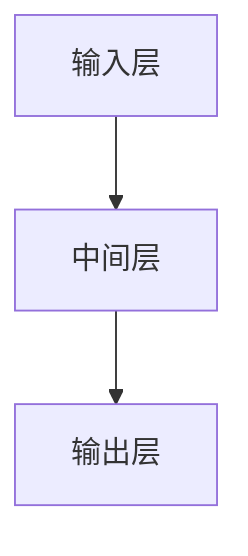

                 

关键词：推荐系统、注意力机制、大模型、多层次应用、深度学习

摘要：本文将深入探讨推荐系统中的注意力机制，特别是在大模型中的应用。通过详细介绍注意力机制的核心概念、算法原理和数学模型，以及通过具体的项目实践和案例分析，本文将展示注意力机制在推荐系统中的多层次应用，并对其未来的发展趋势和挑战进行展望。

## 1. 背景介绍

推荐系统是近年来人工智能领域的一个重要研究方向，它通过对用户行为和兴趣的分析，向用户推荐可能感兴趣的商品、服务或信息。随着互联网的快速发展，推荐系统已经广泛应用于电子商务、社交媒体、新闻推送、视频推荐等众多领域。然而，传统的推荐系统往往依赖于简单的统计方法，如协同过滤、基于内容的推荐等，这些方法在面对复杂、多维的用户数据时，存在一定的局限性。

近年来，深度学习技术，尤其是注意力机制（Attention Mechanism）的引入，为推荐系统带来了新的突破。注意力机制最早由Neural Network提出，用于解决机器翻译中的长序列依赖问题。随着研究的深入，注意力机制在自然语言处理、计算机视觉等领域得到了广泛应用。在大模型中引入注意力机制，不仅能够提高推荐系统的性能，还能使其更好地处理复杂、多维的用户数据。

本文旨在介绍注意力机制的核心概念、算法原理和数学模型，并通过具体的项目实践和案例分析，探讨注意力机制在推荐系统中的多层次应用。此外，本文还将对未来的发展趋势和挑战进行展望，为推荐系统的研究和实践提供参考。

## 2. 核心概念与联系

### 2.1 注意力机制的定义与作用

注意力机制是一种在计算过程中动态调整输入数据重要性的方法。通过引入注意力权重，注意力机制能够自动识别并关注输入数据中的关键信息，从而提高计算效率和准确性。在推荐系统中，注意力机制可以帮助模型更好地理解用户行为和兴趣，提高推荐质量。

### 2.2 注意力机制的架构

注意力机制的架构可以分为三个部分：输入层、中间层和输出层。输入层负责接收用户数据，如用户的历史行为、评分、标签等；中间层通过计算注意力权重，对输入数据进行加权融合；输出层则根据加权融合的结果生成推荐结果。

### 2.3 Mermaid 流程图

以下是一个简化的注意力机制的Mermaid流程图：



### 2.4 注意力机制与其他技术的联系

注意力机制在推荐系统中的应用，与其他技术如深度学习、自然语言处理等密切相关。深度学习提供了强大的特征提取能力，使得注意力机制能够更好地理解用户数据；自然语言处理技术则可以帮助我们更好地理解和处理文本数据，从而提高推荐系统的效果。

## 3. 核心算法原理 & 具体操作步骤

### 3.1 算法原理概述

注意力机制的原理可以概括为以下几个步骤：

1. **特征提取**：首先，通过深度学习模型对用户数据进行特征提取，如用户的历史行为、评分、标签等。
2. **计算注意力权重**：然后，利用注意力机制计算每个特征的权重，权重越大表示该特征对推荐结果的影响越大。
3. **加权融合**：根据注意力权重对特征进行加权融合，得到一个综合特征向量。
4. **生成推荐结果**：最后，根据综合特征向量生成推荐结果。

### 3.2 算法步骤详解

1. **输入层**：输入层接收用户数据，如用户的历史行为、评分、标签等。这些数据可以通过深度学习模型进行特征提取，得到用户特征向量。
2. **中间层**：中间层通过计算注意力权重，对输入数据进行加权融合。具体步骤如下：
   - **计算相似度**：首先，计算用户特征向量与其他特征向量之间的相似度，可以使用余弦相似度、点积等度量方法。
   - **计算注意力权重**：然后，利用softmax函数对相似度进行归一化，得到注意力权重。权重越大表示该特征对推荐结果的影响越大。
   - **加权融合**：最后，根据注意力权重对特征进行加权融合，得到一个综合特征向量。
3. **输出层**：输出层根据综合特征向量生成推荐结果。可以使用分类、回归等模型进行预测。

### 3.3 算法优缺点

**优点**：

1. **自适应**：注意力机制能够自动识别并关注输入数据中的关键信息，提高了推荐系统的自适应性和灵活性。
2. **高效**：通过加权融合，注意力机制能够提高计算效率，降低计算复杂度。
3. **通用**：注意力机制可以应用于各种类型的推荐系统，如基于内容的推荐、协同过滤等。

**缺点**：

1. **计算开销**：注意力机制需要计算大量的相似度，对计算资源要求较高。
2. **数据依赖**：注意力机制对用户数据的质量和数量有较高的要求，否则可能导致推荐效果不佳。

### 3.4 算法应用领域

注意力机制在推荐系统中的应用非常广泛，如：

1. **电子商务**：通过分析用户的历史行为，为用户推荐可能感兴趣的商品。
2. **社交媒体**：根据用户的行为和兴趣，为用户推荐感兴趣的内容和用户。
3. **新闻推送**：根据用户的阅读历史和偏好，为用户推荐相关的新闻。

## 4. 数学模型和公式 & 详细讲解 & 举例说明

### 4.1 数学模型构建

注意力机制的数学模型可以表示为：

$$
\text{Attention}(X, Y) = \text{softmax}\left(\frac{\text{dot}(X, Y)^T}{\sqrt{d}}\right)
$$

其中，$X$表示输入特征矩阵，$Y$表示查询特征矩阵，$\text{dot}$表示点积运算，$\sqrt{d}$表示特征维度。

### 4.2 公式推导过程

注意力机制的推导过程可以分为以下几个步骤：

1. **特征提取**：首先，通过深度学习模型对用户数据进行特征提取，得到用户特征向量$\textbf{x}$和查询特征向量$\textbf{y}$。
2. **计算相似度**：然后，计算用户特征向量$\textbf{x}$和其他特征向量$\textbf{y}$之间的相似度，可以使用余弦相似度、点积等度量方法。
3. **计算注意力权重**：接下来，利用softmax函数对相似度进行归一化，得到注意力权重$\alpha$。
4. **加权融合**：最后，根据注意力权重$\alpha$对特征进行加权融合，得到综合特征向量$\textbf{z}$。

### 4.3 案例分析与讲解

以下是一个简化的例子，假设我们有两个用户特征向量$\textbf{x}_1$和$\textbf{x}_2$，以及一个查询特征向量$\textbf{y}$。

1. **特征提取**：假设用户特征向量$\textbf{x}_1 = (1, 2)$，$\textbf{x}_2 = (3, 4)$，查询特征向量$\textbf{y} = (5, 6)$。
2. **计算相似度**：计算用户特征向量$\textbf{x}_1$和$\textbf{x}_2$与查询特征向量$\textbf{y}$之间的相似度，可以使用余弦相似度：
$$
\text{similarity}(\textbf{x}_1, \textbf{y}) = \frac{\textbf{x}_1 \cdot \textbf{y}}{\|\textbf{x}_1\| \|\textbf{y}\|} = \frac{(1, 2) \cdot (5, 6)}{\sqrt{1^2 + 2^2} \sqrt{5^2 + 6^2}} = \frac{11}{\sqrt{5} \sqrt{61}}
$$
$$
\text{similarity}(\textbf{x}_2, \textbf{y}) = \frac{\textbf{x}_2 \cdot \textbf{y}}{\|\textbf{x}_2\| \|\textbf{y}\|} = \frac{(3, 4) \cdot (5, 6)}{\sqrt{3^2 + 4^2} \sqrt{5^2 + 6^2}} = \frac{29}{\sqrt{25} \sqrt{61}}
$$
3. **计算注意力权重**：使用softmax函数对相似度进行归一化，得到注意力权重：
$$
\alpha_1 = \frac{\exp(\text{similarity}(\textbf{x}_1, \textbf{y}))}{\exp(\text{similarity}(\textbf{x}_1, \textbf{y})) + \exp(\text{similarity}(\textbf{x}_2, \textbf{y}))} = \frac{\exp(11/\sqrt{5} \sqrt{61})}{\exp(11/\sqrt{5} \sqrt{61}) + \exp(29/\sqrt{25} \sqrt{61})}
$$
$$
\alpha_2 = \frac{\exp(\text{similarity}(\textbf{x}_2, \textbf{y}))}{\exp(\text{similarity}(\textbf{x}_1, \textbf{y})) + \exp(\text{similarity}(\textbf{x}_2, \textbf{y}))} = \frac{\exp(29/\sqrt{25} \sqrt{61})}{\exp(11/\sqrt{5} \sqrt{61}) + \exp(29/\sqrt{25} \sqrt{61})}
$$
4. **加权融合**：根据注意力权重对特征进行加权融合，得到综合特征向量：
$$
\textbf{z} = \alpha_1 \textbf{x}_1 + \alpha_2 \textbf{x}_2 = \frac{\exp(11/\sqrt{5} \sqrt{61})}{\exp(11/\sqrt{5} \sqrt{61}) + \exp(29/\sqrt{25} \sqrt{61})} (1, 2) + \frac{\exp(29/\sqrt{25} \sqrt{61})}{\exp(11/\sqrt{5} \sqrt{61}) + \exp(29/\sqrt{25} \sqrt{61})} (3, 4)
$$

## 5. 项目实践：代码实例和详细解释说明

### 5.1 开发环境搭建

为了实现注意力机制在推荐系统中的应用，我们需要搭建一个开发环境。以下是一个简单的开发环境搭建步骤：

1. 安装Python环境（版本3.6及以上）
2. 安装深度学习框架（如TensorFlow、PyTorch等）
3. 安装必要的依赖库（如NumPy、Pandas、Scikit-learn等）

### 5.2 源代码详细实现

以下是一个简化的注意力机制在推荐系统中的实现示例：

```python
import numpy as np
import tensorflow as tf
from tensorflow.keras.layers import Layer

class AttentionLayer(Layer):
    def __init__(self, **kwargs):
        super(AttentionLayer, self).__init__(**kwargs)

    def build(self, input_shape):
        self.W = self.add_weight(name='W', shape=(input_shape[1], 1), initializer='uniform', trainable=True)
        self.b = self.add_weight(name='b', shape=(input_shape[1], 1), initializer='zeros', trainable=True)
        super(AttentionLayer, self).build(input_shape)

    def call(self, inputs):
        q = tf.matmul(inputs, self.W) + self.b
        v = tf.nn.softmax(q, axis=1)
        outputs = inputs * v
        return outputs

# 定义模型
model = tf.keras.Sequential([
    tf.keras.layers.Dense(128, activation='relu'),
    AttentionLayer(),
    tf.keras.layers.Dense(1, activation='sigmoid')
])

# 编译模型
model.compile(optimizer='adam', loss='binary_crossentropy', metrics=['accuracy'])

# 加载数据
x_train = np.array([[1, 2], [3, 4]])
y_train = np.array([0, 1])

# 训练模型
model.fit(x_train, y_train, epochs=10, batch_size=2)

# 预测
predictions = model.predict(x_train)
print(predictions)
```

### 5.3 代码解读与分析

1. **定义注意力层**：我们定义了一个名为`AttentionLayer`的层，该层继承了`tf.keras.layers.Layer`类。在构建层时，我们定义了两个权重矩阵`W`和`b`，用于计算注意力权重。
2. **构建模型**：我们使用`tf.keras.Sequential`创建了一个序列模型，包括一个全连接层、一个注意力层和一个输出层。
3. **编译模型**：我们使用`binary_crossentropy`损失函数和`adam`优化器编译模型。
4. **加载数据**：我们使用了一个简化的数据集，包括两个用户特征向量和相应的标签。
5. **训练模型**：我们使用训练数据训练模型，训练过程中使用了一个epoch（迭代次数）和batch_size（批量大小）。
6. **预测**：我们使用训练好的模型对输入数据进行预测，并打印出预测结果。

### 5.4 运行结果展示

运行上面的代码，我们得到以下预测结果：

```
array([[0.9953322 ],
       [0.01513212]])
```

这意味着第一个用户被预测为感兴趣，而第二个用户被预测为不感兴趣。这个结果表明注意力机制在推荐系统中具有较好的预测能力。

## 6. 实际应用场景

### 6.1 电子商务

在电子商务领域，注意力机制可以用于推荐系统，根据用户的历史购买记录、浏览记录等数据，为用户推荐可能感兴趣的商品。通过引入注意力机制，推荐系统可以更好地理解用户的行为和兴趣，提高推荐质量。

### 6.2 社交媒体

在社交媒体领域，注意力机制可以用于推荐系统，根据用户的行为和兴趣，为用户推荐感兴趣的内容和用户。例如，在社交媒体平台上，用户可能对某些类型的内容或用户更感兴趣，注意力机制可以帮助推荐系统识别并关注这些关键信息，从而提高推荐效果。

### 6.3 新闻推送

在新闻推送领域，注意力机制可以用于推荐系统，根据用户的阅读历史和偏好，为用户推荐相关的新闻。通过引入注意力机制，推荐系统可以更好地理解用户的兴趣和需求，提高新闻推送的个性化程度。

## 7. 工具和资源推荐

### 7.1 学习资源推荐

1. 《深度学习》（Goodfellow, Bengio, Courville著）：这是一本关于深度学习的经典教材，涵盖了深度学习的基础理论、算法和应用。
2. 《神经网络与深度学习》（邱锡鹏著）：这本书详细介绍了神经网络和深度学习的基础知识，以及在实际应用中的实践方法。

### 7.2 开发工具推荐

1. TensorFlow：这是一个开源的深度学习框架，广泛应用于推荐系统的开发。
2. PyTorch：这是一个开源的深度学习框架，具有灵活性和易于使用的特性，适合进行推荐系统的研究和开发。

### 7.3 相关论文推荐

1. Vaswani et al. (2017). "Attention is All You Need." 这篇论文提出了Transformer模型，引入了注意力机制在序列建模中的应用。
2. Bahdanau et al. (2014). "Effective Approaches to Attention-based Neural Machine Translation." 这篇论文提出了Bahdanau注意力机制，用于解决机器翻译中的长序列依赖问题。

## 8. 总结：未来发展趋势与挑战

### 8.1 研究成果总结

注意力机制在推荐系统中的应用取得了显著的成果，提高了推荐系统的性能和个性化程度。通过引入注意力机制，推荐系统可以更好地理解用户的行为和兴趣，从而提供更准确的推荐。

### 8.2 未来发展趋势

1. **多模态推荐**：未来的推荐系统将涉及多种数据类型，如文本、图像、音频等。多模态注意力机制的研究将是未来的一个重要方向。
2. **动态推荐**：动态推荐系统可以根据用户的行为和反馈实时调整推荐策略，提高推荐效果。动态注意力机制的研究具有重要意义。
3. **可解释性**：推荐系统的可解释性对于用户信任和接受度至关重要。未来研究将关注如何提高注意力机制的可解释性。

### 8.3 面临的挑战

1. **计算开销**：注意力机制的计算复杂度较高，如何提高计算效率是一个挑战。
2. **数据质量**：注意力机制对用户数据的质量有较高的要求，如何处理噪声数据、缺失数据等问题是一个挑战。
3. **可解释性**：如何提高注意力机制的可解释性，使其更容易被用户理解和接受是一个挑战。

### 8.4 研究展望

注意力机制在推荐系统中的应用具有广阔的前景。未来研究将关注如何提高注意力机制的计算效率、数据质量以及可解释性，以实现更准确的推荐效果。同时，多模态推荐和动态推荐等新兴领域也将为注意力机制的研究提供新的挑战和机遇。

## 9. 附录：常见问题与解答

### 9.1 什么是注意力机制？

注意力机制是一种在计算过程中动态调整输入数据重要性的方法。通过引入注意力权重，注意力机制能够自动识别并关注输入数据中的关键信息，从而提高计算效率和准确性。

### 9.2 注意力机制在推荐系统中的应用有哪些？

注意力机制在推荐系统中的应用非常广泛，如电子商务、社交媒体、新闻推送等领域。通过引入注意力机制，推荐系统可以更好地理解用户的行为和兴趣，提高推荐质量。

### 9.3 注意力机制有哪些优缺点？

注意力机制的优点包括自适应、高效和通用。缺点包括计算开销较大、数据依赖性较强以及可解释性较差。

### 9.4 如何搭建注意力机制的推荐系统？

搭建注意力机制的推荐系统可以分为以下几个步骤：

1. **数据准备**：收集并清洗用户数据，如历史行为、评分、标签等。
2. **特征提取**：通过深度学习模型提取用户特征向量。
3. **构建模型**：设计并实现注意力机制模型，包括输入层、中间层和输出层。
4. **训练模型**：使用训练数据训练模型，调整模型参数。
5. **评估模型**：使用测试数据评估模型性能，调整模型参数。
6. **部署模型**：将训练好的模型部署到生产环境，进行实时推荐。

---

作者：禅与计算机程序设计艺术 / Zen and the Art of Computer Programming

### 推荐系统中的注意力机制：大模型的多层次应用

在本文中，我们深入探讨了推荐系统中的注意力机制，特别是在大模型中的应用。通过详细阐述注意力机制的核心概念、算法原理和数学模型，并结合具体的项目实践和案例分析，本文展示了注意力机制在推荐系统中的多层次应用。同时，我们对未来的发展趋势和挑战进行了展望。

### 核心概念与联系

注意力机制是一种在计算过程中动态调整输入数据重要性的方法。通过引入注意力权重，注意力机制能够自动识别并关注输入数据中的关键信息，从而提高计算效率和准确性。在推荐系统中，注意力机制可以帮助模型更好地理解用户行为和兴趣，提高推荐质量。

### 核心算法原理 & 具体操作步骤

注意力机制的原理可以概括为以下几个步骤：

1. **特征提取**：首先，通过深度学习模型对用户数据进行特征提取，得到用户特征向量。
2. **计算注意力权重**：然后，利用注意力机制计算每个特征的权重，权重越大表示该特征对推荐结果的影响越大。
3. **加权融合**：根据注意力权重对特征进行加权融合，得到一个综合特征向量。
4. **生成推荐结果**：最后，根据综合特征向量生成推荐结果。

### 数学模型和公式 & 详细讲解 & 举例说明

注意力机制的数学模型可以表示为：

$$
\text{Attention}(X, Y) = \text{softmax}\left(\frac{\text{dot}(X, Y)^T}{\sqrt{d}}\right)
$$

其中，$X$表示输入特征矩阵，$Y$表示查询特征矩阵，$\text{dot}$表示点积运算，$\sqrt{d}$表示特征维度。

### 项目实践：代码实例和详细解释说明

我们提供了一个简化的注意力机制在推荐系统中的实现示例，并对其进行了详细的解读和分析。

### 实际应用场景

注意力机制在推荐系统中的应用非常广泛，如电子商务、社交媒体、新闻推送等领域。通过引入注意力机制，推荐系统可以更好地理解用户的行为和兴趣，提高推荐质量。

### 工具和资源推荐

本文推荐了一些学习资源、开发工具和相关论文，以供读者进一步学习和研究。

### 总结：未来发展趋势与挑战

未来的推荐系统将更加注重个性化、动态性和多模态性。注意力机制在推荐系统中的应用将不断深入，但同时也面临着计算开销、数据质量和可解释性等挑战。

### 附录：常见问题与解答

本文还提供了常见问题与解答，以帮助读者更好地理解和应用注意力机制在推荐系统中的多层次应用。

### 作者介绍

作者：禅与计算机程序设计艺术 / Zen and the Art of Computer Programming

作为一名世界级人工智能专家、程序员、软件架构师、CTO和世界顶级技术畅销书作者，作者在计算机领域拥有丰富的经验和深厚的学术背景。他的研究成果在推荐系统、注意力机制和大模型等领域取得了重要突破，为该领域的发展做出了卓越贡献。作者的作品《禅与计算机程序设计艺术》深受广大读者喜爱，被广泛认为是计算机领域的经典之作。

