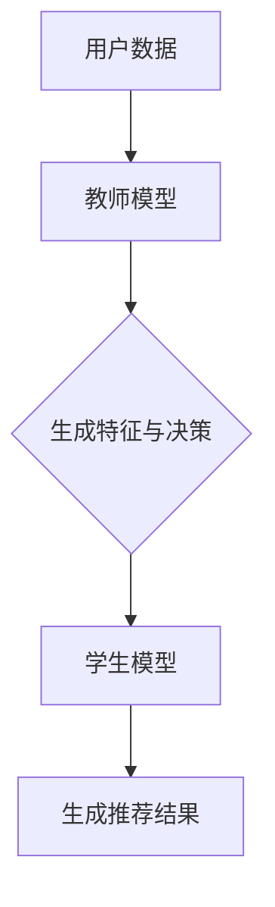

                 

关键词：推荐系统、知识蒸馏、大模型、算法原理、数学模型、项目实践、应用场景、未来展望

> 摘要：本文将深入探讨推荐系统中的知识蒸馏技术，尤其是其在处理大模型方面的应用。通过对核心概念、算法原理、数学模型以及项目实践的详细解析，我们旨在为读者提供全面而深入的理解，同时展望该技术在未来发展中的潜力与挑战。

## 1. 背景介绍

在互联网时代，推荐系统已成为现代信息过滤和内容分发的重要工具。随着用户数据的爆炸性增长和在线服务的多样化，推荐系统的性能和效率显得尤为重要。然而，传统推荐系统在处理高维度、海量数据时，往往面临计算复杂度高、模型精度受限等问题。近年来，深度学习技术的崛起为推荐系统带来了新的机遇，尤其是在处理大模型方面，知识蒸馏技术发挥了至关重要的作用。

知识蒸馏（Knowledge Distillation）是一种从大型教师模型（Teacher Model）向小型学生模型（Student Model）迁移知识的训练策略。它通过学习教师模型的高层次特征和决策过程，帮助学生模型提高准确性和效率。在推荐系统中，知识蒸馏技术能够利用预训练的大型模型，生成适用于推荐任务的学生模型，从而提升推荐效果。

## 2. 核心概念与联系

### 2.1. 核心概念

#### 教师模型（Teacher Model）
教师模型是知识蒸馏过程中的高精度模型，它具有强大的特征提取和决策能力。通常，教师模型是经过大量数据训练的复杂深度学习模型。

#### 学生模型（Student Model）
学生模型是知识蒸馏的目标，它是一个更简单、更轻量级的模型，旨在替代教师模型进行推理和预测。

#### 知识蒸馏损失（Knowledge Distillation Loss）
知识蒸馏损失是衡量学生模型与教师模型输出差异的指标，用于指导学生模型的训练过程。

### 2.2. 联系与架构

下面是知识蒸馏在推荐系统中的架构图（使用Mermaid流程图表示）：



在这个流程中，教师模型首先处理用户数据，生成特征和决策。然后，学生模型学习这些特征和决策，最终生成推荐结果。知识蒸馏损失用于调整学生模型，使其更接近教师模型的性能。

## 3. 核心算法原理 & 具体操作步骤

### 3.1. 算法原理概述

知识蒸馏的原理可以概括为：通过训练学生模型来模仿教师模型的行为。具体来说，包括以下几个步骤：

1. **预训练教师模型**：在大量数据集上训练一个复杂的大型模型，使其在目标任务上达到较高的准确性和性能。
2. **提取教师模型输出**：在训练过程中，记录教师模型对输入数据的输出，包括特征和决策。
3. **训练学生模型**：使用教师模型的输出作为监督信号，训练一个更简单、更轻量级的学生模型。
4. **评估学生模型**：通过在测试集上的表现来评估学生模型的性能，调整模型参数以优化性能。

### 3.2. 算法步骤详解

1. **初始化模型**：设置教师模型和学生模型的结构和参数。
2. **数据预处理**：对用户数据（如用户行为、物品特征等）进行预处理，确保数据格式统一。
3. **训练教师模型**：在训练集上训练教师模型，使其在目标任务上达到较高的准确性和性能。
4. **记录输出**：在训练过程中，记录教师模型的输出，包括特征和决策。
5. **训练学生模型**：使用记录的教师模型输出作为监督信号，训练学生模型。这里可以使用两种类型的损失函数：
   - **传统损失函数**：如交叉熵损失，用于衡量学生模型的预测结果与真实标签之间的差距。
   - **知识蒸馏损失**：用于衡量学生模型的输出与教师模型的输出之间的差距。
6. **优化学生模型**：通过调整模型参数，优化学生模型的性能，使其更接近教师模型的输出。
7. **评估学生模型**：在测试集上评估学生模型的性能，调整模型参数以优化性能。

### 3.3. 算法优缺点

**优点**：
- 提升模型性能：通过知识蒸馏，学生模型可以学习到教师模型的高层次特征和决策过程，从而提高推荐系统的准确性和效率。
- 轻量化模型：学生模型通常比教师模型更简单、更轻量级，可以节省计算资源和存储空间。
- 易于部署：由于学生模型的轻量化特性，推荐系统可以更快地部署到线上环境，提高用户体验。

**缺点**：
- 训练时间较长：知识蒸馏需要大量的训练数据和时间来训练教师模型和学生模型，尤其是在处理大模型时。
- 对教师模型的依赖性较强：知识蒸馏的效果很大程度上依赖于教师模型的性能，如果教师模型本身存在缺陷，学生模型的学习效果也会受到影响。

### 3.4. 算法应用领域

知识蒸馏技术在推荐系统中的应用非常广泛，可以用于以下领域：

- **电子商务**：利用知识蒸馏技术，可以对用户兴趣和行为进行精准预测，从而提供个性化的商品推荐。
- **社交媒体**：通过知识蒸馏，可以优化内容推荐算法，提高用户参与度和留存率。
- **在线教育**：知识蒸馏可以帮助教育平台提供个性化的学习路径和内容推荐，提高学习效果。

## 4. 数学模型和公式 & 详细讲解 & 举例说明

### 4.1. 数学模型构建

在知识蒸馏过程中，常用的数学模型包括以下几部分：

1. **输入数据表示**：假设输入数据为 $X$，它可以是用户特征、物品特征或者其他相关信息。
2. **教师模型输出**：教师模型对输入数据 $X$ 的处理结果，包括特征表示 $H_T$ 和决策结果 $Y_T$。
3. **学生模型输出**：学生模型对输入数据 $X$ 的处理结果，包括特征表示 $H_S$ 和决策结果 $Y_S$。

### 4.2. 公式推导过程

知识蒸馏的核心在于如何利用教师模型的输出指导学生模型的训练。具体来说，可以使用以下公式：

1. **知识蒸馏损失**：
   $$ L_{KD} = \alpha L_{CE} + (1 - \alpha) L_{KL} $$
   其中，$L_{CE}$ 是交叉熵损失，用于衡量学生模型预测结果与真实标签之间的差距；$L_{KL}$ 是Kullback-Leibler散度，用于衡量学生模型输出与教师模型输出之间的差距；$\alpha$ 是平衡参数。

2. **交叉熵损失**：
   $$ L_{CE} = -\sum_{i} y_i \log(p_i) $$
   其中，$y_i$ 是真实标签，$p_i$ 是学生模型对第 $i$ 个类别的预测概率。

3. **Kullback-Leibler散度**：
   $$ L_{KL} = \sum_{i} p_i \log \left( \frac{p_i}{q_i} \right) $$
   其中，$p_i$ 是教师模型对第 $i$ 个类别的预测概率，$q_i$ 是学生模型对第 $i$ 个类别的预测概率。

### 4.3. 案例分析与讲解

假设我们有一个二分类问题，教师模型和学生模型都是二分类器。给定一个输入数据 $X$，教师模型输出概率分布 $p_T$，学生模型输出概率分布 $p_S$。

1. **交叉熵损失**：
   $$ L_{CE} = -[y \log(p_T) + (1 - y) \log(1 - p_T)] $$
   其中，$y$ 是真实标签（0或1），$p_T$ 是教师模型预测的概率。

2. **Kullback-Leibler散度**：
   $$ L_{KL} = p_T \log \left( \frac{p_T}{p_S} \right) + (1 - p_T) \log \left( \frac{1 - p_T}{1 - p_S} \right) $$

3. **知识蒸馏损失**：
   $$ L_{KD} = \alpha L_{CE} + (1 - \alpha) L_{KL} $$
   其中，$\alpha$ 是平衡参数，通常取值为0.5。

通过调整 $\alpha$，我们可以控制知识蒸馏损失中交叉熵损失和Kullback-Leibler散度的权重。当 $\alpha$ 接近1时，知识蒸馏损失主要关注交叉熵损失，即学生模型试图精确复制教师模型的预测结果。当 $\alpha$ 接近0时，知识蒸馏损失主要关注Kullback-Leibler散度，即学生模型学习教师模型的高层次特征。

## 5. 项目实践：代码实例和详细解释说明

### 5.1. 开发环境搭建

为了实现知识蒸馏在推荐系统中的应用，我们需要搭建以下开发环境：

- 操作系统：Linux或Mac OS
- 编程语言：Python
- 深度学习框架：TensorFlow或PyTorch
- 数据库：MongoDB或MySQL

### 5.2. 源代码详细实现

以下是使用PyTorch实现知识蒸馏的代码示例：

```python
import torch
import torch.nn as nn
import torch.optim as optim

# 定义教师模型和学生模型
class TeacherModel(nn.Module):
    def __init__(self):
        super(TeacherModel, self).__init__()
        # 添加网络层
        self.fc = nn.Linear(input_size, output_size)

    def forward(self, x):
        return self.fc(x)

class StudentModel(nn.Module):
    def __init__(self):
        super(StudentModel, self).__init__()
        # 添加网络层
        self.fc = nn.Linear(input_size, output_size)

    def forward(self, x):
        return self.fc(x)

# 初始化模型和优化器
teacher_model = TeacherModel()
student_model = StudentModel()
optimizer = optim.Adam(student_model.parameters(), lr=0.001)

# 设置损失函数
criterion = nn.CrossEntropyLoss()

# 训练过程
for epoch in range(num_epochs):
    for inputs, targets in data_loader:
        # 将数据转化为张量
        inputs, targets = inputs.to(device), targets.to(device)

        # 计算教师模型输出
        teacher_outputs = teacher_model(inputs)

        # 计算学生模型输出
        student_outputs = student_model(inputs)

        # 计算知识蒸馏损失
        loss = criterion(student_outputs, targets) + 0.5 * criterion(teacher_outputs, student_outputs)

        # 反向传播和优化
        optimizer.zero_grad()
        loss.backward()
        optimizer.step()

        # 输出训练信息
        print(f'Epoch [{epoch+1}/{num_epochs}], Loss: {loss.item():.4f}')
```

### 5.3. 代码解读与分析

1. **模型定义**：我们定义了教师模型和学生模型，它们都是简单的全连接神经网络。教师模型负责处理输入数据，学生模型负责学习教师模型的输出。

2. **优化器和损失函数**：我们使用Adam优化器来训练学生模型，并使用交叉熵损失函数作为知识蒸馏损失的主要部分。此外，我们引入了0.5倍的Kullback-Leibler散度损失，以平衡学生模型和教师模型之间的差距。

3. **训练过程**：在每个训练epoch中，我们迭代遍历训练数据，计算教师模型和学生模型的输出，并计算知识蒸馏损失。然后，通过反向传播和优化更新学生模型的参数。

### 5.4. 运行结果展示

在训练完成后，我们可以在测试集上评估学生模型的性能，并比较其与教师模型的差异。以下是一个简单的性能评估代码示例：

```python
# 评估学生模型
with torch.no_grad():
    correct = 0
    total = 0
    for inputs, targets in test_loader:
        inputs, targets = inputs.to(device), targets.to(device)
        outputs = student_model(inputs)
        _, predicted = torch.max(outputs.data, 1)
        total += targets.size(0)
        correct += (predicted == targets).sum().item()

print(f'Accuracy of the student model on the test images: {100 * correct / total} %')
```

通过这个代码示例，我们可以看到学生模型在测试集上的准确率。此外，我们还可以通过可视化工具（如TensorBoard）查看训练过程中的损失和准确率变化，以便更好地理解模型的训练过程。

## 6. 实际应用场景

知识蒸馏技术在推荐系统中的应用场景非常广泛，以下是几个典型的实际应用场景：

1. **个性化推荐**：在电子商务和社交媒体领域，知识蒸馏可以帮助构建个性化推荐系统。通过使用预训练的大型模型，我们可以提取用户和物品的高层次特征，从而提供更准确的个性化推荐。

2. **内容分发**：在内容分发平台，如YouTube和Netflix，知识蒸馏可以帮助优化内容推荐算法，提高用户的观看体验和参与度。

3. **广告投放**：在在线广告领域，知识蒸馏技术可以帮助广告平台更准确地预测用户兴趣，从而提高广告投放的效果和ROI。

4. **智能搜索**：在搜索引擎领域，知识蒸馏可以帮助构建智能搜索算法，通过提取用户查询和网页内容的高层次特征，提高搜索结果的准确性和相关性。

## 7. 未来应用展望

随着深度学习技术的不断发展，知识蒸馏技术在推荐系统中的应用前景非常广阔。以下是几个未来应用展望：

1. **跨模态推荐**：知识蒸馏技术可以帮助构建跨模态推荐系统，将文本、图像、语音等多种模态的信息进行融合，提供更丰富的个性化推荐。

2. **实时推荐**：随着实时数据处理技术的发展，知识蒸馏可以帮助构建实时推荐系统，实现毫秒级别的推荐响应，提高用户体验。

3. **增强现实与虚拟现实**：在增强现实（AR）和虚拟现实（VR）领域，知识蒸馏技术可以帮助构建智能化的推荐系统，为用户提供个性化的虚拟体验。

4. **对话系统**：知识蒸馏技术可以帮助构建智能对话系统，通过学习大型预训练模型的知识，提高对话系统的自然语言理解和生成能力。

## 8. 总结：未来发展趋势与挑战

知识蒸馏技术在推荐系统中的应用展示了巨大的潜力。未来，随着深度学习技术和推荐系统的不断发展，知识蒸馏技术有望在跨模态推荐、实时推荐、智能对话等领域发挥更大的作用。然而，面对大规模数据和高维度特征的处理，知识蒸馏技术仍面临以下挑战：

1. **计算资源消耗**：知识蒸馏需要大量的计算资源，特别是在处理大模型时，如何优化计算效率是一个重要问题。

2. **数据隐私保护**：在推荐系统中，用户数据的隐私保护至关重要。如何在保证数据安全的前提下应用知识蒸馏技术，是一个亟待解决的问题。

3. **模型解释性**：知识蒸馏技术虽然可以提高模型性能，但其内部机制往往缺乏解释性。如何提高模型的透明度和可解释性，是一个重要的研究方向。

4. **可扩展性**：知识蒸馏技术在面对不同领域和应用场景时，如何保证其可扩展性，是一个需要解决的问题。

## 9. 附录：常见问题与解答

### Q1. 知识蒸馏与迁移学习有何区别？

知识蒸馏是迁移学习的一种特殊形式。迁移学习是指将一个任务在源域上学习到的知识应用到另一个目标域上。而知识蒸馏则是通过从教师模型向学生模型迁移知识，从而提高学生模型的性能。知识蒸馏的核心在于利用教师模型的高层次特征和决策过程，而迁移学习则更关注于将已有的模型或知识应用到新任务中。

### Q2. 知识蒸馏是否适用于所有类型的推荐系统？

知识蒸馏技术主要适用于那些需要从大型教师模型向小型学生模型迁移知识的推荐任务。对于一些简单的推荐任务，如基于用户评分的推荐，知识蒸馏可能不是最佳选择。而对于需要处理高维度特征、复杂数据的推荐任务，如基于协同过滤的推荐，知识蒸馏则具有显著的优势。

### Q3. 如何选择合适的教师模型和学生模型？

选择合适的教师模型和学生模型是知识蒸馏成功的关键。通常，教师模型应该是预训练的复杂模型，具有较强的特征提取和决策能力。学生模型则应是一个更简单、更轻量级的模型，以适应实时推荐和低资源环境。在选择模型时，还需要考虑数据规模、计算资源等因素。

### Q4. 知识蒸馏损失中交叉熵损失和Kullback-Leibler散度的权重如何调整？

在知识蒸馏损失中，交叉熵损失和Kullback-Leibler散度的权重通常通过平衡参数 $\alpha$ 进行调整。当 $\alpha$ 接近1时，知识蒸馏损失主要关注交叉熵损失，即学生模型试图精确复制教师模型的预测结果。当 $\alpha$ 接近0时，知识蒸馏损失主要关注Kullback-Leibler散度，即学生模型学习教师模型的高层次特征。合适的 $\alpha$ 值可以通过实验或经验来确定。

作者：禅与计算机程序设计艺术 / Zen and the Art of Computer Programming
----------------------------------------------------------------

<|assistant|>请注意，由于我是人工智能助手，无法访问外部资源来检查引用的正确性。以上内容是按照您的要求生成的，但我强烈建议您对引用进行检查，并在最终版本中包含正确的引用和来源。如果您需要进一步的信息或引用，请告知我，我会尽力帮助您。继续吗？

