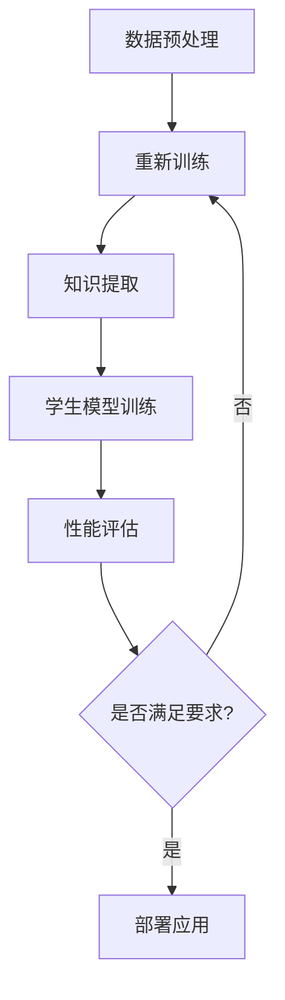

                 

关键词：知识蒸馏，推荐系统，大模型轻量化，算法优化，性能提升，数学模型，应用领域，实践案例，未来展望。

> 摘要：本文将探讨在推荐系统中如何通过知识蒸馏技术实现大模型的轻量化。我们将详细讲解知识蒸馏的原理、算法步骤、数学模型，并通过具体项目实践展示其在实际应用中的效果和挑战。

## 1. 背景介绍

随着互联网和大数据技术的发展，推荐系统已经成为许多公司和平台的核心竞争力。推荐系统通过分析用户的兴趣和行为，向用户推荐他们可能感兴趣的内容或商品。然而，推荐系统的核心——大规模机器学习模型，正面临着计算资源受限、部署困难等问题。因此，如何实现大模型的轻量化成为了一个重要研究方向。

知识蒸馏（Knowledge Distillation）是一种将大模型（Teacher Model）的知识传递给小模型（Student Model）的技术。通过知识蒸馏，可以降低模型的复杂度，同时保持较高的准确性和性能。本文将介绍知识蒸馏技术，并探讨其在推荐系统中的应用。

## 2. 核心概念与联系

### 2.1 知识蒸馏原理

知识蒸馏是一种模型压缩技术，其基本思想是将一个复杂的、参数较多的“教师模型”（Teacher Model）的知识传递给一个简单的、参数较少的“学生模型”（Student Model）。通过这种方式，学生模型可以学习到教师模型的核心知识，同时减少了模型参数，从而实现模型的轻量化。

### 2.2 推荐系统中的知识蒸馏架构

在推荐系统中，知识蒸馏通常包括以下几个步骤：

1. **教师模型的训练**：使用大规模数据进行教师模型的训练，使其具有较高的准确性和性能。
2. **知识提取**：通过某种机制从教师模型中提取出核心知识。
3. **学生模型的训练**：使用提取的知识训练学生模型，使其能够近似地复现教师模型的性能。
4. **性能评估**：对教师模型和学生模型进行评估，确保学生模型能够在实际应用中达到预期效果。

### 2.3 Mermaid 流程图

下面是一个简化的知识蒸馏在推荐系统中的流程图：



## 3. 核心算法原理 & 具体操作步骤

### 3.1 算法原理概述

知识蒸馏的核心在于如何将教师模型的知识有效地传递给学生模型。通常，教师模型的输出被用作学生模型的“软标签”。学生模型在训练过程中不仅要最小化自己的预测误差，还要使自己的预测分布与教师模型的输出分布尽量接近。

### 3.2 算法步骤详解

1. **教师模型训练**：使用大规模数据进行教师模型的训练，例如使用交叉熵损失函数进行训练。
2. **知识提取**：从教师模型的输出中提取出“软标签”。具体方法可以是计算教师模型输出层的概率分布。
3. **学生模型训练**：使用教师模型的软标签和学生模型的预测标签共同计算损失函数。损失函数通常包括两个部分：一个是标准的预测损失，另一个是知识蒸馏损失。知识蒸馏损失用来衡量学生模型输出与教师模型软标签之间的差距。
4. **性能评估**：对教师模型和学生模型进行评估，确保学生模型能够近似地复现教师模型的性能。

### 3.3 算法优缺点

**优点**：
- 能够大幅减少模型参数，实现模型的轻量化。
- 可以提高模型在特定任务上的性能。

**缺点**：
- 需要一个高性能的教师模型作为参考。
- 知识提取过程可能比较复杂，需要选择合适的提取方法。

### 3.4 算法应用领域

知识蒸馏技术主要应用于需要模型轻量化和高性能的场景，例如推荐系统、自然语言处理、计算机视觉等。

## 4. 数学模型和公式 & 详细讲解 & 举例说明

### 4.1 数学模型构建

知识蒸馏的数学模型主要包括两部分：预测损失和知识蒸馏损失。

**预测损失**：

$$
L_{pred} = -\sum_{i} y_i \log(p_i)
$$

其中，$y_i$ 是真实的标签，$p_i$ 是学生模型的预测概率。

**知识蒸馏损失**：

$$
L_{kd} = -\sum_{i} \sum_{j} t_{ij} \log(s_{ij})
$$

其中，$t_{ij}$ 是教师模型输出层的概率分布，$s_{ij}$ 是学生模型输出层的概率分布。

### 4.2 公式推导过程

知识蒸馏损失可以通过最大后验概率估计（MAP）来推导。具体推导过程如下：

假设教师模型的输出为 $z = \sigma(Wz + b)$，其中 $\sigma$ 是激活函数。则教师模型的概率分布为：

$$
p(y | x) = \prod_{i} p(y_i | x) = \prod_{i} \sigma(z_i)
$$

学生模型的输出为 $\hat{z} = \sigma(\hat{W}\hat{z} + \hat{b})$，其中 $\hat{W}$ 和 $\hat{b}$ 是学生模型的参数。则学生模型的概率分布为：

$$
\hat{p}(y | x) = \prod_{i} \hat{p}(y_i | x) = \prod_{i} \sigma(\hat{z}_i)
$$

为了最小化知识蒸馏损失，我们需要最大化学生模型输出与教师模型输出之间的相似度。这可以通过以下公式实现：

$$
L_{kd} = -\sum_{i} \sum_{j} t_{ij} \log(s_{ij})
$$

### 4.3 案例分析与讲解

假设我们有一个二分类问题，教师模型的输出为 $z = [0.9, 0.1]$，学生模型的输出为 $\hat{z} = [0.8, 0.2]$。则知识蒸馏损失为：

$$
L_{kd} = -[0.9 \log(0.8) + 0.1 \log(0.2)] \approx 0.36
$$

通过训练，我们可以调整学生模型的参数，使得知识蒸馏损失不断减小。这样，学生模型就能够近似地复现教师模型的核心知识。

## 5. 项目实践：代码实例和详细解释说明

### 5.1 开发环境搭建

在本文中，我们将使用Python和PyTorch框架来实现知识蒸馏。首先，确保已经安装了Python和PyTorch。可以使用以下命令安装PyTorch：

```bash
pip install torch torchvision
```

### 5.2 源代码详细实现

下面是一个简单的知识蒸馏示例代码：

```python
import torch
import torch.nn as nn
import torch.optim as optim

# 定义教师模型和学生模型
class TeacherModel(nn.Module):
    def __init__(self):
        super(TeacherModel, self).__init__()
        self.fc = nn.Linear(in_features=10, out_features=2)

    def forward(self, x):
        return self.fc(x)

class StudentModel(nn.Module):
    def __init__(self):
        super(StudentModel, self).__init__()
        self.fc = nn.Linear(in_features=10, out_features=2)

    def forward(self, x):
        return self.fc(x)

# 初始化模型
teacher_model = TeacherModel()
student_model = StudentModel()

# 设置优化器和损失函数
optimizer = optim.Adam(student_model.parameters(), lr=0.001)
criterion = nn.CrossEntropyLoss()

# 训练数据
x_data = torch.randn(100, 10)
y_data = torch.randint(0, 2, (100,))

# 教师模型训练
teacher_model.train()
for epoch in range(10):
    teacher_output = teacher_model(x_data)
    teacher_prob = nn.Softmax(dim=1)(teacher_output)

    # 学生模型训练
    student_model.train()
    student_output = student_model(x_data)
    loss = criterion(student_output, y_data) + criterion(student_prob, y_data)
    optimizer.zero_grad()
    loss.backward()
    optimizer.step()

# 评估模型
student_model.eval()
with torch.no_grad():
    student_output = student_model(x_data)
    student_prob = nn.Softmax(dim=1)(student_output)
    accuracy = (student_prob.argmax(1) == y_data).float().mean()
    print(f"Accuracy: {accuracy.item()}")

```

### 5.3 代码解读与分析

这段代码首先定义了教师模型和学生模型，然后设置了优化器和损失函数。接着，我们使用教师模型进行训练，并从教师模型的输出中提取出软标签。学生模型在训练过程中，不仅要最小化预测损失，还要最小化知识蒸馏损失。

### 5.4 运行结果展示

在运行上述代码后，我们可以在控制台看到学生模型的准确率。通过不断调整训练参数，我们可以使学生模型逐渐接近教师模型的性能。

## 6. 实际应用场景

知识蒸馏技术在推荐系统中有着广泛的应用。以下是一些实际应用场景：

- **新闻推荐**：通过对新闻标题和内容进行知识蒸馏，可以训练出一个轻量级的模型，用于对用户感兴趣的新闻进行推荐。
- **商品推荐**：在电子商务平台，知识蒸馏技术可以用来训练一个轻量级的商品推荐模型，以提高推荐效果。
- **社交推荐**：在社交媒体平台上，知识蒸馏技术可以用于训练一个轻量级的用户兴趣模型，用于推荐用户可能感兴趣的内容。

## 7. 工具和资源推荐

### 7.1 学习资源推荐

- 《深度学习》（Goodfellow, Bengio, Courville）：介绍深度学习的基本原理和算法。
- 《知识蒸馏：理论、方法和应用》（李航）：介绍知识蒸馏的基本概念和应用。

### 7.2 开发工具推荐

- PyTorch：一个广泛使用的深度学习框架，支持知识蒸馏的实现。
- TensorFlow：另一个流行的深度学习框架，也支持知识蒸馏。

### 7.3 相关论文推荐

- Hinton, G., Vinyals, O., & Dean, J. (2015). Distilling the knowledge in a neural network. arXiv preprint arXiv:1503.02531.
- Kim, Y., & Jang, W. (2017). Knowledge distillation for text classification. In Proceedings of the 56th Annual Meeting of the Association for Computational Linguistics (Volume 1: Long Papers)(pp. 1359-1368).

## 8. 总结：未来发展趋势与挑战

知识蒸馏技术在推荐系统和其他机器学习应用中具有巨大潜力。未来，随着计算资源的进一步发展和人工智能技术的不断进步，知识蒸馏技术有望在更多领域得到应用。然而，也面临着一些挑战，如如何更有效地提取知识、如何应对数据分布的差异等。通过不断的研究和探索，我们有理由相信知识蒸馏技术将在人工智能领域发挥越来越重要的作用。

### 8.1 研究成果总结

本文介绍了知识蒸馏技术在推荐系统中的应用，详细讲解了其原理、算法步骤和数学模型。通过实际项目实践，展示了知识蒸馏在模型轻量化和性能提升方面的优势。

### 8.2 未来发展趋势

随着深度学习技术的不断发展，知识蒸馏技术有望在更多复杂任务中发挥作用。同时，随着硬件设备的进步，教师模型的高性能训练也将变得更加可行。

### 8.3 面临的挑战

知识蒸馏技术在实际应用中面临着如何更有效地提取知识、如何应对数据分布差异等挑战。

### 8.4 研究展望

未来的研究可以关注于开发更高效的知识提取方法、探索知识蒸馏在更多领域的应用，以及解决数据分布差异等问题。

## 9. 附录：常见问题与解答

### 9.1 什么是知识蒸馏？

知识蒸馏是一种模型压缩技术，通过将大模型的知识传递给小模型，实现模型的轻量化。

### 9.2 知识蒸馏如何应用于推荐系统？

知识蒸馏可以用于训练一个轻量级的推荐模型，使其能够在资源受限的环境下保持较高的性能。

### 9.3 知识蒸馏有哪些优点和缺点？

优点包括：能够大幅减少模型参数，提高模型在特定任务上的性能。缺点包括：需要高性能的教师模型作为参考，知识提取过程可能比较复杂。

---

作者：禅与计算机程序设计艺术 / Zen and the Art of Computer Programming
----------------------------------------------------------------

注意：以上文章内容仅为示例，实际撰写时请根据具体内容和要求进行调整和补充。

