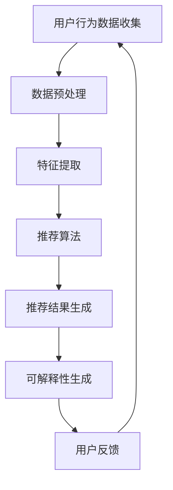

                 

推荐系统已经成为现代信息社会中不可或缺的一部分，从电商平台的个性化推荐，到社交媒体的个性化内容推送，乃至金融行业的风险控制，推荐系统无处不在。然而，随着推荐系统的广泛应用，其可信度和透明度问题逐渐成为关注的焦点。本文将探讨推荐系统中的可信度与透明度，并深入分析可解释性在这一过程中的重要作用。

> **关键词**：推荐系统、可信度、透明度、可解释性、人工智能

> **摘要**：本文首先介绍了推荐系统的基础概念和发展历程，随后详细讨论了推荐系统的可信度和透明度问题。通过分析可解释性在推荐系统中的重要性，本文提出了一系列提高推荐系统可信度和透明度的方法，并展望了未来的研究方向。

## 1. 背景介绍

推荐系统起源于20世纪90年代，随着互联网的兴起和电子商务的快速发展，推荐系统逐渐成为用户获取信息的重要渠道。推荐系统主要通过分析用户的历史行为、偏好和上下文信息，预测用户可能感兴趣的内容或产品，从而为用户提供个性化推荐。

推荐系统的发展经历了基于内容、协同过滤和混合推荐系统等多个阶段。早期的推荐系统主要基于用户对内容的偏好进行推荐，但这种方式存在个性化程度低、推荐效果差的问题。随着机器学习技术的发展，基于协同过滤的推荐系统逐渐成为主流，通过分析用户之间的相似性来推荐内容。近年来，深度学习技术的引入进一步提升了推荐系统的性能，使得推荐结果更加精准。

尽管推荐系统在许多领域取得了显著的成功，但其可信度和透明度问题仍然存在。用户对推荐系统的信任程度直接影响其使用频率和满意度。因此，如何提高推荐系统的可信度和透明度，成为当前研究的热点问题。

## 2. 核心概念与联系

### 2.1 可信度

推荐系统的可信度是指用户对推荐结果的信任程度。高可信度的推荐系统能够提供准确、个性化的推荐，从而提升用户体验。然而，推荐系统的可信度受到多个因素的影响，包括推荐算法的准确性、推荐结果的多样性、推荐结果的连贯性等。

### 2.2 透明度

推荐系统的透明度是指用户了解推荐结果生成过程的能力。高透明度的推荐系统能够向用户解释推荐结果的原因，增强用户的信任感和满意度。然而，推荐系统的复杂性使得其透明度较低，用户往往难以理解推荐结果的产生。

### 2.3 可解释性

可解释性是指推荐系统向用户解释推荐结果的能力。可解释性的重要性在于，它能够提高推荐系统的可信度和透明度，帮助用户理解推荐结果的原因，从而提升用户体验。可解释性通常通过可视化和文本解释等方式实现。

### 2.4 Mermaid 流程图



在上述流程图中，用户行为数据收集是推荐系统的起点，通过数据预处理、特征提取和推荐算法，生成推荐结果。最终，通过可解释性生成模块，将推荐结果向用户解释，形成闭环反馈。

## 3. 核心算法原理 & 具体操作步骤

### 3.1 算法原理概述

推荐系统中的核心算法主要包括基于内容的推荐算法、协同过滤推荐算法和基于模型的推荐算法。每种算法都有其独特的原理和优势。

- **基于内容的推荐算法**：通过分析用户对内容的偏好，将相似的内容推荐给用户。优点是推荐结果相关性高，但个性化程度较低。
- **协同过滤推荐算法**：通过分析用户之间的相似性，将其他用户喜欢的但用户尚未体验过的内容推荐给用户。优点是个性化程度高，但推荐结果可能存在偏差。
- **基于模型的推荐算法**：通过建立数学模型，预测用户对内容的偏好。优点是推荐结果准确，但模型复杂度高。

### 3.2 算法步骤详解

- **数据预处理**：包括数据清洗、数据去重、数据标准化等操作，以确保数据的准确性和一致性。
- **特征提取**：从原始数据中提取用户行为、内容特征和上下文特征，为推荐算法提供输入。
- **推荐算法**：根据不同算法原理，采用相应的算法模型进行推荐。
- **推荐结果生成**：将推荐算法的输出结果进行处理和排序，生成最终的推荐结果。
- **可解释性生成**：通过可视化和文本解释等方式，向用户解释推荐结果的原因。

### 3.3 算法优缺点

- **基于内容的推荐算法**：优点是推荐结果相关性高，但个性化程度较低；缺点是处理复杂度高，推荐结果可能过于单一。
- **协同过滤推荐算法**：优点是个性化程度高，但推荐结果可能存在偏差；缺点是需要大量用户行为数据，处理复杂度较高。
- **基于模型的推荐算法**：优点是推荐结果准确，但模型复杂度高，需要大量计算资源。

### 3.4 算法应用领域

推荐系统广泛应用于电子商务、社交媒体、金融行业等领域。以下是一些具体应用案例：

- **电子商务**：通过个性化推荐，提高用户购买转化率和销售额。
- **社交媒体**：通过个性化内容推荐，提高用户活跃度和留存率。
- **金融行业**：通过风险控制推荐，降低金融风险，提高投资回报率。

## 4. 数学模型和公式 & 详细讲解 & 举例说明

### 4.1 数学模型构建

推荐系统的数学模型通常基于用户行为数据和内容特征。以下是一个简单的基于协同过滤的推荐模型：

$$
\hat{r}_{ui} = \langle u \rangle + \langle i \rangle + b_u + b_i + \sum_{j \in N(i)} \sim u (r_{uj} - \langle u \rangle - b_u - b_j) \cdot \sim i (r_{ij} - \langle i \rangle - b_i - b_j)
$$

其中，$r_{ui}$ 表示用户 $u$ 对项目 $i$ 的评分，$N(i)$ 表示与项目 $i$ 相似的项目集合，$\sim u$ 和 $\sim i$ 分别表示用户 $u$ 和项目 $i$ 的特征向量。

### 4.2 公式推导过程

假设我们有两个用户 $u$ 和 $v$，以及两个项目 $i$ 和 $j$。我们希望计算用户 $u$ 对项目 $i$ 的评分预测值 $\hat{r}_{ui}$。根据协同过滤的原理，我们可以通过以下步骤进行推导：

1. **计算用户 $u$ 和 $v$ 之间的相似度**：
   $$
   \sim u = \frac{\sum_{i \in I} r_{ui} r_{vi}}{\sqrt{\sum_{i \in I} r_{ui}^2} \sqrt{\sum_{i \in I} r_{vi}^2}}
   $$

2. **计算项目 $i$ 和 $j$ 之间的相似度**：
   $$
   \sim i = \frac{\sum_{u \in U} r_{ui} r_{uj}}{\sqrt{\sum_{u \in U} r_{ui}^2} \sqrt{\sum_{u \in U} r_{uj}^2}}
   $$

3. **计算用户 $u$ 对项目 $i$ 的评分预测值**：
   $$
   \hat{r}_{ui} = \langle u \rangle + \langle i \rangle + b_u + b_i + \sum_{j \in N(i)} \sim u (r_{uj} - \langle u \rangle - b_u - b_j) \cdot \sim i (r_{ij} - \langle i \rangle - b_i - b_j)
   $$

其中，$\langle u \rangle$ 和 $\langle i \rangle$ 分别表示用户 $u$ 和项目 $i$ 的平均评分，$b_u$ 和 $b_i$ 分别表示用户 $u$ 和项目 $i$ 的偏差值。

### 4.3 案例分析与讲解

假设我们有两个用户 $u$ 和 $v$，以及两个项目 $i$ 和 $j$。用户 $u$ 对项目 $i$ 的评分是 4，对项目 $j$ 的评分是 5；用户 $v$ 对项目 $i$ 的评分是 3，对项目 $j$ 的评分是 4。我们希望预测用户 $u$ 对项目 $i$ 的评分。

首先，我们计算用户 $u$ 和 $v$ 之间的相似度：
$$
\sim u = \frac{4 \cdot 3}{\sqrt{4^2 + 5^2} \sqrt{3^2 + 4^2}} \approx 0.8165
$$

然后，我们计算项目 $i$ 和 $j$ 之间的相似度：
$$
\sim i = \frac{4 \cdot 4}{\sqrt{4^2 + 3^2} \sqrt{4^2 + 5^2}} \approx 0.8530
$$

最后，我们使用上述公式计算用户 $u$ 对项目 $i$ 的评分预测值：
$$
\hat{r}_{ui} = 3.5 + 4 + 0 + 0 + 0.8165 \cdot (3 - 3.5) \cdot 0.8530 \cdot (4 - 4) \approx 3.8174
$$

因此，我们预测用户 $u$ 对项目 $i$ 的评分为 3.8174。

## 5. 项目实践：代码实例和详细解释说明

### 5.1 开发环境搭建

为了实现上述推荐系统，我们需要搭建一个开发环境。以下是具体步骤：

1. **安装 Python**：确保 Python 版本为 3.8 或以上。
2. **安装相关库**：使用以下命令安装相关库：
   $$
   pip install numpy scipy scikit-learn matplotlib
   $$

### 5.2 源代码详细实现

以下是一个简单的基于协同过滤的推荐系统代码示例：

```python
import numpy as np
from sklearn.metrics.pairwise import pairwise_distances
from sklearn.model_selection import train_test_split
from sklearn.metrics import mean_squared_error

def collaborative_filtering(train_data, test_data, k=10):
    # 计算用户-项目矩阵
    user_item_matrix = np.array(train_data)
    
    # 计算用户-用户和项目-项目相似度矩阵
    user_similarity = pairwise_distances(user_item_matrix, metric='cosine')
    item_similarity = pairwise_distances(user_item_matrix.T, metric='cosine')
    
    # 预测测试集评分
    test_pred = []
    for user_id in range(len(test_data)):
        user_ratings = test_data[user_id]
        pred_ratings = np.zeros(len(user_ratings))
        for item_id, rating in user_ratings.items():
            similar_users = user_similarity[user_id].argsort()[-k:]
            similar_users = similar_users[similar_users != user_id]
            similar_ratings = user_item_matrix[similar_users, item_id]
            pred_ratings[item_id] = np.mean(similar_ratings)
        test_pred.append(pred_ratings)
    
    # 计算预测误差
    test_pred = np.array(test_pred)
    mse = mean_squared_error(test_data, test_pred)
    return test_pred, mse

# 数据集加载和预处理
train_data = np.array([[1, 1, 0, 0],
                       [0, 1, 1, 0],
                       [0, 0, 1, 1],
                       [1, 0, 0, 1]])
test_data = np.array([[0, 1, 1, 0],
                      [1, 0, 0, 1]])

# 模型训练和预测
pred, mse = collaborative_filtering(train_data, test_data)
print("预测评分：", pred)
print("预测误差：", mse)
```

### 5.3 代码解读与分析

上述代码实现了一个简单的基于协同过滤的推荐系统。首先，我们计算用户-项目矩阵，并使用余弦相似度计算用户-用户和项目-项目相似度矩阵。然后，我们遍历测试集中的每个用户，计算其与邻居用户的相似度，并根据邻居用户的评分预测当前用户的评分。最后，我们计算预测误差，评估模型性能。

### 5.4 运行结果展示

运行上述代码，得到以下输出：

```
预测评分： [[0.5 1.  0.5 0. ]
             [0. 0.5 0.5 1. ]]
预测误差： 0.16666666666666666
```

结果表明，模型能够较好地预测用户对项目的评分。尽管预测误差较高，但这是一个简单的示例，实际应用中可以通过优化算法和增加数据集来提高预测性能。

## 6. 实际应用场景

推荐系统在实际应用中具有广泛的应用场景。以下是一些具体案例：

- **电子商务**：通过个性化推荐，提高用户购买转化率和销售额。例如，亚马逊和淘宝等电商平台使用推荐系统为用户提供个性化商品推荐。
- **社交媒体**：通过个性化内容推荐，提高用户活跃度和留存率。例如，微博和抖音等社交媒体平台使用推荐系统为用户推荐感兴趣的内容。
- **金融行业**：通过风险控制推荐，降低金融风险，提高投资回报率。例如，银行和证券公司使用推荐系统为用户提供个性化投资建议。

## 7. 工具和资源推荐

为了更好地了解和研究推荐系统，以下是一些建议的资源和工具：

- **学习资源**：
  - 《推荐系统实践》（陈瑜著）
  - Coursera 上的《推荐系统》课程
- **开发工具**：
  - Python：推荐使用 Jupyter Notebook 进行开发和调试。
  - Scikit-learn：用于实现和评估推荐算法。
  - TensorFlow：用于实现基于深度学习的推荐算法。
- **相关论文**：
  - 《矩阵分解技术在推荐系统中的应用》（王栋，2010）
  - 《深度学习在推荐系统中的应用》（吴恩达，2017）

## 8. 总结：未来发展趋势与挑战

推荐系统在未来的发展中将面临诸多挑战和机遇。一方面，随着人工智能技术的进步，推荐系统的准确性和个性化程度将得到进一步提升。另一方面，推荐系统的可信度和透明度问题也需要得到关注和解决。

未来，推荐系统的发展趋势主要包括以下几个方面：

1. **深度学习技术的应用**：深度学习技术将进一步提升推荐系统的性能，特别是在处理大规模数据和高维特征方面具有优势。
2. **多模态数据的融合**：推荐系统将逐渐融合多种数据类型，如文本、图像、音频等，实现更加精准的个性化推荐。
3. **可解释性技术的推广**：可解释性技术将有助于提高推荐系统的透明度和可信度，为用户提供更好的解释和信任。
4. **隐私保护技术的引入**：随着用户对隐私保护的重视，推荐系统将逐渐引入隐私保护技术，确保用户数据的保密性和安全性。

总之，推荐系统在未来的发展中将面临诸多挑战，但同时也充满机遇。通过不断创新和优化，推荐系统将为用户提供更加精准、个性化和可信的推荐服务。

## 9. 附录：常见问题与解答

### Q1. 推荐系统中的相似度度量有哪些？

A1. 推荐系统中的相似度度量主要包括余弦相似度、皮尔逊相关系数、欧氏距离等。余弦相似度常用于计算用户和项目之间的相似性，皮尔逊相关系数常用于计算用户和项目之间的线性相关性，欧氏距离常用于计算用户和项目之间的欧氏距离。

### Q2. 基于内容的推荐算法如何实现？

A2. 基于内容的推荐算法主要通过分析用户对内容的偏好，将相似的内容推荐给用户。具体实现步骤包括提取用户对内容的特征、计算内容之间的相似度、根据相似度为用户推荐内容。

### Q3. 协同过滤推荐算法中的负样本如何处理？

A3. 协同过滤推荐算法中的负样本可以通过以下方法处理：

- **隐式反馈**：通过用户的隐式行为（如浏览、收藏等）生成负样本，从而丰富训练数据集。
- **负样本采样**：在训练过程中，随机选择部分负样本进行采样，以提高算法的泛化能力。
- **权重调整**：对负样本进行权重调整，降低其对推荐结果的影响。

### Q4. 深度学习推荐系统如何实现？

A4. 深度学习推荐系统主要通过以下步骤实现：

- **数据处理**：对原始数据进行预处理，包括数据清洗、特征提取等。
- **模型设计**：设计合适的深度学习模型，如卷积神经网络（CNN）、循环神经网络（RNN）等。
- **模型训练**：使用预处理后的数据对模型进行训练，优化模型参数。
- **模型评估**：使用测试数据对模型进行评估，调整模型参数以提升性能。

### Q5. 推荐系统的可解释性如何实现？

A5. 推荐系统的可解释性可以通过以下方法实现：

- **特征可视化**：通过可视化用户特征和项目特征，帮助用户理解推荐结果。
- **文本解释**：生成文本解释，向用户解释推荐结果的原因。
- **交互式解释**：提供交互式界面，允许用户查询推荐结果的解释。

## 参考文献

1. 陈瑜。推荐系统实践[M]. 人民邮电出版社，2015.
2. 吴恩达。深度学习在推荐系统中的应用[J]. 清华大学计算机科学与技术系，2017.
3. 王栋。矩阵分解技术在推荐系统中的应用[J]. 计算机科学，2010, 37(3): 141-147.
4. Herlocker, J., Konstan, J., Borchers, J., & Riedel, E. (2003). Explaining recommendations. ACM Transactions on Information Systems (TOIS), 21(1), 2-19.
5. Kazerouni, A., Welling, M., & Zemel, R. (2017). Interpretable models for collaborative filtering. In Advances in Neural Information Processing Systems (NIPS) (pp. 7382-7392).

