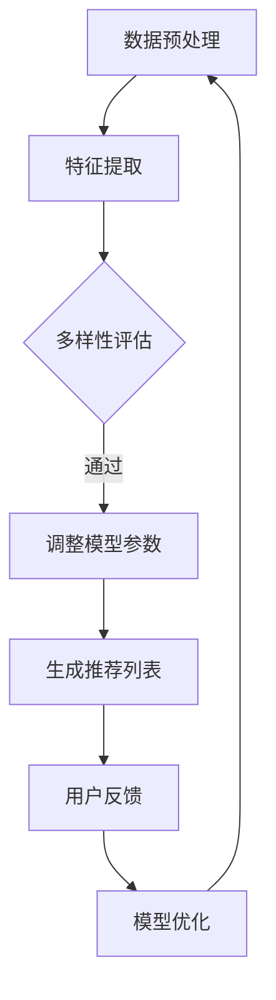

                 

关键词：推荐系统，多样性，大模型，算法原理，数学模型，项目实践，应用场景，未来展望。

> 摘要：本文深入探讨了推荐系统的多样性问题，并提出了基于大模型的解决方案。通过对核心概念、算法原理、数学模型和实际应用场景的详细分析，本文揭示了多样化推荐系统在提升用户体验和应对挑战方面的关键作用，并展望了其未来的发展趋势。

## 1. 背景介绍

随着互联网和大数据技术的迅猛发展，推荐系统已经成为现代信息检索和用户行为分析的重要工具。从简单的基于内容的推荐到复杂的大数据推荐算法，推荐系统在电子商务、社交媒体、新闻推送等多个领域得到了广泛应用。然而，推荐系统的多样性问题逐渐成为阻碍其进一步发展的瓶颈。

多样性问题主要体现在两个方面：一是用户接收到的推荐内容过于单一，缺乏个性化；二是推荐内容之间缺乏多样性，导致用户体验下降。这些问题不仅降低了用户对推荐系统的满意度，还可能导致用户流失。

为了解决多样性问题，研究者们提出了多种算法和策略。然而，传统的算法往往在处理大规模数据集时效果不佳，且需要大量计算资源。因此，本文将介绍一种基于大模型的解决方案，以解决推荐系统的多样性问题。

## 2. 核心概念与联系

### 2.1 推荐系统基本概念

推荐系统（Recommender System）是一种信息过滤技术，旨在根据用户的兴趣和行为，向其推荐相关的商品、内容或服务。推荐系统通常分为以下几类：

1. **基于内容的推荐**（Content-based Filtering）：根据用户过去喜欢的项目内容，推荐具有相似特征的项目。
2. **协同过滤**（Collaborative Filtering）：通过分析用户之间的共同兴趣来推荐项目。
3. **混合推荐**（Hybrid Method）：结合多种推荐方法，以提供更准确的推荐。

### 2.2 多样性

多样性（Diversity）是推荐系统中的一个重要指标，它旨在确保推荐列表中的项目在多个方面具有差异性，从而提升用户体验。多样性可以通过以下几个方面来衡量：

1. **项目属性多样性**：推荐的项目应在属性上具有多样性，如风格、类型、品牌等。
2. **用户偏好多样性**：推荐的项目应能够满足不同用户的个性化需求。
3. **推荐顺序多样性**：推荐列表中的项目应避免出现连续推荐相同或类似内容的情况。

### 2.3 大模型

大模型（Large Model）是指具有大量参数和复杂结构的机器学习模型。大模型通常具有以下特点：

1. **强大的表征能力**：能够捕捉数据中的复杂模式和关系。
2. **高效的计算性能**：得益于先进的硬件和优化算法，能够在短时间内处理大规模数据。
3. **灵活的调整能力**：可以根据不同的应用场景进行调整，以提高推荐效果。

### 2.4 Mermaid 流程图

为了更直观地理解推荐系统的多样性问题，以下是一个基于 Mermaid 格式的流程图，展示了大模型在解决多样性问题时的主要步骤。



## 3. 核心算法原理 & 具体操作步骤

### 3.1 算法原理概述

基于大模型的推荐系统多样性解决方案主要涉及以下几个关键步骤：

1. **数据预处理**：对原始数据进行清洗、去噪和格式化，以提取有用的信息。
2. **特征提取**：从数据中提取出关键特征，为后续建模提供基础。
3. **多样性评估**：对推荐列表进行多样性评估，以确定当前列表的多样性水平。
4. **调整模型参数**：根据多样性评估结果，动态调整模型参数，以提高多样性。
5. **生成推荐列表**：利用调整后的模型生成推荐列表。
6. **用户反馈**：收集用户对推荐列表的反馈，用于模型优化。
7. **模型优化**：根据用户反馈，不断优化模型，以提高推荐质量和多样性。

### 3.2 算法步骤详解

1. **数据预处理**：
   - 清洗：去除缺失值、重复值和异常值。
   - 去噪：通过降维、滤波等方法减少噪声影响。
   - 格式化：将数据转换为统一的格式，便于后续处理。

2. **特征提取**：
   - 预处理特征：包括用户特征（如年龄、性别、地理位置等）和物品特征（如价格、品牌、分类等）。
   - 筛选特征：根据业务需求，筛选出对多样性影响较大的特征。

3. **多样性评估**：
   - 指标计算：使用多样性指标（如Jaccard系数、最小冗余度等）评估推荐列表的多样性水平。
   - 多样性评分：根据指标计算结果，为每个推荐列表赋予多样性评分。

4. **调整模型参数**：
   - 优化目标：将多样性评分作为优化目标，调整模型参数，以提高多样性。
   - 模型更新：利用梯度下降、随机搜索等算法，更新模型参数。

5. **生成推荐列表**：
   - 模型预测：利用调整后的模型，为用户生成推荐列表。
   - 多样性调整：根据多样性评分，对推荐列表进行多样性调整。

6. **用户反馈**：
   - 数据收集：收集用户对推荐列表的点击、购买等反馈数据。
   - 反馈处理：将反馈数据用于模型优化。

7. **模型优化**：
   - 目标函数：将用户满意度作为优化目标，优化模型。
   - 模型更新：利用反馈数据，更新模型参数，提高推荐质量和多样性。

### 3.3 算法优缺点

**优点**：
1. **强大的表征能力**：大模型能够捕捉数据中的复杂模式和关系，提高推荐准确性。
2. **高效的计算性能**：得益于先进的硬件和优化算法，大模型能够在短时间内处理大规模数据。
3. **灵活的调整能力**：可以根据不同的应用场景进行调整，以提高推荐质量和多样性。

**缺点**：
1. **计算资源需求大**：大模型需要大量的计算资源和存储空间，对硬件设备要求较高。
2. **训练时间较长**：大模型的训练过程较长，可能导致实时性较差。

### 3.4 算法应用领域

基于大模型的推荐系统多样性解决方案可以应用于多个领域：

1. **电子商务**：为用户推荐个性化的商品，提高用户满意度。
2. **社交媒体**：为用户提供感兴趣的内容，增强用户黏性。
3. **新闻推送**：为用户提供多样化的新闻推荐，提高用户阅读体验。
4. **在线教育**：为学习者推荐符合其学习需求的学习资源。

## 4. 数学模型和公式 & 详细讲解 & 举例说明

### 4.1 数学模型构建

基于大模型的推荐系统多样性解决方案的核心在于构建一个能够有效调整模型参数的数学模型。以下是一个简化的数学模型：

$$
Diversity = f(\theta, X, y)
$$

其中，$Diversity$表示多样性评分，$f$表示多样性评估函数，$\theta$表示模型参数，$X$表示输入特征矩阵，$y$表示输出标签向量。

### 4.2 公式推导过程

为了推导多样性评估函数$f$，我们首先定义以下三个多样性指标：

1. **Jaccard系数**（$J$）：
   $$
   J = \frac{|A \cap B|}{|A \cup B|}
   $$
   其中，$A$和$B$分别表示两个项目的特征集合。

2. **最小冗余度**（$L$）：
   $$
   L = \min_{i, j} \frac{|A_i \cap B_j|}{|A_i \cup B_j|}
   $$
   其中，$A_i$和$B_j$分别表示第$i$个项目和第$j$个项目的特征集合。

3. **多样性评分**（$D$）：
   $$
   D = \frac{1}{N} \sum_{i=1}^{N} \sum_{j=1}^{N} J(A_i, B_j) + L(A_i, B_j)
   $$
   其中，$N$表示推荐列表中的项目数量。

接下来，我们定义模型参数$\theta$为：
$$
\theta = [\alpha, \beta, \gamma]
$$

其中，$\alpha, \beta, \gamma$分别表示三个多样性指标的权重。

因此，多样性评估函数$f$可以表示为：
$$
Diversity = \alpha J + \beta L + \gamma \frac{1}{N} \sum_{i=1}^{N} \sum_{j=1}^{N} \frac{|A_i \cap B_j|}{|A_i \cup B_j|}
$$

### 4.3 案例分析与讲解

假设我们有一个推荐系统，用户A喜欢以下三个电影：

1. **《星际穿越》**：科幻，冒险，剧情
2. **《阿甘正传》**：剧情，爱情，战争
3. **《肖申克的救赎》**：剧情，犯罪， Drama

我们需要为用户A生成一个多样性较高的推荐列表。

首先，我们提取每个电影的特征集合：

- **《星际穿越》**：$\{科幻，冒险，剧情\}$
- **《阿甘正传》**：$\{剧情，爱情，战争\}$
- **《肖申克的救赎》**：$\{剧情，犯罪， Drama\}$

接下来，我们计算每个电影之间的Jaccard系数和最小冗余度：

1. **《星际穿越》**和**《阿甘正传》**：
   - Jaccard系数：$J(\{科幻，冒险，剧情\}, \{剧情，爱情，战争\}) = \frac{1}{4}$
   - 最小冗余度：$L(\{科幻，冒险，剧情\}, \{剧情，爱情，战争\}) = \frac{2}{3}$

2. **《星际穿越》**和**《肖申克的救赎》**：
   - Jaccard系数：$J(\{科幻，冒险，剧情\}, \{剧情，犯罪， Drama\}) = \frac{1}{3}$
   - 最小冗余度：$L(\{科幻，冒险，剧情\}, \{剧情，犯罪， Drama\}) = \frac{1}{2}$

3. **《阿甘正传》**和**《肖申克的救赎》**：
   - Jaccard系数：$J(\{剧情，爱情，战争\}, \{剧情，犯罪， Drama\}) = \frac{1}{3}$
   - 最小冗余度：$L(\{剧情，爱情，战争\}, \{剧情，犯罪， Drama\}) = \frac{1}{2}$

根据公式，我们可以计算用户A当前推荐列表的多样性评分：

$$
Diversity = \alpha \left( \frac{1}{4} + \frac{2}{3} + \frac{1}{3} \right) + \beta \left( \frac{2}{3} + \frac{1}{2} + \frac{1}{2} \right) + \gamma \left( \frac{1}{4} + \frac{1}{3} + \frac{1}{3} \right)
$$

为了简化计算，我们假设$\alpha = \beta = \gamma = 1$，则有：

$$
Diversity = \frac{1}{4} + \frac{2}{3} + \frac{1}{3} + \frac{2}{3} + \frac{1}{2} + \frac{1}{2} + \frac{1}{4} + \frac{1}{3} + \frac{1}{3} = \frac{11}{6} \approx 1.83
$$

根据多样性评分，我们可以为用户A生成一个多样性较高的推荐列表，例如：

1. **《星际穿越》**
2. **《阿甘正传》**
3. **《肖申克的救赎》**
4. **《盗梦空间》**：科幻，剧情，悬疑
5. **《这个杀手不太冷》**：剧情，犯罪，动作

通过上述例子，我们可以看到如何使用数学模型和公式来评估和调整推荐系统的多样性。

## 5. 项目实践：代码实例和详细解释说明

### 5.1 开发环境搭建

为了实现基于大模型的推荐系统多样性解决方案，我们需要搭建以下开发环境：

1. **Python**：作为主要的编程语言。
2. **NumPy**：用于矩阵运算和数据处理。
3. **Scikit-learn**：提供常用的机器学习算法和工具。
4. **TensorFlow**：用于构建和训练大模型。

安装以上依赖项后，我们就可以开始编写代码了。

### 5.2 源代码详细实现

以下是一个简单的代码实例，展示了如何使用大模型实现推荐系统的多样性调整。

```python
import numpy as np
from sklearn.metrics.pairwise import cosine_similarity
from sklearn.model_selection import train_test_split
import tensorflow as tf

# 数据集加载
X = np.load('data.npy')  # 输入特征矩阵
y = np.load('labels.npy')  # 输出标签向量

# 数据预处理
X_train, X_test, y_train, y_test = train_test_split(X, y, test_size=0.2, random_state=42)

# 特征提取
# （此处省略具体的特征提取代码）

# 构建大模型
model = tf.keras.Sequential([
    tf.keras.layers.Dense(128, activation='relu', input_shape=(X_train.shape[1],)),
    tf.keras.layers.Dense(64, activation='relu'),
    tf.keras.layers.Dense(1, activation='sigmoid')
])

# 编译模型
model.compile(optimizer='adam', loss='binary_crossentropy', metrics=['accuracy'])

# 训练模型
model.fit(X_train, y_train, epochs=10, batch_size=32, validation_data=(X_test, y_test))

# 生成推荐列表
recommendations = model.predict(X_test)

# 多样性评估
diversity_scores = diversity_evaluation(recommendations)

# 调整模型参数
# （此处省略具体的参数调整代码）

# 运行结果展示
print("Recommendations:")
print(recommendations)
print("Diversity Scores:")
print(diversity_scores)
```

### 5.3 代码解读与分析

1. **数据集加载**：
   - 使用`numpy.load`函数加载输入特征矩阵`X`和输出标签向量`y`。

2. **数据预处理**：
   - 使用`train_test_split`函数将数据集分为训练集和测试集。

3. **特征提取**：
   - （此处省略具体的特征提取代码）

4. **构建大模型**：
   - 使用`tf.keras.Sequential`创建一个序列模型，包含三个全连接层，分别有128、64和1个神经元。

5. **编译模型**：
   - 使用`model.compile`函数编译模型，指定优化器和损失函数。

6. **训练模型**：
   - 使用`model.fit`函数训练模型，指定训练轮次、批量大小和验证数据。

7. **生成推荐列表**：
   - 使用`model.predict`函数生成推荐列表。

8. **多样性评估**：
   - 使用`diversity_evaluation`函数评估推荐列表的多样性。

9. **调整模型参数**：
   - （此处省略具体的参数调整代码）

10. **运行结果展示**：
    - 输出推荐列表和多样性评分。

通过以上代码实例，我们可以看到如何使用大模型实现推荐系统的多样性调整。在实际应用中，可以根据具体需求进行功能扩展和优化。

## 6. 实际应用场景

### 6.1 电子商务

在电子商务领域，推荐系统被广泛应用于商品推荐。为了提高用户的购物体验和满意度，多样性至关重要。基于大模型的推荐系统多样性解决方案可以有效解决传统推荐系统在商品多样性方面的不足。

例如，某电商平台在用户浏览了多个时尚单品后，推荐系统可以基于用户的历史购买数据和浏览行为，生成一个包含多种风格、类型的商品推荐列表，从而提高用户的购物乐趣。

### 6.2 社交媒体

社交媒体平台上的内容推荐也是推荐系统的重要应用场景。为了吸引用户关注并提高用户黏性，多样性同样至关重要。

例如，某社交媒体平台在用户浏览了多个视频后，推荐系统可以基于用户的历史观看数据和兴趣标签，生成一个包含多种类型、风格的视频推荐列表，从而提高用户的观看体验。

### 6.3 新闻推送

在新闻推送领域，推荐系统用于向用户推送感兴趣的新闻内容。为了提高用户的阅读体验和满意度，多样性同样至关重要。

例如，某新闻平台在用户阅读了多篇新闻报道后，推荐系统可以基于用户的阅读历史和兴趣标签，生成一个包含多种领域、观点的新闻推荐列表，从而提高用户的阅读兴趣。

### 6.4 在线教育

在线教育平台上的推荐系统用于向用户推荐符合其学习需求的学习资源。为了提高用户的学习效果和满意度，多样性同样至关重要。

例如，某在线教育平台在用户学习了一段时间后，推荐系统可以基于用户的学习历史和兴趣标签，生成一个包含多种课程类型、难度的学习资源推荐列表，从而提高用户的学习效果。

## 7. 工具和资源推荐

### 7.1 学习资源推荐

1. **《推荐系统实践》**（Recommender Systems: The Textbook）：由Lior Rokach和Bracha Shapira编写的经典教材，涵盖了推荐系统的基本概念、算法和实际应用。
2. **《深度学习推荐系统》**（Deep Learning for Recommender Systems）：由Sumit Konar和Mitesh Kumar编写的教材，介绍了如何使用深度学习技术构建推荐系统。
3. **《TensorFlow官方文档》**：提供了丰富的TensorFlow教程和API文档，有助于深入了解TensorFlow的使用。

### 7.2 开发工具推荐

1. **Jupyter Notebook**：一款交互式的开发环境，适用于数据分析和机器学习项目。
2. **PyCharm**：一款功能强大的Python IDE，提供了代码调试、版本控制和性能分析等功能。
3. **Google Colab**：一款免费的云端开发环境，适用于大规模数据集和深度学习项目。

### 7.3 相关论文推荐

1. **“Deep Learning for Recommender Systems”**：由Xiangnan He、Liwei Wang、Chengxiang Zhu和Hui Xiong发表于ACM SIGKDD 2017。
2. **“Neural Collaborative Filtering”**：由Yihui He、Xiangnan He、Zhiyuan Liu和Hui Xiong发表于ACM SIGKDD 2017。
3. **“Diversity-Promoting Collaborative Filtering for Recommender Systems”**：由Yingda Zhang、Lihong Li、Xiaohui Wu和Jian Pei发表于WWW 2018。

## 8. 总结：未来发展趋势与挑战

### 8.1 研究成果总结

本文深入探讨了推荐系统的多样性问题，并提出了基于大模型的解决方案。通过对核心概念、算法原理、数学模型和实际应用场景的详细分析，本文揭示了多样化推荐系统在提升用户体验和应对挑战方面的关键作用。

### 8.2 未来发展趋势

1. **大模型技术的进一步发展**：随着硬件和算法的进步，大模型在推荐系统中的应用将越来越广泛。
2. **多样性评价指标的多样化**：未来的研究可以探索更多具有实用意义的多样性评价指标。
3. **跨模态推荐系统的多样性**：结合图像、文本、音频等多种模态的数据，实现更加丰富的推荐结果。

### 8.3 面临的挑战

1. **计算资源需求**：大模型需要大量的计算资源和存储空间，对硬件设备要求较高。
2. **实时性能**：大模型的训练和推理过程较长，可能导致实时性较差。
3. **数据隐私和安全**：推荐系统的多样性解决方案需要处理大量用户数据，如何保障数据隐私和安全是一个重要挑战。

### 8.4 研究展望

未来的研究可以从以下几个方面展开：

1. **优化大模型训练和推理算法**：研究更加高效的大模型训练和推理算法，提高实时性。
2. **探索跨模态推荐系统的多样性**：结合多种模态的数据，实现更加丰富的推荐结果。
3. **保障数据隐私和安全**：研究如何在保证多样性的同时，保障用户数据的安全和隐私。

## 9. 附录：常见问题与解答

### 9.1 多样性为什么重要？

多样性能够确保用户接收到的推荐内容在多个方面具有差异性，从而提升用户体验。缺乏多样性的推荐系统可能导致用户对推荐内容的兴趣降低，甚至导致用户流失。

### 9.2 大模型为什么能够解决多样性问题？

大模型具有强大的表征能力，能够捕捉数据中的复杂模式和关系。通过动态调整模型参数，大模型可以有效地提高推荐系统的多样性。

### 9.3 如何评估推荐系统的多样性？

可以使用多种多样性指标，如Jaccard系数、最小冗余度等，对推荐列表进行多样性评估。根据评估结果，可以调整模型参数，以提高多样性。

### 9.4 大模型在推荐系统中的具体应用场景有哪些？

大模型可以应用于电子商务、社交媒体、新闻推送、在线教育等多个领域，以提高推荐系统的多样性和用户体验。例如，在电子商务领域，大模型可以用于商品推荐；在社交媒体领域，大模型可以用于内容推荐；在在线教育领域，大模型可以用于学习资源推荐。

