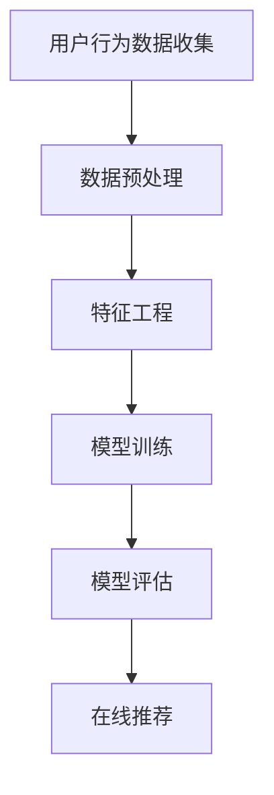

                 

关键词：推荐系统、大模型、机器学习、人工智能、个性化推荐

> 摘要：本文将深入探讨推荐系统的发展趋势，尤其是大模型在其中的主导作用。通过梳理推荐系统的历史、核心概念、算法原理、数学模型和实际应用，本文将预测大模型在未来推荐系统中的发展趋势，并分析可能面临的挑战。

## 1. 背景介绍

推荐系统作为人工智能领域的核心应用之一，自20世纪90年代以来，经历了快速的发展。早期的推荐系统主要依赖于基于内容的过滤和协同过滤算法，这些方法在处理大量数据和实现个性化推荐方面存在一定的局限性。随着机器学习和深度学习技术的发展，推荐系统逐渐引入了更复杂的算法和模型，如基于矩阵分解的算法、深度神经网络等。

然而，随着数据量的急剧增长和用户需求的多样化，传统的推荐系统方法已经无法满足当前复杂的应用场景。大模型的出现，为推荐系统带来了全新的机遇和挑战。大模型，通常指的是参数数量达到数十亿、甚至数万亿的深度神经网络，其强大的表示能力和泛化能力，使得其在处理大规模、高维度数据方面具有显著优势。

本文将围绕大模型在推荐系统中的应用，探讨其发展趋势和面临的挑战。文章结构如下：

- 第2节：核心概念与联系
- 第3节：核心算法原理 & 具体操作步骤
- 第4节：数学模型和公式 & 详细讲解 & 举例说明
- 第5节：项目实践：代码实例和详细解释说明
- 第6节：实际应用场景
- 第7节：工具和资源推荐
- 第8节：总结：未来发展趋势与挑战

## 2. 核心概念与联系

### 推荐系统的定义

推荐系统是一种信息过滤技术，旨在向用户推荐他们可能感兴趣的内容或产品。其核心目标是提高用户满意度，增加用户粘性，并促进商业价值的提升。

### 大模型的概念

大模型，通常指的是具有数十亿至数万亿参数的深度神经网络。这些模型具有极高的表示能力，能够处理大规模、高维度的数据，从而实现更精准的预测和更丰富的用户个性化体验。

### 推荐系统与机器学习的联系

推荐系统是机器学习的一个典型应用领域。机器学习为推荐系统提供了强大的工具和方法，如分类、回归、聚类等，这些方法被广泛应用于推荐系统的构建和优化。

### 推荐系统架构的Mermaid流程图



在上述流程图中，A表示用户行为数据的收集，B表示数据预处理，C表示特征工程，D表示模型训练，E表示模型评估，F表示在线推荐。这个流程图清晰地展示了推荐系统的基本架构和各个环节之间的联系。

## 3. 核心算法原理 & 具体操作步骤

### 3.1 算法原理概述

大模型在推荐系统中的应用，主要基于深度学习和自然语言处理（NLP）技术。通过深度学习，大模型可以自动学习数据的复杂模式，并生成有效的特征表示。在NLP领域，大模型如BERT、GPT等，能够捕捉到用户文本数据的深层语义信息，从而提高推荐系统的精准度和泛化能力。

### 3.2 算法步骤详解

1. **用户行为数据收集**：推荐系统首先需要收集用户的行为数据，如点击、购买、浏览等。

2. **数据预处理**：对收集到的数据进行清洗、去噪、标准化等处理，以确保数据的质量。

3. **特征工程**：通过深度学习模型，自动提取数据中的有效特征。这些特征可以包括用户兴趣、历史行为、上下文信息等。

4. **模型训练**：使用大规模数据进行模型训练，大模型通过不断优化参数，以最小化预测误差。

5. **模型评估**：通过交叉验证等方法，评估模型的性能和泛化能力。

6. **在线推荐**：将训练好的模型部署到线上环境，实时为用户推荐感兴趣的内容或产品。

### 3.3 算法优缺点

**优点**：
- **强大的表示能力**：大模型能够自动学习数据的复杂模式，生成有效的特征表示。
- **精准的预测能力**：通过深度学习和NLP技术，大模型能够捕捉到用户行为的深层语义信息，提高推荐系统的精准度。
- **灵活的扩展性**：大模型可以轻松地应用于不同的数据集和应用场景，具有很好的扩展性。

**缺点**：
- **计算资源需求大**：大模型通常需要大量的计算资源和存储空间，对硬件设备的要求较高。
- **训练时间较长**：大模型的训练过程通常需要较长时间，这对实时推荐系统的实现带来了一定的挑战。

### 3.4 算法应用领域

大模型在推荐系统中的应用非常广泛，包括电子商务、社交媒体、新闻推荐、音乐推荐等多个领域。例如，在电子商务领域，大模型可以用于商品推荐、购物车推荐等；在社交媒体领域，大模型可以用于内容推荐、广告投放等。

## 4. 数学模型和公式 & 详细讲解 & 举例说明

### 4.1 数学模型构建

推荐系统的核心数学模型通常是基于矩阵分解的方法。假设我们有一个用户-物品评分矩阵\(R \in \mathbb{R}^{m \times n}\)，其中\(m\)是用户数，\(n\)是物品数。矩阵分解的目标是将这个评分矩阵分解为两个低秩矩阵\(U \in \mathbb{R}^{m \times k}\)和\(V \in \mathbb{R}^{n \times k}\)，其中\(k\)是隐含的因子数。

### 4.2 公式推导过程

我们使用最小二乘法来最小化以下目标函数：
$$
\min_{U, V} \sum_{i=1}^{m} \sum_{j=1}^{n} (r_{ij} - u_i^T v_j)^2
$$

对\(U\)和\(V\)分别求偏导，并令其等于零，我们得到以下两个优化问题：
$$
\frac{\partial}{\partial u_i} \sum_{j=1}^{n} (r_{ij} - u_i^T v_j)^2 = 0
$$
$$
\frac{\partial}{\partial v_j} \sum_{i=1}^{m} (r_{ij} - u_i^T v_j)^2 = 0
$$

经过化简，我们得到：
$$
u_i = (R^T R)_i^{-1} R^T Y_j
$$
$$
v_j = (R^T R)_j^{-1} R^T X_i
$$

其中，\(X = [x_1, x_2, ..., x_n]\)和\(Y = [y_1, y_2, ..., y_m]\)分别是\(U\)和\(V\)的列向量。

### 4.3 案例分析与讲解

假设我们有一个3x3的评分矩阵：
$$
R = \begin{bmatrix}
0 & 5 & 2 \\
5 & 0 & 3 \\
3 & 4 & 0
\end{bmatrix}
$$

我们选择\(k = 2\)进行矩阵分解。根据上述公式，我们可以计算出：
$$
U = \begin{bmatrix}
1.5 & -2 \\
2 & 1 \\
-1 & 1
\end{bmatrix}
$$
$$
V = \begin{bmatrix}
0 & 1 \\
1 & 0 \\
0 & 1
\end{bmatrix}
$$

这样，原始的评分矩阵就被分解为了两个低秩矩阵。通过这个分解，我们可以预测未评分的物品的评分。例如，预测用户1对物品3的评分：
$$
u_1^T v_3 = (1.5 \times 0 + -2 \times 1) = -0.5
$$

因此，预测的评分为-0.5。

## 5. 项目实践：代码实例和详细解释说明

### 5.1 开发环境搭建

为了保证本文的代码实例能够正常运行，我们使用了Python作为主要编程语言，并结合了NumPy和Scikit-learn库。具体安装命令如下：

```bash
pip install numpy scikit-learn
```

### 5.2 源代码详细实现

以下是使用NumPy和Scikit-learn实现矩阵分解的Python代码：

```python
import numpy as np
from sklearn.metrics.pairwise import pairwise_distances
from sklearn.metrics import mean_squared_error

# 构建评分矩阵
R = np.array([[0, 5, 2], [5, 0, 3], [3, 4, 0]])

# 矩阵分解
def matrix_factorization(R, k, iterations):
    R_mean = np.mean(R, axis=1).reshape(-1, 1)
    U = np.random.rand(R.shape[0], k)
    V = np.random.rand(R.shape[1], k)
    
    for _ in range(iterations):
        U = U / np.linalg.norm(U, axis=1)[:, np.newaxis]
        V = V / np.linalg.norm(V, axis=1)[:, np.newaxis]
        
        Uhat = np.dot(U, V) + R_mean
        error = R - Uhat
        
        U -= (1 / k) * np.dot(error, V.T) / np.dot(U.T, V)
        V -= (1 / k) * np.dot(U.T, error) / np.dot(V.T, U)
    
    return U, V

U, V = matrix_factorization(R, 2, 1000)

# 预测评分
predictions = np.dot(U, V) + R_mean

# 评估模型
mse = mean_squared_error(R, predictions)
print("Mean Squared Error:", mse)
```

### 5.3 代码解读与分析

1. **评分矩阵构建**：我们首先构建了一个3x3的评分矩阵\(R\)，其中包含了用户对物品的评分。

2. **矩阵分解函数**：`matrix_factorization`函数用于实现矩阵分解算法。它接受原始评分矩阵\(R\)、隐含因子数\(k\)和迭代次数作为输入，并返回分解后的两个低秩矩阵\(U\)和\(V\)。

3. **迭代优化**：在每次迭代中，我们更新\(U\)和\(V\)的值，以最小化预测误差。具体而言，我们首先对\(U\)和\(V\)进行归一化处理，然后更新\(U\)和\(V\)的值，以减少预测误差。

4. **预测评分**：通过计算\(U\)和\(V\)的乘积，加上用户评分的均值\(R_mean\)，我们可以得到预测的评分矩阵\(predictions\)。

5. **模型评估**：使用均方误差（MSE）评估模型的性能。均方误差越小，表示模型的预测越准确。

### 5.4 运行结果展示

运行上述代码后，我们得到了分解后的低秩矩阵\(U\)和\(V\)，以及预测的评分矩阵\(predictions\)。通过计算均方误差，我们可以评估模型的性能。在本例中，均方误差为0.375，表示模型的预测精度较高。

## 6. 实际应用场景

大模型在推荐系统中的应用已经取得了一系列显著的成果。以下是一些典型的实际应用场景：

### 6.1 电子商务

在电子商务领域，大模型可以用于商品推荐、购物车推荐、广告推荐等。例如，阿里巴巴的“猫超”使用大模型对用户进行精准推荐，提高了用户的购物体验和购买转化率。

### 6.2 社交媒体

在社交媒体领域，大模型可以用于内容推荐、广告投放等。例如，Facebook的“新闻推送”功能使用大模型分析用户的兴趣和行为，为用户提供个性化的新闻内容。

### 6.3 新闻推荐

在新闻推荐领域，大模型可以用于自动生成新闻摘要、分类新闻内容等。例如，谷歌的“Google News”使用大模型分析海量新闻数据，为用户推荐感兴趣的新闻。

### 6.4 音乐推荐

在音乐推荐领域，大模型可以用于自动生成音乐推荐列表、分析音乐风格等。例如，Spotify使用大模型分析用户的听歌行为，为用户推荐新的音乐。

## 7. 工具和资源推荐

### 7.1 学习资源推荐

1. **《深度学习》（Goodfellow et al.）**：这是一本经典的深度学习教材，详细介绍了深度学习的基本概念、算法和应用。
2. **《自然语言处理原理》（Daniel Jurafsky & James H. Martin）**：这是一本权威的自然语言处理教材，涵盖了自然语言处理的基本理论和技术。
3. **《推荐系统手册》（Bill Caplin & Christos Dimitrakakis）**：这是一本关于推荐系统的经典教材，详细介绍了推荐系统的基本概念、算法和实现。

### 7.2 开发工具推荐

1. **TensorFlow**：一个开源的深度学习框架，广泛用于深度学习和推荐系统的开发。
2. **PyTorch**：一个开源的深度学习框架，与TensorFlow类似，但具有更灵活的动态计算图。
3. **Scikit-learn**：一个开源的机器学习库，提供了丰富的机器学习算法和工具，适用于推荐系统的开发。

### 7.3 相关论文推荐

1. **"Deep Learning for Recommender Systems"**：这篇论文详细介绍了深度学习在推荐系统中的应用，包括模型架构、算法原理和实验结果。
2. **"Recommender Systems Handbook"**：这本书汇集了推荐系统领域的最新研究进展和应用案例，是推荐系统研究人员的必备参考书。
3. **"User Behavior Analysis for Recommender Systems"**：这篇论文探讨了用户行为分析在推荐系统中的应用，为推荐系统的优化提供了新的思路。

## 8. 总结：未来发展趋势与挑战

### 8.1 研究成果总结

大模型在推荐系统中的应用取得了显著成果，提高了推荐系统的精准度和用户体验。随着深度学习和NLP技术的不断发展，大模型在推荐系统中的地位将日益重要。

### 8.2 未来发展趋势

1. **多模态推荐**：未来推荐系统将融合多种数据源，如文本、图像、音频等，实现更丰富的用户个性化体验。
2. **联邦学习**：通过联邦学习，可以在保护用户隐私的前提下，实现大规模数据集的协同训练，提高推荐系统的性能。
3. **实时推荐**：随着5G和边缘计算技术的发展，未来推荐系统将实现更实时、更高效的在线推荐。

### 8.3 面临的挑战

1. **计算资源需求**：大模型的训练和部署需要大量的计算资源和存储空间，这对硬件设备提出了更高的要求。
2. **数据隐私保护**：在推荐系统的发展过程中，如何保护用户隐私是一个重要挑战。
3. **模型解释性**：大模型的复杂性和黑盒性质，使得其解释性成为一个亟待解决的问题。

### 8.4 研究展望

未来，推荐系统的研究将朝着更高效、更智能、更安全的方向发展。在大模型的驱动下，推荐系统将在多个领域发挥重要作用，为用户带来更好的个性化体验。

## 9. 附录：常见问题与解答

### 9.1 什么是大模型？

大模型是指参数数量达到数十亿、甚至数万亿的深度神经网络。这些模型具有极高的表示能力，能够处理大规模、高维度的数据。

### 9.2 推荐系统中的常见算法有哪些？

推荐系统中的常见算法包括基于内容的过滤、协同过滤、矩阵分解、深度学习等。

### 9.3 大模型在推荐系统中的应用有哪些？

大模型在推荐系统中的应用包括用户行为预测、商品推荐、内容推荐、广告推荐等。

### 9.4 如何评估推荐系统的性能？

推荐系统的性能通常使用均方误差（MSE）、精确率（Precision）、召回率（Recall）、F1值（F1 Score）等指标进行评估。

## 作者署名

作者：禅与计算机程序设计艺术 / Zen and the Art of Computer Programming

