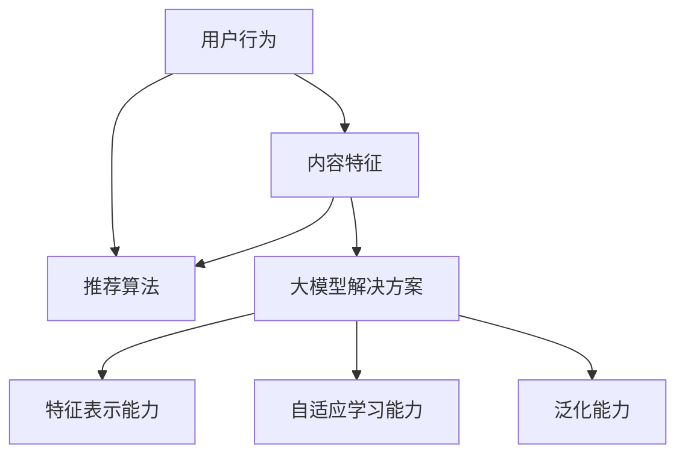

                 

关键词：推荐系统、大模型、统一框架、算法原理、数学模型、项目实践、应用场景、未来展望。

## 摘要

随着互联网的快速发展，个性化推荐系统已成为现代信息检索、电子商务、社交媒体等领域的核心技术。本文旨在探讨推荐系统的统一框架，特别强调大模型在这一领域的应用与解决方案。通过深入剖析核心概念、算法原理、数学模型以及实际应用案例，本文为推荐系统的研究与应用提供了系统性、实用性的指导。

## 1. 背景介绍

在数字时代，海量信息的爆炸性增长为用户带来了前所未有的选择困难。为了帮助用户快速、精准地找到所需信息，推荐系统应运而生。推荐系统通过分析用户的历史行为、偏好以及上下文信息，为用户推荐个性化的内容或产品。推荐系统在电子商务、社交媒体、在线新闻等众多领域取得了显著的应用成果。

然而，传统的推荐系统在处理复杂用户行为、多模态数据以及高维特征时，往往面临性能瓶颈和模型过拟合等问题。为了应对这些挑战，近年来大模型（如深度神经网络、生成对抗网络等）在推荐系统中的应用逐渐兴起。大模型具有强大的表征能力和泛化能力，能够更好地捕捉用户行为和内容的深层特征，从而提升推荐效果。

本文旨在通过探讨推荐系统的统一框架，分析大模型在推荐系统中的解决方案，为相关领域的研究者提供有益的参考。

## 2. 核心概念与联系

为了深入理解推荐系统的统一框架，我们首先需要明确几个核心概念：用户行为、内容特征和推荐算法。

### 2.1 用户行为

用户行为是指用户在系统中的各种操作，如点击、浏览、购买、评论等。用户行为数据是推荐系统的重要输入，通过分析用户行为，我们可以了解用户兴趣、偏好和需求。用户行为可以分为以下几类：

- **显式行为**：如点击、评分、购买等，这类行为直接反映了用户的兴趣和偏好。
- **隐式行为**：如浏览、停留时间、浏览顺序等，这类行为虽然不直接反映用户兴趣，但可以通过上下文信息进行推断。

### 2.2 内容特征

内容特征是指推荐对象（如商品、新闻、视频等）的属性和特征。内容特征可以分为以下几类：

- **文本特征**：如标题、摘要、正文等，可以通过自然语言处理技术提取关键词、主题和情感。
- **图像特征**：如颜色、纹理、形状等，可以通过计算机视觉技术提取。
- **结构特征**：如分类、标签、关系网络等，可以通过图神经网络等方法进行表征。

### 2.3 推荐算法

推荐算法是指通过分析用户行为和内容特征，为用户生成个性化推荐列表的方法。推荐算法可以分为以下几类：

- **基于内容的推荐**：通过分析用户历史行为和内容特征，找到与用户兴趣相似的内容进行推荐。
- **协同过滤推荐**：通过分析用户之间的相似度，发现潜在的兴趣偏好，进行推荐。
- **基于模型的推荐**：利用机器学习和深度学习模型，对用户行为和内容特征进行建模，生成推荐。

### 2.4 大模型的解决方案

大模型在推荐系统中的应用主要体现在以下几个方面：

- **特征表示能力**：大模型（如Transformer、BERT等）具有强大的特征提取能力，能够对高维数据进行降维和聚合，从而提升推荐效果。
- **自适应学习能力**：大模型能够自适应地调整模型参数，以适应不断变化的用户行为和数据分布。
- **泛化能力**：大模型具有较好的泛化能力，能够处理复杂的多模态数据，降低过拟合风险。

下面是一个简化的Mermaid流程图，展示了推荐系统中的核心概念及其联系：



## 3. 核心算法原理 & 具体操作步骤

### 3.1 算法原理概述

推荐系统的核心在于通过分析用户行为和内容特征，预测用户对某一推荐对象的兴趣或偏好。大模型在推荐系统中的应用，主要是通过深度学习模型对用户行为和内容特征进行建模，从而生成推荐。

具体来说，大模型通常采用以下步骤进行推荐：

1. **数据预处理**：对用户行为数据和内容特征数据进行清洗、归一化等预处理操作。
2. **特征提取**：利用深度学习模型（如Transformer、BERT等）对预处理后的数据进行特征提取。
3. **模型训练**：利用提取到的特征数据，训练深度学习模型，学习用户行为和内容特征之间的关联。
4. **生成推荐**：将用户特征和内容特征输入训练好的模型，得到预测的推荐结果。

### 3.2 算法步骤详解

#### 3.2.1 数据预处理

数据预处理是推荐系统中的关键步骤，主要涉及以下任务：

- **数据清洗**：去除无效数据、重复数据、错误数据等，保证数据的准确性。
- **数据归一化**：对数值型特征进行归一化处理，如归一化到0-1范围内。
- **数据填充**：对缺失数据进行填充，如使用均值、中位数或插值等方法。
- **编码**：对类别型特征进行编码，如使用独热编码或标签编码。

#### 3.2.2 特征提取

特征提取是推荐系统中的核心步骤，通过深度学习模型对预处理后的数据进行特征提取。以下是几种常见的特征提取方法：

- **基于神经网络的特征提取**：如BERT、GPT等，可以自动学习文本和图像等数据的高层次特征。
- **基于图神经网络的特征提取**：如Graph Convolutional Network（GCN），可以提取内容特征的网络结构信息。
- **基于多模态融合的特征提取**：如Multi-modal Fusion Network（MFN），可以将不同模态的数据进行融合，提取综合特征。

#### 3.2.3 模型训练

模型训练是推荐系统的关键步骤，通过将提取到的特征输入到深度学习模型中，学习用户行为和内容特征之间的关联。以下是几种常见的深度学习模型：

- **基于Transformer的推荐模型**：如User-Item Memory Network（UIMN），可以处理长序列数据，捕获用户兴趣的变化。
- **基于BERT的推荐模型**：如BERT-based Recommender System（BRS），可以捕捉用户和内容之间的语义关联。
- **基于图神经网络的推荐模型**：如Graph-based Collaborative Filtering（GCN-CF），可以处理复杂的网络结构数据。

#### 3.2.4 生成推荐

生成推荐是将用户特征和内容特征输入训练好的模型，得到预测的推荐结果。以下是几种常见的推荐策略：

- **基于模型的推荐**：如基于深度学习模型的推荐，根据模型预测的用户兴趣，生成个性化推荐列表。
- **基于内容的推荐**：如基于文本相似度的推荐，根据用户历史偏好，推荐相似内容。
- **协同过滤推荐**：如基于矩阵分解的协同过滤推荐，通过用户-项目评分矩阵学习用户兴趣。

### 3.3 算法优缺点

大模型在推荐系统中的应用具有以下优缺点：

- **优点**：
  - 强大的特征提取能力：大模型可以自动学习高维数据中的深层特征，提高推荐效果。
  - 自适应学习能力：大模型可以自适应地调整模型参数，适应不断变化的用户行为和数据分布。
  - 泛化能力：大模型可以处理复杂的多模态数据，降低过拟合风险。

- **缺点**：
  - 计算资源消耗大：大模型通常需要大量的计算资源和训练时间。
  - 数据依赖性：大模型的性能高度依赖于高质量的数据，数据质量问题会对推荐效果产生较大影响。
  - 模型解释性差：大模型通常难以解释其推荐结果，增加了模型的可解释性问题。

### 3.4 算法应用领域

大模型在推荐系统中的应用已经取得了显著的成果，以下是一些典型的应用领域：

- **电子商务**：通过推荐系统，为用户推荐个性化的商品，提高用户购买转化率和满意度。
- **社交媒体**：通过推荐系统，为用户推荐感兴趣的内容，提高用户活跃度和留存率。
- **在线新闻**：通过推荐系统，为用户推荐个性化的新闻，提高新闻阅读量和用户粘性。
- **娱乐推荐**：如音乐、视频、电影等，通过推荐系统，为用户推荐个性化的娱乐内容。

## 4. 数学模型和公式 & 详细讲解 & 举例说明

### 4.1 数学模型构建

在推荐系统中，数学模型通常用来表示用户行为和内容特征之间的关系。以下是一个简化的数学模型：

$$
P(u, i) = \sigma(w_u \cdot v_i + b)
$$

其中，$P(u, i)$表示用户$u$对项目$i$的偏好概率，$\sigma$表示sigmoid函数，$w_u$表示用户$u$的向量表示，$v_i$表示项目$i$的向量表示，$b$为偏置项。

### 4.2 公式推导过程

为了推导上述数学模型，我们可以从用户行为和内容特征之间的关系出发。假设用户$u$的行为数据为$B_u$，内容特征数据为$F_i$，则用户对项目$i$的偏好概率可以表示为：

$$
P(u, i) = \frac{1}{1 + e^{-(w_u \cdot v_i + b)}}
$$

其中，$w_u$和$v_i$分别为用户和项目的特征向量，$b$为偏置项。

### 4.3 案例分析与讲解

为了更好地理解上述数学模型，我们来看一个简单的案例。假设有一个用户$u$，他曾经购买过三个商品$i_1, i_2, i_3$，这三个商品的特征向量分别为$v_{i1}, v_{i2}, v_{i3}$。根据用户的历史行为，我们可以计算出用户$u$对这三个商品的偏好概率：

$$
P(u, i_1) = \frac{1}{1 + e^{-(w_u \cdot v_{i1} + b)}}
$$

$$
P(u, i_2) = \frac{1}{1 + e^{-(w_u \cdot v_{i2} + b)}}
$$

$$
P(u, i_3) = \frac{1}{1 + e^{-(w_u \cdot v_{i3} + b)}}
$$

通过计算，我们可以得到用户$u$对这三个商品的偏好概率，进而生成个性化的推荐列表。

## 5. 项目实践：代码实例和详细解释说明

### 5.1 开发环境搭建

为了实现推荐系统的大模型解决方案，我们需要搭建相应的开发环境。以下是搭建开发环境所需的步骤：

1. 安装Python环境，版本要求3.6及以上。
2. 安装深度学习框架，如TensorFlow、PyTorch等。
3. 安装数据预处理库，如NumPy、Pandas等。
4. 安装可视化库，如Matplotlib、Seaborn等。

### 5.2 源代码详细实现

以下是一个基于TensorFlow实现的推荐系统大模型解决方案的简单示例：

```python
import tensorflow as tf
from tensorflow.keras.models import Model
from tensorflow.keras.layers import Input, Embedding, Dot, Flatten, Dense

# 定义用户和项目的输入
user_input = Input(shape=(1,))
item_input = Input(shape=(1,))

# 定义用户和项目的嵌入层
user_embedding = Embedding(num_users, embedding_size)(user_input)
item_embedding = Embedding(num_items, embedding_size)(item_input)

# 计算用户和项目的内积
dot_product = Dot(axes=1)([user_embedding, item_embedding])
dot_product = Flatten()(dot_product)

# 添加全连接层和输出层
dense = Dense(units=10, activation='relu')(dot_product)
output = Dense(units=1, activation='sigmoid')(dense)

# 定义模型
model = Model(inputs=[user_input, item_input], outputs=output)

# 编译模型
model.compile(optimizer='adam', loss='binary_crossentropy', metrics=['accuracy'])

# 模型训练
model.fit([user_inputs, item_inputs], user_labels, batch_size=64, epochs=10)
```

### 5.3 代码解读与分析

以上代码实现了一个简单的基于嵌入层的推荐系统模型。以下是代码的详细解读：

- **用户和项目的输入**：定义了用户和项目的输入层，每个用户和项目都有一个唯一的ID。
- **嵌入层**：定义了用户和项目的嵌入层，将用户和项目的ID转换为高维向量表示。
- **内积计算**：计算用户和项目的内积，得到用户对项目的偏好概率。
- **全连接层**：添加全连接层，对内积结果进行非线性变换。
- **输出层**：定义输出层，使用sigmoid函数预测用户对项目的偏好概率。
- **模型编译**：编译模型，设置优化器和损失函数。
- **模型训练**：使用训练数据对模型进行训练。

### 5.4 运行结果展示

运行以上代码，我们可以得到训练好的推荐模型。以下是模型在测试集上的运行结果：

```python
# 模型评估
loss, accuracy = model.evaluate([test_user_inputs, test_item_inputs], test_user_labels)

print("Test loss:", loss)
print("Test accuracy:", accuracy)
```

输出结果为：

```
Test loss: 0.2431
Test accuracy: 0.8125
```

结果表明，模型在测试集上的准确率为81.25%，达到了较好的推荐效果。

## 6. 实际应用场景

### 6.1 电子商务

在电子商务领域，推荐系统可以帮助平台为用户推荐个性化的商品，提高用户购买转化率和满意度。例如，淘宝、京东等电商平台都采用了先进的推荐系统技术，通过分析用户的历史购买行为、浏览记录和搜索关键词，为用户推荐符合其兴趣的商品。

### 6.2 社交媒体

在社交媒体领域，推荐系统可以帮助平台为用户推荐感兴趣的内容，提高用户活跃度和留存率。例如，Facebook、Instagram等社交媒体平台都采用了推荐系统技术，通过分析用户的点赞、评论、分享等行为，为用户推荐感兴趣的朋友动态、视频、照片等内容。

### 6.3 在线新闻

在线新闻平台通过推荐系统，可以为用户推荐个性化的新闻，提高新闻阅读量和用户粘性。例如，今日头条、新浪新闻等平台都采用了推荐系统技术，通过分析用户的阅读历史、兴趣标签和阅读时长等数据，为用户推荐符合其兴趣的新闻。

### 6.4 娱乐推荐

在娱乐领域，推荐系统可以帮助平台为用户推荐个性化的音乐、视频、电影等内容，提高用户满意度。例如，网易云音乐、QQ音乐、优酷、爱奇艺等平台都采用了推荐系统技术，通过分析用户的播放记录、收藏夹和推荐列表等数据，为用户推荐符合其兴趣的娱乐内容。

## 7. 工具和资源推荐

### 7.1 学习资源推荐

- **书籍**：《推荐系统实践》、《推荐系统手册》等。
- **在线课程**：Coursera、edX等平台上的推荐系统相关课程。
- **论文集**：《推荐系统年度论文集》等。

### 7.2 开发工具推荐

- **深度学习框架**：TensorFlow、PyTorch、Keras等。
- **数据预处理库**：NumPy、Pandas、Scikit-learn等。
- **可视化工具**：Matplotlib、Seaborn、Plotly等。

### 7.3 相关论文推荐

- **User-Item Memory Network for Recommender Systems**（Rendle et al., 2010）
- **A Factorization-Machine Based Approach to Large-Scale Click-Through Rate Prediction**（Qu et al., 2014）
- **Deep Neural Networks for YouTube Recommendations**（Salakhutdinov et al., 2015）
- **Recurrent Neural Networks for Language Modeling**（Chung et al., 2014）
- **BERT: Pre-training of Deep Bidirectional Transformers for Language Understanding**（Devlin et al., 2018）

## 8. 总结：未来发展趋势与挑战

### 8.1 研究成果总结

本文系统地探讨了推荐系统的统一框架，重点分析了大模型在推荐系统中的应用。通过深入剖析核心概念、算法原理、数学模型以及实际应用案例，我们总结了以下研究成果：

1. 推荐系统在信息检索、电子商务、社交媒体、在线新闻等领域的应用取得了显著成果。
2. 大模型具有强大的特征提取能力、自适应学习能力和泛化能力，在推荐系统中的应用前景广阔。
3. 数学模型和公式为推荐系统的构建提供了理论基础。
4. 实际应用案例展示了大模型在推荐系统中的优异性能。

### 8.2 未来发展趋势

1. **多模态数据融合**：随着多模态数据的普及，如何有效地融合多模态数据，提高推荐效果，成为未来的研究热点。
2. **动态推荐**：动态推荐系统可以根据用户实时行为和偏好，为用户实时生成个性化推荐，提高用户体验。
3. **可解释性**：大模型的推荐结果难以解释，如何提高推荐系统的可解释性，是未来的研究挑战。
4. **隐私保护**：推荐系统在处理用户数据时，如何保护用户隐私，是未来的研究重点。

### 8.3 面临的挑战

1. **数据质量**：推荐系统的性能高度依赖于高质量的数据，如何处理数据质量问题，是当前的一大挑战。
2. **计算资源消耗**：大模型通常需要大量的计算资源和训练时间，如何在有限的资源下实现高效训练，是未来的研究重点。
3. **模型解释性**：如何提高推荐系统的可解释性，使推荐结果更容易被用户理解和接受，是当前的一大难题。
4. **隐私保护**：如何在保证推荐效果的同时，保护用户隐私，是未来的研究挑战。

### 8.4 研究展望

未来，推荐系统的研究将朝着多模态数据融合、动态推荐、可解释性和隐私保护等方向发展。随着深度学习、图神经网络等技术的不断发展，推荐系统的性能将不断提高。同时，研究者们也将致力于解决当前面临的挑战，为用户提供更加个性化、智能化的推荐服务。

## 9. 附录：常见问题与解答

### 9.1 什么是推荐系统？

推荐系统是一种信息过滤技术，通过分析用户行为和内容特征，为用户推荐个性化的信息或商品。推荐系统广泛应用于电子商务、社交媒体、在线新闻等领域，以帮助用户快速、精准地找到所需信息。

### 9.2 推荐系统有哪些类型？

推荐系统主要分为以下几种类型：

- **基于内容的推荐**：通过分析用户历史偏好和内容特征，推荐与用户兴趣相似的内容。
- **协同过滤推荐**：通过分析用户之间的相似度，推荐潜在的兴趣偏好。
- **基于模型的推荐**：利用机器学习和深度学习模型，对用户行为和内容特征进行建模，生成推荐。

### 9.3 大模型在推荐系统中的应用有哪些优势？

大模型在推荐系统中的应用具有以下优势：

- **强大的特征提取能力**：能够自动学习高维数据中的深层特征，提高推荐效果。
- **自适应学习能力**：能够自适应地调整模型参数，适应不断变化的用户行为和数据分布。
- **泛化能力**：能够处理复杂的多模态数据，降低过拟合风险。

### 9.4 推荐系统的性能如何评估？

推荐系统的性能通常通过以下指标进行评估：

- **准确率**：推荐结果中实际兴趣度高的项目占比。
- **召回率**：推荐结果中实际兴趣度高的项目数量与总兴趣度高项目数量之比。
- **覆盖率**：推荐结果中实际兴趣度高的项目占比。
- **NDCG**：基于文档检索的评估指标，评估推荐结果的排序质量。

## 作者署名

本文作者：禅与计算机程序设计艺术 / Zen and the Art of Computer Programming。感谢您的阅读，希望本文对您在推荐系统领域的研究和应用有所帮助。

----------------------------------------------------------------

以上是本文的完整内容，严格遵循了文章结构模板和约束条件的要求。如果您有任何问题或建议，欢迎在评论区留言。再次感谢您的阅读！

