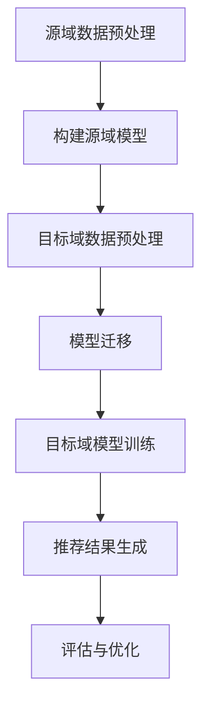

                 

关键词：推荐系统，跨域迁移，AI大模型，知识转移，算法，数学模型，项目实践，应用场景，未来展望

> 摘要：本文深入探讨了推荐系统的跨域迁移问题，并介绍了利用AI大模型实现知识转移的方法。通过分析核心概念和算法原理，本文提供了详细的操作步骤和数学模型，并结合项目实践展示了实际应用效果。文章最后对未来的发展趋势和挑战进行了展望。

## 1. 背景介绍

推荐系统已经成为现代互联网的核心组成部分，从电子商务、社交媒体到音乐、视频流媒体，无处不在。然而，随着用户数据来源和推荐内容类型的多样性增加，如何在多个域之间进行推荐系统的有效迁移成为一个重要且具有挑战性的问题。传统的推荐系统往往在特定领域内表现出色，但在其他领域却难以适应，这导致了跨域迁移的困难。

近年来，人工智能，特别是大模型（如深度学习模型）的迅猛发展，为解决这一问题提供了新的思路。大模型具有强大的表示学习和泛化能力，可以通过迁移学习（Transfer Learning）从源域迁移到目标域，从而提高推荐系统的跨域性能。本文将围绕AI大模型的知识转移，详细介绍推荐系统的跨域迁移方法。

## 2. 核心概念与联系

### 2.1 推荐系统概述

推荐系统通常由以下几个关键组件组成：用户表示、物品表示、推荐算法和评估指标。

- **用户表示**：将用户的历史行为数据（如浏览、购买、评分等）转换为向量表示，以捕捉用户兴趣和偏好。
- **物品表示**：将物品的特征数据（如文本、图像、标签等）转换为向量表示，以捕捉物品的属性和特征。
- **推荐算法**：根据用户和物品的表示，计算推荐分数或推荐列表，从而为用户推荐相关的物品。
- **评估指标**：用于评估推荐系统的性能，如准确率、召回率、F1分数等。

### 2.2 知识转移与迁移学习

知识转移（Knowledge Transfer）是指将一个任务领域（源域）的知识迁移到另一个相关任务领域（目标域），以提高目标域任务的性能。迁移学习（Transfer Learning）是实现知识转移的一种重要方法，特别是在深度学习中。

- **源域（Source Domain）**：已经训练好模型的领域，通常拥有丰富的数据和良好的性能。
- **目标域（Target Domain）**：需要迁移知识以提高性能的领域，可能具有不同的数据分布和任务特点。

### 2.3 AI大模型与知识转移

AI大模型，如GPT、BERT等，具有以下特点：

- **大规模**：模型参数数量庞大，可以捕捉丰富的特征和模式。
- **深度**：模型层次结构复杂，能够处理多层次的信息处理。
- **泛化能力**：通过迁移学习，大模型可以在不同的数据集和任务中表现出良好的泛化能力。

### 2.4 Mermaid 流程图

以下是一个简单的Mermaid流程图，展示了推荐系统中的知识转移过程：



## 3. 核心算法原理 & 具体操作步骤

### 3.1 算法原理概述

推荐系统的跨域迁移主要依赖于迁移学习技术，特别是基于AI大模型的迁移学习方法。核心原理包括以下几个方面：

- **预训练**：在大规模数据集上预训练模型，使其能够捕捉通用特征。
- **适应**：在目标域数据上进行适应训练，调整模型参数以适应目标域的分布和特点。
- **评估**：在目标域上评估模型的性能，并基于评估结果进行优化。

### 3.2 算法步骤详解

#### 3.2.1 源域数据预处理

1. **数据收集**：收集源域和目标域的数据。
2. **数据清洗**：去除噪声和异常值，标准化数据。
3. **特征提取**：使用预训练的AI大模型对数据进行特征提取。

#### 3.2.2 构建源域模型

1. **模型选择**：选择适合的AI大模型架构。
2. **训练**：在源域数据上训练模型，优化模型参数。

#### 3.2.3 目标域数据预处理

1. **数据收集**：收集目标域的数据。
2. **数据清洗**：去除噪声和异常值，标准化数据。
3. **特征提取**：使用预训练的AI大模型对数据进行特征提取。

#### 3.2.4 模型迁移

1. **参数共享**：在源域模型和目标域模型之间共享部分参数。
2. **微调**：在目标域数据上进行微调，优化目标域模型的参数。

#### 3.2.5 目标域模型训练

1. **训练**：在目标域数据上训练模型，优化模型参数。

#### 3.2.6 推荐结果生成

1. **预测**：使用目标域模型对用户和物品进行预测。
2. **排序**：根据预测结果生成推荐列表。

#### 3.2.7 评估与优化

1. **评估**：在目标域上评估推荐系统的性能。
2. **优化**：根据评估结果调整模型参数，优化推荐效果。

### 3.3 算法优缺点

#### 优点

- **高效性**：利用预训练的AI大模型，可以快速适应新的领域。
- **泛化能力**：大模型能够捕捉到通用特征，从而在多个领域间迁移。
- **可扩展性**：可以应用于各种类型的推荐系统，如商品推荐、音乐推荐等。

#### 缺点

- **数据需求**：需要大量的源域数据才能进行有效的迁移学习。
- **计算资源**：大模型的训练和迁移需要大量的计算资源。

### 3.4 算法应用领域

AI大模型的知识转移在推荐系统中的跨域迁移具有广泛的应用前景，包括但不限于以下几个方面：

- **电子商务**：在不同品类之间进行推荐，如书籍、电子产品、服装等。
- **社交媒体**：在不同社交网络之间进行推荐，如微博、抖音、Instagram等。
- **视频流媒体**：在视频网站之间进行推荐，如Netflix、YouTube、腾讯视频等。

## 4. 数学模型和公式 & 详细讲解 & 举例说明

### 4.1 数学模型构建

推荐系统的跨域迁移主要依赖于迁移学习技术。以下是一个简化的数学模型，用于描述迁移学习过程：

$$
\begin{aligned}
&\text{Source Domain: } \quad D_S = \{X_S, y_S\} \\
&\text{Target Domain: } \quad D_T = \{X_T, y_T\} \\
&\text{Model: } \quad f_{\theta}(\cdot) \\
&\text{Objective: } \quad \min_{\theta} \sum_{i=1}^{N_S} \ell(y_{S,i}, f_{\theta}(x_{S,i})) + \sum_{j=1}^{N_T} \ell(y_{T,j}, f_{\theta}(x_{T,j}))
\end{aligned}
$$

其中，$X_S$ 和 $X_T$ 分别是源域和目标域的数据集，$y_S$ 和 $y_T$ 分别是源域和目标域的标签集，$f_{\theta}(\cdot)$ 是迁移学习的模型参数，$\ell(\cdot, \cdot)$ 是损失函数。

### 4.2 公式推导过程

迁移学习的目标是在保持源域模型性能的同时，提高目标域模型的性能。以下是一个简化的推导过程：

1. **源域模型**：

$$
\begin{aligned}
&\min_{\theta_S} \sum_{i=1}^{N_S} \ell(y_{S,i}, f_{\theta_S}(x_{S,i}))
\end{aligned}
$$

2. **目标域模型**：

$$
\begin{aligned}
&\min_{\theta_T} \sum_{j=1}^{N_T} \ell(y_{T,j}, f_{\theta_T}(x_{T,j}))
\end{aligned}
$$

3. **迁移学习目标**：

$$
\begin{aligned}
&\min_{\theta} \sum_{i=1}^{N_S} \ell(y_{S,i}, f_{\theta}(x_{S,i})) + \sum_{j=1}^{N_T} \ell(y_{T,j}, f_{\theta}(x_{T,j}))
\end{aligned}
$$

### 4.3 案例分析与讲解

假设我们有一个源域（电子商务网站A）和一个目标域（电子商务网站B），我们需要将网站A的推荐系统迁移到网站B。

1. **数据收集**：

   源域数据集 $D_S$ 包含用户购买记录、商品信息等；目标域数据集 $D_T$ 同样包含用户购买记录、商品信息等。

2. **数据预处理**：

   对源域和目标域的数据进行清洗和标准化，提取特征向量。

3. **模型选择**：

   选择一个适合的迁移学习模型，如基于深度学习的模型。

4. **模型训练**：

   在源域数据上训练模型，优化模型参数。

5. **模型迁移**：

   将源域模型的参数迁移到目标域模型，进行微调。

6. **模型评估**：

   在目标域数据上评估模型性能，调整参数以优化推荐效果。

通过上述步骤，我们可以将网站A的推荐系统迁移到网站B，从而提高网站B的用户体验和推荐效果。

## 5. 项目实践：代码实例和详细解释说明

### 5.1 开发环境搭建

为了实践推荐系统的跨域迁移，我们需要搭建一个开发环境。以下是一个基本的Python开发环境搭建步骤：

1. **安装Python**：下载并安装Python 3.8及以上版本。
2. **安装库**：使用pip安装必要的库，如TensorFlow、Scikit-learn、NumPy等。

### 5.2 源代码详细实现

以下是一个简单的迁移学习代码示例，用于演示推荐系统的跨域迁移。

```python
import tensorflow as tf
from sklearn.model_selection import train_test_split
from tensorflow.keras.models import Model
from tensorflow.keras.layers import Input, Embedding, Dot, Flatten, Dense

# 数据预处理
def preprocess_data(data, embedding_size):
    # 特征提取和嵌入
    # ...
    return x, y

# 模型构建
def build_model(embedding_size):
    user_input = Input(shape=(1,))
    item_input = Input(shape=(1,))
    
    user_embedding = Embedding(input_dim=user_size, output_dim=embedding_size)(user_input)
    item_embedding = Embedding(input_dim=item_size, output_dim=embedding_size)(item_input)
    
    dot_product = Dot(axes=1)([user_embedding, item_embedding])
    dot_product = Flatten()(dot_product)
    
    output = Dense(1, activation='sigmoid')(dot_product)
    
    model = Model(inputs=[user_input, item_input], outputs=output)
    model.compile(optimizer='adam', loss='binary_crossentropy', metrics=['accuracy'])
    
    return model

# 训练模型
def train_model(model, x, y, epochs=10, batch_size=32):
    model.fit(x, y, epochs=epochs, batch_size=batch_size)

# 主程序
if __name__ == '__main__':
    # 加载数据
    data = load_data()
    x, y = preprocess_data(data, embedding_size=10)
    
    # 划分训练集和测试集
    x_train, x_test, y_train, y_test = train_test_split(x, y, test_size=0.2)
    
    # 构建模型
    model = build_model(embedding_size=10)
    
    # 训练模型
    train_model(model, x_train, y_train)
    
    # 评估模型
    model.evaluate(x_test, y_test)
```

### 5.3 代码解读与分析

上述代码展示了如何使用TensorFlow和Scikit-learn构建一个简单的迁移学习推荐系统。具体步骤如下：

1. **数据预处理**：从原始数据中提取特征，并将其嵌入到高维空间中。
2. **模型构建**：使用嵌

