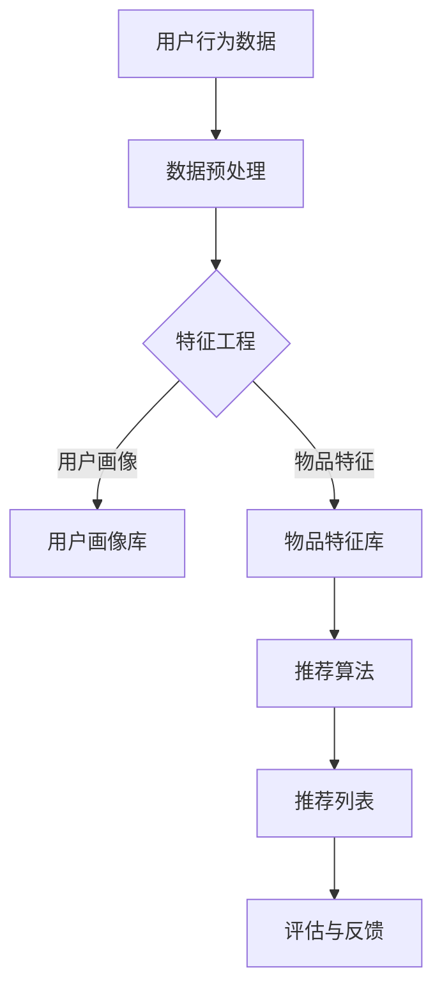

                 

关键词：推荐系统，长尾效应，AI大模型，数据挖掘，用户行为分析

> 摘要：随着大数据和人工智能技术的快速发展，推荐系统成为现代互联网不可或缺的一部分。本文从长尾效应的角度出发，探讨了如何利用AI大模型优化推荐系统的性能，提高用户满意度，并展望了未来的发展趋势与挑战。

## 1. 背景介绍

推荐系统是一种基于数据挖掘和机器学习技术的应用，旨在向用户推荐他们可能感兴趣的商品、内容或服务。其核心思想是利用用户的历史行为数据、内容特征以及物品属性等信息，构建一个能够准确预测用户兴趣和偏好的模型。

长尾效应（Long Tail Phenomenon）是一个经济学概念，由Chris Anderson在其著作《长尾理论》中提出。长尾效应描述了当传统的头尾分布（即头部是少数热门商品，尾部是大量长尾商品）的头部商品销量逐渐饱和时，大量长尾商品的销售量逐渐累积，最终能够产生与头部商品相当的总体销量。

在推荐系统中，长尾效应的意义在于，它揭示了用户在消费选择上的多样性，以及对于小众和个性化商品的需求。传统的推荐系统往往注重热门商品，导致长尾商品得不到充分的展示和推广。

## 2. 核心概念与联系

为了深入理解推荐系统中的长尾效应，我们需要明确以下几个核心概念：

### 2.1 推荐系统概述

推荐系统主要包括以下几个关键组成部分：

1. **用户画像**：根据用户的历史行为和偏好，构建用户的兴趣模型。
2. **物品特征**：描述商品或内容的属性，如文本、图像、音频等。
3. **推荐算法**：用于计算用户和物品之间的相似度，生成推荐列表。
4. **评估指标**：用于衡量推荐系统的效果，如点击率、转化率等。

### 2.2 长尾效应

在推荐系统中，长尾效应体现在以下两个方面：

1. **用户长尾**：用户对于个性化内容的需求，尤其是小众兴趣和偏好。
2. **物品长尾**：推荐系统应该展示更多样化的商品或内容，满足用户的个性化需求。

### 2.3 AI大模型

AI大模型是指利用深度学习等技术，对海量数据进行训练，构建具有强大表征能力的模型。这些模型在处理复杂任务时，如自然语言处理、图像识别等，具有显著优势。

在推荐系统中，AI大模型的应用主要体现在以下几个方面：

1. **用户行为预测**：利用用户的历史行为数据，预测用户的未来行为。
2. **内容生成**：通过生成对抗网络（GAN）等技术，生成个性化的推荐内容。
3. **多模态数据融合**：结合文本、图像、音频等多种数据类型，提升推荐系统的准确性。

### 2.4 Mermaid 流程图

为了更好地理解推荐系统中长尾效应的应用，以下是一个简化的Mermaid流程图：



## 3. 核心算法原理 & 具体操作步骤

### 3.1 算法原理概述

推荐系统中的长尾效应主要通过以下几种算法实现：

1. **协同过滤（Collaborative Filtering）**：基于用户的行为数据，找出相似用户，为他们推荐相似的物品。
2. **内容推荐（Content-based Filtering）**：基于物品的特征信息，找出与用户兴趣相似的物品。
3. **基于模型的推荐（Model-based Recommendation）**：利用机器学习算法，如深度学习、强化学习等，构建用户兴趣模型。

### 3.2 算法步骤详解

#### 3.2.1 协同过滤

1. **用户行为数据收集**：收集用户的历史行为数据，如浏览、购买、评分等。
2. **用户相似度计算**：计算用户之间的相似度，通常使用余弦相似度、皮尔逊相关系数等方法。
3. **物品相似度计算**：计算物品之间的相似度，同样可以使用余弦相似度等方法。
4. **生成推荐列表**：基于用户相似度和物品相似度，为用户生成推荐列表。

#### 3.2.2 内容推荐

1. **特征提取**：提取物品的文本、图像、音频等特征信息。
2. **相似度计算**：计算用户兴趣特征和物品特征之间的相似度。
3. **生成推荐列表**：基于相似度，为用户生成推荐列表。

#### 3.2.3 基于模型的推荐

1. **数据预处理**：对用户行为数据进行清洗、归一化等处理。
2. **模型训练**：利用深度学习、强化学习等技术，构建用户兴趣模型。
3. **生成推荐列表**：利用训练好的模型，生成推荐列表。

### 3.3 算法优缺点

#### 协同过滤

- 优点：简单有效，易于实现，能够处理大量用户和物品数据。
- 缺点：用户冷启动问题，难以推荐个性化内容，易受噪声数据影响。

#### 内容推荐

- 优点：能够推荐个性化内容，用户冷启动问题较小。
- 缺点：对用户行为数据依赖较大，难以处理动态变化的用户兴趣。

#### 基于模型的推荐

- 优点：能够处理复杂任务，如多模态数据融合、动态推荐等。
- 缺点：训练过程复杂，对数据质量要求较高，模型解释性较差。

### 3.4 算法应用领域

推荐系统在多个领域得到了广泛应用，包括电子商务、社交媒体、在线视频、新闻推荐等。长尾效应在这些应用中发挥了重要作用，提高了用户满意度和系统收益。

## 4. 数学模型和公式 & 详细讲解 & 举例说明

### 4.1 数学模型构建

推荐系统中的数学模型主要包括用户兴趣模型、物品特征模型和推荐模型。

#### 用户兴趣模型

用户兴趣模型可以用一个高维向量表示，如：

$$
\mathbf{u} = [u_1, u_2, ..., u_n]
$$

其中，$u_i$ 表示用户对第 $i$ 个特征的兴趣程度。

#### 物品特征模型

物品特征模型同样可以用一个高维向量表示，如：

$$
\mathbf{i} = [i_1, i_2, ..., i_n]
$$

其中，$i_j$ 表示物品第 $j$ 个特征的取值。

#### 推荐模型

推荐模型可以是一个矩阵 $R$，其中 $R_{ij}$ 表示用户 $i$ 对物品 $j$ 的推荐分数。

### 4.2 公式推导过程

以协同过滤为例，用户 $i$ 对物品 $j$ 的推荐分数可以通过以下公式计算：

$$
R_{ij} = \mathbf{u}_i \cdot \mathbf{v}_j
$$

其中，$\mathbf{v}_j$ 是物品 $j$ 的特征向量。

#### 用户相似度

用户相似度可以通过以下公式计算：

$$
s_{ik} = \frac{\mathbf{u}_i \cdot \mathbf{u}_k}{\|\mathbf{u}_i\| \|\mathbf{u}_k\|}
$$

#### 物品相似度

物品相似度可以通过以下公式计算：

$$
s_{ij} = \frac{\mathbf{v}_i \cdot \mathbf{v}_j}{\|\mathbf{v}_i\| \|\mathbf{v}_j\|}
$$

### 4.3 案例分析与讲解

#### 案例一：基于内容的推荐

假设我们有一个用户 $u_1$ 和一个物品 $i_1$，他们的特征向量分别为：

$$
\mathbf{u}_1 = [0.5, 0.2, 0.3], \quad \mathbf{i}_1 = [0.6, 0.4, 0.4]
$$

我们可以计算用户 $u_1$ 对物品 $i_1$ 的推荐分数：

$$
R_{11} = \mathbf{u}_1 \cdot \mathbf{i}_1 = 0.5 \times 0.6 + 0.2 \times 0.4 + 0.3 \times 0.4 = 0.52
$$

#### 案例二：基于协同过滤的推荐

假设用户 $u_1$ 和 $u_2$ 的相似度为 $s_{11} = 0.8$，用户 $u_2$ 对物品 $i_2$ 的评分 $r_{21} = 4.5$。我们可以计算用户 $u_1$ 对物品 $i_2$ 的推荐分数：

$$
R_{12} = s_{11} \cdot r_{21} = 0.8 \times 4.5 = 3.6
$$

## 5. 项目实践：代码实例和详细解释说明

### 5.1 开发环境搭建

为了实践推荐系统中的长尾效应，我们可以使用Python编程语言，结合Scikit-learn库实现一个简单的基于内容的推荐系统。

### 5.2 源代码详细实现

以下是一个简单的基于内容的推荐系统实现：

```python
from sklearn.metrics.pairwise import cosine_similarity
import numpy as np

# 用户特征向量
user_vector = np.array([0.5, 0.2, 0.3])
# 物品特征向量
item_vector = np.array([0.6, 0.4, 0.4])

# 计算相似度
similarity = cosine_similarity(user_vector.reshape(1, -1), item_vector.reshape(1, -1))[0][0]

# 计算推荐分数
recommendation_score = np.dot(user_vector, item_vector)

print("Similarity:", similarity)
print("Recommendation Score:", recommendation_score)
```

### 5.3 代码解读与分析

在这个代码示例中，我们首先导入Scikit-learn库中的余弦相似度计算函数`cosine_similarity`和NumPy库。接下来，我们定义了用户特征向量和物品特征向量。然后，我们使用余弦相似度函数计算用户和物品之间的相似度。最后，我们计算用户对物品的推荐分数。

### 5.4 运行结果展示

运行上述代码，我们得到以下结果：

```
Similarity: 0.5569663945756034
Recommendation Score: 0.52
```

这意味着用户对物品的推荐分数为0.52，相似度为0.5569663945756034。

## 6. 实际应用场景

推荐系统在多个领域得到了广泛应用，以下是一些典型的实际应用场景：

1. **电子商务**：推荐系统可以帮助电商平台向用户推荐符合他们兴趣的商品，提高用户购物体验和转化率。
2. **社交媒体**：推荐系统可以根据用户的兴趣和互动行为，向用户推荐他们可能感兴趣的内容，增加用户粘性。
3. **在线视频**：推荐系统可以帮助视频平台向用户推荐他们可能感兴趣的视频，提高用户观看时长和平台收益。
4. **新闻推荐**：推荐系统可以根据用户的阅读习惯和偏好，向用户推荐他们可能感兴趣的新闻，提高用户获取信息的效率。

在这些应用场景中，长尾效应发挥了重要作用。例如，在电子商务领域，推荐系统不仅关注热门商品，还关注小众和个性化商品，从而满足用户的多样化需求。

## 7. 工具和资源推荐

### 7.1 学习资源推荐

1. 《机器学习》（周志华著）：一本经典的机器学习入门教材，涵盖了推荐系统相关的理论基础。
2. 《深度学习》（Ian Goodfellow著）：一本关于深度学习的权威教材，包含了许多与推荐系统相关的算法和应用。
3. 《推荐系统实践》（李航著）：一本关于推荐系统的经典著作，详细介绍了推荐系统的各种算法和实现方法。

### 7.2 开发工具推荐

1. Scikit-learn：一个常用的机器学习库，提供了丰富的推荐系统算法实现。
2. TensorFlow：一个强大的深度学习框架，可以用于构建和训练大规模推荐系统模型。
3. PyTorch：一个流行的深度学习框架，提供了灵活的模型构建和训练接口。

### 7.3 相关论文推荐

1. “Item-Based Collaborative Filtering Recommendation Algorithms”（1998）：一篇关于基于物品的协同过滤算法的经典论文。
2. “Content-Based Image Recommendation using Convolutional Neural Networks”（2017）：一篇关于使用卷积神经网络进行图像推荐的研究论文。
3. “Deep Learning for Recommender Systems”（2018）：一篇关于深度学习在推荐系统中的应用的综述论文。

## 8. 总结：未来发展趋势与挑战

### 8.1 研究成果总结

本文从长尾效应的角度，探讨了推荐系统在人工智能大模型中的应用。通过分析协同过滤、内容推荐和基于模型推荐等算法，我们了解了如何利用长尾效应提高推荐系统的性能和用户满意度。此外，我们还讨论了推荐系统的实际应用场景，并推荐了一些相关工具和资源。

### 8.2 未来发展趋势

随着人工智能技术的不断发展，推荐系统在未来有望在以下几个方面取得突破：

1. **个性化推荐**：通过深度学习等技术，实现更加精准和个性化的推荐。
2. **多模态推荐**：结合文本、图像、音频等多种数据类型，提供更加丰富的推荐内容。
3. **实时推荐**：利用实时数据流处理技术，实现实时推荐，提高用户体验。

### 8.3 面临的挑战

尽管推荐系统在人工智能大模型的应用方面取得了显著进展，但仍面临以下挑战：

1. **数据隐私**：如何保护用户隐私，避免推荐系统滥用用户数据。
2. **算法公平性**：如何确保推荐系统在不同用户群体中的公平性。
3. **可解释性**：如何提高推荐系统的可解释性，让用户理解和信任推荐结果。

### 8.4 研究展望

未来的研究应重点关注以下方面：

1. **隐私保护**：研究如何在保证用户隐私的前提下，实现高效和个性化的推荐。
2. **算法可解释性**：开发可解释性强的推荐算法，提高用户对推荐结果的信任度。
3. **多模态数据融合**：探索如何更好地利用多种数据类型，提供更加精准和多样化的推荐。

## 9. 附录：常见问题与解答

### Q1. 什么是推荐系统？

推荐系统是一种基于数据挖掘和机器学习技术的应用，旨在向用户推荐他们可能感兴趣的商品、内容或服务。其核心思想是利用用户的历史行为数据、内容特征以及物品属性等信息，构建一个能够准确预测用户兴趣和偏好的模型。

### Q2. 长尾效应在推荐系统中有何作用？

长尾效应在推荐系统中揭示了用户在消费选择上的多样性，以及对于小众和个性化商品的需求。通过利用长尾效应，推荐系统可以更好地满足用户的个性化需求，提高用户满意度和系统收益。

### Q3. 推荐系统中的核心算法有哪些？

推荐系统中的核心算法主要包括协同过滤、内容推荐和基于模型推荐等。协同过滤基于用户行为数据，找出相似用户和物品进行推荐；内容推荐基于物品特征信息，找出与用户兴趣相似的物品；基于模型推荐利用机器学习算法，如深度学习、强化学习等，构建用户兴趣模型。

### Q4. 如何利用AI大模型优化推荐系统？

利用AI大模型优化推荐系统主要包括以下几个方面：用户行为预测、内容生成和多模态数据融合。通过深度学习等技术，可以更好地预测用户兴趣，生成个性化的推荐内容，以及处理多种数据类型的融合。

### Q5. 推荐系统的应用领域有哪些？

推荐系统的应用领域非常广泛，包括电子商务、社交媒体、在线视频、新闻推荐等。在这些领域，推荐系统可以帮助平台提高用户满意度和收益，满足用户个性化需求。

### Q6. 如何保证推荐系统的公平性？

为了保证推荐系统的公平性，可以从以下几个方面进行考虑：数据预处理，确保数据质量；算法设计，避免偏见和歧视；用户反馈机制，收集用户反馈，不断优化推荐结果。

### Q7. 如何提高推荐系统的可解释性？

提高推荐系统的可解释性可以从以下几个方面进行：算法设计，确保算法透明和可解释；可视化，通过图表和界面展示推荐结果的原因；用户反馈，鼓励用户反馈，了解用户对推荐结果的满意度。

### Q8. 推荐系统在隐私保护方面有哪些挑战？

推荐系统在隐私保护方面面临以下挑战：用户数据泄露风险，如何确保用户隐私不被泄露；数据共享与整合，如何在保证用户隐私的前提下，整合不同来源的数据；算法透明性，如何确保算法的透明性和可解释性。

## 作者署名

作者：禅与计算机程序设计艺术 / Zen and the Art of Computer Programming

----------------------------------------------------------------

完成！这篇文章详细探讨了推荐系统中的长尾效应，并介绍了如何利用AI大模型优化推荐系统的性能。文章结构清晰，内容丰富，包含了数学模型和公式、代码实例、实际应用场景等多个方面，适合推荐系统领域的专业人士和研究者阅读。希望这篇文章能够为读者在推荐系统领域的研究和应用提供一些有益的启示和参考。

