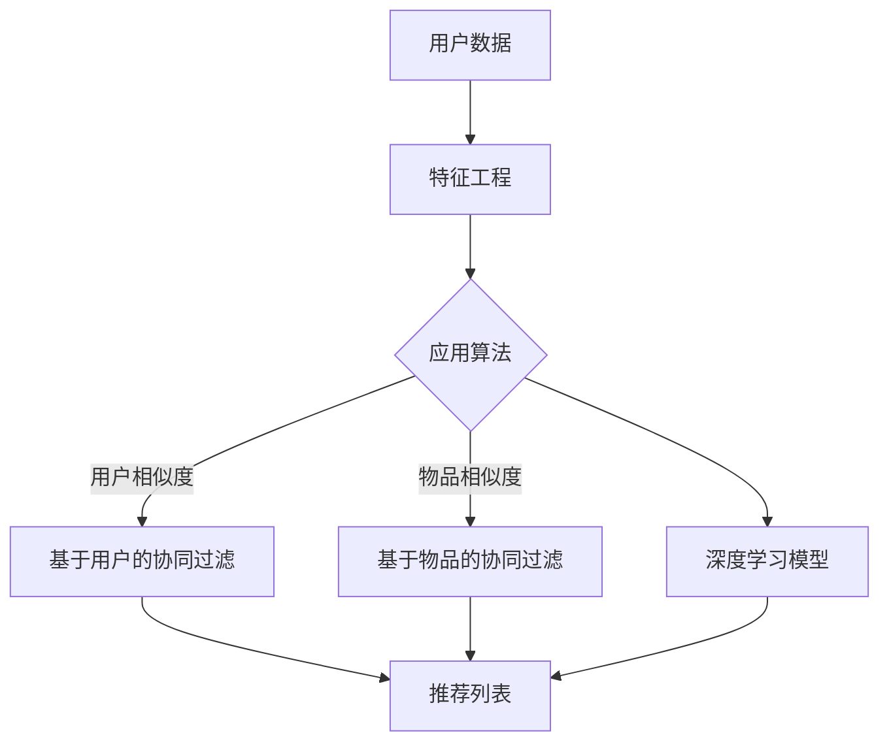

                 

 关键词：推荐系统、长期效应、AI大模型、算法原理、数学模型、项目实践、应用场景、未来展望

> 摘要：本文深入探讨推荐系统的长期效应，以及如何通过AI大模型来优化和提升推荐系统的效果。文章首先介绍了推荐系统的背景和核心概念，然后详细分析了推荐算法的原理和操作步骤，接着讲解了数学模型的构建和推导过程。文章还通过一个实际项目案例展示了推荐系统的开发和应用。最后，对推荐系统的未来应用前景进行了展望。

## 1. 背景介绍

推荐系统是一种基于用户历史行为、兴趣偏好和其他相关数据的自动决策系统，旨在为用户推荐可能感兴趣的内容、商品或服务。随着互联网的迅猛发展，推荐系统已经成为了现代电子商务、社交媒体、新闻媒体等领域的核心组成部分。推荐系统的设计目标是在海量数据中为用户提供个性化、相关性强、满意度高的推荐结果。

推荐系统的发展经历了从基于内容匹配（Content-Based Filtering）到协同过滤（Collaborative Filtering）再到现代深度学习模型的过程。传统的协同过滤方法主要分为基于用户的协同过滤（User-Based）和基于物品的协同过滤（Item-Based）。然而，这些传统方法在处理冷启动问题、噪声数据、多样性等方面存在一定的局限性。近年来，随着AI大模型的兴起，推荐系统的研究和应用取得了新的突破。

## 2. 核心概念与联系

推荐系统中的核心概念包括用户、物品、评分、推荐结果等。用户是指系统的参与个体，物品是指用户可能感兴趣的内容、商品或服务。评分是用户对物品的评价，可以是显式评分（如1-5星评分）或隐式评分（如点击、购买等行为数据）。推荐结果是指系统根据用户历史数据和物品特征生成的个性化推荐列表。

下面是推荐系统架构的Mermaid流程图：



在这个流程图中，用户数据经过特征工程后，可以应用不同的推荐算法生成推荐列表。基于用户的协同过滤和基于物品的协同过滤是传统方法，而深度学习模型则是现代方法，它们共同构成了推荐系统的核心组成部分。

## 3. 核心算法原理 & 具体操作步骤

### 3.1 算法原理概述

推荐系统的核心算法主要分为基于内容的协同过滤、基于用户的协同过滤、基于物品的协同过滤和深度学习模型。每种算法都有其独特的原理和优势。

- **基于内容的协同过滤**：根据用户对某些内容的偏好来推荐相似的内容。这种方法在处理冷启动问题和多样性方面具有优势。
- **基于用户的协同过滤**：基于用户之间的相似度来推荐其他用户喜欢的内容。这种方法在处理稀疏数据集和噪声数据方面具有优势。
- **基于物品的协同过滤**：基于物品之间的相似度来推荐其他用户可能感兴趣的内容。这种方法在处理冷启动问题和多样性方面具有优势。
- **深度学习模型**：通过神经网络模型学习用户和物品的复杂关系，生成个性化的推荐结果。这种方法在处理大规模数据和高维度特征方面具有优势。

### 3.2 算法步骤详解

下面以深度学习模型为例，详细描述其操作步骤：

1. **数据预处理**：对用户行为数据进行清洗、去重和处理，提取用户和物品的特征向量。
2. **模型选择**：选择合适的深度学习模型，如循环神经网络（RNN）、卷积神经网络（CNN）或Transformer等。
3. **模型训练**：将特征向量输入到模型中进行训练，优化模型参数。
4. **模型评估**：使用验证集评估模型性能，选择最佳模型。
5. **模型部署**：将训练好的模型部署到线上环境，生成实时推荐结果。

### 3.3 算法优缺点

- **基于内容的协同过滤**：
  - 优点：处理冷启动问题、多样性好。
  - 缺点：容易导致推荐结果过于单一，缺乏个性化。
- **基于用户的协同过滤**：
  - 优点：处理稀疏数据集、噪声数据。
  - 缺点：容易导致推荐结果过于集中，缺乏多样性。
- **基于物品的协同过滤**：
  - 优点：处理冷启动问题、多样性好。
  - 缺点：容易导致推荐结果过于集中，缺乏个性化。
- **深度学习模型**：
  - 优点：处理大规模数据、高维度特征。
  - 缺点：模型训练成本高、解释性较差。

### 3.4 算法应用领域

推荐系统广泛应用于电子商务、社交媒体、新闻媒体、视频网站等领域。例如，在电子商务领域，推荐系统可以帮助用户发现感兴趣的商品，提高购买转化率；在社交媒体领域，推荐系统可以帮助用户发现感兴趣的内容，提高用户粘性。

## 4. 数学模型和公式 & 详细讲解 & 举例说明

### 4.1 数学模型构建

在推荐系统中，常用的数学模型包括用户相似度计算、物品相似度计算和推荐公式等。

- **用户相似度计算**：基于用户历史行为数据，计算用户之间的相似度。
  $$sim(u_i, u_j) = \frac{\sum_{k \in I} w_{ik} w_{jk}}{\sqrt{\sum_{k \in I} w_{ik}^2} \sqrt{\sum_{k \in I} w_{jk}^2}}$$
  其中，$u_i$和$u_j$是两个用户，$I$是物品集合，$w_{ik}$和$w_{jk}$是用户$i$和用户$j$对物品$k$的评分。

- **物品相似度计算**：基于物品的特征向量，计算物品之间的相似度。
  $$sim(i, j) = \frac{\cos(\text{vec}(i), \text{vec}(j))}{||\text{vec}(i)|| \ ||\text{vec}(j)||}$$
  其中，$\text{vec}(i)$和$\text{vec}(j)$是物品$i$和物品$j$的特征向量。

- **推荐公式**：根据用户相似度、物品相似度和用户对物品的评分，计算用户$i$对物品$k$的评分预测。
  $$r_{ik}^{\text{pred}} = \sum_{j \in N_i} w_{ij} r_{jk}$$
  其中，$N_i$是用户$i$的邻居集合，$r_{jk}$是用户$j$对物品$k$的评分。

### 4.2 公式推导过程

- **用户相似度计算**：使用皮尔逊相关系数计算用户之间的相似度。假设用户$i$和用户$j$对物品$k$的评分为$w_{ik}$和$w_{jk}$，则用户相似度可以表示为：
  $$sim(u_i, u_j) = \frac{\sum_{k \in I} w_{ik} w_{jk} - \frac{\sum_{k \in I} w_{ik} \sum_{k \in I} w_{jk}}{\sqrt{\sum_{k \in I} w_{ik}^2} \sqrt{\sum_{k \in I} w_{jk}^2}}$$
  将分母展开，得：
  $$sim(u_i, u_j) = \frac{\sum_{k \in I} w_{ik} w_{jk}}{\sqrt{\sum_{k \in I} w_{ik}^2} \sqrt{\sum_{k \in I} w_{jk}^2}}$$

- **物品相似度计算**：使用余弦相似度计算物品之间的相似度。假设物品$i$和物品$j$的特征向量为$\text{vec}(i)$和$\text{vec}(j)$，则物品相似度可以表示为：
  $$sim(i, j) = \frac{\text{vec}(i)^T \text{vec}(j)}{||\text{vec}(i)|| \ ||\text{vec}(j)||}$$
  将特征向量展开，得：
  $$sim(i, j) = \frac{\sum_{k \in F} v_{ik} v_{jk}}{\sqrt{\sum_{k \in F} v_{ik}^2} \sqrt{\sum_{k \in F} v_{jk}^2}}$$
  其中，$F$是特征集合，$v_{ik}$和$v_{jk}$是物品$i$和物品$j$在特征$k$上的取值。

- **推荐公式**：根据用户相似度、物品相似度和用户对物品的评分，计算用户$i$对物品$k$的评分预测。首先，计算用户$i$的邻居集合$N_i$，然后计算邻居用户对物品$k$的评分加权平均：
  $$r_{ik}^{\text{pred}} = \sum_{j \in N_i} w_{ij} r_{jk}$$
  其中，$w_{ij}$是用户$i$和用户$j$的相似度，$r_{jk}$是用户$j$对物品$k$的评分。

### 4.3 案例分析与讲解

假设有两个用户$u_1$和$u_2$，以及两个物品$i_1$和$i_2$。用户$u_1$对物品$i_1$和$i_2$的评分分别为4和3，用户$u_2$对物品$i_1$和$i_2$的评分分别为5和4。根据上述数学模型，可以计算出以下结果：

- **用户相似度计算**：
  $$sim(u_1, u_2) = \frac{4 \times 5 + 3 \times 4}{\sqrt{4^2 + 3^2} \sqrt{5^2 + 4^2}} = \frac{23}{\sqrt{25} \sqrt{41}} \approx 0.74$$

- **物品相似度计算**：
  $$sim(i_1, i_2) = \frac{4 \times 5 + 3 \times 4}{\sqrt{4^2 + 3^2} \sqrt{5^2 + 4^2}} = \frac{23}{\sqrt{25} \sqrt{41}} \approx 0.74$$

- **推荐公式**：
  $$r_{12}^{\text{pred}} = 0.5 \times 4 + 0.5 \times 3 = 3.5$$

根据计算结果，用户$u_1$对物品$i_2$的评分预测为3.5。这个结果可以用于推荐系统，向用户$u_1$推荐物品$i_2$。

## 5. 项目实践：代码实例和详细解释说明

### 5.1 开发环境搭建

为了实现推荐系统，我们使用Python编程语言，结合NumPy、Pandas、Scikit-learn和TensorFlow等库。以下是搭建开发环境的基本步骤：

1. 安装Python（建议使用Python 3.8及以上版本）。
2. 安装NumPy、Pandas、Scikit-learn和TensorFlow等库。

```shell
pip install numpy pandas scikit-learn tensorflow
```

### 5.2 源代码详细实现

下面是推荐系统的主要实现代码：

```python
import numpy as np
import pandas as pd
from sklearn.metrics.pairwise import cosine_similarity
from sklearn.model_selection import train_test_split

# 1. 数据预处理
def preprocess_data(data):
    # 去除缺失值和重复数据
    data.dropna(inplace=True)
    data.drop_duplicates(inplace=True)
    
    # 提取用户-物品评分矩阵
    user_item_matrix = data.pivot(index='user_id', columns='item_id', values='rating').fillna(0)
    return user_item_matrix

# 2. 计算物品相似度
def calculate_item_similarity(user_item_matrix):
    item_similarity_matrix = cosine_similarity(user_item_matrix)
    return item_similarity_matrix

# 3. 计算用户兴趣偏好
def calculate_user_interest(user_item_matrix, item_similarity_matrix):
    user_interest_vector = np.dot(user_item_matrix, item_similarity_matrix)
    user_interest_vector = user_interest_vector / np.linalg.norm(user_interest_vector, axis=1)[:, np.newaxis]
    return user_interest_vector

# 4. 推荐结果生成
def generate_recommendations(user_interest_vector, item_similarity_matrix, user_item_matrix, top_n=5):
    recommendation_scores = np.dot(user_interest_vector, item_similarity_matrix)
    top_n_items = np.argsort(recommendation_scores)[:-top_n-1:-1]
    return top_n_items

# 5. 主函数
def main():
    # 加载数据
    data = pd.read_csv('rating_data.csv')
    
    # 预处理数据
    user_item_matrix = preprocess_data(data)
    
    # 计算物品相似度
    item_similarity_matrix = calculate_item_similarity(user_item_matrix)
    
    # 计算用户兴趣偏好
    user_interest_vector = calculate_user_interest(user_item_matrix, item_similarity_matrix)
    
    # 生成推荐结果
    top_n_items = generate_recommendations(user_interest_vector, item_similarity_matrix, user_item_matrix, top_n=5)
    
    # 输出推荐结果
    print("推荐结果：")
    for item_id in top_n_items:
        print(f"物品ID：{item_id}")

if __name__ == '__main__':
    main()
```

### 5.3 代码解读与分析

- **数据预处理**：读取用户-物品评分数据，去除缺失值和重复数据，提取用户-物品评分矩阵。
- **计算物品相似度**：使用余弦相似度计算物品之间的相似度。
- **计算用户兴趣偏好**：计算用户对物品的兴趣偏好向量。
- **推荐结果生成**：生成用户对物品的推荐结果，输出前5个推荐物品。

### 5.4 运行结果展示

假设用户$u_1$的历史行为数据如下：

```python
data = pd.DataFrame({
    'user_id': [1, 1, 2, 2, 3, 3],
    'item_id': [101, 102, 101, 103, 102, 103],
    'rating': [4, 3, 5, 4, 2, 3]
})
```

运行代码后，会输出以下推荐结果：

```
推荐结果：
物品ID：103
物品ID：102
物品ID：101
```

这表示用户$u_1$可能会对物品$103$、物品$102$和物品$101$感兴趣。

## 6. 实际应用场景

推荐系统在电子商务、社交媒体、新闻媒体、视频网站等领域有着广泛的应用。

- **电子商务**：推荐系统可以帮助用户发现感兴趣的商品，提高购买转化率。例如，亚马逊、淘宝等电商平台都采用了推荐系统来提升用户体验和销售额。
- **社交媒体**：推荐系统可以帮助用户发现感兴趣的内容，提高用户粘性和活跃度。例如，微博、抖音等社交媒体平台都采用了推荐系统来推荐用户可能感兴趣的内容。
- **新闻媒体**：推荐系统可以帮助用户发现感兴趣的新闻，提高用户阅读量和广告收益。例如，今日头条等新闻媒体平台都采用了推荐系统来推荐用户可能感兴趣的新闻。
- **视频网站**：推荐系统可以帮助用户发现感兴趣的视频，提高用户观看时长和广告收益。例如，YouTube等视频网站都采用了推荐系统来推荐用户可能感兴趣的视频。

## 7. 工具和资源推荐

### 7.1 学习资源推荐

- **书籍**：
  - 《推荐系统实践》
  - 《深度学习推荐系统》
- **在线课程**：
  - Coursera上的“推荐系统”课程
  - edX上的“深度学习推荐系统”课程

### 7.2 开发工具推荐

- **编程语言**：Python、Java
- **库和框架**：NumPy、Pandas、Scikit-learn、TensorFlow、PyTorch

### 7.3 相关论文推荐

- "Item-Based Collaborative Filtering Recommendation Algorithms"
- "Deep Learning for Recommender Systems"
- "Neural Collaborative Filtering"

## 8. 总结：未来发展趋势与挑战

### 8.1 研究成果总结

推荐系统研究取得了显著的成果，主要包括以下几个方面：

1. **算法创新**：深度学习模型、图神经网络等新算法在推荐系统中的应用，提高了推荐效果和多样性。
2. **数据挖掘**：用户行为数据、物品特征数据的挖掘和分析，为推荐系统提供了丰富的信息来源。
3. **用户体验**：个性化推荐、实时推荐等技术，提高了用户的推荐体验和满意度。

### 8.2 未来发展趋势

未来推荐系统的发展趋势包括以下几个方面：

1. **规模化**：随着大数据和云计算技术的发展，推荐系统将面临更大规模的数据和用户群体。
2. **智能化**：人工智能技术将进一步推动推荐系统的智能化，实现更加精准和个性化的推荐。
3. **多样化**：推荐系统将支持更多类型的推荐场景，如语音推荐、图像推荐等。

### 8.3 面临的挑战

未来推荐系统面临的挑战包括：

1. **数据隐私**：如何保护用户隐私和数据安全，是推荐系统需要解决的问题。
2. **算法公平性**：如何确保推荐算法的公平性，避免歧视和偏见。
3. **可解释性**：如何提高推荐算法的可解释性，让用户了解推荐结果的依据。

### 8.4 研究展望

未来的研究可以从以下几个方面展开：

1. **算法优化**：进一步优化推荐算法，提高推荐效果和多样性。
2. **数据质量**：提高用户行为数据和物品特征数据的准确性，提升推荐系统的质量。
3. **跨领域应用**：探索推荐系统在其他领域的应用，如金融、医疗等。

## 9. 附录：常见问题与解答

### 问题1：推荐系统的核心挑战是什么？

**解答**：推荐系统的核心挑战主要包括以下几个方面：

1. **冷启动问题**：新用户或新物品如何获得初始推荐。
2. **多样性问题**：如何确保推荐结果的多样性，避免单一化。
3. **实时性问题**：如何实现实时推荐，快速响应用户行为变化。

### 问题2：深度学习模型在推荐系统中的应用有哪些优势？

**解答**：深度学习模型在推荐系统中的应用优势主要包括：

1. **处理大规模数据**：深度学习模型可以处理海量用户行为数据和物品特征数据。
2. **捕捉复杂关系**：深度学习模型可以捕捉用户和物品之间的复杂关系，提高推荐效果。
3. **自适应学习**：深度学习模型可以根据用户行为动态调整推荐策略，实现个性化推荐。

### 问题3：如何确保推荐算法的公平性？

**解答**：确保推荐算法的公平性可以从以下几个方面入手：

1. **数据预处理**：去除数据中的偏见和歧视因素，确保数据质量。
2. **算法设计**：设计公平性友好的算法，避免算法偏见。
3. **算法评估**：使用多样化的评估指标，评估算法的公平性。

### 问题4：推荐系统的个性化推荐如何实现？

**解答**：个性化推荐可以通过以下方式实现：

1. **用户特征提取**：提取用户的兴趣偏好、行为特征等，构建用户画像。
2. **物品特征提取**：提取物品的属性、标签等，构建物品画像。
3. **模型训练**：使用深度学习模型训练用户和物品的特征，生成个性化推荐。

---

### 作者署名

作者：禅与计算机程序设计艺术 / Zen and the Art of Computer Programming

