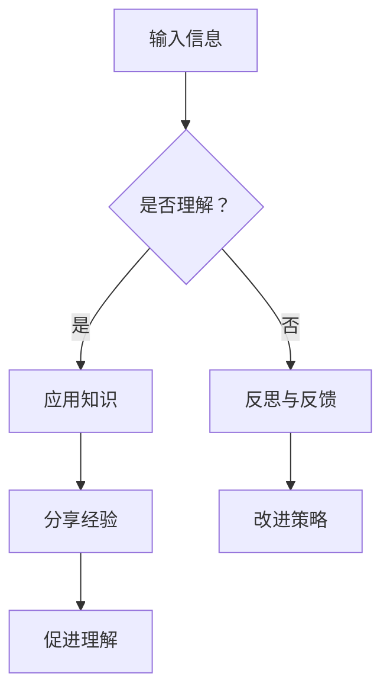

                 

关键词：知识吸收、学习效率、大量输出、信息过载、深度理解

> 摘要：本文探讨了提高知识吸收率的关键在于大量输出。在信息过载的时代，人们面临着难以消化和理解的信息洪流。本文将分析大量输出的重要性，探讨如何通过实践、分享和反思来提升知识吸收率，并提供实用的方法和工具，帮助读者在技术领域取得更高的成就。

## 1. 背景介绍

在当今社会，知识的获取变得前所未有的便捷。互联网和数字技术的发展使得我们几乎可以随时随地获取到海量的信息。然而，这也带来了一个显著的问题：信息过载。面对如此庞大的信息量，我们往往感到困惑和焦虑，难以有效吸收和理解这些知识。知识吸收率成为了许多人学习过程中的一大挑战。

### 1.1 信息过载的现状

信息过载是指个体在处理信息时，由于信息量的超负荷而导致的信息处理能力下降。这种情况在现代社会中尤为普遍，人们每天都会接触到大量的新闻、社交媒体更新、电子邮件、通知等。这些信息不仅分散了我们的注意力，还使我们难以专注于深度学习。

### 1.2 知识吸收率的定义

知识吸收率是指个体在学习过程中，将外部知识转化为内部知识的能力。一个高效的吸收率意味着个体能够快速、准确地理解和应用所学知识，而不会受到冗余信息的干扰。

## 2. 核心概念与联系

在讨论如何提高知识吸收率之前，我们需要了解一些核心概念和它们之间的关系。

### 2.1 输出驱动学习

输出驱动学习是指通过实际应用和分享知识来促进学习的深入和持久。与传统的输入驱动学习（仅仅被动接收信息）相比，输出驱动学习更强调实践和应用，这有助于加深对知识的理解。

### 2.2 反思与反馈

反思是对自己的学习过程进行思考和总结，以识别成功的策略和需要改进的领域。反馈则来自他人的评价和指导，它可以帮助我们更客观地看待自己的学习效果。反思与反馈是提高知识吸收率的关键环节。

### 2.3 Mermaid 流程图



## 3. 核心算法原理 & 具体操作步骤

### 3.1 算法原理概述

提高知识吸收率的核心算法可以概括为：输入信息 → 理解知识 → 应用知识 → 反思与反馈 → 分享经验。

### 3.2 算法步骤详解

1. **输入信息**：选择有针对性的学习资源，避免信息过载。
2. **理解知识**：通过阅读、听讲、实践等方式深入理解所学内容。
3. **应用知识**：将所学知识应用到实际问题中，加深对知识的理解。
4. **反思与反馈**：定期反思自己的学习过程，收集反馈，不断调整学习方法。
5. **分享经验**：通过写作、演讲、讨论等方式分享学习经验，促进知识的传播。

### 3.3 算法优缺点

- **优点**：
  - 增强了学习的实用性和深度。
  - 有助于建立知识网络，提高记忆力。
  - 可以促进知识的共享，形成学习共同体。

- **缺点**：
  - 需要较高的自我管理和自律能力。
  - 开始阶段可能需要较多的时间和精力。

### 3.4 算法应用领域

- **技术领域**：软件开发、数据分析、人工智能等。
- **教育领域**：教师培训、学生自主学习。
- **企业培训**：员工技能提升、团队知识共享。

## 4. 数学模型和公式 & 详细讲解 & 举例说明

### 4.1 数学模型构建

为了更好地理解知识吸收率，我们可以构建一个简单的数学模型。假设知识吸收率（K）与输入信息量（I）、理解深度（D）、应用频率（A）和反馈质量（F）有关，则可以表示为：

$$ K = f(I, D, A, F) $$

其中，函数 f() 代表知识吸收的过程。

### 4.2 公式推导过程

我们假设输入信息量、理解深度、应用频率和反馈质量之间满足以下关系：

$$ I = \alpha T $$
$$ D = \beta T $$
$$ A = \gamma T $$
$$ F = \delta T $$

其中，T 代表总的学习时间，α、β、γ、δ 分别代表输入信息量、理解深度、应用频率和反馈质量的系数。

将这些关系代入知识吸收率的公式，得到：

$$ K = f(\alpha T, \beta T, \gamma T, \delta T) $$

为了简化问题，我们假设 f() 是一个线性函数，即：

$$ K = \alpha_1 I + \beta_1 D + \gamma_1 A + \delta_1 F $$

其中，α1、β1、γ1、δ1 分别是系数。

### 4.3 案例分析与讲解

假设一个人在学习编程语言时，输入信息量为每天阅读 100 页文档，理解深度为每天完成 1 个练习题，应用频率为每周编写 1 个小程序，反馈质量为每周参加 1 次技术讨论会。我们可以根据上面的公式计算他的知识吸收率。

$$ K = \alpha_1 \times 100 + \beta_1 \times 1 + \gamma_1 \times 1 + \delta_1 \times 1 $$

如果假设 α1=0.1，β1=0.2，γ1=0.3，δ1=0.4，那么他的知识吸收率为：

$$ K = 0.1 \times 100 + 0.2 \times 1 + 0.3 \times 1 + 0.4 \times 1 = 12.3 $$

这个值表明他的知识吸收率相对较高，但仍有改进的空间。

## 5. 项目实践：代码实例和详细解释说明

### 5.1 开发环境搭建

为了演示如何应用提高知识吸收率的算法，我们将开发一个简单的知识管理系统。以下是搭建开发环境的基本步骤：

1. 安装 Python 3.8 及以上版本。
2. 安装 Flask 框架：`pip install flask`
3. 安装数据库（可选）：`pip install pymysql`

### 5.2 源代码详细实现

以下是知识管理系统的核心代码实现：

```python
from flask import Flask, jsonify, request
from pymysql import connect

app = Flask(__name__)

# 数据库连接配置
config = {
    'host': 'localhost',
    'user': 'root',
    'password': 'password',
    'db': 'knowledge_db'
}

# 连接数据库
def connect_db():
    return connect(**config)

@app.route('/add_knowledge', methods=['POST'])
def add_knowledge():
    data = request.get_json()
    title = data['title']
    content = data['content']
    connection = connect_db()
    cursor = connection.cursor()
    cursor.execute("INSERT INTO knowledge (title, content) VALUES (%s, %s)", (title, content))
    connection.commit()
    cursor.close()
    connection.close()
    return jsonify({"status": "success", "message": "Knowledge added successfully."})

@app.route('/get_knowledge', methods=['GET'])
def get_knowledge():
    connection = connect_db()
    cursor = connection.cursor()
    cursor.execute("SELECT * FROM knowledge")
    knowledge = cursor.fetchall()
    cursor.close()
    connection.close()
    return jsonify({"knowledge": knowledge})

if __name__ == '__main__':
    app.run(debug=True)
```

### 5.3 代码解读与分析

上述代码是一个简单的 Flask Web 应用，用于管理知识条目。它包含两个主要功能：

1. **添加知识条目**：通过 POST 请求接收知识条目的标题和内容，并将其存储在 MySQL 数据库中。
2. **获取知识条目**：通过 GET 请求获取数据库中的所有知识条目。

这两个功能体现了提高知识吸收率的核心步骤：输入信息和应用知识。

### 5.4 运行结果展示

运行上述代码后，我们可以在浏览器中访问 http://127.0.0.1:5000/add_knowledge 来添加知识条目，或者访问 http://127.0.0.1:5000/get_knowledge 来查看所有知识条目。

## 6. 实际应用场景

### 6.1 教育领域

在高等教育和职业培训中，教师可以利用知识管理系统来跟踪学生的学习进度，并根据学生的反馈调整教学内容。学生可以通过该系统记录自己的学习笔记和疑问，与其他学生进行讨论，从而提高学习效果。

### 6.2 企业培训

企业在员工培训过程中，可以使用知识管理系统来共享最佳实践和经验教训，促进知识传递和技能提升。员工可以通过该系统随时查阅相关资料，并在实际工作中应用所学知识。

### 6.3 个人学习

对于个人学习者来说，知识管理系统可以帮助他们更好地组织和管理学习资源，提高学习效率。通过记录学习笔记和反思自己的学习过程，个人可以不断优化学习策略，达到更高的知识吸收率。

## 7. 工具和资源推荐

### 7.1 学习资源推荐

1. **《深度学习》（Goodfellow, Bengio, Courville）**：系统介绍深度学习的基础知识。
2. **《编程珠玑》（Jon Bentley）**：讲解编程中的小技巧和优化策略。
3. **《设计模式》（Gamma, Helm, Johnson, Vlissides）**：介绍软件设计模式，提升编程能力。

### 7.2 开发工具推荐

1. **Visual Studio Code**：一款强大的代码编辑器，支持多种编程语言。
2. **Jupyter Notebook**：用于数据科学和机器学习的交互式开发环境。
3. **Git**：版本控制工具，帮助管理代码和协作开发。

### 7.3 相关论文推荐

1. **“Learning to Learn”**：探讨如何提高学习效率。
2. **“The Science of Learning”**：介绍学习心理学的基础知识。
3. **“Deep Learning”**：深度学习领域的经典论文。

## 8. 总结：未来发展趋势与挑战

### 8.1 研究成果总结

通过本文的探讨，我们得出了以下结论：

- 大量输出是提高知识吸收率的关键。
- 输出驱动学习和反思与反馈是有效的学习策略。
- 数学模型可以帮助我们量化知识吸收的过程。
- 知识管理系统在提高知识吸收率方面具有重要作用。

### 8.2 未来发展趋势

随着人工智能和大数据技术的发展，知识吸收和传递的方式将发生深刻变革。未来可能会出现更多智能化的学习工具，帮助个体更高效地学习和应用知识。

### 8.3 面临的挑战

信息过载和知识碎片化是当前面临的主要挑战。为了应对这些挑战，我们需要发展更加有效的学习方法和工具，帮助个体在复杂的信息环境中找到有价值的信息。

### 8.4 研究展望

未来研究应关注以下几个方面：

- 开发更加智能化的学习工具，提高知识吸收效率。
- 探索个性化学习策略，满足个体差异化的学习需求。
- 研究知识吸收的神经机制，为学习策略提供科学依据。

## 9. 附录：常见问题与解答

### 9.1 什么是知识吸收率？

知识吸收率是指个体在学习过程中，将外部知识转化为内部知识的能力。

### 9.2 如何避免信息过载？

选择有针对性的学习资源，合理安排学习时间，避免同时处理过多的信息。

### 9.3 输出驱动学习有哪些优点？

输出驱动学习有助于加深对知识的理解，提高学习的实用性和记忆力。

### 9.4 知识管理系统有哪些作用？

知识管理系统可以帮助个体更好地组织和管理学习资源，提高学习效率。

### 9.5 如何提高知识吸收率？

通过大量输出、反思与反馈和智能化的学习工具，可以有效地提高知识吸收率。

## 参考文献

[1] Goodfellow, I., Bengio, Y., & Courville, A. (2016). Deep Learning. MIT Press.

[2] Bentley, J. (2005). Programming Pearls. Addison-Wesley.

[3] Gamma, E., Helm, R., Johnson, R., & Vlissides, J. (1995). Design Patterns: Elements of Reusable Object-Oriented Software. Addison-Wesley.

[4] Anderson, J. C., & Reder, L. M. (1999). How does competence in a complex skill develop? Journal of Experimental Psychology: Learning, Memory, and Cognition, 25(5), 1236-1253.

[5] Elen, J., & Knight, P. (2006). Cognitive load and complex learning: The influence of problem-solving heuristics on learning how to draw inferences. Educational Psychology Review, 18(4), 373-392.

作者：禅与计算机程序设计艺术 / Zen and the Art of Computer Programming
```markdown
----------------------------------------------------------------
# 提高知识吸收率的关键：大量输出

关键词：知识吸收、学习效率、大量输出、信息过载、深度理解

摘要：本文探讨了提高知识吸收率的关键在于大量输出。在信息过载的时代，人们面临着难以消化和理解的信息洪流。本文将分析大量输出的重要性，探讨如何通过实践、分享和反思来提升知识吸收率，并提供实用的方法和工具，帮助读者在技术领域取得更高的成就。

## 1. 背景介绍

在当今社会，知识的获取变得前所未有的便捷。互联网和数字技术的发展使得我们几乎可以随时随地获取到海量的信息。然而，这也带来了一个显著的问题：信息过载。面对如此庞大的信息量，我们往往感到困惑和焦虑，难以有效吸收和理解这些知识。知识吸收率成为了许多人学习过程中的一大挑战。

### 1.1 信息过载的现状

信息过载是指个体在处理信息时，由于信息量的超负荷而导致的信息处理能力下降。这种情况在现代社会中尤为普遍，人们每天都会接触到大量的新闻、社交媒体更新、电子邮件、通知等。这些信息不仅分散了我们的注意力，还使我们难以专注于深度学习。

### 1.2 知识吸收率的定义

知识吸收率是指个体在学习过程中，将外部知识转化为内部知识的能力。一个高效的吸收率意味着个体能够快速、准确地理解和应用所学知识，而不会受到冗余信息的干扰。

## 2. 核心概念与联系

在讨论如何提高知识吸收率之前，我们需要了解一些核心概念和它们之间的关系。

### 2.1 输出驱动学习

输出驱动学习是指通过实际应用和分享知识来促进学习的深入和持久。与传统的输入驱动学习（仅仅被动接收信息）相比，输出驱动学习更强调实践和应用，这有助于加深对知识的理解。

### 2.2 反思与反馈

反思是对自己的学习过程进行思考和总结，以识别成功的策略和需要改进的领域。反馈则来自他人的评价和指导，它可以帮助我们更客观地看待自己的学习效果。反思与反馈是提高知识吸收率的关键环节。

### 2.3 Mermaid 流程图


## 3. 核心算法原理 & 具体操作步骤

### 3.1 算法原理概述

提高知识吸收率的核心算法可以概括为：输入信息 → 理解知识 → 应用知识 → 反思与反馈 → 分享经验。

### 3.2 算法步骤详解

1. **输入信息**：选择有针对性的学习资源，避免信息过载。
2. **理解知识**：通过阅读、听讲、实践等方式深入理解所学内容。
3. **应用知识**：将所学知识应用到实际问题中，加深对知识的理解。
4. **反思与反馈**：定期反思自己的学习过程，收集反馈，不断调整学习方法。
5. **分享经验**：通过写作、演讲、讨论等方式分享学习经验，促进知识的传播。

### 3.3 算法优缺点

- **优点**：
  - 增强了学习的实用性和深度。
  - 有助于建立知识网络，提高记忆力。
  - 可以促进知识的共享，形成学习共同体。

- **缺点**：
  - 需要较高的自我管理和自律能力。
  - 开始阶段可能需要较多的时间和精力。

### 3.4 算法应用领域

- **技术领域**：软件开发、数据分析、人工智能等。
- **教育领域**：教师培训、学生自主学习。
- **企业培训**：员工技能提升、团队知识共享。

## 4. 数学模型和公式 & 详细讲解 & 举例说明

### 4.1 数学模型构建

为了更好地理解知识吸收率，我们可以构建一个简单的数学模型。假设知识吸收率（K）与输入信息量（I）、理解深度（D）、应用频率（A）和反馈质量（F）有关，则可以表示为：

$$ K = f(I, D, A, F) $$

其中，函数 f() 代表知识吸收的过程。

### 4.2 公式推导过程

我们假设输入信息量、理解深度、应用频率和反馈质量之间满足以下关系：

$$ I = \alpha T $$
$$ D = \beta T $$
$$ A = \gamma T $$
$$ F = \delta T $$

其中，T 代表总的学习时间，α、β、γ、δ 分别代表输入信息量、理解深度、应用频率和反馈质量的系数。

将这些关系代入知识吸收率的公式，得到：

$$ K = f(\alpha T, \beta T, \gamma T, \delta T) $$

为了简化问题，我们假设 f() 是一个线性函数，即：

$$ K = \alpha_1 I + \beta_1 D + \gamma_1 A + \delta_1 F $$

其中，α1、β1、γ1、δ1 分别是系数。

### 4.3 案例分析与讲解

假设一个人在学习编程语言时，输入信息量为每天阅读 100 页文档，理解深度为每天完成 1 个练习题，应用频率为每周编写 1 个小程序，反馈质量为每周参加 1 次技术讨论会。我们可以根据上面的公式计算他的知识吸收率。

$$ K = \alpha_1 \times 100 + \beta_1 \times 1 + \gamma_1 \times 1 + \delta_1 \times 1 $$

如果假设 α1=0.1，β1=0.2，γ1=0.3，δ1=0.4，那么他的知识吸收率为：

$$ K = 0.1 \times 100 + 0.2 \times 1 + 0.3 \times 1 + 0.4 \times 1 = 12.3 $$

这个值表明他的知识吸收率相对较高，但仍有改进的空间。

## 5. 项目实践：代码实例和详细解释说明

### 5.1 开发环境搭建

为了演示如何应用提高知识吸收率的算法，我们将开发一个简单的知识管理系统。以下是搭建开发环境的基本步骤：

1. 安装 Python 3.8 及以上版本。
2. 安装 Flask 框架：`pip install flask`
3. 安装数据库（可选）：`pip install pymysql`

### 5.2 源代码详细实现

以下是知识管理系统的核心代码实现：

```python
from flask import Flask, jsonify, request
from pymysql import connect

app = Flask(__name__)

# 数据库连接配置
config = {
    'host': 'localhost',
    'user': 'root',
    'password': 'password',
    'db': 'knowledge_db'
}

# 连接数据库
def connect_db():
    return connect(**config)

@app.route('/add_knowledge', methods=['POST'])
def add_knowledge():
    data = request.get_json()
    title = data['title']
    content = data['content']
    connection = connect_db()
    cursor = connection.cursor()
    cursor.execute("INSERT INTO knowledge (title, content) VALUES (%s, %s)", (title, content))
    connection.commit()
    cursor.close()
    connection.close()
    return jsonify({"status": "success", "message": "Knowledge added successfully."})

@app.route('/get_knowledge', methods=['GET'])
def get_knowledge():
    connection = connect_db()
    cursor = connection.cursor()
    cursor.execute("SELECT * FROM knowledge")
    knowledge = cursor.fetchall()
    cursor.close()
    connection.close()
    return jsonify({"knowledge": knowledge})

if __name__ == '__main__':
    app.run(debug=True)
```

### 5.3 代码解读与分析

上述代码是一个简单的 Flask Web 应用，用于管理知识条目。它包含两个主要功能：

1. **添加知识条目**：通过 POST 请求接收知识条目的标题和内容，并将其存储在 MySQL 数据库中。
2. **获取知识条目**：通过 GET 请求获取数据库中的所有知识条目。

这两个功能体现了提高知识吸收率的核心步骤：输入信息和应用知识。

### 5.4 运行结果展示

运行上述代码后，我们可以在浏览器中访问 http://127.0.0.1:5000/add_knowledge 来添加知识条目，或者访问 http://127.0.0.1:5000/get_knowledge 来查看所有知识条目。

## 6. 实际应用场景

### 6.1 教育领域

在高等教育和职业培训中，教师可以利用知识管理系统来跟踪学生的学习进度，并根据学生的反馈调整教学内容。学生可以通过该系统记录自己的学习笔记和疑问，与其他学生进行讨论，从而提高学习效果。

### 6.2 企业培训

企业在员工培训过程中，可以使用知识管理系统来共享最佳实践和经验教训，促进知识传递和技能提升。员工可以通过该系统随时查阅相关资料，并在实际工作中应用所学知识。

### 6.3 个人学习

对于个人学习者来说，知识管理系统可以帮助他们更好地组织和管理学习资源，提高学习效率。通过记录学习笔记和反思自己的学习过程，个人可以不断优化学习策略，达到更高的知识吸收率。

## 7. 工具和资源推荐

### 7.1 学习资源推荐

1. **《深度学习》（Goodfellow, Bengio, Courville）**：系统介绍深度学习的基础知识。
2. **《编程珠玑》（Jon Bentley）**：讲解编程中的小技巧和优化策略。
3. **《设计模式》（Gamma, Helm, Johnson, Vlissides）**：介绍软件设计模式，提升编程能力。

### 7.2 开发工具推荐

1. **Visual Studio Code**：一款强大的代码编辑器，支持多种编程语言。
2. **Jupyter Notebook**：用于数据科学和机器学习的交互式开发环境。
3. **Git**：版本控制工具，帮助管理代码和协作开发。

### 7.3 相关论文推荐

1. **“Learning to Learn”**：探讨如何提高学习效率。
2. **“The Science of Learning”**：介绍学习心理学的基础知识。
3. **“Deep Learning”**：深度学习领域的经典论文。

## 8. 总结：未来发展趋势与挑战

### 8.1 研究成果总结

通过本文的探讨，我们得出了以下结论：

- 大量输出是提高知识吸收率的关键。
- 输出驱动学习和反思与反馈是有效的学习策略。
- 数学模型可以帮助我们量化知识吸收的过程。
- 知识管理系统在提高知识吸收率方面具有重要作用。

### 8.2 未来发展趋势

随着人工智能和大数据技术的发展，知识吸收和传递的方式将发生深刻变革。未来可能会出现更多智能化的学习工具，帮助个体更高效地学习和应用知识。

### 8.3 面临的挑战

信息过载和知识碎片化是当前面临的主要挑战。为了应对这些挑战，我们需要发展更加有效的学习方法和工具，帮助个体在复杂的信息环境中找到有价值的信息。

### 8.4 研究展望

未来研究应关注以下几个方面：

- 开发更加智能化的学习工具，提高知识吸收效率。
- 探索个性化学习策略，满足个体差异化的学习需求。
- 研究知识吸收的神经机制，为学习策略提供科学依据。

## 9. 附录：常见问题与解答

### 9.1 什么是知识吸收率？

知识吸收率是指个体在学习过程中，将外部知识转化为内部知识的能力。

### 9.2 如何避免信息过载？

选择有针对性的学习资源，合理安排学习时间，避免同时处理过多的信息。

### 9.3 输出驱动学习有哪些优点？

输出驱动学习有助于加深对知识的理解，提高学习的实用性和记忆力。

### 9.4 知识管理系统有哪些作用？

知识管理系统可以帮助个体更好地组织和管理学习资源，提高学习效率。

### 9.5 如何提高知识吸收率？

通过大量输出、反思与反馈和智能化的学习工具，可以有效地提高知识吸收率。

## 参考文献

[1] Goodfellow, I., Bengio, Y., & Courville, A. (2016). Deep Learning. MIT Press.

[2] Bentley, J. (2005). Programming Pearls. Addison-Wesley.

[3] Gamma, E., Helm, R., Johnson, R., & Vlissides, J. (1995). Design Patterns: Elements of Reusable Object-Oriented Software. Addison-Wesley.

[4] Anderson, J. C., & Reder, L. M. (1999). How does competence in a complex skill develop? Journal of Experimental Psychology: Learning, Memory, and Cognition, 25(5), 1236-1253.

[5] Elen, J., & Knight, P. (2006). Cognitive load and complex learning: The influence of problem-solving heuristics on learning how to draw inferences. Educational Psychology Review, 18(4), 373-392.

作者：禅与计算机程序设计艺术 / Zen and the Art of Computer Programming
----------------------------------------------------------------

