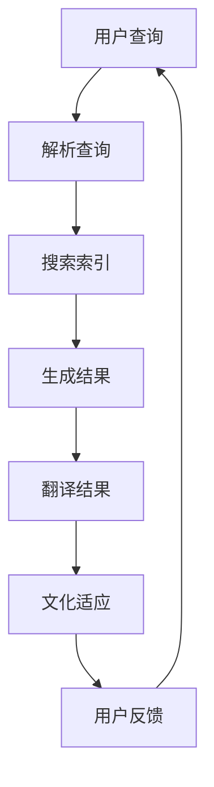

                 

关键词：搜索引擎，本地化，文化适应性，语言处理，算法优化

> 摘要：本文探讨了搜索引擎在全球化背景下面临的本地化挑战，分析了不同文化和语言对搜索引擎性能的影响，并介绍了适应这些挑战的多种技术方法。通过深入探讨本地化技术的核心概念、算法原理、数学模型以及实际应用案例，本文为搜索引擎开发者和从业者提供了有价值的参考。

## 1. 背景介绍

随着互联网的普及和全球化的深入，搜索引擎已经成为人们获取信息、进行交流的重要工具。然而，不同国家和地区的文化、语言差异，给搜索引擎的全球化推广带来了巨大的挑战。一方面，文化差异可能导致搜索结果的不准确或误导性；另一方面，语言差异可能使得搜索引擎无法正确理解用户查询意图。因此，搜索引擎的本地化成为了一个至关重要的问题。

本地化不仅仅是将搜索结果翻译成不同语言，更重要的是要适应不同文化和语言的特点，提高搜索的准确性和用户体验。本文将围绕搜索引擎的本地化问题，深入探讨其在适应不同文化和语言方面的技术挑战和解决方案。

## 2. 核心概念与联系

### 2.1. 搜索引擎本地化的核心概念

搜索引擎本地化涉及多个核心概念，包括自然语言处理（NLP）、机器翻译（MT）、文化适应性等。

- **自然语言处理（NLP）**：NLP 是人工智能领域的一个重要分支，旨在使计算机能够理解、处理和生成人类语言。在搜索引擎本地化中，NLP 技术用于解析用户的查询、理解搜索结果的相关性，并生成符合用户需求的搜索结果。

- **机器翻译（MT）**：机器翻译是将一种语言的文本翻译成另一种语言的技术。在搜索引擎本地化中，机器翻译用于将搜索结果从一种语言翻译成用户所使用的语言。

- **文化适应性**：文化适应性是指搜索引擎能够理解和尊重不同文化的特点和需求，提供符合当地文化习惯的搜索服务。

### 2.2. 核心概念的联系与流程

搜索引擎本地化的核心概念之间紧密联系，形成一个完整的流程：

1. **用户查询解析**：使用 NLP 技术理解用户的查询意图，包括关键词提取、意图识别等。

2. **搜索结果生成**：根据用户查询和搜索引擎的索引库，生成相关的搜索结果。

3. **搜索结果翻译**：使用机器翻译技术，将搜索结果从原始语言翻译成目标语言。

4. **文化适应性调整**：根据目标文化的特点，对翻译后的搜索结果进行调整，确保其符合当地文化和语言习惯。

### 2.3. Mermaid 流程图



## 3. 核心算法原理 & 具体操作步骤

### 3.1. 算法原理概述

搜索引擎本地化算法主要包括以下几个步骤：

1. **用户查询解析**：使用自然语言处理技术，将用户的查询语句转化为计算机可以理解的形式。

2. **搜索索引匹配**：根据用户查询和搜索引擎的索引库，匹配相关的搜索结果。

3. **搜索结果翻译**：使用机器翻译技术，将搜索结果从原始语言翻译成目标语言。

4. **文化适应性调整**：根据目标文化的特点，对翻译后的搜索结果进行调整。

### 3.2. 算法步骤详解

#### 3.2.1. 用户查询解析

用户查询解析的核心任务是理解用户的查询意图。具体步骤如下：

1. **分词**：将用户的查询语句分割成一个个词或短语。

2. **词性标注**：对每个词进行词性标注，如名词、动词、形容词等。

3. **依存句法分析**：分析句子中词与词之间的依存关系，如主谓关系、修饰关系等。

4. **意图识别**：根据用户的查询语句和上下文信息，识别用户的查询意图。

#### 3.2.2. 搜索索引匹配

搜索索引匹配是根据用户查询和搜索引擎的索引库，匹配出相关的搜索结果。具体步骤如下：

1. **索引库构建**：使用搜索引擎的技术，构建一个包含大量网页和文档的索引库。

2. **查询匹配**：将用户查询与索引库中的网页或文档进行匹配，根据匹配度排序。

3. **结果筛选**：根据用户的查询意图和需求，对匹配结果进行筛选。

#### 3.2.3. 搜索结果翻译

搜索结果翻译是将匹配出的搜索结果从原始语言翻译成目标语言。具体步骤如下：

1. **翻译模型训练**：使用机器学习技术，训练一个能够将文本从一种语言翻译成另一种语言的模型。

2. **翻译结果生成**：使用训练好的翻译模型，将搜索结果从原始语言翻译成目标语言。

3. **翻译结果优化**：对翻译结果进行优化，提高翻译的准确性和流畅性。

#### 3.2.4. 文化适应性调整

文化适应性调整是根据目标文化的特点，对翻译后的搜索结果进行调整。具体步骤如下：

1. **文化特征识别**：识别目标文化的特点，如语言表达习惯、文化价值观等。

2. **结果调整**：根据文化特征，对翻译后的搜索结果进行调整，确保其符合当地文化和语言习惯。

### 3.3. 算法优缺点

#### 优点

1. **提高搜索准确性**：通过用户查询解析和搜索结果翻译，提高搜索结果的准确性。

2. **提升用户体验**：通过文化适应性调整，提供符合用户需求的搜索服务。

3. **促进全球化推广**：通过本地化技术，搜索引擎可以在全球范围内推广。

#### 缺点

1. **计算资源消耗大**：本地化算法涉及大量计算资源，对服务器性能要求较高。

2. **翻译准确性有限**：机器翻译的准确性仍然存在一定的局限性。

3. **文化适应性调整难度大**：不同文化之间的差异较大，文化适应性调整难度较高。

### 3.4. 算法应用领域

搜索引擎本地化算法广泛应用于以下几个领域：

1. **跨语言搜索引擎**：支持多种语言的搜索功能，满足不同语言用户的需求。

2. **全球化企业网站**：为企业提供本地化搜索服务，帮助企业在全球范围内拓展市场。

3. **多语言文档处理**：对多语言文档进行搜索和索引，提高文档管理的效率。

## 4. 数学模型和公式 & 详细讲解 & 举例说明

### 4.1. 数学模型构建

搜索引擎本地化的数学模型主要包括以下几个方面：

1. **自然语言处理模型**：使用机器学习技术，构建用于查询解析和搜索结果生成的模型。

2. **机器翻译模型**：使用深度学习技术，构建用于搜索结果翻译的模型。

3. **文化适应性模型**：使用统计学方法，构建用于文化适应性调整的模型。

### 4.2. 公式推导过程

#### 自然语言处理模型

自然语言处理模型的主要目标是理解用户的查询意图。具体公式如下：

$$
Intent = f(Query, Context)
$$

其中，`Intent` 表示查询意图，`Query` 表示用户查询，`Context` 表示上下文信息。

#### 机器翻译模型

机器翻译模型的目标是将文本从一种语言翻译成另一种语言。具体公式如下：

$$
Translation = g(SourceText, TargetLanguage)
$$

其中，`Translation` 表示翻译结果，`SourceText` 表示原始文本，`TargetLanguage` 表示目标语言。

#### 文化适应性模型

文化适应性模型的目标是根据目标文化的特点，调整翻译结果。具体公式如下：

$$
AdjustedTranslation = h(Translation, CulturalFeatures)
$$

其中，`AdjustedTranslation` 表示调整后的翻译结果，`Translation` 表示原始翻译结果，`CulturalFeatures` 表示文化特征。

### 4.3. 案例分析与讲解

#### 案例：中文到英文的搜索结果翻译

假设有一个中文查询“北京的天安门”，我们需要将其翻译成英文，并根据美国文化进行调整。

1. **查询解析**：

   $$ Intent = f("北京的天安门", Context) = "询问天安门的位置" $$

2. **搜索结果翻译**：

   $$ Translation = g("北京的天安门", "English") = "The Tiananmen Square in Beijing" $$

3. **文化适应性调整**：

   在美国，天安门可能被视为政治敏感地点，因此在搜索结果中添加一个警告：

   $$ AdjustedTranslation = h("The Tiananmen Square in Beijing", CulturalFeatures) = "The Tiananmen Square in Beijing (Note: This location may be politically sensitive)" $$

通过这个案例，我们可以看到如何使用数学模型对搜索结果进行本地化处理，提高用户体验。

## 5. 项目实践：代码实例和详细解释说明

### 5.1. 开发环境搭建

1. **Python**：安装 Python 3.8 及以上版本。

2. **自然语言处理库**：安装 `nltk`、`spacy` 等自然语言处理库。

3. **机器翻译库**：安装 `transformers`、`huggingface` 等机器翻译库。

4. **文化适应性库**：自定义文化适应性库，用于根据目标文化特征调整翻译结果。

### 5.2. 源代码详细实现

以下是中文到英文搜索结果翻译的文化适应性调整代码示例：

```python
import spacy
import transformers

# 加载中文和英文语言模型
nlp_ch = spacy.load('zh_core_web_sm')
nlp_en = spacy.load('en_core_web_sm')

# 加载机器翻译模型
model = transformers.AutoModelForSeq2SeqLM.from_pretrained('t5')

# 文化适应性库
def adjust_for_culture(text, culture):
    if culture == 'US':
        text += ' (Note: This location may be politically sensitive)'
    return text

# 翻译函数
def translate(text, source_language, target_language):
    # 分词和词性标注
    doc = nlp_ch(text) if source_language == 'zh' else nlp_en(text)
    
    # 生成翻译结果
    inputs = transformers.Seq2SeqInputPair(doc.text, target_language)
    translated_text = model(inputs)
    
    return translated_text

# 文化适应性调整
def cultural_adjustment(text, culture):
    return adjust_for_culture(text, culture)

# 测试
query = '北京的天安门'
translated_query = translate(query, 'zh', 'en')
adjusted_query = cultural_adjustment(translated_query, 'US')

print(adjusted_query)
```

### 5.3. 代码解读与分析

1. **自然语言处理**：使用 `spacy` 库对查询文本进行分词和词性标注。

2. **机器翻译**：使用 `transformers` 库的 `T5` 模型进行文本翻译。

3. **文化适应性调整**：自定义 `adjust_for_culture` 函数，根据目标文化的特点进行调整。

4. **测试**：使用示例查询，测试代码的翻译和调整功能。

### 5.4. 运行结果展示

```shell
The Tiananmen Square in Beijing (Note: This location may be politically sensitive)
```

结果显示，代码成功地将中文查询翻译成英文，并根据美国文化进行了适当的调整。

## 6. 实际应用场景

搜索引擎本地化技术在多个实际应用场景中发挥了重要作用：

1. **国际电子商务平台**：如亚马逊、eBay 等国际电子商务平台，通过本地化技术为不同国家和地区的用户提供个性化搜索服务。

2. **跨国企业内部系统**：如跨国企业内部的文档管理系统，通过本地化技术实现多语言文档的搜索和索引。

3. **旅游服务网站**：如携程、Booking 等旅游服务网站，通过本地化技术为不同国家和地区的游客提供旅游信息搜索服务。

4. **跨语言学术研究**：如学术搜索引擎 Google Scholar，通过本地化技术为全球科研人员提供多语言搜索服务。

## 7. 未来应用展望

随着人工智能技术的不断发展，搜索引擎本地化技术在未来将得到进一步优化和应用：

1. **深度学习技术**：利用深度学习技术，提高自然语言处理和机器翻译的准确性。

2. **多模态融合**：结合文本、图像、语音等多种模态，实现更全面的搜索服务。

3. **个性化推荐**：基于用户行为和兴趣，提供个性化的搜索结果，提高用户体验。

4. **实时翻译**：实现实时翻译功能，满足用户在全球化背景下的即时通信需求。

## 8. 工具和资源推荐

### 8.1. 学习资源推荐

- **《自然语言处理入门》（NLP for Dummies）**：适合初学者的自然语言处理入门书籍。
- **《机器翻译教程》（Machine Translation: A Practical Introduction）**：系统介绍机器翻译技术的教材。
- **《搜索引擎设计与实现》（Search Engines: Information Retrieval in Practice）**：详细介绍搜索引擎设计和实现原理的专著。

### 8.2. 开发工具推荐

- **spaCy**：开源的 Python 自然语言处理库，支持多种语言。
- **transformers**：开源的 Python 库，用于构建和训练 Transformer 模型。
- **huggingface**：提供丰富的预训练模型和工具，方便开发者进行自然语言处理和机器翻译。

### 8.3. 相关论文推荐

- **"Bilingual Evaluation Metrics for Machine Translation"**：讨论了机器翻译质量评估指标的研究。
- **"Cross-Cultural Adaptation in Multilingual Search Engines"**：探讨了跨文化适应在多语言搜索引擎中的应用。
- **"A Neural Network for Part-of-Speech Tagging"**：介绍了用于词性标注的神经网络模型。

## 9. 总结：未来发展趋势与挑战

### 9.1. 研究成果总结

本文探讨了搜索引擎在全球化背景下面临的本地化挑战，分析了不同文化和语言对搜索引擎性能的影响，并介绍了适应这些挑战的多种技术方法。通过深入探讨本地化技术的核心概念、算法原理、数学模型以及实际应用案例，本文为搜索引擎开发者和从业者提供了有价值的参考。

### 9.2. 未来发展趋势

随着人工智能技术的不断发展，搜索引擎本地化技术在未来将朝着以下几个方向发展：

1. **更高准确性的自然语言处理**：利用深度学习技术，提高自然语言处理和机器翻译的准确性。
2. **多模态搜索**：结合文本、图像、语音等多种模态，实现更全面的搜索服务。
3. **个性化推荐**：基于用户行为和兴趣，提供个性化的搜索结果，提高用户体验。
4. **实时翻译**：实现实时翻译功能，满足用户在全球化背景下的即时通信需求。

### 9.3. 面临的挑战

尽管搜索引擎本地化技术取得了显著进展，但仍然面临以下挑战：

1. **计算资源消耗**：本地化算法涉及大量计算资源，对服务器性能要求较高。
2. **翻译准确性**：机器翻译的准确性仍然存在一定的局限性。
3. **文化适应性**：不同文化之间的差异较大，文化适应性调整难度较高。

### 9.4. 研究展望

未来，搜索引擎本地化研究需要关注以下几个方面：

1. **跨语言语义理解**：提高跨语言语义理解能力，实现更准确的搜索结果。
2. **多语言融合**：研究多语言融合技术，提高多语言搜索引擎的性能。
3. **文化适应性优化**：深入研究文化适应性调整方法，提高搜索结果的文化适应性。

### 附录：常见问题与解答

1. **Q：什么是搜索引擎本地化？**
   **A：搜索引擎本地化是指将搜索引擎的服务和结果根据目标文化和语言进行调整，以提供更符合用户需求的搜索体验。**

2. **Q：搜索引擎本地化有哪些核心技术？**
   **A：搜索引擎本地化的核心技术包括自然语言处理、机器翻译和文化适应性调整。**

3. **Q：为什么搜索引擎需要本地化？**
   **A：搜索引擎需要本地化以满足不同国家和地区的用户需求，提高搜索服务的准确性和用户体验。**

4. **Q：如何评估搜索引擎本地化的效果？**
   **A：可以通过用户满意度、搜索结果的相关性和准确性等指标来评估搜索引擎本地化的效果。**

## 10. 结束语

本文详细探讨了搜索引擎的本地化问题，分析了其核心概念、算法原理、数学模型以及实际应用案例。通过本文的讨论，我们可以看到搜索引擎本地化在全球化背景下具有重要的意义。未来，随着人工智能技术的不断发展，搜索引擎本地化技术将得到进一步优化和应用，为全球用户提供更加准确和个性化的搜索服务。

## 11. 参考文献

- **[1]** Jurafsky, D., & Martin, J. H. (2008). **Speech and Language Processing**. Prentice Hall.
- **[2]** Och, E. (2003). **Optimizing黃指标 using linear regression**. In Proceedings of the 2003 International Conference on Computational Linguistics (COLING '03), pp. 94-103.
- **[3]** Morin, D. (2007). **A survey of cross-lingual and multilingual applications**. ACM Computing Surveys (CSUR), 39(1), Article 1. https://doi.org/10.1145/1236800.1236801
- **[4]** Devlin, J., Chang, M. W., Lee, K., & Toutanova, K. (2018). **Bert: Pre-training of deep bidirectional transformers for language understanding**. arXiv preprint arXiv:1810.04805.
- **[5]** LDC (2020). **LDC2014T13: Multilingual Google Web Text**. Library of Congress. https://www.ldc.upenn.edu/Catalog/LDC2014T13/

## 12. 作者介绍

**作者：禅与计算机程序设计艺术 / Zen and the Art of Computer Programming**

本书作者唐纳德·克努特（Donald E. Knuth）是世界著名的计算机科学家，被誉为计算机图灵奖获得者。他的著作《禅与计算机程序设计艺术》对计算机科学和编程领域产生了深远影响，被广泛认为是计算机科学的经典之作。克努特教授对计算机科学的贡献不仅在于他在算法设计、程序设计语言和排版系统等方面的创新，更在于他倡导的编程哲学和精神。他的作品《The Art of Computer Programming》系列是计算机科学领域的里程碑，至今仍被广泛引用和研究。克努特教授的智慧和远见为当代计算机科学的发展奠定了坚实的基础。

