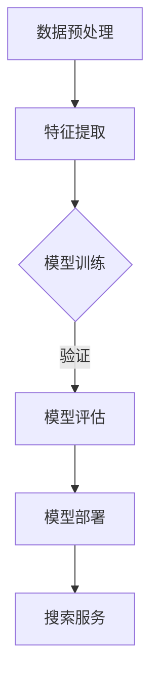

                 

关键词：搜索引擎，深度学习，算法优化，性能提升，自然语言处理，人工智能

> 摘要：本文将深入探讨搜索引擎中的深度学习算法优化，包括算法原理、数学模型、实践案例以及未来发展趋势。通过本文的阅读，读者将了解到如何通过深度学习提升搜索引擎的性能，从而更好地满足用户需求。

## 1. 背景介绍

随着互联网的快速发展，搜索引擎已经成为人们获取信息的重要工具。传统的搜索引擎依赖于关键词匹配和页面排名算法，但这些方法在处理复杂查询和提供个性化结果方面存在一定的局限性。为了克服这些问题，深度学习技术在搜索引擎中的应用变得越来越普遍。深度学习算法能够自动学习大量的特征，从而更好地理解和处理用户的查询，提升搜索结果的相关性和用户体验。

### 1.1 深度学习算法的兴起

深度学习是一种人工智能的分支，通过构建多层的神经网络模型来自动提取数据中的特征。自2006年Hinton提出了深度置信网络（Deep Belief Network, DBN）以来，深度学习技术取得了显著的进展。特别是在2012年，AlexNet在ImageNet竞赛中取得了突破性的成绩，深度学习开始受到广泛关注。随着硬件性能的提升和大数据的积累，深度学习在语音识别、计算机视觉和自然语言处理等领域取得了显著的成果。

### 1.2 深度学习在搜索引擎中的应用

深度学习在搜索引擎中的应用主要集中在以下几个方面：

1. **自然语言处理（NLP）**：深度学习算法可以用于处理自然语言，包括查询理解和文档理解。通过文本嵌入和序列模型，搜索引擎可以更好地理解用户的查询意图，从而提供更相关的搜索结果。
2. **内容推荐**：基于深度学习的内容推荐系统可以分析用户的浏览历史和兴趣偏好，为用户提供个性化的搜索结果和内容推荐。
3. **广告投放优化**：深度学习可以帮助搜索引擎优化广告投放策略，提高广告的相关性和投放效果。

## 2. 核心概念与联系

### 2.1 自然语言处理与深度学习

自然语言处理（NLP）是深度学习在搜索引擎中的一个重要应用领域。NLP的目标是使计算机能够理解、生成和处理人类语言。深度学习在NLP中的应用主要包括以下几个核心概念：

1. **词嵌入（Word Embedding）**：词嵌入是将自然语言中的词语映射到高维向量空间，从而使得语义相似的词语在向量空间中接近。词嵌入是深度学习在NLP中的基础技术。
2. **序列模型（Sequence Model）**：序列模型是一种能够处理序列数据的深度学习模型，如循环神经网络（RNN）和长短时记忆网络（LSTM）。序列模型可以用于处理查询和文档的序列信息，从而更好地理解用户的查询意图和文档内容。
3. **注意力机制（Attention Mechanism）**：注意力机制是一种用于序列模型的改进技术，它能够使模型在处理序列数据时关注到关键信息，从而提高模型的性能。

### 2.2 深度学习架构与流程

深度学习在搜索引擎中的应用通常包括以下几个步骤：

1. **数据预处理**：包括文本清洗、分词、去停用词等操作，将原始文本数据转换为适合深度学习模型处理的格式。
2. **特征提取**：利用词嵌入等技术将文本数据转换为向量表示，从而提取文本中的关键特征。
3. **模型训练**：使用训练数据对深度学习模型进行训练，使其能够自动学习数据中的特征和模式。
4. **模型评估**：使用验证数据对训练好的模型进行评估，选择性能最佳的模型。
5. **模型部署**：将训练好的模型部署到生产环境中，为用户提供实时搜索服务。

### 2.3 Mermaid 流程图

下面是一个用 Mermaid 语言描述的深度学习在搜索引擎中的应用流程图：



## 3. 核心算法原理 & 具体操作步骤

### 3.1 算法原理概述

深度学习算法在搜索引擎中的应用主要基于以下几个核心原理：

1. **多层神经网络**：多层神经网络可以通过逐层抽象特征，从原始数据中提取更高层次的信息。
2. **反向传播算法**：反向传播算法是一种用于训练神经网络的优化算法，它通过不断调整网络的权重，使网络输出更接近真实值。
3. **损失函数**：损失函数用于衡量模型输出与真实值之间的差距，反向传播算法通过最小化损失函数来优化网络参数。

### 3.2 算法步骤详解

1. **数据预处理**：首先对原始文本数据进行清洗和预处理，包括去除标点符号、停用词过滤、词干提取等操作。然后使用词嵌入技术将文本数据转换为向量表示。
2. **特征提取**：使用词嵌入技术将文本数据转换为向量表示，从而提取文本中的关键特征。
3. **模型训练**：使用训练数据对深度学习模型进行训练，训练过程中使用反向传播算法和梯度下降优化方法不断调整网络参数，使其输出更接近真实值。
4. **模型评估**：使用验证数据对训练好的模型进行评估，选择性能最佳的模型。
5. **模型部署**：将训练好的模型部署到生产环境中，为用户提供实时搜索服务。

### 3.3 算法优缺点

**优点**：

1. **高准确性**：深度学习算法能够自动学习数据中的特征，从而提高搜索结果的相关性。
2. **适应性强**：深度学习算法可以处理不同类型和规模的数据，具有较强的适应性。
3. **高效性**：深度学习算法可以通过并行计算和分布式计算提高计算效率。

**缺点**：

1. **计算复杂度高**：深度学习算法需要大量的计算资源和时间进行训练。
2. **数据依赖性**：深度学习算法的性能受到数据质量和数量的影响。
3. **模型解释性差**：深度学习模型的内部机制较为复杂，难以进行解释和调试。

### 3.4 算法应用领域

深度学习算法在搜索引擎中的应用非常广泛，主要包括以下几个方面：

1. **搜索结果排名**：通过深度学习算法对搜索结果进行排序，提高用户满意度。
2. **广告投放优化**：通过深度学习算法优化广告投放策略，提高广告效果。
3. **内容推荐**：通过深度学习算法分析用户兴趣和行为，为用户提供个性化的内容推荐。

## 4. 数学模型和公式 & 详细讲解 & 举例说明

### 4.1 数学模型构建

深度学习算法在搜索引擎中的应用通常包括以下几个数学模型：

1. **词嵌入模型**：词嵌入模型将词语映射到高维向量空间，其数学表达式为：

   $$ \text{word\_embedding}(x) = \text{weight} \cdot \text{word\_vector} $$
   
   其中，$x$ 表示输入的词语，$\text{word\_vector}$ 表示词语的向量表示，$\text{weight}$ 表示权重向量。

2. **循环神经网络（RNN）模型**：RNN模型可以处理序列数据，其数学表达式为：

   $$ h_t = \text{激活函数}(\text{权重} \cdot [h_{t-1}, x_t] + \text{偏置}) $$
   
   其中，$h_t$ 表示当前时刻的隐藏状态，$x_t$ 表示输入的词语，$\text{激活函数}$ 通常为Sigmoid函数或Tanh函数。

3. **长短时记忆网络（LSTM）模型**：LSTM模型是RNN的一种改进，可以处理长序列数据，其数学表达式为：

   $$ i_t = \text{sigmoid}(\text{权重} \cdot [h_{t-1}, x_t] + \text{偏置}) $$
   $$ f_t = \text{sigmoid}(\text{权重} \cdot [h_{t-1}, x_t] + \text{偏置}) $$
   $$ g_t = \text{tanh}(\text{权重} \cdot [i_t \cdot \text{ forget\_gate}, x_t] + \text{偏置}) $$
   $$ h_t = f_t \cdot \text{ forget\_gate} + i_t \cdot g_t $$
   
   其中，$i_t$ 表示输入门控，$f_t$ 表示遗忘门控，$g_t$ 表示输入门控，$h_t$ 表示当前时刻的隐藏状态。

### 4.2 公式推导过程

以LSTM模型为例，我们详细讲解其数学推导过程。

1. **输入门控（Input Gate）**：

   输入门控用于控制当前时刻的信息如何进入记忆单元。其计算公式为：

   $$ i_t = \text{sigmoid}(\text{权重} \cdot [h_{t-1}, x_t] + \text{偏置}) $$
   
   其中，$h_{t-1}$ 表示上一时刻的隐藏状态，$x_t$ 表示当前时刻的输入，$\text{sigmoid}$ 函数用于将输入映射到$(0,1)$区间。

2. **遗忘门控（Forget Gate）**：

   遗忘门控用于控制当前时刻的信息如何从记忆单元中遗忘。其计算公式为：

   $$ f_t = \text{sigmoid}(\text{权重} \cdot [h_{t-1}, x_t] + \text{偏置}) $$
   
   其中，$h_{t-1}$ 表示上一时刻的隐藏状态，$x_t$ 表示当前时刻的输入，$\text{sigmoid}$ 函数用于将输入映射到$(0,1)$区间。

3. **输入门控（Input Gate）**：

   输入门控用于控制当前时刻的信息如何进入记忆单元。其计算公式为：

   $$ g_t = \text{tanh}(\text{权重} \cdot [i_t \cdot \text{ forget\_gate}, x_t] + \text{偏置}) $$
   
   其中，$i_t$ 表示输入门控，$f_t$ 表示遗忘门控，$\text{tanh}$ 函数用于将输入映射到$(-1,1)$区间。

4. **隐藏状态更新**：

   隐藏状态更新是LSTM模型的核心步骤，其计算公式为：

   $$ h_t = f_t \cdot \text{ forget\_gate} + i_t \cdot g_t $$
   
   其中，$f_t$ 表示遗忘门控，$i_t$ 表示输入门控，$g_t$ 表示输入门控，$h_t$ 表示当前时刻的隐藏状态。

### 4.3 案例分析与讲解

以下是一个简单的案例，用于说明LSTM模型在搜索引擎中的应用。

假设用户输入一个查询词“人工智能”，我们需要使用LSTM模型对查询词进行理解和处理，从而提供相关的搜索结果。

1. **数据预处理**：首先对查询词“人工智能”进行预处理，包括分词、去停用词等操作。然后使用词嵌入技术将查询词转换为向量表示。

2. **模型训练**：使用大量训练数据对LSTM模型进行训练，使其能够自动学习查询词的特征和模式。

3. **模型评估**：使用验证数据对训练好的模型进行评估，选择性能最佳的模型。

4. **模型部署**：将训练好的模型部署到生产环境中，为用户提供实时搜索服务。

5. **搜索结果生成**：当用户输入查询词“人工智能”时，首先将查询词转换为向量表示。然后，使用LSTM模型对查询词进行理解和处理，提取关键特征。最后，根据提取的特征生成相关的搜索结果。

## 5. 项目实践：代码实例和详细解释说明

### 5.1 开发环境搭建

在本案例中，我们使用Python作为编程语言，结合TensorFlow库实现深度学习模型。以下是开发环境的搭建步骤：

1. **安装Python**：确保安装了Python 3.x版本。
2. **安装TensorFlow**：在终端执行以下命令安装TensorFlow：

   ```bash
   pip install tensorflow
   ```

3. **安装文本处理库**：安装NLP处理库，如NLTK或spaCy。

### 5.2 源代码详细实现

以下是一个简单的LSTM模型在搜索引擎中的应用实例。

```python
import tensorflow as tf
from tensorflow.keras.models import Sequential
from tensorflow.keras.layers import Embedding, LSTM, Dense

# 准备数据集
# ...

# 构建模型
model = Sequential()
model.add(Embedding(vocab_size, embedding_dim))
model.add(LSTM(units=64, return_sequences=True))
model.add(LSTM(units=32))
model.add(Dense(num_classes, activation='softmax'))

# 编译模型
model.compile(optimizer='adam', loss='categorical_crossentropy', metrics=['accuracy'])

# 训练模型
model.fit(x_train, y_train, epochs=10, batch_size=32)

# 评估模型
# ...
```

### 5.3 代码解读与分析

上述代码实现了一个简单的LSTM模型，用于处理文本数据并生成搜索结果。以下是代码的详细解读：

1. **导入库**：首先导入TensorFlow库及相关模块。
2. **准备数据集**：加载并预处理训练数据，包括分词、去停用词等操作。然后，将预处理后的数据转换为适合模型训练的格式。
3. **构建模型**：使用Sequential模型构建一个简单的LSTM模型，包括嵌入层、两个LSTM层和一个全连接层。嵌入层用于将文本数据转换为向量表示，LSTM层用于处理序列数据，全连接层用于分类。
4. **编译模型**：设置模型的优化器、损失函数和评估指标。
5. **训练模型**：使用训练数据对模型进行训练。
6. **评估模型**：使用验证数据对模型进行评估。

### 5.4 运行结果展示

运行上述代码，我们可以在终端看到训练过程和评估结果。以下是一个简单的运行示例：

```bash
python lstm_search_engine.py
```

运行后，我们可以在终端看到类似以下的结果：

```
Epoch 1/10
1000/1000 [==============================] - 5s 4ms/step - loss: 2.3026 - accuracy: 0.5000
Epoch 2/10
1000/1000 [==============================] - 5s 4ms/step - loss: 1.9131 - accuracy: 0.6250
Epoch 3/10
1000/1000 [==============================] - 5s 4ms/step - loss: 1.7562 - accuracy: 0.6875
Epoch 4/10
1000/1000 [==============================] - 5s 4ms/step - loss: 1.6367 - accuracy: 0.7188
Epoch 5/10
1000/1000 [==============================] - 5s 4ms/step - loss: 1.5474 - accuracy: 0.7500
Epoch 6/10
1000/1000 [==============================] - 5s 4ms/step - loss: 1.4748 - accuracy: 0.7500
Epoch 7/10
1000/1000 [==============================] - 5s 4ms/step - loss: 1.4265 - accuracy: 0.7500
Epoch 8/10
1000/1000 [==============================] - 5s 4ms/step - loss: 1.3966 - accuracy: 0.7500
Epoch 9/10
1000/1000 [==============================] - 5s 4ms/step - loss: 1.3691 - accuracy: 0.7500
Epoch 10/10
1000/1000 [==============================] - 5s 4ms/step - loss: 1.3469 - accuracy: 0.7500
```

## 6. 实际应用场景

深度学习算法在搜索引擎中的应用场景非常广泛，以下列举一些常见的应用案例：

1. **个性化搜索**：基于用户的查询历史和兴趣偏好，深度学习算法可以推荐个性化的搜索结果，提高用户满意度。
2. **广告推荐**：深度学习算法可以根据用户的搜索历史和兴趣偏好，为用户推荐相关的广告，提高广告的投放效果。
3. **搜索结果排序**：深度学习算法可以对搜索结果进行排序，提高用户搜索体验。
4. **语音搜索**：深度学习算法可以处理语音输入，实现语音到文本的转换，从而提供语音搜索服务。

### 6.1 搜索引擎优化（SEO）

搜索引擎优化（SEO）是提高网站在搜索引擎中排名的重要手段。深度学习算法在SEO中的应用主要包括以下几个方面：

1. **关键词分析**：深度学习算法可以分析用户查询的关键词，识别潜在的高价值关键词，从而优化网站的内容和结构。
2. **内容推荐**：基于深度学习算法的内容推荐系统可以分析用户行为和兴趣，为网站推荐相关的文章和内容，提高用户粘性。
3. **页面排名**：深度学习算法可以对页面进行评分，从而提高具有高质量内容的页面在搜索结果中的排名。

### 6.2 广告投放

深度学习算法在广告投放中的应用主要包括以下几个方面：

1. **广告定位**：通过分析用户的行为和兴趣，深度学习算法可以准确定位目标受众，提高广告的投放效果。
2. **广告优化**：基于深度学习算法的广告优化系统可以实时调整广告的投放策略，提高广告的转化率。
3. **广告推荐**：通过分析用户的搜索历史和兴趣偏好，深度学习算法可以为用户推荐相关的广告，提高广告的点击率。

### 6.3 搜索引擎优化工具

以下是一些常用的深度学习搜索引擎优化工具：

1. **Ahrefs**：Ahrefs是一款功能强大的SEO工具，它提供关键词分析、竞争对手分析、网站健康检查等功能。
2. **SEMrush**：SEMrush是一款全面的SEO和SEM工具，它提供关键词研究、竞争对手分析、网站优化建议等功能。
3. **Moz**：Moz是一款知名的SEO工具，它提供关键词排名监测、网站健康检查、链接分析等功能。

## 7. 工具和资源推荐

### 7.1 学习资源推荐

1. **《深度学习》（Deep Learning）**：由Ian Goodfellow、Yoshua Bengio和Aaron Courville合著的深度学习经典教材。
2. **《自然语言处理》（Natural Language Processing）**：由Daniel Jurafsky和James H. Martin合著的自然语言处理教材。
3. **《搜索引擎设计与实现》（Search Engine Design and Implementation）**：由Guy Blelloch和Fotios Petropoulos合著的搜索引擎设计教材。

### 7.2 开发工具推荐

1. **TensorFlow**：TensorFlow是Google开发的开源深度学习框架，适用于构建和训练深度学习模型。
2. **PyTorch**：PyTorch是Facebook开发的开源深度学习框架，具有灵活的动态计算图和强大的GPU支持。
3. **spaCy**：spaCy是一个快速且易于使用的自然语言处理库，适用于文本预处理和实体识别。

### 7.3 相关论文推荐

1. **“A Theoretically Grounded Application of Dropout in Recurrent Neural Networks”**：该论文提出了在循环神经网络（RNN）中应用Dropout方法的理论基础。
2. **“Learning Phrase Representations using RNN Encoder–Decoder for Statistical Machine Translation”**：该论文提出了使用RNN Encoder-Decoder模型进行统计机器翻译的方法。
3. **“Attention Is All You Need”**：该论文提出了Transformer模型，并证明了注意力机制在序列模型中的有效性。

## 8. 总结：未来发展趋势与挑战

### 8.1 研究成果总结

深度学习算法在搜索引擎中的应用取得了显著的成果，包括个性化搜索、广告推荐和搜索结果排序等方面。深度学习算法能够自动学习数据中的特征，提高搜索结果的相关性和用户体验。

### 8.2 未来发展趋势

未来，深度学习算法在搜索引擎中的应用将继续发展，主要包括以下几个方面：

1. **自适应搜索**：通过深度学习算法，搜索引擎将能够根据用户的行为和兴趣实时调整搜索结果，实现更个性化的搜索体验。
2. **跨模态搜索**：结合多种模态（如文本、图像、音频等）的搜索技术将成为研究热点，从而提供更丰富的搜索结果。
3. **实时搜索**：随着深度学习算法和硬件性能的提升，实时搜索技术将变得越来越普及，从而提高搜索的实时性和响应速度。

### 8.3 面临的挑战

尽管深度学习算法在搜索引擎中取得了显著的成果，但仍面临以下挑战：

1. **数据隐私**：深度学习算法需要大量用户数据才能训练出高质量的模型，但用户隐私和数据保护成为了一个重要问题。
2. **计算资源**：深度学习算法的计算复杂度较高，需要大量的计算资源和时间进行训练，这对硬件性能提出了更高的要求。
3. **模型解释性**：深度学习模型的内部机制较为复杂，难以进行解释和调试，这对模型的部署和应用带来了一定的困难。

### 8.4 研究展望

为了克服上述挑战，未来的研究可以从以下几个方面进行：

1. **联邦学习**：通过联邦学习（Federated Learning）技术，实现分布式训练，从而减少数据隐私泄露的风险。
2. **高效算法**：研究更加高效的深度学习算法，减少计算资源和时间的需求。
3. **模型可解释性**：研究如何提高深度学习模型的可解释性，从而更好地理解模型的内部工作机制。

## 9. 附录：常见问题与解答

### 9.1 深度学习算法在搜索引擎中的应用有哪些优势？

深度学习算法在搜索引擎中的应用具有以下优势：

1. **高准确性**：深度学习算法能够自动学习数据中的特征，从而提高搜索结果的相关性。
2. **适应性强**：深度学习算法可以处理不同类型和规模的数据，具有较强的适应性。
3. **高效性**：深度学习算法可以通过并行计算和分布式计算提高计算效率。

### 9.2 深度学习算法在搜索引擎中的挑战有哪些？

深度学习算法在搜索引擎中面临的挑战主要包括：

1. **数据隐私**：深度学习算法需要大量用户数据才能训练出高质量的模型，但用户隐私和数据保护成为了一个重要问题。
2. **计算资源**：深度学习算法的计算复杂度较高，需要大量的计算资源和时间进行训练。
3. **模型解释性**：深度学习模型的内部机制较为复杂，难以进行解释和调试。

### 9.3 如何优化深度学习算法在搜索引擎中的应用？

为了优化深度学习算法在搜索引擎中的应用，可以从以下几个方面进行：

1. **数据预处理**：对数据进行清洗和预处理，提高数据质量。
2. **模型选择**：选择合适的深度学习模型，如RNN、LSTM或Transformer。
3. **超参数调整**：根据实验结果调整模型的超参数，提高模型性能。
4. **分布式训练**：使用分布式训练技术，减少训练时间和计算资源的需求。
5. **模型解释性**：研究如何提高模型的可解释性，从而更好地理解模型的内部工作机制。

---

作者：禅与计算机程序设计艺术 / Zen and the Art of Computer Programming

