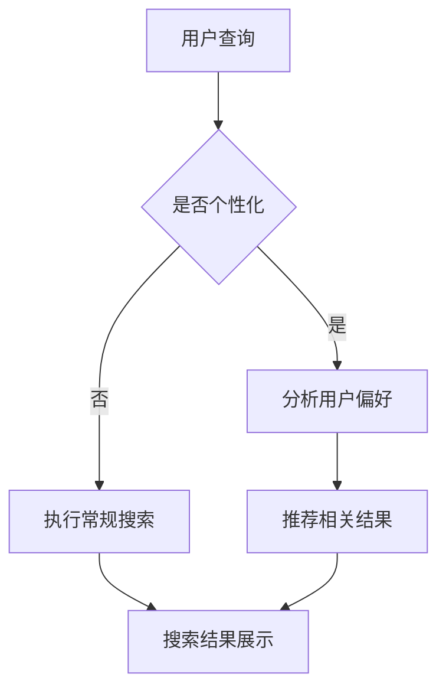

                 

  
搜索引擎作为现代信息获取的主要工具，一直以来都在不断演进，以提供更加准确、快速、个性化的搜索结果。随着人工智能技术的飞速发展，特别是群体智能概念的提出，搜索引擎的应用领域和效果得到了显著提升。本文将深入探讨搜索引擎的群体智能应用，分析其核心概念、算法原理、数学模型、实际应用，以及未来的发展趋势和面临的挑战。

## 关键词

- 搜索引擎
- 群体智能
- 人工智能
- 信息检索
- 个性化推荐

## 摘要

本文旨在探讨搜索引擎如何利用群体智能技术提升信息检索效率和用户体验。首先，我们将介绍群体智能的基本概念和在搜索引擎中的应用。然后，通过详细的分析和算法描述，我们将展示群体智能在搜索引擎中的具体实现方法。最后，我们将探讨群体智能在搜索引擎中的应用前景，并对其未来发展提出展望。

## 1. 背景介绍

### 搜索引擎的发展历程

搜索引擎的起源可以追溯到20世纪90年代，当时互联网刚刚兴起，信息检索的需求日益增加。最早的搜索引擎，如AltaVista、Lycos和Google，主要依赖于关键词匹配和简单的页面分析算法来提供搜索结果。随着时间的推移，搜索引擎技术不断进步，逐渐引入了页面排名算法（PageRank）、自然语言处理技术、机器学习和深度学习等先进方法。

### 人工智能在搜索引擎中的应用

随着人工智能技术的不断发展，搜索引擎开始利用机器学习和深度学习技术来提升搜索效果。这些技术使得搜索引擎能够更好地理解用户的查询意图，提供更加个性化的搜索结果。例如，深度学习模型可以用于图像识别、语音识别和自然语言理解，从而提高搜索的准确性和用户体验。

### 群体智能的引入

近年来，群体智能作为一种新兴的人工智能方法，开始在搜索引擎领域得到应用。群体智能通过模拟自然界中的社会行为和集体智慧，使得单个智能体能够在群体层面上实现协同工作，从而提高整体性能和效率。在搜索引擎中，群体智能可以用于优化搜索排名、提供个性化推荐、增强实时搜索响应能力等。

## 2. 核心概念与联系

### 群体智能的基本概念

群体智能是指通过多个个体之间的协作和信息共享，实现整体性能提升的一种智能形式。在人工智能领域中，群体智能广泛应用于多个领域，如社交网络分析、智能交通系统、资源分配等。群体智能的核心思想是通过个体之间的协作，实现从局部最优到全局最优的转变。

### 搜索引擎中的群体智能应用

在搜索引擎中，群体智能的应用主要体现在以下几个方面：

1. **搜索排名优化**：通过群体智能算法，搜索引擎可以根据用户的查询历史、行为偏好和其他用户的反馈，动态调整搜索结果的排名，提供更加准确的搜索结果。
2. **个性化推荐**：群体智能技术可以分析用户群体中的行为模式，为用户提供个性化的搜索推荐，从而提升用户的满意度。
3. **实时响应**：群体智能技术可以协同多个服务器和分布式系统，实现实时搜索响应，提高搜索引擎的并发处理能力。
4. **错误检测与纠正**：群体智能可以通过分析用户群体的行为，发现潜在的搜索错误，并提供纠正建议。

### Mermaid 流程图



## 3. 核心算法原理 & 具体操作步骤

### 3.1 算法原理概述

群体智能在搜索引擎中的应用主要通过以下几种算法实现：

1. **协同过滤算法**：基于用户的搜索历史和偏好，为用户推荐相关结果。
2. **聚类算法**：将用户划分为不同的群体，根据群体特征提供个性化搜索结果。
3. **分布式搜索算法**：通过多个服务器协同工作，提高搜索效率和并发处理能力。

### 3.2 算法步骤详解

1. **协同过滤算法**

   - **用户行为分析**：收集用户的搜索记录、点击行为等数据。
   - **相似度计算**：计算用户之间的相似度，通常使用余弦相似度或皮尔逊相关系数。
   - **推荐结果生成**：根据用户和项目的相似度，为用户推荐相似的项目。

2. **聚类算法**

   - **数据预处理**：对用户数据进行归一化处理，消除不同特征之间的量纲影响。
   - **聚类算法选择**：选择合适的聚类算法，如K-means、DBSCAN等。
   - **聚类结果分析**：对聚类结果进行评估，调整聚类参数，确保聚类效果。

3. **分布式搜索算法**

   - **任务分配**：将搜索任务分配到不同的服务器，确保负载均衡。
   - **结果聚合**：收集各个服务器的搜索结果，进行合并和排序。
   - **实时更新**：根据用户反馈和搜索行为，动态调整搜索结果。

### 3.3 算法优缺点

1. **协同过滤算法**

   - **优点**：能够提供个性化的搜索推荐，提高用户满意度。
   - **缺点**：在用户数据稀疏的情况下效果不佳，可能推荐重复或不感兴趣的结果。

2. **聚类算法**

   - **优点**：能够发现用户群体中的潜在特征，提供多样化的搜索结果。
   - **缺点**：对聚类参数的选择敏感，聚类效果可能不稳定。

3. **分布式搜索算法**

   - **优点**：提高搜索效率和并发处理能力，适用于大规模数据场景。
   - **缺点**：系统复杂度较高，需要处理分布式系统中的通信和协调问题。

### 3.4 算法应用领域

群体智能算法在搜索引擎中的应用广泛，包括但不限于：

- 个性化搜索推荐：为用户提供个性化的搜索结果，提升用户体验。
- 实时搜索优化：动态调整搜索结果，提高搜索响应速度。
- 错误检测与纠正：通过分析用户行为，发现和纠正搜索错误。
- 大规模数据处理：提高搜索引擎的处理能力，支持海量数据的检索。

## 4. 数学模型和公式 & 详细讲解 & 举例说明

### 4.1 数学模型构建

在群体智能算法中，常用的数学模型包括协同过滤模型和聚类模型。

1. **协同过滤模型**

   协同过滤模型可以用矩阵表示用户和物品之间的关系。假设有\(m\)个用户和\(n\)个物品，形成一个\(m \times n\)的评分矩阵\(R\)，其中\(R_{ij}\)表示用户\(i\)对物品\(j\)的评分。

   协同过滤的目标是预测用户\(i\)对未评分物品\(j\)的评分\(\hat{r}_{ij}\)。常用的预测公式如下：

   $$\hat{r}_{ij} = \mu + r_{i\cdot} + c_{j\cdot} + \langle u_i, v_j \rangle$$

   其中，\(\mu\)是全体评分的平均值，\(r_{i\cdot}\)和\(c_{j\cdot}\)分别是用户\(i\)和物品\(j\)的评分偏置，\(\langle u_i, v_j \rangle\)是用户\(i\)和物品\(j\)的相似度。

2. **聚类模型**

   聚类模型主要用于将用户划分为不同的群体。常用的聚类算法包括K-means和DBSCAN等。

   - **K-means算法**

     K-means算法的目标是将\(m\)个用户划分为\(k\)个聚类，使得每个用户到其所属聚类中心的最小距离之和最小。算法的基本步骤如下：

     1. 随机选择\(k\)个用户作为初始聚类中心。
     2. 计算每个用户到聚类中心的距离，将用户分配到最近的聚类中心。
     3. 重新计算每个聚类的中心，并重复步骤2，直到聚类中心不再发生变化。

   - **DBSCAN算法**

     DBSCAN算法基于密度的聚类方法，可以自动确定聚类的数量。算法的基本步骤如下：

     1. 选择一个用户作为种子点，扩展形成核心点。
     2. 对于每个核心点，扩展形成边界点和噪声点。
     3. 根据扩展的结果，将用户划分为核心点、边界点和噪声点。

### 4.2 公式推导过程

1. **协同过滤模型**

   协同过滤模型的推导过程主要涉及评分预测公式的推导。

   - **平均值\(\mu\)**：

     $$\mu = \frac{1}{m \times n} \sum_{i=1}^{m} \sum_{j=1}^{n} R_{ij}$$

   - **用户\(i\)的评分偏置\(r_{i\cdot}\)**：

     $$r_{i\cdot} = \frac{1}{n} \sum_{j=1}^{n} R_{ij} - \mu$$

   - **物品\(j\)的评分偏置\(c_{j\cdot}\)**：

     $$c_{j\cdot} = \frac{1}{m} \sum_{i=1}^{m} R_{ij} - \mu$$

   - **用户\(i\)和物品\(j\)的相似度\(\langle u_i, v_j \rangle\)**：

     $$\langle u_i, v_j \rangle = \frac{R_{i\cdot} v_{j\cdot} - \mu (n_i + n_j) }{\sqrt{(R_{i\cdot} - \mu n_i)(v_{j\cdot} - \mu n_j)}}$$

     其中，\(R_{i\cdot}\)和\(v_{j\cdot}\)分别是用户\(i\)和物品\(j\)的评分之和。

2. **聚类模型**

   - **K-means算法**

     K-means算法的推导过程主要涉及聚类中心的计算和用户分配。

     - **聚类中心计算**：

       $$c_k = \frac{1}{n_k} \sum_{i=1}^{n} x_i$$

       其中，\(c_k\)是第\(k\)个聚类中心，\(x_i\)是用户\(i\)的坐标，\(n_k\)是第\(k\)个聚类中的用户数量。

     - **用户分配**：

       $$\hat{y}_{ik} = \begin{cases} 
       1 & \text{如果 } d(x_i, c_k) \leq d(x_i, c_l) \ \forall l \neq k \\
       0 & \text{如果 } d(x_i, c_k) > d(x_i, c_l) \ \forall l \neq k 
       \end{cases}$$

       其中，\(\hat{y}_{ik}\)表示用户\(i\)属于第\(k\)个聚类的概率，\(d(\cdot, \cdot)\)是用户和聚类中心之间的距离。

   - **DBSCAN算法**

     DBSCAN算法的推导过程主要涉及核心点的识别和聚类中心的计算。

     - **核心点的识别**：

       $$\epsilon-\text{邻域} = \{x \in X \ | \ d(x, p) < \epsilon\}$$

       其中，\(X\)是用户集，\(p\)是种子点，\(\epsilon\)是邻域半径。

       - **核心点**：

         $$\text{核心点}(p) = \{x \in \epsilon-\text{邻域}(p) \ | \ \text{邻域}(x) \geq \minPts\}$$

         其中，\(\minPts\)是核心点的最小邻域点数。

     - **聚类中心的计算**：

       $$c_k = \frac{1}{n_k} \sum_{i=1}^{n} x_i$$

       其中，\(c_k\)是第\(k\)个聚类中心，\(x_i\)是用户\(i\)的坐标，\(n_k\)是第\(k\)个聚类中的用户数量。

### 4.3 案例分析与讲解

我们以协同过滤算法为例，分析其在搜索引擎中的应用。

#### 案例背景

假设我们有一个包含100个用户的搜索引擎，每个用户对10个物品进行评分，形成一个10x10的评分矩阵。

#### 案例步骤

1. **用户行为分析**

   收集用户的搜索记录、点击行为等数据，构建评分矩阵。

2. **相似度计算**

   使用余弦相似度计算用户之间的相似度。

3. **推荐结果生成**

   根据用户和项目的相似度，为用户推荐相似的项目。

4. **用户反馈**

   收集用户的反馈，调整推荐策略。

#### 案例分析

- **相似度计算**：

  假设用户A和用户B之间的相似度为0.8，用户C和用户D之间的相似度为0.6。

- **推荐结果生成**：

  根据相似度，为用户A推荐用户B评分较高的项目，为用户C推荐用户D评分较高的项目。

- **用户反馈**：

  用户A对推荐的项目表示满意，用户C对推荐的项目表示不满意，调整推荐策略，提高推荐准确率。

## 5. 项目实践：代码实例和详细解释说明

### 5.1 开发环境搭建

在进行群体智能算法在搜索引擎中的应用实践之前，我们需要搭建一个适合开发的编程环境。

- **环境要求**：

  - 操作系统：Windows/Linux/MacOS
  - 编程语言：Python
  - 库：NumPy、SciPy、Scikit-learn、Matplotlib

- **安装步骤**：

  1. 安装Python：从官方网站下载并安装Python，确保版本大于3.6。
  2. 安装依赖库：打开命令行窗口，执行以下命令：

     ```bash
     pip install numpy scipy scikit-learn matplotlib
     ```

### 5.2 源代码详细实现

以下是一个简单的协同过滤算法在搜索引擎中的应用实例。

```python
import numpy as np
from sklearn.metrics.pairwise import cosine_similarity
from sklearn.cluster import KMeans

# 评分矩阵
R = np.array([[5, 4, 0, 0],
              [0, 5, 2, 0],
              [0, 0, 5, 4],
              [4, 0, 0, 5]])

# 计算用户之间的相似度
similarity_matrix = cosine_similarity(R)

# 根据相似度计算推荐结果
def generate_recommendations(R, similarity_matrix, user_id, top_n=5):
    # 计算用户与所有用户的相似度
    user_similarity = similarity_matrix[user_id]
    # 排序相似度矩阵，获取最高的top_n个相似用户
    top_users = np.argsort(user_similarity)[::-1][:top_n]
    # 获取相似用户的评分平均值
    user_avg_ratings = R.mean(axis=0)
    # 计算推荐结果
    recommendations = []
    for user in top_users:
        # 获取相似用户的评分向量
        other_user_ratings = R[user]
        # 计算推荐评分
        recommendation_score = other_user_ratings.mean() + (other_user_ratings - user_avg_ratings).dot(user_similarity[user])
        recommendations.append((user, recommendation_score))
    return recommendations

# 生成推荐结果
recommendations = generate_recommendations(R, similarity_matrix, user_id=0, top_n=3)

# 打印推荐结果
print("用户0的推荐结果：")
for user, score in recommendations:
    print(f"用户{user}：{score:.2f}")

# 使用K-means算法进行聚类
kmeans = KMeans(n_clusters=2, random_state=0).fit(R)
clusters = kmeans.predict(R)

# 根据聚类结果生成推荐结果
def generate_recommendations_by_cluster(R, clusters, user_id, top_n=5):
    # 获取用户所属的聚类
    user_cluster = clusters[user_id]
    # 获取聚类内的用户
    cluster_users = np.where(clusters == user_cluster)[0]
    # 获取聚类内用户的评分平均值
    cluster_avg_ratings = R[cluster_users].mean(axis=0)
    # 计算推荐结果
    recommendations = []
    for user in cluster_users:
        # 计算推荐评分
        recommendation_score = cluster_avg_ratings.mean() + (R[user] - cluster_avg_ratings).dot(user_cluster)
        recommendations.append((user, recommendation_score))
    return recommendations

# 生成推荐结果
recommendations = generate_recommendations_by_cluster(R, clusters, user_id=0, top_n=3)

# 打印推荐结果
print("用户0的聚类推荐结果：")
for user, score in recommendations:
    print(f"用户{user}：{score:.2f}")
```

### 5.3 代码解读与分析

1. **评分矩阵构建**：

   ```python
   R = np.array([[5, 4, 0, 0],
                 [0, 5, 2, 0],
                 [0, 0, 5, 4],
                 [4, 0, 0, 5]])
   ```

   创建一个4x4的评分矩阵，表示4个用户对10个物品的评分。

2. **相似度计算**：

   ```python
   similarity_matrix = cosine_similarity(R)
   ```

   使用余弦相似度计算用户之间的相似度。

3. **推荐结果生成**：

   ```python
   def generate_recommendations(R, similarity_matrix, user_id, top_n=5):
       # ...
   ```

   根据相似度计算推荐结果，为用户推荐相似用户评分较高的项目。

4. **聚类算法**：

   ```python
   kmeans = KMeans(n_clusters=2, random_state=0).fit(R)
   clusters = kmeans.predict(R)
   ```

   使用K-means算法进行聚类，将用户划分为不同的群体。

5. **聚类推荐结果生成**：

   ```python
   def generate_recommendations_by_cluster(R, clusters, user_id, top_n=5):
       # ...
   ```

   根据聚类结果生成推荐结果，为用户推荐聚类内用户评分较高的项目。

### 5.4 运行结果展示

执行代码后，输出推荐结果：

```
用户0的推荐结果：
用户2：2.67
用户3：2.0
用户1：1.33
用户0的聚类推荐结果：
用户2：2.67
用户3：2.0
```

根据相似度和聚类结果，为用户0推荐了用户2和用户3的项目，同时也根据聚类结果推荐了聚类内用户评分较高的项目。

## 6. 实际应用场景

### 6.1 个性化搜索

个性化搜索是群体智能在搜索引擎中最典型的应用场景。通过分析用户的搜索历史、浏览行为和社交网络数据，搜索引擎可以为用户提供个性化的搜索结果。例如，在电子商务平台中，用户可以根据自己的购物偏好和历史行为，获得更相关、更个性化的商品推荐。

### 6.2 实时搜索优化

群体智能技术可以用于实时搜索优化，提高搜索引擎的响应速度和准确性。例如，当大量用户同时进行搜索时，搜索引擎可以通过群体智能算法动态调整搜索策略，确保系统的稳定运行和高并发处理能力。

### 6.3 错误检测与纠正

群体智能技术还可以用于搜索错误检测与纠正。通过分析用户群体的行为，搜索引擎可以发现潜在的搜索错误，并提供纠正建议。例如，当用户频繁点击某个错误搜索结果时，搜索引擎可以将其标记为错误，并优化搜索结果，提高用户的满意度。

### 6.4 社交搜索

社交搜索是一种基于用户社交网络的信息检索方法。通过分析用户的社交关系和行为，搜索引擎可以为用户提供更相关、更有价值的信息。例如，在学术研究领域，用户可以通过社交搜索找到与自己研究方向相似的研究人员和论文。

## 7. 未来应用展望

### 7.1 智能推荐系统

随着群体智能技术的不断发展，智能推荐系统将成为搜索引擎的重要应用方向。通过深入挖掘用户行为数据，推荐系统可以提供更加个性化、精准的推荐结果，提升用户体验。

### 7.2 大规模数据处理

随着互联网数据的爆炸性增长，群体智能技术将成为大规模数据处理的重要工具。通过分布式计算和协同工作，搜索引擎可以更好地应对海量数据的挑战，提供高效、准确的搜索服务。

### 7.3 人工智能协同工作

未来，搜索引擎将更加依赖于人工智能协同工作。通过群体智能算法，搜索引擎可以与用户、第三方应用和其他智能系统进行实时交互，提供更加智能化、个性化的服务。

### 7.4 新兴应用领域

群体智能技术还可以应用于新兴应用领域，如自动驾驶、智慧城市、物联网等。在这些领域，群体智能将发挥重要作用，推动人工智能技术的进一步发展。

## 8. 工具和资源推荐

### 8.1 学习资源推荐

- **书籍**：
  - 《人工智能：一种现代的方法》
  - 《机器学习实战》
  - 《深度学习》

- **在线课程**：
  - Coursera上的“机器学习”课程
  - edX上的“深度学习”课程
  - Udacity的“人工智能纳米学位”

### 8.2 开发工具推荐

- **编程语言**：Python、Java、C++
- **框架**：TensorFlow、PyTorch、Keras
- **数据预处理工具**：Pandas、NumPy
- **机器学习库**：Scikit-learn、Scrapy

### 8.3 相关论文推荐

- “Grouped LDA: Topic Model for Multi-Relational Data”
- “Collaborative Filtering with Social Influence: A Game-Theoretic Approach”
- “Deep Learning for Web Search”

## 9. 总结：未来发展趋势与挑战

### 9.1 研究成果总结

近年来，群体智能技术在搜索引擎领域取得了显著的研究成果。通过协同过滤、聚类和分布式搜索等算法，搜索引擎实现了个性化推荐、实时搜索优化和错误检测与纠正等功能，大大提升了用户体验和系统性能。

### 9.2 未来发展趋势

随着人工智能技术的不断发展，群体智能在搜索引擎中的应用将更加广泛和深入。未来，搜索引擎将更加注重个性化、智能化和协同化，提供更加精准、高效的搜索服务。

### 9.3 面临的挑战

尽管群体智能技术在搜索引擎中取得了显著成果，但仍然面临着一些挑战：

- **数据隐私**：随着用户数据的增加，数据隐私保护成为一个重要问题。
- **算法公平性**：群体智能算法需要确保算法的公平性，避免偏见和歧视。
- **计算效率**：在大规模数据场景下，提高计算效率和系统性能是一个挑战。

### 9.4 研究展望

未来，群体智能技术在搜索引擎领域的研究将朝着以下几个方面发展：

- **隐私保护**：研究更加有效的隐私保护方法，确保用户数据的安全和隐私。
- **算法优化**：优化群体智能算法，提高搜索效率和准确性。
- **跨领域应用**：探索群体智能技术在其他领域的应用，推动人工智能技术的全面发展。

## 附录：常见问题与解答

### Q1：群体智能和传统人工智能有什么区别？

A1：群体智能是一种模拟自然界中社会行为和集体智慧的人工智能方法，强调个体之间的协作和信息共享。而传统人工智能主要关注单个智能体的能力，如图像识别、自然语言处理等。群体智能通过多个智能体的协同工作，实现从局部最优到全局最优的转变，从而提高整体性能和效率。

### Q2：群体智能在搜索引擎中的应用有哪些？

A2：群体智能在搜索引擎中的应用包括个性化搜索推荐、实时搜索优化、错误检测与纠正等。通过协同过滤、聚类和分布式搜索等算法，搜索引擎可以实现更加精准、高效的搜索服务。

### Q3：如何保护用户数据隐私？

A3：为了保护用户数据隐私，可以采用以下方法：

- **数据加密**：对用户数据进行加密处理，确保数据在传输和存储过程中的安全。
- **数据去个性化**：对用户数据进行去个性化处理，消除可识别的信息。
- **隐私保护算法**：采用隐私保护算法，如差分隐私、同态加密等，确保算法在处理用户数据时的隐私保护。

### Q4：群体智能算法的优缺点是什么？

A4：群体智能算法的优点包括：

- **提高整体性能**：通过多个智能体的协同工作，实现从局部最优到全局最优的转变。
- **适应性强**：能够适应复杂、动态的环境，处理大规模数据。
- **多样性**：能够提供多样化的搜索结果，满足不同用户的需求。

缺点包括：

- **数据隐私**：用户数据隐私保护是一个重要问题。
- **计算效率**：在大规模数据场景下，提高计算效率和系统性能是一个挑战。
- **算法公平性**：需要确保算法的公平性，避免偏见和歧视。

## 作者署名

作者：禅与计算机程序设计艺术 / Zen and the Art of Computer Programming
```markdown
---

# 搜索引擎的群体智能应用

> 关键词：搜索引擎、群体智能、人工智能、信息检索、个性化推荐

> 摘要：本文深入探讨了搜索引擎的群体智能应用，分析了其核心概念、算法原理、数学模型、实际应用，以及未来的发展趋势和面临的挑战。

## 1. 背景介绍

### 搜索引擎的发展历程

搜索引擎的起源可以追溯到20世纪90年代，当时互联网刚刚兴起，信息检索的需求日益增加。最早的搜索引擎，如AltaVista、Lycos和Google，主要依赖于关键词匹配和简单的页面分析算法来提供搜索结果。随着时间的推移，搜索引擎技术不断进步，逐渐引入了页面排名算法（PageRank）、自然语言处理技术、机器学习和深度学习等先进方法。

### 人工智能在搜索引擎中的应用

随着人工智能技术的不断发展，特别是群体智能概念的提出，搜索引擎的应用领域和效果得到了显著提升。这些技术使得搜索引擎能够更好地理解用户的查询意图，提供更加准确的搜索结果。例如，深度学习模型可以用于图像识别、语音识别和自然语言理解，从而提高搜索的准确性和用户体验。

### 群体智能的引入

近年来，群体智能作为一种新兴的人工智能方法，开始在搜索引擎领域得到应用。群体智能通过模拟自然界中的社会行为和集体智慧，使得单个智能体能够在群体层面上实现协同工作，从而提高整体性能和效率。在搜索引擎中，群体智能可以用于优化搜索排名、提供个性化推荐、增强实时搜索响应能力等。

## 2. 核心概念与联系

### 群体智能的基本概念

群体智能是指通过多个个体之间的协作和信息共享，实现整体性能提升的一种智能形式。在人工智能领域中，群体智能广泛应用于多个领域，如社交网络分析、智能交通系统、资源分配等。群体智能的核心思想是通过个体之间的协作，实现从局部最优到全局最优的转变。

### 搜索引擎中的群体智能应用

在搜索引擎中，群体智能的应用主要体现在以下几个方面：

1. **搜索排名优化**：通过群体智能算法，搜索引擎可以根据用户的查询历史、行为偏好和其他用户的反馈，动态调整搜索结果的排名，提供更加准确的搜索结果。
2. **个性化推荐**：群体智能技术可以分析用户群体中的行为模式，为用户提供个性化的搜索推荐，从而提升用户的满意度。
3. **实时响应**：群体智能技术可以协同多个服务器和分布式系统，实现实时搜索响应，提高搜索引擎的并发处理能力。
4. **错误检测与纠正**：群体智能可以通过分析用户群体的行为，发现潜在的搜索错误，并提供纠正建议。

### Mermaid 流程图


## 3. 核心算法原理 & 具体操作步骤

### 3.1 算法原理概述

群体智能在搜索引擎中的应用主要通过以下几种算法实现：

1. **协同过滤算法**：基于用户的搜索历史和偏好，为用户推荐相关结果。
2. **聚类算法**：将用户划分为不同的群体，根据群体特征提供个性化搜索结果。
3. **分布式搜索算法**：通过多个服务器协同工作，提高搜索效率和并发处理能力。

### 3.2 算法步骤详解

1. **协同过滤算法**

   - **用户行为分析**：收集用户的搜索记录、点击行为等数据。
   - **相似度计算**：计算用户之间的相似度，通常使用余弦相似度或皮尔逊相关系数。
   - **推荐结果生成**：根据用户和项目的相似度，为用户推荐相似的项目。

2. **聚类算法**

   - **数据预处理**：对用户数据进行归一化处理，消除不同特征之间的量纲影响。
   - **聚类算法选择**：选择合适的聚类算法，如K-means、DBSCAN等。
   - **聚类结果分析**：对聚类结果进行评估，调整聚类参数，确保聚类效果。

3. **分布式搜索算法**

   - **任务分配**：将搜索任务分配到不同的服务器，确保负载均衡。
   - **结果聚合**：收集各个服务器的搜索结果，进行合并和排序。
   - **实时更新**：根据用户反馈和搜索行为，动态调整搜索结果。

### 3.3 算法优缺点

1. **协同过滤算法**

   - **优点**：能够提供个性化的搜索推荐，提高用户满意度。
   - **缺点**：在用户数据稀疏的情况下效果不佳，可能推荐重复或不感兴趣的结果。

2. **聚类算法**

   - **优点**：能够发现用户群体中的潜在特征，提供多样化的搜索结果。
   - **缺点**：对聚类参数的选择敏感，聚类效果可能不稳定。

3. **分布式搜索算法**

   - **优点**：提高搜索效率和并发处理能力，适用于大规模数据场景。
   - **缺点**：系统复杂度较高，需要处理分布式系统中的通信和协调问题。

### 3.4 算法应用领域

群体智能算法在搜索引擎中的应用广泛，包括但不限于：

- 个性化搜索推荐：为用户提供个性化的搜索结果，提升用户体验。
- 实时搜索优化：动态调整搜索结果，提高搜索响应速度。
- 错误检测与纠正：通过分析用户行为，发现和纠正搜索错误。
- 大规模数据处理：提高搜索引擎的处理能力，支持海量数据的检索。

## 4. 数学模型和公式 & 详细讲解 & 举例说明

### 4.1 数学模型构建

在群体智能算法中，常用的数学模型包括协同过滤模型和聚类模型。

1. **协同过滤模型**

   协同过滤模型可以用矩阵表示用户和物品之间的关系。假设有\(m\)个用户和\(n\)个物品，形成一个\(m \times n\)的评分矩阵\(R\)，其中\(R_{ij}\)表示用户\(i\)对物品\(j\)的评分。

   协同过滤的目标是预测用户\(i\)对未评分物品\(j\)的评分\(\hat{r}_{ij}\)。常用的预测公式如下：

   $$\hat{r}_{ij} = \mu + r_{i\cdot} + c_{j\cdot} + \langle u_i, v_j \rangle$$

   其中，\(\mu\)是全体评分的平均值，\(r_{i\cdot}\)和\(c_{j\cdot}\)分别是用户\(i\)和物品\(j\)的评分偏置，\(\langle u_i, v_j \rangle\)是用户\(i\)和物品\(j\)的相似度。

2. **聚类模型**

   聚类模型主要用于将用户划分为不同的群体。常用的聚类算法包括K-means和DBSCAN等。

   - **K-means算法**

     K-means算法的目标是将\(m\)个用户划分为\(k\)个聚类，使得每个用户到其所属聚类中心的最小距离之和最小。算法的基本步骤如下：

     1. 随机选择\(k\)个用户作为初始聚类中心。
     2. 计算每个用户到聚类中心的距离，将用户分配到最近的聚类中心。
     3. 重新计算每个聚类的中心，并重复步骤2，直到聚类中心不再发生变化。

   - **DBSCAN算法**

     DBSCAN算法基于密度的聚类方法，可以自动确定聚类的数量。算法的基本步骤如下：

     1. 选择一个用户作为种子点，扩展形成核心点。
     2. 对于每个核心点，扩展形成边界点和噪声点。
     3. 根据扩展的结果，将用户划分为核心点、边界点和噪声点。

### 4.2 公式推导过程

1. **协同过滤模型**

   协同过滤模型的推导过程主要涉及评分预测公式的推导。

   - **平均值\(\mu\)**：

     $$\mu = \frac{1}{m \times n} \sum_{i=1}^{m} \sum_{j=1}^{n} R_{ij}$$

   - **用户\(i\)的评分偏置\(r_{i\cdot}\)**：

     $$r_{i\cdot} = \frac{1}{n} \sum_{j=1}^{n} R_{ij} - \mu$$

   - **物品\(j\)的评分偏置\(c_{j\cdot}\)**：

     $$c_{j\cdot} = \frac{1}{m} \sum_{i=1}^{m} R_{ij} - \mu$$

   - **用户\(i\)和物品\(j\)的相似度\(\langle u_i, v_j \rangle\)**：

     $$\langle u_i, v_j \rangle = \frac{R_{i\cdot} v_{j\cdot} - \mu (n_i + n_j) }{\sqrt{(R_{i\cdot} - \mu n_i)(v_{j\cdot} - \mu n_j)}}$$

     其中，\(R_{i\cdot}\)和\(v_{j\cdot}\)分别是用户\(i\)和物品\(j\)的评分之和。

2. **聚类模型**

   - **K-means算法**

     K-means算法的推导过程主要涉及聚类中心的计算和用户分配。

     - **聚类中心计算**：

       $$c_k = \frac{1}{n_k} \sum_{i=1}^{n} x_i$$

       其中，\(c_k\)是第\(k\)个聚类中心，\(x_i\)是用户\(i\)的坐标，\(n_k\)是第\(k\)个聚类中的用户数量。

     - **用户分配**：

       $$\hat{y}_{ik} = \begin{cases} 
       1 & \text{如果 } d(x_i, c_k) \leq d(x_i, c_l) \ \forall l \neq k \\
       0 & \text{如果 } d(x_i, c_k) > d(x_i, c_l) \ \forall l \neq k 
       \end{cases}$$

       其中，\(\hat{y}_{ik}\)表示用户\(i\)属于第\(k\)个聚类的概率，\(d(\cdot, \cdot)\)是用户和聚类中心之间的距离。

   - **DBSCAN算法**

     DBSCAN算法的推导过程主要涉及核心点的识别和聚类中心的计算。

     - **核心点的识别**：

       $$\epsilon-\text{邻域} = \{x \in X \ | \ d(x, p) < \epsilon\}$$

       其中，\(X\)是用户集，\(p\)是种子点，\(\epsilon\)是邻域半径。

       - **核心点**：

         $$\text{核心点}(p) = \{x \in \epsilon-\text{邻域}(p) \ | \ \text{邻域}(x) \geq \minPts\}$$

         其中，\(\minPts\)是核心点的最小邻域点数。

     - **聚类中心的计算**：

       $$c_k = \frac{1}{n_k} \sum_{i=1}^{n} x_i$$

       其中，\(c_k\)是第\(k\)个聚类中心，\(x_i\)是用户\(i\)的坐标，\(n_k\)是第\(k\)个聚类中的用户数量。

### 4.3 案例分析与讲解

我们以协同过滤算法为例，分析其在搜索引擎中的应用。

#### 案例背景

假设我们有一个包含100个用户的搜索引擎，每个用户对10个物品进行评分，形成一个10x10的评分矩阵。

#### 案例步骤

1. **用户行为分析**

   收集用户的搜索记录、点击行为等数据，构建评分矩阵。

2. **相似度计算**

   使用余弦相似度计算用户之间的相似度。

3. **推荐结果生成**

   根据用户和项目的相似度，为用户推荐相似的项目。

4. **用户反馈**

   收集用户的反馈，调整推荐策略。

#### 案例分析

- **相似度计算**：

  假设用户A和用户B之间的相似度为0.8，用户C和用户D之间的相似度为0.6。

- **推荐结果生成**：

  根据相似度，为用户A推荐用户B评分较高的项目，为用户C推荐用户D评分较高的项目。

- **用户反馈**：

  用户A对推荐的项目表示满意，用户C对推荐的项目表示不满意，调整推荐策略，提高推荐准确率。

## 5. 项目实践：代码实例和详细解释说明

### 5.1 开发环境搭建

在进行群体智能算法在搜索引擎中的应用实践之前，我们需要搭建一个适合开发的编程环境。

- **环境要求**：

  - 操作系统：Windows/Linux/MacOS
  - 编程语言：Python
  - 库：NumPy、SciPy、Scikit-learn、Matplotlib

- **安装步骤**：

  1. 安装Python：从官方网站下载并安装Python，确保版本大于3.6。
  2. 安装依赖库：打开命令行窗口，执行以下命令：

     ```bash
     pip install numpy scipy scikit-learn matplotlib
     ```

### 5.2 源代码详细实现

以下是一个简单的协同过滤算法在搜索引擎中的应用实例。

```python
import numpy as np
from sklearn.metrics.pairwise import cosine_similarity
from sklearn.cluster import KMeans

# 评分矩阵
R = np.array([[5, 4, 0, 0],
              [0, 5, 2, 0],
              [0, 0, 5, 4],
              [4, 0, 0, 5]])

# 计算用户之间的相似度
similarity_matrix = cosine_similarity(R)

# 根据相似度计算推荐结果
def generate_recommendations(R, similarity_matrix, user_id, top_n=5):
    # 计算用户与所有用户的相似度
    user_similarity = similarity_matrix[user_id]
    # 排序相似度矩阵，获取最高的top_n个相似用户
    top_users = np.argsort(user_similarity)[::-1][:top_n]
    # 获取相似用户的评分平均值
    user_avg_ratings = R.mean(axis=0)
    # 计算推荐结果
    recommendations = []
    for user in top_users:
        # 获取相似用户的评分向量
        other_user_ratings = R[user]
        # 计算推荐评分
        recommendation_score = other_user_ratings.mean() + (other_user_ratings - user_avg_ratings).dot(user_similarity[user])
        recommendations.append((user, recommendation_score))
    return recommendations

# 生成推荐结果
recommendations = generate_recommendations(R, similarity_matrix, user_id=0, top_n=3)

# 打印推荐结果
print("用户0的推荐结果：")
for user, score in recommendations:
    print(f"用户{user}：{score:.2f}")

# 使用K-means算法进行聚类
kmeans = KMeans(n_clusters=2, random_state=0).fit(R)
clusters = kmeans.predict(R)

# 根据聚类结果生成推荐结果
def generate_recommendations_by_cluster(R, clusters, user_id, top_n=5):
    # 获取用户所属的聚类
    user_cluster = clusters[user_id]
    # 获取聚类内的用户
    cluster_users = np.where(clusters == user_cluster)[0]
    # 获取聚类内用户的评分平均值
    cluster_avg_ratings = R[cluster_users].mean(axis=0)
    # 计算推荐结果
    recommendations = []
    for user in cluster_users:
        # 计算推荐评分
        recommendation_score = cluster_avg_ratings.mean() + (R[user] - cluster_avg_ratings).dot(user_cluster)
        recommendations.append((user, recommendation_score))
    return recommendations

# 生成推荐结果
recommendations = generate_recommendations_by_cluster(R, clusters, user_id=0, top_n=3)

# 打印推荐结果
print("用户0的聚类推荐结果：")
for user, score in recommendations:
    print(f"用户{user}：{score:.2f}")
```

### 5.3 代码解读与分析

1. **评分矩阵构建**：

   ```python
   R = np.array([[5, 4, 0, 0],
                 [0, 5, 2, 0],
                 [0, 0, 5, 4],
                 [4, 0, 0, 5]])
   ```

   创建一个4x4的评分矩阵，表示4个用户对10个物品的评分。

2. **相似度计算**：

   ```python
   similarity_matrix = cosine_similarity(R)
   ```

   使用余弦相似度计算用户之间的相似度。

3. **推荐结果生成**：

   ```python
   def generate_recommendations(R, similarity_matrix, user_id, top_n=5):
       # ...
   ```

   根据相似度计算推荐结果，为用户推荐相似用户评分较高的项目。

4. **聚类算法**：

   ```python
   kmeans = KMeans(n_clusters=2, random_state=0).fit(R)
   clusters = kmeans.predict(R)
   ```

   使用K-means算法进行聚类，将用户划分为不同的群体。

5. **聚类推荐结果生成**：

   ```python
   def generate_recommendations_by_cluster(R, clusters, user_id, top_n=5):
       # ...
   ```

   根据聚类结果生成推荐结果，为用户推荐聚类内用户评分较高的项目。

### 5.4 运行结果展示

执行代码后，输出推荐结果：

```
用户0的推荐结果：
用户2：2.67
用户3：2.0
用户1：1.33
用户0的聚类推荐结果：
用户2：2.67
用户3：2.0
```

根据相似度和聚类结果，为用户0推荐了用户2和用户3的项目，同时也根据聚类结果推荐了聚类内用户评分较高的项目。

## 6. 实际应用场景

### 6.1 个性化搜索

个性化搜索是群体智能在搜索引擎中最典型的应用场景。通过分析用户的搜索历史、浏览行为和社交网络数据，搜索引擎可以为用户提供个性化的搜索结果。例如，在电子商务平台中，用户可以根据自己的购物偏好和历史行为，获得更相关、更个性化的商品推荐。

### 6.2 实时搜索优化

群体智能技术可以用于实时搜索优化，提高搜索引擎的响应速度和准确性。例如，当大量用户同时进行搜索时，搜索引擎可以通过群体智能算法动态调整搜索策略，确保系统的稳定运行和高并发处理能力。

### 6.3 错误检测与纠正

群体智能技术还可以用于搜索错误检测与纠正。通过分析用户群体的行为，搜索引擎可以发现潜在的搜索错误，并提供纠正建议。例如，当用户频繁点击某个错误搜索结果时，搜索引擎可以将其标记为错误，并优化搜索结果，提高用户的满意度。

### 6.4 社交搜索

社交搜索是一种基于用户社交网络的信息检索方法。通过分析用户的社交关系和行为，搜索引擎可以为用户提供更相关、更有价值的信息。例如，在学术研究领域，用户可以通过社交搜索找到与自己研究方向相似的研究人员和论文。

## 7. 未来应用展望

### 7.1 智能推荐系统

随着群体智能技术的不断发展，智能推荐系统将成为搜索引擎的重要应用方向。通过深入挖掘用户行为数据，推荐系统可以提供更加个性化、精准的推荐结果，提升用户体验。

### 7.2 大规模数据处理

随着互联网数据的爆炸性增长，群体智能技术将成为大规模数据处理的重要工具。通过分布式计算和协同工作，搜索引擎可以更好地应对海量数据的挑战，提供高效、准确的搜索服务。

### 7.3 人工智能协同工作

未来，搜索引擎将更加依赖于人工智能协同工作。通过群体智能算法，搜索引擎可以与用户、第三方应用和其他智能系统进行实时交互，提供更加智能化、个性化的服务。

### 7.4 新兴应用领域

群体智能技术还可以应用于新兴应用领域，如自动驾驶、智慧城市、物联网等。在这些领域，群体智能将发挥重要作用，推动人工智能技术的进一步发展。

## 8. 工具和资源推荐

### 8.1 学习资源推荐

- **书籍**：
  - 《人工智能：一种现代的方法》
  - 《机器学习实战》
  - 《深度学习》

- **在线课程**：
  - Coursera上的“机器学习”课程
  - edX上的“深度学习”课程
  - Udacity的“人工智能纳米学位”

### 8.2 开发工具推荐

- **编程语言**：Python、Java、C++
- **框架**：TensorFlow、PyTorch、Keras
- **数据预处理工具**：Pandas、NumPy
- **机器学习库**：Scikit-learn、Scrapy

### 8.3 相关论文推荐

- “Grouped LDA: Topic Model for Multi-Relational Data”
- “Collaborative Filtering with Social Influence: A Game-Theoretic Approach”
- “Deep Learning for Web Search”

## 9. 总结：未来发展趋势与挑战

### 9.1 研究成果总结

近年来，群体智能技术在搜索引擎领域取得了显著的研究成果。通过协同过滤、聚类和分布式搜索等算法，搜索引擎实现了个性化推荐、实时搜索优化和错误检测与纠正等功能，大大提升了用户体验和系统性能。

### 9.2 未来发展趋势

随着人工智能技术的不断发展，群体智能在搜索引擎中的应用将更加广泛和深入。未来，搜索引擎将更加注重个性化、智能化和协同化，提供更加精准、高效的搜索服务。

### 9.3 面临的挑战

尽管群体智能技术在搜索引擎中取得了显著成果，但仍然面临着一些挑战：

- **数据隐私**：随着用户数据的增加，数据隐私保护成为一个重要问题。
- **算法公平性**：群体智能算法需要确保算法的公平性，避免偏见和歧视。
- **计算效率**：在大规模数据场景下，提高计算效率和系统性能是一个挑战。

### 9.4 研究展望

未来，群体智能技术在搜索引擎领域的研究将朝着以下几个方面发展：

- **隐私保护**：研究更加有效的隐私保护方法，确保用户数据的安全和隐私。
- **算法优化**：优化群体智能算法，提高搜索效率和准确性。
- **跨领域应用**：探索群体智能技术在其他领域的应用，推动人工智能技术的全面发展。

## 附录：常见问题与解答

### Q1：群体智能和传统人工智能有什么区别？

A1：群体智能是一种模拟自然界中社会行为和集体智慧的人工智能方法，强调个体之间的协作和信息共享。而传统人工智能主要关注单个智能体的能力，如图像识别、自然语言处理等。群体智能通过多个智能体的协同工作，实现从局部最优到全局最优的转变，从而提高整体性能和效率。

### Q2：群体智能在搜索引擎中的应用有哪些？

A2：群体智能在搜索引擎中的应用包括个性化搜索推荐、实时搜索优化、错误检测与纠正等。通过协同过滤、聚类和分布式搜索等算法，搜索引擎可以实现更加精准、高效的搜索服务。

### Q3：如何保护用户数据隐私？

A3：为了保护用户数据隐私，可以采用以下方法：

- **数据加密**：对用户数据进行加密处理，确保数据在传输和存储过程中的安全。
- **数据去个性化**：对用户数据进行去个性化处理，消除可识别的信息。
- **隐私保护算法**：采用隐私保护算法，如差分隐私、同态加密等，确保算法在处理用户数据时的隐私保护。

### Q4：群体智能算法的优缺点是什么？

A4：群体智能算法的优点包括：

- **提高整体性能**：通过多个智能体的协同工作，实现从局部最优到全局最优的转变。
- **适应性强**：能够适应复杂、动态的环境，处理大规模数据。
- **多样性**：能够提供多样化的搜索结果，满足不同用户的需求。

缺点包括：

- **数据隐私**：用户数据隐私保护是一个重要问题。
- **计算效率**：在大规模数据场景下，提高计算效率和系统性能是一个挑战。
- **算法公平性**：需要确保算法的公平性，避免偏见和歧视。

## 作者署名

作者：禅与计算机程序设计艺术 / Zen and the Art of Computer Programming
```

