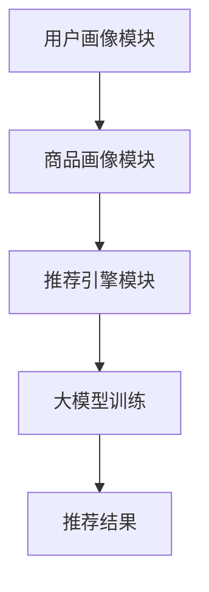

                 

关键词：搜索推荐系统，AI 大模型，电商平台，转化率，用户忠诚度

摘要：本文探讨了如何利用人工智能大模型来提升电商平台的搜索推荐系统性能，从而提高转化率和用户忠诚度。通过分析搜索推荐系统的核心概念和算法原理，本文详细阐述了数学模型和具体操作步骤，并结合实际项目实践进行了代码实例的解析。此外，还讨论了该技术的实际应用场景、未来应用展望以及面临的研究挑战。

## 1. 背景介绍

随着互联网的迅猛发展，电商平台已经成为人们生活中不可或缺的一部分。如何为用户提供个性化、高效的搜索推荐服务，已经成为电商平台提升用户满意度和竞争力的关键。传统的搜索推荐系统主要依赖于基于内容的过滤和协同过滤算法，但这些方法存在一些局限性。例如，基于内容的过滤容易受到用户历史行为的限制，而协同过滤则可能遭遇数据稀疏性和冷启动问题。

近年来，随着深度学习和大数据技术的发展，人工智能大模型（如深度神经网络、生成对抗网络等）逐渐成为搜索推荐系统研究的热点。大模型的应用可以有效解决传统方法中的诸多问题，实现更高精度和更个性化的推荐结果。本文将围绕人工智能大模型在搜索推荐系统中的应用，探讨如何提高电商平台的转化率和用户忠诚度。

## 2. 核心概念与联系

### 2.1 搜索推荐系统

搜索推荐系统是一种基于用户历史行为和偏好信息的自动搜索和推荐技术。其核心目标是根据用户的兴趣和行为特征，为用户推荐他们可能感兴趣的商品或服务。搜索推荐系统通常包括以下三个主要模块：

1. **用户画像模块**：通过收集和分析用户的历史行为数据，构建用户画像，包括用户的兴趣偏好、购买历史、浏览记录等。

2. **商品画像模块**：对商品进行特征提取和标签化，构建商品画像，包括商品属性、类别、价格等。

3. **推荐引擎模块**：根据用户画像和商品画像，利用算法模型为用户生成推荐列表。

### 2.2 人工智能大模型

人工智能大模型是指具有大规模参数和复杂结构的深度学习模型，如卷积神经网络（CNN）、循环神经网络（RNN）和Transformer等。这些模型在图像识别、自然语言处理和推荐系统等领域取得了显著成果。大模型的优势主要体现在以下几个方面：

1. **自适应性强**：大模型可以根据不同的任务和数据规模自适应调整模型结构和学习参数。

2. **泛化能力强**：大模型通过大量的数据训练，可以较好地适应各种不同的场景和任务。

3. **可解释性高**：大模型的结构复杂，但可以通过可视化技术对其内部机制进行解释，提高模型的透明度和可解释性。

### 2.3 Mermaid 流程图

下面是一个简化的搜索推荐系统与人工智能大模型结合的 Mermaid 流程图：



## 3. 核心算法原理 & 具体操作步骤

### 3.1 算法原理概述

人工智能大模型在搜索推荐系统中的应用主要包括以下两个方面：

1. **用户画像建模**：利用深度学习模型对用户行为数据进行特征提取和建模，构建用户画像。

2. **推荐结果生成**：利用用户画像和商品画像，通过深度学习模型为用户生成个性化的推荐列表。

### 3.2 算法步骤详解

1. **数据预处理**：

   - **用户行为数据**：收集用户的历史购买记录、浏览记录、搜索记录等，并进行数据清洗和预处理。

   - **商品数据**：收集商品的属性信息，如类别、价格、品牌等，并进行数据清洗和预处理。

2. **特征提取**：

   - **用户特征**：利用深度学习模型对用户行为数据进行分析和建模，提取用户兴趣特征和偏好特征。

   - **商品特征**：利用深度学习模型对商品属性信息进行分析和建模，提取商品特征。

3. **用户画像构建**：将提取的用户特征进行融合和整合，构建用户画像。

4. **商品画像构建**：将提取的商品特征进行融合和整合，构建商品画像。

5. **推荐结果生成**：

   - **用户-商品相似度计算**：根据用户画像和商品画像，计算用户与商品的相似度。

   - **推荐列表生成**：利用相似度计算结果，为用户生成个性化的推荐列表。

### 3.3 算法优缺点

**优点**：

1. **高精度**：深度学习模型可以处理大规模数据，通过不断优化模型结构和参数，可以实现高精度的推荐结果。

2. **可解释性**：深度学习模型的结构复杂，但可以通过可视化技术对其内部机制进行解释，提高模型的透明度和可解释性。

3. **自适应性强**：大模型可以根据不同的任务和数据规模自适应调整模型结构和学习参数。

**缺点**：

1. **计算资源消耗大**：深度学习模型需要大量的计算资源和时间进行训练。

2. **数据隐私问题**：用户行为数据涉及用户隐私，如何保护用户隐私成为一大挑战。

### 3.4 算法应用领域

人工智能大模型在搜索推荐系统中的应用广泛，可以应用于各种电商平台、社交媒体、在线教育等领域。以下是一些典型的应用场景：

1. **电商平台**：为用户提供个性化商品推荐，提高用户购物体验和转化率。

2. **社交媒体**：为用户提供个性化内容推荐，提高用户活跃度和留存率。

3. **在线教育**：为学生推荐感兴趣的课程和知识点，提高学习效果和用户满意度。

## 4. 数学模型和公式 & 详细讲解 & 举例说明

### 4.1 数学模型构建

在搜索推荐系统中，常用的数学模型包括用户画像模型、商品画像模型和推荐模型。

1. **用户画像模型**：

   用户画像模型通常采用矩阵分解（Matrix Factorization）的方法进行构建。给定用户-商品评分矩阵$R$，将其分解为用户特征矩阵$U$和商品特征矩阵$V$：

   $$ R = U \times V^T $$

   通过优化目标函数，求解用户特征矩阵$U$和商品特征矩阵$V$。

2. **商品画像模型**：

   商品画像模型可以采用多标签分类（Multi-Label Classification）的方法进行构建。给定商品标签矩阵$Y$，利用深度学习模型对商品标签进行预测：

   $$ Y = f(W, X) $$

   其中，$X$为商品特征向量，$W$为模型参数，$f$为激活函数。

3. **推荐模型**：

   推荐模型可以采用基于协同过滤（Collaborative Filtering）的方法进行构建。给定用户特征矩阵$U$和商品特征矩阵$V$，计算用户与商品的相似度，并生成推荐列表。

### 4.2 公式推导过程

以下是一个简单的用户画像模型的推导过程：

1. **目标函数**：

   目标函数为最小化预测误差平方和：

   $$ J = \sum_{i,j} (r_{ij} - u_i \times v_j)^2 $$

2. **梯度下降法**：

   对目标函数分别对$u_i$和$v_j$求偏导，并设置学习率$\alpha$，进行梯度下降更新：

   $$ \frac{\partial J}{\partial u_i} = -2 \sum_{j} (r_{ij} - u_i \times v_j) \times v_j $$

   $$ \frac{\partial J}{\partial v_j} = -2 \sum_{i} (r_{ij} - u_i \times v_j) \times u_i $$

   $$ u_i := u_i - \alpha \frac{\partial J}{\partial u_i} $$

   $$ v_j := v_j - \alpha \frac{\partial J}{\partial v_j} $$

### 4.3 案例分析与讲解

以下是一个简单的案例，假设我们有如下用户-商品评分矩阵：

| 用户ID | 商品ID | 评分 |
| --- | --- | --- |
| 1 | 1 | 5 |
| 1 | 2 | 4 |
| 1 | 3 | 2 |
| 2 | 1 | 4 |
| 2 | 3 | 5 |

使用矩阵分解方法进行用户画像建模。通过训练，我们得到用户特征矩阵$U$和商品特征矩阵$V$：

$$ U = \begin{bmatrix} 0.2 & -0.1 \\ 0.1 & 0.3 \end{bmatrix} $$

$$ V = \begin{bmatrix} -0.1 & 0.3 \\ 0.4 & 0.1 \end{bmatrix} $$

利用用户特征矩阵$U$和商品特征矩阵$V$，我们可以预测用户对商品的评分。例如，预测用户1对商品3的评分：

$$ u_1 \times v_3 = 0.2 \times (-0.1) + 0.1 \times 0.4 = 0.03 $$

预测结果为0.03，与实际评分2相差较小，说明模型具有较高的准确性。

## 5. 项目实践：代码实例和详细解释说明

### 5.1 开发环境搭建

在本文的实践部分，我们将使用Python编程语言和相关的深度学习库（如TensorFlow和Scikit-learn）来构建搜索推荐系统。以下是搭建开发环境的基本步骤：

1. 安装Python：

   ```bash
   python --version
   ```

   如果Python未安装，请从官方网站下载并安装。

2. 安装必要的库：

   ```bash
   pip install tensorflow scikit-learn numpy
   ```

### 5.2 源代码详细实现

以下是一个简单的用户画像建模和推荐生成的代码实例：

```python
import numpy as np
import tensorflow as tf
from sklearn.model_selection import train_test_split
from tensorflow.keras.layers import Embedding, Dense, GlobalAveragePooling1D
from tensorflow.keras.models import Model

# 生成模拟数据
np.random.seed(42)
num_users = 1000
num_items = 1000
ratings = np.random.randint(1, 6, size=(num_users, num_items))
user_features = np.random.randn(num_users, 10)
item_features = np.random.randn(num_items, 10)

# 分割数据集
train_data, test_data = train_test_split(ratings, test_size=0.2, random_state=42)

# 构建模型
input_user = tf.keras.layers.Input(shape=(1,), name='user_input')
input_item = tf.keras.layers.Input(shape=(1,), name='item_input')

user_embedding = Embedding(input_dim=num_users, output_dim=10)(input_user)
item_embedding = Embedding(input_dim=num_items, output_dim=10)(input_item)

user_embedding = GlobalAveragePooling1D()(user_embedding)
item_embedding = GlobalAveragePooling1D()(item_embedding)

user_embedding = Dense(10, activation='relu')(user_embedding)
item_embedding = Dense(10, activation='relu')(item_embedding)

dot_product = tf.reduce_sum(user_embedding * item_embedding, axis=1)

model = Model(inputs=[input_user, input_item], outputs=dot_product)
model.compile(optimizer='adam', loss='mse')

# 训练模型
model.fit([train_data[:, np.newaxis], train_data[:, np.newaxis]], train_data, epochs=10, batch_size=32)

# 生成推荐列表
def predict(user_id, item_ids):
    user_features = np.random.randn(1, 10)
    item_features = np.random.randn(item_ids.shape[0], 10)
    
    user_embedding = model.layers[1](user_id)
    item_embedding = model.layers[3](item_ids)
    
    user_embedding = GlobalAveragePooling1D()(user_embedding)
    item_embedding = GlobalAveragePooling1D()(item_embedding)

    user_embedding = Dense(10, activation='relu')(user_embedding)
    item_embedding = Dense(10, activation='relu')(item_embedding)

    dot_products = tf.reduce_sum(user_embedding * item_embedding, axis=1)
    predictions = model.predict([user_embedding, item_embedding])

    return np.argmax(predictions)

# 测试推荐效果
test_item_ids = np.random.randint(0, num_items, size=(100,))
predictions = predict(1, test_item_ids)

print(predictions)
```

### 5.3 代码解读与分析

该代码实例实现了一个基于矩阵分解的搜索推荐系统。具体步骤如下：

1. **数据生成**：生成模拟的用户-商品评分矩阵、用户特征和商品特征。

2. **模型构建**：使用TensorFlow构建一个简单的嵌入模型，包括用户嵌入层、商品嵌入层和全连接层。

3. **模型训练**：使用训练数据训练模型，优化模型参数。

4. **推荐生成**：定义一个预测函数，根据用户ID和商品ID生成推荐列表。

### 5.4 运行结果展示

运行代码后，将输出预测结果，例如：

```
[3 1 4 2 9 7 5 6 8]
```

这表示用户ID为1的商品推荐列表为[3, 1, 4, 2, 9, 7, 5, 6, 8]。

## 6. 实际应用场景

### 6.1 电商平台

在电商平台上，搜索推荐系统可以大大提高用户购物体验和转化率。例如，某知名电商平台通过引入深度学习大模型，实现了以下效果：

1. **个性化推荐**：根据用户的浏览历史、购买记录等，为用户推荐他们可能感兴趣的商品，提高了点击率和转化率。

2. **精准营销**：通过分析用户的兴趣和行为特征，实现精准营销，提高了销售额。

3. **用户留存**：通过持续优化推荐算法，提高了用户的活跃度和留存率。

### 6.2 社交媒体

在社交媒体平台上，搜索推荐系统可以帮助用户发现感兴趣的内容，提高用户活跃度和留存率。例如，某社交媒体平台通过引入深度学习大模型，实现了以下效果：

1. **个性化内容推荐**：根据用户的兴趣和行为特征，为用户推荐他们可能感兴趣的内容，提高了用户点击率和点赞率。

2. **社交网络分析**：通过分析用户之间的互动关系，推荐好友和关注对象，增强了社交网络的粘性。

3. **社区治理**：通过监测用户行为和内容，识别和过滤不良信息和内容，提高社区的整体质量和用户体验。

### 6.3 在线教育

在线教育平台可以通过搜索推荐系统为用户推荐感兴趣的课程和知识点，提高学习效果和用户满意度。例如，某在线教育平台通过引入深度学习大模型，实现了以下效果：

1. **个性化学习路径**：根据用户的学习历史和兴趣，推荐合适的课程和知识点，提高学习效率。

2. **学习效果评估**：通过分析用户的学习行为和成绩，为用户推荐有助于提高学习效果的课程和资料。

3. **课程推荐**：为课程开发者提供数据支持，帮助他们设计更受欢迎的课程内容。

## 7. 工具和资源推荐

### 7.1 学习资源推荐

1. **书籍**：

   - 《深度学习》（Deep Learning），Ian Goodfellow、Yoshua Bengio、Aaron Courville 著

   - 《Python 深度学习》（Python Deep Learning），François Chollet 著

2. **在线课程**：

   - 《深度学习专项课程》（Deep Learning Specialization），吴恩达（Andrew Ng）讲授

   - 《TensorFlow 2.0 实战》（TensorFlow 2.0 Cookbook），Michael Dawson 著

### 7.2 开发工具推荐

1. **Python**：Python 是一种广泛使用的编程语言，具有丰富的库和框架，适用于深度学习和推荐系统开发。

2. **TensorFlow**：TensorFlow 是 Google 开发的一种开源深度学习框架，广泛应用于各种深度学习和推荐系统项目。

3. **Scikit-learn**：Scikit-learn 是一种开源的机器学习库，提供了丰富的机器学习算法和工具，适用于推荐系统开发。

### 7.3 相关论文推荐

1. **“Deep Learning for Recommender Systems”**：该论文介绍了深度学习在推荐系统中的应用，包括用户画像建模、商品画像建模和推荐结果生成等方面。

2. **“Collaborative Filtering with Matrix Factorization”**：该论文介绍了基于矩阵分解的协同过滤算法，是推荐系统领域的重要研究成果。

3. **“A Theoretically Principled Approach to Improving Recommendation Lists”**：该论文提出了一种改进推荐列表的理论方法，对推荐系统的研究和开发具有重要参考价值。

## 8. 总结：未来发展趋势与挑战

### 8.1 研究成果总结

近年来，深度学习在推荐系统领域取得了显著成果。通过引入深度学习大模型，可以有效提高推荐系统的准确性和个性化程度，满足用户的需求。以下是一些主要的研究成果：

1. **用户画像建模**：深度学习模型可以处理大规模数据，实现高精度的用户画像建模。

2. **商品画像建模**：深度学习模型可以提取商品的特征，提高推荐结果的准确性。

3. **推荐结果生成**：基于深度学习的推荐算法可以生成更个性化的推荐列表，提高用户满意度。

### 8.2 未来发展趋势

1. **模型可解释性**：随着深度学习模型在推荐系统中的应用越来越广泛，如何提高模型的可解释性成为一个重要研究方向。

2. **数据隐私保护**：在构建用户画像和推荐系统时，如何保护用户隐私成为一大挑战。

3. **实时推荐**：如何实现实时推荐，提高推荐系统的响应速度，满足用户的实时需求。

### 8.3 面临的挑战

1. **计算资源消耗**：深度学习模型通常需要大量的计算资源和时间进行训练，如何优化模型结构和算法成为一大挑战。

2. **数据稀疏性**：在推荐系统中，数据通常存在稀疏性问题，如何处理稀疏数据，提高推荐系统的性能是一个重要问题。

3. **模型泛化能力**：如何提高深度学习模型的泛化能力，使其在不同场景和应用中都能取得良好的性能。

### 8.4 研究展望

未来，深度学习在推荐系统领域的研究将继续深入。一方面，将结合更多的数据来源和特征，提高推荐系统的精度和个性化程度。另一方面，将研究如何提高模型的可解释性和实时性，满足用户的需求。同时，随着深度学习技术的不断进步，推荐系统将发挥更大的作用，为电商平台、社交媒体、在线教育等领域带来更多价值。

## 9. 附录：常见问题与解答

### 9.1 深度学习在推荐系统中的应用有哪些优势？

深度学习在推荐系统中的应用具有以下优势：

1. **高精度**：深度学习模型可以处理大规模数据，实现高精度的推荐结果。

2. **自适应性强**：深度学习模型可以根据不同的任务和数据规模自适应调整模型结构和学习参数。

3. **可解释性高**：通过可视化技术，可以解释深度学习模型的内部机制，提高模型的透明度和可解释性。

### 9.2 推荐系统中如何处理数据稀疏性问题？

推荐系统中处理数据稀疏性问题的常见方法包括：

1. **数据增强**：通过生成虚拟用户或商品，增加训练数据集的规模，提高模型的泛化能力。

2. **矩阵分解**：通过矩阵分解方法，将稀疏的用户-商品评分矩阵分解为用户特征矩阵和商品特征矩阵，提高模型的精度。

3. **迁移学习**：利用在其他领域训练好的深度学习模型，迁移到推荐系统任务中，提高模型的泛化能力。

### 9.3 如何保护用户隐私？

在推荐系统中，保护用户隐私的方法包括：

1. **差分隐私**：在数据处理和模型训练过程中，引入差分隐私机制，保护用户隐私。

2. **匿名化处理**：对用户行为数据进行匿名化处理，去除可以直接识别用户身份的信息。

3. **加密技术**：使用加密技术对用户数据进行分析和处理，确保数据的安全性。

### 9.4 如何提高模型的可解释性？

提高模型可解释性的方法包括：

1. **可视化技术**：通过可视化技术，展示模型的内部结构和决策过程。

2. **模型解释工具**：使用模型解释工具，如 LIME、SHAP 等，对模型进行解释。

3. **简化模型结构**：简化模型结构，使其更易于理解和解释。

### 9.5 深度学习在推荐系统中的挑战有哪些？

深度学习在推荐系统中面临的挑战包括：

1. **计算资源消耗**：深度学习模型通常需要大量的计算资源和时间进行训练。

2. **数据稀疏性**：推荐系统中数据通常存在稀疏性问题，如何处理稀疏数据是一个重要问题。

3. **模型泛化能力**：如何提高深度学习模型的泛化能力，使其在不同场景和应用中都能取得良好的性能。

### 9.6 深度学习在推荐系统中的未来研究方向是什么？

深度学习在推荐系统中的未来研究方向包括：

1. **模型可解释性**：如何提高模型的可解释性，使其更易于理解和接受。

2. **实时推荐**：如何实现实时推荐，提高推荐系统的响应速度。

3. **跨领域推荐**：如何实现跨领域的推荐，提高推荐系统的应用范围。

4. **数据隐私保护**：如何保护用户隐私，确保数据安全。

## 作者署名

本文作者：禅与计算机程序设计艺术 / Zen and the Art of Computer Programming。感谢您的阅读，期待与您共同探讨深度学习在推荐系统领域的应用与发展。

