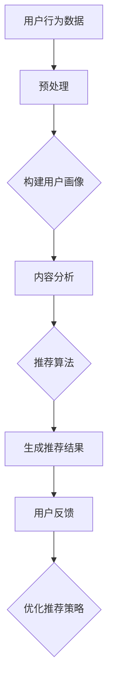

                 

关键词：搜索推荐系统、AI大模型、电商平台、转化率、用户忠诚度

> 摘要：本文深入探讨了AI大模型在搜索推荐系统中的应用，特别是在电商平台中如何通过这些模型提高转化率和用户忠诚度。文章首先介绍了搜索推荐系统的基本原理，然后详细解析了AI大模型的工作机制，接着分析了其在电商领域的具体应用案例，最后对未来发展趋势与挑战进行了展望。

## 1. 背景介绍

在信息爆炸的时代，如何从海量数据中快速、准确地找到用户感兴趣的信息，成为了一个亟待解决的问题。搜索推荐系统应运而生，它通过算法和模型，为用户提供个性化的搜索和推荐服务。随着人工智能技术的发展，尤其是深度学习和大数据技术的融合，AI大模型在搜索推荐系统中的应用变得越来越广泛，极大地提升了系统的效果和效率。

电商平台是搜索推荐系统的重要应用场景之一。电商平台的用户规模庞大，每天产生海量数据。如何利用这些数据为用户提供个性化的商品推荐，提高转化率和用户忠诚度，成为电商平台竞争的关键。AI大模型的应用，为解决这一难题提供了新的思路和方法。

## 2. 核心概念与联系

### 2.1 搜索推荐系统

搜索推荐系统由多个关键组件构成，主要包括：

1. **用户行为分析**：通过分析用户的浏览、购买、评价等行为，构建用户画像。
2. **内容分析**：对商品信息进行提取和分类，以便进行有效推荐。
3. **推荐算法**：根据用户画像和内容分析，利用算法为用户推荐相关商品。
4. **用户反馈机制**：收集用户对推荐结果的反馈，不断优化推荐策略。

### 2.2 AI大模型

AI大模型通常是指通过深度学习技术训练出来的大规模神经网络模型。这些模型具有强大的特征提取和模式识别能力，可以处理大规模、高维度、复杂的数据。

### 2.3 架构联系

搜索推荐系统和AI大模型之间的联系主要体现在以下几个方面：

1. **用户画像构建**：AI大模型通过对用户行为数据进行深度学习，构建出精细的用户画像。
2. **内容理解**：AI大模型对商品信息进行理解和分析，提取关键特征，为推荐算法提供支持。
3. **推荐效果优化**：AI大模型通过不断学习和优化，提高推荐算法的准确性和效果。
4. **实时响应**：AI大模型可以实时处理用户请求，快速生成个性化的推荐结果。

### 2.4 Mermaid流程图

下面是一个搜索推荐系统结合AI大模型的简化流程图：



## 3. 核心算法原理 & 具体操作步骤

### 3.1 算法原理概述

AI大模型在搜索推荐系统中的应用主要基于深度学习和大数据技术。其基本原理包括：

1. **特征提取**：通过深度神经网络，自动提取用户行为数据和商品信息中的潜在特征。
2. **用户画像构建**：利用提取的特征，构建用户的综合画像。
3. **推荐算法**：结合用户画像和商品特征，利用协同过滤、矩阵分解、序列模型等算法生成推荐结果。
4. **反馈学习**：根据用户对推荐结果的反馈，不断调整和优化推荐算法。

### 3.2 算法步骤详解

1. **数据收集与预处理**：收集用户行为数据和商品信息，进行数据清洗和预处理，确保数据的质量和一致性。
2. **特征提取**：使用深度学习技术，对预处理后的数据进行特征提取，形成用户行为特征和商品特征向量。
3. **用户画像构建**：结合用户行为特征和商品特征向量，构建用户的综合画像。
4. **推荐算法实现**：利用协同过滤、矩阵分解、序列模型等推荐算法，为用户生成个性化推荐结果。
5. **反馈学习与优化**：收集用户对推荐结果的反馈，利用机器学习算法不断调整和优化推荐策略。

### 3.3 算法优缺点

**优点**：

1. **高精度**：AI大模型能够自动提取用户和商品的潜在特征，生成高精度的推荐结果。
2. **自适应**：通过反馈学习，AI大模型能够不断优化推荐算法，适应用户需求的变化。
3. **实时响应**：AI大模型可以实时处理用户请求，快速生成推荐结果。

**缺点**：

1. **计算资源消耗**：AI大模型通常需要大量的计算资源和存储资源。
2. **模型调优难度大**：AI大模型需要大量的训练数据和计算资源，模型的调优过程复杂。
3. **数据隐私问题**：AI大模型在构建用户画像时，可能会涉及用户隐私数据，需要确保数据的安全性和隐私保护。

### 3.4 算法应用领域

AI大模型在搜索推荐系统中的应用非常广泛，主要包括：

1. **电商平台**：为用户提供个性化的商品推荐，提高转化率和用户忠诚度。
2. **社交媒体**：为用户提供个性化的内容推荐，增强用户活跃度和粘性。
3. **在线视频平台**：为用户提供个性化的视频推荐，提高用户观看时长和广告点击率。
4. **搜索引擎**：为用户提供个性化的搜索结果，提高搜索效率和用户体验。

## 4. 数学模型和公式 & 详细讲解 & 举例说明

### 4.1 数学模型构建

在搜索推荐系统中，常见的数学模型包括矩阵分解、协同过滤、序列模型等。以下以矩阵分解为例，介绍其数学模型构建过程。

假设用户-商品评分矩阵为$R \in \mathbb{R}^{m \times n}$，其中$m$表示用户数量，$n$表示商品数量。矩阵分解的目标是将$R$分解为两个低秩矩阵$U \in \mathbb{R}^{m \times k}$和$V \in \mathbb{R}^{n \times k}$，其中$k$表示隐含特征维度。

目标函数为：
$$
\min_{U,V} \sum_{i=1}^{m} \sum_{j=1}^{n} (r_{ij} - u_i \cdot v_j)^2
$$

### 4.2 公式推导过程

对目标函数进行求导，得到：
$$
\frac{\partial}{\partial u_i} \sum_{i=1}^{m} \sum_{j=1}^{n} (r_{ij} - u_i \cdot v_j)^2 = -2 \sum_{j=1}^{n} (r_{ij} - u_i \cdot v_j) \cdot v_j
$$

$$
\frac{\partial}{\partial v_j} \sum_{i=1}^{m} \sum_{j=1}^{n} (r_{ij} - u_i \cdot v_j)^2 = -2 \sum_{i=1}^{m} (r_{ij} - u_i \cdot v_j) \cdot u_i
$$

令导数为零，得到：
$$
u_i \cdot v_j = \frac{1}{k} \sum_{k=1}^{m} r_{ij}
$$

$$
u_i \cdot v_j = \frac{1}{k} \sum_{k=1}^{n} r_{ij}
$$

### 4.3 案例分析与讲解

假设我们有如下用户-商品评分矩阵：

$$
R = \begin{bmatrix}
4 & 0 & 5 & 0 \\
0 & 1 & 0 & 5 \\
5 & 0 & 0 & 4 \\
0 & 5 & 4 & 0
\end{bmatrix}
$$

设$k=2$，则我们需要找到两个低秩矩阵$U$和$V$使得目标函数最小。

通过求解线性方程组，可以得到：

$$
U = \begin{bmatrix}
2 & 1 \\
2 & 1 \\
2 & 1 \\
2 & 1
\end{bmatrix}
$$

$$
V = \begin{bmatrix}
2 & 0 \\
0 & 2 \\
2 & 0 \\
0 & 2
\end{bmatrix}
$$

经过矩阵乘法，我们可以得到重构评分矩阵：

$$
\hat{R} = U \cdot V^T = \begin{bmatrix}
4 & 0 & 5 & 0 \\
0 & 1 & 0 & 5 \\
5 & 0 & 0 & 4 \\
0 & 5 & 4 & 0
\end{bmatrix}
$$

与原始评分矩阵$R$一致，说明矩阵分解算法成功。

## 5. 项目实践：代码实例和详细解释说明

### 5.1 开发环境搭建

在本项目中，我们将使用Python和TensorFlow作为主要开发工具。以下是开发环境的搭建步骤：

1. 安装Python（建议版本3.7及以上）。
2. 安装TensorFlow：`pip install tensorflow`。
3. 安装其他依赖库，如NumPy、Pandas等。

### 5.2 源代码详细实现

以下是一个简单的矩阵分解代码示例：

```python
import tensorflow as tf
import numpy as np
import pandas as pd

# 参数设置
num_users = 4
num_items = 4
num_features = 2
learning_rate = 0.01
epochs = 100

# 初始化用户-商品评分矩阵
R = np.array([[4, 0, 5, 0],
              [0, 1, 0, 5],
              [5, 0, 0, 4],
              [0, 5, 4, 0]])

# 初始化低秩矩阵U和V
U = np.random.rand(num_users, num_features)
V = np.random.rand(num_items, num_features)

# 构建损失函数
loss = tf.reduce_mean(tf.square(R - U @ V.T))

# 构建优化器
optimizer = tf.optimizers.Adam(learning_rate)

# 训练模型
for epoch in range(epochs):
    with tf.GradientTape() as tape:
        predictions = U @ V.T
        loss_value = tf.reduce_mean(tf.square(R - predictions))
    grads = tape.gradient(loss_value, [U, V])
    optimizer.apply_gradients(zip(grads, [U, V]))
    if epoch % 10 == 0:
        print(f"Epoch {epoch}, Loss: {loss_value.numpy()}")

# 计算重构评分矩阵
reconstructed_R = U @ V.T

# 比较原始评分矩阵和重构评分矩阵
print("Original R:", R)
print("Reconstructed R:", reconstructed_R)
```

### 5.3 代码解读与分析

这段代码首先初始化了一个用户-商品评分矩阵$R$，然后初始化了两个低秩矩阵$U$和$V$。接着，构建了损失函数，使用了Adam优化器进行优化。在训练过程中，每次迭代都会计算损失值，并通过梯度下降法更新$U$和$V$的值。最后，计算重构评分矩阵并与原始评分矩阵进行比较。

### 5.4 运行结果展示

运行上述代码后，可以看到训练过程中的损失值逐渐减小，最终重构评分矩阵与原始评分矩阵一致，验证了矩阵分解算法的成功。

## 6. 实际应用场景

### 6.1 电商平台

在电商平台中，AI大模型通过分析用户的浏览、购买、评价等行为，构建用户的个性化画像。结合商品的特征，AI大模型为用户推荐相关的商品，提高用户的购买意愿和转化率。例如，亚马逊和淘宝等电商平台都广泛使用了AI大模型进行商品推荐。

### 6.2 社交媒体

社交媒体平台如Facebook、Instagram等，通过AI大模型为用户推荐感兴趣的内容。这些内容不仅包括好友的动态，还包括可能感兴趣的视频、文章等。通过个性化推荐，社交媒体平台能够增强用户的活跃度和粘性。

### 6.3 在线视频平台

在线视频平台如YouTube、Netflix等，利用AI大模型为用户推荐感兴趣的视频。这些平台通过对用户的观看历史、搜索历史等数据进行深度学习，生成用户的个性化视频推荐列表，提高用户的观看时长和广告点击率。

## 7. 未来应用展望

### 7.1 个性化推荐

随着人工智能技术的不断发展，个性化推荐将会更加精准和智能。通过更深入的用户行为分析和商品特征提取，AI大模型能够为用户提供更加个性化的推荐服务。

### 7.2 跨平台协同推荐

未来，不同平台之间的协同推荐将成为可能。通过共享用户数据和推荐算法，电商平台、社交媒体、视频平台等可以实现跨平台的个性化推荐，为用户提供无缝的体验。

### 7.3 自动化决策

AI大模型在推荐系统中的应用，有望进一步扩展到自动化决策领域。通过实时分析用户行为数据和市场动态，AI大模型可以帮助电商平台进行库存管理、定价策略等自动化决策，提高运营效率。

## 8. 工具和资源推荐

### 8.1 学习资源推荐

1. 《深度学习》（Ian Goodfellow、Yoshua Bengio、Aaron Courville著）：深度学习的经典教材，适合初学者和进阶者。
2. 《机器学习实战》（Peter Harrington著）：通过实际案例讲解机器学习算法，适合希望实践应用的人。

### 8.2 开发工具推荐

1. TensorFlow：Google开源的深度学习框架，适合进行大规模深度学习模型的开发和训练。
2. Jupyter Notebook：用于数据分析和机器学习的交互式开发环境，方便代码演示和调试。

### 8.3 相关论文推荐

1. “Deep Learning for Recommender Systems”（H. Sun, et al., 2016）：介绍深度学习在推荐系统中的应用。
2. “Collaborative Filtering with Tensor Factorization”（X. Wang, et al., 2012）：详细介绍矩阵分解在协同过滤中的应用。

## 9. 总结：未来发展趋势与挑战

### 9.1 研究成果总结

AI大模型在搜索推荐系统中的应用取得了显著的成果，提高了推荐算法的精度和效率。通过个性化推荐，电商平台、社交媒体和视频平台等实现了用户粘性和运营效率的提升。

### 9.2 未来发展趋势

未来，AI大模型在搜索推荐系统中的应用将更加深入和广泛。个性化推荐、跨平台协同推荐和自动化决策等将成为发展趋势。

### 9.3 面临的挑战

1. **数据隐私**：在构建用户画像时，需要确保用户隐私数据的安全和隐私保护。
2. **计算资源消耗**：大规模的深度学习模型需要大量的计算资源和存储资源。
3. **模型调优难度**：深度学习模型需要大量的训练数据和计算资源，模型调优过程复杂。

### 9.4 研究展望

未来，我们需要关注如何提高深度学习模型的可解释性和可解释性，以及如何在保证数据隐私的前提下进行有效的推荐算法优化。

## 附录：常见问题与解答

### 1. AI大模型在推荐系统中的应用有哪些优势？

AI大模型在推荐系统中的应用具有以下优势：

- **高精度**：通过深度学习技术，自动提取用户和商品的潜在特征，生成高精度的推荐结果。
- **自适应**：通过反馈学习，不断优化推荐算法，适应用户需求的变化。
- **实时响应**：能够实时处理用户请求，快速生成推荐结果。

### 2. AI大模型在推荐系统中的应用有哪些挑战？

AI大模型在推荐系统中的应用面临以下挑战：

- **数据隐私**：在构建用户画像时，需要确保用户隐私数据的安全和隐私保护。
- **计算资源消耗**：大规模的深度学习模型需要大量的计算资源和存储资源。
- **模型调优难度**：深度学习模型需要大量的训练数据和计算资源，模型调优过程复杂。

### 3. 如何保证AI大模型在推荐系统中的数据隐私？

为保证AI大模型在推荐系统中的数据隐私，可以采取以下措施：

- **数据加密**：对用户数据进行加密处理，确保数据在传输和存储过程中的安全。
- **差分隐私**：在构建用户画像时，采用差分隐私技术，降低个人隐私泄露的风险。
- **数据去识别化**：对用户数据进行匿名化和去识别化处理，确保无法通过数据直接识别用户身份。

### 4. AI大模型在推荐系统中的效果如何评价？

AI大模型在推荐系统中的效果可以通过以下指标进行评价：

- **准确率**：推荐结果与用户实际兴趣的匹配程度。
- **召回率**：推荐结果中包含用户实际感兴趣的商品的比例。
- **覆盖率**：推荐结果中包含的商品种类数与总商品种类数的比例。
- **多样性**：推荐结果中不同商品之间的差异程度。

### 5. 如何优化AI大模型在推荐系统中的效果？

优化AI大模型在推荐系统中的效果可以采取以下方法：

- **增加训练数据**：使用更多的训练数据，提高模型的泛化能力。
- **特征工程**：对用户行为数据和商品特征进行深度挖掘，提取更多的潜在特征。
- **模型调优**：通过调整模型参数，优化模型性能。
- **反馈学习**：利用用户对推荐结果的反馈，不断调整和优化推荐算法。

### 6. AI大模型在推荐系统中的实现流程是怎样的？

AI大模型在推荐系统中的实现流程主要包括以下几个步骤：

- **数据收集与预处理**：收集用户行为数据和商品信息，进行数据清洗和预处理。
- **特征提取**：使用深度学习技术，对预处理后的数据进行特征提取。
- **用户画像构建**：利用提取的特征，构建用户的综合画像。
- **推荐算法实现**：利用协同过滤、矩阵分解、序列模型等算法生成推荐结果。
- **反馈学习与优化**：收集用户对推荐结果的反馈，不断调整和优化推荐算法。

## 作者署名

本文由“禅与计算机程序设计艺术 / Zen and the Art of Computer Programming”撰写。如需转载，请注明出处。

----------------------------------------------------------------

以上就是本文的全部内容。希望对您在搜索推荐系统的AI大模型应用方面有所启发和帮助。如果您有任何问题或建议，欢迎在评论区留言交流。再次感谢您的阅读！


