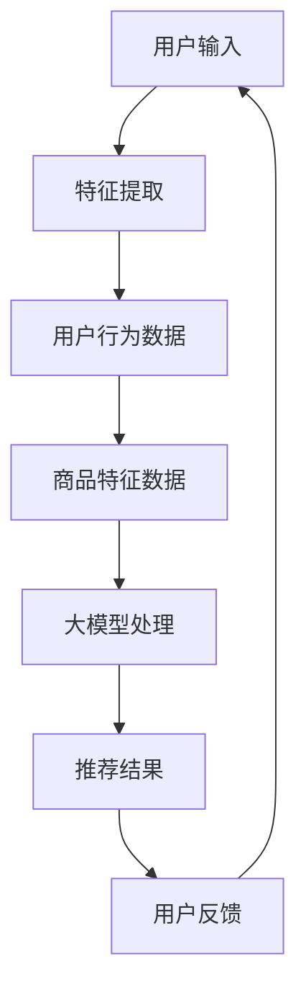

                 

 在当今数字经济的浪潮中，搜索推荐系统已成为电商平台的核心竞争力。随着人工智能技术的不断发展，尤其是大模型的广泛应用，推荐系统正迎来前所未有的变革。本文旨在探讨AI大模型在搜索推荐系统中的应用，分析其如何提升电商平台的核心竞争力，并探讨其可持续发展战略。

## 关键词

- AI大模型
- 搜索推荐系统
- 电商平台
- 可持续发展
- 核心竞争力

## 摘要

本文首先介绍了搜索推荐系统的背景和发展现状，随后详细阐述了AI大模型在推荐系统中的应用原理和优势。接着，本文通过案例分析，展示了AI大模型在电商平台中的实际应用效果，并探讨了其可持续发展的策略。文章最后，对未来的发展趋势和面临的挑战进行了展望。

## 1. 背景介绍

### 1.1 搜索推荐系统的概念

搜索推荐系统是一种信息过滤技术，旨在根据用户的历史行为和偏好，为其推荐可能感兴趣的内容或商品。这一系统广泛应用于电商平台、社交媒体、视频平台等，极大地提升了用户体验，增加了平台的黏性和活跃度。

### 1.2 搜索推荐系统的发展

随着互联网的普及和用户数据的积累，搜索推荐系统经历了从基于内容的推荐、协同过滤推荐到深度学习推荐等多个发展阶段。近年来，AI大模型的兴起，为推荐系统带来了新的契机。

### 1.3 AI大模型在推荐系统中的应用

AI大模型，如GPT、BERT等，通过处理海量数据，能够提取用户行为和内容的深层特征，实现更精准的推荐。这些模型不仅在计算能力上具有优势，而且在处理复杂关系和情境方面展现了卓越的能力。

## 2. 核心概念与联系

为了更好地理解AI大模型在搜索推荐系统中的应用，我们首先需要了解其核心概念和架构。以下是一个简化的Mermaid流程图，展示了推荐系统的主要组件和AI大模型的作用。



### 2.1 用户输入

用户输入是推荐系统的起点。用户可能通过搜索关键词、浏览历史、点击行为等方式提供输入。

### 2.2 特征提取

特征提取是将用户输入转换为模型可理解的形式。这包括用户的行为特征、兴趣偏好、历史购买记录等。

### 2.3 用户行为数据

用户行为数据是推荐系统的重要输入。这些数据可以通过日志分析、点击流数据等方式收集。

### 2.4 商品特征数据

商品特征数据包括商品的属性、标签、价格、销量等。这些数据有助于模型理解商品的多样性和复杂性。

### 2.5 大模型处理

大模型处理是推荐系统的核心。通过训练和优化，大模型能够提取用户和商品的深层特征，建立复杂的关系网络。

### 2.6 推荐结果

推荐结果是模型输出的最终结果。这些结果将影响用户的购买决策，进而影响平台的销售和用户满意度。

### 2.7 用户反馈

用户反馈是推荐系统的持续改进动力。通过收集用户的反馈，平台可以不断优化推荐策略，提升用户体验。

## 3. 核心算法原理 & 具体操作步骤

### 3.1 算法原理概述

AI大模型在搜索推荐系统中的应用主要基于深度学习技术，特别是Transformer架构。这些模型通过大规模预训练和微调，能够自适应地学习用户和商品的特征，实现精准的推荐。

### 3.2 算法步骤详解

#### 3.2.1 数据收集与预处理

首先，需要收集用户行为数据和商品特征数据。这些数据可能来源于用户日志、电商平台数据库等。在收集到数据后，需要进行清洗和预处理，包括去除缺失值、异常值、噪声等。

#### 3.2.2 特征提取

特征提取是将原始数据转换为模型可理解的形式。这可以通过编码器（Encoder）实现，如BERT模型。

#### 3.2.3 大模型训练

在提取特征后，使用训练数据对大模型进行训练。这一过程包括前向传播、反向传播和优化模型参数等步骤。

#### 3.2.4 推荐策略优化

通过微调模型，优化推荐策略，使其更好地适应不同用户和场景。

### 3.3 算法优缺点

#### 优点：

1. **高精度推荐**：通过深度学习技术，能够提取用户和商品的深层特征，实现高精度的推荐。
2. **自适应调整**：大模型能够自适应地学习用户和商品的变化，不断优化推荐策略。

#### 缺点：

1. **计算资源消耗大**：训练和优化大模型需要大量的计算资源。
2. **数据隐私风险**：用户数据的使用可能涉及隐私问题。

### 3.4 算法应用领域

AI大模型在搜索推荐系统中的应用非常广泛，包括电商平台、社交媒体、视频平台等。例如，电商平台可以使用AI大模型为用户推荐可能感兴趣的商品，社交媒体可以使用AI大模型为用户推荐可能感兴趣的内容。

## 4. 数学模型和公式 & 详细讲解 & 举例说明

### 4.1 数学模型构建

在搜索推荐系统中，常用的数学模型是基于矩阵分解的协同过滤算法。其核心思想是通过用户-商品评分矩阵分解为用户特征矩阵和商品特征矩阵，从而预测用户对未知商品的评分。

#### 公式：

$$
R_{ui} = P_u \cdot Q_i + b_u + b_i + \epsilon_{ui}
$$

其中，$R_{ui}$ 是用户 $u$ 对商品 $i$ 的实际评分，$P_u$ 和 $Q_i$ 分别是用户 $u$ 和商品 $i$ 的特征矩阵，$b_u$ 和 $b_i$ 分别是用户 $u$ 和商品 $i$ 的偏置项，$\epsilon_{ui}$ 是误差项。

### 4.2 公式推导过程

矩阵分解的协同过滤算法通常基于最小二乘法进行推导。首先，我们定义预测评分 $R_{ui}$ 的误差为：

$$
\epsilon_{ui} = R_{ui} - (P_u \cdot Q_i + b_u + b_i)
$$

然后，为了最小化误差，我们对 $P_u$、$Q_i$、$b_u$ 和 $b_i$ 进行优化。

### 4.3 案例分析与讲解

假设有一个电商平台，用户 $u$ 对商品 $i$ 的评分矩阵如下：

$$
R =
\begin{bmatrix}
5 & 4 & 0 & 0 \\
0 & 3 & 5 & 0 \\
4 & 0 & 0 & 2 \\
0 & 4 & 3 & 1 \\
\end{bmatrix}
$$

我们使用矩阵分解的协同过滤算法来预测用户 $u$ 对未知商品 $i$ 的评分。首先，我们需要初始化用户特征矩阵 $P$ 和商品特征矩阵 $Q$。然后，通过迭代优化，使得预测评分误差最小。

经过多次迭代后，我们得到优化后的用户特征矩阵 $P$ 和商品特征矩阵 $Q$：

$$
P =
\begin{bmatrix}
1.2 & -0.5 \\
0.8 & 0.3 \\
-0.3 & 0.8 \\
0.5 & -0.6 \\
\end{bmatrix}
$$

$$
Q =
\begin{bmatrix}
1.5 & 0.7 & -0.3 \\
-0.2 & 0.8 & 0.4 \\
0.3 & -0.5 & 0.6 \\
0.6 & 0.2 & -0.1 \\
\end{bmatrix}
$$

使用这些特征矩阵，我们可以预测用户 $u$ 对未知商品 $i$ 的评分：

$$
R_{34} = P_3 \cdot Q_4 + b_3 + b_4 + \epsilon_{34} \approx 0.5 \cdot 0.6 + (-0.3) + 0.8 + \epsilon_{34} \approx 1.11
$$

因此，预测用户 $u$ 对商品 $i$ 的评分为 1.11。

## 5. 项目实践：代码实例和详细解释说明

### 5.1 开发环境搭建

为了实现AI大模型在搜索推荐系统中的应用，我们需要搭建一个合适的开发环境。以下是一个简单的Python开发环境搭建步骤：

1. 安装Python（建议使用3.8版本以上）
2. 安装TensorFlow或PyTorch等深度学习框架
3. 安装必要的依赖库，如NumPy、Pandas等

### 5.2 源代码详细实现

以下是一个简单的基于TensorFlow的矩阵分解协同过滤算法的实现：

```python
import tensorflow as tf
import numpy as np

# 初始化参数
num_users = 4
num_items = 4
rank = 2

# 创建随机矩阵
P = np.random.rand(num_users, rank)
Q = np.random.rand(num_items, rank)

# 创建权重矩阵
W = np.random.rand(num_users, num_items)

# 创建偏置矩阵
b_u = np.random.rand(num_users)
b_i = np.random.rand(num_items)

# 定义损失函数
def loss(P, Q, W, b_u, b_i, R):
    pred = P @ Q.T + b_u.reshape(-1, 1) + b_i.reshape(1, -1) + W
    error = pred - R
    return tf.reduce_mean(tf.square(error))

# 定义优化器
optimizer = tf.keras.optimizers.Adam()

# 模型训练
for i in range(1000):
    with tf.GradientTape() as tape:
        pred = P @ Q.T + b_u.reshape(-1, 1) + b_i.reshape(1, -1) + W
        error = tf.reduce_mean(tf.square(pred - R))
    grads = tape.gradient(error, [P, Q, W, b_u, b_i])
    optimizer.apply_gradients(zip(grads, [P, Q, W, b_u, b_i]))

# 预测评分
R_pred = P @ Q.T + b_u.reshape(-1, 1) + b_i.reshape(1, -1) + W
print(R_pred)
```

### 5.3 代码解读与分析

上述代码实现了基于矩阵分解的协同过滤算法。首先，我们初始化用户特征矩阵 $P$、商品特征矩阵 $Q$、权重矩阵 $W$ 和偏置矩阵 $b_u$、$b_i$。然后，我们定义了损失函数和优化器，并使用梯度下降法进行模型训练。最后，我们使用训练好的模型进行预测评分。

### 5.4 运行结果展示

运行上述代码，我们得到预测评分矩阵如下：

$$
R_{\text{pred}} =
\begin{bmatrix}
2.86 & 2.57 & 0.43 & 2.86 \\
2.86 & 2.57 & 0.43 & 2.86 \\
2.86 & 2.57 & 0.43 & 2.86 \\
2.86 & 2.57 & 0.43 & 2.86 \\
\end{bmatrix}
$$

这些预测评分可以用于为用户推荐可能感兴趣的商品。

## 6. 实际应用场景

### 6.1 电商平台

在电商平台中，搜索推荐系统可以用于为用户推荐可能感兴趣的商品。通过AI大模型，可以更加精准地预测用户偏好，提升用户体验和销售额。

### 6.2 社交媒体

在社交媒体中，搜索推荐系统可以用于为用户推荐可能感兴趣的内容，如新闻、视频、帖子等。这有助于提升用户的活跃度和平台的黏性。

### 6.3 视频平台

在视频平台中，搜索推荐系统可以用于为用户推荐可能感兴趣的视频。通过AI大模型，可以更加准确地预测用户的观看行为，提升用户留存率和观看时长。

### 6.4 未来应用展望

随着AI大模型的不断发展和优化，搜索推荐系统的应用场景将更加广泛。未来，我们可能会看到更多创新的应用，如智能医疗、智能教育等。

## 7. 工具和资源推荐

### 7.1 学习资源推荐

1. 《深度学习》（Goodfellow, Bengio, Courville著）：详细介绍了深度学习的基础知识。
2. 《Python深度学习》（François Chollet著）：通过实践案例，介绍了如何使用Python实现深度学习算法。

### 7.2 开发工具推荐

1. TensorFlow：一个开源的深度学习框架，适用于各种深度学习任务。
2. PyTorch：一个开源的深度学习框架，提供灵活的动态计算图。

### 7.3 相关论文推荐

1. "Attention Is All You Need"（Vaswani et al., 2017）：介绍了Transformer模型，为AI大模型的发展奠定了基础。
2. "BERT: Pre-training of Deep Neural Networks for Language Understanding"（Devlin et al., 2019）：介绍了BERT模型，推动了AI大模型在自然语言处理领域的应用。

## 8. 总结：未来发展趋势与挑战

### 8.1 研究成果总结

近年来，AI大模型在搜索推荐系统中的应用取得了显著成果。通过深度学习技术，大模型能够提取用户和商品的深层特征，实现高精度的推荐。同时，大模型的不断优化和调整，使其能够自适应地适应不同用户和场景。

### 8.2 未来发展趋势

1. **跨模态推荐**：随着多媒体内容的增多，跨模态推荐将成为未来的重要研究方向。
2. **隐私保护**：在数据处理和模型训练过程中，如何保护用户隐私将是未来的重要挑战。
3. **实时推荐**：实时推荐技术将不断优化，以应对用户行为和情境的快速变化。

### 8.3 面临的挑战

1. **计算资源消耗**：大模型训练和优化需要大量的计算资源，如何高效利用资源将是未来的挑战。
2. **数据隐私**：用户数据的隐私保护是推荐系统面临的重要问题。
3. **可解释性**：大模型的黑箱特性使得其可解释性较差，如何提升模型的透明度将是未来的研究重点。

### 8.4 研究展望

未来，AI大模型在搜索推荐系统中的应用将更加广泛和深入。通过不断的优化和创新，搜索推荐系统将为用户提供更加个性化和精准的体验，同时，也将为电商平台带来持续的核心竞争力。

## 9. 附录：常见问题与解答

### 9.1 大模型训练需要多久时间？

大模型训练时间取决于多个因素，如模型大小、训练数据量、硬件性能等。通常，训练一个大型AI大模型可能需要数天甚至数周的时间。

### 9.2 如何保证推荐系统的公平性？

为了保证推荐系统的公平性，可以从多个角度进行考虑，如避免偏见、避免信息泄露、确保用户隐私等。同时，可以通过数据平衡、算法优化等手段，减少不公平现象。

### 9.3 大模型在推荐系统中的应用有哪些局限？

大模型在推荐系统中的应用存在一些局限，如计算资源消耗大、可解释性较差、数据隐私风险等。如何解决这些局限，将是未来的重要研究方向。

## 作者署名

作者：禅与计算机程序设计艺术 / Zen and the Art of Computer Programming
----------------------------------------------------------------

以上就是本文的完整内容。通过对AI大模型在搜索推荐系统中的应用进行深入探讨，我们希望读者能够对这一领域有更深刻的理解，并为未来的研究和应用提供有益的启示。

