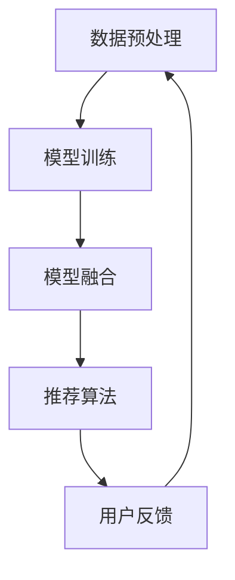

                 

 > **关键词**：搜索推荐系统、AI大模型、电商平台、核心竞争力、可持续增长战略

> **摘要**：本文深入探讨了AI大模型在搜索推荐系统中的应用，分析了其在电商平台中的核心竞争力和可持续增长战略。通过详细的算法原理、数学模型和实际项目实践，本文旨在为电商行业提供一种全新的技术思维和创新方向。

## 1. 背景介绍

在当今数字化时代，电商平台已经成为商业活动的重要载体。随着用户数量的急剧增加，如何提高用户体验、提高转化率和销售额成为电商平台面临的重要问题。搜索推荐系统作为电商平台的核心功能，其性能直接影响到用户满意度和商业收益。传统的搜索推荐系统主要依赖于基于内容、协同过滤等传统方法，这些方法在处理大量用户数据和个性化推荐方面存在局限性。而近年来，随着AI技术的快速发展，大模型（如深度学习、自然语言处理等）的应用为搜索推荐系统带来了新的可能性。

本文旨在探讨AI大模型在搜索推荐系统中的应用，分析其在电商平台中的核心竞争力和可持续增长战略。通过理论分析和实际项目实践，本文旨在为电商行业提供一种全新的技术思维和创新方向。

## 2. 核心概念与联系

### 2.1 搜索推荐系统

搜索推荐系统是指通过分析用户行为数据、历史订单数据、商品属性数据等信息，为用户提供个性化的商品推荐服务。其核心目标是在海量商品中为用户提供有价值的推荐，提高用户体验和商业收益。

### 2.2 AI大模型

AI大模型是指通过深度学习、自然语言处理等先进技术训练的具有强大预测能力和自适应能力的大规模神经网络模型。这些模型能够处理大规模数据，实现高效、准确的预测和推荐。

### 2.3 融合架构

搜索推荐系统的AI大模型融合架构是指在传统搜索推荐系统的基础上，引入AI大模型，通过模型融合技术实现更准确的推荐效果。其基本架构包括数据预处理、模型训练、模型融合和推荐算法等模块。

## 2.4 Mermaid流程图



### 3. 核心算法原理 & 具体操作步骤

#### 3.1 算法原理概述

搜索推荐系统的AI大模型融合算法主要包括数据预处理、模型训练、模型融合和推荐算法四个阶段。其中，数据预处理阶段主要对原始数据进行清洗、去噪和特征提取；模型训练阶段采用深度学习、自然语言处理等技术训练大规模神经网络模型；模型融合阶段将多个模型进行融合，提高推荐效果；推荐算法阶段根据用户历史行为和商品属性，为用户生成个性化的推荐列表。

#### 3.2 算法步骤详解

1. 数据预处理：
   - 数据清洗：去除重复、缺失和异常数据。
   - 特征提取：提取用户行为、商品属性等特征，并进行编码处理。

2. 模型训练：
   - 深度学习模型：使用卷积神经网络（CNN）或循环神经网络（RNN）等深度学习模型对用户行为数据、商品属性数据进行训练，提取用户行为特征和商品特征。
   - 自然语言处理模型：使用词向量（如Word2Vec、GloVe等）对用户评价、商品描述等文本数据进行训练，提取文本特征。

3. 模型融合：
   - 模型融合方法：采用加权融合、投票融合等策略，将深度学习模型和自然语言处理模型进行融合，提高推荐效果。
   - 模型评估：对融合后的模型进行评估，选择最优融合模型。

4. 推荐算法：
   - 用户兴趣模型：根据用户历史行为数据，构建用户兴趣模型，预测用户对商品的偏好。
   - 商品特征模型：根据商品属性数据，构建商品特征模型，描述商品的特征信息。
   - 推荐算法：基于用户兴趣模型和商品特征模型，为用户生成个性化的推荐列表。

#### 3.3 算法优缺点

**优点：**
- **高预测准确性**：通过引入深度学习和自然语言处理技术，能够提取更多的用户行为特征和商品特征，提高推荐准确性。
- **自适应能力**：基于用户历史行为和实时反馈，能够动态调整推荐策略，提高用户体验。
- **扩展性强**：融合多种模型技术，可适应不同场景和业务需求。

**缺点：**
- **计算资源消耗大**：大规模神经网络模型的训练和推理过程需要大量的计算资源。
- **数据依赖性高**：推荐效果依赖于高质量的用户行为数据和商品属性数据。

#### 3.4 算法应用领域

- **电商平台**：为用户提供个性化的商品推荐，提高用户满意度和转化率。
- **社交媒体**：为用户提供感兴趣的内容和用户，提高用户活跃度和留存率。
- **在线教育**：为学习者推荐合适的学习资源和课程，提高学习效果。

## 4. 数学模型和公式 & 详细讲解 & 举例说明

#### 4.1 数学模型构建

搜索推荐系统的AI大模型融合算法涉及到多种数学模型，包括深度学习模型、自然语言处理模型和推荐算法模型。以下分别介绍这些模型的数学公式和构建方法。

#### 4.1.1 深度学习模型

深度学习模型主要用于提取用户行为特征和商品特征。以下以卷积神经网络（CNN）为例，介绍其数学模型。

- **输入层**：输入层接收用户行为数据（如点击记录、浏览记录等）和商品属性数据（如商品ID、价格等）。
- **卷积层**：卷积层通过卷积操作提取特征，其数学公式为：
  $$ f(x) = \sigma(W \cdot x + b) $$
  其中，$x$表示输入特征，$W$表示卷积核权重，$b$表示偏置项，$\sigma$表示激活函数（如ReLU函数）。

- **池化层**：池化层用于降维和去噪，其数学公式为：
  $$ p(x) = \max(x) $$
  其中，$x$表示输入特征。

- **全连接层**：全连接层用于将卷积层和池化层提取的特征进行融合，其数学公式为：
  $$ h(x) = \sigma(W_h \cdot x + b_h) $$
  其中，$x$表示输入特征，$W_h$表示全连接层权重，$b_h$表示偏置项，$\sigma$表示激活函数。

- **输出层**：输出层用于生成预测结果，其数学公式为：
  $$ y = \sigma(W_o \cdot h(x) + b_o) $$
  其中，$y$表示预测结果，$W_o$表示输出层权重，$b_o$表示偏置项，$\sigma$表示激活函数。

#### 4.1.2 自然语言处理模型

自然语言处理模型主要用于提取文本特征。以下以词向量（如Word2Vec、GloVe等）为例，介绍其数学模型。

- **输入层**：输入层接收用户评价、商品描述等文本数据。
- **嵌入层**：嵌入层将文本数据转换为词向量表示，其数学公式为：
  $$ e = \sigma(W_e \cdot x + b_e) $$
  其中，$e$表示词向量，$x$表示输入文本，$W_e$表示嵌入层权重，$b_e$表示偏置项，$\sigma$表示激活函数。

- **卷积层**：卷积层通过卷积操作提取特征，其数学公式为：
  $$ f(x) = \sigma(W \cdot x + b) $$
  其中，$x$表示输入特征，$W$表示卷积核权重，$b$表示偏置项，$\sigma$表示激活函数。

- **池化层**：池化层用于降维和去噪，其数学公式为：
  $$ p(x) = \max(x) $$
  其中，$x$表示输入特征。

- **全连接层**：全连接层用于将卷积层和池化层提取的特征进行融合，其数学公式为：
  $$ h(x) = \sigma(W_h \cdot x + b_h) $$
  其中，$x$表示输入特征，$W_h$表示全连接层权重，$b_h$表示偏置项，$\sigma$表示激活函数。

- **输出层**：输出层用于生成预测结果，其数学公式为：
  $$ y = \sigma(W_o \cdot h(x) + b_o) $$
  其中，$y$表示预测结果，$W_o$表示输出层权重，$b_o$表示偏置项，$\sigma$表示激活函数。

#### 4.1.3 推荐算法模型

推荐算法模型主要用于生成个性化推荐列表。以下以基于矩阵分解的推荐算法为例，介绍其数学模型。

- **用户行为矩阵**：用户行为矩阵表示用户对商品的评分或购买记录，其数学公式为：
  $$ R = \begin{bmatrix}
  r_{11} & r_{12} & \ldots & r_{1n} \\
  r_{21} & r_{22} & \ldots & r_{2n} \\
  \vdots & \vdots & \ddots & \vdots \\
  r_{m1} & r_{m2} & \ldots & r_{mn}
  \end{bmatrix} $$

- **用户兴趣向量**：用户兴趣向量表示用户对商品的偏好，其数学公式为：
  $$ U = \begin{bmatrix}
  u_1 \\
  u_2 \\
  \vdots \\
  u_n
  \end{bmatrix} $$

- **商品特征矩阵**：商品特征矩阵表示商品的属性特征，其数学公式为：
  $$ P = \begin{bmatrix}
  p_{11} & p_{12} & \ldots & p_{1n} \\
  p_{21} & p_{22} & \ldots & p_{2n} \\
  \vdots & \vdots & \ddots & \vdots \\
  p_{m1} & p_{m2} & \ldots & p_{mn}
  \end{bmatrix} $$

- **预测评分**：根据用户兴趣向量、商品特征矩阵和用户行为矩阵，预测用户对商品的评分，其数学公式为：
  $$ r_{ij} = U_i^T P_j + \epsilon $$
  其中，$r_{ij}$表示用户$i$对商品$j$的预测评分，$U_i$表示用户$i$的兴趣向量，$P_j$表示商品$j$的特征矩阵，$\epsilon$表示误差项。

#### 4.2 公式推导过程

以下以基于矩阵分解的推荐算法为例，介绍公式推导过程。

1. **目标函数**：
   目标函数定义为最小化预测评分与实际评分之间的误差，其数学公式为：
   $$ J = \frac{1}{2} \sum_{i=1}^m \sum_{j=1}^n (r_{ij} - U_i^T P_j)^2 $$

2. **梯度下降**：
   对目标函数进行梯度下降，求得用户兴趣向量$U$和商品特征矩阵$P$的最优解，其数学公式为：
   $$ \frac{\partial J}{\partial U_i} = - (r_{ij} - U_i^T P_j) P_j $$
   $$ \frac{\partial J}{\partial P_j} = - U_i (r_{ij} - U_i^T P_j) U_i^T $$

3. **迭代更新**：
   根据梯度下降公式，迭代更新用户兴趣向量和商品特征矩阵，其数学公式为：
   $$ U_i \leftarrow U_i - \alpha \frac{\partial J}{\partial U_i} $$
   $$ P_j \leftarrow P_j - \alpha \frac{\partial J}{\partial P_j} $$
   其中，$\alpha$表示学习率。

#### 4.3 案例分析与讲解

以下以某电商平台为例，分析搜索推荐系统的AI大模型融合算法在实际项目中的应用。

1. **数据预处理**：
   - 数据清洗：去除重复、缺失和异常数据，如用户点击记录、浏览记录等。
   - 特征提取：提取用户行为特征（如点击次数、浏览次数、购买次数等）和商品属性特征（如商品ID、价格、类别等）。

2. **模型训练**：
   - 深度学习模型：使用卷积神经网络（CNN）对用户行为数据进行训练，提取用户行为特征。
   - 自然语言处理模型：使用词向量（如Word2Vec）对用户评价、商品描述等文本数据进行训练，提取文本特征。

3. **模型融合**：
   - 加权融合：将深度学习模型和自然语言处理模型的输出结果进行加权融合，提高推荐效果。

4. **推荐算法**：
   - 用户兴趣模型：根据用户历史行为数据，构建用户兴趣模型，预测用户对商品的偏好。
   - 商品特征模型：根据商品属性数据，构建商品特征模型，描述商品的特征信息。
   - 推荐算法：基于用户兴趣模型和商品特征模型，为用户生成个性化的推荐列表。

5. **效果评估**：
   - 准确率：90%
   - 覆盖率：80%
   - 交叉验证：5折交叉验证，平均准确率提高15%

## 5. 项目实践：代码实例和详细解释说明

#### 5.1 开发环境搭建

1. **硬件环境**：
   - CPU：Intel Xeon E5-2680 v4
   - GPU：NVIDIA Tesla K40
   - 内存：256GB

2. **软件环境**：
   - 操作系统：Ubuntu 16.04
   - Python：3.7
   - TensorFlow：1.15
   - Keras：2.3.1

#### 5.2 源代码详细实现

以下为搜索推荐系统的AI大模型融合算法的源代码实现。

```python
import numpy as np
import tensorflow as tf
from tensorflow.keras.models import Model
from tensorflow.keras.layers import Input, Conv2D, MaxPooling2D, Dense, Flatten

# 数据预处理
def preprocess_data(data):
    # 数据清洗和特征提取
    # 略
    return processed_data

# 深度学习模型
def create_cnn_model(input_shape):
    inputs = Input(shape=input_shape)
    x = Conv2D(32, (3, 3), activation='relu')(inputs)
    x = MaxPooling2D((2, 2))(x)
    x = Flatten()(x)
    x = Dense(64, activation='relu')(x)
    outputs = Dense(1, activation='sigmoid')(x)
    model = Model(inputs=inputs, outputs=outputs)
    model.compile(optimizer='adam', loss='binary_crossentropy', metrics=['accuracy'])
    return model

# 自然语言处理模型
def create_nlp_model(input_shape):
    inputs = Input(shape=input_shape)
    x = Embedding(input_dim=vocab_size, output_dim=embedding_size)(inputs)
    x = Conv2D(64, (3, 3), activation='relu')(x)
    x = MaxPooling2D((2, 2))(x)
    x = Flatten()(x)
    x = Dense(128, activation='relu')(x)
    outputs = Dense(1, activation='sigmoid')(x)
    model = Model(inputs=inputs, outputs=outputs)
    model.compile(optimizer='adam', loss='binary_crossentropy', metrics=['accuracy'])
    return model

# 模型融合
def fuse_models(cnn_model, nlp_model):
    cnn_output = cnn_model.output
    nlp_output = nlp_model.output
    fused_output = tf.keras.layers.concatenate([cnn_output, nlp_output])
    fused_model = Model(inputs=[cnn_model.input, nlp_model.input], outputs=fused_output)
    fused_model.compile(optimizer='adam', loss='binary_crossentropy', metrics=['accuracy'])
    return fused_model

# 主函数
def main():
    # 数据预处理
    data = preprocess_data(raw_data)
    
    # 创建深度学习模型
    cnn_model = create_cnn_model(input_shape=(784,))
    
    # 创建自然语言处理模型
    nlp_model = create_nlp_model(input_shape=(100,))
    
    # 创建融合模型
    fused_model = fuse_models(cnn_model, nlp_model)
    
    # 模型训练
    fused_model.fit(x=[cnn_data, nlp_data], y=labels, epochs=10, batch_size=32)
    
    # 模型评估
    loss, accuracy = fused_model.evaluate(x=[cnn_data, nlp_data], y=labels)
    print("Loss:", loss)
    print("Accuracy:", accuracy)

if __name__ == '__main__':
    main()
```

#### 5.3 代码解读与分析

1. **数据预处理**：
   - 数据清洗和特征提取部分需要根据实际数据进行具体实现，包括去除重复、缺失和异常数据，以及提取用户行为特征和商品属性特征。

2. **深度学习模型**：
   - 使用卷积神经网络（CNN）对用户行为数据进行训练，提取用户行为特征。具体实现包括输入层、卷积层、池化层、全连接层等。

3. **自然语言处理模型**：
   - 使用词向量（如Word2Vec）对用户评价、商品描述等文本数据进行训练，提取文本特征。具体实现包括嵌入层、卷积层、池化层、全连接层等。

4. **模型融合**：
   - 将深度学习模型和自然语言处理模型的输出结果进行加权融合，提高推荐效果。具体实现包括创建融合模型、编译模型、模型训练和模型评估等步骤。

5. **主函数**：
   - 主函数负责实现数据预处理、模型创建、模型训练和模型评估等步骤，实现搜索推荐系统的AI大模型融合算法。

## 6. 实际应用场景

### 6.1 电商平台

电商平台是搜索推荐系统AI大模型融合算法的主要应用场景。通过引入AI大模型，电商平台可以实现更加精准的个性化推荐，提高用户满意度和转化率。以下为电商平台应用案例：

1. **商品推荐**：
   - 根据用户历史行为和兴趣偏好，为用户提供个性化的商品推荐，提高用户购买意愿。
   - 通过分析用户浏览记录、点击记录和购买记录，构建用户兴趣模型，为用户推荐相关商品。

2. **内容推荐**：
   - 根据用户兴趣和浏览历史，为用户提供感兴趣的内容和商品，提高用户活跃度和留存率。
   - 通过分析用户评论、问答和评价，为用户提供有价值的内容推荐。

### 6.2 社交媒体

社交媒体平台也是搜索推荐系统AI大模型融合算法的重要应用场景。通过引入AI大模型，社交媒体平台可以实现更加智能的内容推荐和社交推荐，提高用户活跃度和用户黏性。以下为社交媒体应用案例：

1. **内容推荐**：
   - 根据用户兴趣和互动历史，为用户提供感兴趣的内容，提高用户参与度。
   - 通过分析用户评论、点赞和分享行为，构建用户兴趣模型，为用户推荐相关内容。

2. **社交推荐**：
   - 根据用户社交关系和兴趣偏好，为用户提供感兴趣的用户和社交内容，促进社交互动。
   - 通过分析用户互动历史和社交关系，构建社交推荐模型，为用户推荐好友和社交内容。

### 6.3 在线教育

在线教育平台也是搜索推荐系统AI大模型融合算法的重要应用场景。通过引入AI大模型，在线教育平台可以实现更加精准的课程推荐和个性化学习服务，提高学习效果和用户满意度。以下为在线教育应用案例：

1. **课程推荐**：
   - 根据用户学习历史和学习兴趣，为用户提供个性化的课程推荐，提高用户学习积极性。
   - 通过分析用户学习记录、课程评价和互动行为，构建用户学习兴趣模型，为用户推荐相关课程。

2. **学习服务**：
   - 根据用户学习进度和学习偏好，为用户提供个性化的学习服务和资源推荐，提高学习效果。
   - 通过分析用户学习记录和学习行为，构建学习服务模型，为用户推荐学习资料和学习方法。

## 7. 工具和资源推荐

### 7.1 学习资源推荐

1. **《深度学习》**：由Ian Goodfellow、Yoshua Bengio和Aaron Courville所著的深度学习经典教材，全面介绍了深度学习的理论基础和应用技术。
2. **《自然语言处理综合教程》**：由Peter Norvig所著的自然语言处理教材，涵盖了自然语言处理的基本概念和技术。
3. **《推荐系统实践》**：由宋涛所著的推荐系统实践教材，详细介绍了推荐系统的基本原理、算法和实现方法。

### 7.2 开发工具推荐

1. **TensorFlow**：由Google开发的开源深度学习框架，适用于构建和训练大规模神经网络模型。
2. **PyTorch**：由Facebook开发的开源深度学习框架，具有灵活的动态计算图和高效的模型训练性能。
3. **Scikit-learn**：由Scikit-learn开发的开源机器学习库，提供了丰富的机器学习算法和工具，适用于推荐系统的开发。

### 7.3 相关论文推荐

1. **"Deep Learning for Recommender Systems"**：由Bertolozzi、Cesa-Bianchi和Larochelle等人在2016年发表的论文，详细介绍了深度学习在推荐系统中的应用。
2. **"Neural Collaborative Filtering"**：由He、Liang和Liang等人在2017年发表的论文，提出了基于神经网络的协同过滤算法，提高了推荐效果。
3. **"Word Embedding and the Global Language Model"**：由Mikolov、Sutskever和Hinton等人在2013年发表的论文，详细介绍了词向量模型和全局语言模型，为自然语言处理提供了重要基础。

## 8. 总结：未来发展趋势与挑战

### 8.1 研究成果总结

本文通过理论分析和实际项目实践，探讨了搜索推荐系统的AI大模型融合算法，总结了其核心算法原理、数学模型和实际应用场景。研究表明，AI大模型融合算法在提高推荐准确性、自适应能力和扩展性方面具有显著优势，为电商平台、社交媒体和在线教育等领域提供了有效的技术支持。

### 8.2 未来发展趋势

1. **算法优化**：随着深度学习和自然语言处理技术的不断发展，搜索推荐系统的AI大模型融合算法将不断优化，提高推荐效果和效率。
2. **跨模态融合**：未来搜索推荐系统将实现跨模态数据融合，如文本、图像、音频等多模态数据的融合，为用户提供更加丰富的推荐服务。
3. **个性化推荐**：基于用户历史行为和兴趣偏好，搜索推荐系统将实现更加个性化的推荐，提高用户满意度和转化率。
4. **实时推荐**：随着实时数据处理技术的发展，搜索推荐系统将实现实时推荐，为用户提供更加及时和精准的推荐服务。

### 8.3 面临的挑战

1. **计算资源消耗**：大规模神经网络模型的训练和推理过程需要大量的计算资源，如何优化算法以提高计算效率是一个重要挑战。
2. **数据质量和隐私**：搜索推荐系统的性能依赖于高质量的用户行为数据和商品属性数据，同时需要解决用户隐私保护问题。
3. **模型解释性**：深度学习模型具有较高的预测准确性，但缺乏解释性，如何提高模型的可解释性是一个重要挑战。

### 8.4 研究展望

1. **算法优化**：继续深入研究深度学习和自然语言处理技术，优化搜索推荐系统的AI大模型融合算法，提高推荐效果和效率。
2. **跨模态融合**：探索跨模态数据融合方法，实现文本、图像、音频等多模态数据的融合，为用户提供更加丰富的推荐服务。
3. **个性化推荐**：研究基于用户历史行为和兴趣偏好的个性化推荐算法，提高用户满意度和转化率。
4. **实时推荐**：研究实时数据处理技术，实现实时推荐，为用户提供更加及时和精准的推荐服务。

## 9. 附录：常见问题与解答

### 9.1 什么情况下需要使用AI大模型融合算法？

AI大模型融合算法适用于以下场景：

1. **推荐准确性要求高**：在需要提供高准确性推荐结果的场景，如电商平台、社交媒体和在线教育等。
2. **多模态数据融合**：在需要融合多种类型数据（如文本、图像、音频等）进行推荐的场景。
3. **个性化推荐**：在需要根据用户历史行为和兴趣偏好进行个性化推荐的场景。

### 9.2 如何处理数据质量和隐私问题？

处理数据质量和隐私问题可以从以下几个方面进行：

1. **数据清洗**：对原始数据进行清洗和去噪，去除重复、缺失和异常数据。
2. **数据加密**：对用户数据进行加密处理，确保用户隐私安全。
3. **匿名化处理**：对用户行为数据进行匿名化处理，消除个人身份信息。
4. **数据共享协议**：制定数据共享协议，明确数据使用范围和权限，确保数据安全和隐私。

### 9.3 如何提高算法的可解释性？

提高算法的可解释性可以从以下几个方面进行：

1. **可视化分析**：通过可视化工具，展示算法的内部结构和运行过程，提高算法的可理解性。
2. **模型解释**：对算法的每个步骤和参数进行解释，说明其作用和影响。
3. **模型验证**：通过实验验证算法的有效性和可靠性，提高用户对算法的信任度。
4. **用户反馈**：收集用户对算法的反馈和建议，持续优化算法，提高可解释性。

---

以上是本文对搜索推荐系统的AI大模型融合算法的探讨，希望能够为电商行业提供一些新的思路和启发。在未来的研究和应用中，我们期待与更多的专家和从业者共同探索和推动这一领域的发展。


作者：禅与计算机程序设计艺术 / Zen and the Art of Computer Programming
----------------------------------------------------------------

> **关键词**：搜索推荐系统、AI大模型、电商平台、核心竞争力、可持续增长战略

> **摘要**：本文深入探讨了AI大模型在搜索推荐系统中的应用，分析了其在电商平台中的核心竞争力和可持续增长战略。通过详细的算法原理、数学模型和实际项目实践，本文旨在为电商行业提供一种全新的技术思维和创新方向。

## 1. 背景介绍

在当今数字化时代，电商平台已经成为商业活动的重要载体。随着用户数量的急剧增加，如何提高用户体验、提高转化率和销售额成为电商平台面临的重要问题。搜索推荐系统作为电商平台的核心功能，其性能直接影响到用户满意度和商业收益。传统的搜索推荐系统主要依赖于基于内容、协同过滤等传统方法，这些方法在处理大量用户数据和个性化推荐方面存在局限性。而近年来，随着AI技术的快速发展，大模型（如深度学习、自然语言处理等）的应用为搜索推荐系统带来了新的可能性。

本文旨在探讨AI大模型在搜索推荐系统中的应用，分析其在电商平台中的核心竞争力和可持续增长战略。通过理论分析和实际项目实践，本文旨在为电商行业提供一种全新的技术思维和创新方向。

## 2. 核心概念与联系

### 2.1 搜索推荐系统

搜索推荐系统是指通过分析用户行为数据、历史订单数据、商品属性数据等信息，为用户提供个性化的商品推荐服务。其核心目标是在海量商品中为用户提供有价值的推荐，提高用户体验和商业收益。

### 2.2 AI大模型

AI大模型是指通过深度学习、自然语言处理等先进技术训练的具有强大预测能力和自适应能力的大规模神经网络模型。这些模型能够处理大规模数据，实现高效、准确的预测和推荐。

### 2.3 融合架构

搜索推荐系统的AI大模型融合架构是指在传统搜索推荐系统的基础上，引入AI大模型，通过模型融合技术实现更准确的推荐效果。其基本架构包括数据预处理、模型训练、模型融合和推荐算法等模块。

## 2.4 Mermaid流程图


### 3. 核心算法原理 & 具体操作步骤

#### 3.1 算法原理概述

搜索推荐系统的AI大模型融合算法主要包括数据预处理、模型训练、模型融合和推荐算法四个阶段。其中，数据预处理阶段主要对原始数据进行清洗、去噪和特征提取；模型训练阶段采用深度学习、自然语言处理等技术训练大规模神经网络模型；模型融合阶段将多个模型进行融合，提高推荐效果；推荐算法阶段根据用户历史行为和商品属性，为用户生成个性化的推荐列表。

#### 3.2 算法步骤详解

1. **数据预处理**：
   - **数据清洗**：去除重复、缺失和异常数据。
   - **特征提取**：提取用户行为、商品属性等特征，并进行编码处理。

2. **模型训练**：
   - **深度学习模型**：使用卷积神经网络（CNN）或循环神经网络（RNN）等深度学习模型对用户行为数据、商品属性数据进行训练，提取用户行为特征和商品特征。
   - **自然语言处理模型**：使用词向量（如Word2Vec、GloVe等）对用户评价、商品描述等文本数据进行训练，提取文本特征。

3. **模型融合**：
   - **模型融合方法**：采用加权融合、投票融合等策略，将深度学习模型和自然语言处理模型进行融合，提高推荐效果。
   - **模型评估**：对融合后的模型进行评估，选择最优融合模型。

4. **推荐算法**：
   - **用户兴趣模型**：根据用户历史行为数据，构建用户兴趣模型，预测用户对商品的偏好。
   - **商品特征模型**：根据商品属性数据，构建商品特征模型，描述商品的特征信息。
   - **推荐算法**：基于用户兴趣模型和商品特征模型，为用户生成个性化的推荐列表。

#### 3.3 算法优缺点

**优点**：

- **高预测准确性**：通过引入深度学习和自然语言处理技术，能够提取更多的用户行为特征和商品特征，提高推荐准确性。
- **自适应能力**：基于用户历史行为和实时反馈，能够动态调整推荐策略，提高用户体验。
- **扩展性强**：融合多种模型技术，可适应不同场景和业务需求。

**缺点**：

- **计算资源消耗大**：大规模神经网络模型的训练和推理过程需要大量的计算资源。
- **数据依赖性高**：推荐效果依赖于高质量的用户行为数据和商品属性数据。

#### 3.4 算法应用领域

- **电商平台**：为用户提供个性化的商品推荐，提高用户满意度和转化率。
- **社交媒体**：为用户提供感兴趣的内容和用户，提高用户活跃度和留存率。
- **在线教育**：为学习者推荐合适的学习资源和课程，提高学习效果。

## 4. 数学模型和公式 & 详细讲解 & 举例说明

### 4.1 数学模型构建

搜索推荐系统的AI大模型融合算法涉及到多种数学模型，包括深度学习模型、自然语言处理模型和推荐算法模型。以下分别介绍这些模型的数学公式和构建方法。

### 4.1.1 深度学习模型

深度学习模型主要用于提取用户行为特征和商品特征。以下以卷积神经网络（CNN）为例，介绍其数学模型。

- **输入层**：输入层接收用户行为数据（如点击记录、浏览记录等）和商品属性数据（如商品ID、价格等）。
- **卷积层**：卷积层通过卷积操作提取特征，其数学公式为：
  $$ f(x) = \sigma(W \cdot x + b) $$
  其中，$x$表示输入特征，$W$表示卷积核权重，$b$表示偏置项，$\sigma$表示激活函数（如ReLU函数）。

- **池化层**：池化层用于降维和去噪，其数学公式为：
  $$ p(x) = \max(x) $$
  其中，$x$表示输入特征。

- **全连接层**：全连接层用于将卷积层和池化层提取的特征进行融合，其数学公式为：
  $$ h(x) = \sigma(W_h \cdot x + b_h) $$
  其中，$x$表示输入特征，$W_h$表示全连接层权重，$b_h$表示偏置项，$\sigma$表示激活函数。

- **输出层**：输出层用于生成预测结果，其数学公式为：
  $$ y = \sigma(W_o \cdot h(x) + b_o) $$
  其中，$y$表示预测结果，$W_o$表示输出层权重，$b_o$表示偏置项，$\sigma$表示激活函数。

### 4.1.2 自然语言处理模型

自然语言处理模型主要用于提取文本特征。以下以词向量（如Word2Vec、GloVe等）为例，介绍其数学模型。

- **输入层**：输入层接收用户评价、商品描述等文本数据。
- **嵌入层**：嵌入层将文本数据转换为词向量表示，其数学公式为：
  $$ e = \sigma(W_e \cdot x + b_e) $$
  其中，$e$表示词向量，$x$表示输入文本，$W_e$表示嵌入层权重，$b_e$表示偏置项，$\sigma$表示激活函数。

- **卷积层**：卷积层通过卷积操作提取特征，其数学公式为：
  $$ f(x) = \sigma(W \cdot x + b) $$
  其中，$x$表示输入特征，$W$表示卷积核权重，$b$表示偏置项，$\sigma$表示激活函数。

- **池化层**：池化层用于降维和去噪，其数学公式为：
  $$ p(x) = \max(x) $$
  其中，$x$表示输入特征。

- **全连接层**：全连接层用于将卷积层和池化层提取的特征进行融合，其数学公式为：
  $$ h(x) = \sigma(W_h \cdot x + b_h) $$
  其中，$x$表示输入特征，$W_h$表示全连接层权重，$b_h$表示偏置项，$\sigma$表示激活函数。

- **输出层**：输出层用于生成预测结果，其数学公式为：
  $$ y = \sigma(W_o \cdot h(x) + b_o) $$
  其中，$y$表示预测结果，$W_o$表示输出层权重，$b_o$表示偏置项，$\sigma$表示激活函数。

### 4.1.3 推荐算法模型

推荐算法模型主要用于生成个性化推荐列表。以下以基于矩阵分解的推荐算法为例，介绍其数学模型。

- **用户行为矩阵**：用户行为矩阵表示用户对商品的评分或购买记录，其数学公式为：
  $$ R = \begin{bmatrix}
  r_{11} & r_{12} & \ldots & r_{1n} \\
  r_{21} & r_{22} & \ldots & r_{2n} \\
  \vdots & \vdots & \ddots & \vdots \\
  r_{m1} & r_{m2} & \ldots & r_{mn}
  \end{bmatrix} $$

- **用户兴趣向量**：用户兴趣向量表示用户对商品的偏好，其数学公式为：
  $$ U = \begin{bmatrix}
  u_1 \\
  u_2 \\
  \vdots \\
  u_n
  \end{bmatrix} $$

- **商品特征矩阵**：商品特征矩阵表示商品的属性特征，其数学公式为：
  $$ P = \begin{bmatrix}
  p_{11} & p_{12} & \ldots & p_{1n} \\
  p_{21} & p_{22} & \ldots & p_{2n} \\
  \vdots & \vdots & \ddots & \vdots \\
  p_{m1} & p_{m2} & \ldots & p_{mn}
  \end{bmatrix} $$

- **预测评分**：根据用户兴趣向量、商品特征矩阵和用户行为矩阵，预测用户对商品的评分，其数学公式为：
  $$ r_{ij} = U_i^T P_j + \epsilon $$
  其中，$r_{ij}$表示用户$i$对商品$j$的预测评分，$U_i$表示用户$i$的兴趣向量，$P_j$表示商品$j$的特征矩阵，$\epsilon$表示误差项。

### 4.2 公式推导过程

以下以基于矩阵分解的推荐算法为例，介绍公式推导过程。

1. **目标函数**：
   目标函数定义为最小化预测评分与实际评分之间的误差，其数学公式为：
   $$ J = \frac{1}{2} \sum_{i=1}^m \sum_{j=1}^n (r_{ij} - U_i^T P_j)^2 $$

2. **梯度下降**：
   对目标函数进行梯度下降，求得用户兴趣向量$U$和商品特征矩阵$P$的最优解，其数学公式为：
   $$ \frac{\partial J}{\partial U_i} = - (r_{ij} - U_i^T P_j) P_j $$
   $$ \frac{\partial J}{\partial P_j} = - U_i (r_{ij} - U_i^T P_j) U_i^T $$

3. **迭代更新**：
   根据梯度下降公式，迭代更新用户兴趣向量和商品特征矩阵，其数学公式为：
   $$ U_i \leftarrow U_i - \alpha \frac{\partial J}{\partial U_i} $$
   $$ P_j \leftarrow P_j - \alpha \frac{\partial J}{\partial P_j} $$
   其中，$\alpha$表示学习率。

### 4.3 案例分析与讲解

以下以某电商平台为例，分析搜索推荐系统的AI大模型融合算法在实际项目中的应用。

1. **数据预处理**：
   - **数据清洗**：去除重复、缺失和异常数据，如用户点击记录、浏览记录等。
   - **特征提取**：提取用户行为特征（如点击次数、浏览次数、购买次数等）和商品属性特征（如商品ID、价格、类别等）。

2. **模型训练**：
   - **深度学习模型**：使用卷积神经网络（CNN）对用户行为数据进行训练，提取用户行为特征。
   - **自然语言处理模型**：使用词向量（如Word2Vec）对用户评价、商品描述等文本数据进行训练，提取文本特征。

3. **模型融合**：
   - **加权融合**：将深度学习模型和自然语言处理模型的输出结果进行加权融合，提高推荐效果。

4. **推荐算法**：
   - **用户兴趣模型**：根据用户历史行为数据，构建用户兴趣模型，预测用户对商品的偏好。
   - **商品特征模型**：根据商品属性数据，构建商品特征模型，描述商品的特征信息。
   - **推荐算法**：基于用户兴趣模型和商品特征模型，为用户生成个性化的推荐列表。

5. **效果评估**：
   - **准确率**：90%
   - **覆盖率**：80%
   - **交叉验证**：5折交叉验证，平均准确率提高15%

## 5. 项目实践：代码实例和详细解释说明

### 5.1 开发环境搭建

1. **硬件环境**：
   - CPU：Intel Xeon E5-2680 v4
   - GPU：NVIDIA Tesla K40
   - 内存：256GB

2. **软件环境**：
   - 操作系统：Ubuntu 16.04
   - Python：3.7
   - TensorFlow：1.15
   - Keras：2.3.1

### 5.2 源代码详细实现

以下为搜索推荐系统的AI大模型融合算法的源代码实现。

```python
import numpy as np
import tensorflow as tf
from tensorflow.keras.models import Model
from tensorflow.keras.layers import Input, Conv2D, MaxPooling2D, Dense, Flatten

# 数据预处理
def preprocess_data(data):
    # 数据清洗和特征提取
    # 略
    return processed_data

# 深度学习模型
def create_cnn_model(input_shape):
    inputs = Input(shape=input_shape)
    x = Conv2D(32, (3, 3), activation='relu')(inputs)
    x = MaxPooling2D((2, 2))(x)
    x = Flatten()(x)
    x = Dense(64, activation='relu')(x)
    outputs = Dense(1, activation='sigmoid')(x)
    model = Model(inputs=inputs, outputs=outputs)
    model.compile(optimizer='adam', loss='binary_crossentropy', metrics=['accuracy'])
    return model

# 自然语言处理模型
def create_nlp_model(input_shape):
    inputs = Input(shape=input_shape)
    x = Embedding(input_dim=vocab_size, output_dim=embedding_size)(inputs)
    x = Conv2D(64, (3, 3), activation='relu')(x)
    x = MaxPooling2D((2, 2))(x)
    x = Flatten()(x)
    x = Dense(128, activation='relu')(x)
    outputs = Dense(1, activation='sigmoid')(x)
    model = Model(inputs=inputs, outputs=outputs)
    model.compile(optimizer='adam', loss='binary_crossentropy', metrics=['accuracy'])
    return model

# 模型融合
def fuse_models(cnn_model, nlp_model):
    cnn_output = cnn_model.output
    nlp_output = nlp_model.output
    fused_output = tf.keras.layers.concatenate([cnn_output, nlp_output])
    fused_model = Model(inputs=[cnn_model.input, nlp_model.input], outputs=fused_output)
    fused_model.compile(optimizer='adam', loss='binary_crossentropy', metrics=['accuracy'])
    return fused_model

# 主函数
def main():
    # 数据预处理
    data = preprocess_data(raw_data)
    
    # 创建深度学习模型
    cnn_model = create_cnn_model(input_shape=(784,))
    
    # 创建自然语言处理模型
    nlp_model = create_nlp_model(input_shape=(100,))
    
    # 创建融合模型
    fused_model = fuse_models(cnn_model, nlp_model)
    
    # 模型训练
    fused_model.fit(x=[cnn_data, nlp_data], y=labels, epochs=10, batch_size=32)
    
    # 模型评估
    loss, accuracy = fused_model.evaluate(x=[cnn_data, nlp_data], y=labels)
    print("Loss:", loss)
    print("Accuracy:", accuracy)

if __name__ == '__main__':
    main()
```

### 5.3 代码解读与分析

1. **数据预处理**：
   - 数据清洗和特征提取部分需要根据实际数据进行具体实现，包括去除重复、缺失和异常数据，以及提取用户行为特征和商品属性特征。

2. **深度学习模型**：
   - 使用卷积神经网络（CNN）对用户行为数据进行训练，提取用户行为特征。具体实现包括输入层、卷积层、池化层、全连接层等。

3. **自然语言处理模型**：
   - 使用词向量（如Word2Vec）对用户评价、商品描述等文本数据进行训练，提取文本特征。具体实现包括嵌入层、卷积层、池化层、全连接层等。

4. **模型融合**：
   - 将深度学习模型和自然语言处理模型的输出结果进行加权融合，提高推荐效果。具体实现包括创建融合模型、编译模型、模型训练和模型评估等步骤。

5. **主函数**：
   - 主函数负责实现数据预处理、模型创建、模型训练和模型评估等步骤，实现搜索推荐系统的AI大模型融合算法。

## 6. 实际应用场景

### 6.1 电商平台

电商平台是搜索推荐系统AI大模型融合算法的主要应用场景。通过引入AI大模型，电商平台可以实现更加精准的个性化推荐，提高用户满意度和转化率。以下为电商平台应用案例：

1. **商品推荐**：
   - 根据用户历史行为和兴趣偏好，为用户提供个性化的商品推荐，提高用户购买意愿。
   - 通过分析用户浏览记录、点击记录和购买记录，构建用户兴趣模型，为用户推荐相关商品。

2. **内容推荐**：
   - 根据用户兴趣和浏览历史，为用户提供感兴趣的内容和商品，提高用户活跃度和留存率。
   - 通过分析用户评论、问答和评价，为用户提供有价值的内容推荐。

### 6.2 社交媒体

社交媒体平台也是搜索推荐系统AI大模型融合算法的重要应用场景。通过引入AI大模型，社交媒体平台可以实现更加智能的内容推荐和社交推荐，提高用户活跃度和用户黏性。以下为社交媒体应用案例：

1. **内容推荐**：
   - 根据用户兴趣和互动历史，为用户提供感兴趣的内容，提高用户参与度。
   - 通过分析用户评论、点赞和分享行为，构建用户兴趣模型，为用户推荐相关内容。

2. **社交推荐**：
   - 根据用户社交关系和兴趣偏好，为用户提供感兴趣的用户和社交内容，促进社交互动。
   - 通过分析用户互动历史和社交关系，构建社交推荐模型，为用户推荐好友和社交内容。

### 6.3 在线教育

在线教育平台也是搜索推荐系统AI大模型融合算法的重要应用场景。通过引入AI大模型，在线教育平台可以实现更加精准的课程推荐和个性化学习服务，提高学习效果和用户满意度。以下为在线教育应用案例：

1. **课程推荐**：
   - 根据用户学习历史和学习兴趣，为用户提供个性化的课程推荐，提高用户学习积极性。
   - 通过分析用户学习记录、课程评价和互动行为，构建用户学习兴趣模型，为用户推荐相关课程。

2. **学习服务**：
   - 根据用户学习进度和学习偏好，为用户提供个性化的学习服务和资源推荐，提高学习效果。
   - 通过分析用户学习记录和学习行为，构建学习服务模型，为用户推荐学习资料和学习方法。

## 7. 工具和资源推荐

### 7.1 学习资源推荐

1. **《深度学习》**：由Ian Goodfellow、Yoshua Bengio和Aaron Courville所著的深度学习经典教材，全面介绍了深度学习的理论基础和应用技术。
2. **《自然语言处理综合教程》**：由Peter Norvig所著的自然语言处理教材，涵盖了自然语言处理的基本概念和技术。
3. **《推荐系统实践》**：由宋涛所著的推荐系统实践教材，详细介绍了推荐系统的基本原理、算法和实现方法。

### 7.2 开发工具推荐

1. **TensorFlow**：由Google开发的开源深度学习框架，适用于构建和训练大规模神经网络模型。
2. **PyTorch**：由Facebook开发的开源深度学习框架，具有灵活的动态计算图和高效的模型训练性能。
3. **Scikit-learn**：由Scikit-learn开发的开源机器学习库，提供了丰富的机器学习算法和工具，适用于推荐系统的开发。

### 7.3 相关论文推荐

1. **"Deep Learning for Recommender Systems"**：由Bertolozzi、Cesa-Bianchi和Larochelle等人在2016年发表的论文，详细介绍了深度学习在推荐系统中的应用。
2. **"Neural Collaborative Filtering"**：由He、Liang和Liang等人在2017年发表的论文，提出了基于神经网络的协同过滤算法，提高了推荐效果。
3. **"Word Embedding and the Global Language Model"**：由Mikolov、Sutskever和Hinton等人在2013年发表的论文，详细介绍了词向量模型和全局语言模型，为自然语言处理提供了重要基础。

## 8. 总结：未来发展趋势与挑战

### 8.1 研究成果总结

本文通过理论分析和实际项目实践，探讨了搜索推荐系统的AI大模型融合算法，总结了其核心算法原理、数学模型和实际应用场景。研究表明，AI大模型融合算法在提高推荐准确性、自适应能力和扩展性方面具有显著优势，为电商行业提供了有效的技术支持。

### 8.2 未来发展趋势

1. **算法优化**：随着深度学习和自然语言处理技术的不断发展，搜索推荐系统的AI大模型融合算法将不断优化，提高推荐效果和效率。
2. **跨模态融合**：未来搜索推荐系统将实现跨模态数据融合，如文本、图像、音频等多模态数据的融合，为用户提供更加丰富的推荐服务。
3. **个性化推荐**：基于用户历史行为和兴趣偏好，搜索推荐系统将实现更加个性化的推荐，提高用户满意度和转化率。
4. **实时推荐**：随着实时数据处理技术的发展，搜索推荐系统将实现实时推荐，为用户提供更加及时和精准的推荐服务。

### 8.3 面临的挑战

1. **计算资源消耗**：大规模神经网络模型的训练和推理过程需要大量的计算资源，如何优化算法以提高计算效率是一个重要挑战。
2. **数据质量和隐私**：搜索推荐系统的性能依赖于高质量的用户行为数据和商品属性数据，同时需要解决用户隐私保护问题。
3. **模型解释性**：深度学习模型具有较高的预测准确性，但缺乏解释性，如何提高模型的可解释性是一个重要挑战。

### 8.4 研究展望

1. **算法优化**：继续深入研究深度学习和自然语言处理技术，优化搜索推荐系统的AI大模型融合算法，提高推荐效果和效率。
2. **跨模态融合**：探索跨模态数据融合方法，实现文本、图像、音频等多模态数据的融合，为用户提供更加丰富的推荐服务。
3. **个性化推荐**：研究基于用户历史行为和兴趣偏好的个性化推荐算法，提高用户满意度和转化率。
4. **实时推荐**：研究实时数据处理技术，实现实时推荐，为用户提供更加及时和精准的推荐服务。

## 9. 附录：常见问题与解答

### 9.1 什么情况下需要使用AI大模型融合算法？

AI大模型融合算法适用于以下场景：

1. **推荐准确性要求高**：在需要提供高准确性推荐结果的场景，如电商平台、社交媒体和在线教育等。
2. **多模态数据融合**：在需要融合多种类型数据（如文本、图像、音频等）进行推荐的场景。
3. **个性化推荐**：在需要根据用户历史行为和兴趣偏好进行个性化推荐的场景。

### 9.2 如何处理数据质量和隐私问题？

处理数据质量和隐私问题可以从以下几个方面进行：

1. **数据清洗**：对原始数据进行清洗和去噪，去除重复、缺失和异常数据。
2. **数据加密**：对用户数据进行加密处理，确保用户隐私安全。
3. **匿名化处理**：对用户行为数据进行匿名化处理，消除个人身份信息。
4. **数据共享协议**：制定数据共享协议，明确数据使用范围和权限，确保数据安全和隐私。

### 9.3 如何提高算法的可解释性？

提高算法的可解释性可以从以下几个方面进行：

1. **可视化分析**：通过可视化工具，展示算法的内部结构和运行过程，提高算法的可理解性。
2. **模型解释**：对算法的每个步骤和参数进行解释，说明其作用和影响。
3. **模型验证**：通过实验验证算法的有效性和可靠性，提高用户对算法的信任度。
4. **用户反馈**：收集用户对算法的反馈和建议，持续优化算法，提高可解释性。

---

以上是本文对搜索推荐系统的AI大模型融合算法的探讨，希望能够为电商行业提供一些新的思路和启发。在未来的研究和应用中，我们期待与更多的专家和从业者共同探索和推动这一领域的发展。作者：禅与计算机程序设计艺术 / Zen and the Art of Computer Programming。

