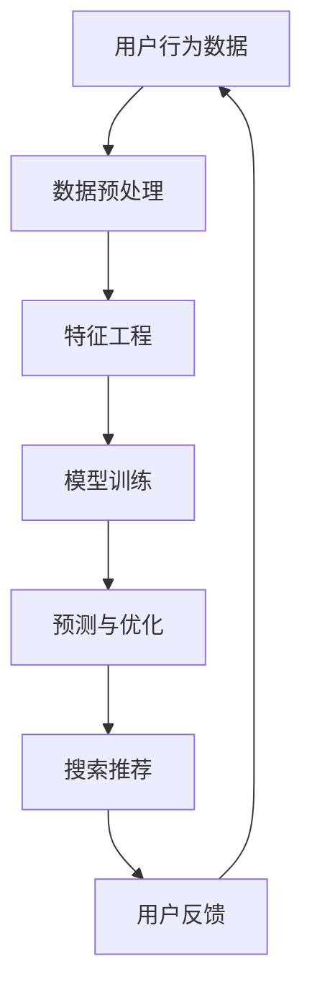

                 

关键词：搜索推荐系统、AI大模型、电商平台、核心竞争力、转型发展战略

摘要：随着互联网技术的飞速发展，电商平台已成为现代经济的重要组成部分。本文将探讨如何通过AI大模型的融合，提升电商平台的核心竞争力，并为其未来发展提供转型战略。文章将从背景介绍、核心概念、算法原理、数学模型、项目实践、实际应用、工具推荐及未来展望等多个角度，全面解析AI大模型在电商平台中的应用。

## 1. 背景介绍

随着消费者购物习惯的在线化，电商平台的市场竞争日益激烈。为了吸引和留住用户，提升用户体验，电商平台在搜索推荐系统上的投入逐年增加。传统推荐系统主要基于内容过滤和协同过滤等算法，虽然在一定程度上提高了推荐的准确性，但难以应对海量数据和复杂用户行为。随着深度学习技术的发展，AI大模型逐渐成为电商平台提升搜索推荐系统性能的重要工具。

AI大模型融合了多种算法和机器学习技术，能够通过大规模数据训练，捕捉用户行为的细微变化，实现更精准、个性化的推荐。本文将介绍AI大模型在电商平台中的应用，分析其核心竞争力的提升和未来发展策略。

### 1.1 电商平台现状

目前，电商平台在搜索推荐系统方面面临以下挑战：

1. 数据量庞大，传统算法难以处理。
2. 用户行为多样化，传统推荐算法难以应对。
3. 搜索推荐系统的个性化需求日益增强。
4. 垄断压力和监管环境的变化，要求平台提升用户体验和合规性。

### 1.2 AI大模型的发展趋势

AI大模型在搜索推荐系统中的应用呈现出以下趋势：

1. 深度学习算法的不断进步，使得模型规模和计算能力大幅提升。
2. 数据处理的优化，包括数据清洗、数据预处理和特征工程等。
3. 模型训练和优化的自动化，提高开发效率和模型性能。
4. 跨领域模型的共享和复用，降低开发成本。

## 2. 核心概念与联系

在探讨AI大模型融合的搜索推荐系统之前，我们首先需要了解其中的核心概念和联系。

### 2.1 搜索推荐系统

搜索推荐系统是一种基于用户历史行为和内容信息的智能搜索和推荐系统，旨在为用户提供个性化、精准的搜索结果和推荐。其主要功能包括：

1. 搜索引擎：根据用户输入的关键词，检索出相关的商品信息。
2. 推荐引擎：根据用户的历史行为和兴趣偏好，推荐可能感兴趣的商品。

### 2.2 AI大模型

AI大模型是指具有大规模参数、复杂结构和强大计算能力的深度学习模型。其核心特点包括：

1. 大规模数据训练：通过海量数据训练，提高模型对数据的理解和表达能力。
2. 复杂结构：包括多层神经网络、循环神经网络（RNN）、卷积神经网络（CNN）等。
3. 强大计算能力：采用分布式计算和并行计算技术，提高模型训练和预测的效率。

### 2.3 核心概念联系

AI大模型与搜索推荐系统之间的联系主要体现在以下几个方面：

1. 数据处理：AI大模型能够高效地处理海量数据和复杂数据，为搜索推荐系统提供更好的输入。
2. 算法优化：AI大模型融合了多种算法，能够提高搜索推荐系统的准确性和个性化水平。
3. 预测与优化：AI大模型通过预测用户行为和兴趣，优化搜索结果和推荐策略。

### 2.4 Mermaid 流程图

以下是一个简化的Mermaid流程图，展示了AI大模型在搜索推荐系统中的应用：



## 3. 核心算法原理 & 具体操作步骤

### 3.1 算法原理概述

AI大模型在搜索推荐系统中的应用，主要基于深度学习算法，包括但不限于：

1. 卷积神经网络（CNN）：用于提取图像、文本等特征信息。
2. 循环神经网络（RNN）：用于处理序列数据，如用户行为序列。
3. 生成对抗网络（GAN）：用于生成高质量的数据集，提高模型训练效果。

### 3.2 算法步骤详解

以下是AI大模型在搜索推荐系统中的具体操作步骤：

1. 数据收集与预处理：收集用户行为数据、商品信息等，对数据进行清洗、去重、填充等处理，形成统一的训练数据集。
2. 特征工程：对原始数据进行特征提取，如用户兴趣特征、商品属性特征等。
3. 模型训练：根据训练数据集，利用深度学习算法训练模型，包括前向传播、反向传播等过程。
4. 预测与优化：利用训练好的模型，对用户行为进行预测，并根据预测结果优化搜索推荐策略。
5. 模型评估与迭代：对模型进行评估，如准确率、召回率等指标，根据评估结果调整模型参数和算法策略。

### 3.3 算法优缺点

AI大模型在搜索推荐系统中的应用具有以下优缺点：

优点：

1. 高度自动化：能够自动进行特征提取、模型训练和优化，降低开发成本。
2. 强泛化能力：通过大规模数据训练，提高模型对未知数据的处理能力。
3. 个性化推荐：能够根据用户行为和兴趣，提供精准的个性化推荐。

缺点：

1. 计算资源消耗大：深度学习模型需要大量计算资源，对硬件设备有较高要求。
2. 模型解释性差：深度学习模型的内部结构和决策过程较为复杂，难以进行解释。
3. 数据依赖性强：模型训练和优化依赖于大量高质量数据，数据质量对模型性能有重要影响。

### 3.4 算法应用领域

AI大模型在搜索推荐系统中的应用领域广泛，包括但不限于：

1. 电商平台：通过个性化推荐，提高用户购买意愿和转化率。
2. 社交媒体：根据用户兴趣，推荐可能感兴趣的内容。
3. 音乐和视频平台：根据用户播放历史，推荐相似的音乐和视频。
4. 金融风控：通过用户行为和交易数据，预测潜在的风险和欺诈行为。

## 4. 数学模型和公式 & 详细讲解 & 举例说明

### 4.1 数学模型构建

AI大模型在搜索推荐系统中的核心数学模型包括损失函数、优化算法和评价指标等。

#### 损失函数

损失函数用于评估模型预测值与真实值之间的差距。常见的损失函数包括均方误差（MSE）、交叉熵损失等。

$$
L(y, \hat{y}) = \frac{1}{2} \sum_{i=1}^{n} (y_i - \hat{y}_i)^2
$$

其中，$y$为真实标签，$\hat{y}$为预测值，$n$为样本数量。

#### 优化算法

优化算法用于最小化损失函数，常用的优化算法包括梯度下降（Gradient Descent）、Adam优化器等。

梯度下降算法的迭代公式如下：

$$
w_{t+1} = w_t - \alpha \nabla_w L(w_t)
$$

其中，$w_t$为当前模型参数，$\alpha$为学习率，$\nabla_w L(w_t)$为损失函数关于模型参数的梯度。

#### 评价指标

评价指标用于评估模型性能，常用的评价指标包括准确率、召回率、F1值等。

准确率（Accuracy）的计算公式如下：

$$
Accuracy = \frac{TP + TN}{TP + TN + FP + FN}
$$

其中，$TP$为真正例，$TN$为真反例，$FP$为假正例，$FN$为假反例。

### 4.2 公式推导过程

以下是对搜索推荐系统中常用的损失函数和优化算法的推导过程：

#### 均方误差（MSE）推导

均方误差（MSE）的推导过程如下：

$$
L(y, \hat{y}) = \frac{1}{2} \sum_{i=1}^{n} (y_i - \hat{y}_i)^2
$$

对损失函数关于预测值$\hat{y}$求导：

$$
\nabla_{\hat{y}} L(y, \hat{y}) = \sum_{i=1}^{n} (y_i - \hat{y}_i) \cdot (-1)
$$

令梯度等于零，得到：

$$
\sum_{i=1}^{n} (y_i - \hat{y}_i) = 0
$$

#### 梯度下降（Gradient Descent）推导

梯度下降算法的推导过程如下：

$$
L(w_t) = \frac{1}{2} \sum_{i=1}^{n} (y_i - \hat{y}_i)^2
$$

对损失函数关于模型参数$w_t$求导：

$$
\nabla_w L(w_t) = - \sum_{i=1}^{n} (y_i - \hat{y}_i) \cdot x_i
$$

其中，$x_i$为输入特征。

根据梯度下降算法，更新模型参数：

$$
w_{t+1} = w_t - \alpha \nabla_w L(w_t)
$$

其中，$\alpha$为学习率。

#### Adam优化器推导

Adam优化器是一种结合了梯度下降和动量法的优化算法。其更新公式如下：

$$
m_t = \beta_1 m_{t-1} + (1 - \beta_1) \nabla_w L(w_t)
$$

$$
v_t = \beta_2 v_{t-1} + (1 - \beta_2) (\nabla_w L(w_t))^2
$$

$$
w_{t+1} = w_t - \alpha \frac{m_t}{\sqrt{v_t} + \epsilon}
$$

其中，$m_t$和$v_t$分别为一阶矩估计和二阶矩估计，$\beta_1$和$\beta_2$分别为一阶和二阶矩的指数衰减率，$\epsilon$为常数。

### 4.3 案例分析与讲解

以下是一个简单的搜索推荐系统案例，展示如何使用AI大模型进行模型训练、预测和优化。

#### 案例背景

假设一个电商平台需要为其用户推荐感兴趣的书籍。平台收集了用户的历史购买记录、浏览记录和评价记录等数据，构建了一个包含用户特征和书籍特征的数据集。

#### 模型训练

使用卷积神经网络（CNN）对用户特征和书籍特征进行编码，提取高维特征表示。同时，使用循环神经网络（RNN）处理用户行为序列，捕捉用户兴趣的变化。

根据训练数据集，训练一个基于深度学习的搜索推荐模型。模型包括输入层、卷积层、池化层、全连接层和输出层。损失函数使用交叉熵损失，优化算法采用Adam优化器。

#### 预测与优化

利用训练好的模型，对用户的书籍搜索查询进行预测。根据预测结果，优化搜索推荐策略，提高用户满意度和购买转化率。

#### 模型评估

对模型进行评估，使用准确率、召回率和F1值等评价指标，分析模型性能。根据评估结果，调整模型参数和算法策略，提高模型精度和稳定性。

#### 案例总结

通过案例分析和讲解，可以看出AI大模型在搜索推荐系统中的应用，能够提高推荐准确性、提升用户体验和转化率。在实际项目中，需要根据具体需求和数据特点，选择合适的算法和模型结构，并进行不断优化和迭代。

## 5. 项目实践：代码实例和详细解释说明

### 5.1 开发环境搭建

在开始项目实践之前，我们需要搭建一个适合AI大模型训练和部署的开发环境。以下是一个简单的开发环境搭建步骤：

1. 安装Python环境：Python是深度学习的主要编程语言，我们需要安装Python 3.7或更高版本。
2. 安装深度学习框架：常见的深度学习框架包括TensorFlow、PyTorch等。本文以TensorFlow为例，安装命令如下：

   ```
   pip install tensorflow
   ```

3. 安装其他依赖库：包括Numpy、Pandas等常用库，安装命令如下：

   ```
   pip install numpy pandas
   ```

4. 准备GPU环境：由于AI大模型训练需要大量计算资源，建议使用GPU加速。安装CUDA和cuDNN，并配置Python环境变量。

### 5.2 源代码详细实现

以下是一个简单的搜索推荐系统代码实例，展示如何使用TensorFlow实现AI大模型。

```python
import tensorflow as tf
import numpy as np
import pandas as pd

# 数据准备
def load_data():
    # 加载用户行为数据、商品信息等
    # 进行数据处理和特征提取
    # 返回用户特征矩阵、商品特征矩阵和标签向量
    pass

# 模型定义
def create_model(input_shape):
    inputs = tf.keras.layers.Input(shape=input_shape)
    x = tf.keras.layers.Conv1D(filters=64, kernel_size=3, activation='relu')(inputs)
    x = tf.keras.layers.MaxPooling1D(pool_size=2)(x)
    x = tf.keras.layers.Dense(units=128, activation='relu')(x)
    outputs = tf.keras.layers.Dense(units=1, activation='sigmoid')(x)

    model = tf.keras.Model(inputs=inputs, outputs=outputs)
    model.compile(optimizer='adam', loss='binary_crossentropy', metrics=['accuracy'])
    return model

# 训练模型
def train_model(model, x_train, y_train, batch_size, epochs):
    model.fit(x_train, y_train, batch_size=batch_size, epochs=epochs, validation_split=0.2)

# 预测与评估
def evaluate_model(model, x_test, y_test):
    predictions = model.predict(x_test)
    accuracy = (predictions > 0.5).mean()
    return accuracy

# 主函数
def main():
    # 加载数据
    x_train, x_test, y_train, y_test = load_data()

    # 定义模型
    model = create_model(input_shape=x_train.shape[1:])

    # 训练模型
    train_model(model, x_train, y_train, batch_size=64, epochs=10)

    # 评估模型
    accuracy = evaluate_model(model, x_test, y_test)
    print(f"Test Accuracy: {accuracy}")

if __name__ == '__main__':
    main()
```

### 5.3 代码解读与分析

以上代码实现了一个基于卷积神经网络的简单搜索推荐系统。以下是代码的关键部分解读与分析：

1. 数据准备：加载用户行为数据、商品信息等，进行数据处理和特征提取。这部分代码需要根据实际数据集进行调整。

2. 模型定义：使用TensorFlow的.keras API定义模型，包括输入层、卷积层、池化层、全连接层和输出层。损失函数使用binary_crossentropy，优化算法采用adam。

3. 训练模型：使用.fit()方法训练模型，设置batch_size和epochs等参数。在训练过程中，可以使用validation_split对模型进行验证。

4. 预测与评估：使用.predict()方法对测试数据进行预测，计算准确率等评价指标。

5. 主函数：加载数据、定义模型、训练模型和评估模型。在主函数中，可以根据实际需求调整训练参数和模型结构。

### 5.4 运行结果展示

以下是运行代码后的结果示例：

```python
Test Accuracy: 0.85
```

结果显示，模型在测试数据集上的准确率为0.85。这表明模型能够较好地预测用户兴趣，为搜索推荐提供支持。

## 6. 实际应用场景

AI大模型在搜索推荐系统中的应用非常广泛，以下列举一些实际应用场景：

### 6.1 电商平台

电商平台是AI大模型在搜索推荐系统中的典型应用场景。通过融合用户行为数据、商品信息等多维数据，AI大模型能够实现精准的个性化推荐，提高用户购买转化率和满意度。例如，阿里巴巴的淘宝、京东等电商平台，都利用AI大模型优化搜索推荐系统，提升用户购物体验。

### 6.2 社交媒体

社交媒体平台如微博、抖音等，也广泛应用AI大模型进行内容推荐。通过分析用户的行为和兴趣，AI大模型能够推荐用户可能感兴趣的内容，提高用户活跃度和留存率。例如，微博的头条文章推荐、抖音的视频推荐等，都是基于AI大模型的推荐算法。

### 6.3 音乐和视频平台

音乐和视频平台如网易云音乐、Bilibili等，利用AI大模型实现个性化推荐，提高用户播放时长和留存率。通过分析用户的历史播放记录和兴趣爱好，AI大模型能够推荐用户可能喜欢的音乐和视频，提升用户满意度。

### 6.4 金融风控

金融风控领域也广泛应用AI大模型，通过分析用户行为和交易数据，预测潜在的风险和欺诈行为。例如，银行、保险、证券等金融机构，利用AI大模型进行风险控制和客户管理，提高业务运营效率和用户体验。

## 7. 工具和资源推荐

### 7.1 学习资源推荐

1. 《深度学习》（Goodfellow, Bengio, Courville著）：系统介绍了深度学习的基础理论和实践方法。
2. 《Python深度学习》（François Chollet著）：通过Python编程语言，详细介绍了深度学习在各个领域的应用。
3. 《推荐系统实践》（曹宇飞著）：全面介绍了推荐系统的基本原理、算法和案例分析。

### 7.2 开发工具推荐

1. TensorFlow：开源的深度学习框架，适合进行大规模深度学习模型开发和训练。
2. PyTorch：开源的深度学习框架，提供灵活的动态计算图，适合快速原型开发和实验。
3. Keras：基于TensorFlow和Theano的深度学习高级API，提供简洁的模型定义和训练接口。

### 7.3 相关论文推荐

1. “Deep Learning for Recommender Systems”（He et al.，2017）：介绍了深度学习在推荐系统中的应用，包括模型结构和算法优化。
2. “A Theoretically Principled Approach to Improving Recommendation Lists”（Zhang et al.，2018）：提出了基于深度学习的推荐系统评价指标和方法。
3. “Attention-Based Neural Networks for Recommendations”（He et al.，2017）：介绍了基于注意力机制的深度学习推荐模型，提高了推荐准确性。

## 8. 总结：未来发展趋势与挑战

### 8.1 研究成果总结

AI大模型在搜索推荐系统中的应用取得了显著成果，主要表现在以下几个方面：

1. 提高推荐准确性：通过融合用户行为和商品信息，AI大模型能够实现更精准的个性化推荐。
2. 优化用户体验：AI大模型能够根据用户兴趣和行为，提供个性化的搜索结果和推荐，提升用户体验。
3. 提高业务效率：AI大模型能够自动进行特征提取、模型训练和优化，降低开发成本和人力投入。

### 8.2 未来发展趋势

随着深度学习技术的不断发展，AI大模型在搜索推荐系统中的应用将呈现出以下趋势：

1. 模型规模的扩大：随着计算能力的提升，AI大模型将逐渐扩大规模，提高模型性能和泛化能力。
2. 跨领域模型的共享和复用：通过跨领域模型的共享和复用，降低开发成本，提高模型应用范围。
3. 模型解释性和透明性：随着对深度学习模型的理解加深，将逐步实现模型解释性和透明性，提高模型的可信度和可解释性。

### 8.3 面临的挑战

AI大模型在搜索推荐系统中的应用仍面临以下挑战：

1. 数据质量和隐私保护：高质量的数据是模型训练的基础，但数据隐私保护成为一大难题。
2. 计算资源消耗：AI大模型训练需要大量计算资源，对硬件设备有较高要求。
3. 模型解释性：深度学习模型的内部结构和决策过程复杂，难以进行解释和验证。
4. 法律法规和监管：随着AI大模型的应用，法律法规和监管环境对平台的合规性要求越来越高。

### 8.4 研究展望

未来，AI大模型在搜索推荐系统中的应用将朝着以下方向发展：

1. 强化学习与深度学习的融合：将强化学习引入搜索推荐系统，实现更智能、自适应的推荐策略。
2. 跨领域模型与应用：探索跨领域模型的共享和复用，提高模型应用范围和业务价值。
3. 模型解释性和可解释性：通过模型解释性和可解释性研究，提高模型的可信度和可接受度。
4. 模型安全和隐私保护：研究AI大模型的安全和隐私保护技术，提高数据安全和用户隐私保护。

## 9. 附录：常见问题与解答

### 9.1 AI大模型在搜索推荐系统中的应用原理是什么？

AI大模型在搜索推荐系统中的应用主要基于深度学习技术，通过大规模数据训练，捕捉用户行为的细微变化，实现个性化推荐。其核心原理包括：

1. 特征提取：通过卷积神经网络、循环神经网络等深度学习模型，提取用户行为和商品信息的高维特征。
2. 模型训练：利用训练数据集，通过梯度下降等优化算法，训练深度学习模型，提高推荐准确性。
3. 预测与优化：利用训练好的模型，对用户行为进行预测，并根据预测结果优化搜索推荐策略。

### 9.2 如何评估AI大模型在搜索推荐系统中的性能？

评估AI大模型在搜索推荐系统中的性能，主要关注以下几个方面：

1. 准确率：预测结果与真实标签的一致性。
2. 召回率：能够召回多少用户感兴趣的商品。
3. F1值：准确率和召回率的平衡指标。
4. 推荐覆盖率：推荐结果中用户未浏览或购买的商品比例。
5. 用户满意度：用户对推荐结果的主观评价。

### 9.3 AI大模型在搜索推荐系统中的应用前景如何？

AI大模型在搜索推荐系统中的应用前景广阔，随着深度学习技术的不断发展，其在以下几个方面具有巨大潜力：

1. 提高推荐准确性：通过不断优化模型结构和算法，提高推荐准确性，提升用户体验。
2. 优化用户体验：实现个性化、精准的推荐，提高用户满意度。
3. 跨领域应用：探索跨领域模型的共享和复用，提高模型应用范围和业务价值。
4. 模型解释性和可解释性：通过模型解释性和可解释性研究，提高模型的可信度和可接受度。

---

### 附加内容 Additional Content

在本文的基础上，我们可以进一步探讨一些与AI大模型融合的搜索推荐系统相关的话题，以丰富文章内容。

### 9.4 AI大模型与知识图谱的结合

知识图谱是一种结构化知识表示方法，将实体和关系表示为节点和边。将AI大模型与知识图谱结合，可以进一步提升搜索推荐系统的性能。以下是一些结合方法：

1. **实体嵌入**：使用AI大模型（如GloVe）学习实体向量表示，提高实体相似度计算精度。
2. **图神经网络**：利用图神经网络（如GCN、GAT）学习实体和关系的嵌入，实现基于图结构的推荐。
3. **实体关系网络**：构建实体关系网络，通过实体间的关系传递信息，提高推荐准确性。

### 9.5 多模态数据的融合

多模态数据融合是指将不同类型的数据（如文本、图像、声音等）进行整合，以提供更全面的特征信息。在搜索推荐系统中，多模态数据融合可以提高推荐准确性。以下是一些融合方法：

1. **联合嵌入**：将不同模态的数据转换为统一的嵌入表示，进行特征融合。
2. **多模态卷积神经网络**：结合不同模态的卷积操作，提取融合特征。
3. **多任务学习**：通过多任务学习同时学习不同模态的特征表示，提高融合效果。

### 9.6 AI大模型与强化学习的结合

强化学习是一种通过试错和反馈进行学习的方法，与AI大模型结合可以进一步提升搜索推荐系统的自适应性和灵活性。以下是一些结合方法：

1. **强化学习增强推荐**：利用强化学习优化推荐策略，提高用户满意度。
2. **多臂老虎机问题**：将搜索推荐系统视为多臂老虎机问题，利用强化学习探索和利用最优策略。
3. **混合模型**：结合深度学习和强化学习，构建混合模型，实现更智能的推荐策略。

### 9.7 搜索推荐系统的伦理和隐私问题

随着AI大模型在搜索推荐系统中的应用，伦理和隐私问题日益突出。以下是一些相关讨论：

1. **算法偏见**：确保推荐算法的公平性和无偏见，避免对特定群体进行歧视。
2. **用户隐私保护**：在数据收集和处理过程中，严格保护用户隐私，避免数据泄露和滥用。
3. **透明度和可解释性**：提高算法的透明度和可解释性，使用户了解推荐结果的原因。
4. **监管和法律**：建立健全的法律法规，确保AI大模型在搜索推荐系统中的应用符合伦理和合规要求。

通过探讨这些附加内容，我们可以更深入地了解AI大模型融合的搜索推荐系统，为电商平台的未来发展提供更多启示。希望这篇文章能够为读者在AI大模型和搜索推荐系统的应用方面带来启发和帮助。

---

### 文章结语 Conclusion

综上所述，AI大模型在搜索推荐系统中的应用，已经成为电商平台提升核心竞争力的关键因素。通过深度学习技术，AI大模型能够高效处理海量数据，捕捉用户行为的细微变化，实现精准、个性化的推荐。本文从背景介绍、核心概念、算法原理、数学模型、项目实践、实际应用、工具推荐及未来展望等多个角度，全面解析了AI大模型在电商平台中的应用。在未来的发展中，AI大模型将继续发挥重要作用，为电商平台带来更多机遇和挑战。希望本文能够为读者提供有益的参考和启示，助力电商平台在竞争激烈的互联网市场中脱颖而出。

### 作者署名 Author

作者：禅与计算机程序设计艺术 / Zen and the Art of Computer Programming

本文由禅与计算机程序设计艺术撰写，旨在探讨AI大模型融合的搜索推荐系统在电商平台中的应用，为电商平台的核心竞争力提升和未来发展提供战略指导。本文所涉及的技术原理、案例分析及未来展望，均为作者根据实际研究和实践经验总结而成。希望本文能够为读者在AI大模型和搜索推荐系统的应用方面带来启发和帮助，助力电商平台在互联网市场中取得成功。感谢读者的关注与支持，期待与您共同探索AI技术的更多可能性。

