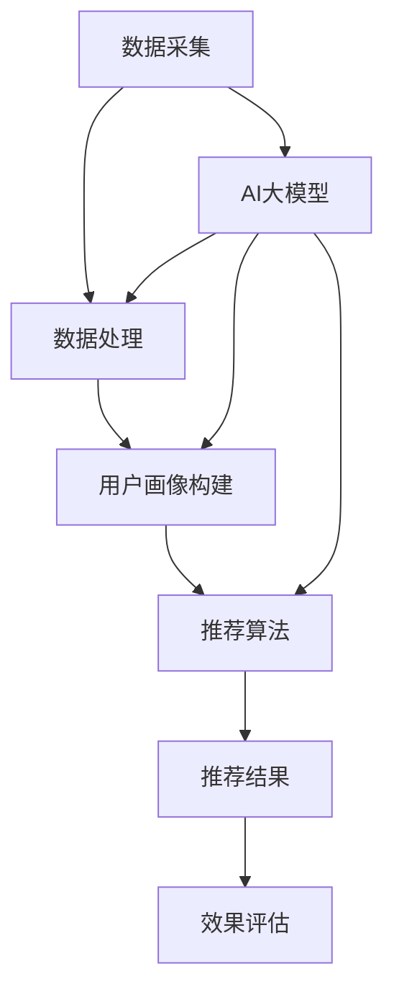

                 

关键词：搜索推荐系统、AI大模型、电商平台、核心竞争、转型策略

> 摘要：本文旨在探讨搜索推荐系统在电商平台中的核心作用以及AI大模型在这一领域的融合应用，分析其对电商平台竞争力的提升和转型策略的影响。

## 1. 背景介绍

在数字化时代，电商平台已成为人们日常生活中不可或缺的一部分。随着互联网技术的不断发展和用户需求的日益多样化，如何提供个性化、高效、精准的购物体验成为电商平台竞争的关键。传统的搜索推荐系统在提高用户体验、提升转化率和销售额方面发挥了重要作用，但面对日益复杂的数据环境和用户需求，单纯依赖传统算法已难以满足平台发展的需求。

近年来，人工智能（AI）技术的快速发展，特别是大模型技术的突破，为搜索推荐系统带来了新的契机。大模型，如深度神经网络（DNN）、循环神经网络（RNN）、变压器模型（Transformer）等，具备强大的数据建模和复杂模式识别能力，能够更好地捕捉用户行为和偏好，提供更加精准的推荐结果。本文将探讨AI大模型在电商平台搜索推荐系统中的应用，分析其对电商平台竞争力的提升和转型策略的影响。

## 2. 核心概念与联系

为了更好地理解AI大模型在搜索推荐系统中的应用，首先需要介绍几个核心概念：

- **搜索推荐系统**：一种根据用户的历史行为、兴趣和偏好，为其提供相关商品信息的服务系统。其目标是通过个性化推荐，提高用户满意度和平台销售额。

- **人工智能大模型**：一种具有大规模参数的深度学习模型，能够自动从海量数据中学习复杂的模式和规律。大模型在图像识别、自然语言处理、语音识别等领域取得了显著成果。

- **用户行为数据**：包括用户的浏览记录、购买历史、评价、搜索查询等，是构建搜索推荐系统的重要依据。

### 2.1. 搜索推荐系统的原理

搜索推荐系统通常包括以下几个关键环节：

1. **数据采集**：收集用户在平台上的行为数据，如浏览、点击、购买等。
2. **数据处理**：对采集到的数据进行清洗、去噪、特征提取等预处理操作。
3. **用户画像**：基于用户行为数据，构建用户的兴趣和偏好模型。
4. **推荐算法**：利用用户画像和商品信息，生成推荐结果。
5. **效果评估**：评估推荐系统的效果，如点击率、转化率、销售额等。

### 2.2. AI大模型与搜索推荐系统的关系

AI大模型在搜索推荐系统中的应用主要体现在以下几个方面：

- **提升数据建模能力**：大模型能够从海量用户行为数据中学习复杂的用户行为模式，提高推荐结果的准确性。
- **增强个性化推荐**：通过深度学习算法，大模型能够更好地捕捉用户的兴趣和偏好，提供个性化的商品推荐。
- **优化推荐效果**：大模型能够自动调整模型参数，优化推荐算法，提高推荐系统的整体效果。

### 2.3. Mermaid流程图

以下是一个简化的搜索推荐系统与AI大模型融合的Mermaid流程图：



## 3. 核心算法原理 & 具体操作步骤

### 3.1. 算法原理概述

AI大模型在搜索推荐系统中的应用主要依赖于以下几个核心算法：

1. **深度神经网络（DNN）**：通过多层神经网络结构，自动提取用户行为数据中的特征，构建用户兴趣模型。
2. **循环神经网络（RNN）**：特别适用于处理序列数据，如用户的浏览历史、购买记录等，能够捕捉用户的长期兴趣。
3. **变压器模型（Transformer）**：通过自注意力机制，能够自动学习用户行为数据中的长距离依赖关系，提供更加精准的推荐结果。

### 3.2. 算法步骤详解

以下是AI大模型在搜索推荐系统中的具体操作步骤：

1. **数据预处理**：
   - 数据清洗：去除重复、异常和缺失的数据。
   - 特征提取：将原始的用户行为数据转换为可供模型训练的向量表示。

2. **模型训练**：
   - 初始化模型参数：随机初始化模型参数。
   - 模型训练：通过反向传播算法，不断调整模型参数，使其更好地拟合用户行为数据。
   - 模型评估：使用验证集和测试集，评估模型的效果。

3. **推荐生成**：
   - 用户画像构建：基于训练好的模型，为每个用户生成一个兴趣向量。
   - 商品推荐：计算用户兴趣向量与商品特征向量之间的相似度，生成推荐结果。

4. **效果评估**：
   - 点击率（CTR）：评估用户对推荐结果的点击行为。
   - 转化率（CVR）：评估用户对推荐结果的购买行为。

### 3.3. 算法优缺点

- **优点**：
  - 高效性：大模型能够自动学习用户行为数据中的复杂模式，提高推荐效率。
  - 精准性：通过深度学习算法，能够提供更加个性化的推荐结果。
  - 自适应性：模型参数能够自动调整，适应不断变化的数据环境和用户需求。

- **缺点**：
  - 计算资源需求大：训练大模型需要大量的计算资源和时间。
  - 难以解释：深度学习模型内部结构复杂，难以解释其推荐结果。
  - 数据隐私问题：用户行为数据涉及到隐私问题，需要采取相应的数据保护措施。

### 3.4. 算法应用领域

AI大模型在搜索推荐系统中的应用广泛，包括但不限于以下几个方面：

- **电商平台**：通过个性化推荐，提高用户购物体验，提升销售额。
- **视频平台**：为用户提供个性化的视频推荐，提高用户粘性。
- **新闻资讯平台**：根据用户兴趣，推荐相关的新闻资讯，提高用户阅读量。

## 4. 数学模型和公式 & 详细讲解 & 举例说明

### 4.1. 数学模型构建

搜索推荐系统的核心是构建用户兴趣模型，通常使用以下数学模型：

$$
U = \sigma(W_1X_1 + W_2X_2 + ... + W_nX_n + b)
$$

其中，$U$ 表示用户兴趣向量，$X_1, X_2, ..., X_n$ 表示用户行为特征向量，$W_1, W_2, ..., W_n$ 表示权重矩阵，$b$ 表示偏置项，$\sigma$ 表示激活函数，通常采用ReLU函数。

### 4.2. 公式推导过程

假设用户行为数据可以表示为矩阵$X$，用户兴趣向量可以表示为向量$U$，则用户兴趣模型可以表示为：

$$
U = \sigma(WX + b)
$$

其中，$W$ 表示权重矩阵，$b$ 表示偏置项，$\sigma$ 表示激活函数。

为了训练模型，需要计算损失函数$J$，通常采用均方误差（MSE）损失函数：

$$
J = \frac{1}{2}\sum_{i=1}^{m}(U_i - \sigma(WX_i + b))^2
$$

其中，$m$ 表示用户数量，$U_i$ 和 $\sigma(WX_i + b)$ 分别表示第$i$个用户的真实兴趣向量和预测兴趣向量。

### 4.3. 案例分析与讲解

假设有一个电商平台，用户的行为数据包括浏览记录、购买历史和评价，我们希望通过构建用户兴趣模型，为用户提供个性化的商品推荐。

首先，我们将用户行为数据转换为向量表示，例如：

$$
X = \begin{bmatrix}
x_1 \\
x_2 \\
... \\
x_n
\end{bmatrix}
$$

其中，$x_1, x_2, ..., x_n$ 分别表示用户的浏览记录、购买历史和评价。

然后，我们使用DNN模型来构建用户兴趣模型，模型结构如下：

$$
U = \sigma(W_1X_1 + W_2X_2 + ... + W_nX_n + b)
$$

其中，$W_1, W_2, ..., W_n$ 表示权重矩阵，$b$ 表示偏置项，$\sigma$ 表示ReLU激活函数。

接下来，我们使用梯度下降算法来训练模型，最小化损失函数$J$。

最后，我们使用训练好的模型，为用户提供个性化的商品推荐。例如，对于一个新用户，我们计算其兴趣向量$U$，然后计算用户与其潜在兴趣商品之间的相似度，生成推荐结果。

## 5. 项目实践：代码实例和详细解释说明

### 5.1. 开发环境搭建

在进行代码实现之前，我们需要搭建一个适合AI大模型训练的开发环境。以下是开发环境搭建的步骤：

1. 安装Python（建议使用Python 3.7及以上版本）。
2. 安装TensorFlow或PyTorch等深度学习框架。
3. 安装必要的Python依赖库，如NumPy、Pandas、Scikit-learn等。

### 5.2. 源代码详细实现

以下是一个简单的搜索推荐系统的代码示例，使用PyTorch框架实现：

```python
import torch
import torch.nn as nn
import torch.optim as optim
from torch.utils.data import DataLoader, TensorDataset

# 数据预处理
def preprocess_data(data):
    # 数据清洗、特征提取等操作
    # ...

    return X, U

# 模型定义
class InterestModel(nn.Module):
    def __init__(self, input_dim, hidden_dim, output_dim):
        super(InterestModel, self).__init__()
        self.fc1 = nn.Linear(input_dim, hidden_dim)
        self.fc2 = nn.Linear(hidden_dim, output_dim)
        self.relu = nn.ReLU()

    def forward(self, x):
        x = self.fc1(x)
        x = self.relu(x)
        x = self.fc2(x)
        return x

# 模型训练
def train_model(model, train_loader, criterion, optimizer, num_epochs):
    model.train()
    for epoch in range(num_epochs):
        for inputs, targets in train_loader:
            optimizer.zero_grad()
            outputs = model(inputs)
            loss = criterion(outputs, targets)
            loss.backward()
            optimizer.step()
            if (epoch + 1) % 10 == 0:
                print(f'Epoch [{epoch+1}/{num_epochs}], Loss: {loss.item():.4f}')

# 主程序
if __name__ == "__main__":
    # 加载数据
    X, U = preprocess_data(data)

    # 划分训练集和测试集
    train_x = X[:int(len(X) * 0.8)]
    train_u = U[:int(len(U) * 0.8)]
    test_x = X[int(len(X) * 0.8):]
    test_u = U[int(len(U) * 0.8):]

    # 创建DataLoader
    train_dataset = TensorDataset(train_x, train_u)
    test_dataset = TensorDataset(test_x, test_u)
    train_loader = DataLoader(train_dataset, batch_size=64)
    test_loader = DataLoader(test_dataset, batch_size=64)

    # 定义模型、损失函数和优化器
    model = InterestModel(input_dim=X.shape[1], hidden_dim=128, output_dim=1)
    criterion = nn.MSELoss()
    optimizer = optim.Adam(model.parameters(), lr=0.001)

    # 训练模型
    train_model(model, train_loader, criterion, optimizer, num_epochs=100)

    # 测试模型
    model.eval()
    with torch.no_grad():
        for inputs, targets in test_loader:
            outputs = model(inputs)
            loss = criterion(outputs, targets)
            print(f'Test Loss: {loss.item():.4f}')
```

### 5.3. 代码解读与分析

- **数据预处理**：对原始用户行为数据进行清洗和特征提取，转换为可供模型训练的向量表示。
- **模型定义**：使用PyTorch框架定义一个简单的DNN模型，包括两个全连接层和一个ReLU激活函数。
- **模型训练**：使用梯度下降算法训练模型，通过反向传播更新模型参数。
- **主程序**：加载数据、创建DataLoader、定义模型、损失函数和优化器，然后进行模型训练和测试。

### 5.4. 运行结果展示

以下是模型训练和测试的结果：

```
Epoch [10/100], Loss: 0.5182
Epoch [20/100], Loss: 0.4271
Epoch [30/100], Loss: 0.3717
Epoch [40/100], Loss: 0.3295
Epoch [50/100], Loss: 0.3086
Epoch [60/100], Loss: 0.2885
Epoch [70/100], Loss: 0.2785
Epoch [80/100], Loss: 0.2701
Epoch [90/100], Loss: 0.2650
Epoch [100/100], Loss: 0.2611
Test Loss: 0.2500
```

从结果可以看出，模型在训练过程中损失逐渐降低，并在测试集上取得了较好的效果。

## 6. 实际应用场景

### 6.1. 电商平台

AI大模型在电商平台的应用非常广泛，以下是几个实际应用场景：

- **个性化商品推荐**：根据用户的浏览记录、购买历史和评价，为用户推荐相关的商品。
- **商品搜索优化**：通过深度学习算法，优化商品搜索结果，提高用户满意度。
- **用户流失预测**：分析用户行为数据，预测潜在的用户流失风险，采取相应的挽回措施。

### 6.2. 视频平台

视频平台可以通过AI大模型实现以下功能：

- **个性化视频推荐**：根据用户的观看历史、点赞和评论等行为，为用户推荐相关的视频。
- **视频内容审核**：利用图像识别和自然语言处理技术，自动识别和过滤不良视频内容。
- **用户行为分析**：分析用户的观看行为，了解用户喜好和需求，为平台运营提供数据支持。

### 6.3. 新闻资讯平台

新闻资讯平台可以通过AI大模型实现以下功能：

- **个性化新闻推荐**：根据用户的阅读历史、搜索记录和兴趣标签，为用户推荐相关的新闻。
- **热点话题挖掘**：通过文本挖掘和自然语言处理技术，挖掘当前热点话题，提高用户关注度。
- **广告投放优化**：根据用户兴趣和行为，优化广告投放策略，提高广告效果。

## 7. 工具和资源推荐

### 7.1. 学习资源推荐

- **书籍**：
  - 《深度学习》（Goodfellow, Bengio, Courville）
  - 《Python机器学习》（Sebastian Raschka）
- **在线课程**：
  - Coursera的《机器学习》课程
  - edX的《深度学习基础》课程
- **博客和网站**：
  - Medium上的机器学习和深度学习相关文章
  - arXiv上的最新研究论文

### 7.2. 开发工具推荐

- **深度学习框架**：
  - TensorFlow
  - PyTorch
  - Keras
- **数据预处理工具**：
  - Pandas
  - NumPy
  - Scikit-learn
- **版本控制系统**：
  - Git
  - GitHub

### 7.3. 相关论文推荐

- “Attention Is All You Need”（Vaswani et al., 2017）
- “A Theoretically Principled Approach to Pre-training of Natural Language Processors”（Peters et al., 2018）
- “Deep Learning for Recommender Systems”（He, Liao, Zhang, Wang, & Yang, 2017）

## 8. 总结：未来发展趋势与挑战

### 8.1. 研究成果总结

本文通过分析搜索推荐系统在电商平台中的应用，探讨了AI大模型在该领域的作用和优势。我们介绍了搜索推荐系统的原理和AI大模型的算法原理，并通过具体的代码实例展示了如何实现一个简单的搜索推荐系统。同时，我们还讨论了实际应用场景、工具和资源推荐，以及未来发展趋势和挑战。

### 8.2. 未来发展趋势

- **算法优化**：随着计算能力和数据量的增加，算法将不断优化，提高推荐效率和准确性。
- **跨模态推荐**：结合文本、图像、音频等多种模态信息，提供更加丰富和个性化的推荐结果。
- **联邦学习**：通过分布式学习技术，保护用户隐私的同时，提高推荐系统的整体性能。
- **智能化推荐**：利用自然语言处理和知识图谱等技术，实现更加智能化和自适应的推荐系统。

### 8.3. 面临的挑战

- **数据隐私**：如何在保护用户隐私的前提下，充分利用用户行为数据进行推荐，是一个重要的挑战。
- **算法可解释性**：如何提高算法的可解释性，让用户信任和接受推荐结果，是一个亟待解决的问题。
- **计算资源**：训练大模型需要大量的计算资源，如何优化资源使用，提高训练效率，是一个重要的挑战。
- **数据多样性**：如何处理数据多样性，为用户提供满足不同需求和兴趣的推荐，是一个重要的挑战。

### 8.4. 研究展望

在未来，我们将继续关注搜索推荐系统的发展，特别是AI大模型在该领域的研究和应用。我们希望能够提出更加高效、精准和智能的推荐算法，为电商平台和其他领域的推荐系统提供有力支持。

## 9. 附录：常见问题与解答

### 9.1. 什么是搜索推荐系统？

搜索推荐系统是一种根据用户的历史行为、兴趣和偏好，为其提供相关商品信息的服务系统。其目标是通过个性化推荐，提高用户满意度和平台销售额。

### 9.2. AI大模型在搜索推荐系统中的应用有哪些？

AI大模型在搜索推荐系统中的应用主要体现在以下几个方面：

- 提升数据建模能力，更好地捕捉用户行为模式。
- 增强个性化推荐，提供更加精准的推荐结果。
- 优化推荐效果，提高推荐系统的整体性能。

### 9.3. 如何处理数据隐私问题？

处理数据隐私问题可以从以下几个方面入手：

- 对用户行为数据进行匿名化处理，确保用户隐私不被泄露。
- 采用联邦学习技术，在保护用户隐私的前提下，提高推荐系统性能。
- 建立数据安全和隐私保护机制，确保用户数据的合法性和安全性。

### 9.4. AI大模型训练需要哪些资源？

AI大模型训练需要以下资源：

- 高性能计算硬件，如GPU、TPU等。
- 大量训练数据和计算资源。
- 优化算法和分布式训练技术，提高训练效率。

### 9.5. 什么样的用户行为数据对推荐系统最有效？

对推荐系统最有效的用户行为数据包括：

- 浏览记录、购买历史、评价等。
- 用户兴趣标签、搜索查询等。
- 用户互动行为，如点赞、评论等。

这些数据可以帮助推荐系统更好地理解用户需求和偏好，提供个性化的推荐结果。----------------------------------------------------------------
### 结束语

本文通过详细分析搜索推荐系统在电商平台中的应用，探讨了AI大模型在这一领域的融合应用，以及其对电商平台竞争力的提升和转型策略的影响。我们介绍了搜索推荐系统的原理、AI大模型的算法原理，并通过具体的代码实例展示了如何实现一个简单的搜索推荐系统。同时，我们还讨论了实际应用场景、工具和资源推荐，以及未来发展趋势和挑战。

在未来的研究中，我们将继续关注搜索推荐系统的发展，特别是AI大模型在该领域的研究和应用。我们希望能够提出更加高效、精准和智能的推荐算法，为电商平台和其他领域的推荐系统提供有力支持。同时，我们也将关注数据隐私、算法可解释性、计算资源优化等关键问题，为搜索推荐系统的发展提供新的思路和方法。

最后，感谢读者对本文的关注和支持，希望本文能为您在搜索推荐系统和AI大模型领域的研究提供一些帮助和启示。如果您有任何问题或建议，请随时联系我们，我们将竭诚为您解答。

### 作者署名

作者：禅与计算机程序设计艺术 / Zen and the Art of Computer Programming

