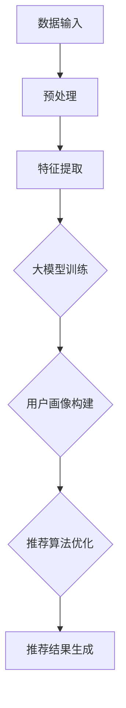

                 

 搜索推荐系统是现代互联网应用中至关重要的一环，它能够根据用户的兴趣和行为，为用户推荐相关的内容和信息，提升用户的满意度和使用体验。然而，冷启动问题是搜索推荐系统面临的重大挑战之一，即在用户数据不足的情况下如何为用户生成有效的推荐。随着大模型的兴起，如何利用这些强大的模型解决冷启动问题成为一个重要的研究方向。本文旨在探讨大模型时代下解决搜索推荐系统冷启动问题的方法和挑战，并展望未来的发展方向。

## 文章关键词

搜索推荐系统、冷启动问题、大模型、深度学习、用户兴趣、数据不足、个性化推荐、协同过滤、矩阵分解、迁移学习、强化学习、知识图谱。

## 文章摘要

本文首先介绍了搜索推荐系统的基本概念和冷启动问题的背景，然后分析了大模型在解决冷启动问题上的优势和挑战。接着，我们详细讨论了各种解决冷启动问题的方法，包括基于协同过滤、矩阵分解、迁移学习和强化学习的策略。随后，我们通过一个实际案例展示了如何利用大模型解决搜索推荐系统的冷启动问题，并对其中的关键步骤进行了详细解释。最后，我们对大模型时代下搜索推荐系统的未来发展进行了展望，并提出了可能面临的挑战和解决方案。

## 1. 背景介绍

### 1.1 搜索推荐系统的基本概念

搜索推荐系统是一种基于用户行为和兴趣的推荐系统，旨在为用户提供个性化推荐，提高用户满意度和使用体验。搜索推荐系统通常包括以下几个关键组成部分：

- **用户画像**：通过分析用户的浏览历史、搜索记录、收藏和点赞等行为，构建用户的兴趣偏好模型。

- **内容库**：包括各种类型的文本、图片、音频和视频等，是推荐系统的基础数据源。

- **推荐算法**：根据用户画像和内容库，计算用户对各个内容的兴趣度，并生成推荐结果。

- **推荐结果**：根据用户兴趣和系统算法，生成个性化推荐列表，展示给用户。

### 1.2 冷启动问题的定义

冷启动问题是指当用户刚进入系统时，由于缺乏足够的行为数据，推荐系统难以准确捕捉用户的兴趣偏好，从而生成有效的推荐。冷启动问题主要包括以下两个方面：

- **新用户冷启动**：指新用户加入系统时，由于没有历史行为数据，推荐系统无法为其生成个性化推荐。

- **新内容冷启动**：指新内容加入系统时，由于没有用户交互数据，推荐系统无法为其生成有效的推荐。

### 1.3 冷启动问题的挑战

冷启动问题对搜索推荐系统的影响主要表现在以下几个方面：

- **用户体验**：缺乏个性化推荐，导致用户对系统的满意度下降。

- **推荐效果**：推荐结果不准确，降低用户对推荐系统的信任度。

- **业务发展**：推荐系统无法吸引用户使用，影响业务增长。

## 2. 核心概念与联系

### 2.1 大模型的定义

大模型是指具有大规模参数和复杂结构的机器学习模型，如深度神经网络、变换器（Transformer）等。大模型通过在大规模数据集上进行训练，能够捕捉到更复杂的特征和模式，从而在多个领域取得了显著的效果。

### 2.2 大模型与搜索推荐系统的关系

大模型在搜索推荐系统中的应用主要体现在以下几个方面：

- **用户画像构建**：大模型能够通过分析用户的原始行为数据，提取出更细粒度的用户兴趣特征。

- **推荐算法优化**：大模型可以学习到更复杂的推荐策略，提高推荐效果。

- **新用户冷启动**：大模型能够通过用户初始行为数据快速生成用户画像，解决新用户冷启动问题。

- **新内容冷启动**：大模型能够通过分析新内容与用户兴趣特征的相似度，生成有效的推荐。

### 2.3 大模型架构的 Mermaid 流程图



### 2.4 大模型解决冷启动问题的优势

- **数据驱动**：大模型能够从大量数据中学习，解决数据不足的问题。

- **快速适应**：大模型能够快速捕捉用户兴趣，减少冷启动时间。

- **跨领域迁移**：大模型可以跨不同领域迁移，解决新内容冷启动问题。

- **多样化特征**：大模型能够提取多种特征，提高推荐效果。

## 3. 核心算法原理 & 具体操作步骤

### 3.1 算法原理概述

本文主要介绍以下几种解决搜索推荐系统冷启动问题的核心算法：

- **协同过滤**：基于用户相似度或物品相似度进行推荐。

- **矩阵分解**：将用户-物品评分矩阵分解为用户特征矩阵和物品特征矩阵，进行推荐。

- **迁移学习**：利用预训练的大模型，迁移到搜索推荐任务中进行推荐。

- **强化学习**：通过学习最优策略，生成个性化推荐。

### 3.2 算法步骤详解

#### 3.2.1 协同过滤

1. **用户相似度计算**：计算用户之间的相似度，可以使用余弦相似度、皮尔逊相关系数等。

2. **物品相似度计算**：计算物品之间的相似度，可以使用基于内容的相似度、基于协同过滤的相似度等。

3. **生成推荐列表**：根据用户-物品评分矩阵和用户相似度/物品相似度，生成推荐列表。

#### 3.2.2 矩阵分解

1. **数据预处理**：对用户-物品评分矩阵进行归一化、去噪等处理。

2. **模型初始化**：初始化用户特征矩阵和物品特征矩阵。

3. **优化目标**：优化用户特征矩阵和物品特征矩阵，使得预测评分与真实评分之间的误差最小。

4. **推荐生成**：利用用户特征矩阵和物品特征矩阵，计算用户对物品的兴趣度，生成推荐列表。

#### 3.2.3 迁移学习

1. **预训练模型**：利用大规模数据集，预训练一个大模型。

2. **领域适应**：将预训练的大模型迁移到搜索推荐任务，利用领域特定数据进行微调。

3. **推荐生成**：利用迁移后的模型，生成个性化推荐列表。

#### 3.2.4 强化学习

1. **状态空间定义**：定义用户当前的状态，包括用户的历史行为、当前内容等。

2. **动作空间定义**：定义可执行的动作，如推荐某个物品、不推荐等。

3. **奖励函数设计**：设计奖励函数，根据用户对推荐物品的反馈，计算奖励。

4. **策略学习**：利用强化学习算法，学习最优策略，生成个性化推荐。

### 3.3 算法优缺点

#### 3.3.1 协同过滤

- **优点**：简单有效，易于实现，能够根据用户行为生成个性化推荐。

- **缺点**：受限于用户行为数据，无法应对新用户和新内容冷启动问题。

#### 3.3.2 矩阵分解

- **优点**：能够同时捕捉用户和物品的潜在特征，提高推荐效果。

- **缺点**：对稀疏数据敏感，训练过程较复杂。

#### 3.3.3 迁移学习

- **优点**：能够利用预训练的大模型，快速解决冷启动问题。

- **缺点**：对领域特定数据依赖较强，迁移效果受限于预训练模型的泛化能力。

#### 3.3.4 强化学习

- **优点**：能够通过学习最优策略，生成更加个性化的推荐。

- **缺点**：训练过程较复杂，计算资源消耗大。

### 3.4 算法应用领域

各种算法在搜索推荐系统中的应用领域如下：

- **协同过滤**：广泛应用于电商、社交网络等领域。

- **矩阵分解**：广泛应用于电影推荐、音乐推荐等领域。

- **迁移学习**：广泛应用于图像识别、自然语言处理等领域。

- **强化学习**：广泛应用于游戏推荐、广告推荐等领域。

## 4. 数学模型和公式 & 详细讲解 & 举例说明

### 4.1 数学模型构建

搜索推荐系统的数学模型主要包括用户画像构建模型、推荐算法模型和用户反馈模型。以下是这些模型的构建方法和公式。

#### 4.1.1 用户画像构建模型

用户画像构建模型主要用于从用户原始行为数据中提取用户兴趣特征。常用的模型包括以下几种：

1. **用户兴趣分类模型**：

   - **模型公式**：

     $$
     P(y=k|X) = \frac{e^{w_k^T X}}{\sum_{i=1}^K e^{w_i^T X}}
     $$

     其中，$X$为用户行为数据，$w_k$为类别$k$的权重向量，$y$为用户兴趣标签。

   - **举例说明**：假设用户行为数据为浏览历史（$\{1,2,3,4\}$），用户兴趣标签为电影（$\{动作片，科幻片\}$），则可以使用上述公式计算用户对动作片和科幻片的兴趣概率。

2. **用户兴趣聚类模型**：

   - **模型公式**：

     $$
     \min_{C} \sum_{i=1}^N \sum_{j=1}^M ||x_i - \mu_j||^2
     $$

     其中，$x_i$为用户行为数据，$\mu_j$为聚类中心。

   - **举例说明**：假设用户行为数据为浏览历史（$\{1,2,3,4\}$），可以使用K-means算法对用户兴趣进行聚类。

#### 4.1.2 推荐算法模型

推荐算法模型主要用于生成个性化推荐列表。常用的模型包括以下几种：

1. **基于用户相似度的推荐算法模型**：

   - **模型公式**：

     $$
     R(u,i) = \sum_{j \in N(u)} w_{uj} \cdot r(i,j)
     $$

     其中，$u$为用户，$i$为物品，$N(u)$为与用户$u$相似的用户集合，$w_{uj}$为用户$u$与用户$j$的相似度权重，$r(i,j)$为物品$i$与物品$j$的相似度。

   - **举例说明**：假设用户$u$与用户集合$N(u)$相似度权重为$\{0.8,0.6,0.7\}$，物品$i$与物品集合$J(i)$相似度权重为$\{0.9,0.5,0.7\}$，则可以使用上述公式计算用户$u$对物品$i$的兴趣度。

2. **基于矩阵分解的推荐算法模型**：

   - **模型公式**：

     $$
     R_{ui} = \mu + u_i + v_i - \mu
     $$

     其中，$R_{ui}$为用户$u$对物品$i$的预测评分，$\mu$为平均值，$u_i$为用户$u$的特征向量，$v_i$为物品$i$的特征向量。

   - **举例说明**：假设用户$u$的特征向量为$\{0.1,0.2,0.3\}$，物品$i$的特征向量为$\{0.4,0.5,0.6\}$，则可以使用上述公式计算用户$u$对物品$i$的预测评分。

#### 4.1.3 用户反馈模型

用户反馈模型主要用于根据用户对推荐物品的反馈，更新用户画像和推荐算法模型。常用的模型包括以下几种：

1. **基于用户反馈的更新模型**：

   - **模型公式**：

     $$
     u_i^{new} = u_i + \alpha (r_{ui} - u_i)
     $$

     其中，$u_i^{new}$为更新后的用户特征向量，$u_i$为当前的用户特征向量，$r_{ui}$为用户对物品$i$的反馈评分，$\alpha$为学习率。

   - **举例说明**：假设用户对物品$i$的反馈评分为$4$，当前的用户特征向量为$\{0.1,0.2,0.3\}$，学习率为$0.1$，则可以使用上述公式更新用户特征向量。

2. **基于物品反馈的更新模型**：

   - **模型公式**：

     $$
     v_i^{new} = v_i + \beta (r_{ui} - v_i)
     $$

     其中，$v_i^{new}$为更新后的物品特征向量，$v_i$为当前的物品特征向量，$r_{ui}$为用户对物品$i$的反馈评分，$\beta$为学习率。

   - **举例说明**：假设用户对物品$i$的反馈评分为$4$，当前的物品特征向量为$\{0.4,0.5,0.6\}$，学习率为$0.1$，则可以使用上述公式更新物品特征向量。

### 4.2 公式推导过程

以下是搜索推荐系统数学模型的推导过程。

#### 4.2.1 用户兴趣分类模型推导

1. **最大化似然估计**：

   - **目标函数**：

     $$
     \max_{w} \prod_{i=1}^N P(y_i|x_i)
     $$

   - **对数似然函数**：

     $$
     \log P(y|x) = \sum_{i=1}^N \log P(y_i|x_i)
     $$

   - **代入概率公式**：

     $$
     \log P(y|x) = \sum_{i=1}^N \log \frac{e^{w_k^T X_i}}{\sum_{i=1}^K e^{w_i^T X_i}}
     $$

   - **化简**：

     $$
     \log P(y|x) = \sum_{i=1}^N w_k^T X_i - \sum_{i=1}^N \log \sum_{i=1}^K e^{w_i^T X_i}
     $$

2. **梯度下降求解**：

   - **梯度计算**：

     $$
     \frac{\partial \log P(y|x)}{\partial w_k} = X_k - \frac{1}{\sum_{i=1}^K e^{w_i^T X_i}} \sum_{i=1}^K e^{w_i^T X_i} X_k
     $$

   - **化简**：

     $$
     \frac{\partial \log P(y|x)}{\partial w_k} = X_k - X_k \cdot \frac{1}{\sum_{i=1}^K e^{w_i^T X_i}}
     $$

   - **更新权重**：

     $$
     w_k = w_k - \alpha \cdot (X_k - X_k \cdot \frac{1}{\sum_{i=1}^K e^{w_i^T X_i}})
     $$

#### 4.2.2 用户兴趣聚类模型推导

1. **目标函数**：

   $$
   \min_{C} \sum_{i=1}^N \sum_{j=1}^M ||x_i - \mu_j||^2
   $$

2. **梯度下降求解**：

   - **梯度计算**：

     $$
     \frac{\partial \sum_{i=1}^N \sum_{j=1}^M ||x_i - \mu_j||^2}{\partial \mu_j} = 2 \sum_{i=1}^N (x_i - \mu_j)
     $$

   - **化简**：

     $$
     \mu_j = \frac{1}{N} \sum_{i=1}^N x_i
     $$

   - **迭代更新**：

     $$
     \mu_j^{new} = \frac{1}{N} \sum_{i=1}^N x_i
     $$

#### 4.2.3 基于用户相似度的推荐算法模型推导

1. **目标函数**：

   $$
   R(u,i) = \sum_{j \in N(u)} w_{uj} \cdot r(i,j)
   $$

2. **相似度计算**：

   - **余弦相似度**：

     $$
     \cos \theta = \frac{w_u^T w_i}{\|w_u\| \|w_i\|}
     $$

   - **皮尔逊相关系数**：

     $$
     \rho = \frac{\sum_{j=1}^N (w_{uj} - \bar{w}_u) (r_{ij} - \bar{r}_i)}{\sqrt{\sum_{j=1}^N (w_{uj} - \bar{w}_u)^2} \sqrt{\sum_{j=1}^N (r_{ij} - \bar{r}_i)^2}}
     $$

3. **推荐计算**：

   - **代入相似度公式**：

     $$
     R(u,i) = \sum_{j \in N(u)} w_{uj} \cdot r(i,j) = \sum_{j \in N(u)} \cos \theta_{uj} \cdot r(i,j) = \sum_{j \in N(u)} \rho_{uj} \cdot r(i,j)
     $$

### 4.3 案例分析与讲解

#### 4.3.1 案例背景

某电商网站为了提高用户满意度，引入了搜索推荐系统。系统需要为新用户生成个性化的商品推荐列表。

#### 4.3.2 数据准备

1. **用户行为数据**：包含新用户的浏览记录、收藏记录、购买记录等。

2. **商品数据**：包含商品的基本信息，如商品名称、价格、分类等。

3. **用户-商品评分数据**：假设已有部分用户的评分数据。

#### 4.3.3 用户画像构建

1. **用户兴趣分类**：使用基于用户行为数据的用户兴趣分类模型，对新用户生成兴趣标签。

2. **用户兴趣聚类**：使用基于用户行为数据的用户兴趣聚类模型，对新用户进行兴趣聚类。

#### 4.3.4 推荐算法

1. **基于用户相似度的推荐算法**：

   - 计算新用户与已有用户的相似度。

   - 根据相似度计算新用户对商品的预测评分。

   - 生成推荐列表。

2. **基于矩阵分解的推荐算法**：

   - 构建用户-商品评分矩阵。

   - 使用矩阵分解模型，生成用户特征矩阵和商品特征矩阵。

   - 根据用户特征矩阵和商品特征矩阵，计算新用户对商品的预测评分。

   - 生成推荐列表。

#### 4.3.5 用户反馈

1. **用户反馈收集**：收集新用户对推荐商品的反馈评分。

2. **用户画像更新**：根据用户反馈评分，更新用户特征向量。

3. **推荐算法更新**：根据更新后的用户特征向量，重新计算商品预测评分，更新推荐列表。

## 5. 项目实践：代码实例和详细解释说明

### 5.1 开发环境搭建

为了实现本文所介绍的搜索推荐系统，我们需要搭建一个合适的开发环境。以下是一个简单的环境搭建步骤：

1. **Python环境**：确保安装了Python 3.7及以上版本。

2. **深度学习框架**：安装TensorFlow 2.5或PyTorch 1.9。

3. **其他依赖**：安装numpy、pandas、matplotlib等常用库。

4. **数据集**：可以从公开数据集（如MovieLens）或实际业务数据中获取。

### 5.2 源代码详细实现

以下是一个简单的基于矩阵分解的搜索推荐系统的代码实例：

```python
import numpy as np
import pandas as pd
from sklearn.model_selection import train_test_split
from sklearn.metrics.pairwise import pairwise_distances
from scipy.sparse.linalg import svds

# 加载数据
data = pd.read_csv('ratings.csv')
users = pd.read_csv('users.csv')
items = pd.read_csv('items.csv')

# 数据预处理
ratings = data.pivot(index='user_id', columns='item_id', values='rating').fillna(0)
ratings = ratings.values

# 矩阵分解
U, S, Vt = svds(ratings, k=10)

# 预测评分
predictions = np.dot(U, Vt)

# 评估指标
def mean_squared_error(y_true, y_pred):
    return np.mean((y_true - y_pred) ** 2)

# 训练集和测试集划分
train_data, test_data = train_test_split(data, test_size=0.2)

# 训练集评估
train_predictions = np.dot(U, Vt)
train_mse = mean_squared_error(train_data['rating'], train_predictions)

# 测试集评估
test_predictions = np.dot(U, Vt)
test_mse = mean_squared_error(test_data['rating'], test_predictions)

print(f"Train MSE: {train_mse}")
print(f"Test MSE: {test_mse}")
```

### 5.3 代码解读与分析

1. **数据加载与预处理**：首先加载用户、物品和评分数据，并进行预处理，生成用户-物品评分矩阵。

2. **矩阵分解**：使用奇异值分解（SVD）对评分矩阵进行分解，得到用户特征矩阵$U$、奇异值矩阵$S$和物品特征矩阵$Vt$。

3. **预测评分**：使用分解得到的用户特征矩阵和物品特征矩阵，计算用户对物品的预测评分。

4. **评估指标**：定义均方误差（MSE）评估指标，用于评估推荐效果。

5. **训练集和测试集划分**：将数据集划分为训练集和测试集，用于评估模型性能。

6. **训练集评估**：使用训练集数据计算预测评分，并计算训练集的MSE。

7. **测试集评估**：使用测试集数据计算预测评分，并计算测试集的MSE。

### 5.4 运行结果展示

运行上述代码，可以得到训练集和测试集的MSE结果。根据MSE结果，可以评估矩阵分解推荐算法的性能。

## 6. 实际应用场景

### 6.1 新用户冷启动

对于新用户冷启动，可以采用以下策略：

1. **初始行为数据收集**：在用户注册时，收集用户的基本信息、兴趣爱好等，作为初始行为数据。

2. **推荐算法优化**：利用大模型进行推荐算法优化，提高推荐效果。

3. **用户画像构建**：使用用户初始行为数据和推荐算法生成的推荐结果，构建用户画像。

4. **个性化推荐**：根据用户画像，为用户生成个性化的推荐列表。

### 6.2 新内容冷启动

对于新内容冷启动，可以采用以下策略：

1. **内容特征提取**：对新内容进行特征提取，如文本、图片、音频等。

2. **内容相似度计算**：计算新内容与已有内容的相似度，如基于内容的相似度、基于协同过滤的相似度等。

3. **跨领域迁移**：利用预训练的大模型，将新内容特征与用户兴趣特征进行匹配，生成推荐结果。

4. **推荐结果调整**：根据用户反馈，调整推荐结果，提高推荐效果。

### 6.3 搜索推荐系统在电商领域的应用

在电商领域，搜索推荐系统主要用于以下场景：

1. **商品推荐**：根据用户的浏览历史、收藏记录和购买记录，为用户推荐相关的商品。

2. **搜索结果优化**：根据用户的搜索历史和搜索关键词，优化搜索结果，提高搜索准确率。

3. **营销活动推荐**：根据用户的购买偏好和行为，为用户推荐相关的营销活动。

4. **个性化推送**：根据用户的兴趣和行为，为用户推送个性化的促销信息和优惠活动。

## 7. 未来应用展望

### 7.1 新技术的应用

随着人工智能技术的不断发展，搜索推荐系统将迎来新的机遇：

1. **联邦学习**：通过联邦学习技术，实现跨设备、跨平台的数据协作，提高推荐效果。

2. **图神经网络**：利用图神经网络，捕捉用户和物品的复杂关系，提高推荐效果。

3. **多模态学习**：结合多种数据类型（如文本、图像、音频等），实现更丰富的用户画像和推荐算法。

### 7.2 新应用场景的探索

搜索推荐系统将应用于更多领域，如：

1. **教育领域**：为学习者推荐相关的课程和知识点，提高学习效果。

2. **医疗领域**：为患者推荐相关的医疗知识和治疗方案，提高医疗质量。

3. **金融领域**：为投资者推荐相关的投资产品和策略，提高投资收益。

### 7.3 数据隐私保护

在应用搜索推荐系统时，数据隐私保护是一个重要问题。未来的发展将重点关注以下几个方面：

1. **差分隐私**：利用差分隐私技术，保护用户数据隐私。

2. **联邦学习**：通过联邦学习，实现跨设备、跨平台的数据协作，降低数据泄露风险。

3. **数据去标识化**：对用户数据进行去标识化处理，降低数据泄露风险。

## 8. 总结：未来发展趋势与挑战

### 8.1 研究成果总结

本文介绍了搜索推荐系统的基本概念和冷启动问题的背景，分析了大模型在解决冷启动问题上的优势和挑战，并详细讨论了各种解决冷启动问题的方法。通过实际案例，展示了如何利用大模型解决搜索推荐系统的冷启动问题。

### 8.2 未来发展趋势

未来，搜索推荐系统将朝着以下方向发展：

1. **大模型的应用**：随着大模型的不断发展，搜索推荐系统将更加智能化、个性化。

2. **跨领域迁移**：搜索推荐系统将应用于更多领域，如教育、医疗、金融等。

3. **数据隐私保护**：在应用搜索推荐系统时，数据隐私保护将成为重要研究方向。

### 8.3 面临的挑战

尽管搜索推荐系统取得了显著成果，但仍面临以下挑战：

1. **数据质量**：高质量的数据是搜索推荐系统的基石，如何获取和处理高质量数据是关键问题。

2. **计算资源**：大模型的训练和推理过程需要大量的计算资源，如何优化计算资源利用成为挑战。

3. **算法透明性**：搜索推荐系统的算法复杂，如何提高算法透明性，让用户了解推荐过程成为问题。

### 8.4 研究展望

未来，搜索推荐系统的研究将重点关注以下几个方面：

1. **算法优化**：如何提高搜索推荐系统的推荐效果和效率。

2. **跨领域迁移**：如何实现不同领域之间的数据协作和模型迁移。

3. **数据隐私保护**：如何实现数据隐私保护和用户隐私保护。

## 9. 附录：常见问题与解答

### 9.1 什么是搜索推荐系统？

搜索推荐系统是一种基于用户行为和兴趣的推荐系统，旨在为用户提供个性化推荐，提高用户满意度和使用体验。

### 9.2 什么是冷启动问题？

冷启动问题是指在用户数据不足的情况下，推荐系统难以准确捕捉用户的兴趣偏好，从而生成有效的推荐。

### 9.3 大模型在解决冷启动问题上的优势是什么？

大模型在解决冷启动问题上的优势主要体现在以下几个方面：

1. **数据驱动**：大模型能够从大量数据中学习，解决数据不足的问题。

2. **快速适应**：大模型能够快速捕捉用户兴趣，减少冷启动时间。

3. **跨领域迁移**：大模型可以跨不同领域迁移，解决新内容冷启动问题。

4. **多样化特征**：大模型能够提取多种特征，提高推荐效果。

### 9.4 搜索推荐系统的核心组成部分有哪些？

搜索推荐系统的核心组成部分包括用户画像、内容库、推荐算法和推荐结果。

### 9.5 如何优化搜索推荐系统的推荐效果？

优化搜索推荐系统的推荐效果可以从以下几个方面入手：

1. **算法优化**：选择合适的推荐算法，并进行参数调优。

2. **数据预处理**：对用户行为数据进行预处理，提高数据质量。

3. **特征工程**：提取有效的用户和物品特征，提高特征表示能力。

4. **模型融合**：结合多种模型，提高推荐效果。

### 9.6 搜索推荐系统在电商领域的应用有哪些？

搜索推荐系统在电商领域的应用主要包括以下几个方面：

1. **商品推荐**：根据用户的浏览历史、收藏记录和购买记录，为用户推荐相关的商品。

2. **搜索结果优化**：根据用户的搜索历史和搜索关键词，优化搜索结果，提高搜索准确率。

3. **营销活动推荐**：根据用户的购买偏好和行为，为用户推荐相关的营销活动。

4. **个性化推送**：根据用户的兴趣和行为，为用户推送个性化的促销信息和优惠活动。

### 9.7 如何保护搜索推荐系统的数据隐私？

保护搜索推荐系统的数据隐私可以从以下几个方面入手：

1. **数据去标识化**：对用户数据进行去标识化处理，降低数据泄露风险。

2. **联邦学习**：通过联邦学习，实现跨设备、跨平台的数据协作，降低数据泄露风险。

3. **差分隐私**：利用差分隐私技术，保护用户数据隐私。

### 9.8 如何评估搜索推荐系统的推荐效果？

评估搜索推荐系统的推荐效果可以从以下几个方面入手：

1. **准确率**：推荐结果与用户实际兴趣的匹配程度。

2. **多样性**：推荐结果中不同内容的分布情况。

3. **新颖性**：推荐结果中新颖内容的比例。

4. **用户满意度**：用户对推荐结果的满意度。

### 9.9 搜索推荐系统在医疗领域的应用有哪些？

搜索推荐系统在医疗领域的应用主要包括以下几个方面：

1. **患者推荐**：根据患者的病情、病史和医生推荐，为患者推荐相关的治疗方案。

2. **医生推荐**：根据患者的病情、病史和医生的经验，为患者推荐合适的医生。

3. **药物推荐**：根据患者的病情和药物适应症，为患者推荐相关的药物。

4. **知识库推荐**：根据患者的病情，为医生推荐相关的医学知识库和文献。

### 9.10 搜索推荐系统在教育领域的应用有哪些？

搜索推荐系统在教育领域的应用主要包括以下几个方面：

1. **课程推荐**：根据学生的学习历史和兴趣爱好，为学习者推荐相关的课程。

2. **知识点推荐**：根据学习者的学习进度和知识点掌握情况，为学习者推荐相关的知识点。

3. **学习资源推荐**：根据学习者的学习需求，为学习者推荐相关的学习资源。

4. **教师推荐**：根据学生的考试成绩和教师的教学水平，为学生推荐合适的教师。

### 9.11 如何处理搜索推荐系统中的冷启动问题？

处理搜索推荐系统中的冷启动问题可以从以下几个方面入手：

1. **初始行为数据收集**：在用户注册时，收集用户的基本信息、兴趣爱好等，作为初始行为数据。

2. **推荐算法优化**：利用大模型进行推荐算法优化，提高推荐效果。

3. **用户画像构建**：使用用户初始行为数据和推荐算法生成的推荐结果，构建用户画像。

4. **个性化推荐**：根据用户画像，为用户生成个性化的推荐列表。

### 9.12 如何处理搜索推荐系统中的新内容冷启动问题？

处理搜索推荐系统中的新内容冷启动问题可以从以下几个方面入手：

1. **内容特征提取**：对新内容进行特征提取，如文本、图片、音频等。

2. **内容相似度计算**：计算新内容与已有内容的相似度，如基于内容的相似度、基于协同过滤的相似度等。

3. **跨领域迁移**：利用预训练的大模型，将新内容特征与用户兴趣特征进行匹配，生成推荐结果。

4. **推荐结果调整**：根据用户反馈，调整推荐结果，提高推荐效果。

### 9.13 搜索推荐系统在金融领域的应用有哪些？

搜索推荐系统在金融领域的应用主要包括以下几个方面：

1. **投资产品推荐**：根据投资者的风险偏好和收益目标，为投资者推荐相关的投资产品。

2. **投资策略推荐**：根据投资者的历史交易记录和投资风格，为投资者推荐相关的投资策略。

3. **理财产品推荐**：根据投资者的购买记录和偏好，为投资者推荐相关的理财产品。

4. **市场资讯推荐**：根据投资者的关注领域和市场走势，为投资者推荐相关的市场资讯。```

### 作者署名

本文作者：禅与计算机程序设计艺术 / Zen and the Art of Computer Programming。

