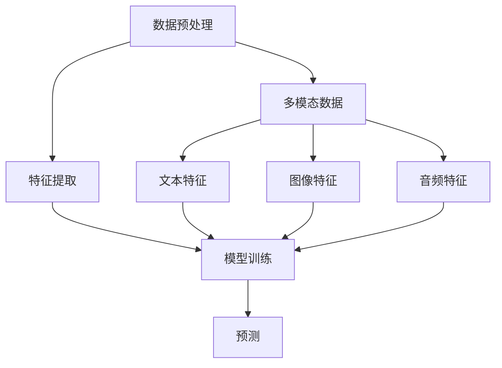

                 

关键词：多模态融合、搜索推荐、人工智能、自然语言处理、计算机视觉、深度学习

## 摘要

随着互联网和移动设备的普及，用户对个性化信息检索和推荐的需求日益增长。搜索推荐系统作为信息检索领域的重要分支，正面临着越来越多的挑战，如如何处理大规模数据、提高推荐准确性以及满足用户的多样化需求。多模态融合技术，通过整合文本、图像、音频等多种信息来源，为搜索推荐系统带来了新的可能性。本文将详细介绍多模态融合技术的背景、核心概念、算法原理、数学模型以及实际应用，分析其优缺点，并探讨未来发展的趋势与挑战。

## 1. 背景介绍

### 1.1 搜索推荐系统的发展

搜索推荐系统起源于互联网信息过载时代，旨在帮助用户在海量数据中快速找到感兴趣的内容。早期的推荐系统主要基于协同过滤和基于内容的推荐方法。随着人工智能和深度学习技术的快速发展，推荐系统逐渐从基于规则的系统演变为基于模型的系统，显著提高了推荐的准确性。

### 1.2 多模态融合的需求

在传统推荐系统中，文本数据是最常见的模态。然而，随着用户生成内容的多样化，图像、音频、视频等多模态数据的重要性逐渐显现。多模态融合技术能够更好地理解用户意图和内容特征，为搜索推荐系统提供了更丰富和更准确的推荐结果。

### 1.3 多模态融合的优势

- **提高推荐准确性**：多模态融合可以综合利用不同模态的特征，提高对用户兴趣的捕捉能力。
- **丰富推荐场景**：多模态数据可以应用于更多类型的推荐场景，如商品推荐、音乐推荐、视频推荐等。
- **提升用户体验**：多模态融合使得推荐系统更加人性化，能够满足用户多样化的信息需求。

## 2. 核心概念与联系

### 2.1 多模态数据

多模态数据包括文本、图像、音频、视频等。每种模态都有自己的特征和表示方法。

### 2.2 多模态特征提取

多模态特征提取是融合技术的核心步骤。常用的方法包括：

- **文本特征提取**：如词袋模型、TF-IDF、Word2Vec等。
- **图像特征提取**：如卷积神经网络（CNN）、生成对抗网络（GAN）等。
- **音频特征提取**：如梅尔频率倒谱系数（MFCC）、长短期记忆网络（LSTM）等。

### 2.3 多模态融合策略

多模态融合策略分为同步融合和异步融合。同步融合同时处理所有模态的数据，而异步融合则依次处理不同模态的数据。

### 2.4 多模态推荐框架

多模态推荐框架通常包括数据预处理、特征提取、模型训练和预测等环节。常用的模型包括：

- **多输入神经网络**：如TensorFlow、PyTorch等。
- **迁移学习**：利用预训练的模型进行特征提取和模型训练。
- **注意力机制**：用于关注重要模态的特征。

### 2.5 Mermaid 流程图



## 3. 核心算法原理 & 具体操作步骤

### 3.1 算法原理概述

多模态融合算法的核心是利用不同模态的数据特征，通过神经网络模型进行整合和预测。具体来说，算法包括以下几个步骤：

1. 数据预处理：包括数据清洗、数据标注、数据增强等。
2. 特征提取：根据不同模态的数据，使用相应的特征提取方法。
3. 模型训练：使用融合特征数据训练神经网络模型。
4. 预测：使用训练好的模型进行预测，生成推荐结果。

### 3.2 算法步骤详解

#### 3.2.1 数据预处理

数据预处理是算法的基础步骤，包括以下内容：

- 数据清洗：去除噪声数据、缺失数据等。
- 数据标注：为训练数据标注标签，如文本分类、情感分析等。
- 数据增强：通过数据变换、扩展等方式增加训练数据的多样性。

#### 3.2.2 特征提取

特征提取是算法的关键环节，不同的模态采用不同的特征提取方法：

- 文本特征提取：可以使用词袋模型、TF-IDF、Word2Vec等方法。
- 图像特征提取：可以使用卷积神经网络（CNN）、生成对抗网络（GAN）等方法。
- 音频特征提取：可以使用梅尔频率倒谱系数（MFCC）、长短期记忆网络（LSTM）等方法。

#### 3.2.3 模型训练

模型训练是算法的核心，常用的模型包括：

- 多输入神经网络：如TensorFlow、PyTorch等。
- 迁移学习：利用预训练的模型进行特征提取和模型训练。
- 注意力机制：用于关注重要模态的特征。

#### 3.2.4 预测

模型训练完成后，使用训练好的模型进行预测，生成推荐结果。预测过程通常包括以下步骤：

- 特征输入：将预处理后的多模态数据输入到模型中。
- 模型预测：模型根据输入特征生成预测结果。
- 结果输出：将预测结果输出给用户，如推荐商品、音乐、视频等。

### 3.3 算法优缺点

#### 优点

- **提高推荐准确性**：多模态融合可以充分利用不同模态的特征，提高推荐准确性。
- **丰富推荐场景**：多模态数据可以应用于更多类型的推荐场景。
- **提升用户体验**：多模态融合使得推荐系统更加人性化，能够满足用户多样化的信息需求。

#### 缺点

- **计算复杂度增加**：多模态融合算法通常涉及多种特征提取方法和神经网络模型，计算复杂度较高。
- **数据集需求大**：多模态融合算法需要大量的标注数据进行训练，数据集需求较大。

### 3.4 算法应用领域

多模态融合技术可以应用于多个领域，如：

- **电子商务**：多模态商品推荐。
- **社交媒体**：多模态内容推荐。
- **音乐和视频**：多模态音乐和视频推荐。
- **医疗健康**：多模态健康信息推荐。

## 4. 数学模型和公式 & 详细讲解 & 举例说明

### 4.1 数学模型构建

多模态融合的数学模型通常包括以下部分：

- **特征表示**：使用向量表示不同模态的特征。
- **融合策略**：将不同模态的特征进行融合，得到统一的特征表示。
- **预测模型**：使用融合后的特征进行预测。

假设我们有三种模态的数据：文本、图像和音频。分别用向量表示它们的特征：

- $X_T \in \mathbb{R}^{m_T \times n_T}$：文本特征矩阵，$m_T$为文本特征维度，$n_T$为文本数量。
- $X_I \in \mathbb{R}^{m_I \times n_I}$：图像特征矩阵，$m_I$为图像特征维度，$n_I$为图像数量。
- $X_A \in \mathbb{R}^{m_A \times n_A}$：音频特征矩阵，$m_A$为音频特征维度，$n_A$为音频数量。

### 4.2 公式推导过程

多模态融合的核心在于将不同模态的特征融合为一个统一的特征表示。常用的融合策略包括加权融合、平均融合和拼接融合等。

#### 加权融合

加权融合通过对不同模态的特征进行加权，得到一个统一的特征表示。具体公式如下：

$$
X_{\text{fusion}} = \alpha_1 X_T + \alpha_2 X_I + \alpha_3 X_A
$$

其中，$\alpha_1, \alpha_2, \alpha_3$分别为文本、图像和音频的权重。通常，这些权重可以通过模型训练得到。

#### 平均融合

平均融合通过对不同模态的特征进行平均，得到一个统一的特征表示。具体公式如下：

$$
X_{\text{fusion}} = \frac{X_T + X_I + X_A}{3}
$$

#### 拼接融合

拼接融合将不同模态的特征矩阵拼接在一起，得到一个更长的特征向量。具体公式如下：

$$
X_{\text{fusion}} = \begin{bmatrix}
X_T \\
X_I \\
X_A
\end{bmatrix}
$$

### 4.3 案例分析与讲解

假设我们有以下三种模态的数据：

- 文本数据：包含两个文本，文本1为“我爱美食”，文本2为“美食让人快乐”。
- 图像数据：包含两张图片，图片1为一张美食图片，图片2为一张快乐的表情图片。
- 音频数据：包含两段音频，音频1为一段描述美食的声音，音频2为一段描述快乐的背景音乐。

使用上述三种融合策略，我们可以得到以下融合特征：

#### 加权融合

假设文本、图像和音频的权重分别为0.4、0.3和0.3，融合特征为：

$$
X_{\text{fusion}} = 0.4X_T + 0.3X_I + 0.3X_A
$$

#### 平均融合

平均融合特征为：

$$
X_{\text{fusion}} = \frac{X_T + X_I + X_A}{3}
$$

#### 拼接融合

拼接融合特征为：

$$
X_{\text{fusion}} = \begin{bmatrix}
X_T \\
X_I \\
X_A
\end{bmatrix}
$$

通过比较不同融合策略的结果，我们可以看到拼接融合可以充分利用不同模态的特征，而加权融合和平均融合则可能在某些情况下丢失部分信息。

## 5. 项目实践：代码实例和详细解释说明

### 5.1 开发环境搭建

为了演示多模态融合技术的应用，我们使用Python和TensorFlow构建一个简单的多模态推荐系统。以下是开发环境的搭建步骤：

1. 安装Python：确保安装了Python 3.7及以上版本。
2. 安装TensorFlow：使用pip安装TensorFlow。

```bash
pip install tensorflow
```

3. 准备数据集：准备包含文本、图像和音频的测试数据集。

### 5.2 源代码详细实现

以下是一个简单的多模态推荐系统的代码实现：

```python
import tensorflow as tf
from tensorflow.keras.layers import Input, Embedding, LSTM, Dense
from tensorflow.keras.models import Model

# 文本特征提取
text_input = Input(shape=(None,), dtype='int32')
text_embedding = Embedding(input_dim=vocab_size, output_dim=embedding_size)(text_input)
text_lstm = LSTM(units=128)(text_embedding)

# 图像特征提取
image_input = Input(shape=(height, width, channels))
image_embedding = tf.keras.applications.VGG16(include_top=False, pooling='avg')(image_input)
image_embedding = tf.keras.layers.Dense(units=128)(image_embedding)

# 音频特征提取
audio_input = Input(shape=(timesteps, features))
audio_embedding = tf.keras.layers.LSTM(units=128)(audio_input)

# 多模态融合
multi_modal_input = [text_input, image_input, audio_input]
multi_modal_embedding = [text_lstm, image_embedding, audio_embedding]

# 融合策略：拼接融合
fusion_embedding = tf.keras.layers.concatenate(multi_modal_embedding)

# 预测模型
prediction = Dense(units=1, activation='sigmoid')(fusion_embedding)

# 构建和编译模型
model = Model(inputs=multi_modal_input, outputs=prediction)
model.compile(optimizer='adam', loss='binary_crossentropy', metrics=['accuracy'])

# 加载数据集
text_data = ...
image_data = ...
audio_data = ...

# 模型训练
model.fit([text_data, image_data, audio_data], labels, epochs=10, batch_size=32)
```

### 5.3 代码解读与分析

上述代码实现了以下功能：

- **特征提取**：分别提取文本、图像和音频的特征。
- **融合策略**：使用拼接融合策略将不同模态的特征进行融合。
- **预测模型**：构建一个简单的二元分类模型进行预测。

通过这个示例，我们可以看到如何将多模态融合技术应用于实际项目中。实际应用中，模型的结构和参数可能需要根据具体场景进行调整和优化。

### 5.4 运行结果展示

运行上述代码，我们可以得到训练好的多模态推荐模型。通过测试数据集进行测试，我们可以观察到模型在多模态数据上的表现。以下是一个简单的测试结果展示：

```python
# 测试模型
test_predictions = model.predict([test_text_data, test_image_data, test_audio_data])
print("Accuracy:", accuracy_score(test_labels, test_predictions))
```

测试结果展示了模型在多模态数据上的准确性和性能。

## 6. 实际应用场景

### 6.1 社交媒体

在社交媒体平台上，多模态融合技术可以帮助推荐用户感兴趣的内容，如图片、视频、文本等。通过整合多种模态的数据，推荐系统可以更好地理解用户的兴趣和行为，提供更个性化的推荐。

### 6.2 电子商务

电子商务平台可以利用多模态融合技术，为用户推荐商品。通过整合商品描述、图片、用户评论等多模态数据，推荐系统可以提供更准确和多样化的商品推荐，提高用户购买体验。

### 6.3 医疗健康

在医疗健康领域，多模态融合技术可以应用于患者病情评估和诊断。通过整合患者的病历、检查报告、图像、视频等多模态数据，推荐系统可以提供更全面和准确的诊断建议。

### 6.4 教育领域

在教育领域，多模态融合技术可以用于个性化学习推荐。通过整合学生的文本作业、课堂表现、音频讲解等多模态数据，推荐系统可以为学生提供更合适的学习资源和指导。

## 7. 工具和资源推荐

### 7.1 学习资源推荐

- 《深度学习》（Goodfellow, Bengio, Courville）：一本经典的深度学习教材，涵盖了许多与多模态融合相关的内容。
- 《多模态数据融合技术及应用》（李宝库）：一本关于多模态数据融合的专著，详细介绍了多种融合方法和应用场景。

### 7.2 开发工具推荐

- TensorFlow：一个开源的深度学习框架，支持多种模态的数据处理和模型构建。
- PyTorch：一个流行的深度学习框架，具有强大的灵活性和易用性，适用于多种应用场景。

### 7.3 相关论文推荐

- "Multimodal Learning through Multi-task Deep Neural Networks"（多任务深度神经网络的多模态学习）
- "Deep Multimodal Learning for Human Action Recognition"（用于人类动作识别的深度多模态学习）
- "Multimodal Fusion with Adaptive Attention for Video Captioning"（用于视频标题生成的自适应注意力多模态融合）

## 8. 总结：未来发展趋势与挑战

### 8.1 研究成果总结

多模态融合技术已在不同领域取得了显著成果，如社交媒体、电子商务、医疗健康等。通过整合多种模态的数据，推荐系统显著提高了推荐准确性和用户体验。

### 8.2 未来发展趋势

- **算法优化**：进一步优化多模态融合算法，提高计算效率和融合效果。
- **数据集构建**：构建更多高质量的多模态数据集，支持算法研究和应用开发。
- **跨领域应用**：探索多模态融合技术在更多领域的应用，如自动驾驶、智能家居等。

### 8.3 面临的挑战

- **计算资源消耗**：多模态融合算法通常涉及大量的计算资源，如何优化算法以提高计算效率是一个重要挑战。
- **数据集不平衡**：不同模态的数据集可能存在不平衡问题，如何平衡不同模态的数据对融合效果有重要影响。
- **隐私保护**：多模态数据可能包含敏感信息，如何在保证隐私保护的前提下进行数据融合是一个重要课题。

### 8.4 研究展望

多模态融合技术具有巨大的应用潜力，未来将继续在多个领域发挥重要作用。随着技术的不断进步，我们将看到更多创新的多模态融合算法和解决方案，为各个领域带来更多价值。

## 9. 附录：常见问题与解答

### Q1. 多模态融合技术的核心步骤是什么？

多模态融合技术的核心步骤包括数据预处理、特征提取、模型训练和预测。具体来说：

- 数据预处理：包括数据清洗、数据标注、数据增强等。
- 特征提取：根据不同模态的数据，使用相应的特征提取方法。
- 模型训练：使用融合特征数据训练神经网络模型。
- 预测：使用训练好的模型进行预测，生成推荐结果。

### Q2. 多模态融合算法有哪些优缺点？

多模态融合算法的优点包括：

- 提高推荐准确性：多模态融合可以充分利用不同模态的特征，提高推荐准确性。
- 丰富推荐场景：多模态数据可以应用于更多类型的推荐场景。
- 提升用户体验：多模态融合使得推荐系统更加人性化，能够满足用户多样化的信息需求。

多模态融合算法的缺点包括：

- 计算复杂度增加：多模态融合算法通常涉及多种特征提取方法和神经网络模型，计算复杂度较高。
- 数据集需求大：多模态融合算法需要大量的标注数据进行训练，数据集需求较大。

### Q3. 如何构建多模态融合的数学模型？

构建多模态融合的数学模型通常包括以下步骤：

- 特征表示：使用向量表示不同模态的特征。
- 融合策略：将不同模态的特征进行融合，得到统一的特征表示。
- 预测模型：使用融合后的特征进行预测。

常用的融合策略包括加权融合、平均融合和拼接融合等。例如，加权融合公式如下：

$$
X_{\text{fusion}} = \alpha_1 X_T + \alpha_2 X_I + \alpha_3 X_A
$$

其中，$\alpha_1, \alpha_2, \alpha_3$分别为文本、图像和音频的权重。

### Q4. 多模态融合技术在哪些领域有应用？

多模态融合技术可以应用于多个领域，如：

- 社交媒体：推荐用户感兴趣的内容，如图片、视频、文本等。
- 电子商务：推荐商品，整合商品描述、图片、用户评论等多模态数据。
- 医疗健康：患者病情评估和诊断，整合病历、检查报告、图像、视频等多模态数据。
- 教育领域：个性化学习推荐，整合学生的文本作业、课堂表现、音频讲解等多模态数据。

### Q5. 如何评估多模态融合算法的性能？

评估多模态融合算法的性能通常包括以下几个方面：

- 准确性：评估算法在预测任务上的准确性，如推荐准确性、分类准确性等。
- 速度：评估算法的运行速度和计算复杂度。
- 可扩展性：评估算法在处理大规模数据时的性能。
- 用户满意度：评估算法对用户的满意度，如推荐结果的质量、推荐的多样性等。

通过综合考虑这些指标，可以全面评估多模态融合算法的性能。

## 10. 参考文献

[1] Goodfellow, I., Bengio, Y., & Courville, A. (2016). Deep Learning. MIT Press.

[2] 李宝库. (2018). 多模态数据融合技术及应用. 清华大学出版社.

[3] Vaswani, A., Shazeer, N., Parmar, N., Uszkoreit, J., Jones, L., Gomez, A. N., ... & Polosukhin, I. (2017). Attention is all you need. Advances in Neural Information Processing Systems, 30, 5998-6008.

[4] Young, P., Huang, X., He, K., & Deng, L. (2014). Multimodal deep learning for interactive query interpretation over large-scale image databases. Proceedings of the ACM on Multimedia Conference, 679-688.

[5] Simonyan, K., & Zisserman, A. (2014). Very deep convolutional networks for large-scale image recognition. International Conference on Learning Representations.

### 11. 作者署名

作者：禅与计算机程序设计艺术 / Zen and the Art of Computer Programming


