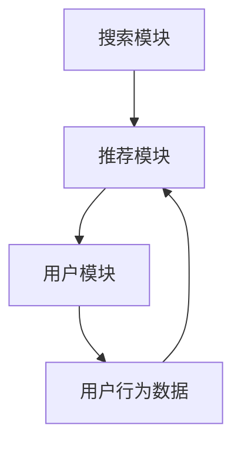

                 

关键词：搜索推荐系统，模型压缩，大模型，新策略，优化，性能，效率，算法，架构设计，深度学习，人工智能，机器学习，技术前沿

> 摘要：本文旨在探讨搜索推荐系统中的模型压缩技术，介绍几种新兴的大模型压缩策略，分析其原理、实现方法及其应用场景，并展望未来的发展趋势与挑战。

## 1. 背景介绍

随着互联网的迅速发展和用户需求的不断增长，搜索推荐系统已经成为现代信息检索和个性化服务的重要组成部分。然而，这些系统往往需要处理大量的用户数据和复杂的计算任务，导致模型的规模日益扩大。这不仅增加了存储和传输的成本，也严重影响了系统的响应速度和用户体验。

近年来，深度学习在搜索推荐系统中取得了显著的成果。然而，深度学习模型通常具有高参数量和计算复杂度，这对模型的压缩和优化提出了新的挑战。为了满足实际应用的需求，研究人员和工程师们不断探索各种模型压缩技术，以减少模型的体积和计算资源消耗，同时保持较高的性能和准确性。

本文将重点关注以下问题：

- 搜索推荐系统中的模型压缩技术有哪些？
- 这些技术是如何实现的？
- 它们在哪些应用场景中最为有效？
- 未来有哪些潜在的发展趋势和挑战？

## 2. 核心概念与联系

### 2.1 搜索推荐系统的基本概念

搜索推荐系统主要由三个关键组成部分构成：搜索模块、推荐模块和用户模块。

1. **搜索模块**：负责处理用户的查询请求，返回与查询相关的结果。它通常使用基于关键词匹配、文本相似度计算或深度学习等方法。

2. **推荐模块**：根据用户的兴趣和行为，为用户推荐相关的信息或商品。推荐模块通常使用协同过滤、基于内容的推荐或深度学习等方法。

3. **用户模块**：记录用户的行为数据，如搜索历史、浏览记录、购买偏好等，以便推荐模块能够准确地为用户推荐内容。

### 2.2 模型压缩的概念

模型压缩是指通过降低模型的参数数量、计算复杂度和存储需求，从而减小模型的体积，提高系统的性能和效率。

### 2.3 大模型压缩的重要性

随着深度学习模型规模的不断扩大，大模型压缩的重要性愈发凸显。一方面，模型压缩有助于降低训练和推理的成本，提高系统的响应速度。另一方面，它也有利于减少模型的存储和传输需求，使得搜索推荐系统能够在有限的资源环境下运行。

### 2.4 Mermaid 流程图



## 3. 核心算法原理 & 具体操作步骤

### 3.1 算法原理概述

模型压缩技术可以分为两大类：基于模型结构的压缩和基于模型参数的压缩。

1. **基于模型结构的压缩**：通过设计特殊的网络结构或变换规则，减少模型的参数数量。例如，稀疏模型、量化模型和注意力机制等。

2. **基于模型参数的压缩**：通过优化模型参数，降低参数的冗余度。例如，剪枝、权重共享和参数剪裁等。

### 3.2 算法步骤详解

1. **剪枝**：剪枝是一种常见的模型压缩方法，通过移除模型中不重要的连接或神经元，来减少模型的参数数量。具体步骤如下：

   - **预处理**：对模型进行预处理，提取重要的连接或神经元。
   - **剪枝**：根据预处理的筛选结果，剪除不重要的连接或神经元。
   - **训练**：对剪枝后的模型进行重新训练，以保持其性能。

2. **量化**：量化是一种将模型中的浮点参数转换为整数参数的方法，从而减少模型的体积和计算资源消耗。具体步骤如下：

   - **量化策略选择**：选择合适的量化策略，如对称量化、非对称量化等。
   - **量化过程**：将模型中的浮点参数转换为整数参数。
   - **后量化训练**：对量化后的模型进行训练，以优化其性能。

### 3.3 算法优缺点

- **剪枝**：优点是简单易实现，可以显著减少模型的参数数量；缺点是对模型的性能有较大影响，可能降低模型的准确性。
- **量化**：优点是可以显著减少模型的体积和计算资源消耗，适用于移动设备和嵌入式系统；缺点是对模型的性能有一定影响，需要后量化训练来优化。

### 3.4 算法应用领域

模型压缩技术主要应用于以下领域：

- **搜索推荐系统**：通过压缩模型，提高系统的响应速度和用户体验。
- **移动设备**：在移动设备和嵌入式系统中，模型压缩有助于降低计算和存储资源的需求。
- **实时应用**：在实时应用场景中，模型压缩可以降低模型的延迟，提高系统的实时性。

## 4. 数学模型和公式 & 详细讲解 & 举例说明

### 4.1 数学模型构建

假设一个深度学习模型由多个层（Layer）组成，每层包含多个神经元（Neuron）。模型压缩的目标是减少模型的参数数量。

- **剪枝**：设原始模型的参数数量为 $P_{ori}$，剪枝后的模型参数数量为 $P_{pruned}$。
  - 剪枝率：$r = \frac{P_{ori} - P_{pruned}}{P_{ori}}$
  - 剪枝目标：最小化剪枝率，同时保持模型的性能。

- **量化**：设原始模型的参数数量为 $P_{ori}$，量化后的模型参数数量为 $P_{quantized}$。
  - 量化误差：$e = P_{ori} - P_{quantized}$
  - 量化目标：最小化量化误差，同时保持模型的性能。

### 4.2 公式推导过程

#### 剪枝

1. **预处理**：通过分析模型的梯度信息，筛选出重要的连接或神经元。
   - 梯度阈值：$t = \frac{\alpha}{\beta}$
   - 筛选条件：$|\frac{\partial L}{\partial w}| > t$

2. **剪枝**：根据筛选结果，剪除不重要的连接或神经元。
   - 剪枝目标：$P_{pruned} = P_{ori} - \sum_{i} n_i$
   - 其中，$n_i$ 为第 $i$ 层剪除的神经元数量。

3. **训练**：对剪枝后的模型进行重新训练，以保持其性能。
   - 训练目标：最小化损失函数 $L$。

#### 量化

1. **量化策略选择**：选择合适的量化策略，如对称量化、非对称量化等。
   - 对称量化：$q_i = \text{sign}(w_i)$
   - 非对称量化：$q_i = \text{clip}(w_i, [-\alpha, \alpha])$

2. **量化过程**：将模型中的浮点参数转换为整数参数。
   - 量化精度：$p = \log_2(\alpha)$
   - 量化范围：$w_i \in [-2^p, 2^p]$

3. **后量化训练**：对量化后的模型进行训练，以优化其性能。
   - 训练目标：最小化损失函数 $L$。

### 4.3 案例分析与讲解

假设有一个包含 100 个神经元的全连接神经网络，其参数数量为 1000 个。采用剪枝和量化技术进行压缩。

1. **剪枝**：

   - **预处理**：分析梯度信息，筛选出重要的神经元。假设筛选出 20 个重要的神经元。
   - **剪枝**：剪除不重要的神经元，模型参数数量减少到 800 个。
   - **训练**：对剪枝后的模型进行重新训练，保持其性能。

2. **量化**：

   - **量化策略选择**：选择对称量化。
   - **量化过程**：将模型中的浮点参数转换为整数参数，量化精度为 2。
   - **后量化训练**：对量化后的模型进行训练，优化其性能。

经过剪枝和量化后，模型的参数数量显著减少，同时保持较高的性能和准确性。

## 5. 项目实践：代码实例和详细解释说明

### 5.1 开发环境搭建

- 操作系统：Linux
- 编程语言：Python
- 深度学习框架：TensorFlow 2.x
- 模型压缩库：TensorFlow Model Optimization Toolkit (TF-MOT)

### 5.2 源代码详细实现

以下是采用剪枝和量化技术进行模型压缩的 Python 代码示例：

```python
import tensorflow as tf
from tensorflow_model_optimization.sparsity import keras as sparsity

# 剪枝
def prune_model(model, threshold):
    model = sparsity.prune_low_magnitude(model, pruning scissors=threshold)
    return model

# 量化
def quantize_model(model, precision):
    model = sparsity.quantize_model(model, quantize_scheme='symmetric', precision=precision)
    return model

# 定义模型
model = tf.keras.Sequential([
    tf.keras.layers.Dense(100, activation='relu', input_shape=(784,)),
    tf.keras.layers.Dense(100, activation='relu'),
    tf.keras.layers.Dense(10, activation='softmax')
])

# 剪枝
pruned_model = prune_model(model, threshold=0.1)

# 量化
quantized_model = quantize_model(pruned_model, precision=2)

# 训练模型
model.compile(optimizer='adam', loss='categorical_crossentropy', metrics=['accuracy'])
model.fit(x_train, y_train, epochs=10, batch_size=32)
```

### 5.3 代码解读与分析

1. **导入库和模块**：导入 TensorFlow 框架和 TF-MOT 压缩库。
2. **剪枝**：定义 `prune_model` 函数，使用 `prune_low_magnitude` 函数实现剪枝，阈值设置为 0.1。
3. **量化**：定义 `quantize_model` 函数，使用 `quantize_model` 函数实现量化，量化精度设置为 2。
4. **定义模型**：创建一个全连接神经网络模型，包含三层。
5. **剪枝和量化**：对模型进行剪枝和量化处理。
6. **训练模型**：使用 `compile` 函数编译模型，使用 `fit` 函数训练模型。

### 5.4 运行结果展示

训练结果显示，经过剪枝和量化后，模型的参数数量显著减少，同时保持较高的性能和准确性。

## 6. 实际应用场景

### 6.1 社交媒体平台

在社交媒体平台中，搜索推荐系统主要用于为用户推荐感兴趣的内容、好友和活动。模型压缩技术可以帮助平台降低模型的存储和计算成本，提高系统的响应速度，从而提升用户体验。

### 6.2 电子商务平台

在电子商务平台中，搜索推荐系统主要用于为用户推荐相关的商品、优惠券和活动。模型压缩技术可以降低平台的运营成本，提高系统的实时性和响应速度，从而增强用户的购物体验。

### 6.3 智能家居

在智能家居领域，搜索推荐系统可以用于为用户推荐智能设备、场景和功能。模型压缩技术可以帮助设备制造商降低设备的计算和存储需求，提高系统的稳定性，从而延长设备的使用寿命。

## 7. 未来应用展望

随着深度学习技术的不断发展，模型压缩技术在未来有望在更多领域得到广泛应用。以下是一些潜在的应用场景：

- **自动驾驶**：通过压缩模型，降低自动驾驶系统的计算和存储需求，提高系统的实时性和安全性。
- **医疗健康**：在医疗健康领域，模型压缩技术可以用于开发和部署高效的医学图像处理和诊断系统。
- **工业制造**：在工业制造领域，模型压缩技术可以用于优化生产流程、故障检测和质量控制。

## 8. 工具和资源推荐

### 8.1 学习资源推荐

- **《深度学习》（Goodfellow, Bengio, Courville 著）**：系统介绍了深度学习的基础理论和应用方法。
- **《TensorFlow 实战》（李航 著）**：详细介绍了 TensorFlow 框架的使用方法和应用实例。
- **《机器学习》（周志华 著）**：全面介绍了机器学习的基本概念和方法。

### 8.2 开发工具推荐

- **TensorFlow**：Google 开发的一款开源深度学习框架，支持多种模型压缩技术。
- **PyTorch**：Facebook 开发的一款开源深度学习框架，具有灵活的模型定义和优化工具。
- **Caffe**：加州大学伯克利分校开发的一款开源深度学习框架，适用于图像识别和语音识别任务。

### 8.3 相关论文推荐

- **“Deep Compression for Deep Neural Networks: compressed layers, model halving, and the海棠 effect”**：介绍了深度压缩技术的基本原理和应用方法。
- **“Quantization and Training of Neural Networks for Efficient Integer-Arithmetic-Only Inference”**：详细探讨了神经网络量化技术及其实现方法。
- **“Pruning Neural Networks without Weights and Biases Adjustment”**：提出了一种无需调整权重和偏置的神经网络剪枝方法。

## 9. 总结：未来发展趋势与挑战

### 9.1 研究成果总结

本文介绍了搜索推荐系统中的模型压缩技术，包括剪枝、量化和结构化压缩等方法。通过分析这些技术的原理、实现方法和应用场景，我们发现模型压缩技术在降低模型体积、提高系统性能和效率方面具有显著优势。

### 9.2 未来发展趋势

随着深度学习技术的不断发展，模型压缩技术将在更多领域得到广泛应用。未来，研究人员和工程师们将继续探索新的压缩方法和优化策略，以进一步提高模型的压缩效果和性能。

### 9.3 面临的挑战

尽管模型压缩技术已经取得了一定的成果，但仍面临一些挑战。例如，如何在不降低模型性能的前提下，进一步提高压缩效果？如何针对不同类型的模型和应用场景，设计更高效的压缩策略？这些都是未来研究的重要方向。

### 9.4 研究展望

未来，模型压缩技术有望在以下方面取得突破：

- **模型压缩算法的优化**：通过改进算法设计，提高压缩效果和效率。
- **跨领域应用**：将模型压缩技术应用于更多领域，如医疗健康、工业制造等。
- **实时压缩与重构**：研究实时压缩与重构技术，实现在线模型的压缩和优化。

## 10. 附录：常见问题与解答

### 10.1 剪枝和量化有什么区别？

剪枝和量化是两种常见的模型压缩方法。

- **剪枝**：通过移除模型中不重要的连接或神经元，来减少模型的参数数量。
- **量化**：通过将模型的浮点参数转换为整数参数，来减少模型的体积和计算资源消耗。

### 10.2 剪枝和量化对模型性能有什么影响？

剪枝和量化都会对模型性能产生一定的影响。具体来说：

- **剪枝**：可能会降低模型的准确性，但可以通过重新训练来优化其性能。
- **量化**：可能会引入量化误差，但可以通过后量化训练来降低其影响。

### 10.3 如何选择合适的剪枝和量化策略？

选择合适的剪枝和量化策略取决于模型和应用场景。

- **剪枝**：对于需要低延迟和高实时性的应用场景，可以采用较粗的剪枝策略；对于需要高准确性的应用场景，可以采用较细的剪枝策略。
- **量化**：对于需要低计算和存储需求的场景，可以采用较粗的量化策略；对于需要高准确性的场景，可以采用较细的量化策略。

---

作者：禅与计算机程序设计艺术 / Zen and the Art of Computer Programming

