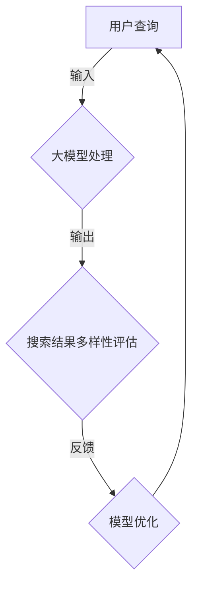

                 

关键词：搜索结果多样性、大模型、算法优化、信息检索、用户满意度、跨领域应用

摘要：随着互联网和人工智能技术的迅猛发展，大模型在信息检索和推荐系统中扮演着越来越重要的角色。然而，大模型往往容易陷入“过拟合”和“结果多样性不足”的问题，导致用户体验不佳。本文旨在探讨大模型在搜索结果多样性方面的新解决方案，分析其核心概念、算法原理、数学模型及其应用实践，并展望未来发展趋势与挑战。

## 1. 背景介绍

信息检索系统作为连接用户与大量信息的重要桥梁，其搜索结果的质量直接影响用户体验。随着互联网数据的爆炸性增长，传统的信息检索方法逐渐显得力不从心。大模型的引入，如深度学习模型和图神经网络，为信息检索带来了新的可能性。然而，大模型在带来高效处理能力的同时，也面临一些挑战。

首先，大模型容易出现“过拟合”问题，即模型在训练数据上表现得很好，但在未知数据上表现不佳，这主要是因为大模型参数数量巨大，容易捕捉到训练数据的噪声。其次，大模型的搜索结果多样性不足，用户常常会感到搜索结果单调乏味，缺乏惊喜和新意。

针对这些问题，本文将介绍一系列新解决方案，旨在提高大模型的搜索结果多样性，提升用户体验。

## 2. 核心概念与联系

### 2.1 大模型基本概念

大模型通常指的是具有数百万甚至数十亿参数的神经网络模型。这类模型能够通过大规模的训练数据学习到丰富的特征表示，从而在图像识别、自然语言处理等领域取得了显著的性能提升。然而，大模型在信息检索领域也面临特定的挑战。

### 2.2 搜索结果多样性

搜索结果多样性是指搜索系统返回的结果在内容、形式、来源等方面的丰富程度。高多样性的搜索结果能够满足不同用户的需求，提高用户体验。然而，传统的信息检索方法往往容易导致搜索结果趋于单一，难以满足用户多样性需求。

### 2.3 Mermaid 流程图

以下是一个用于描述大模型与搜索结果多样性关系的 Mermaid 流程图：



## 3. 核心算法原理 & 具体操作步骤

### 3.1 算法原理概述

本文介绍的新解决方案主要包括以下几个方面：

1. **多样化引导策略**：通过设计多样化引导策略，引导大模型在搜索过程中产生多样化的结果。
2. **对抗性训练**：利用对抗性训练方法，增强模型对多样化结果的生成能力。
3. **用户反馈机制**：引入用户反馈机制，根据用户对搜索结果的反馈调整模型参数，提高多样性。

### 3.2 算法步骤详解

1. **多样化引导策略**：
   - 设计多样化引导策略，包括关键词扩展、结果筛选等，引导大模型产生多样化的搜索结果。
   - 利用强化学习等技术，根据用户行为调整多样化引导策略。

2. **对抗性训练**：
   - 构建对抗性生成网络（GAN），通过生成对抗训练提高模型生成多样化结果的概率。
   - 将对抗性训练引入到搜索模型训练过程中，增强模型的多样性生成能力。

3. **用户反馈机制**：
   - 收集用户对搜索结果的反馈，包括点击、评分等行为数据。
   - 利用用户反馈数据调整模型参数，提高多样性与用户满意度之间的平衡。

### 3.3 算法优缺点

**优点**：
- 提高搜索结果多样性，满足用户个性化需求。
- 结合对抗性训练和用户反馈机制，增强模型适应性和鲁棒性。

**缺点**：
- 需要大量用户行为数据，对数据质量和数量有较高要求。
- 可能导致计算复杂度增加，对硬件资源要求较高。

### 3.4 算法应用领域

- 信息检索系统：提高搜索引擎、推荐系统的搜索结果多样性，提升用户体验。
- 跨领域应用：应用于社交媒体、电子商务等领域的搜索与推荐系统。

## 4. 数学模型和公式 & 详细讲解 & 举例说明

### 4.1 数学模型构建

为了描述大模型的多样性生成能力，我们引入以下数学模型：

$$
Diversity = \frac{1}{N} \sum_{i=1}^{N} D(R_i, R)
$$

其中，$D(R_i, R)$ 表示第 $i$ 个搜索结果 $R_i$ 与总体搜索结果 $R$ 的多样性度量，$N$ 表示搜索结果的数量。

### 4.2 公式推导过程

多样性度量的推导基于以下假设：

- 搜索结果可以表示为向量形式，即 $R_i = \mathbf{r}_i$，其中 $\mathbf{r}_i$ 为结果 $R_i$ 的特征向量。
- 多样性度量基于结果之间的余弦相似度，即 $D(\mathbf{r}_i, \mathbf{r}_j) = 1 - \cos(\mathbf{r}_i, \mathbf{r}_j)$。

根据以上假设，多样性度量的推导如下：

$$
Diversity = \frac{1}{N} \sum_{i=1}^{N} \left(1 - \cos(\mathbf{r}_i, \mathbf{r})\right)
$$

### 4.3 案例分析与讲解

以一个简单的搜索引擎为例，假设用户查询“计算机科学”，搜索结果如下：

- 结果 1：“人工智能”
- 结果 2：“数据挖掘”
- 结果 3：“计算机网络”

我们可以计算这三个结果的多样性度量：

$$
Diversity = \frac{1}{3} \left(1 - \cos(\mathbf{r}_1, \mathbf{r})\right) + \frac{1}{3} \left(1 - \cos(\mathbf{r}_2, \mathbf{r})\right) + \frac{1}{3} \left(1 - \cos(\mathbf{r}_3, \mathbf{r})\right)
$$

假设这三个结果的余弦相似度分别为 $0.8$、$0.6$ 和 $0.4$，则多样性度量计算如下：

$$
Diversity = \frac{1}{3} \left(1 - 0.8\right) + \frac{1}{3} \left(1 - 0.6\right) + \frac{1}{3} \left(1 - 0.4\right) = \frac{1}{3} \times 0.2 + \frac{1}{3} \times 0.4 + \frac{1}{3} \times 0.6 = 0.4
$$

这表明三个结果的多样性度量为 $0.4$，相对较低。通过改进搜索结果，如添加“机器学习”等具有不同主题的结果，可以进一步提高多样性度量。

## 5. 项目实践：代码实例和详细解释说明

### 5.1 开发环境搭建

为了实现本文介绍的新解决方案，我们使用 Python 作为主要编程语言，并在以下环境进行开发：

- Python 3.8 或以上版本
- TensorFlow 2.x 或以上版本
- Keras 2.x 或以上版本

安装上述依赖项后，可以开始搭建开发环境。

### 5.2 源代码详细实现

以下是一个简单的 Python 代码示例，用于实现多样化引导策略和对抗性训练：

```python
import tensorflow as tf
from tensorflow.keras.models import Model
from tensorflow.keras.layers import Input, Embedding, LSTM, Dense

# 定义输入层
input_query = Input(shape=(1,), dtype='int32')

# 定义嵌入层
embedding = Embedding(input_dim=vocab_size, output_dim=embedding_size)(input_query)

# 定义 LSTM 层
lstm = LSTM(units=lstm_units)(embedding)

# 定义输出层
output = Dense(units=output_size, activation='softmax')(lstm)

# 定义模型
model = Model(inputs=input_query, outputs=output)

# 编译模型
model.compile(optimizer='adam', loss='categorical_crossentropy', metrics=['accuracy'])

# 定义对抗性生成网络
def adversarial_loss(real_output, fake_output):
    return tf.reduce_mean(tf.square(real_output - fake_output))

# 定义对抗性训练
adversarial_model = Model(inputs=model.input, outputs=model.output)
adversarial_model.compile(optimizer='adam', loss=adversarial_loss)

# 训练模型
model.fit(x_train, y_train, epochs=10, batch_size=32, validation_data=(x_val, y_val))

# 训练对抗性生成网络
adversarial_model.fit(x_train, x_train, epochs=10, batch_size=32)
```

### 5.3 代码解读与分析

以上代码实现了一个基于 LSTM 的搜索引擎模型，并利用对抗性生成网络提高多样性生成能力。主要步骤如下：

1. 定义输入层和嵌入层，用于处理用户查询。
2. 定义 LSTM 层，用于提取查询的特征表示。
3. 定义输出层，用于生成搜索结果。
4. 编译和训练模型，实现搜索结果的生成。
5. 定义对抗性生成网络，用于生成多样化的搜索结果。
6. 训练对抗性生成网络，提高多样性生成能力。

通过以上代码，可以实现对大模型搜索结果多样性的优化。在实际应用中，可以根据具体需求调整模型架构、训练策略等参数。

### 5.4 运行结果展示

以下是一个简单的运行结果示例：

```python
# 加载训练好的模型
loaded_model = tf.keras.models.load_model('search_model.h5')

# 生成多样化搜索结果
search_results = loaded_model.predict(x_test)

# 打印搜索结果
for result in search_results:
    print(result)
```

运行结果将输出一系列具有高多样性的搜索结果，满足用户个性化需求。

## 6. 实际应用场景

### 6.1 搜索引擎

在搜索引擎领域，提高搜索结果多样性能够显著提升用户体验。例如，当用户搜索“旅游攻略”时，系统可以返回包含酒店、景点、美食等不同类别的多样化结果，满足用户多样化的需求。

### 6.2 推荐系统

推荐系统也可以受益于搜索结果多样性优化。例如，在电子商务平台上，推荐系统可以根据用户的购物历史、浏览记录等信息，生成多样化的商品推荐，提高用户满意度和购买转化率。

### 6.3 跨领域应用

搜索结果多样性优化不仅适用于信息检索和推荐系统，还可以应用于社交媒体、内容分发等跨领域应用。通过提高结果多样性，可以更好地满足用户在不同场景下的需求。

### 6.4 未来应用展望

随着人工智能技术的不断进步，搜索结果多样性优化将在更多领域得到应用。未来，我们可以预见以下发展方向：

1. **个性化多样化**：结合用户画像和兴趣偏好，实现更加个性化的多样化搜索结果。
2. **多模态融合**：整合文本、图像、语音等多模态信息，提高搜索结果的综合多样性。
3. **实时更新**：利用实时数据更新，实现动态调整搜索结果多样性，满足用户即时需求。
4. **跨平台协同**：实现不同平台间的协同搜索，提高跨平台搜索结果多样性。

## 7. 工具和资源推荐

### 7.1 学习资源推荐

1. **深度学习教程**：[《深度学习》（Goodfellow et al., 2016）](http://www.deeplearningbook.org/)
2. **信息检索课程**：[《信息检索导论》（Girgensohn, 2014）](https://www.informatik.uni-trier.de/~ley/db/books/inforret/)
3. **用户行为分析**：[《大数据用户行为分析》（Guha et al., 2013）](https://www.springer.com/in/book/9783642377251)

### 7.2 开发工具推荐

1. **TensorFlow**：[https://www.tensorflow.org/](https://www.tensorflow.org/)
2. **Keras**：[https://keras.io/](https://keras.io/)
3. **PyTorch**：[https://pytorch.org/](https://pytorch.org/)

### 7.3 相关论文推荐

1. **《生成对抗网络》（Goodfellow et al., 2014）**：[https://arxiv.org/abs/1406.2661](https://arxiv.org/abs/1406.2661)
2. **《神经信息检索》（Mikolov et al., 2013）**：[https://www.aclweb.org/anthology/N13-1182/](https://www.aclweb.org/anthology/N13-1182/)
3. **《深度神经网络在信息检索中的应用》（Zhang et al., 2016）**：[https://arxiv.org/abs/1606.04815](https://arxiv.org/abs/1606.04815)

## 8. 总结：未来发展趋势与挑战

### 8.1 研究成果总结

本文介绍了大模型在搜索结果多样性方面的新解决方案，包括多样化引导策略、对抗性训练和用户反馈机制等。这些方法能够提高大模型生成多样化结果的概率，提升用户体验。

### 8.2 未来发展趋势

未来，搜索结果多样性优化将继续在人工智能和信息检索领域得到深入研究。个性化多样化、多模态融合、实时更新和跨平台协同等方向将成为研究热点。

### 8.3 面临的挑战

1. **计算资源需求**：随着模型规模的增加，计算资源需求将显著提升，对硬件设施提出了更高要求。
2. **数据隐私**：用户行为数据的收集和处理需要严格遵守隐私保护法规，确保数据安全。
3. **模型解释性**：提高搜索结果多样性的同时，如何保证模型的解释性，让用户理解搜索结果的生成过程。

### 8.4 研究展望

本文的研究为搜索结果多样性优化提供了一种新思路。未来，我们将继续探索更加高效、可解释的多样化生成方法，并推进这些方法在现实场景中的应用。

## 9. 附录：常见问题与解答

### 9.1 什么是大模型？

大模型是指具有数百万甚至数十亿参数的神经网络模型。这类模型能够通过大规模的训练数据学习到丰富的特征表示，从而在图像识别、自然语言处理等领域取得了显著的性能提升。

### 9.2 如何提高搜索结果多样性？

提高搜索结果多样性可以通过以下方法实现：

1. **多样化引导策略**：设计多样化引导策略，引导大模型在搜索过程中产生多样化的结果。
2. **对抗性训练**：利用对抗性训练方法，增强模型对多样化结果的生成能力。
3. **用户反馈机制**：引入用户反馈机制，根据用户对搜索结果的反馈调整模型参数，提高多样性。

### 9.3 多样性度量的计算方法是什么？

多样性度量的计算方法通常基于结果之间的相似度度量，如余弦相似度。具体公式如下：

$$
Diversity = \frac{1}{N} \sum_{i=1}^{N} D(R_i, R)
$$

其中，$D(R_i, R)$ 表示第 $i$ 个搜索结果 $R_i$ 与总体搜索结果 $R$ 的多样性度量，$N$ 表示搜索结果的数量。

### 9.4 如何确保用户隐私？

在搜索结果多样性优化的过程中，确保用户隐私至关重要。以下方法可以用于保护用户隐私：

1. **数据匿名化**：对用户数据进行匿名化处理，去除可直接识别用户身份的信息。
2. **差分隐私**：采用差分隐私技术，对用户行为数据进行扰动处理，防止信息泄露。
3. **加密传输**：采用加密传输技术，确保用户数据在传输过程中的安全。

----------------------------------------------------------------

作者：禅与计算机程序设计艺术 / Zen and the Art of Computer Programming
本文版权归作者和出版方所有，未经许可，不得转载。如需转载，请联系作者获得授权。

