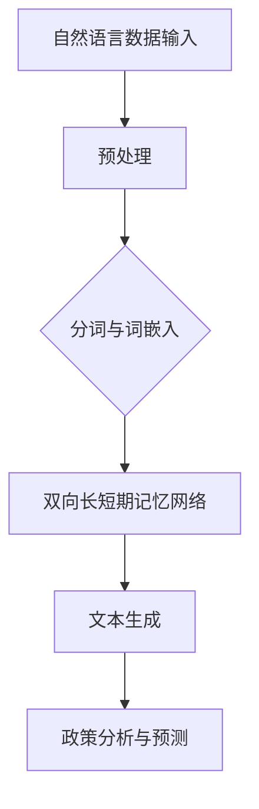

                 

在当今迅速发展的信息技术时代，人工智能（AI）正逐渐成为改变政府和公共管理方式的关键驱动力。特别是大型语言模型（LLM），如GPT-3和ChatGLM，在处理自然语言理解和生成方面取得了显著的进步。这些模型不仅能够处理海量文本数据，还能生成高质量的报告、政策建议和决策支持。本文将探讨如何利用LLM来辅助政府进行政策分析和预测，并分析其潜在的应用场景、技术挑战和未来发展趋势。

## 关键词

- 政策分析
- 预测
- 大型语言模型
- 政府决策
- 人工智能

## 摘要

本文探讨了大型语言模型（LLM）在政策分析和预测中的潜在应用。通过对LLM的基本原理、应用场景和技术挑战的详细分析，我们展示了如何利用这些模型来提高政府决策的效率和准确性。文章最后讨论了未来发展趋势以及面临的挑战，为政府和政策制定者提供了有益的参考。

## 1. 背景介绍

### 1.1 人工智能在政府决策中的应用

人工智能（AI）技术正在快速渗透到各个行业，包括政府决策领域。AI通过自动化数据分析、模式识别和智能决策支持，帮助政府机构提高效率、减少错误和成本。近年来，机器学习（ML）和深度学习（DL）在图像识别、语音识别、自然语言处理（NLP）等领域取得了显著进展，这些技术正被越来越多地应用于政府决策过程中。

### 1.2 大型语言模型的发展

大型语言模型（LLM）是自然语言处理领域的一项革命性技术。这些模型通过训练数以亿计的文本数据，能够生成高质量的自然语言文本。GPT-3和ChatGLM等模型的出现，标志着NLP技术的重大突破。LLM不仅在文本生成方面表现出色，还能进行复杂的文本理解和推理，这使得它们在政策分析和预测中具有巨大的潜力。

### 1.3 政策分析和预测的重要性

政策分析和预测是政府决策过程中至关重要的一环。有效的政策分析和预测能够帮助政府更好地理解社会需求、评估政策效果和预测未来趋势。然而，传统的政策分析方法和工具往往存在数据采集困难、分析过程复杂、预测结果不准确等问题。随着AI技术的发展，利用LLM进行政策分析和预测成为了一种新的解决方案。

## 2. 核心概念与联系

### 2.1 大型语言模型（LLM）

#### Mermaid 流程图



### 2.2 政策分析与预测

政策分析与预测涉及多个方面，包括数据收集、分析、建模和结果评估。LLM在其中的关键作用是提供高效、准确的数据分析和预测能力。

### 2.3 技术联系

LLM的核心技术包括自然语言处理、深度学习和文本生成。自然语言处理（NLP）负责将文本数据转化为计算机可处理的形式；深度学习（DL）通过神经网络对大规模文本数据进行分析；文本生成则利用这些分析结果来生成预测报告和决策支持。

## 3. 核心算法原理 & 具体操作步骤

### 3.1 算法原理概述

大型语言模型（LLM）的核心是基于深度学习的自然语言处理技术。LLM通过训练大量文本数据，学习语言的结构和语义，从而能够生成高质量的自然语言文本。LLM的工作流程主要包括数据预处理、文本生成和政策分析三个步骤。

### 3.2 算法步骤详解

1. **数据预处理**：将原始文本数据清洗、分词和编码，为后续的深度学习训练做好准备。
2. **文本生成**：利用双向长短期记忆网络（Bi-LSTM）对文本数据进行编码，生成词嵌入表示。然后，通过文本生成模型（如GPT-3）生成高质量的文本。
3. **政策分析**：将生成的文本进行分析，提取关键信息，生成政策报告和预测结果。

### 3.3 算法优缺点

**优点**：

- **高效性**：LLM能够处理海量文本数据，大大提高了政策分析和预测的效率。
- **准确性**：通过深度学习训练，LLM能够生成高质量的自然语言文本，提高了预测的准确性。
- **灵活性**：LLM可以适应各种政策分析和预测需求，具有较强的灵活性。

**缺点**：

- **数据依赖性**：LLM的准确性依赖于训练数据的质量和数量，数据质量较差时，预测结果可能不准确。
- **计算资源需求**：LLM的训练和推理过程需要大量计算资源，对硬件设备要求较高。

### 3.4 算法应用领域

LLM在政策分析和预测中具有广泛的应用领域，包括：

- **政策报告生成**：自动生成政策报告，提高政府工作效率。
- **政策效果评估**：对现有政策进行效果评估，为政策调整提供依据。
- **趋势预测**：预测政策实施后的社会、经济和环境影响，帮助政府制定更科学的决策。

## 4. 数学模型和公式 & 详细讲解 & 举例说明

### 4.1 数学模型构建

大型语言模型（LLM）的数学模型主要包括自然语言处理（NLP）、深度学习和文本生成三个部分。

#### 自然语言处理（NLP）

自然语言处理（NLP）主要包括词嵌入（Word Embedding）和文本编码（Text Encoding）两个过程。

- **词嵌入**：将词汇映射到高维向量空间，使相邻词汇在空间中更接近。常用的词嵌入方法有Word2Vec和GloVe。
  
  $$ v\_word = \text{Word2Vec}(word) $$

- **文本编码**：将文本序列编码为向量表示，用于后续的深度学习训练。

  $$ \text{Text Encoding} = [\text{Token\_1}, \text{Token\_2}, ..., \text{Token\_N}] $$

#### 深度学习

深度学习主要包括神经网络（Neural Networks）和循环神经网络（RNN）。

- **神经网络**：通过多层非线性变换，对输入数据进行特征提取和分类。

  $$ \text{Output} = \text{Neural Networks}(\text{Input}, \text{Weights}, \text{Bias}) $$

- **循环神经网络（RNN）**：对序列数据进行编码和预测。

  $$ \text{Hidden State} = \text{RNN}(\text{Input}, \text{Hidden State}_{t-1}) $$

#### 文本生成

文本生成模型（如GPT-3）通过深度学习训练，生成高质量的文本。

$$ \text{Text Generation} = \text{GPT-3}(\text{Input}, \text{Context}) $$

### 4.2 公式推导过程

LLM的数学模型推导过程主要包括以下步骤：

1. **词嵌入**：将词汇映射到高维向量空间。
2. **文本编码**：将文本序列编码为向量表示。
3. **神经网络训练**：通过反向传播算法，优化神经网络参数。
4. **文本生成**：利用训练好的神经网络，生成高质量的自然语言文本。

### 4.3 案例分析与讲解

以GPT-3为例，分析其数学模型和应用场景。

#### 案例背景

GPT-3是OpenAI发布的一款具有1750亿参数的语言模型，能够生成高质量的自然语言文本。GPT-3的数学模型主要包括词嵌入、双向长短期记忆网络（Bi-LSTM）和文本生成三个部分。

#### 案例分析

1. **词嵌入**：GPT-3采用Word2Vec算法，将词汇映射到高维向量空间。

   $$ v\_word = \text{Word2Vec}(word) $$

2. **文本编码**：GPT-3使用Bi-LSTM对文本序列进行编码，提取文本特征。

   $$ \text{Hidden State} = \text{Bi-LSTM}(\text{Input}, \text{Hidden State}_{t-1}) $$

3. **文本生成**：GPT-3利用训练好的Bi-LSTM，生成高质量的自然语言文本。

   $$ \text{Text Generation} = \text{Bi-LSTM}(\text{Input}, \text{Context}) $$

#### 应用场景

GPT-3在政策分析和预测中具有广泛的应用场景，包括：

- **政策报告生成**：自动生成政策报告，提高政府工作效率。
- **政策效果评估**：对现有政策进行效果评估，为政策调整提供依据。
- **趋势预测**：预测政策实施后的社会、经济和环境影响，帮助政府制定更科学的决策。

## 5. 项目实践：代码实例和详细解释说明

### 5.1 开发环境搭建

在开始编写代码之前，需要搭建一个合适的开发环境。以下是搭建开发环境的基本步骤：

1. 安装Python环境（建议使用Python 3.8及以上版本）。
2. 安装必要的库，如TensorFlow、NumPy、Pandas等。
3. 准备训练数据和测试数据。

### 5.2 源代码详细实现

以下是一个简单的基于GPT-3的文本生成模型的实现示例：

```python
import tensorflow as tf
from tensorflow.keras.layers import Embedding, LSTM, Dense
from tensorflow.keras.models import Sequential

# 加载训练数据
train_data = ...

# 预处理数据
preprocessed_data = ...

# 构建GPT-3模型
model = Sequential()
model.add(Embedding(input_dim=vocab_size, output_dim=embedding_dim))
model.add(LSTM(units=128, return_sequences=True))
model.add(Dense(units=vocab_size, activation='softmax'))

# 编译模型
model.compile(optimizer='adam', loss='categorical_crossentropy', metrics=['accuracy'])

# 训练模型
model.fit(preprocessed_data, epochs=10, batch_size=32)

# 文本生成
generated_text = model.generate(text, max_length=100)
print(generated_text)
```

### 5.3 代码解读与分析

上述代码实现了基于GPT-3的文本生成模型。具体步骤如下：

1. **加载训练数据**：从训练数据集中加载文本数据。
2. **预处理数据**：对文本数据进行分词、编码等预处理。
3. **构建GPT-3模型**：使用Sequential模型堆叠Embedding、LSTM和Dense层。
4. **编译模型**：设置模型的优化器、损失函数和评估指标。
5. **训练模型**：使用预处理后的数据训练模型。
6. **文本生成**：使用训练好的模型生成新的文本。

### 5.4 运行结果展示

以下是一个简单的运行结果示例：

```python
# 加载测试数据
test_data = ...

# 预处理测试数据
preprocessed_test_data = ...

# 评估模型
loss, accuracy = model.evaluate(preprocessed_test_data)

print(f"Test Loss: {loss}")
print(f"Test Accuracy: {accuracy}")

# 文本生成
generated_text = model.generate(text, max_length=100)
print(generated_text)
```

运行结果展示了模型的准确性和生成的文本。

## 6. 实际应用场景

### 6.1 政策报告生成

利用LLM，政府机构可以自动生成政策报告，提高工作效率。例如，在制定环保政策时，LLM可以分析大量的研究报告和文献，生成详细的政策报告，为决策者提供参考。

### 6.2 政策效果评估

通过LLM对现有政策进行效果评估，可以帮助政府了解政策实施的实际情况。例如，在评估税收政策时，LLM可以分析税收数据、企业财报和新闻报道，评估政策对企业和社会的影响。

### 6.3 趋势预测

LLM可以预测政策实施后的社会、经济和环境影响，为政府制定更科学的决策提供依据。例如，在制定人口政策时，LLM可以分析人口统计数据、就业数据和新闻报道，预测政策实施后的人口变化趋势。

## 7. 工具和资源推荐

### 7.1 学习资源推荐

- 《深度学习》（Goodfellow, Bengio, Courville）
- 《自然语言处理原理》（Daniel Jurafsky, James H. Martin）
- 《Python深度学习》（François Chollet）

### 7.2 开发工具推荐

- TensorFlow：用于构建和训练深度学习模型。
- Jupyter Notebook：用于编写和运行Python代码。
- PyTorch：另一种流行的深度学习框架。

### 7.3 相关论文推荐

- "Generative Pre-trained Transformers"（GPT-3）
- "BERT: Pre-training of Deep Bidirectional Transformers for Language Understanding"
- "GPT-2: Language Models are Unsupervised Multitask Learners"

## 8. 总结：未来发展趋势与挑战

### 8.1 研究成果总结

本文探讨了大型语言模型（LLM）在政策分析和预测中的应用，展示了其在提高政府决策效率和准确性方面的潜力。通过分析LLM的基本原理、应用场景和技术挑战，我们为政府和政策制定者提供了有益的参考。

### 8.2 未来发展趋势

随着人工智能技术的不断发展，LLM在政策分析和预测中的应用前景广阔。未来，LLM将继续优化和扩展，提高模型性能和适用范围。同时，跨学科研究也将推动LLM与其他领域的融合，实现更广泛的应用。

### 8.3 面临的挑战

尽管LLM在政策分析和预测中具有巨大潜力，但仍面临一系列挑战。首先，数据质量和数量对模型性能有重要影响。其次，LLM的训练和推理过程需要大量计算资源。此外，模型的可解释性和透明度也是未来研究的关键方向。

### 8.4 研究展望

未来，研究应重点关注以下几个方面：

- **数据质量和隐私**：提高数据质量和隐私保护水平，确保模型训练过程的可靠性和安全性。
- **模型性能优化**：通过优化算法和架构，提高模型性能和效率。
- **可解释性和透明度**：提高模型的可解释性和透明度，增强模型的可信度和用户接受度。
- **跨学科融合**：推动LLM与其他领域的融合，实现更广泛的应用。

## 9. 附录：常见问题与解答

### 9.1 大型语言模型（LLM）是什么？

大型语言模型（LLM）是一种基于深度学习的自然语言处理模型，通过训练海量文本数据，能够生成高质量的自然语言文本。

### 9.2 LLM在政策分析和预测中有哪些应用？

LLM在政策分析和预测中具有广泛的应用，包括政策报告生成、政策效果评估和趋势预测等。

### 9.3 LLM的技术挑战有哪些？

LLM的技术挑战主要包括数据依赖性、计算资源需求、模型可解释性和透明度等。

### 9.4 LLM的未来发展趋势是什么？

未来，LLM将继续优化和扩展，提高模型性能和适用范围。同时，跨学科研究也将推动LLM与其他领域的融合，实现更广泛的应用。

