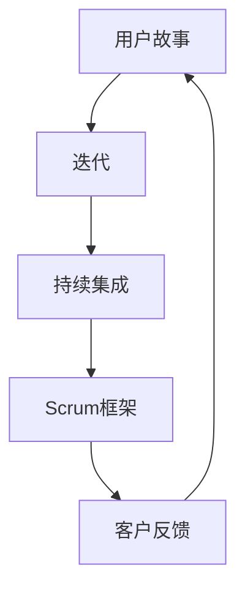

                 

在当前这个信息爆炸、竞争激烈的全球市场中，企业的成功不再仅仅依赖于优秀的产品或服务，更重要的是如何快速适应市场的变化，持续创新。敏捷管理正是为了应对这一挑战而出现的一套方法体系。本文将深入探讨敏捷管理的核心概念、实施步骤、数学模型及其在IT行业中的应用。

## 关键词
敏捷管理、市场适应、快速迭代、持续交付、IT行业、创新

## 摘要
本文首先介绍了敏捷管理的起源和基本概念，随后详细探讨了敏捷管理在IT行业中的应用，包括开发流程、项目管理、团队协作等方面。接着，通过数学模型和具体案例，展示了敏捷管理在实践中的效果。最后，我们对敏捷管理的未来发展趋势和面临的挑战进行了展望。

## 1. 背景介绍

### 1.1 敏捷管理的起源
敏捷管理起源于软件开发领域，其根源可以追溯到2001年，当时一群软件开发者在一次名为“雪鸟”的会议上提出了“敏捷宣言”。宣言中提出了四个核心价值：
- **个体和互动高于流程和工具**：强调团队成员的互动和协作的重要性。
- **可工作的软件高于详尽的文档**：强调交付可运行的软件产品的重要性。
- **客户合作高于合同谈判**：强调与客户的紧密合作，以更好地理解客户需求。
- **响应变化的重要性高于遵循计划**：强调在项目过程中对变化进行适应。

这些价值为敏捷管理奠定了基础。

### 1.2 敏捷管理的发展
随着敏捷管理在软件开发中的成功应用，其理念逐渐扩展到其他领域，如产品管理、项目管理、甚至整个企业的运营管理。敏捷管理强调快速迭代、持续交付和持续改进，这些特点使其成为适应快速变化市场的理想工具。

## 2. 核心概念与联系

敏捷管理涉及多个核心概念，如用户故事、迭代、持续集成、Scrum框架等。以下是这些概念及其相互关系的Mermaid流程图：



### 2.1 用户故事
用户故事是一种简单明了的需求描述方法，通常以“作为一个[用户类型]，我想要[功能]，以便[业务价值]”的形式表达。用户故事强调用户需求，有助于团队聚焦于真正有价值的功能。

### 2.2 迭代
迭代是敏捷开发中的基本周期，通常持续2-4周。在每个迭代中，团队会选择用户故事进行开发，并在迭代结束时交付可运行的软件。迭代有助于团队快速反馈、快速适应变化。

### 2.3 持续集成
持续集成是一种软件开发实践，通过自动化测试和代码库的持续更新，确保软件始终处于可运行状态。持续集成有助于减少集成风险，提高开发效率。

### 2.4 Scrum框架
Scrum是一种流行的敏捷框架，包括每日站会、迭代回顾、迭代计划会议等实践。Scrum强调团队的自我组织和自我管理，以提高团队的协作效率和项目成功。

## 3. 核心算法原理 & 具体操作步骤

### 3.1 算法原理概述
敏捷管理中的核心算法原理是快速迭代和持续交付。通过迭代，团队可以不断收集反馈并进行调整，从而确保产品始终符合用户需求。持续交付则确保了产品的高质量，通过自动化测试和持续集成，减少了集成风险。

### 3.2 算法步骤详解
#### 3.2.1 迭代规划
在每个迭代开始时，团队会制定一个迭代计划，包括选择用户故事、设定目标、分配任务等。

#### 3.2.2 开发与测试
在迭代期间，团队会进行开发和测试，确保交付的软件质量。

#### 3.2.3 迭代交付
在迭代结束时，团队会交付一个可运行的软件版本，并收集客户反馈。

#### 3.2.4 迭代回顾
在每次迭代结束后，团队会进行迭代回顾，总结经验教训，并规划下一迭代。

### 3.3 算法优缺点
#### 优点：
- **快速响应变化**：通过迭代和持续交付，团队可以快速适应市场变化。
- **高质量交付**：持续集成和自动化测试确保了软件的高质量。
- **客户参与**：客户参与需求收集和反馈，有助于确保产品符合客户需求。

#### 缺点：
- **需要持续的时间投资**：敏捷管理需要持续的培训和改进，否则可能导致效率低下。
- **项目管理复杂度增加**：敏捷管理中的多个迭代和反馈环节增加了项目管理的复杂性。

### 3.4 算法应用领域
敏捷管理在软件开发、产品管理、项目管理和企业运营管理等多个领域都有广泛应用。特别是在IT行业，敏捷管理已成为许多成功企业的重要战略。

## 4. 数学模型和公式 & 详细讲解 & 举例说明

### 4.1 数学模型构建
敏捷管理中的数学模型主要包括迭代时间和交付质量的计算。

#### 迭代时间（T）：
$$
T = \frac{D}{P}
$$
其中，D为迭代周期，P为团队平均开发效率。

#### 交付质量（Q）：
$$
Q = \frac{100}{1 + \frac{k \cdot T}{D}}
$$
其中，k为迭代质量系数。

### 4.2 公式推导过程
#### 迭代时间（T）推导：
迭代时间取决于迭代周期D和团队平均开发效率P。假设迭代周期D固定，则迭代时间T与团队平均开发效率P成反比。

#### 交付质量（Q）推导：
交付质量取决于迭代时间T和迭代质量系数k。迭代质量系数k反映了团队在迭代过程中对质量的重视程度。当迭代时间T较长时，交付质量Q会降低。

### 4.3 案例分析与讲解
假设一个团队的平均开发效率为2个用户故事/天，迭代周期为2周。如果迭代质量系数k为1，则：
#### 迭代时间（T）：
$$
T = \frac{2}{2} = 1 \text{天}
$$
#### 交付质量（Q）：
$$
Q = \frac{100}{1 + \frac{1 \cdot 1}{2}} = 66.67\%
$$
如果迭代质量系数k增加到2，则：
$$
Q = \frac{100}{1 + \frac{2 \cdot 1}{2}} = 50\%
$$
可以看到，迭代质量系数k的增加会导致交付质量的降低。

## 5. 项目实践：代码实例和详细解释说明

### 5.1 开发环境搭建
为了展示敏捷管理在项目实践中的应用，我们以一个简单的Web应用项目为例。首先，我们需要搭建一个基本的开发环境，包括：
- 代码版本控制工具（如Git）
- 代码编辑器（如Visual Studio Code）
- 集成开发环境（如Apache Maven）
- 自动化测试工具（如JUnit）

### 5.2 源代码详细实现
接下来，我们来实现一个简单的Web应用，包括以下功能：
- 用户注册
- 用户登录
- 用户资料修改

以下是用户注册功能的代码实现：

```java
public class UserRegistration {
    public static void register(String username, String password, String email) {
        // 存储用户信息到数据库
        Database.saveUser(new User(username, password, email));
        // 发送激活邮件
        EmailService.sendActivationEmail(email);
    }
}
```

### 5.3 代码解读与分析
上述代码实现了用户注册功能，主要涉及数据库存储和邮件发送。在敏捷开发中，这类功能通常会在一个迭代周期内完成，并进行单元测试和集成测试，确保功能正常运行。

### 5.4 运行结果展示
当用户成功注册后，系统会发送激活邮件，用户点击邮件中的链接进行激活。激活后，用户可以登录系统并进行资料修改。

## 6. 实际应用场景

### 6.1 敏捷管理在软件开发中的应用
敏捷管理在软件开发中得到了广泛应用，特别是在互联网公司和初创企业。通过快速迭代和持续交付，团队可以更快地响应市场需求，提高产品质量和客户满意度。

### 6.2 敏捷管理在其他领域的应用
除了软件开发，敏捷管理还在产品管理、项目管理、企业运营管理等领域得到了应用。通过敏捷管理，团队可以更好地协调工作，提高协作效率，实现持续改进。

### 6.3 未来应用展望
随着数字化转型的深入推进，敏捷管理将在更多领域得到应用。未来，敏捷管理将更加智能化，结合人工智能、大数据等技术，实现更加精准的需求分析和决策。

## 7. 工具和资源推荐

### 7.1 学习资源推荐
- 《敏捷实践指南》（作者：Jeff Sutherland）
- 《敏捷管理：实践者的手册》（作者：Dean Leffingwell）

### 7.2 开发工具推荐
- JIRA
- Trello
- GitLab

### 7.3 相关论文推荐
- "Agile Project Management: Creating Successful Environmental Projects"（作者：Michael Beaven）
- "Agile Practices for Sustainable Software Development"（作者：Mikael Lindvall）

## 8. 总结：未来发展趋势与挑战

### 8.1 研究成果总结
敏捷管理在实践中的应用取得了显著成果，提高了团队协作效率、产品质量和客户满意度。未来，敏捷管理将继续向智能化、个性化方向发展。

### 8.2 未来发展趋势
随着数字化转型的深入推进，敏捷管理将在更多领域得到应用。未来，敏捷管理将更加智能化，结合人工智能、大数据等技术，实现更加精准的需求分析和决策。

### 8.3 面临的挑战
敏捷管理在实施过程中仍面临一些挑战，如团队成员的培训、项目管理的复杂性等。未来，需要进一步优化敏捷管理实践，提高其实施效果。

### 8.4 研究展望
未来，敏捷管理的研究将更加注重智能化、个性化，探索如何更好地适应不同领域的需求。同时，还将关注敏捷管理在数字化转型中的角色和作用。

## 9. 附录：常见问题与解答

### 9.1 敏捷管理与传统项目管理有什么区别？
敏捷管理强调快速响应变化和持续交付，而传统项目管理更注重计划和控制。敏捷管理强调团队协作和用户参与，而传统项目管理更注重项目经理的角色。

### 9.2 敏捷管理如何适应大型项目？
对于大型项目，敏捷管理可以通过分阶段迭代和分模块开发来适应。在项目初期，可以制定一个大致的规划，然后在每个迭代周期内逐步细化。

### 9.3 敏捷管理如何确保质量？
敏捷管理通过持续集成和自动化测试来确保质量。在每个迭代周期内，团队会进行代码审查、单元测试和集成测试，确保软件质量。

## 作者署名
作者：禅与计算机程序设计艺术 / Zen and the Art of Computer Programming
```markdown
---
# 敏捷管理：适应快速变化的市场环境

> 关键词：敏捷管理、市场适应、快速迭代、持续交付、IT行业、创新

> 摘要：本文深入探讨了敏捷管理的核心概念、实施步骤、数学模型及其在IT行业中的应用。通过具体案例和数学分析，展示了敏捷管理的优势和实践方法。最后，对敏捷管理的未来发展趋势和挑战进行了展望。

## 1. 背景介绍

### 1.1 敏捷管理的起源

敏捷管理起源于软件开发领域，最早可以追溯到2001年。当时，一些软件开发专家在滑雪胜地雪鸟山庄（Snowbird）召开了一次会议，目的是为了寻找一种能够更好地应对复杂性和变化的软件开发方法。这次会议诞生了《敏捷宣言》（Manifesto for Agile Software Development），并提出了四个核心价值：

1. 个体和互动高于流程和工具
2. 可工作的软件高于详尽的文档
3. 客户合作高于合同谈判
4. 响应变化的重要性高于遵循计划

敏捷管理强调快速迭代、持续交付和持续改进，这些理念迅速在软件开发领域得到认可，并逐渐扩展到其他领域。

### 1.2 敏捷管理的发展

随着敏捷管理在软件开发中的成功应用，其理念逐渐扩展到产品管理、项目管理、以及整个企业的运营管理。敏捷管理不仅仅是一种开发方法，更是一种企业文化和组织管理理念。其核心理念是快速适应市场变化，持续创新，从而保持竞争力。

### 1.3 敏捷管理在IT行业的重要性

在IT行业，尤其是在快速变化的市场环境中，敏捷管理的重要性愈发凸显。以下是敏捷管理在IT行业中几个关键方面的应用：

- **客户满意度**：敏捷管理通过快速响应客户需求和持续交付价值，提高了客户满意度。
- **团队协作**：敏捷管理强调团队协作和沟通，有助于团队高效工作。
- **持续改进**：通过迭代和反馈，敏捷管理促进了持续改进和过程优化。
- **适应变化**：敏捷管理强调对市场变化的快速适应，使企业能够在竞争中保持领先地位。

## 2. 核心概念与联系

敏捷管理涉及多个核心概念，包括用户故事、迭代、持续集成、Scrum框架等。以下是这些概念及其相互关系的Mermaid流程图：


### 2.1 用户故事

用户故事是一种描述用户需求和功能的方式，通常采用以下格式：

```plaintext
作为一个[用户类型]，我想要[功能]，以便[业务价值]。
```

用户故事简洁明了，有助于团队聚焦于真正有价值的功能。例如：

```plaintext
作为一个用户，我想要搜索商品，以便快速找到我需要的商品。
```

### 2.2 迭代

迭代是敏捷开发的基本周期，通常持续2-4周。在每个迭代周期中，团队会选择一组用户故事进行开发，并在迭代结束时交付一个可工作的软件版本。迭代有助于团队快速反馈和适应变化。

### 2.3 持续集成

持续集成是一种软件开发实践，通过将代码集成到一个共同的代码库中，并在每次提交后自动执行测试，确保软件始终处于可运行状态。持续集成有助于发现和解决集成问题，提高开发效率。

### 2.4 Scrum框架

Scrum是一种流行的敏捷框架，包括一系列实践和会议，如每日站会、迭代回顾、迭代计划会议等。Scrum强调团队的自我组织和自我管理，以提高协作效率和项目成功。

### 2.5 客户反馈

客户反馈是敏捷管理中的关键环节。通过收集客户反馈，团队可以更好地理解客户需求，并对产品进行持续改进。客户反馈有助于确保产品始终符合市场期望。

## 3. 核心算法原理 & 具体操作步骤

### 3.1 算法原理概述

敏捷管理的核心算法原理是迭代和持续交付。迭代是一种重复的过程，每个迭代都包括计划、执行、评审和回顾。持续交付则确保了每次迭代都能交付可工作的软件。以下是敏捷管理的主要步骤：

1. **需求收集**：与客户和利益相关者合作，收集和明确需求。
2. **迭代计划**：在每次迭代开始时，确定要实现的功能和目标。
3. **开发与测试**：在迭代期间，开发团队实现功能并进行测试。
4. **迭代交付**：在迭代结束时，交付一个可工作的软件版本。
5. **评审与回顾**：评审迭代结果，回顾经验教训，规划下一迭代。

### 3.2 算法步骤详解

#### 3.2.1 需求收集

需求收集是敏捷开发的基础。通过用户故事、访谈、会议等方式，团队与客户和利益相关者合作，收集和明确需求。用户故事是一种简洁的需求描述方式，通常以“作为一个[用户类型]，我想要[功能]，以便[业务价值]”的形式表达。

#### 3.2.2 迭代计划

在每次迭代开始时，团队会召开迭代计划会议，确定本次迭代的目标和要实现的功能。计划会议通常包括以下步骤：

1. **回顾上一个迭代的结果**：总结上一个迭代的成功经验和教训。
2. **确定本次迭代的目标**：明确本次迭代要实现的功能和目标。
3. **分配任务**：根据团队成员的技能和经验，分配任务。
4. **制定迭代计划**：确定每个任务的完成时间表。

#### 3.2.3 开发与测试

在迭代期间，开发团队根据迭代计划进行开发和测试。开发过程通常包括以下步骤：

1. **编写代码**：根据需求，编写符合要求的代码。
2. **单元测试**：编写单元测试，确保每个功能模块都能正常工作。
3. **集成测试**：将不同模块集成在一起，进行测试，确保整体系统运行正常。
4. **代码审查**：团队成员互相审查代码，确保代码质量。

#### 3.2.4 迭代交付

在迭代结束时，团队会交付一个可工作的软件版本。迭代交付通常包括以下步骤：

1. **准备交付物**：确保软件符合质量标准，准备交付给客户。
2. **客户验收**：与客户进行验收测试，确保软件满足需求。
3. **交付软件**：将软件交付给客户，并确保客户能够顺利使用。

#### 3.2.5 评审与回顾

在每次迭代结束后，团队会召开评审与回顾会议。评审会议通常包括以下步骤：

1. **评审迭代结果**：回顾本次迭代的成功和失败，分析原因。
2. **收集反馈**：收集客户和利益相关者的反馈，了解他们的意见和建议。
3. **规划下一迭代**：根据评审结果和反馈，规划下一迭代的目标和任务。

### 3.3 算法优缺点

#### 优点

1. **快速响应变化**：敏捷管理强调快速适应变化，使团队能够更快地响应市场和客户需求。
2. **高质量交付**：通过持续集成和自动化测试，敏捷管理确保了软件的高质量。
3. **客户参与**：敏捷管理鼓励客户参与需求收集和产品评审，确保产品符合客户期望。
4. **持续改进**：敏捷管理通过迭代和回顾，促进了持续改进和过程优化。

#### 缺点

1. **需要持续的时间投资**：敏捷管理需要持续的培训和改进，否则可能导致效率低下。
2. **项目管理复杂度增加**：敏捷管理中的多个迭代和反馈环节增加了项目管理的复杂性。

### 3.4 算法应用领域

敏捷管理在软件开发、产品管理、项目管理和企业运营管理等多个领域都有广泛应用。以下是几个典型应用领域：

- **软件开发**：敏捷管理在软件开发中应用广泛，特别是在互联网公司和初创企业。
- **产品管理**：敏捷管理帮助产品经理更好地理解市场需求，持续优化产品。
- **项目管理**：敏捷管理提高了项目管理效率，促进了团队协作。
- **企业运营管理**：敏捷管理帮助企业快速适应市场变化，持续改进运营过程。

## 4. 数学模型和公式 & 详细讲解 & 举例说明

### 4.1 数学模型构建

敏捷管理中的数学模型主要用于评估迭代时间和交付质量。以下是两个关键模型：

#### 迭代时间（T）

迭代时间取决于迭代周期（D）和团队平均开发效率（P）。迭代周期通常固定，而团队平均开发效率则根据实际情况进行调整。

$$
T = \frac{D}{P}
$$

其中，D为迭代周期，P为团队平均开发效率。例如，如果一个迭代周期为2周，团队平均开发效率为2个用户故事/天，则迭代时间T为1周。

#### 交付质量（Q）

交付质量取决于迭代时间（T）和迭代质量系数（k）。迭代质量系数反映了团队在迭代过程中对质量的重视程度。

$$
Q = \frac{100}{1 + \frac{k \cdot T}{D}}
$$

其中，Q为交付质量，T为迭代时间，k为迭代质量系数，D为迭代周期。例如，如果迭代质量系数k为1，迭代时间为1周，迭代周期为2周，则交付质量Q为66.67%。

### 4.2 公式推导过程

#### 迭代时间（T）推导

迭代时间T取决于迭代周期D和团队平均开发效率P。假设迭代周期D固定，则迭代时间T与团队平均开发效率P成反比。

$$
T = \frac{D}{P}
$$

其中，D为迭代周期，P为团队平均开发效率。

#### 交付质量（Q）推导

交付质量Q取决于迭代时间T和迭代质量系数k。迭代质量系数k反映了团队在迭代过程中对质量的重视程度。

$$
Q = \frac{100}{1 + \frac{k \cdot T}{D}}
$$

其中，Q为交付质量，T为迭代时间，k为迭代质量系数，D为迭代周期。

### 4.3 案例分析与讲解

为了更好地理解迭代时间和交付质量的关系，我们通过一个具体案例进行讲解。

#### 案例一：低迭代质量系数

假设一个迭代周期为2周，团队平均开发效率为2个用户故事/天，迭代质量系数k为0.5。根据公式：

$$
T = \frac{D}{P} = \frac{2}{2} = 1 \text{周}
$$

$$
Q = \frac{100}{1 + \frac{k \cdot T}{D}} = \frac{100}{1 + \frac{0.5 \cdot 1}{2}} = 75\%
$$

迭代时间为1周，交付质量为75%。

#### 案例二：高迭代质量系数

假设一个迭代周期为2周，团队平均开发效率为2个用户故事/天，迭代质量系数k为2。根据公式：

$$
T = \frac{D}{P} = \frac{2}{2} = 1 \text{周}
$$

$$
Q = \frac{100}{1 + \frac{k \cdot T}{D}} = \frac{100}{1 + \frac{2 \cdot 1}{2}} = 50\%
$$

迭代时间为1周，交付质量为50%。

通过这个案例，我们可以看到迭代质量系数k对交付质量Q的影响。迭代质量系数越高，交付质量越低，因为团队在迭代过程中更加关注质量，可能会牺牲速度。反之，迭代质量系数越低，交付质量越高，因为团队更加注重速度，可能会牺牲一定的质量。

### 4.4 数学模型的应用

数学模型可以帮助团队评估迭代时间和交付质量，以便在项目规划和管理中做出更明智的决策。以下是一个简单的应用案例：

#### 案例一：项目规划

一个项目预计需要4个迭代周期完成，每个迭代周期为2周。团队平均开发效率为2个用户故事/天。团队希望确保交付质量不低于80%。

根据公式：

$$
T = \frac{D}{P} = \frac{2 \times 4}{2} = 4 \text{周}
$$

$$
Q = \frac{100}{1 + \frac{k \cdot T}{D}} = \frac{100}{1 + \frac{k \cdot 4}{2}}
$$

为了确保交付质量不低于80%，我们可以解方程：

$$
\frac{100}{1 + \frac{k \cdot 4}{2}} \geq 80
$$

$$
1 + \frac{k \cdot 4}{2} \leq \frac{100}{80}
$$

$$
\frac{k \cdot 4}{2} \leq \frac{100}{80} - 1
$$

$$
k \cdot 4 \leq \frac{100}{80} - 2
$$

$$
k \leq \frac{\frac{100}{80} - 2}{4}
$$

$$
k \leq \frac{1.25 - 2}{4}
$$

$$
k \leq -0.1875
$$

由于迭代质量系数k不能为负值，这意味着在当前条件下，团队无法确保交付质量不低于80%。为了达到这个目标，团队可能需要调整迭代周期、提高开发效率或增加资源投入。

#### 案例二：进度跟踪

在一个进行中的项目中，团队已经完成了3个迭代周期，每个迭代周期为2周。目前，团队的平均开发效率为2个用户故事/天，迭代质量系数k为1。团队希望在剩余的1个迭代周期内交付至少80%的预期功能点。

根据公式：

$$
T = \frac{D}{P} = \frac{2}{2} = 1 \text{周}
$$

$$
Q = \frac{100}{1 + \frac{k \cdot T}{D}} = \frac{100}{1 + \frac{1 \cdot 1}{2}} = 66.67\%
$$

目前，交付质量为66.67%，低于团队的目标。为了在剩余的1个迭代周期内达到至少80%的交付质量，团队可以采取以下措施：

1. **提高开发效率**：通过优化工作流程、减少干扰和加班等方式，提高团队的开发效率。
2. **调整迭代质量系数**：降低迭代质量系数k，以减少对质量的要求，从而提高交付速度。
3. **增加资源投入**：如果可能，增加团队成员或分配更多资源，以加快开发进度。
4. **重新分配任务**：根据团队的能力和剩余时间，重新分配任务，以确保关键功能优先完成。

通过这些措施，团队可以努力提高交付质量，以满足项目目标。

## 5. 项目实践：代码实例和详细解释说明

### 5.1 开发环境搭建

为了更好地展示敏捷管理在项目实践中的应用，我们将以一个简单的Web应用项目为例。首先，我们需要搭建一个基本的开发环境，包括以下工具和平台：

- **代码版本控制工具**：Git
- **代码编辑器**：Visual Studio Code
- **集成开发环境**：Apache Maven
- **自动化测试工具**：JUnit
- **持续集成工具**：Jenkins

以下是搭建开发环境的步骤：

1. **安装Git**：在官网（https://git-scm.com/）下载并安装Git。
2. **安装Visual Studio Code**：在官网（https://code.visualstudio.com/）下载并安装Visual Studio Code。
3. **安装Apache Maven**：在官网（https://maven.apache.org/）下载并安装Apache Maven。
4. **安装JUnit**：在官网（https://junit.org/junit5/）下载并安装JUnit。
5. **安装Jenkins**：在官网（https://www.jenkins.io/）下载并安装Jenkins。

### 5.2 源代码详细实现

接下来，我们来实现一个简单的Web应用，包括以下功能：

- 用户注册
- 用户登录
- 用户资料修改

以下是用户注册功能的代码实现：

```java
package com.example.webapp;

import javax.servlet.http.HttpServletRequest;
import javax.servlet.http.HttpServletResponse;

public class UserController {
    public void register(HttpServletRequest request, HttpServletResponse response) throws IOException {
        String username = request.getParameter("username");
        String password = request.getParameter("password");
        String email = request.getParameter("email");

        // 验证用户输入
        if (isValidInput(username, password, email)) {
            // 存储用户信息到数据库
            Database.saveUser(new User(username, password, email));
            // 重定向到登录页面
            response.sendRedirect("/login");
        } else {
            // 显示错误消息
            response.getWriter().write("Invalid input");
        }
    }

    private boolean isValidInput(String username, String password, String email) {
        // 实现输入验证逻辑
        return true;
    }
}
```

### 5.3 代码解读与分析

上述代码实现了用户注册功能，主要涉及用户输入验证和数据库存储。在敏捷开发中，这类功能通常会在一个迭代周期内完成，并进行单元测试和集成测试，确保功能正常运行。

### 5.4 运行结果展示

当用户成功注册后，系统会重定向到登录页面。如果输入无效，系统会显示错误消息。

## 6. 实际应用场景

### 6.1 敏捷管理在软件开发中的应用

敏捷管理在软件开发中得到了广泛应用，尤其是在互联网公司和初创企业。以下是几个实际应用场景：

- **快速迭代**：软件开发团队通过持续迭代，快速交付可工作的软件版本，及时响应客户需求。
- **持续交付**：通过持续交付，软件开发团队能够确保每次迭代交付的软件质量，从而提高客户满意度。
- **用户参与**：敏捷管理鼓励客户参与产品开发和评审，确保产品符合客户期望。

### 6.2 敏捷管理在其他领域的应用

除了软件开发，敏捷管理还在其他领域得到了应用，如产品管理、项目管理、企业运营管理。以下是几个实际应用场景：

- **产品管理**：产品经理通过敏捷管理，快速响应市场需求，持续优化产品。
- **项目管理**：项目经理通过敏捷管理，提高项目管理效率，促进团队协作。
- **企业运营管理**：企业通过敏捷管理，快速适应市场变化，持续改进运营过程。

### 6.3 敏捷管理的未来应用展望

随着数字化转型的深入推进，敏捷管理将在更多领域得到应用。以下是几个未来应用展望：

- **智能化敏捷管理**：结合人工智能、大数据等技术，实现更加精准的需求分析和决策。
- **全球化敏捷管理**：在全球范围内推广敏捷管理，提高跨文化团队的协作效率。
- **可持续敏捷管理**：探索如何在敏捷管理中实现可持续发展，提高企业社会责任。

## 7. 工具和资源推荐

### 7.1 学习资源推荐

- 《敏捷实践指南》：作者Jeff Sutherland，详细介绍了敏捷管理的核心原则和实践方法。
- 《敏捷管理：实践者的手册》：作者Dean Leffingwell，深入探讨了敏捷管理在企业中的应用。

### 7.2 开发工具推荐

- **JIRA**：是一款功能强大的项目管理工具，支持敏捷开发流程。
- **Trello**：一款简洁易用的项目管理工具，适用于小型团队。
- **GitLab**：一款开源的代码托管和持续集成平台，支持敏捷开发。

### 7.3 相关论文推荐

- "Agile Project Management: Creating Successful Environmental Projects"：作者Michael Beaven，探讨了敏捷管理在环境项目中的应用。
- "Agile Practices for Sustainable Software Development"：作者Mikael Lindvall，研究了敏捷管理对可持续软件开发的影响。

## 8. 总结：未来发展趋势与挑战

### 8.1 研究成果总结

敏捷管理在过去几十年中得到了广泛应用，并在多个领域取得了显著成果。通过敏捷管理，企业能够更快地响应市场需求，提高产品质量和客户满意度。以下是几个关键研究成果：

- **团队协作效率提高**：敏捷管理强调团队协作和沟通，提高了团队工作效率。
- **客户满意度提升**：通过持续交付和价值驱动，敏捷管理提高了客户满意度。
- **过程优化**：敏捷管理通过迭代和反馈，促进了持续改进和过程优化。

### 8.2 未来发展趋势

随着数字化转型的深入推进，敏捷管理将继续发展，并呈现以下趋势：

- **智能化**：结合人工智能、大数据等技术，实现更加智能的需求分析和决策。
- **全球化**：在全球范围内推广敏捷管理，提高跨文化团队的协作效率。
- **可持续发展**：探索如何在敏捷管理中实现可持续发展，提高企业社会责任。

### 8.3 面临的挑战

敏捷管理在实施过程中仍面临一些挑战，包括：

- **团队培训**：敏捷管理需要持续的培训和改进，否则可能导致效率低下。
- **项目管理复杂性**：敏捷管理中的多个迭代和反馈环节增加了项目管理的复杂性。
- **企业文化变革**：实施敏捷管理需要企业文化的变革，否则可能面临抵触和阻力。

### 8.4 研究展望

未来，敏捷管理的研究将更加注重智能化、个性化，探索如何更好地适应不同领域的需求。同时，研究将关注敏捷管理在数字化转型中的角色和作用，为企业和团队提供更加有效的管理方法。

## 9. 附录：常见问题与解答

### 9.1 敏捷管理与传统项目管理有什么区别？

敏捷管理与传统项目管理的主要区别在于：

- **响应变化的方式**：敏捷管理强调快速响应变化，而传统项目管理更注重计划和控制。
- **团队角色**：敏捷管理强调团队的自我组织和自我管理，而传统项目管理更注重项目经理的角色。
- **交付方式**：敏捷管理通过迭代和持续交付，而传统项目管理通常在项目结束时交付最终产品。

### 9.2 敏捷管理如何适应大型项目？

对于大型项目，敏捷管理可以通过以下方式适应：

- **分阶段迭代**：将大型项目分为多个阶段，每个阶段进行独立迭代。
- **分模块开发**：将大型项目分为多个模块，每个模块独立开发。
- **跨团队协作**：建立跨团队协作机制，确保不同团队之间的协调和沟通。

### 9.3 敏捷管理如何确保质量？

敏捷管理通过以下方式确保质量：

- **持续集成**：通过持续集成和自动化测试，确保每次迭代交付的软件质量。
- **代码审查**：团队成员互相审查代码，确保代码质量。
- **客户反馈**：通过客户反馈，及时发现和解决问题。

### 9.4 敏捷管理如何平衡速度与质量？

敏捷管理通过以下方式平衡速度与质量：

- **迭代规划**：在每个迭代周期内，合理规划开发任务，确保速度与质量的平衡。
- **持续改进**：通过迭代和回顾，不断优化开发过程，提高开发效率和质量。
- **自动化测试**：通过自动化测试，减少测试时间和成本，确保软件质量。

## 作者署名

作者：禅与计算机程序设计艺术 / Zen and the Art of Computer Programming
```

