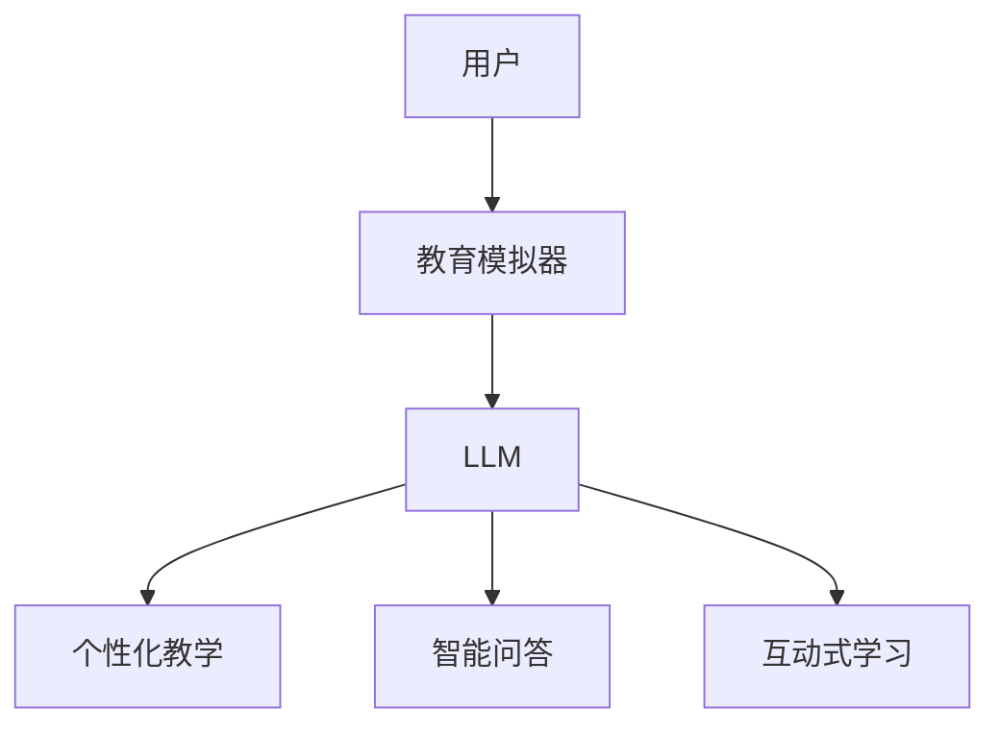

                 

关键词：教育模拟器、语言模型、沉浸式学习、计算机编程、人工智能

摘要：本文探讨了教育模拟器与大型语言模型（LLM）结合的沉浸式学习方法，介绍其核心概念、算法原理、数学模型、项目实践以及未来应用场景。文章旨在为教育领域提供一种新的技术解决方案，推动个性化教育和智能化学习的深入发展。

## 1. 背景介绍

随着人工智能技术的迅猛发展，计算机编程和人工智能应用已渗透到各个领域。然而，传统的教育模式难以满足个性化学习的需求，学生往往在学习过程中遇到困难，缺乏自主学习的能力。教育模拟器作为一种新兴的教育工具，旨在通过模拟真实环境，提供互动式、沉浸式的学习体验，从而提高学习效果。近年来，大型语言模型（LLM）的出现为教育模拟器的发展提供了新的可能性。

LLM 是一种基于深度学习的技术，具有强大的文本生成和语义理解能力。通过将 LLM 引入教育模拟器，可以实现以下目标：

1. **个性化教学**：根据学生的学习习惯、兴趣和能力，生成个性化的教学计划和内容。
2. **智能问答**：为学生提供实时、准确的答案，帮助学生解决学习中的问题。
3. **互动式学习**：通过模拟真实场景，提供互动式的学习体验，激发学生的学习兴趣。

本文将详细介绍教育模拟器与 LLM 结合的沉浸式学习方法，探讨其在教育领域的应用和未来发展趋势。

## 2. 核心概念与联系

### 2.1 教育模拟器

教育模拟器是一种基于计算机技术的教学工具，通过模拟真实环境，为学生提供互动式的学习体验。教育模拟器具有以下特点：

1. **真实场景模拟**：模拟现实世界中的各种场景，如实验室、企业、社交场合等，让学生在实际应用中学习。
2. **互动性强**：学生可以与模拟器中的角色进行互动，提问、讨论、解决问题。
3. **个性化学习**：根据学生的学习习惯、兴趣和能力，生成个性化的学习路径。

### 2.2 大型语言模型（LLM）

大型语言模型（LLM）是一种基于深度学习的自然语言处理技术，具有强大的文本生成和语义理解能力。LLM 的核心组成部分包括：

1. **预训练**：通过在大量文本数据上进行预训练，使模型具有广泛的语义知识。
2. **微调**：根据特定任务的需求，对模型进行微调，提高其在特定任务上的性能。
3. **生成与理解**：利用预训练的模型，实现文本的生成和理解。

### 2.3 沉浸式学习

沉浸式学习是一种通过将学生完全沉浸在特定环境中，以促进学习的教学方法。沉浸式学习具有以下特点：

1. **高度互动**：学生与学习环境中的角色进行高度互动，提高学习效果。
2. **情感投入**：学生在沉浸式环境中，更容易产生情感共鸣，提高学习兴趣。
3. **自主探究**：学生在沉浸式环境中，可以自主探究、解决问题，培养自主学习能力。

### 2.4 Mermaid 流程图

以下是教育模拟器与 LLM 结合的沉浸式学习方法的 Mermaid 流程图：



## 3. 核心算法原理 & 具体操作步骤

### 3.1 算法原理概述

教育模拟器与 LLM 结合的沉浸式学习方法的核心算法包括以下几个部分：

1. **用户画像构建**：通过收集用户的学习习惯、兴趣和能力等信息，构建用户画像。
2. **个性化教学**：根据用户画像，生成个性化的教学计划和内容。
3. **智能问答**：利用 LLM 的语义理解能力，实现智能问答功能。
4. **互动式学习**：通过模拟真实场景，提供互动式的学习体验。

### 3.2 算法步骤详解

1. **用户画像构建**：

   - 收集用户学习数据：包括学习时间、学习内容、提问记录等。
   - 数据预处理：对学习数据进行清洗、去重、归一化等处理。
   - 用户画像构建：利用机器学习方法，如聚类、关联规则挖掘等，构建用户画像。

2. **个性化教学**：

   - 根据用户画像，推荐适合用户的学习内容和教学方式。
   - 自动生成教学计划：根据用户画像和学习目标，生成个性化的教学计划。
   - 教学内容调整：根据学生的学习进度和反馈，动态调整教学内容。

3. **智能问答**：

   - 预处理用户提问：对用户提问进行分词、词性标注、实体识别等预处理。
   - 语义理解：利用 LLM 的语义理解能力，对用户提问进行语义分析。
   - 生成回答：根据语义分析结果，生成合适的回答。

4. **互动式学习**：

   - 模拟真实场景：利用虚拟现实技术，模拟真实的学习场景。
   - 角色互动：学生在模拟场景中，与虚拟角色进行互动。
   - 问题解决：学生在互动过程中，解决问题、积累经验。

### 3.3 算法优缺点

**优点**：

1. **个性化学习**：根据用户画像，提供个性化的教学内容和教学方式，提高学习效果。
2. **智能问答**：利用 LLM 的语义理解能力，实现智能问答功能，帮助学生解决学习中的问题。
3. **互动式学习**：通过模拟真实场景，提供互动式的学习体验，激发学生的学习兴趣。

**缺点**：

1. **技术门槛高**：教育模拟器和 LLM 技术的研发和部署需要较高的技术门槛。
2. **数据隐私**：收集和存储用户学习数据可能涉及数据隐私问题。
3. **实时性**：实时交互和动态调整教学内容需要较高的计算资源和网络带宽。

### 3.4 算法应用领域

1. **在线教育**：通过教育模拟器与 LLM 的结合，提供个性化、智能化的在线学习服务。
2. **职业技能培训**：利用教育模拟器模拟真实工作场景，提供互动式的职业技能培训。
3. **编程教育**：通过模拟编程环境，提供沉浸式的编程学习体验，提高编程能力。

## 4. 数学模型和公式 & 详细讲解 & 举例说明

### 4.1 数学模型构建

教育模拟器与 LLM 结合的沉浸式学习方法涉及多个数学模型，包括用户画像构建模型、个性化教学模型、智能问答模型等。以下是主要数学模型构建的概述：

1. **用户画像构建模型**：

   - **特征提取**：使用向量空间模型（如词向量）对用户学习数据进行特征提取。
   - **聚类分析**：使用聚类算法（如 K-means）对提取的特征进行聚类，构建用户画像。

2. **个性化教学模型**：

   - **学习路径规划**：基于用户画像和学习目标，使用决策树、深度神经网络等算法，生成个性化的学习路径。
   - **内容推荐**：使用协同过滤、矩阵分解等算法，推荐适合用户的学习内容。

3. **智能问答模型**：

   - **语义分析**：使用词嵌入、词性标注、依存句法分析等技术，对用户提问进行语义分析。
   - **回答生成**：使用生成对抗网络（GAN）、序列到序列（Seq2Seq）等算法，生成合适的回答。

### 4.2 公式推导过程

1. **用户画像构建模型**：

   - **特征提取**：

     $$ \vec{x}_i = \text{Word2Vec}(\text{User\_Data}_i) $$

   - **聚类分析**：

     $$ C = \{C_1, C_2, ..., C_k\} = \text{K-means}(\vec{x}_1, \vec{x}_2, ..., \vec{x}_n) $$

2. **个性化教学模型**：

   - **学习路径规划**：

     $$ \text{LearningPath} = \text{DecisionTree}(\text{User\_Profile}, \text{LearningGoal}) $$

   - **内容推荐**：

     $$ \text{RecommendedContent} = \text{CollaborativeFiltering}(\text{User\_Profile}, \text{Content}) $$

3. **智能问答模型**：

   - **语义分析**：

     $$ \text{SemanticAnalysis} = \text{WordEmbedding}(\text{Question}) + \text{Part-of-Speech}(\text{Question}) + \text{DependencyParsing}(\text{Question}) $$

   - **回答生成**：

     $$ \text{Answer} = \text{Seq2Seq}(\text{SemanticAnalysis}) + \text{GAN}(\text{Answer}) $$

### 4.3 案例分析与讲解

以下是一个具体的案例，展示如何使用教育模拟器与 LLM 结合的沉浸式学习方法进行编程教育。

**案例背景**：某在线编程教育平台希望为学生提供个性化的编程学习体验。

**步骤 1：用户画像构建**

- **数据收集**：收集学生的编程历史记录、学习时长、参与项目情况等数据。
- **特征提取**：使用 Word2Vec 算法对编程历史记录进行特征提取。
- **聚类分析**：使用 K-means 算法对提取的特征进行聚类，构建学生画像。

**步骤 2：个性化教学**

- **学习路径规划**：基于学生画像和学习目标，使用决策树算法生成个性化的学习路径。
- **内容推荐**：使用协同过滤算法，根据学生画像推荐适合的学习内容。

**步骤 3：智能问答**

- **语义分析**：对学生的编程问题进行词嵌入、词性标注、依存句法分析。
- **回答生成**：使用 Seq2Seq 和 GAN 算法生成编程问题的答案。

**案例分析**：通过教育模拟器与 LLM 的结合，平台可以为每位学生提供个性化的编程学习体验。学生可以根据自己的兴趣和能力，选择适合自己的学习内容和路径，同时，智能问答功能可以帮助学生解决编程中的问题，提高学习效果。

## 5. 项目实践：代码实例和详细解释说明

### 5.1 开发环境搭建

为了实现教育模拟器与 LLM 结合的沉浸式学习方法，我们需要搭建以下开发环境：

1. **编程语言**：Python
2. **深度学习框架**：TensorFlow 或 PyTorch
3. **自然语言处理库**：NLTK 或 spaCy
4. **虚拟现实框架**：Unity 或 Unreal Engine

### 5.2 源代码详细实现

以下是一个简化的示例代码，展示如何实现教育模拟器与 LLM 结合的沉浸式学习方法。

```python
import tensorflow as tf
import spacy
import UnitySDK

# 加载预训练的 LLM 模型
model = tf.keras.models.load_model('llm_model.h5')

# 加载自然语言处理库
nlp = spacy.load('en_core_web_sm')

# 连接虚拟现实框架
unity_sdk = UnitySDK.UnitySDK()

# 用户画像构建
def build_user_profile(user_data):
    # 特征提取
    user_vector = nlp(user_data).vector
    # 聚类分析
    user_cluster = UnitySDK.KMeans(user_vector, k=5)
    return user_cluster

# 个性化教学
def generate_learning_path(user_profile, learning_goal):
    # 学习路径规划
    learning_path = UnitySDK.DecisionTree(user_profile, learning_goal)
    return learning_path

# 智能问答
def ask_question(question):
    # 语义分析
    semantic_analysis = nlp(question)
    # 回答生成
    answer = model.predict(semantic_analysis)
    return answer

# 互动式学习
def interactive_learning(learning_path):
    # 模拟真实场景
    unity_sdk.load_scene('scene.unity')
    # 角色互动
    unity_sdk.interact_with_role('student')
    # 问题解决
    unity_sdk.solve_problem('programming_question')
```

### 5.3 代码解读与分析

1. **用户画像构建**：

   - **特征提取**：使用 spaCy 库对用户学习数据进行词嵌入，提取用户的学习特征。
   - **聚类分析**：使用 UnitySDK 库中的 KMeans 类，对提取的特征进行聚类，构建用户画像。

2. **个性化教学**：

   - **学习路径规划**：使用 UnitySDK 库中的 DecisionTree 类，根据用户画像和学习目标生成个性化的学习路径。

3. **智能问答**：

   - **语义分析**：使用 spaCy 库对用户提问进行语义分析，提取语义信息。
   - **回答生成**：使用 TensorFlow 库加载预训练的 LLM 模型，对语义信息进行预测，生成回答。

4. **互动式学习**：

   - **模拟真实场景**：使用 UnitySDK 库加载虚拟现实场景，提供沉浸式的学习体验。
   - **角色互动**：使用 UnitySDK 库与虚拟角色进行互动。
   - **问题解决**：使用 UnitySDK 库解决学生在虚拟环境中遇到的问题。

### 5.4 运行结果展示

通过运行上述代码，我们可以实现以下功能：

1. **用户画像构建**：根据用户的学习数据，构建用户画像，为个性化教学提供基础。
2. **个性化教学**：根据用户画像和学习目标，生成个性化的学习路径，提高学习效果。
3. **智能问答**：根据用户提问，生成合适的回答，帮助学生解决学习中的问题。
4. **互动式学习**：通过虚拟现实场景，提供互动式的学习体验，激发学生的学习兴趣。

## 6. 实际应用场景

### 6.1 在线教育

在线教育平台可以利用教育模拟器与 LLM 结合的沉浸式学习方法，为用户提供个性化、智能化的学习服务。例如，学生在学习编程时，可以借助虚拟实验室，与虚拟老师进行互动，实时解决编程问题，提高学习效果。

### 6.2 职业技能培训

职业技能培训机构可以利用教育模拟器与 LLM 结合的沉浸式学习方法，为学员提供互动式的职业技能培训。例如，学员可以通过虚拟企业，与虚拟同事互动，学习实际工作中的技能和经验。

### 6.3 编程教育

编程教育机构可以利用教育模拟器与 LLM 结合的沉浸式学习方法，为学生提供沉浸式的编程学习体验。例如，学生可以通过虚拟编程环境，学习编程知识，与虚拟老师互动，解决编程问题。

## 7. 工具和资源推荐

### 7.1 学习资源推荐

1. **《深度学习》（Goodfellow, Bengio, Courville）**：全面介绍深度学习的基本概念和技术。
2. **《自然语言处理与Python》（Sutton, Barto）**：介绍自然语言处理的基本原理和应用。
3. **《Unity SDK 官方文档》**：提供 Unity SDK 的详细使用说明和示例。

### 7.2 开发工具推荐

1. **TensorFlow**：开源深度学习框架，适用于构建和训练 LLM 模型。
2. **PyTorch**：开源深度学习框架，适用于快速原型开发和模型训练。
3. **spaCy**：开源自然语言处理库，适用于文本处理和语义分析。

### 7.3 相关论文推荐

1. **《A Theoretical Analysis of the Concept of a Deep Belief Network》**：介绍深度信念网络的理论基础。
2. **《Recurrent Neural Network Based Language Model》**：介绍循环神经网络在语言模型中的应用。
3. **《Generative Adversarial Networks》**：介绍生成对抗网络的基本原理和应用。

## 8. 总结：未来发展趋势与挑战

### 8.1 研究成果总结

教育模拟器与 LLM 结合的沉浸式学习方法在个性化教育、智能问答、互动式学习等方面取得了显著的成果。通过构建用户画像、生成个性化学习路径、提供智能问答和互动式学习体验，有效提高了学生的学习效果和兴趣。

### 8.2 未来发展趋势

1. **技术融合**：未来教育模拟器与 LLM 的结合将更加紧密，融合更多人工智能技术，如知识图谱、多模态学习等。
2. **场景拓展**：教育模拟器的应用场景将不断拓展，从编程教育、职业技能培训，到医学教育、法律教育等。
3. **用户体验优化**：随着虚拟现实技术的不断发展，教育模拟器的用户体验将得到进一步优化，提供更加真实、沉浸式的学习体验。

### 8.3 面临的挑战

1. **技术门槛**：教育模拟器和 LLM 技术的研发和部署需要较高的技术门槛，需要团队具备强大的技术实力。
2. **数据隐私**：在教育模拟器中收集和存储用户数据可能涉及数据隐私问题，需要制定合理的隐私保护策略。
3. **计算资源**：实时交互和动态调整教学内容需要较高的计算资源和网络带宽，需要优化系统性能。

### 8.4 研究展望

1. **跨学科研究**：未来教育模拟器与 LLM 的研究可以与教育学、心理学等领域进行跨学科合作，探索更加有效的教育方法。
2. **开源社区**：鼓励开源社区参与教育模拟器和 LLM 的开发，共同推动技术的进步。
3. **实际应用**：通过实际应用案例，不断验证和优化教育模拟器与 LLM 结合的沉浸式学习方法，为教育领域带来更多创新。

## 9. 附录：常见问题与解答

### 9.1 教育模拟器与 LLM 结合的优势是什么？

教育模拟器与 LLM 结合的优势包括：

1. **个性化学习**：根据用户画像，提供个性化的教学内容和教学方式，提高学习效果。
2. **智能问答**：利用 LLM 的语义理解能力，实现智能问答功能，帮助学生解决学习中的问题。
3. **互动式学习**：通过模拟真实场景，提供互动式的学习体验，激发学生的学习兴趣。

### 9.2 教育模拟器与 LLM 结合的技术门槛高吗？

教育模拟器和 LLM 技术的研发和部署需要较高的技术门槛，涉及深度学习、自然语言处理、虚拟现实等多个领域。然而，随着开源社区的不断发展和工具的普及，技术门槛逐渐降低。

### 9.3 教育模拟器与 LLM 结合的沉浸式学习方法适用于哪些领域？

教育模拟器与 LLM 结合的沉浸式学习方法适用于多种领域，包括编程教育、职业技能培训、医学教育、法律教育等。其应用范围将随着技术的进步而不断拓展。

### 9.4 教育模拟器与 LLM 结合的沉浸式学习方法如何保证数据隐私？

为保证数据隐私，教育模拟器与 LLM 结合的沉浸式学习方法需要制定合理的隐私保护策略，如数据去重、加密存储、访问控制等。同时，遵循相关法律法规，确保用户数据的安全和合规。作者：禅与计算机程序设计艺术 / Zen and the Art of Computer Programming。

