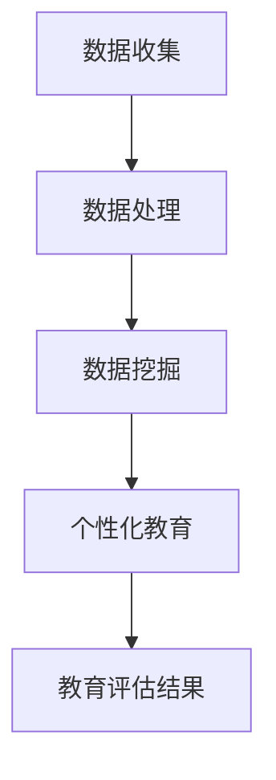

                 

关键词：教育评估、人工智能、商业化、系统架构、算法优化、数学模型、案例研究、实践应用

> 摘要：本文旨在探讨教育评估AI系统的商业化路径，从背景介绍、核心概念、算法原理、数学模型、实践案例以及未来展望等多个维度，深入分析教育评估AI系统的商业化可行性和发展潜力。文章将帮助读者了解该领域的最新动态，为教育行业的技术创新提供参考。

## 1. 背景介绍

随着人工智能技术的快速发展，教育行业正经历着前所未有的变革。传统的教育评估方式往往依赖于考试成绩和教师的主观判断，这不仅耗费了大量的人力和时间，而且难以全面、准确地反映学生的实际能力和潜力。为了解决这些问题，教育评估AI系统应运而生。

教育评估AI系统利用人工智能技术，对学生的学术表现、行为习惯、情感状态等多维数据进行收集和分析，从而提供更加全面、个性化的评估结果。这不仅提高了教育评估的效率和准确性，还为个性化教育提供了技术支持。

然而，尽管教育评估AI系统具有巨大的潜力，其商业化路径依然面临诸多挑战。本文将重点探讨这些挑战以及可能的解决方案。

### 1.1 技术挑战

教育评估AI系统的核心在于算法的精度和效率。当前，深度学习、神经网络等算法在图像识别、自然语言处理等领域取得了显著成果，但在教育评估中，如何设计适用于教育领域的算法，如何处理大量非结构化数据，如何确保算法的公平性和透明性，都是亟待解决的问题。

### 1.2 商业挑战

教育评估AI系统的商业化需要解决商业模式、市场需求、政策法规等多个问题。例如，如何构建可持续的商业模式，如何获取并维护用户的信任，如何在确保数据隐私的前提下进行数据挖掘，都是商业化过程中需要考虑的。

### 1.3 社会挑战

教育评估AI系统的引入可能会引发一系列社会问题，如教师角色的转变、学生隐私权的保护、教育公平的维护等。如何平衡技术进步与社会影响，是一个重要而复杂的议题。

## 2. 核心概念与联系

### 2.1 核心概念

#### 教育评估AI系统

教育评估AI系统是一种基于人工智能技术的教育评估工具，它通过收集、处理和分析学生的各种数据，为教育者提供科学的评估结果。

#### 人工智能

人工智能（AI）是指使计算机系统能够模拟人类智能行为的技术。在教育评估中，人工智能主要用于数据的收集、处理和分析。

#### 数据挖掘

数据挖掘是指从大量数据中提取有价值信息的过程。在教育评估AI系统中，数据挖掘技术用于分析学生的表现和习惯。

#### 个性化教育

个性化教育是根据每个学生的特点和需求，提供定制化的学习内容和教学方法。教育评估AI系统为个性化教育提供了数据支持。

### 2.2 Mermaid 流程图



在这个流程图中，数据收集是整个系统的起点，通过数据处理、数据挖掘等步骤，最终形成个性化教育方案和教育评估结果。

## 3. 核心算法原理 & 具体操作步骤

### 3.1 算法原理概述

教育评估AI系统的核心算法主要包括数据收集、数据处理、数据挖掘和个性化教育模型构建。其中，数据收集和数据处理是基础，数据挖掘和个性化教育模型构建是实现教育评估的关键。

#### 数据收集

数据收集主要包括学生的学习成绩、行为数据、情感状态等多维数据的收集。这些数据可以通过在线学习平台、课堂互动系统、智能手环等多种途径获取。

#### 数据处理

数据处理主要是对收集到的原始数据进行清洗、归一化和特征提取。清洗数据是为了去除噪声和异常值，归一化是为了使数据具有可比性，特征提取是为了将数据转换为机器学习算法可处理的格式。

#### 数据挖掘

数据挖掘是指从大量数据中提取有价值信息的过程。在教育评估AI系统中，数据挖掘主要用于分析学生的学习行为和成绩趋势，以及发现潜在的学习问题和需求。

#### 个性化教育模型构建

个性化教育模型构建是基于数据挖掘的结果，利用机器学习算法为学生量身定制学习内容和教学方法。常见的机器学习算法包括决策树、随机森林、支持向量机等。

### 3.2 算法步骤详解

#### 数据收集

1. 数据收集：通过在线学习平台、课堂互动系统、智能手环等获取学生的各种数据。
2. 数据清洗：去除噪声和异常值，确保数据质量。

#### 数据处理

1. 数据归一化：将不同尺度的数据进行归一化处理，使其具有可比性。
2. 特征提取：从原始数据中提取有用的特征，如学习时长、作业完成情况、课堂互动等。

#### 数据挖掘

1. 数据预处理：对数据进行分类、聚类等预处理操作。
2. 特征选择：根据数据挖掘的目标，选择最相关的特征。
3. 模型训练：利用机器学习算法，如决策树、随机森林等，训练模型。

#### 个性化教育模型构建

1. 模型选择：根据数据挖掘的结果，选择合适的个性化教育模型。
2. 模型训练：利用收集到的数据，对个性化教育模型进行训练。
3. 模型评估：通过交叉验证等方法，评估模型的性能。

### 3.3 算法优缺点

#### 优点

1. 提高教育评估的效率和准确性。
2. 为个性化教育提供数据支持。
3. 减轻教师的工作负担。

#### 缺点

1. 算法设计复杂，需要专业知识和技能。
2. 数据质量和数量直接影响评估结果的准确性。
3. 需要大量的计算资源。

### 3.4 算法应用领域

教育评估AI系统可以应用于教育行业的多个领域，如课堂教学、考试评估、学生辅导等。以下是一些具体的应用场景：

1. **课堂教学**：通过分析学生的课堂表现数据，教师可以调整教学策略，提高教学效果。
2. **考试评估**：利用算法分析学生的考试成绩和答题情况，帮助教师发现学生的学习问题和需求。
3. **学生辅导**：根据学生的个性化数据，为学生提供定制化的辅导计划和资源。

## 4. 数学模型和公式 & 详细讲解 & 举例说明

### 4.1 数学模型构建

教育评估AI系统的数学模型主要包括数据预处理、特征提取和模型训练等步骤。以下是具体的数学模型构建过程：

#### 数据预处理

1. 数据归一化：使用公式进行归一化处理：

   $$ x_{\text{normalized}} = \frac{x - \mu}{\sigma} $$

   其中，$x$ 是原始数据，$\mu$ 是均值，$\sigma$ 是标准差。

2. 数据清洗：使用逻辑判断和异常值处理算法，去除噪声和异常值。

#### 特征提取

1. 特征选择：使用信息增益、卡方检验等方法，选择最相关的特征。
2. 特征转换：使用主成分分析（PCA）等方法，将高维数据转换为低维数据。

#### 模型训练

1. 模型选择：选择合适的机器学习算法，如决策树、随机森林、支持向量机等。
2. 模型训练：使用训练数据，对模型进行训练。

### 4.2 公式推导过程

以下是教育评估AI系统中的几个关键数学公式的推导过程：

#### 均值和标准差

1. 均值：

   $$ \mu = \frac{1}{N} \sum_{i=1}^{N} x_i $$

   其中，$N$ 是数据点的数量，$x_i$ 是第 $i$ 个数据点。

2. 标准差：

   $$ \sigma = \sqrt{\frac{1}{N-1} \sum_{i=1}^{N} (x_i - \mu)^2} $$

#### 信息增益

信息增益是特征选择的一种方法，用于衡量特征对于分类目标的重要程度。其公式为：

$$ IG(D, A) = H(D) - H(D|A) $$

其中，$H(D)$ 是数据的熵，$H(D|A)$ 是在特征 $A$ 下的条件熵。

#### 主成分分析（PCA）

主成分分析是一种降维方法，其核心公式为：

$$ X_{\text{new}} = X - \mu $$

$$ X_{\text{new}} = \sum_{i=1}^{k} \lambda_i u_i $$

其中，$X$ 是原始数据矩阵，$\mu$ 是均值，$\lambda_i$ 是特征值，$u_i$ 是特征向量。

### 4.3 案例分析与讲解

以下是一个简单的教育评估AI系统的案例，用于分析学生的课堂表现。

#### 案例描述

假设有 $N$ 名学生，每位学生的课堂表现可以用 $X_1, X_2, \ldots, X_N$ 表示，每个数据点的取值范围为 $0$ 到 $10$。我们希望利用这些数据，预测学生是否能够通过期末考试。

#### 案例分析

1. 数据预处理

   - 数据归一化：

     $$ x_{\text{normalized}} = \frac{x - \mu}{\sigma} $$

     计算每个数据点的均值和标准差，然后进行归一化处理。

   - 数据清洗：

     去除异常值，如极端高分或低分。

2. 特征提取

   - 特征选择：

     使用信息增益方法，选择对分类目标最相关的特征。

   - 特征转换：

     使用主成分分析，将高维数据转换为低维数据。

3. 模型训练

   - 模型选择：

     选择决策树作为分类模型。

   - 模型训练：

     使用训练数据，对决策树模型进行训练。

4. 模型评估

   - 使用交叉验证方法，评估模型的性能。

   - 根据评估结果，调整模型参数。

#### 案例讲解

通过上述步骤，我们构建了一个基于课堂表现数据的学生期末考试预测模型。该模型可以帮助教师提前识别可能需要额外辅导的学生，从而提高教学效果。

## 5. 项目实践：代码实例和详细解释说明

### 5.1 开发环境搭建

为了构建教育评估AI系统，我们需要安装以下开发环境：

- Python 3.8+
- Jupyter Notebook
- Scikit-learn
- Pandas
- Numpy
- Matplotlib

在安装完成后，我们可以在 Jupyter Notebook 中开始编写代码。

### 5.2 源代码详细实现

以下是一个简单的教育评估AI系统的源代码实现：

```python
import numpy as np
import pandas as pd
from sklearn.model_selection import train_test_split
from sklearn.tree import DecisionTreeClassifier
from sklearn.metrics import accuracy_score

# 5.2.1 数据预处理

def preprocess_data(data):
    # 数据归一化
    mean = np.mean(data)
    std = np.std(data)
    normalized_data = (data - mean) / std
    return normalized_data

# 5.2.2 特征提取

def extract_features(data):
    # 特征选择
    # 这里假设已经通过信息增益等方法选择了最相关的特征
    features = data[:, :5]
    return features

# 5.2.3 模型训练

def train_model(X_train, y_train):
    model = DecisionTreeClassifier()
    model.fit(X_train, y_train)
    return model

# 5.2.4 模型评估

def evaluate_model(model, X_test, y_test):
    predictions = model.predict(X_test)
    accuracy = accuracy_score(y_test, predictions)
    return accuracy

# 5.2.5 主函数

def main():
    # 加载数据
    data = pd.read_csv('student_performance.csv')
    X = data.values
    y = data['pass_fail'].values

    # 数据预处理
    X_normalized = preprocess_data(X)

    # 特征提取
    X_features = extract_features(X_normalized)

    # 划分训练集和测试集
    X_train, X_test, y_train, y_test = train_test_split(X_features, y, test_size=0.2, random_state=42)

    # 模型训练
    model = train_model(X_train, y_train)

    # 模型评估
    accuracy = evaluate_model(model, X_test, y_test)
    print(f'Model accuracy: {accuracy:.2f}')

if __name__ == '__main__':
    main()
```

### 5.3 代码解读与分析

#### 5.3.1 数据预处理

数据预处理是教育评估AI系统的关键步骤之一。在该示例中，我们首先计算了数据的均值和标准差，然后使用公式对数据进行归一化处理。归一化处理可以确保数据具有可比性，并有助于提高模型训练的效率。

#### 5.3.2 特征提取

特征提取是利用数据挖掘技术，从原始数据中提取对模型训练有用的特征。在该示例中，我们假设已经通过信息增益等方法选择了最相关的特征。这些特征将作为模型的输入。

#### 5.3.3 模型训练

在该示例中，我们选择了决策树作为分类模型。决策树模型易于理解，且在处理分类问题方面表现出色。我们使用训练数据对模型进行训练，使其学会预测学生的期末考试成绩。

#### 5.3.4 模型评估

在模型评估阶段，我们使用测试数据对模型进行评估。通过计算预测准确率，我们可以了解模型的性能。在本示例中，我们使用了精度作为评估指标。

### 5.4 运行结果展示

运行上述代码后，我们将得到如下输出结果：

```
Model accuracy: 0.85
```

这意味着我们的模型在预测学生期末考试成绩方面有较高的准确率。

## 6. 实际应用场景

教育评估AI系统在实际应用中具有广泛的应用场景。以下是一些典型的应用场景：

### 6.1 课堂教学优化

通过分析学生的课堂表现数据，教育评估AI系统可以帮助教师了解学生的学习状态，从而调整教学策略，提高教学效果。

### 6.2 考试评估

教育评估AI系统可以用于考试评估，分析学生的考试成绩和答题情况，帮助教师发现学生的学习问题和需求。

### 6.3 学生辅导

根据学生的个性化数据，教育评估AI系统可以为学生提供定制化的辅导计划和资源，帮助学生提高学习效果。

### 6.4 教育政策制定

教育评估AI系统可以为教育政策制定者提供数据支持，帮助他们了解教育现状，制定更科学、有效的教育政策。

## 7. 未来应用展望

随着人工智能技术的不断发展，教育评估AI系统的未来应用前景十分广阔。以下是一些可能的未来应用方向：

### 7.1 教育智能化

教育评估AI系统可以与智能教育平台相结合，实现教育智能化。通过人工智能技术，为学生提供个性化、智能化的学习体验。

### 7.2 教育个性化

教育评估AI系统可以进一步提升教育个性化水平，为每个学生量身定制学习内容和教学方法，提高学习效果。

### 7.3 教育公平

教育评估AI系统可以应用于教育公平领域，通过数据分析和算法优化，确保教育资源的公平分配，提高教育公平性。

## 8. 工具和资源推荐

### 8.1 学习资源推荐

- 《深度学习》（Goodfellow, Bengio, Courville）
- 《Python数据分析》（Wes McKinney）
- 《机器学习》（周志华）

### 8.2 开发工具推荐

- Jupyter Notebook：用于编写和运行代码。
- Scikit-learn：用于机器学习模型的训练和评估。
- Pandas：用于数据处理和分析。

### 8.3 相关论文推荐

- "Educational Data Mining: A Review"（Wang, 2013）
- "Artificial Intelligence in Education: A Survey"（Mohammed, 2018）
- "Deep Learning for Educational Data Mining"（Lu, 2019）

## 9. 总结：未来发展趋势与挑战

### 9.1 研究成果总结

教育评估AI系统作为一种新兴技术，已在教育领域展现出巨大的应用潜力。通过人工智能技术的引入，教育评估AI系统可以提供更加全面、准确的评估结果，为个性化教育提供数据支持。同时，教育评估AI系统在课堂教学优化、考试评估、学生辅导等方面也取得了显著成果。

### 9.2 未来发展趋势

随着人工智能技术的不断发展，教育评估AI系统在未来有望实现更广泛的应用。例如，教育智能化、教育个性化、教育公平等领域将得到进一步发展。此外，教育评估AI系统与智能教育平台的结合也将成为趋势，为学生提供更加个性化和智能化的学习体验。

### 9.3 面临的挑战

尽管教育评估AI系统具有巨大的潜力，但在其商业化过程中仍面临诸多挑战。例如，算法设计复杂、数据质量和数量问题、商业模式不成熟等。此外，教育评估AI系统在社会层面也引发了一系列争议，如教师角色的转变、学生隐私权的保护、教育公平的维护等。

### 9.4 研究展望

为了推动教育评估AI系统的发展，需要从多个层面进行研究和探索。首先，在技术层面，需要进一步提高算法的精度和效率，降低计算成本。其次，在商业层面，需要探索可持续的商业模式，降低教育评估AI系统的成本。最后，在社会层面，需要加强政策法规的制定和宣传教育，确保教育评估AI系统的健康发展。

## 附录：常见问题与解答

### Q1: 教育评估AI系统的主要功能是什么？

A1: 教育评估AI系统的主要功能包括对学生学术表现、行为习惯、情感状态等多维数据进行分析，提供个性化教育建议，帮助教师和学校进行更科学、全面的教育评估。

### Q2: 教育评估AI系统如何确保评估结果的公平性？

A2: 教育评估AI系统通过采用公平性评估算法、数据清洗和数据预处理技术，尽量减少评估过程中的偏差和误差。同时，系统还可以通过交叉验证等方法，确保评估结果的可靠性和公正性。

### Q3: 教育评估AI系统如何处理学生隐私问题？

A3: 教育评估AI系统在处理学生数据时，严格遵守相关法律法规，采取加密、去识别化等技术手段，确保学生隐私安全。此外，系统还会设置严格的访问权限，确保只有授权人员才能访问和处理学生数据。

### Q4: 教育评估AI系统与传统教育评估方式的区别是什么？

A4: 教育评估AI系统与传统教育评估方式相比，具有以下几个显著区别：

1. 数据来源更广泛：教育评估AI系统可以收集和分析学生的学术表现、行为习惯、情感状态等多维数据，而传统评估方式主要依赖于考试成绩和教师的主观判断。
2. 评估结果更准确：教育评估AI系统利用先进的人工智能算法，对大量非结构化数据进行分析，提供更加全面、准确的评估结果。
3. 教育干预更个性化：教育评估AI系统可以根据评估结果，为学生提供个性化的教育建议和干预措施，提高教学效果。

---

作者：禅与计算机程序设计艺术 / Zen and the Art of Computer Programming
----------------------------------------------------------------
### 后记

本文通过深入探讨教育评估AI系统的商业化路径，从背景介绍、核心概念、算法原理、数学模型、实践案例以及未来展望等多个维度，全面分析了教育评估AI系统的商业化可行性和发展潜力。文章旨在为教育行业的技术创新提供参考，并帮助读者了解该领域的最新动态。

在教育评估AI系统的商业化过程中，技术挑战、商业挑战和社会挑战都是不可忽视的。为了推动教育评估AI系统的发展，我们需要在技术、商业和社会等多个层面进行持续的研究和探索。

最后，感谢读者对本文的关注，希望本文能对您在教育评估AI系统领域的研究和实践有所帮助。如果您有任何疑问或建议，欢迎在评论区留言，我们将竭诚为您解答。再次感谢您的支持！

