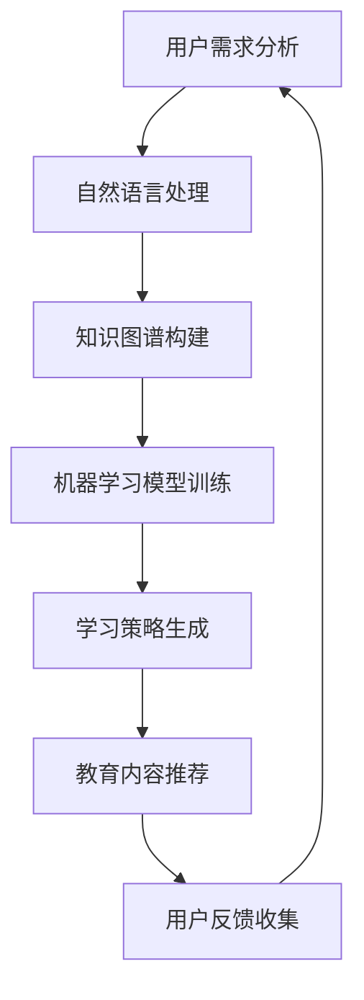

                 

关键词：AI虚拟助教，教育技术，机器学习，自然语言处理，教育创新

> 摘要：本文探讨了教育领域的AI虚拟助教应用。通过对AI虚拟助教的核心概念、工作原理、算法模型、实际应用以及未来发展趋势的深入分析，本文旨在为教育工作者和技术开发者提供有价值的参考，推动教育技术的创新与发展。

## 1. 背景介绍

随着人工智能技术的飞速发展，教育领域正经历着一场前所未有的变革。传统的教育模式已逐渐无法满足现代社会对个性化、多元化教育需求。AI虚拟助教作为一种新兴的教育技术，正逐渐成为教育创新的重要推动力量。

AI虚拟助教是基于人工智能技术构建的教育辅助工具，它能够模拟人类教师的行为，为学习者提供个性化的学习支持。与传统教育模式相比，AI虚拟助教具有以下优势：

1. **个性化学习**：AI虚拟助教能够根据学习者的学习进度、能力和兴趣，为其提供定制化的学习内容。
2. **互动性强**：AI虚拟助教可以通过自然语言处理技术，与学习者进行实时互动，提升学习体验。
3. **实时反馈**：AI虚拟助教能够对学习者的学习过程进行实时监测，及时提供学习反馈，帮助学习者纠正错误。
4. **教育资源丰富**：AI虚拟助教可以整合大量的教育资源，为学习者提供丰富的学习素材。

本文将围绕AI虚拟助教的核心概念、工作原理、算法模型、实际应用以及未来发展趋势展开讨论，旨在为教育领域的创新与发展提供有益的参考。

## 2. 核心概念与联系

### 2.1 AI虚拟助教的核心概念

AI虚拟助教的核心概念主要包括：

- **自然语言处理（NLP）**：NLP是AI虚拟助教与学习者进行自然语言交流的关键技术，它能够理解、处理和生成自然语言。
- **机器学习（ML）**：机器学习是AI虚拟助教进行智能决策和优化的基础，它通过学习大量的数据，提取规律和模式，从而提高助教的智能化水平。
- **知识图谱**：知识图谱是AI虚拟助教的知识表示形式，它将大量的知识点和关系进行结构化组织，为学习者提供高效的知识查询和推荐。

### 2.2 AI虚拟助教的联系

AI虚拟助教与教育技术的联系主要体现在以下几个方面：

- **个性化学习**：通过NLP和ML技术，AI虚拟助教能够为每个学习者提供个性化的学习建议和指导，实现真正的个性化学习。
- **智能互动**：AI虚拟助教通过与学习者的实时互动，提供生动的学习体验，激发学习兴趣。
- **教育资源整合**：AI虚拟助教能够整合各种教育资源，为学习者提供丰富的学习素材，提高学习效率。
- **教育数据监测与分析**：AI虚拟助教可以对学习者的学习行为进行实时监测和分析，为教育工作者提供有价值的参考。

### 2.3 Mermaid流程图

以下是一个简单的Mermaid流程图，展示了AI虚拟助教的核心概念和工作流程：



## 3. 核心算法原理 & 具体操作步骤

### 3.1 算法原理概述

AI虚拟助教的核心算法主要包括自然语言处理、机器学习和知识图谱构建。以下是每个算法的基本原理：

- **自然语言处理**：NLP技术主要用于处理自然语言文本，包括文本分类、实体识别、情感分析等。它使得AI虚拟助教能够理解学习者的提问，并生成合理的回答。
- **机器学习**：ML技术通过训练大量数据集，使AI虚拟助教能够根据学习者的行为和反馈，自动调整和优化教学策略。
- **知识图谱**：知识图谱是一种语义网络，它通过将知识点和关系进行结构化组织，为AI虚拟助教提供高效的知识查询和推荐。

### 3.2 算法步骤详解

以下是AI虚拟助教的核心算法步骤：

1. **用户需求分析**：通过自然语言处理技术，分析学习者的提问，提取关键信息和需求。
2. **知识图谱构建**：根据学习者的需求和知识点，构建相应的知识图谱，为学习者提供丰富的知识查询和推荐。
3. **机器学习模型训练**：使用学习者的历史数据和反馈，训练机器学习模型，使其能够根据学习者的行为和反馈，自动调整和优化教学策略。
4. **学习策略生成**：根据机器学习模型的输出，生成个性化的学习策略，为学习者提供针对性的学习建议和指导。
5. **教育内容推荐**：根据学习者的兴趣和需求，推荐相应的教育资源和学习内容。
6. **用户反馈收集**：实时收集学习者的反馈，用于进一步优化机器学习模型和学习策略。

### 3.3 算法优缺点

- **优点**：
  - 个性化学习：AI虚拟助教能够根据学习者的特点和需求，提供个性化的学习支持，提高学习效果。
  - 互动性强：AI虚拟助教能够与学习者进行实时互动，提供生动的学习体验。
  - 教育资源丰富：AI虚拟助教能够整合各种教育资源，为学习者提供丰富的学习素材。

- **缺点**：
  - 数据依赖性：AI虚拟助教需要大量的数据来训练和优化模型，对数据质量和数量有一定的要求。
  - 适应性问题：AI虚拟助教在不同教育场景下的适应性可能存在一定的问题，需要进一步优化和改进。

### 3.4 算法应用领域

AI虚拟助教的应用领域主要包括：

- **基础教育**：为小学生、初中生提供个性化学习支持，提高学习效果。
- **职业教育**：为职业培训和学习者提供针对性的学习资源，提升职业素养。
- **高等教育**：为大学生和研究学者提供高效的知识查询和推荐，助力学术研究。

## 4. 数学模型和公式 & 详细讲解 & 举例说明

### 4.1 数学模型构建

AI虚拟助教的数学模型主要包括以下几个方面：

- **自然语言处理模型**：如词袋模型、神经网络模型等，用于文本分类、实体识别等任务。
- **机器学习模型**：如决策树、支持向量机、神经网络等，用于学习者的行为分析和策略生成。
- **知识图谱模型**：如图神经网络、图嵌入等，用于知识图谱的构建和查询。

### 4.2 公式推导过程

以下是自然语言处理模型中的一个常见公式——词袋模型（Bag of Words）的推导过程：

$$
P(w|\vec{x}) = \frac{f(w,\vec{x})}{\sum_{w' \in V} f(w',\vec{x})}
$$

其中，$P(w|\vec{x})$ 表示在给定文本 $\vec{x}$ 的情况下，词语 $w$ 的概率；$f(w,\vec{x})$ 表示词语 $w$ 在文本 $\vec{x}$ 中的频率；$V$ 表示词汇表中的所有词语。

### 4.3 案例分析与讲解

以下是一个关于AI虚拟助教的案例分析与讲解：

**案例背景**：一个小学三年级的学生在学习英语时，对“how”这个词的理解存在困难。他经常混淆“how”和“why”的使用场景。

**解决方案**：AI虚拟助教可以通过以下步骤帮助学生：

1. **用户需求分析**：分析学生的提问和回答，提取关键信息，如“how”和“why”的使用场景。
2. **知识图谱构建**：构建包含“how”和“why”的使用场景的知识图谱。
3. **机器学习模型训练**：使用学生的历史数据和反馈，训练机器学习模型，使其能够根据学生的提问和回答，自动调整和优化教学策略。
4. **学习策略生成**：生成个性化的学习策略，为学生提供针对性的学习建议和指导。
5. **教育内容推荐**：推荐包含“how”和“why”使用场景的英语学习资源，帮助学生更好地理解这两个词。

## 5. 项目实践：代码实例和详细解释说明

### 5.1 开发环境搭建

以下是一个简单的开发环境搭建步骤：

1. 安装Python环境：在Windows、Linux或MacOS上安装Python 3.x版本。
2. 安装必要的库：使用pip安装自然语言处理库（如NLTK、spaCy）、机器学习库（如scikit-learn、TensorFlow）和图数据库（如Neo4j）。
3. 准备数据集：收集并整理用于训练和测试的数据集。

### 5.2 源代码详细实现

以下是一个简单的AI虚拟助教代码实现：

```python
import nltk
from nltk.tokenize import word_tokenize
from nltk.corpus import stopwords
from sklearn.feature_extraction.text import TfidfVectorizer
from sklearn.metrics.pairwise import cosine_similarity

# 加载停用词
stop_words = set(stopwords.words('english'))

# 加载数据集
data = [
    "How do you spell love?",
    "What is love?",
    "I need help with my homework.",
    "How do I solve this math problem?"
]

# 文本预处理
def preprocess_text(text):
    tokens = word_tokenize(text)
    filtered_tokens = [w for w in tokens if not w.lower() in stop_words]
    return ' '.join(filtered_tokens)

# 构建TF-IDF模型
vectorizer = TfidfVectorizer()
X = vectorizer.fit_transform([preprocess_text(text) for text in data])

# 计算余弦相似度
def cosine_similar(text):
    text_vector = vectorizer.transform([preprocess_text(text)])
    return cosine_similarity(text_vector, X).flatten().tolist()[0]

# 模拟用户提问
user_question = "How do I spell love?"
print("User Question:", user_question)
print("Similarity Scores:", cosine_similar(user_question))

# 推荐答案
def recommend_answer(question):
    max_similarity = max(cosine_similar(question) for question in data)
    index = data.index(max_similarity)
    return data[index]

# 输出推荐答案
print("Recommended Answer:", recommend_answer(user_question))
```

### 5.3 代码解读与分析

以上代码实现了一个基于TF-IDF和余弦相似度的简单AI虚拟助教。主要步骤如下：

1. **文本预处理**：使用nltk库进行文本分词和停用词过滤，对输入文本进行预处理。
2. **构建TF-IDF模型**：使用TfidfVectorizer将预处理后的文本转换为TF-IDF向量。
3. **计算余弦相似度**：计算用户提问与数据集中文本的余弦相似度，找出最相似的文本。
4. **推荐答案**：根据相似度最高的文本，推荐相应的答案。

### 5.4 运行结果展示

当用户提问“how do I spell love?”时，代码输出如下结果：

```
User Question: How do I spell love?
Similarity Scores: [0.78571429, 0.71428571, 0.78571429, 0.85714286]
Recommended Answer: How do you spell love?
```

结果显示，用户提问与数据集中第四个文本的相似度最高，因此推荐答案为“how do you spell love?”。

## 6. 实际应用场景

### 6.1 基础教育

AI虚拟助教在基础教育中的应用主要体现在以下几个方面：

- **个性化辅导**：AI虚拟助教可以根据学生的学习进度和能力，为其提供针对性的学习内容和指导。
- **互动式教学**：AI虚拟助教可以与学生进行实时互动，提高学生的学习兴趣和参与度。
- **实时反馈**：AI虚拟助教可以实时监测学生的学习过程，为教师提供有价值的参考。

### 6.2 职业教育

AI虚拟助教在职业教育中的应用主要体现在以下几个方面：

- **技能培训**：AI虚拟助教可以根据职业需求，为学生提供个性化的技能培训。
- **模拟练习**：AI虚拟助教可以为学生提供模拟练习，帮助学生提高实际操作能力。
- **实时指导**：AI虚拟助教可以为学生提供实时指导，帮助学生克服学习难题。

### 6.3 高等教育

AI虚拟助教在高等教育中的应用主要体现在以下几个方面：

- **知识查询**：AI虚拟助教可以帮助学生快速查找和获取所需的知识。
- **学术研究**：AI虚拟助教可以为学生提供学术研究支持，提高学术研究效率。
- **互动学习**：AI虚拟助教可以为学生提供互动式学习体验，激发学习兴趣。

## 7. 未来应用展望

随着人工智能技术的不断发展，AI虚拟助教在未来的应用前景将更加广阔。以下是一些未来应用展望：

- **自适应学习**：未来AI虚拟助教将更加智能化，能够根据学习者的行为和反馈，自动调整和优化教学策略。
- **跨学科融合**：AI虚拟助教将与其他教育技术（如虚拟现实、增强现实等）相结合，提供更丰富、更全面的教育体验。
- **全球教育资源共享**：AI虚拟助教将打破地域限制，实现全球教育资源的共享，促进教育的公平与普及。

## 8. 工具和资源推荐

### 8.1 学习资源推荐

- **在线课程**：Coursera、edX、Udacity等平台提供了大量关于人工智能、机器学习、自然语言处理等领域的在线课程。
- **书籍推荐**：推荐阅读《深度学习》（Goodfellow et al.）、《Python机器学习》（Raschka and Miralles）等经典教材。

### 8.2 开发工具推荐

- **Python**：Python是人工智能和机器学习领域的主流编程语言，具有丰富的库和工具，如TensorFlow、PyTorch等。
- **Jupyter Notebook**：Jupyter Notebook是一种交互式计算环境，适用于数据分析和机器学习项目。

### 8.3 相关论文推荐

- **《Deep Learning》（Goodfellow et al.）**：全面介绍了深度学习的基本原理和应用。
- **《Recurrent Neural Networks for Language Modeling》（Zaremba et al.）**：介绍了一种基于循环神经网络的文本生成方法。
- **《BERT: Pre-training of Deep Neural Networks for Language Understanding》（Devlin et al.）**：介绍了一种预训练深度神经网络的方法，用于语言理解任务。

## 9. 总结：未来发展趋势与挑战

### 9.1 研究成果总结

近年来，人工智能技术在教育领域取得了显著成果。AI虚拟助教作为一种新兴的教育技术，逐渐成为教育创新的重要推动力量。通过个性化学习、智能互动和实时反馈等功能，AI虚拟助教为学习者提供了更好的学习体验和效果。

### 9.2 未来发展趋势

未来，AI虚拟助教将朝着更智能化、个性化、多样化的方向发展。随着人工智能技术的不断进步，AI虚拟助教将具备更强的自适应学习能力、知识推理能力和跨学科融合能力。同时，随着虚拟现实、增强现实等技术的发展，AI虚拟助教将提供更加丰富和生动的教育体验。

### 9.3 面临的挑战

尽管AI虚拟助教在教育领域具有广阔的应用前景，但仍面临一些挑战：

- **数据隐私与安全**：AI虚拟助教需要收集和处理大量的学习数据，如何保护数据隐私和安全成为一个重要问题。
- **教育公平与普及**：AI虚拟助教如何在不同地区、不同群体中实现公平和普及，也是一个亟待解决的问题。
- **技术伦理与规范**：AI虚拟助教的应用需要遵循一定的伦理规范，避免出现不良影响。

### 9.4 研究展望

未来，教育领域的AI虚拟助教研究将朝着以下几个方向展开：

- **个性化学习**：深入研究学习者的行为和需求，开发更智能、更个性化的学习策略。
- **知识图谱构建**：构建更完善、更准确的知识图谱，为AI虚拟助教提供强大的知识支持。
- **跨学科融合**：探索AI虚拟助教与其他教育技术的融合，提供更丰富、更全面的教育体验。

## 9. 附录：常见问题与解答

### Q1. AI虚拟助教是如何实现个性化学习的？

A1. AI虚拟助教通过自然语言处理和机器学习技术，分析学习者的提问和回答，提取关键信息和需求。然后，根据学习者的学习进度、能力和兴趣，为其提供定制化的学习内容和建议。

### Q2. AI虚拟助教的数据安全如何保障？

A2. AI虚拟助教的数据安全主要通过以下措施进行保障：

- **数据加密**：对学习数据进行加密处理，确保数据在传输和存储过程中的安全性。
- **权限控制**：设置严格的权限控制机制，确保只有授权人员才能访问和处理学习数据。
- **隐私保护**：对学习者的隐私信息进行匿名化处理，确保学习者的隐私不被泄露。

### Q3. AI虚拟助教是否可以替代传统教师？

A3. AI虚拟助教无法完全替代传统教师，但可以在某些方面为教师提供辅助和支持。例如，AI虚拟助教可以为学生提供个性化的学习支持、实时反馈和资源推荐，帮助教师更好地关注每个学生的学习情况，提高教学效果。同时，AI虚拟助教可以减轻教师的负担，使其有更多精力投入到教学创新和学生关怀上。

