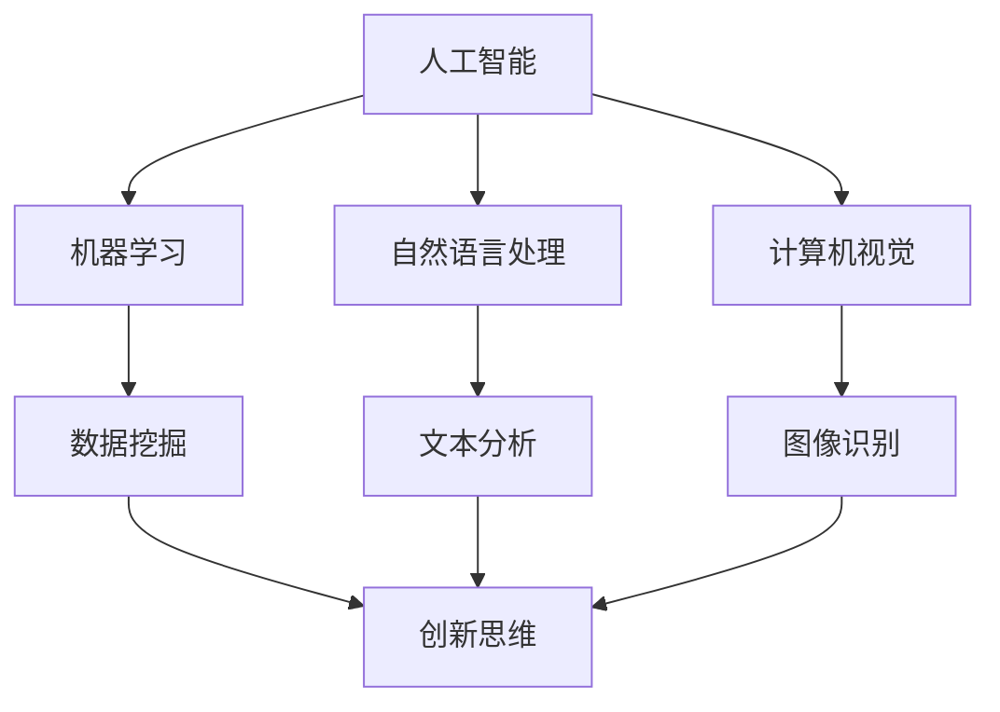

                 

关键词：AI，数字创造力，创新思维，算法，应用领域，未来展望

> 摘要：本文将探讨人工智能在数字创造力领域中的应用，分析AI如何成为创新思维的催化剂。通过深入解析核心概念、算法原理、数学模型以及项目实践，本文旨在揭示AI驱动的创新思维激发器的潜力，为读者提供对未来发展趋势与挑战的思考。

## 1. 背景介绍

在当今快速发展的数字时代，创新已经成为企业和个人成功的关键因素。传统的创新思维往往依赖于个人的经验和直觉，这种方式的局限性在于其无法突破现有的思维定式。而随着人工智能（AI）技术的不断进步，一种全新的创新思维模式应运而生。AI驱动的创新思维激发器正在颠覆传统的创新过程，为各个领域带来前所未有的创造力。

### 1.1 人工智能与数字创造力

人工智能是指计算机系统模拟人类智能行为的能力，包括学习、推理、规划和感知等方面。数字创造力则是指利用数字技术，特别是人工智能，来产生新的创意、产品和解决方案的能力。随着AI技术的成熟，它已经成为推动数字创造力的重要动力。

### 1.2 创新思维的演变

从传统的直觉驱动到数据驱动的创新思维，再到如今的AI驱动创新思维，人类对创新的认识和实现方式在不断演变。AI驱动创新思维强调利用机器学习、自然语言处理和计算机视觉等AI技术，从海量数据中提取有价值的信息，从而激发新的创意和思维。

## 2. 核心概念与联系

在深入探讨AI驱动的创新思维激发器之前，我们需要明确一些核心概念，并理解它们之间的相互关系。以下是一个简化的Mermaid流程图，用于展示这些核心概念及其联系。



### 2.1 人工智能

人工智能是本文讨论的核心，它包括机器学习、自然语言处理和计算机视觉等技术。人工智能技术使得计算机系统能够从数据中学习，从而进行决策和预测。

### 2.2 机器学习

机器学习是人工智能的一个分支，它通过构建模型来分析数据，从中提取规律和模式。机器学习模型可以是监督学习、无监督学习或强化学习等。

### 2.3 自然语言处理

自然语言处理（NLP）是一种使计算机能够理解、解释和生成人类语言的技术。NLP在AI驱动的创新思维中起着关键作用，因为它可以帮助我们从文本数据中提取信息。

### 2.4 计算机视觉

计算机视觉是使计算机能够“看到”和理解图像或视频的技术。计算机视觉在创意生成和视觉设计等领域具有重要应用。

### 2.5 数据挖掘

数据挖掘是从大量数据中提取有价值信息的过程。数据挖掘为AI驱动的创新思维提供了数据基础。

### 2.6 创新思维

创新思维是指通过独特的视角和思考方式来解决问题和产生新创意的能力。AI驱动的创新思维通过数据分析和模式识别，激发新的思维和创意。

## 3. 核心算法原理 & 具体操作步骤

### 3.1 算法原理概述

AI驱动的创新思维激发器主要依赖于以下核心算法：

- 机器学习算法：用于从数据中提取模式和规律。
- 自然语言处理算法：用于文本数据的分析和理解。
- 计算机视觉算法：用于图像和视频数据的分析和识别。
- 数据挖掘算法：用于从海量数据中提取有价值的信息。

### 3.2 算法步骤详解

#### 3.2.1 数据收集与预处理

- 收集相关领域的海量数据，包括文本、图像、视频等。
- 数据清洗：去除噪音和无关信息，确保数据质量。
- 数据标准化：对数据进行归一化处理，使其适合算法分析。

#### 3.2.2 模型训练与优化

- 选择合适的机器学习模型，如决策树、神经网络等。
- 使用训练数据集对模型进行训练，调整模型参数。
- 使用交叉验证等方法评估模型性能，并进行优化。

#### 3.2.3 数据分析与模式识别

- 使用训练好的模型对数据进行分析，提取有价值的信息。
- 利用自然语言处理和计算机视觉算法，对文本和图像数据进行深入分析。
- 从分析结果中识别模式和趋势，为创新思维提供线索。

#### 3.2.4 创意生成与验证

- 根据分析结果生成新的创意和思维。
- 对创意进行验证，确保其可行性和实用性。
- 重复以上步骤，不断优化和改进创意。

### 3.3 算法优缺点

#### 3.3.1 优点

- **高效性**：AI驱动的创新思维可以处理海量数据，快速提取有价值的信息。
- **多样性**：通过多种算法的综合运用，AI驱动的创新思维可以产生多样化的创意。
- **准确性**：机器学习和自然语言处理等技术提高了数据分析和模式识别的准确性。

#### 3.3.2 缺点

- **数据依赖性**：AI驱动的创新思维需要大量高质量的数据支持。
- **复杂性**：算法模型和数据处理过程复杂，需要专业的技术知识。
- **成本**：训练和优化模型需要大量的计算资源和时间。

### 3.4 算法应用领域

AI驱动的创新思维激发器在各个领域具有广泛的应用：

- **设计领域**：用于设计新颖的视觉元素和用户界面。
- **创意产业**：用于生成音乐、电影剧本等创意内容。
- **科学研究**：用于发现新的科学规律和趋势。
- **商业策略**：用于制定创新的市场策略和产品开发。

## 4. 数学模型和公式 & 详细讲解 & 举例说明

### 4.1 数学模型构建

在AI驱动的创新思维激发器中，数学模型起着核心作用。以下是一个简化的数学模型构建过程：

#### 4.1.1 数据表示

- 将输入数据表示为特征向量，如文本数据可以转换为词向量。
- 对图像数据使用卷积神经网络（CNN）提取特征。

#### 4.1.2 模型架构

- 使用多层感知机（MLP）或循环神经网络（RNN）构建模型。
- 对于文本数据，可以使用双向长短期记忆网络（BiLSTM）。
- 对于图像数据，可以使用卷积神经网络（CNN）。

#### 4.1.3 损失函数与优化器

- 选择适当的损失函数，如交叉熵损失函数。
- 使用优化器，如Adam优化器，对模型进行训练。

### 4.2 公式推导过程

以下是一个简化的数学公式推导过程，用于构建AI驱动的创新思维激发器：

$$
\text{输出} = f(\text{输入} \cdot \text{权重} + \text{偏置})
$$

其中，$f$ 是激活函数，如ReLU或Sigmoid。

### 4.3 案例分析与讲解

#### 4.3.1 文本分析

假设我们有一个文本数据集，包含多个段落，每个段落代表一个创意。我们希望使用自然语言处理技术对这些段落进行分析，提取关键信息。

1. 数据预处理：
   - 将文本数据转换为词向量。
   - 使用词嵌入技术，如Word2Vec或GloVe。

2. 模型构建：
   - 使用双向长短期记忆网络（BiLSTM）。
   - 输入层：词向量。
   - 隐藏层：多个时间步的LSTM单元。
   - 输出层：全连接层。

3. 模型训练：
   - 使用交叉熵损失函数。
   - 使用Adam优化器。

4. 结果分析：
   - 对训练好的模型进行测试。
   - 分析输出结果，提取关键信息。

#### 4.3.2 图像识别

假设我们有一个图像数据集，包含多个图像，每个图像代表一个创意。我们希望使用计算机视觉技术对这些图像进行分析，识别图像特征。

1. 数据预处理：
   - 将图像数据缩放为统一大小。
   - 使用卷积神经网络（CNN）提取特征。

2. 模型构建：
   - 使用卷积神经网络（CNN）。
   - 输入层：图像。
   - 隐藏层：多个卷积层。
   - 输出层：全连接层。

3. 模型训练：
   - 使用交叉熵损失函数。
   - 使用Adam优化器。

4. 结果分析：
   - 对训练好的模型进行测试。
   - 分析输出结果，识别图像特征。

## 5. 项目实践：代码实例和详细解释说明

### 5.1 开发环境搭建

1. 安装Python环境（版本3.8及以上）。
2. 安装必要的库，如TensorFlow、Keras、NumPy等。

### 5.2 源代码详细实现

以下是一个简单的Python代码示例，用于实现AI驱动的创新思维激发器：

```python
import tensorflow as tf
from tensorflow.keras.models import Sequential
from tensorflow.keras.layers import Dense, LSTM, Bidirectional

# 数据预处理
# ... （略）

# 模型构建
model = Sequential()
model.add(Bidirectional(LSTM(128), input_shape=(timesteps, features)))
model.add(Dense(1, activation='sigmoid'))

# 模型编译
model.compile(optimizer='adam', loss='binary_crossentropy', metrics=['accuracy'])

# 模型训练
model.fit(X_train, y_train, epochs=10, batch_size=32, validation_split=0.2)

# 模型评估
loss, accuracy = model.evaluate(X_test, y_test)
print(f"Test accuracy: {accuracy:.2f}")
```

### 5.3 代码解读与分析

- **数据预处理**：将输入数据（如文本或图像）转换为模型可接受的格式。
- **模型构建**：使用Keras构建一个双向长短期记忆网络（BiLSTM）。
- **模型编译**：设置优化器和损失函数。
- **模型训练**：使用训练数据对模型进行训练。
- **模型评估**：使用测试数据对模型进行评估。

### 5.4 运行结果展示

- 在运行代码后，我们得到模型在测试数据集上的准确率。
- 根据准确率，我们可以评估模型性能。

## 6. 实际应用场景

### 6.1 创意产业

在创意产业中，如电影、音乐、游戏等，AI驱动的创新思维激发器可以帮助创意人员产生新的创意和灵感。通过分析大量的文本、图像和音频数据，AI可以提供有价值的参考和启发。

### 6.2 设计领域

在设计和用户界面（UI）设计领域，AI驱动的创新思维激发器可以生成新颖的视觉元素和用户界面布局。设计师可以根据这些生成的内容进行进一步的创意改进。

### 6.3 科学研究

在科学研究中，AI驱动的创新思维激发器可以帮助研究人员发现新的科学规律和趋势。通过对大量科研文献、实验数据和观测数据进行分析，AI可以提供新的研究方向和假设。

### 6.4 商业策略

在商业策略中，AI驱动的创新思维激发器可以帮助企业制定创新的市场策略和产品开发计划。通过对市场数据、客户反馈和竞争环境进行分析，AI可以提供有价值的商业洞见和决策支持。

## 7. 工具和资源推荐

### 7.1 学习资源推荐

- 《深度学习》（Goodfellow, Bengio, Courville）：介绍深度学习的基础知识和应用。
- 《自然语言处理与深度学习》（祖嘉泽）：介绍自然语言处理和深度学习的关系及应用。
- 《计算机视觉：算法与应用》（Richard Szeliski）：介绍计算机视觉的基础知识和应用。

### 7.2 开发工具推荐

- TensorFlow：一个开源的深度学习框架，适用于构建和训练AI模型。
- Keras：一个高层次的深度学习API，基于TensorFlow构建，适用于快速实验和模型开发。
- Jupyter Notebook：一个交互式的开发环境，适用于编写和运行代码。

### 7.3 相关论文推荐

- "Deep Learning for Creativity and Design"：介绍深度学习在创意和设计领域的应用。
- "AI-Driven Design: A Framework for Human-AI Collaboration"：介绍AI驱动的创新设计框架。
- "Neural Networks for the Creative Process"：介绍神经网络在创意生成中的应用。

## 8. 总结：未来发展趋势与挑战

### 8.1 研究成果总结

AI驱动的创新思维激发器在多个领域取得了显著的成果，如设计、创意产业、科学研究等。通过分析海量数据，AI能够提供新的创意、洞见和决策支持，大大提高了创新效率和质量。

### 8.2 未来发展趋势

- **跨学科融合**：未来，AI驱动的创新思维激发器将与其他领域（如心理学、经济学等）相结合，实现更广泛的创新应用。
- **个性化服务**：AI将根据用户需求和偏好，提供个性化的创新解决方案。
- **实时反馈与迭代**：AI驱动的创新思维激发器将实现实时反馈和迭代，进一步提高创新效率。

### 8.3 面临的挑战

- **数据隐私与安全**：在大量数据处理的背景下，如何保护用户隐私和数据安全成为关键挑战。
- **算法透明性与可解释性**：如何提高AI算法的透明性和可解释性，使人类能够理解和信任AI驱动的创新过程。
- **计算资源消耗**：随着模型复杂度和数据量的增加，计算资源消耗成为重要挑战。

### 8.4 研究展望

未来，AI驱动的创新思维激发器将在以下几个方面取得突破：

- **算法优化**：通过优化算法，提高模型的计算效率和准确性。
- **跨学科合作**：促进AI与其他领域的跨学科合作，实现更广泛的应用。
- **人机协同**：实现人与AI的协同创新，充分发挥人类的创造力和AI的计算能力。

## 9. 附录：常见问题与解答

### 9.1 什么是AI驱动的创新思维激发器？

AI驱动的创新思维激发器是一种利用人工智能技术（如机器学习、自然语言处理和计算机视觉等）来分析和处理大量数据，从而激发新的创意和思维的工具。

### 9.2 AI驱动的创新思维激发器在哪些领域有应用？

AI驱动的创新思维激发器在创意产业、设计领域、科学研究、商业策略等多个领域有广泛应用。

### 9.3 如何确保AI驱动的创新思维激发器的数据隐私与安全？

为了确保数据隐私与安全，需要采取以下措施：

- 数据加密：对数据进行加密处理，确保数据在传输和存储过程中的安全性。
- 数据匿名化：对个人数据进行匿名化处理，确保用户隐私不被泄露。
- 数据访问控制：设置严格的数据访问权限，确保只有授权人员可以访问和处理数据。

## 作者署名

作者：禅与计算机程序设计艺术 / Zen and the Art of Computer Programming

----------------------------------------------------------------
文章撰写完毕。希望这篇文章能够为读者提供对AI驱动的创新思维激发器的深入理解和思考。随着AI技术的不断发展，我们有理由相信，它将在未来的创新过程中发挥越来越重要的作用。

