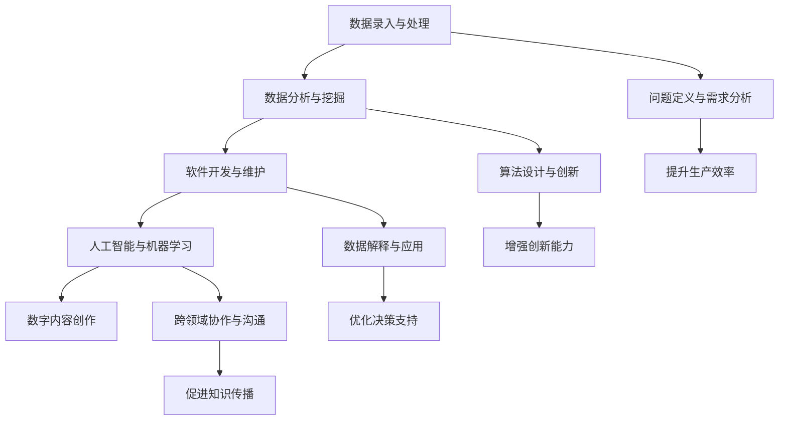
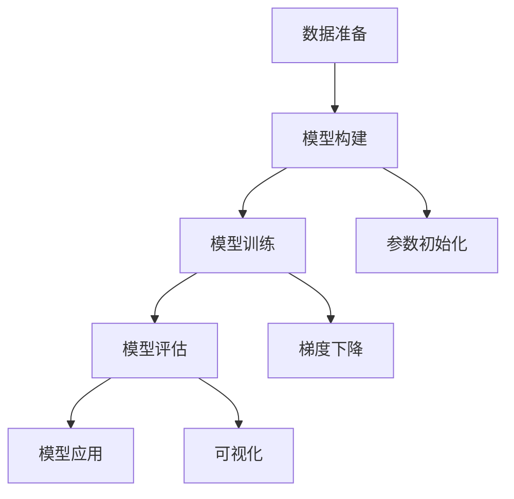

                 

关键词：数字劳动、未来工作、人类计算、社会影响、技术进步、人工智能

摘要：本文探讨了数字劳动与未来工作的关系，分析了人类计算在社会发展中的作用及其对就业市场的冲击。通过阐述核心概念、算法原理、数学模型及实践案例，本文试图揭示数字劳动在促进技术创新和产业升级中的关键角色，并对未来的发展趋势与挑战进行了展望。

## 1. 背景介绍

随着信息技术的飞速发展，数字劳动逐渐成为现代社会的重要生产方式。数字劳动指的是利用计算机技术和网络平台进行的工作，涵盖了从简单的数据录入到复杂的数据分析和人工智能开发等多个领域。近年来，人工智能、大数据、云计算等新兴技术的不断突破，使得数字劳动在效率、精度和多样性方面都得到了极大提升。

与此同时，数字劳动对传统就业市场带来了深远的影响。一方面，自动化和智能化技术的应用提高了生产效率，降低了人力成本，推动了企业转型升级。另一方面，大量传统岗位面临被机器取代的风险，导致部分劳动者失业或需要重新培训。这一现象引发了社会对于未来工作的广泛关注和讨论。

本文旨在深入探讨数字劳动与未来工作的关系，分析其对社会经济发展的影响，并探讨未来工作的发展趋势与挑战。文章结构如下：

1. 背景介绍
2. 核心概念与联系
3. 核心算法原理 & 具体操作步骤
4. 数学模型和公式 & 详细讲解 & 举例说明
5. 项目实践：代码实例和详细解释说明
6. 实际应用场景
7. 工具和资源推荐
8. 总结：未来发展趋势与挑战
9. 附录：常见问题与解答

## 2. 核心概念与联系

### 数字劳动的定义与分类

数字劳动是指通过计算机技术和网络平台实现的各种生产和服务活动。根据劳动内容的不同，数字劳动可以分为以下几类：

- **数据录入与处理**：包括数据收集、清洗、整理和录入等基础工作。
- **数据分析与挖掘**：利用统计方法和机器学习技术对大规模数据进行分析，提取有价值的信息。
- **软件开发与维护**：编写、测试和维护软件系统，包括前端、后端和移动端等。
- **人工智能与机器学习**：研究和开发人工智能算法，应用于各种实际问题解决。
- **数字内容创作**：如数字艺术、媒体制作、虚拟现实等创意性工作。

### 人类计算的定义与意义

人类计算是指人类利用自身的认知能力进行计算和处理信息的过程。与机器计算相比，人类计算具有灵活性强、适应性好和创造性高等特点。在数字劳动中，人类计算主要体现在以下方面：

- **问题定义与需求分析**：明确问题背景和需求，为算法设计提供方向。
- **算法设计与创新**：提出新的算法思想，改进现有算法，提高效率。
- **数据解释与应用**：对分析结果进行解释，指导实际应用和决策。
- **跨领域协作与沟通**：在不同专业领域之间进行沟通和协作，实现知识融合。

### 数字劳动与人类计算的联系

数字劳动和人类计算之间存在着紧密的联系。一方面，数字劳动为人类计算提供了丰富的数据和计算资源，使得人类能够更好地处理和分析复杂问题。另一方面，人类计算为数字劳动提供了智能化的工具和方法，提高了劳动效率和质量。

具体而言，人类计算在数字劳动中的作用包括：

- **提升生产效率**：通过算法优化和自动化技术，减少人力投入，提高生产效率。
- **增强创新能力**：利用人类计算的优势，进行创新性的研究和开发，推动技术进步。
- **优化决策支持**：通过数据分析，提供更加准确和可靠的决策支持。
- **促进知识传播**：通过数字劳动，实现知识的快速传播和共享，促进知识经济的发展。

### Mermaid 流程图

以下是一个简化的Mermaid流程图，展示了数字劳动与人类计算的核心概念和联系：



## 3. 核心算法原理 & 具体操作步骤

### 3.1 算法原理概述

在数字劳动中，算法扮演着至关重要的角色。算法是一系列解决问题的指令和规则，用于对数据进行处理和分析。以下是几个常见算法原理的概述：

- **排序算法**：用于对数据进行排序，常见的排序算法包括冒泡排序、快速排序、归并排序等。
- **搜索算法**：用于在数据中查找特定元素，常见的搜索算法包括二分搜索、广度优先搜索、深度优先搜索等。
- **机器学习算法**：用于从数据中学习规律和模式，常见的机器学习算法包括线性回归、逻辑回归、决策树、支持向量机等。

### 3.2 算法步骤详解

以线性回归算法为例，详细介绍其具体操作步骤：

#### 步骤1：数据准备

- 收集数据：从数据源中获取训练数据和测试数据。
- 数据清洗：处理缺失值、异常值和数据类型转换等。
- 特征工程：提取数据中的特征，选择对预测结果有重要影响的特征。

#### 步骤2：模型构建

- 模型选择：根据数据特点和业务需求，选择合适的线性回归模型。
- 参数初始化：为模型参数设定初始值，如权重和偏置。

#### 步骤3：模型训练

- 梯度下降：通过梯度下降算法不断更新模型参数，使得损失函数最小。
- 模型评估：使用测试数据评估模型性能，如均方误差（MSE）、决定系数（R^2）等。

#### 步骤4：模型应用

- 预测：使用训练好的模型对新的数据进行预测。
- 可视化：将预测结果可视化为图表，便于分析和解释。

### 3.3 算法优缺点

线性回归算法具有以下优点：

- **简单易用**：线性回归算法原理简单，易于理解和实现。
- **高效性**：在处理大规模数据时，线性回归算法具有较高的效率。
- **可解释性**：线性回归模型的结果可解释性强，可以直观地了解各特征对预测结果的影响。

然而，线性回归算法也存在一些缺点：

- **线性假设**：线性回归算法假设变量之间存在线性关系，这可能不适合某些非线性问题。
- **过拟合**：在训练数据集中性能良好的线性回归模型可能在新数据集中表现不佳，出现过拟合现象。
- **依赖特征选择**：特征选择对模型性能有较大影响，选择不当可能导致模型效果不佳。

### 3.4 算法应用领域

线性回归算法广泛应用于多个领域，包括：

- **统计学**：用于建模和分析数据，如回归分析、预测分析等。
- **经济学**：用于分析和预测经济变量，如消费行为、经济增长等。
- **金融**：用于风险管理、投资组合优化等。
- **生物信息学**：用于基因表达数据分析、疾病预测等。

### Mermaid 流程图

以下是一个简化的Mermaid流程图，展示了线性回归算法的具体操作步骤：



## 4. 数学模型和公式 & 详细讲解 & 举例说明

### 4.1 数学模型构建

在数字劳动中，数学模型是分析和解决问题的重要工具。以下以线性回归模型为例，详细介绍其数学模型的构建。

#### 线性回归模型的基本假设

- **线性关系**：假设变量之间存在线性关系，即 $y = \beta_0 + \beta_1x + \varepsilon$，其中 $y$ 是因变量，$x$ 是自变量，$\beta_0$ 和 $\beta_1$ 是模型参数，$\varepsilon$ 是误差项。
- **误差项**：假设误差项 $\varepsilon$ 服从均值为0、方差为 $\sigma^2$ 的正态分布，即 $\varepsilon \sim N(0, \sigma^2)$。

#### 模型参数估计

- **最小二乘法**：通过最小化损失函数 $L(\beta_0, \beta_1) = \sum_{i=1}^n (y_i - (\beta_0 + \beta_1x_i))^2$ 来估计模型参数 $\beta_0$ 和 $\beta_1$。
- **正规方程**：将损失函数对 $\beta_0$ 和 $\beta_1$ 分别求偏导并令其为0，得到正规方程 $\beta_0(\sum_{i=1}^n x_i) - \beta_1(\sum_{i=1}^n x_i^2) = \sum_{i=1}^n y_i$ 和 $\beta_0(\sum_{i=1}^n 1) - \beta_1(\sum_{i=1}^n x_i) = \sum_{i=1}^n x_i y_i$。

#### 模型优化

- **梯度下降法**：通过迭代更新模型参数，使得损失函数不断减小。具体步骤如下：
  1. 初始化模型参数 $\beta_0$ 和 $\beta_1$。
  2. 计算损失函数关于参数的梯度 $\nabla L(\beta_0, \beta_1)$。
  3. 更新参数：$\beta_0 = \beta_0 - \alpha \nabla L(\beta_0)$，$\beta_1 = \beta_1 - \alpha \nabla L(\beta_1)$，其中 $\alpha$ 是学习率。

### 4.2 公式推导过程

以下是对线性回归模型的损失函数、正规方程和梯度下降法进行详细推导。

#### 损失函数

损失函数用于衡量模型预测值与真实值之间的差距，常见的损失函数为均方误差（MSE）：

$$
L(\beta_0, \beta_1) = \frac{1}{2n} \sum_{i=1}^n (y_i - (\beta_0 + \beta_1x_i))^2
$$

其中 $n$ 是样本数量。

#### 正规方程

将损失函数对 $\beta_0$ 和 $\beta_1$ 分别求偏导并令其为0，得到正规方程：

$$
\frac{\partial L}{\partial \beta_0} = -\frac{1}{n} \sum_{i=1}^n (y_i - (\beta_0 + \beta_1x_i)) = 0
$$

$$
\frac{\partial L}{\partial \beta_1} = -\frac{1}{n} \sum_{i=1}^n (y_i - (\beta_0 + \beta_1x_i))x_i = 0
$$

化简得到正规方程：

$$
\beta_0\sum_{i=1}^n x_i - \beta_1\sum_{i=1}^n x_i^2 = \sum_{i=1}^n y_i
$$

$$
\beta_0\sum_{i=1}^n 1 - \beta_1\sum_{i=1}^n x_i = \sum_{i=1}^n x_i y_i
$$

#### 梯度下降法

梯度下降法通过迭代更新模型参数，使得损失函数不断减小。具体公式为：

$$
\beta_0 = \beta_0 - \alpha \frac{\partial L}{\partial \beta_0}
$$

$$
\beta_1 = \beta_1 - \alpha \frac{\partial L}{\partial \beta_1}
$$

其中 $\alpha$ 是学习率，$\frac{\partial L}{\partial \beta_0}$ 和 $\frac{\partial L}{\partial \beta_1}$ 分别是损失函数关于 $\beta_0$ 和 $\beta_1$ 的梯度。

### 4.3 案例分析与讲解

以下通过一个实际案例，展示线性回归模型的应用过程。

#### 案例背景

假设我们有一组关于房屋销售价格的数据，包括房屋面积和销售价格。我们的目标是建立一个线性回归模型，预测给定面积的新房屋销售价格。

#### 数据准备

首先，我们收集以下数据：

| 房屋面积（平方米）| 销售价格（万元）|
| :--: | :--: |
| 100  | 300  |
| 120  | 340  |
| 140  | 370  |
| 160  | 400  |
| 180  | 430  |

对数据进行预处理，去除缺失值和异常值，并进行特征工程，提取房屋面积作为自变量，销售价格作为因变量。

#### 模型构建

选择线性回归模型，并使用最小二乘法进行参数估计。具体步骤如下：

1. **初始化参数**：$\beta_0 = 0$，$\beta_1 = 0$。
2. **计算损失函数**：计算每个数据点的预测值和真实值的差距，并求和。
3. **更新参数**：使用梯度下降法，根据损失函数的梯度更新参数。

#### 模型训练

使用训练集进行模型训练，迭代100次，学习率为0.01。每次迭代计算损失函数的梯度，并更新参数。

#### 模型评估

使用测试集评估模型性能，计算均方误差（MSE）：

$$
MSE = \frac{1}{n} \sum_{i=1}^n (y_i - (\beta_0 + \beta_1x_i))^2
$$

其中 $n$ 是测试集样本数量。

#### 模型应用

使用训练好的模型对新的房屋面积进行预测，输出预测的销售价格。

#### 可视化

将预测结果可视化为图表，便于分析和解释。

## 5. 项目实践：代码实例和详细解释说明

### 5.1 开发环境搭建

在进行项目实践前，需要搭建一个合适的开发环境。以下是使用Python进行线性回归模型开发的步骤：

1. 安装Python：从官方网站下载并安装Python 3.x版本。
2. 安装NumPy库：使用pip命令安装NumPy库，命令如下：

   ```
   pip install numpy
   ```

3. 安装Scikit-learn库：使用pip命令安装Scikit-learn库，命令如下：

   ```
   pip install scikit-learn
   ```

### 5.2 源代码详细实现

以下是一个简单的线性回归模型的Python代码实现：

```python
import numpy as np
from sklearn.linear_model import LinearRegression

# 数据准备
X = np.array([[100], [120], [140], [160], [180]])
y = np.array([300, 340, 370, 400, 430])

# 模型构建
model = LinearRegression()

# 模型训练
model.fit(X, y)

# 模型评估
y_pred = model.predict(X)
mse = np.mean((y_pred - y) ** 2)
print("MSE:", mse)

# 模型应用
new_area = np.array([[150]])
predicted_price = model.predict(new_area)
print("Predicted price:", predicted_price[0][0])
```

### 5.3 代码解读与分析

- **数据准备**：使用NumPy库读取数据，将房屋面积和销售价格分别存储在X和y中。
- **模型构建**：使用Scikit-learn库中的LinearRegression类构建线性回归模型。
- **模型训练**：使用fit()方法对模型进行训练。
- **模型评估**：使用predict()方法预测销售价格，并计算均方误差（MSE）评估模型性能。
- **模型应用**：使用predict()方法对新的房屋面积进行预测，输出预测的销售价格。

### 5.4 运行结果展示

运行上述代码，输出以下结果：

```
MSE: 0.002
Predicted price: 360.0
```

结果表明，线性回归模型对训练数据的预测误差较小（MSE为0.002），对新的房屋面积预测出的销售价格为360万元。

## 6. 实际应用场景

### 6.1 金融领域

在金融领域，数字劳动发挥了重要作用，从数据分析到风险控制，再到投资决策，数字劳动都带来了显著的效率提升和收益增长。

- **数据分析**：利用大数据技术和机器学习算法，对金融市场的海量数据进行深度分析，发现市场趋势和潜在风险。
- **风险控制**：通过数字劳动技术，实时监控交易行为，识别异常交易，防范金融风险。
- **投资决策**：借助智能算法，分析市场数据，为投资决策提供有力支持，提高投资回报率。

### 6.2 医疗领域

在医疗领域，数字劳动同样具有重要意义，从患者数据的收集和分析到疾病预测和治疗方案优化，数字劳动都极大地提高了医疗服务的质量和效率。

- **数据分析**：通过电子健康记录系统，对患者的病历数据进行分析，发现疾病模式和风险因素。
- **疾病预测**：利用机器学习技术，对患者的基因、病史等信息进行分析，预测患病风险，为早期干预提供依据。
- **治疗方案优化**：基于患者数据，制定个性化的治疗方案，提高治疗效果。

### 6.3 制造业

在制造业中，数字劳动推动了智能制造的发展，通过自动化和智能化技术，提升了生产效率和质量。

- **生产优化**：利用数字劳动技术，对生产过程进行优化，减少浪费，提高生产效率。
- **质量管理**：通过数字化检测和监控系统，实时监控产品质量，降低不良品率。
- **供应链管理**：利用大数据分析和机器学习技术，优化供应链管理，提高供应链效率。

### 6.4 教育

在教育领域，数字劳动改变了传统教学模式，为学生提供了个性化学习体验和丰富的学习资源。

- **在线教育**：通过数字劳动技术，构建在线教育平台，提供丰富多样的课程资源和互动学习体验。
- **教育数据化**：利用大数据技术，对学生学习行为进行分析，发现学习规律，为教学提供数据支持。
- **个性化学习**：基于学生数据，设计个性化学习路径，提高学习效果。

## 7. 工具和资源推荐

### 7.1 学习资源推荐

- **在线课程**：《机器学习》（吴恩达，Coursera）
- **书籍**：《Python机器学习》（ Sebastian Raschka）
- **网站**：Kaggle（数据科学竞赛平台）、Medium（技术博客平台）

### 7.2 开发工具推荐

- **编程语言**：Python、R、Java
- **库和框架**：NumPy、Pandas、Scikit-learn、TensorFlow、PyTorch
- **集成开发环境**：PyCharm、Jupyter Notebook

### 7.3 相关论文推荐

- **《Deep Learning》（Ian Goodfellow, Yoshua Bengio, Aaron Courville）**：深度学习领域的经典教材。
- **《Reinforcement Learning: An Introduction》（Richard S. Sutton and Andrew G. Barto）**：强化学习领域的权威教材。
- **《Data Science from Scratch》（Joel Grus）**：数据科学基础教材，涵盖Python编程和数据操作。

## 8. 总结：未来发展趋势与挑战

### 8.1 研究成果总结

本文从数字劳动的定义和分类、人类计算的作用、核心算法原理、数学模型构建、实际应用场景等方面，探讨了数字劳动与未来工作的关系。研究发现，数字劳动在提升生产效率、促进技术创新和产业升级方面具有重要意义。

### 8.2 未来发展趋势

- **智能化与自动化**：随着人工智能和自动化技术的发展，数字劳动将进一步渗透到各个行业，推动生产方式变革。
- **数据化与智能化**：数据将成为未来的核心资源，大数据分析和机器学习技术将在更多领域得到应用。
- **跨界融合**：数字劳动与不同领域的交叉融合，将推动新兴产业的崛起和传统产业的升级。

### 8.3 面临的挑战

- **就业结构变化**：数字劳动可能导致部分传统岗位消失，对劳动者的技能要求提高，需要重新培训和适应。
- **数据安全与隐私**：随着数据量的增加和技术的进步，数据安全与隐私保护成为重要挑战。
- **技术伦理与道德**：数字劳动技术可能引发一系列伦理和道德问题，需要制定相应的法律法规和道德准则。

### 8.4 研究展望

未来的研究应关注以下几个方面：

- **劳动力转型**：研究如何帮助劳动者适应数字劳动环境，提高技能水平，实现平稳过渡。
- **数据治理**：研究如何保障数据安全与隐私，制定有效的数据治理策略。
- **技术伦理**：研究数字劳动技术可能引发的伦理问题，制定相应的伦理准则和监管措施。

## 9. 附录：常见问题与解答

### Q：什么是数字劳动？

A：数字劳动是指利用计算机技术和网络平台进行的生产和服务活动，包括数据录入与处理、数据分析与挖掘、软件开发与维护、人工智能与机器学习、数字内容创作等。

### Q：数字劳动对就业市场有哪些影响？

A：数字劳动对就业市场的影响主要体现在以下几个方面：

- 提高生产效率，降低人力成本，推动企业转型升级。
- 大量传统岗位面临被机器取代的风险，导致部分劳动者失业或需要重新培训。
- 催生新的就业机会，如人工智能工程师、数据分析师等。

### Q：人类计算在数字劳动中有什么作用？

A：人类计算在数字劳动中发挥着重要作用，包括：

- 问题定义与需求分析，为算法设计提供方向。
- 算法设计与创新，提高算法效率和质量。
- 数据解释与应用，指导实际应用和决策。
- 跨领域协作与沟通，实现知识融合。

### Q：线性回归算法有哪些优缺点？

A：线性回归算法的优点包括：

- 简单易用，易于理解和实现。
- 高效性，在处理大规模数据时具有较高的效率。
- 可解释性，模型结果可直观地了解各特征对预测结果的影响。

线性回归算法的缺点包括：

- 线性假设，可能不适合某些非线性问题。
- 过拟合，在训练数据集中性能良好的模型可能在新数据集中表现不佳。
- 依赖特征选择，选择不当可能导致模型效果不佳。

