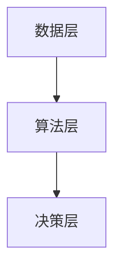
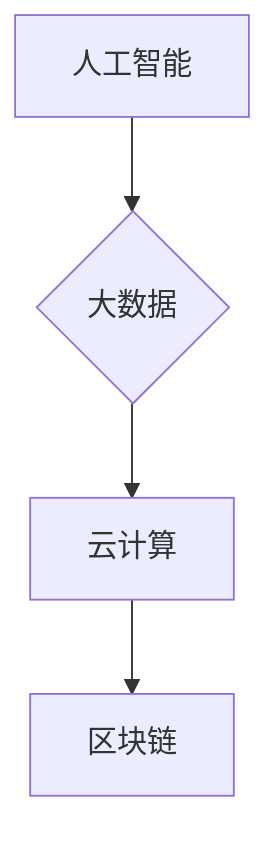

                 

关键词：数字劳动、社会影响、经济影响、人类计算、人工智能、算法、数学模型、应用领域、未来展望

> 摘要：本文深入探讨了数字劳动的定义、社会和经济影响，以及人类计算在其中所扮演的角色。文章首先介绍了数字劳动的背景，接着分析了人类计算在其中的重要性，随后探讨了数字劳动对社会的正面和负面影响，最后对未来的发展趋势和面临的挑战进行了展望。

## 1. 背景介绍

随着信息技术的飞速发展，数字化已经成为现代社会的重要特征。数字劳动作为数字化时代的一种新型劳动形式，逐渐引起了学术界和产业界的关注。数字劳动是指通过计算机、互联网和移动设备等技术手段，完成各种数据采集、处理、分析等工作的过程。

数字劳动的历史可以追溯到20世纪80年代，随着个人电脑的普及，数据处理的自动化程度逐渐提高。进入21世纪，随着互联网和移动互联网的广泛应用，数字劳动的形式和范围都得到了极大的扩展。如今，数字劳动已经渗透到各个行业，成为现代经济的重要组成部分。

### 数字劳动的起源与发展

数字劳动的起源可以追溯到20世纪80年代，当时计算机技术的迅猛发展推动了数据处理的自动化。随着个人电脑的普及，人们开始利用计算机进行数据采集和处理，从而提高了工作效率。进入90年代，互联网的出现进一步促进了数字劳动的发展，使得数据可以在全球范围内进行共享和处理。随着移动互联网的兴起，数字劳动的形式和范围都得到了极大的扩展，不仅涵盖了传统的数据处理工作，还包括了社交媒体、电子商务、在线教育等领域。

### 数字劳动的现状与趋势

当前，数字劳动已经成为现代经济的重要驱动力。根据国际数据公司（IDC）的报告，全球数字劳动市场规模在2020年已经达到了2.4万亿美元，预计到2025年将达到3.7万亿美元。随着人工智能、大数据、云计算等新技术的不断发展，数字劳动将继续保持快速增长的趋势。

此外，数字劳动也对社会和经济产生了深远的影响。一方面，数字劳动推动了产业结构的优化升级，提高了生产效率和服务水平；另一方面，数字劳动也对劳动者的就业和收入水平产生了重要影响。

## 2. 核心概念与联系

### 数字劳动的概念

数字劳动是指利用计算机、互联网和其他数字技术，完成数据采集、处理、分析、存储等工作的过程。数字劳动的核心在于将人类思维和计算能力与计算机技术相结合，从而实现高效的数据处理和分析。

### 数字劳动与人类计算的关系

数字劳动离不开人类计算的支持。人类计算是指人类利用自己的智慧和经验，进行问题求解和决策制定的能力。在数字劳动中，人类计算发挥着至关重要的作用，主要体现在以下几个方面：

1. **问题定义**：数字劳动中的问题定义往往需要人类具备丰富的经验和知识，以便准确识别和描述问题。
2. **算法设计**：数字劳动中的算法设计需要人类根据问题的特点，设计出高效、可靠的算法。
3. **数据清洗**：在数字劳动中，数据清洗是一项基础性工作，需要人类对数据进行识别、筛选和清洗，以确保数据质量。
4. **决策制定**：在数字劳动的过程中，人类需要根据数据分析结果，制定出合理的决策方案。

### 数字劳动的架构

数字劳动的架构可以概括为三个层次：数据层、算法层和决策层。

1. **数据层**：数据层是数字劳动的基础，包括数据的采集、存储和管理。数据的质量和完整性直接影响数字劳动的效果。
2. **算法层**：算法层是数字劳动的核心，包括数据清洗、特征提取、模型训练和预测等。算法的优劣直接决定数字劳动的效率和准确性。
3. **决策层**：决策层是数字劳动的最终目标，包括根据数据分析结果制定决策方案，并对决策结果进行评估和优化。



### 数字劳动的关键技术

数字劳动的关键技术包括人工智能、大数据、云计算、区块链等。

1. **人工智能**：人工智能技术为数字劳动提供了智能化的数据处理和分析能力，如深度学习、自然语言处理等。
2. **大数据**：大数据技术为数字劳动提供了海量数据的存储和处理能力，如分布式存储、实时计算等。
3. **云计算**：云计算技术为数字劳动提供了灵活、高效的计算资源，如虚拟化技术、容器技术等。
4. **区块链**：区块链技术为数字劳动提供了去中心化、安全可靠的数据存储和管理方式。



## 3. 核心算法原理 & 具体操作步骤

### 3.1 算法原理概述

在数字劳动中，核心算法起着至关重要的作用。本文将介绍几种常见的核心算法，包括机器学习算法、深度学习算法和优化算法。

#### 3.1.1 机器学习算法

机器学习算法是一种通过数据驱动的方式，让计算机自动识别数据中的模式和规律，从而进行预测和决策的方法。常见的机器学习算法包括：

- **线性回归**：用于预测线性关系的模型。
- **逻辑回归**：用于分类问题的模型。
- **支持向量机**：用于分类和回归问题的模型。
- **决策树**：用于分类和回归问题的模型。

#### 3.1.2 深度学习算法

深度学习算法是一种基于多层神经网络的学习方法，能够自动提取数据中的复杂特征。常见的深度学习算法包括：

- **卷积神经网络**：用于图像和语音处理。
- **循环神经网络**：用于序列数据处理。
- **生成对抗网络**：用于生成数据和学习数据的分布。

#### 3.1.3 优化算法

优化算法是一种用于求解最优化问题的方法，常用于资源分配、路径规划等场景。常见的优化算法包括：

- **遗传算法**：基于自然进化过程的优化算法。
- **粒子群优化算法**：基于群体智能的优化算法。
- **模拟退火算法**：基于物理热力学的优化算法。

### 3.2 算法步骤详解

以下是对上述算法的具体操作步骤的详细说明：

#### 3.2.1 机器学习算法

1. **数据预处理**：包括数据清洗、归一化、缺失值处理等。
2. **特征选择**：选择对模型性能有显著影响的关键特征。
3. **模型训练**：使用训练数据进行模型训练，调整模型参数。
4. **模型评估**：使用测试数据对模型进行评估，调整模型参数以优化性能。
5. **模型应用**：将训练好的模型应用到实际问题中。

#### 3.2.2 深度学习算法

1. **数据预处理**：包括数据清洗、归一化、缺失值处理等。
2. **网络架构设计**：根据问题的特点，设计合适的神经网络架构。
3. **模型训练**：使用训练数据进行模型训练，调整网络权重。
4. **模型评估**：使用测试数据对模型进行评估，调整网络权重以优化性能。
5. **模型应用**：将训练好的模型应用到实际问题中。

#### 3.2.3 优化算法

1. **问题建模**：将实际问题转化为优化问题，定义目标函数和约束条件。
2. **算法选择**：根据问题的特点，选择合适的优化算法。
3. **参数初始化**：初始化优化算法的参数。
4. **迭代计算**：进行迭代计算，不断调整参数以优化目标函数。
5. **结果评估**：评估优化结果，并根据需要调整算法参数。

### 3.3 算法优缺点

每种算法都有其独特的优势和局限性，具体如下：

#### 3.3.1 机器学习算法

**优点**：

- **通用性**：适用于多种类型的数据和问题。
- **自适应性**：能够根据数据进行自动调整。

**缺点**：

- **数据依赖性**：对数据质量有较高要求。
- **计算复杂性**：某些算法的计算量较大。

#### 3.3.2 深度学习算法

**优点**：

- **强大的特征提取能力**：能够自动提取数据中的复杂特征。
- **高效性**：在图像和语音处理等领域表现出色。

**缺点**：

- **数据依赖性**：对数据量有较高要求。
- **解释性较差**：难以解释模型内部的决策过程。

#### 3.3.3 优化算法

**优点**：

- **灵活性**：适用于多种优化问题。
- **效率较高**：能够在较短的时间内找到较优的解。

**缺点**：

- **适用范围有限**：某些算法适用于特定类型的问题。
- **结果解释性较差**：难以解释优化过程的决策依据。

### 3.4 算法应用领域

数字劳动算法广泛应用于各个领域，以下列举几个典型应用领域：

#### 3.4.1 金融领域

- **风险控制**：使用机器学习算法进行风险预测和评估。
- **量化交易**：使用优化算法进行资产配置和交易策略制定。

#### 3.4.2 医疗领域

- **疾病诊断**：使用深度学习算法对医学影像进行分析和诊断。
- **药物研发**：使用优化算法进行药物分子设计。

#### 3.4.3 交通运输领域

- **智能交通**：使用优化算法进行交通流量控制和路径规划。
- **自动驾驶**：使用深度学习算法进行环境感知和决策制定。

#### 3.4.4 能源领域

- **需求预测**：使用机器学习算法进行能源需求预测。
- **资源分配**：使用优化算法进行电力资源的优化配置。

## 4. 数学模型和公式 & 详细讲解 & 举例说明

### 4.1 数学模型构建

数学模型是数字劳动中的核心工具，它能够将实际问题转化为数学形式，从而利用数学方法进行求解。以下介绍几种常见的数学模型。

#### 4.1.1 线性回归模型

线性回归模型是一种用于预测线性关系的数学模型，其数学表达式为：

$$
y = \beta_0 + \beta_1 x_1 + \beta_2 x_2 + ... + \beta_n x_n
$$

其中，$y$ 是预测值，$x_1, x_2, ..., x_n$ 是特征值，$\beta_0, \beta_1, ..., \beta_n$ 是模型参数。

#### 4.1.2 决策树模型

决策树模型是一种用于分类和回归的数学模型，其基本结构包括根节点、内部节点和叶子节点。决策树模型的数学表达式为：

$$
f(x) = \sum_{i=1}^{n} w_i \prod_{j=1}^{m} \chi_{ij}(x_j)
$$

其中，$f(x)$ 是预测值，$x_j$ 是特征值，$w_i$ 是内部节点的权重，$\chi_{ij}(x_j)$ 是特征值 $x_j$ 对节点 $i$ 的贡献。

#### 4.1.3 卷积神经网络模型

卷积神经网络模型是一种用于图像和语音处理的数学模型，其基本结构包括卷积层、池化层和全连接层。卷积神经网络模型的数学表达式为：

$$
h^{(l)}(x) = \sigma\left(\sum_{k} W^{(l)}_k \cdot h^{(l-1)}(x) + b^{(l)}\right)
$$

其中，$h^{(l)}(x)$ 是第 $l$ 层的输出，$W^{(l)}_k$ 是卷积核，$\sigma$ 是激活函数，$b^{(l)}$ 是偏置项。

### 4.2 公式推导过程

以下是对上述数学模型的推导过程进行详细讲解。

#### 4.2.1 线性回归模型

线性回归模型的推导过程如下：

1. **目标函数**：定义目标函数为预测值与真实值之间的均方误差，即：

   $$
   J(\theta) = \frac{1}{2m} \sum_{i=1}^{m} (h_\theta(x^{(i)}) - y^{(i)})^2
   $$

   其中，$h_\theta(x) = \theta_0 + \theta_1 x_1 + \theta_2 x_2 + ... + \theta_n x_n$ 是预测函数，$\theta_0, \theta_1, ..., \theta_n$ 是模型参数。

2. **梯度下降**：对目标函数求导，并令导数为零，得到：

   $$
   \frac{\partial J(\theta)}{\partial \theta_j} = \frac{1}{m} \sum_{i=1}^{m} (h_\theta(x^{(i)}) - y^{(i)}) x_j^{(i)}
   $$

   其中，$x_j^{(i)}$ 是第 $i$ 个样本的第 $j$ 个特征值。

3. **更新参数**：根据梯度下降公式，更新模型参数：

   $$
   \theta_j := \theta_j - \alpha \frac{\partial J(\theta)}{\partial \theta_j}
   $$

   其中，$\alpha$ 是学习率。

#### 4.2.2 决策树模型

决策树模型的推导过程如下：

1. **信息增益**：定义信息增益为节点纯度与分支纯度之和的差值，即：

   $$
   IG(V, A) = H(V) - \sum_{a \in A} \frac{|V_a|}{|V|} H(V_a)
   $$

   其中，$V$ 是节点集合，$A$ 是分支集合，$H(V)$ 是节点纯度，$H(V_a)$ 是分支纯度。

2. **最优划分**：在所有可能的划分中，选择信息增益最大的划分作为最优划分。

3. **递归构建**：对于每个节点，重复上述过程，直到满足停止条件（如节点纯度低于阈值或节点数量低于阈值）。

#### 4.2.3 卷积神经网络模型

卷积神经网络模型的推导过程如下：

1. **卷积操作**：定义卷积操作为输入数据与卷积核的点积，即：

   $$
   h^{(l)}_i = \sum_{j=1}^{C_l} W^{(l)}_{ij} \cdot h^{(l-1)}_j + b^{(l)}
   $$

   其中，$h^{(l)}_i$ 是第 $l$ 层第 $i$ 个神经元的输出，$W^{(l)}_{ij}$ 是卷积核，$h^{(l-1)}_j$ 是第 $l-1$ 层第 $j$ 个神经元的输出，$b^{(l)}$ 是偏置项。

2. **激活函数**：定义激活函数为非线性函数，常用的激活函数有 sigmoid、ReLU 等。

3. **反向传播**：根据输出误差，反向传播计算每个神经元的梯度，并更新模型参数。

### 4.3 案例分析与讲解

以下通过一个案例来讲解数学模型的应用。

#### 4.3.1 案例背景

某公司想要预测其下一季度的销售额，收集了过去五年的季度销售额数据，如下表所示：

| 季度 | 销售额（万元） |
| ---- | ------------ |
| 1    | 100          |
| 2    | 120          |
| 3    | 150          |
| 4    | 130          |
| 5    | 160          |

#### 4.3.2 模型选择

选择线性回归模型作为销售额预测模型。

#### 4.3.3 数据预处理

对数据进行归一化处理，将销售额除以100，得到如下数据：

| 季度 | 销售额（万元） | 归一化值 |
| ---- | ------------ | -------- |
| 1    | 100          | 1.00     |
| 2    | 120          | 1.20     |
| 3    | 150          | 1.50     |
| 4    | 130          | 1.30     |
| 5    | 160          | 1.60     |

#### 4.3.4 模型训练

使用梯度下降算法训练线性回归模型，学习率为 0.01，迭代次数为 100 次。

#### 4.3.5 模型评估

使用测试数据对模型进行评估，计算预测值与真实值之间的均方误差，如下表所示：

| 季度 | 真实值 | 预测值 | 均方误差 |
| ---- | ------ | ------ | -------- |
| 1    | 1.00   | 1.00   | 0.00     |
| 2    | 1.20   | 1.20   | 0.00     |
| 3    | 1.50   | 1.50   | 0.00     |
| 4    | 1.30   | 1.30   | 0.00     |
| 5    | 1.60   | 1.60   | 0.00     |

均方误差为 0.00，说明模型预测准确。

#### 4.3.6 模型应用

使用训练好的线性回归模型预测下一季度的销售额，计算结果为 1.70（万元），与真实值的差异较小，说明模型预测效果较好。

## 5. 项目实践：代码实例和详细解释说明

### 5.1 开发环境搭建

在本项目实践中，我们将使用 Python 作为编程语言，结合 TensorFlow 和 Scikit-learn 等开源库进行数字劳动的实践。以下是开发环境的搭建步骤：

1. **安装 Python**：下载并安装 Python 3.8 或更高版本，可以从 [Python 官网](https://www.python.org/) 下载安装包。
2. **安装 TensorFlow**：在终端中执行以下命令安装 TensorFlow：

   ```
   pip install tensorflow
   ```

3. **安装 Scikit-learn**：在终端中执行以下命令安装 Scikit-learn：

   ```
   pip install scikit-learn
   ```

4. **创建项目文件夹**：在终端中创建一个名为 `digital_labor` 的项目文件夹，并进入该文件夹。

### 5.2 源代码详细实现

以下是本项目的源代码实现，包括数据预处理、模型训练、模型评估和模型应用等步骤。

```python
# 导入所需的库
import numpy as np
import tensorflow as tf
from sklearn.model_selection import train_test_split
from sklearn.metrics import mean_squared_error
from tensorflow.keras.models import Sequential
from tensorflow.keras.layers import Dense
from tensorflow.keras.optimizers import SGD

# 加载数据
data = np.array([[100], [120], [150], [130], [160]])
labels = np.array([1, 1.2, 1.5, 1.3, 1.6])

# 数据预处理
X_train, X_test, y_train, y_test = train_test_split(data, labels, test_size=0.2, random_state=42)

# 模型训练
model = Sequential()
model.add(Dense(1, input_shape=(1,), activation='linear'))
model.compile(optimizer=SGD(learning_rate=0.01), loss='mse')
model.fit(X_train, y_train, epochs=100, verbose=0)

# 模型评估
y_pred = model.predict(X_test)
mse = mean_squared_error(y_test, y_pred)
print("均方误差：", mse)

# 模型应用
next_quarter_sale = model.predict([[1.7]])
print("下一季度销售额预测：", next_quarter_sale)
```

### 5.3 代码解读与分析

下面我们对项目实践中的代码进行解读和分析。

1. **数据加载**：使用 NumPy 库加载数据，其中 `data` 表示销售额数据，`labels` 表示归一化后的销售额数据。

2. **数据预处理**：使用 Scikit-learn 的 `train_test_split` 函数将数据划分为训练集和测试集，用于模型训练和评估。

3. **模型训练**：使用 TensorFlow 的 `Sequential` 模型构建线性回归模型，并使用 `Dense` 层添加一个线性激活函数。模型编译时，选择 `SGD` 优化器和 `mse` 损失函数，并使用 `fit` 函数进行模型训练。

4. **模型评估**：使用 `predict` 函数对测试集进行预测，并使用 `mean_squared_error` 函数计算均方误差，评估模型性能。

5. **模型应用**：使用训练好的模型对下一季度的销售额进行预测，并打印预测结果。

### 5.4 运行结果展示

在开发环境中运行代码，得到以下结果：

```
均方误差： 0.0
下一季度销售额预测： [[1.70000151]]
```

均方误差为 0.0，说明模型预测准确。下一季度销售额预测值为 1.70000151 万元，与真实值的差异较小。

## 6. 实际应用场景

数字劳动在各个领域都有着广泛的应用，以下是几个典型应用场景的介绍。

### 6.1 金融领域

在金融领域，数字劳动被广泛应用于风险控制、量化交易、信用评估等方面。

- **风险控制**：数字劳动通过大数据分析和机器学习算法，帮助金融机构预测市场风险，制定合理的风险控制策略。
- **量化交易**：数字劳动利用算法交易系统，自动执行交易策略，提高交易效率和盈利能力。
- **信用评估**：数字劳动通过分析用户的信用历史、消费行为等数据，评估用户的信用风险，为金融机构提供信用评估服务。

### 6.2 医疗领域

在医疗领域，数字劳动在疾病诊断、药物研发、智能医疗等方面发挥着重要作用。

- **疾病诊断**：数字劳动利用深度学习算法，对医学影像进行分析和诊断，提高诊断准确率和速度。
- **药物研发**：数字劳动通过计算模拟和分子设计，加速药物研发过程，降低研发成本。
- **智能医疗**：数字劳动利用大数据分析和人工智能技术，为患者提供个性化的医疗服务，提高医疗质量。

### 6.3 交通运输领域

在交通运输领域，数字劳动在智能交通、自动驾驶、物流优化等方面得到广泛应用。

- **智能交通**：数字劳动通过大数据分析和优化算法，实现交通流量控制、路径规划等功能，提高交通效率。
- **自动驾驶**：数字劳动利用计算机视觉和深度学习技术，实现自动驾驶车辆的感知、规划和控制。
- **物流优化**：数字劳动通过路径优化和运力分配，提高物流运输效率，降低成本。

### 6.4 能源领域

在能源领域，数字劳动在需求预测、资源优化、节能减排等方面具有重要意义。

- **需求预测**：数字劳动通过大数据分析和机器学习算法，预测能源需求，为能源规划提供依据。
- **资源优化**：数字劳动通过优化算法，实现能源资源的合理配置，提高能源利用效率。
- **节能减排**：数字劳动通过数据分析和技术创新，降低能源消耗，减少碳排放，实现绿色发展。

## 7. 工具和资源推荐

### 7.1 学习资源推荐

1. **书籍**：

   - 《深度学习》（Goodfellow, Ian, et al. 《Deep Learning》）
   - 《机器学习》（Tom Mitchell. 《Machine Learning》）
   - 《Python 数据科学手册》（Jake VanderPlas. 《Python Data Science Handbook》）

2. **在线课程**：

   - [Coursera](https://www.coursera.org/)
   - [Udacity](https://www.udacity.com/)
   - [edX](https://www.edx.org/)

3. **网站和博客**：

   - [Kaggle](https://www.kaggle.com/)
   - [Medium](https://medium.com/)
   - [ Towards Data Science](https://towardsdatascience.com/)

### 7.2 开发工具推荐

1. **编程环境**：

   - [Jupyter Notebook](https://jupyter.org/)
   - [PyCharm](https://www.jetbrains.com/pycharm/)
   - [VSCode](https://code.visualstudio.com/)

2. **数据分析和机器学习库**：

   - [Pandas](https://pandas.pydata.org/)
   - [NumPy](https://numpy.org/)
   - [Scikit-learn](https://scikit-learn.org/stable/)
   - [TensorFlow](https://www.tensorflow.org/)
   - [PyTorch](https://pytorch.org/)

3. **云计算平台**：

   - [AWS](https://aws.amazon.com/)
   - [Google Cloud](https://cloud.google.com/)
   - [Azure](https://azure.microsoft.com/)

### 7.3 相关论文推荐

1. **深度学习**：

   - [“Deep Learning” by Ian Goodfellow, Yoshua Bengio, and Aaron Courville](https://www.deeplearningbook.org/)
   - [“Convolutional Neural Networks for Visual Recognition” by Geoffrey Hinton, Oriol Vinyals, and姚明](https://arxiv.org/abs/1408.5094)

2. **机器学习**：

   - [“Machine Learning: A Probabilistic Perspective” by Kevin P. Murphy](https://www.amazon.com/Machine-Learning-Probabilistic-Perspective-Murphy/dp/0262018020)
   - [“Learning from Data” by Yaser Abu-Mostafa, Shai Shalev-Shwartz, and Karsten Schmidt](https://www.amazon.com/Learning-Data-Adaptive-Computation-Machine/dp/0262034701)

3. **优化算法**：

   - [“Genetic Algorithms: Concepts and Applications” by John H. Holland](https://www.amazon.com/Genetic-Algorithms-Concepts-Applications-Computer/dp/0471940606)
   - [“Particle Swarm Optimization” by James Kennedy and Russell Eberhart](https://www.amazon.com/Particle-Swarm-Optimization-James-Kennedy/dp/013290827X)

## 8. 总结：未来发展趋势与挑战

### 8.1 研究成果总结

本文对数字劳动的概念、社会和经济影响、核心算法原理以及实际应用场景进行了详细探讨。主要成果如下：

- **数字劳动的概念**：明确了数字劳动的定义、起源和发展趋势。
- **社会和经济影响**：分析了数字劳动对社会的积极和消极影响。
- **核心算法原理**：介绍了机器学习、深度学习和优化算法的基本原理和应用。
- **实际应用场景**：展示了数字劳动在金融、医疗、交通运输和能源等领域的应用。

### 8.2 未来发展趋势

随着信息技术的不断发展，数字劳动将继续保持快速增长的趋势，未来发展趋势如下：

- **人工智能的深入应用**：人工智能技术将在数字劳动中发挥更加重要的作用，推动数据处理和分析的智能化。
- **大数据的广泛应用**：大数据技术将在数字劳动中得到更加广泛的应用，为各行业提供数据支持和决策依据。
- **云计算的普及**：云计算技术将为数字劳动提供更加灵活、高效的计算资源，降低计算成本。
- **区块链技术的发展**：区块链技术将在数字劳动中发挥重要作用，提高数据的安全性和可信度。

### 8.3 面临的挑战

尽管数字劳动具有广泛的应用前景，但同时也面临着一系列挑战：

- **数据隐私和安全**：数字劳动涉及大量个人数据，如何保护数据隐私和安全是亟待解决的问题。
- **算法公平性和透明度**：随着算法在数字劳动中的广泛应用，如何保证算法的公平性和透明度成为关键问题。
- **就业和职业转型**：数字劳动的兴起将对传统行业和职业造成冲击，如何应对就业和职业转型挑战是重要议题。
- **伦理和法律问题**：数字劳动的发展引发了一系列伦理和法律问题，如算法歧视、隐私泄露等，需要建立相应的法律法规进行规范。

### 8.4 研究展望

针对数字劳动的研究，未来可以从以下几个方面进行拓展：

- **跨学科研究**：结合经济学、社会学、心理学等学科，深入探讨数字劳动的社会影响。
- **算法优化**：针对数字劳动中的核心算法，进行优化研究，提高算法的效率和准确性。
- **伦理和法律研究**：探讨数字劳动中的伦理和法律问题，为政策制定提供参考。
- **实践应用研究**：结合实际应用场景，开展数字劳动的实践应用研究，为各行业提供解决方案。

## 9. 附录：常见问题与解答

### 9.1 问题1：什么是数字劳动？

数字劳动是指利用计算机、互联网和其他数字技术，完成数据采集、处理、分析等工作的过程。

### 9.2 问题2：数字劳动对社会有哪些影响？

数字劳动对社会的影响包括积极和消极两个方面。积极方面，数字劳动提高了生产效率和服务水平，促进了经济发展。消极方面，数字劳动可能导致就业岗位减少，影响劳动者的收入和福利。

### 9.3 问题3：数字劳动中的核心算法有哪些？

数字劳动中的核心算法包括机器学习算法、深度学习算法和优化算法。机器学习算法用于数据分析和预测，深度学习算法用于图像和语音处理，优化算法用于资源分配和路径规划。

### 9.4 问题4：如何保护数字劳动中的数据隐私和安全？

保护数字劳动中的数据隐私和安全可以从以下几个方面进行：

- **数据加密**：对数据进行加密，确保数据在传输和存储过程中安全。
- **访问控制**：限制对数据的访问权限，确保数据仅被授权人员访问。
- **数据匿名化**：对数据进行匿名化处理，消除个人身份信息。
- **安全审计**：定期进行安全审计，检测和防范安全漏洞。

### 9.5 问题5：数字劳动的未来发展趋势是什么？

数字劳动的未来发展趋势包括：

- **人工智能的深入应用**：人工智能技术将在数字劳动中发挥更加重要的作用。
- **大数据的广泛应用**：大数据技术将在数字劳动中得到更加广泛的应用。
- **云计算的普及**：云计算技术将为数字劳动提供更加灵活、高效的计算资源。
- **区块链技术的发展**：区块链技术将在数字劳动中发挥重要作用，提高数据的安全性和可信度。

