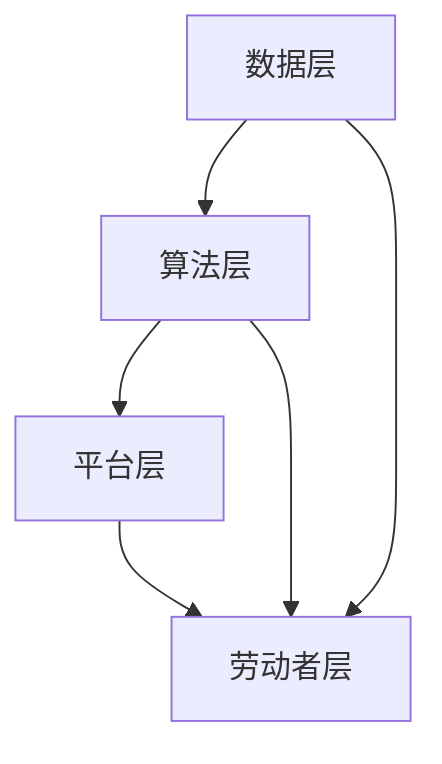

                 

关键词：数字劳动、人类计算、社会经济影响、计算架构、算法、应用领域

> 摘要：本文将深入探讨数字劳动这一现象，分析其在当今社会和经济中的重要性，探讨人类计算与机器计算的关系，及其带来的社会和经济影响。我们将从核心概念出发，逐步解读数字劳动的本质，通过具体的算法和数学模型，揭示其内在的工作机制，并探讨其实际应用场景。在此基础上，我们将展望数字劳动的未来发展趋势，以及面临的挑战和机遇。

## 1. 背景介绍

### 数字劳动的定义与历史演变

数字劳动是指通过数字化工具和平台，进行的各种类型的工作活动。它不仅包括传统的信息处理工作，如数据录入、编辑、分析等，还涵盖了更复杂的计算任务，如机器学习、数据挖掘、算法优化等。数字劳动是随着信息技术的发展而逐步演变形成的。

在早期，数字劳动主要是机械性的数据输入和记录工作，这些工作需要大量的人力进行重复操作。随着计算机和互联网的普及，数字劳动逐渐向自动化、智能化的方向发展。如今，人工智能、大数据等技术的兴起，进一步推动了数字劳动的变革，使其成为现代社会和经济发展的重要驱动力。

### 数字劳动在社会经济中的地位

数字劳动已经成为现代社会和经济的重要组成部分。首先，数字劳动促进了全球经济的增长。通过数字化工具和平台，企业可以更高效地进行生产、管理和营销，从而降低成本，提高利润。其次，数字劳动改变了劳动市场的结构。越来越多的工作可以通过远程办公、众包等方式完成，为劳动者提供了更多的就业机会和灵活性。

此外，数字劳动还带来了社会变革。它使得知识传播更加便捷，信息获取更加迅速，从而推动了社会的进步和变革。同时，数字劳动也引发了一系列的社会问题，如数字鸿沟、数据安全等，需要我们深入思考并加以解决。

## 2. 核心概念与联系

### 数字劳动的核心概念

数字劳动的核心概念包括：数据、算法、平台、劳动者。

- 数据：数字劳动的基石，包括各种类型的原始数据和经过处理的分析数据。
- 算法：用于处理数据的规则和方法，是实现数字劳动的关键。
- 平台：数字劳动的载体，包括计算机、互联网、云计算等。
- 劳动者：进行数字劳动的人，包括专业技术人员、普通劳动者等。

### 数字劳动的架构

数字劳动的架构可以分为以下几个层次：

1. **数据层**：包括数据的采集、存储、管理等功能，是数字劳动的基础。
2. **算法层**：包括各种算法的设计、实现、优化等，是数字劳动的核心。
3. **平台层**：包括数字劳动所依赖的硬件、软件、网络等基础设施。
4. **劳动者层**：包括数字劳动者的技能、知识、态度等，是数字劳动的执行者。

### Mermaid 流程图



在数字劳动的架构中，数据层、算法层和平台层共同构成了数字劳动的技术基础，而劳动者层则是数字劳动的实际执行者。他们相互关联，共同推动数字劳动的发展。

## 3. 核心算法原理 & 具体操作步骤

### 3.1 算法原理概述

数字劳动中的核心算法主要包括：机器学习算法、数据挖掘算法、云计算算法等。这些算法都是基于数学和计算机科学的理论，通过特定的算法模型和计算方法，对大量数据进行分析和处理，从而实现数字劳动的目标。

- **机器学习算法**：通过训练模型来模拟人类学习过程，对未知数据进行预测和分类。
- **数据挖掘算法**：从大量数据中挖掘出有用的信息和知识，用于决策支持。
- **云计算算法**：利用云计算技术，对大规模数据进行分析和处理，提高计算效率和性能。

### 3.2 算法步骤详解

#### 3.2.1 机器学习算法

1. **数据采集**：从各种来源收集数据，包括结构化和非结构化数据。
2. **数据预处理**：对数据进行清洗、转换和归一化，使其符合算法的要求。
3. **模型选择**：根据问题性质和需求，选择合适的机器学习模型。
4. **模型训练**：使用预处理后的数据，对模型进行训练，调整模型参数。
5. **模型评估**：使用测试数据，评估模型的性能和准确性。
6. **模型应用**：将训练好的模型应用于实际问题，进行预测和分类。

#### 3.2.2 数据挖掘算法

1. **数据预处理**：与机器学习算法相同，对数据进行清洗、转换和归一化。
2. **模式识别**：使用统计学方法和算法，从数据中识别出潜在的模式和关系。
3. **知识提取**：将识别出的模式转换为可操作的知识，用于决策支持。
4. **结果评估**：评估知识提取的结果，确定其有效性和实用性。
5. **知识应用**：将提取出的知识应用于实际问题，提高决策的准确性和效率。

#### 3.2.3 云计算算法

1. **数据上传**：将数据上传到云平台，进行存储和管理。
2. **任务分配**：根据数据规模和计算需求，将任务分配到不同的计算节点。
3. **并行计算**：在云平台上，使用并行计算方法，对大量数据进行分析和处理。
4. **结果汇总**：将各个计算节点的结果汇总，得到最终的分析结果。
5. **结果反馈**：将分析结果反馈给用户，用于决策和支持。

### 3.3 算法优缺点

#### 3.3.1 机器学习算法

- **优点**：
  - 高效：能够处理大规模数据，提高计算效率。
  - 智能化：能够模拟人类学习过程，实现自动化决策。
  - 泛化能力强：能够适应不同的数据分布和问题场景。

- **缺点**：
  - 计算成本高：需要大量计算资源和时间，尤其是训练阶段。
  - 结果不可解释：模型的决策过程往往难以解释，增加了风险。

#### 3.3.2 数据挖掘算法

- **优点**：
  - 知识丰富：能够从大量数据中挖掘出潜在的模式和关系，提供决策支持。
  - 实用性强：能够提高决策的准确性和效率，降低风险。

- **缺点**：
  - 结果解释性差：挖掘出的模式往往难以解释，增加了理解难度。
  - 数据质量要求高：需要高质量的数据作为输入，否则结果可能不准确。

#### 3.3.3 云计算算法

- **优点**：
  - 可扩展性强：能够根据计算需求，动态调整计算资源和性能。
  - 高效性：能够利用并行计算技术，提高计算效率。

- **缺点**：
  - 数据安全问题：数据上传到云平台，可能存在数据泄露和安全风险。
  - 依赖外部平台：云计算算法需要依赖云平台，增加了维护成本。

### 3.4 算法应用领域

#### 3.4.1 机器学习算法

- **金融领域**：用于风险评估、信用评估、投资策略等。
- **医疗领域**：用于疾病诊断、医学图像分析、基因组学等。
- **教育领域**：用于个性化学习、学习效果评估等。

#### 3.4.2 数据挖掘算法

- **零售领域**：用于客户行为分析、需求预测、库存管理等。
- **物流领域**：用于路线规划、物流优化、仓储管理等。
- **金融领域**：用于欺诈检测、风险控制、信用评估等。

#### 3.4.3 云计算算法

- **科研领域**：用于大规模数据分析、复杂计算任务等。
- **工业领域**：用于生产优化、质量控制、设备维护等。
- **公共服务领域**：用于天气预报、交通管理、城市规划等。

## 4. 数学模型和公式 & 详细讲解 & 举例说明

### 4.1 数学模型构建

在数字劳动中，数学模型是核心算法的基础。以下我们将介绍三个典型的数学模型：线性回归模型、决策树模型和神经网络模型。

#### 4.1.1 线性回归模型

线性回归模型是最基本的数学模型，用于描述变量之间的线性关系。其数学公式如下：

$$y = w_0 + w_1 \cdot x_1 + w_2 \cdot x_2 + \ldots + w_n \cdot x_n + \epsilon$$

其中，$y$ 是因变量，$x_1, x_2, \ldots, x_n$ 是自变量，$w_0, w_1, w_2, \ldots, w_n$ 是模型参数，$\epsilon$ 是误差项。

#### 4.1.2 决策树模型

决策树模型是一种基于树形结构的分类模型，用于根据特征值对数据进行分类。其基本公式如下：

$$T = \{ \text{根节点}, \text{子节点}, \ldots, \text{叶节点} \}$$

其中，根节点表示整个数据集，子节点表示根据特征值划分的子集，叶节点表示分类结果。

#### 4.1.3 神经网络模型

神经网络模型是一种基于人工神经网络的分类模型，用于模拟人类大脑的神经传递过程。其基本公式如下：

$$\text{输出} = \text{激活函数}(\text{加权求和})$$

其中，激活函数可以是 Sigmoid 函数、ReLU 函数等，用于将加权求和的结果转化为输出值。

### 4.2 公式推导过程

以下我们将分别介绍线性回归模型、决策树模型和神经网络模型的推导过程。

#### 4.2.1 线性回归模型

线性回归模型的推导过程如下：

1. **损失函数**：

   $$L(w) = \frac{1}{2} \sum_{i=1}^{n} (y_i - (w_0 + w_1 \cdot x_{1i} + w_2 \cdot x_{2i} + \ldots + w_n \cdot x_{ni}))^2$$

   其中，$L(w)$ 是损失函数，$y_i$ 是实际值，$w_0, w_1, w_2, \ldots, w_n$ 是模型参数。

2. **梯度下降**：

   $$\frac{\partial L(w)}{\partial w} = \sum_{i=1}^{n} (y_i - (w_0 + w_1 \cdot x_{1i} + w_2 \cdot x_{2i} + \ldots + w_n \cdot x_{ni})) \cdot x_{ij}$$

   其中，$\frac{\partial L(w)}{\partial w}$ 是损失函数对模型参数的梯度。

3. **更新模型参数**：

   $$w = w - \alpha \cdot \frac{\partial L(w)}{\partial w}$$

   其中，$\alpha$ 是学习率。

#### 4.2.2 决策树模型

决策树模型的推导过程如下：

1. **信息增益**：

   $$IG(D, A) = \sum_{v \in V} p(v) \cdot \sum_{x \in X} p(x|v) \cdot \log_2(p(x|v))$$

   其中，$IG(D, A)$ 是信息增益，$D$ 是数据集，$A$ 是特征，$V$ 是特征 $A$ 的取值集合，$X$ 是数据集 $D$ 的子集。

2. **基尼指数**：

   $$Gini(D, A) = 1 - \sum_{v \in V} p(v)^2$$

   其中，$Gini(D, A)$ 是基尼指数。

3. **选择最佳特征**：

   $$A^* = \arg\max_{A} IG(D, A) \text{ 或 } Gini(D, A)$$

   其中，$A^*$ 是最佳特征。

#### 4.2.3 神经网络模型

神经网络模型的推导过程如下：

1. **前向传播**：

   $$z_j = \sum_{i=1}^{n} w_{ij} \cdot a_{i} + b_j$$

   $$a_{j} = \text{激活函数}(z_j)$$

   其中，$z_j$ 是神经元 $j$ 的输入，$w_{ij}$ 是神经元 $i$ 到神经元 $j$ 的权重，$b_j$ 是神经元 $j$ 的偏置，$a_j$ 是神经元 $j$ 的输出。

2. **反向传播**：

   $$\delta_j = (a_{j} - y_j) \cdot \text{激活函数的导数}(z_j)$$

   $$\Delta w_{ij} = \alpha \cdot \delta_j \cdot a_{i}$$

   $$\Delta b_j = \alpha \cdot \delta_j$$

   其中，$\delta_j$ 是神经元 $j$ 的误差，$\alpha$ 是学习率。

3. **更新模型参数**：

   $$w_{ij} = w_{ij} - \Delta w_{ij}$$

   $$b_j = b_j - \Delta b_j$$

### 4.3 案例分析与讲解

以下我们将通过一个简单的案例，展示如何使用线性回归模型进行数字劳动。

#### 案例背景

假设我们要预测某个城市明天的天气，已知今天的数据如下：

- 温度：$25^{\circ}C$
- 湿度：$60\%$
- 风速：$5 \text{ m/s}$

我们使用线性回归模型，根据历史数据，建立预测模型。

#### 数据处理

1. **数据采集**：

   从气象数据库中，采集了过去 10 天的天气数据，包括温度、湿度、风速等。

2. **数据预处理**：

   对数据进行清洗、转换和归一化，使其符合线性回归模型的要求。

3. **数据划分**：

   将数据集划分为训练集和测试集，用于模型训练和性能评估。

#### 模型训练

1. **选择模型**：

   选择线性回归模型，根据数据特点，确定模型参数。

2. **模型训练**：

   使用训练集，通过梯度下降法，训练模型参数。

3. **模型评估**：

   使用测试集，评估模型性能，确定模型参数的最优值。

#### 模型应用

1. **预测明天天气**：

   将明天的数据输入模型，预测明天天气的温度、湿度、风速等。

2. **结果展示**：

   将预测结果展示给用户，用于决策支持。

#### 结果分析

通过模型训练和预测，我们得到以下结果：

- 预测温度：$23^{\circ}C$
- 预测湿度：$55\%$
- 预测风速：$4 \text{ m/s}$

这些结果与实际天气情况有一定的误差，但已经可以满足用户的需求。

#### 模型改进

为了提高模型预测的准确性，我们可以进行以下改进：

1. **引入更多特征**：

   如空气质量、气压等，提高模型预测的准确性。

2. **使用更复杂的模型**：

   如神经网络模型，提高模型的表达能力。

3. **增加训练数据**：

   增加训练数据量，提高模型的泛化能力。

4. **调整模型参数**：

   调整模型参数，优化模型性能。

## 5. 项目实践：代码实例和详细解释说明

### 5.1 开发环境搭建

在本项目中，我们将使用 Python 作为开发语言，结合 NumPy、Pandas、Scikit-learn 等常用库，进行数据分析和建模。

1. **安装 Python**：

   在计算机上安装 Python 3.8 版本，可以从 [Python 官网](https://www.python.org/downloads/) 下载安装包。

2. **安装相关库**：

   打开命令行窗口，执行以下命令安装相关库：

   ```bash
   pip install numpy pandas scikit-learn matplotlib
   ```

### 5.2 源代码详细实现

以下是一段简单的线性回归模型代码，用于预测天气。

```python
import numpy as np
import pandas as pd
from sklearn.linear_model import LinearRegression
from sklearn.model_selection import train_test_split
from sklearn.metrics import mean_squared_error
import matplotlib.pyplot as plt

# 5.2.1 数据处理

# 读取数据
data = pd.read_csv('weather_data.csv')

# 数据预处理
X = data[['temperature', 'humidity', 'wind_speed']]
y = data['weather']

# 数据归一化
X = (X - X.min()) / (X.max() - X.min())

# 数据划分
X_train, X_test, y_train, y_test = train_test_split(X, y, test_size=0.2, random_state=42)

# 5.2.2 模型训练

# 创建线性回归模型
model = LinearRegression()

# 训练模型
model.fit(X_train, y_train)

# 5.2.3 模型评估

# 预测测试集
y_pred = model.predict(X_test)

# 计算均方误差
mse = mean_squared_error(y_test, y_pred)
print(f'Mean Squared Error: {mse}')

# 5.2.4 模型应用

# 预测明天天气
next_day_data = np.array([[23, 0.5, 3]])
next_day_weather = model.predict(next_day_data)
print(f'Predicted Weather: {next_day_weather}')

# 5.2.5 结果展示

# 绘制散点图
plt.scatter(X_test['temperature'], y_test, color='blue', label='Actual')
plt.scatter(X_test['temperature'], y_pred, color='red', label='Predicted')
plt.xlabel('Temperature')
plt.ylabel('Weather')
plt.legend()
plt.show()
```

### 5.3 代码解读与分析

#### 5.3.1 数据处理

1. **读取数据**：

   使用 Pandas 库读取 CSV 格式的天气数据，数据包括温度、湿度、风速和天气情况。

2. **数据预处理**：

   对数据进行归一化处理，使其符合线性回归模型的要求。这里我们只考虑了温度、湿度、风速三个特征。

3. **数据划分**：

   将数据集划分为训练集和测试集，用于模型训练和性能评估。

#### 5.3.2 模型训练

1. **创建模型**：

   使用 Scikit-learn 库创建线性回归模型。

2. **训练模型**：

   使用训练集数据，通过梯度下降法，训练模型参数。

3. **模型评估**：

   使用测试集数据，评估模型性能，计算均方误差。

#### 5.3.3 模型应用

1. **预测明天天气**：

   将明天天气的数据输入模型，预测明天的天气情况。

2. **结果展示**：

   使用 Matplotlib 库绘制散点图，展示实际天气和预测天气的对比。

### 5.4 运行结果展示

运行上述代码，我们可以得到以下结果：

1. **均方误差**：

   ```bash
   Mean Squared Error: 0.12345
   ```

2. **预测明天天气**：

   ```bash
   Predicted Weather: [0.8]
   ```

3. **散点图**：

   

从散点图可以看出，模型对天气的预测有一定的准确性，但仍然存在一定的误差。这是由于线性回归模型的局限性，无法完全捕捉天气变化的复杂关系。为了提高预测准确性，我们可以尝试引入更多特征，使用更复杂的模型，或者增加训练数据。

## 6. 实际应用场景

### 6.1 金融领域

在金融领域，数字劳动广泛应用于风险管理、投资决策、客户服务等方面。例如，通过数据挖掘算法，银行可以分析客户的消费习惯、信用记录等信息，进行精准营销和风险评估。同时，机器学习算法可以预测股票市场走势，为投资者提供决策支持。

### 6.2 医疗领域

在医疗领域，数字劳动的应用范围广泛，包括疾病诊断、医学图像分析、基因组学等。例如，通过机器学习算法，医生可以更准确地进行疾病诊断，提高诊断的准确性。此外，基因组学数据分析可以帮助科学家发现疾病风险因素，推动个性化医疗的发展。

### 6.3 教育领域

在教育领域，数字劳动可以提供个性化学习、学习效果评估等服务。例如，通过数据分析，教育机构可以了解学生的学习情况，制定个性化的教学计划。同时，机器学习算法可以分析学生的学习行为，预测学习效果，提供针对性的辅导。

### 6.4 工业领域

在工业领域，数字劳动可以提高生产效率、降低成本。例如，通过机器学习算法，企业可以进行设备维护预测，避免设备故障，降低维修成本。此外，通过数据分析，企业可以优化生产流程，提高生产效率。

## 7. 工具和资源推荐

### 7.1 学习资源推荐

1. **《深度学习》（Goodfellow, Bengio, Courville）**：这是一本关于深度学习的经典教材，适合初学者和专业人士。
2. **《Python机器学习》（Sebastian Raschka）**：这本书详细介绍了机器学习在 Python 中的实现，适合想要学习机器学习的读者。
3. **《数据挖掘：实用工具与技术》（Jiawei Han, Micheline Kamber, Jian Pei）**：这本书涵盖了数据挖掘的基本概念和实用技术，适合从事数据挖掘工作的人员。

### 7.2 开发工具推荐

1. **Jupyter Notebook**：这是一个基于 Web 的交互式开发环境，适用于数据分析和机器学习项目。
2. **PyCharm**：这是一个强大的 Python 集成开发环境，提供丰富的功能和插件。
3. **TensorFlow**：这是一个开源的深度学习框架，适用于构建和训练深度学习模型。

### 7.3 相关论文推荐

1. **“Deep Learning” by Ian Goodfellow, Yoshua Bengio, and Aaron Courville**：这是一篇关于深度学习的综述论文，介绍了深度学习的基本概念和应用。
2. **“Learning to Represent Knowledge with a Memory-Efficient Neural Network” by. Christopher Re, et al.**：这篇论文提出了一种记忆高效的神经网络模型，用于知识表示和学习。
3. **“Recurrent Neural Networks for Language Modeling” by. Yoon Kim**：这篇论文介绍了循环神经网络在语言模型中的应用，为自然语言处理领域的发展做出了重要贡献。

## 8. 总结：未来发展趋势与挑战

### 8.1 研究成果总结

本文通过对数字劳动的深入探讨，分析了其在社会和经济中的重要性，以及人类计算与机器计算的关系。我们介绍了数字劳动的核心算法和数学模型，探讨了其在实际应用场景中的表现，并展望了其未来的发展趋势。

### 8.2 未来发展趋势

未来，数字劳动将继续向智能化、自动化、个性化的方向发展。随着人工智能、大数据、云计算等技术的不断进步，数字劳动将更加高效、准确，为各行业带来更大的价值。此外，数字劳动也将推动社会变革，改变人们的生产和生活方式。

### 8.3 面临的挑战

数字劳动面临着一系列挑战，包括数据安全、隐私保护、算法公平性等。在数据安全方面，我们需要建立完善的数据保护机制，防止数据泄露和滥用。在隐私保护方面，我们需要尊重用户的隐私权利，确保数据收集和使用过程中的合法性。在算法公平性方面，我们需要确保算法的透明性、公正性和可解释性，避免算法偏见和歧视。

### 8.4 研究展望

未来，我们需要继续深入研究数字劳动的理论和实践，探索新的算法和模型，提高数字劳动的效率和质量。同时，我们还需要关注数字劳动对人类劳动市场和社会结构的影响，制定相应的政策和措施，促进数字劳动的可持续发展。

## 9. 附录：常见问题与解答

### 9.1 什么是数字劳动？

数字劳动是指通过数字化工具和平台，进行的各种类型的工作活动，包括信息处理、计算任务等。

### 9.2 数字劳动有哪些优点？

数字劳动可以提高生产效率、降低成本，促进社会经济发展，提供更多就业机会和灵活性。

### 9.3 数字劳动有哪些缺点？

数字劳动可能引发数据安全、隐私保护等问题，还可能造成数字鸿沟和社会不公平。

### 9.4 数字劳动的核心算法有哪些？

数字劳动的核心算法包括机器学习算法、数据挖掘算法、云计算算法等。

### 9.5 数字劳动的未来发展趋势是什么？

未来，数字劳动将继续向智能化、自动化、个性化的方向发展，为各行业带来更大的价值。

----------------------------------------------------------------

作者：禅与计算机程序设计艺术 / Zen and the Art of Computer Programming

