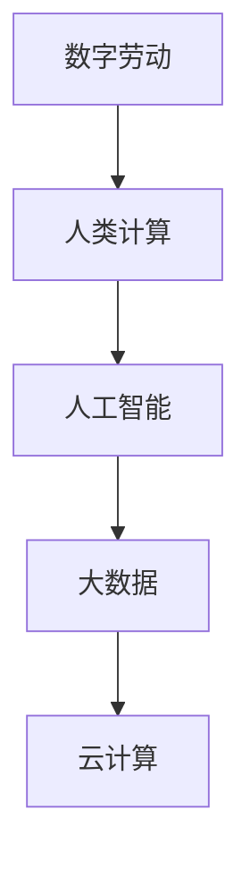

                 

关键词：数字劳动、人类计算、社会影响、经济影响、人工智能、数据分析

摘要：本文探讨了数字劳动的概念及其在社会和经济领域中的影响。通过分析人类计算的优势和挑战，本文探讨了数字劳动如何改变我们的工作和生活方式。本文还讨论了数字劳动在未来社会和经济中的潜在趋势和挑战。

## 1. 背景介绍

随着信息技术的飞速发展，人类计算（Human Computation）作为一种新的劳动形式逐渐引起了广泛关注。人类计算是指通过人类认知能力来解决计算机难以处理的问题，实现人机协作。数字劳动（Digital Labor）则是指基于人类计算的一种新兴劳动形式，通过数字化手段完成各种任务，如数据标注、众包任务、虚拟助理等。

数字劳动的出现不仅改变了传统的劳动方式，也对社会的经济结构产生了深远的影响。本文将从以下几个方面展开分析：

1. 数字劳动的定义和核心概念
2. 数字劳动的社会影响
3. 数字劳动的经济影响
4. 数字劳动的未来发展趋势与挑战

## 2. 核心概念与联系

### 2.1 数字劳动的定义

数字劳动是指利用数字化技术，将人类认知能力和计算能力相结合，完成各种任务的过程。这些任务可以是简单的数据标注，也可以是复杂的决策支持。数字劳动的核心在于人机协作，通过计算机和人类的互动，实现任务的高效完成。

### 2.2 人类计算

人类计算是指利用人类认知能力来解决计算机难以处理的问题。例如，图像识别、自然语言处理、复杂决策等。人类计算的优势在于其灵活性和创造力，但同时也面临着效率低下和准确性不足的问题。

### 2.3 数字劳动与人类计算的联系

数字劳动和人类计算是密切相关的。数字劳动依赖于人类计算的能力，通过人机协作，实现任务的高效完成。同时，数字劳动的发展也推动了人类计算技术的进步，促进了人工智能、大数据等领域的发展。

### 2.4 Mermaid 流程图

下面是一个简单的 Mermaid 流程图，展示了数字劳动与人类计算之间的联系。



## 3. 核心算法原理 & 具体操作步骤

### 3.1 算法原理概述

数字劳动的核心算法是基于人工智能和大数据技术。通过训练模型，使计算机能够理解和处理人类语言、图像等信息，从而实现人机协作。具体来说，核心算法包括以下几个步骤：

1. 数据收集与处理：收集大量的数据，包括文本、图像、语音等，并对数据进行预处理，如去噪、标准化等。
2. 模型训练：使用收集到的数据训练模型，使模型能够理解和处理人类语言、图像等信息。
3. 任务分配与执行：根据任务的需求，将任务分配给人类计算员，由他们完成数据标注、决策支持等任务。
4. 结果汇总与优化：汇总人类计算员完成任务的结果，并对模型进行优化，提高其准确性和效率。

### 3.2 算法步骤详解

#### 3.2.1 数据收集与处理

数据收集与处理是数字劳动的基础。在这个阶段，需要收集大量的数据，包括文本、图像、语音等。这些数据可以来源于互联网、数据库、传感器等。收集到数据后，需要对数据进行预处理，如去噪、标准化等，以提高数据的质量。

#### 3.2.2 模型训练

模型训练是数字劳动的核心。在这个阶段，需要使用收集到的数据训练模型，使模型能够理解和处理人类语言、图像等信息。常见的训练方法包括深度学习、监督学习等。

#### 3.2.3 任务分配与执行

任务分配与执行是数字劳动的关键。在这个阶段，需要根据任务的需求，将任务分配给人类计算员。人类计算员可以通过众包平台、虚拟助理等方式完成任务。他们需要根据模型的指示，完成数据标注、决策支持等任务。

#### 3.2.4 结果汇总与优化

结果汇总与优化是数字劳动的最后一个阶段。在这个阶段，需要汇总人类计算员完成任务的结果，并对模型进行优化，提高其准确性和效率。通过不断的迭代和优化，可以使数字劳动更加高效、准确。

### 3.3 算法优缺点

#### 优点

1. 高效：数字劳动能够通过人机协作，实现任务的高效完成。
2. 灵活：数字劳动可以处理各种复杂任务，具有很高的灵活性。
3. 低成本：数字劳动可以大规模使用众包平台，降低人力成本。

#### 缺点

1. 准确性：人类计算员的准确性和一致性难以保证，可能影响任务的准确性。
2. 数据质量：数据收集和处理的质量直接影响数字劳动的效果。
3. 道德和隐私问题：数字劳动可能涉及道德和隐私问题，如数据泄露、用户隐私等。

### 3.4 算法应用领域

数字劳动的应用领域非常广泛，包括但不限于以下几个方面：

1. 数据分析：通过数字劳动，可以高效完成大量数据的数据标注和分析。
2. 决策支持：数字劳动可以帮助企业进行市场调研、风险评估等决策支持。
3. 智能客服：数字劳动可以用于智能客服系统，提高客户服务质量。
4. 网络安全：数字劳动可以用于网络安全监测和攻击预测。

## 4. 数学模型和公式 & 详细讲解 & 举例说明

### 4.1 数学模型构建

在数字劳动中，常见的数学模型包括线性回归、神经网络等。下面以神经网络为例，介绍数学模型的构建过程。

#### 4.1.1 神经网络基本概念

神经网络是一种模拟人脑神经元连接方式的计算模型。它由多个神经元（节点）组成，每个神经元都与其他神经元相连，并通过权重进行传递。

#### 4.1.2 神经网络结构

神经网络的结构可以分为输入层、隐藏层和输出层。输入层接收外部输入信息，隐藏层对输入信息进行加工和处理，输出层产生最终输出。

#### 4.1.3 神经网络训练

神经网络训练是指通过调整神经网络的权重，使其能够对输入信息进行正确分类或预测。常用的训练方法包括反向传播算法。

### 4.2 公式推导过程

在神经网络训练过程中，常用的损失函数包括均方误差（MSE）和交叉熵（Cross-Entropy）。下面以均方误差为例，介绍损失函数的推导过程。

$$
MSE = \frac{1}{n} \sum_{i=1}^{n} (y_i - \hat{y}_i)^2
$$

其中，$y_i$ 表示实际输出，$\hat{y}_i$ 表示预测输出，$n$ 表示样本数量。

### 4.3 案例分析与讲解

#### 4.3.1 案例背景

假设我们有一个分类问题，需要将图像数据分为两类。我们可以使用神经网络模型进行分类。

#### 4.3.2 模型构建

输入层：接收图像的像素值。

隐藏层：对输入图像进行特征提取和加工。

输出层：产生分类结果。

#### 4.3.3 模型训练

使用均方误差作为损失函数，通过反向传播算法调整权重。

#### 4.3.4 模型评估

使用测试集对模型进行评估，计算分类准确率。

## 5. 项目实践：代码实例和详细解释说明

### 5.1 开发环境搭建

在开始数字劳动项目实践之前，我们需要搭建一个合适的开发环境。以下是一个简单的开发环境搭建步骤：

1. 安装 Python 解释器：在官网（https://www.python.org/）下载 Python 安装包，并按照提示安装。
2. 安装深度学习框架：我们选择使用 TensorFlow 作为深度学习框架。在终端执行以下命令：

```
pip install tensorflow
```

3. 安装其他依赖：根据项目需求，安装其他依赖，如 NumPy、Pandas 等。

### 5.2 源代码详细实现

下面是一个简单的数字劳动项目示例，实现一个基于神经网络的分类任务。

```python
import tensorflow as tf
from tensorflow.keras import layers

# 定义模型
model = tf.keras.Sequential([
    layers.Dense(128, activation='relu', input_shape=(784,)),
    layers.Dense(10, activation='softmax')
])

# 编译模型
model.compile(optimizer='adam',
              loss='categorical_crossentropy',
              metrics=['accuracy'])

# 加载数据集
(x_train, y_train), (x_test, y_test) = tf.keras.datasets.mnist.load_data()

# 数据预处理
x_train = x_train.astype("float32") / 255
x_test = x_test.astype("float32") / 255

# 拆分数据集
x_train = x_train.reshape((-1, 784))
x_test = x_test.reshape((-1, 784))

# 编码标签
y_train = tf.keras.utils.to_categorical(y_train, 10)
y_test = tf.keras.utils.to_categorical(y_test, 10)

# 训练模型
model.fit(x_train, y_train, epochs=5, batch_size=32)

# 评估模型
model.evaluate(x_test, y_test)
```

### 5.3 代码解读与分析

上面的代码实现了一个基于神经网络的分类任务。首先，我们定义了一个序列模型，包含一个 128 个神经元的隐藏层和一个 10 个神经元的输出层。接着，我们使用 Adam 优化器和交叉熵损失函数编译模型。然后，我们加载数据集并进行预处理，包括归一化和标签编码。最后，我们使用训练集训练模型，并在测试集上进行评估。

## 6. 实际应用场景

数字劳动在实际应用场景中具有广泛的应用。以下是一些典型的实际应用场景：

1. 数据分析：通过数字劳动，可以高效完成大量数据的数据标注和分析。例如，在金融领域，数字劳动可以用于市场调研、风险评估等。
2. 智能客服：数字劳动可以用于智能客服系统，提高客户服务质量。例如，通过数字劳动，可以自动回答用户问题、处理投诉等。
3. 网络安全：数字劳动可以用于网络安全监测和攻击预测。例如，通过数字劳动，可以实时监测网络流量，识别潜在的安全威胁。
4. 医疗诊断：数字劳动可以用于医疗诊断，提高诊断准确率。例如，通过数字劳动，可以自动识别医学图像中的病变区域。

## 7. 工具和资源推荐

### 7.1 学习资源推荐

1. 《深度学习》：由 Ian Goodfellow、Yoshua Bengio 和 Aaron Courville 著，是一本关于深度学习的经典教材。
2. 《Python数据分析》：由 Wes McKinney 著，是一本关于 Python 数据分析的入门书籍。

### 7.2 开发工具推荐

1. TensorFlow：由 Google 开发的一款开源深度学习框架，适用于各种深度学习任务。
2. Jupyter Notebook：一款流行的交互式开发环境，适用于 Python 开发。

### 7.3 相关论文推荐

1. "Deep Learning": Ian Goodfellow, Yoshua Bengio, Aaron Courville
2. "Data-Driven Discovery and Design of New Materials and Coatings Using Machine Learning": Chris J. Burges, Richard A. Olsson
3. "Human Computation: A Practical Guide to Data-Smart Applications": Luis Von Ahn, Shimon Whiteson
## 8. 总结：未来发展趋势与挑战

### 8.1 研究成果总结

通过本文的分析，我们可以看到数字劳动作为一种新兴的劳动形式，已经在社会和经济领域产生了深远的影响。数字劳动通过人类计算和人工智能技术，实现了任务的高效完成，提高了生产力和效率。同时，数字劳动也为人们提供了更多的就业机会，改变了传统的劳动结构。

### 8.2 未来发展趋势

展望未来，数字劳动将继续快速发展，并在以下几个方面得到进一步应用和拓展：

1. 智能化：随着人工智能技术的不断进步，数字劳动将更加智能化，实现更复杂的任务。
2. 网络化：数字劳动将更加依赖于网络和云计算，实现大规模协作和数据共享。
3. 自动化：数字劳动将逐渐实现自动化，减少人工干预，提高效率。
4. 个性化：数字劳动将更加注重个性化服务，满足用户多样化的需求。

### 8.3 面临的挑战

然而，数字劳动的发展也面临着一系列挑战：

1. 道德和隐私问题：数字劳动涉及到大量的个人数据和隐私，如何保护用户隐私成为一大挑战。
2. 技术障碍：数字劳动依赖于人工智能和大数据技术，如何提高技术水平，实现更高效、准确的任务完成，仍需进一步研究。
3. 就业结构变化：数字劳动可能导致就业结构的变化，如何应对新的就业形势，保障劳动者权益，也是一个重要课题。
4. 社会融合：数字劳动的发展可能会加剧社会不平等，如何促进社会融合，实现公平发展，是未来需要关注的问题。

### 8.4 研究展望

针对数字劳动的未来发展趋势和挑战，我们提出以下研究展望：

1. 道德和隐私问题：加强法律法规建设，明确数字劳动中的道德和隐私标准，保障用户权益。
2. 技术发展：加大人工智能和大数据技术的研发投入，提高数字劳动的效率和准确性。
3. 就业保障：建立数字劳动就业保障体系，提供职业培训，提升劳动者技能，促进就业转型。
4. 社会融合：通过政策引导，促进数字劳动与社会经济的深度融合，实现公平发展。

总之，数字劳动作为一项新兴的劳动形式，具有巨大的发展潜力。在未来，我们需要关注其发展过程中面临的各种挑战，通过技术创新、政策引导和社会融合，实现数字劳动的可持续发展，为社会和经济带来更大的价值。

## 9. 附录：常见问题与解答

### 9.1 什么是数字劳动？

数字劳动是指通过数字化手段完成各种任务的过程，包括数据标注、众包任务、虚拟助理等。数字劳动依赖于人类计算能力，通过人机协作实现任务的高效完成。

### 9.2 数字劳动有哪些优点？

数字劳动具有以下优点：

1. 高效：通过人机协作，实现任务的高效完成。
2. 灵活：可以处理各种复杂任务，具有很高的灵活性。
3. 低成本：可以大规模使用众包平台，降低人力成本。

### 9.3 数字劳动有哪些缺点？

数字劳动的缺点包括：

1. 准确性：人类计算员的准确性和一致性难以保证，可能影响任务的准确性。
2. 数据质量：数据收集和处理的质量直接影响数字劳动的效果。
3. 道德和隐私问题：数字劳动可能涉及道德和隐私问题，如数据泄露、用户隐私等。

### 9.4 数字劳动的应用领域有哪些？

数字劳动的应用领域非常广泛，包括数据分析、智能客服、网络安全、医疗诊断等。

### 9.5 数字劳动与人工智能的关系是什么？

数字劳动和人工智能是密切相关的。数字劳动依赖于人工智能技术，通过人机协作，实现任务的高效完成。同时，数字劳动的发展也推动了人工智能技术的进步。

